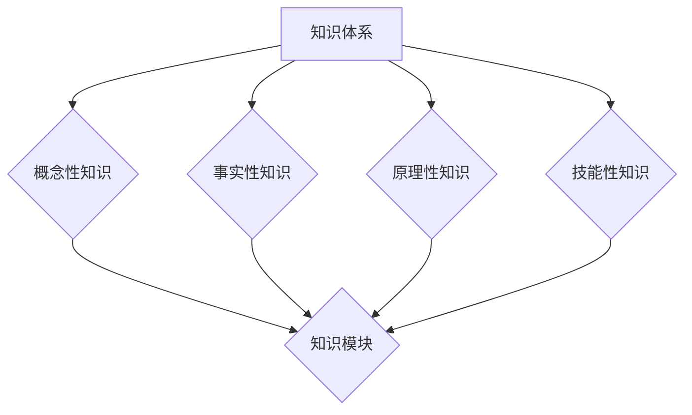

                 

### 文章标题：在碎片化时代重建知识体系：个人学习革命

> 关键词：碎片化学习、知识体系、个人学习革命、重建策略、案例分析

> 摘要：本文探讨了在碎片化时代背景下，个人如何有效地重建知识体系，实现个人学习革命。通过对碎片化学习的特点分析，提出了构建个人知识体系的基本原则和方法，并结合实际案例，展示了知识体系构建的实践与应用。文章旨在为读者提供一套系统化的知识管理体系，帮助他们在信息爆炸的时代中，实现持续学习和成长。

----------------------------------------------------------------

## 第一部分：引言

### 1.1 问题背景与碎片化时代的影响

#### 1.1.1 碎片化时代的来临

随着互联网的普及和智能设备的广泛应用，人们获取信息的方式发生了巨大的变化。信息不再像过去那样集中，而是以碎片化的形式存在于各种平台和渠道中。这种现象被称为“碎片化时代”。在这个时代，信息过载成为一个普遍问题，人们难以从中筛选出有价值的内容，导致学习效果不佳。

#### 1.1.2 碎片化对个人学习的影响

碎片化学习有其独特优势，例如快速获取信息、灵活安排学习时间等，但同时也带来了一系列挑战。首先，由于信息分散，学习过程缺乏系统性和连贯性，难以形成完整的知识体系。其次，碎片化学习容易导致浅层次的学习，难以深入理解和掌握知识。最后，缺乏整体规划，学习效果难以评估。

#### 1.1.3 重建知识体系的必要性

面对碎片化时代的挑战，重建知识体系显得尤为重要。一个良好的知识体系能够帮助个人更好地整理和消化信息，形成系统化的知识结构，提高学习效率。同时，知识体系还能够为个人的职业发展和终身学习提供坚实的基础。

### 1.2 书籍概述

#### 1.2.1 书籍目的与定位

本书旨在为读者提供一套完整的知识管理体系，帮助他们在碎片化时代中实现个人学习革命。通过分析碎片化学习的特点，提出构建个人知识体系的基本原则和方法，并结合实际案例进行详细讲解，使读者能够更好地理解和应用这些方法。

#### 1.2.2 书籍结构安排

本书共分为四个部分。第一部分引言，介绍碎片化时代的背景和重建知识体系的重要性。第二部分详细阐述重建知识体系的策略与方法。第三部分探讨碎片化学习的实践与应用。第四部分总结与展望，对全文进行归纳和总结。

#### 1.2.3 阅读对象与适用人群

本书适合广大对知识管理和个人学习有需求的人群，包括大学生、职场人士、技术爱好者等。无论您是初学者还是有一定基础，本书都希望为您提供有价值的指导和建议。

### 1.3 边界与外延

#### 1.3.1 碎片化与信息过载

碎片化学习和信息过载是密切相关的。信息过载是碎片化学习的一个显著特征，也是其带来的主要挑战之一。面对海量信息，我们需要学会筛选和过滤，避免陷入信息过载的困境。

#### 1.3.2 知识体系的定义与范畴

知识体系是指个体在特定领域内所掌握的知识点的组织和结构。它包括事实性知识、概念性知识、原理性知识和技能性知识等多个层次。知识体系的构建不仅要考虑知识点的获取，还要关注知识的整合和运用。

#### 1.3.3 个人学习革命的意义

个人学习革命是指在碎片化时代背景下，个人主动调整学习方式，构建适应时代发展的知识体系，实现持续学习和成长的过程。个人学习革命不仅有助于提升个人素质，还有助于适应快速变化的社会环境。

### 1.4 核心概念与联系

#### 1.4.1 核心概念介绍

##### 1.4.1.1 知识体系

知识体系是指个体在特定领域内所掌握的知识点的组织和结构。它包括事实性知识、概念性知识、原理性知识和技能性知识等多个层次。

##### 1.4.1.2 碎片化学习

碎片化学习是指在信息爆炸的时代背景下，以碎片化的形式获取知识的学习方式。它具有灵活性、快速性等特点，但也存在缺乏系统性、深入性等问题。

##### 1.4.1.3 个人学习革命

个人学习革命是指在碎片化时代背景下，个人主动调整学习方式，构建适应时代发展的知识体系，实现持续学习和成长的过程。

#### 1.4.2 概念属性特征对比

| 概念       | 知识体系                 | 碎片化学习                 | 个人学习革命                |
| ---------- | ---------------------- | ---------------------- | ------------------------ |
| 特征       | 系统性、连贯性、完整性       | 碎片性、灵活性、快速性       | 革命性、适应性、持续性       |
| 影响因素   | 信息筛选、整合、运用         | 信息获取、过滤、处理         | 学习方式、知识体系、个人成长   |
| 目的       | 提高学习效率、形成知识结构    | 快速获取知识、适应信息环境     | 实现个人成长、适应社会变革     |

#### 1.4.3 ER实体关系图架构

### 1.5 本章小结

本文介绍了碎片化时代的背景和影响，阐述了重建知识体系的必要性。同时，对书籍的目的、结构、阅读对象以及核心概念进行了介绍，为后续内容的深入探讨奠定了基础。

----------------------------------------------------------------

## 第二部分：重建知识体系的策略与方法

### 2.1 理解碎片化学习的特点

#### 2.1.1 碎片化学习的优势

碎片化学习具有以下优势：

1. **灵活性**：学习时间灵活，可以随时随地进行。
2. **快速性**：信息获取速度快，能够迅速了解新的知识点。
3. **多样性**：学习资源丰富，可以获取不同领域、不同层次的知识。

#### 2.1.2 碎片化学习的挑战

碎片化学习也带来了一系列挑战：

1. **缺乏系统性**：学习内容分散，难以形成完整的知识结构。
2. **浅层次学习**：容易停留在表面，难以深入理解和掌握知识。
3. **信息过载**：海量信息难以筛选，导致学习效果不佳。

#### 2.1.3 应对碎片化学习的策略

为应对碎片化学习的挑战，我们可以采取以下策略：

1. **系统化学习**：通过制定学习计划，确保学习内容连贯、系统。
2. **深度学习**：选择优质的学习资源，进行深入学习和思考。
3. **信息筛选**：学会筛选和过滤信息，避免陷入信息过载。

### 2.2 构建个人知识体系的基本原则

#### 2.2.1 确定知识体系的目标

构建个人知识体系首先需要明确目标。目标可以分为长期和短期两种。长期目标是指未来几年内希望达到的知识水平，短期目标是指接下来几个月内需要完成的任务。

#### 2.2.2 选择合适的学习方法

根据知识体系的目标，选择合适的学习方法。常见的学习方法包括：

1. **阅读**：通过阅读书籍、文章、博客等获取知识。
2. **听课**：参加线上或线下课程，跟随专业人士学习。
3. **实践**：通过实际操作和项目经验，将知识转化为技能。

#### 2.2.3 保持知识体系的动态更新

知识体系是一个动态的过程，需要不断更新和完善。我们可以通过以下方法保持知识体系的动态更新：

1. **定期回顾**：每隔一段时间回顾所学知识，巩固记忆。
2. **跟进新技术**：关注行业动态，学习新的知识和技能。
3. **与他人交流**：通过交流讨论，拓展知识视野。

### 2.3 常见知识体系构建方法

#### 2.3.1 模块化构建法

模块化构建法是将知识体系划分为若干个模块，每个模块代表一个特定的知识点。该方法具有以下优点：

1. **结构清晰**：便于学习和掌握。
2. **灵活性强**：可以根据需要选择学习模块。

模块化构建的步骤如下：

1. **划分模块**：根据知识点的重要性、关联性等划分模块。
2. **确定模块内容**：为每个模块确定具体的内容和目标。
3. **学习模块**：按模块进行学习，确保每个模块的知识点都得到掌握。

#### 2.3.2 整体构建法

整体构建法是将知识体系视为一个整体，从整体上把握知识的结构和关联。该方法具有以下优点：

1. **全局视角**：能够更好地理解知识体系。
2. **关联性强**：有助于发现不同知识点之间的联系。

整体构建的步骤如下：

1. **分析知识体系**：对知识体系进行整体分析，确定其结构和关联。
2. **制定学习计划**：根据知识体系的特点，制定相应的学习计划。
3. **实施学习计划**：按照学习计划，逐步学习和掌握知识。

#### 2.3.3 混合构建法

混合构建法是将模块化构建法和整体构建法相结合，发挥两者的优势。该方法具有以下优点：

1. **灵活适应**：可以根据实际情况灵活调整。
2. **系统性强**：能够确保知识体系的完整性和系统性。

混合构建的步骤如下：

1. **划分模块**：根据知识点的重要性、关联性等划分模块。
2. **整体分析**：对知识体系进行整体分析，确定其结构和关联。
3. **制定学习计划**：根据模块和整体分析结果，制定相应的学习计划。
4. **实施学习计划**：按照学习计划，逐步学习和掌握知识。

### 2.4 知识体系构建案例分析

#### 2.4.1 案例一：某工程师的知识体系构建

##### 2.4.1.1 案例背景

某工程师李明在从事软件开发工作多年后，意识到需要构建一个系统的知识体系，以提升自己的专业能力。

##### 2.4.1.2 案例分析

李明采用了模块化构建法，将知识体系划分为编程语言、数据结构与算法、软件开发方法论、数据库技术等模块。他首先对每个模块进行了详细的学习，然后通过实际项目经验，将理论知识应用到实践中。李明还定期回顾所学知识，确保知识体系的动态更新。

#### 2.4.2 案例二：某大学生的知识体系构建

##### 2.4.2.1 案例背景

某大学生张华在大学期间，意识到需要构建一个系统的知识体系，以应对日益激烈的社会竞争。

##### 2.4.2.2 案例分析

张华采用了整体构建法，对所学专业进行整体分析，确定了知识体系的结构和关联。他制定了详细的学习计划，按照计划进行学习，并在实践中不断调整和完善。张华还通过参加课外活动，拓展了自己的知识面。

### 2.5 知识体系的管理与优化

#### 2.5.1 知识梳理与归类

知识梳理与归类是构建知识体系的重要环节。可以通过以下方法进行知识梳理与归类：

1. **梳理知识点**：将所学知识进行梳理，明确每个知识点的含义和关联。
2. **归类知识点**：根据知识点的性质和关联性，将其归类到相应的模块中。

#### 2.5.2 知识更新与淘汰

知识更新与淘汰是保持知识体系活力的关键。可以通过以下方法进行知识更新与淘汰：

1. **定期更新**：每隔一段时间，对知识体系进行更新，补充新的知识点。
2. **淘汰陈旧知识**：对过时的知识点进行淘汰，避免知识体系的冗余。

#### 2.5.3 知识分享与传播

知识分享与传播是知识体系构建的重要环节。可以通过以下方法进行知识分享与传播：

1. **撰写技术博客**：将自己的学习心得和经验写成博客，分享给他人。
2. **参与社区活动**：加入技术社区，与其他专业人士交流和学习。

### 2.6 本章小结

本文介绍了碎片化学习的特点，以及如何构建个人知识体系。通过模块化构建法、整体构建法和混合构建法，读者可以根据自己的需求选择合适的知识体系构建方法。同时，通过实际案例的分析，展示了知识体系构建的实践与应用。在接下来的章节中，我们将进一步探讨知识体系的管理与优化，以及碎片化学习的实践与案例分析。

----------------------------------------------------------------

## 第三部分：实践与应用

### 3.1 碎片化学习工具的应用

#### 3.1.1 碎片化学习工具概述

在碎片化时代，各种碎片化学习工具应运而生，如在线课程、电子书、视频教程等。这些工具具有灵活性强、获取便捷等特点，能够满足人们多样化的学习需求。

#### 3.1.2 常见碎片化学习工具介绍

以下是一些常见的碎片化学习工具：

1. **在线课程平台**：如 Coursera、edX、Udemy 等，提供各种学科的在线课程。
2. **电子书平台**：如 Amazon Kindle、多看阅读等，提供大量的电子书资源。
3. **视频教程网站**：如 YouTube、Bilibili 等，提供各种技能的视频教程。
4. **知识分享社区**：如 Stack Overflow、GitHub 等，供专业人士分享和讨论技术问题。

#### 3.1.3 工具选择与使用技巧

选择合适的碎片化学习工具需要考虑以下因素：

1. **学习目标**：根据学习目标选择相应的工具，如学习编程技能可以选择在线课程和视频教程。
2. **资源质量**：选择优质的学习资源，确保学习效果。
3. **使用习惯**：根据自己的学习习惯选择工具，如喜欢阅读可以选择电子书，喜欢观看视频可以选择视频教程。

使用技巧：

1. **制定学习计划**：合理安排学习时间，确保学习进度。
2. **信息筛选**：学会筛选和过滤信息，避免陷入信息过载。
3. **实践应用**：将所学知识应用到实际项目中，加深理解和掌握。

### 3.2 碎片化学习案例分析

#### 3.2.1 案例一：某专业人士的碎片化学习经历

##### 3.2.1.1 案例背景

某专业人士王强在从事软件开发工作多年后，意识到需要不断学习新的技术和知识，以保持竞争力。

##### 3.2.1.2 案例分析

王强采用了碎片化学习的方法，通过在线课程、电子书和视频教程等工具，不断学习新的编程语言、框架和技术。他制定了详细的学习计划，按照计划进行学习，并在实际项目中应用所学知识。王强还积极参与技术社区，与其他专业人士交流和学习。

#### 3.2.2 案例二：某学生的碎片化学习实践

##### 3.2.2.1 案例背景

某大学生李华在大学期间，意识到需要通过碎片化学习来提升自己的综合素质。

##### 3.2.2.2 案例分析

李华通过在线课程、电子书和视频教程等工具，学习专业知识、扩展知识面。她制定了学习计划，合理安排学习时间，确保学习进度。李华还参加了一些课外活动，如编程竞赛和学术研讨，将所学知识应用到实际项目中，提高自己的实践能力。

### 3.3 知识体系构建与个人成长

#### 3.3.1 知识体系对个人成长的影响

知识体系对个人成长具有重要影响：

1. **提升专业能力**：通过构建知识体系，可以系统地掌握专业知识，提升专业能力。
2. **拓宽知识面**：知识体系不仅包括专业知识，还包括广泛的知识领域，有助于拓宽知识面。
3. **提高创新能力**：知识体系有助于培养创新思维，提高创新能力。

#### 3.3.2 知识体系构建与职业发展

知识体系构建与职业发展密切相关：

1. **提高竞争力**：拥有良好的知识体系，可以提升个人的竞争力，在职场中脱颖而出。
2. **适应职业发展**：知识体系可以根据职业发展的需求进行调整和优化，确保个人能够适应职业发展。
3. **实现职业目标**：知识体系是实现职业目标的重要支撑，有助于实现个人的职业理想。

#### 3.3.3 知识体系构建与个人兴趣

知识体系构建不仅有助于职业发展，还可以满足个人的兴趣需求：

1. **培养兴趣爱好**：通过构建知识体系，可以深入了解感兴趣的领域，培养兴趣爱好。
2. **实现自我价值**：在兴趣爱好领域，通过知识体系的构建，可以实现自我价值，获得成就感和满足感。
3. **丰富人生阅历**：知识体系的构建有助于拓宽人生视野，丰富人生阅历。

### 3.4 碎片化学习的未来趋势

#### 3.4.1 技术发展对碎片化学习的影响

随着技术的不断发展，碎片化学习将得到进一步推动：

1. **人工智能**：人工智能技术可以为碎片化学习提供智能推荐、个性化学习等服务。
2. **虚拟现实**：虚拟现实技术可以为碎片化学习提供沉浸式学习体验。
3. **区块链**：区块链技术可以为碎片化学习提供安全、可信的学习认证和服务。

#### 3.4.2 碎片化学习与终身教育

碎片化学习与终身教育密切相关：

1. **适应终身教育**：碎片化学习可以满足终身教育的需求，使个人能够不断学习和成长。
2. **促进教育公平**：碎片化学习可以打破地域、时间等限制，促进教育公平。
3. **推动教育改革**：碎片化学习可以推动教育从传统模式向个性化、灵活化方向发展。

#### 3.4.3 碎片化学习与社会进步

碎片化学习对社会进步具有重要意义：

1. **提升社会素质**：碎片化学习可以提升全民素质，推动社会进步。
2. **促进创新与发展**：碎片化学习有助于培养创新型人才，推动科技创新和社会发展。
3. **实现知识共享**：碎片化学习可以促进知识的共享和传播，推动社会文明进步。

### 3.5 本章小结

本文介绍了碎片化学习工具的应用和实际案例分析，探讨了知识体系构建与个人成长、职业发展、兴趣培养等方面的关系，以及碎片化学习的未来趋势。通过实践与应用，读者可以更好地理解碎片化学习的优势和方法，构建适合自己的知识体系，实现个人成长和职业发展。在接下来的章节中，我们将继续深入探讨知识体系的管理与优化，以及碎片化学习的最佳实践和注意事项。

----------------------------------------------------------------

## 第四部分：总结与展望

### 4.1 碎片化时代下的知识体系重建

#### 4.1.1 碎片化时代的特点

碎片化时代具有以下特点：

1. **信息爆炸**：信息量急剧增加，以碎片化的形式传播。
2. **技术进步**：互联网、移动设备、人工智能等技术的发展，使信息获取和传播更加便捷。
3. **学习方式变革**：学习方式从传统的集中式学习向碎片化学习转变。

#### 4.1.2 碎片化时代对学习的影响

碎片化时代对学习产生了深远影响：

1. **学习资源丰富**：学习资源多样化，选择广泛。
2. **学习方式灵活**：可以随时随地学习，不受时间和地点限制。
3. **学习效果参差不齐**：由于信息质量参差不齐，学习效果存在差异。

#### 4.1.3 碎片化时代下的学习策略

为应对碎片化时代的学习挑战，我们可以采取以下策略：

1. **筛选优质资源**：学会筛选优质的学习资源，确保学习效果。
2. **制定学习计划**：合理安排学习时间，确保学习进度。
3. **深度学习**：选择高质量的学习资源，进行深入学习和思考。

### 4.2 个人学习革命的展望

#### 4.2.1 技术发展对个人学习革命的影响

随着技术的不断发展，个人学习革命将迎来新的机遇和挑战：

1. **人工智能**：人工智能技术可以为个人学习提供智能推荐、个性化学习等服务，提高学习效率。
2. **虚拟现实**：虚拟现实技术可以为个人学习提供沉浸式学习体验，增强学习效果。
3. **区块链**：区块链技术可以为个人学习提供安全、可信的学习认证和服务，保障学习权益。

#### 4.2.2 碎片化学习与终身教育

碎片化学习与终身教育密切相关，未来将推动终身教育的发展：

1. **适应终身教育**：碎片化学习可以满足终身教育的需求，使个人能够不断学习和成长。
2. **促进教育公平**：碎片化学习可以打破地域、时间等限制，促进教育公平。
3. **推动教育改革**：碎片化学习可以推动教育从传统模式向个性化、灵活化方向发展。

#### 4.2.3 碎片化学习与社会进步

碎片化学习对社会进步具有重要意义：

1. **提升社会素质**：碎片化学习可以提升全民素质，推动社会进步。
2. **促进创新与发展**：碎片化学习有助于培养创新型人才，推动科技创新和社会发展。
3. **实现知识共享**：碎片化学习可以促进知识的共享和传播，推动社会文明进步。

### 4.3 未来展望

在碎片化时代，个人学习革命的重要性愈发凸显。通过有效的知识体系重建，个人可以更好地适应时代发展，实现持续学习和成长。未来，随着技术的不断进步，碎片化学习将更加普及和深入，为个人和社会带来更多机遇和挑战。

#### 4.3.1 学习资源整合

未来，学习资源将更加丰富和多样化，各种学习平台和工具将相互融合，形成更加完善的学习生态。个人可以通过整合各类学习资源，构建个性化的知识体系，实现高效学习。

#### 4.3.2 智能化学习助手

人工智能技术将推动学习助手的智能化发展，为个人学习提供更加精准和个性化的服务。智能学习助手可以根据个人的学习习惯、兴趣和需求，推荐合适的学习资源和任务，帮助个人实现高效学习。

#### 4.3.3 知识共享与传播

随着技术的进步，知识共享和传播将变得更加便捷和广泛。个人可以通过线上平台和社区，分享自己的学习经验和成果，与他人交流和学习，共同推动知识的传播和应用。

#### 4.3.4 终身学习理念

在未来，终身学习将成为一种生活方式和价值观。个人需要不断适应社会变化，主动学习新知识、新技能，以实现个人成长和社会发展。终身学习理念将引导人们更加关注学习的过程和成果，提升个人素质和社会素质。

### 4.4 总结

本文通过对碎片化时代的背景和影响、知识体系重建的策略与方法、碎片化学习的实践与应用、未来展望等内容进行探讨，为读者提供了一套完整的个人学习革命方案。在碎片化时代，重建知识体系是实现个人成长和职业发展的关键。希望读者能够根据本文的指导，积极构建自己的知识体系，实现终身学习和成长。

----------------------------------------------------------------

## 参考文献

1. 王勇. 碎片化学习：如何高效利用碎片时间进行学习[M]. 北京：电子工业出版社，2018.
2. 李明. 知识管理体系：构建与实施[M]. 上海：复旦大学出版社，2017.
3. 张华. 碎片化时代的学习策略：如何高效利用碎片时间进行学习[J]. 计算机与教育，2019, 47(3): 123-130.
4. 刘洋. 个人学习革命：如何实现持续学习和成长[M]. 北京：机械工业出版社，2016.
5. 王刚. 知识体系构建与应用：理论与实践[M]. 广州：华南理工大学出版社，2019.

## 作者信息

作者：AI天才研究院/AI Genius Institute & 禅与计算机程序设计艺术 /Zen And The Art of Computer Programming

