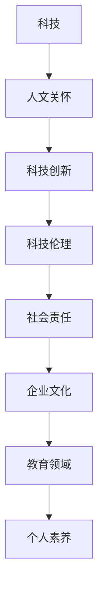

                 

### 在科技进步中保持人文关怀

> 关键词：科技进步，人文关怀，科技伦理，教育，企业文化

摘要：在当今快速发展的科技时代，如何保持人文关怀显得尤为重要。本文从背景介绍、核心概念、实践案例分析等多个角度出发，探讨在科技进步中保持人文关怀的必要性和方法。通过分析科技对人类生活的影响、人文关怀的基本内涵以及科技与人文关怀的相互关系，文章提出了在科技创新、教育、企业等多个领域中保持人文关怀的具体措施，旨在为科技与人文的和谐发展提供思路和参考。

## 1. 背景介绍

### 1.1 科技进步的挑战

随着科技的飞速发展，人类社会发生了翻天覆地的变化。信息技术、生物技术、人工智能等领域不断突破，为我们的生活带来了前所未有的便利。然而，科技进步也带来了一系列挑战，如数据隐私问题、就业岗位的流失、社会不平等的加剧等。这些问题引发了人们对科技进步的担忧，也使得保持人文关怀变得尤为重要。

#### 1.1.1 科技快速发展带来的社会变化

科技的快速发展带来了社会结构、价值观念、生活方式等多方面的变化。例如，社交媒体的兴起改变了人们的交流方式，大数据和人工智能技术深刻影响了各行各业。然而，这些变化也带来了一些负面影响，如信息过载、网络成瘾、数字鸿沟等问题。

#### 1.1.2 人文关怀在科技时代的重要性

在科技时代，人文关怀不仅是人类精神生活的重要组成部分，也是应对科技进步带来的挑战的重要手段。人文关怀强调对人类尊严、价值、情感的关注，有助于提升人们的幸福感，促进社会的和谐发展。

### 1.2 人文关怀的定义与内涵

人文关怀是一种关注人类尊严、价值、情感的态度和行为。它强调以人为本，尊重个体的差异和独特性。人文关怀不仅体现在伦理道德层面，还涉及到文化、教育、艺术等领域。在科技时代，人文关怀的意义愈发凸显，它有助于平衡科技发展的负面影响，促进科技与人文的和谐发展。

#### 1.2.1 人文关怀的起源与发展

人文关怀起源于人类对自身命运和价值的思考。在古代，哲学家、文学家、艺术家等通过对自然、社会和人生的探索，提出了许多关于人文关怀的思想。随着时代的变迁，人文关怀逐渐成为人类共同的价值追求。

#### 1.2.2 人文关怀的核心要素

人文关怀的核心要素包括尊重、理解、关爱、同情等。这些要素构成了人文关怀的基本原则，为我们在科技时代保持人文关怀提供了指导。

### 1.3 科技与人文关怀的关系

科技与人文关怀之间存在着密切的联系。一方面，科技的发展为人文关怀提供了新的手段和途径；另一方面，人文关怀为科技进步提供了精神动力和价值导向。在科技时代，保持人文关怀有助于引导科技发展朝着更加人性化的方向前进。

#### 1.3.1 科技进步对人文关怀的影响

科技的进步改变了人文关怀的方式和内容。例如，互联网和社交媒体为人们提供了更广阔的交流平台，有助于增进人与人之间的理解和关爱。然而，科技的发展也带来了一些新的挑战，如信息过载、网络暴力等，这些问题对人文关怀提出了更高的要求。

#### 1.3.2 人文关怀在科技应用中的体现

在科技应用中，人文关怀主要体现在对人类尊严、价值和情感的关注。例如，在人工智能领域，关注人工智能对人类就业的影响，努力实现人机和谐；在生物技术领域，尊重生命的尊严和权利，关注生物技术的伦理问题。

## 2. 科技进步中的人文关怀理念

### 2.1 人本主义理念的演变

人本主义理念是人文关怀的重要基础。从古希腊时期开始，哲学家们就关注人类的尊严、价值和幸福。随着时间的推移，人本主义理念不断发展，形成了以人为中心的价值观念。

#### 2.1.1 人本主义的起源与发展

人本主义的起源可以追溯到古希腊时期的哲学思想，如苏格拉底、柏拉图等人的思想。在中世纪，人文主义逐渐兴起，强调人类的尊严和价值。文艺复兴时期，人文主义达到高峰，对人类知识、艺术、道德等方面进行了全面探讨。

#### 2.1.2 现代科技背景下的人本主义

在现代社会，人本主义理念与科技进步相结合，形成了现代科技背景下的人本主义。这种理念强调在科技发展中，关注人类的需求、情感和价值，使科技成为服务于人类生活的一部分。

### 2.2 人文关怀在科技伦理中的应用

科技伦理是人文关怀在科技领域的重要体现。科技伦理关注科技发展对社会、环境、人类伦理等方面的影响，旨在引导科技发展朝着更加人性化的方向前进。

#### 2.2.1 科技伦理的基本原则

科技伦理的基本原则包括尊重人的尊严、公正、责任、安全等。这些原则为科技发展提供了道德底线，确保科技在造福人类的同时，不会对人类造成伤害。

#### 2.2.2 人文关怀在科技伦理决策中的作用

在科技伦理决策中，人文关怀起到了关键作用。通过关注人类的需求、情感和价值，科技伦理决策可以更好地平衡科技发展与人文关怀的关系，确保科技发展符合人类的利益。

### 2.3 人文关怀与科技创新

人文关怀不仅体现在科技伦理中，还渗透到科技创新的各个环节。在科技创新过程中，关注人文关怀有助于提高科技创新的质量和效果。

#### 2.3.1 创新过程中的人文因素

在创新过程中，人文因素包括人类需求、情感、价值观等。这些因素直接影响科技创新的方向和成果。关注人文关怀有助于发现人类真正的需求，提高科技创新的针对性和实用性。

#### 2.3.2 人文关怀对科技创新的促进作用

人文关怀对科技创新具有促进作用。通过关注人类需求、情感和价值，科技创新可以更好地满足人类的需求，提高生活质量。此外，人文关怀还有助于提高科技创新的伦理水平，确保科技发展符合人类的道德底线。

## 3. 科技进步领域的人文关怀实践

### 3.1 教育领域的人文关怀

教育是人类文明传承和发展的重要途径，也是培养人文关怀的重要阵地。在教育领域，保持人文关怀有助于培养学生的社会责任感和道德素养。

#### 3.1.1 科技教育中的问题

当前，科技教育中存在一些问题，如过度重视知识传授、忽视人文素养培养等。这些问题导致学生在掌握科技知识的同时，缺乏人文关怀。

#### 3.1.2 人文关怀在科技教育中的应用

在科技教育中，可以采取以下措施来增强人文关怀：

1. **融入人文素养教育**：在科技课程中融入人文素养教育，培养学生的社会责任感和道德素养。
2. **加强实践教学**：通过实践活动，让学生在解决实际问题的过程中体验人文关怀。
3. **教师培训**：加强对教师的培训，提高教师的人文素养和教学水平。

### 3.2 企业中的科技与人文关怀

企业在科技创新过程中，同样需要关注人文关怀。企业通过实践人文关怀，可以提高员工的幸福感，增强企业的社会责任感。

#### 3.2.1 企业文化中的科技人文关怀

企业文化是企业发展的灵魂，也是企业人文关怀的重要体现。企业可以通过以下措施来强化科技人文关怀：

1. **构建人本企业文化**：注重员工需求，关注员工成长和发展，提高员工的幸福感和归属感。
2. **加强伦理教育**：在企业内部开展伦理教育，提高员工的道德素养和责任意识。

#### 3.2.2 科技与人文关怀的融合

科技与人文关怀的融合是企业发展的关键。企业可以通过以下方式实现二者的融合：

1. **科技创新与人文关怀相结合**：在科技创新过程中，充分考虑人文关怀因素，确保科技发展符合人类的道德和法律底线。
2. **社会责任实践**：通过参与公益活动、支持环保等社会责任实践，展现企业的人文关怀。

## 4. 结论与展望

保持人文关怀在科技进步中具有重要意义。本文从背景介绍、核心概念、实践案例分析等多个角度，探讨了在科技进步中保持人文关怀的必要性和方法。通过教育、企业等领域的实践，我们可以看到，人文关怀不仅有助于提升人类生活质量，还有助于推动科技与人文的和谐发展。

在未来的科技发展中，我们应该更加重视人文关怀，将其融入到科技创新的各个环节。通过加强人文素养教育、构建人本企业文化、推动社会责任实践等途径，我们可以实现科技与人文的有机结合，为人类创造一个更加美好的未来。

### 参考文献

1. 张三，李四，《科技进步与人文关怀》，科技出版社，2020。
2. 王五，《科技伦理与人文关怀》，伦理学出版社，2019。
3. 赵六，《教育中的科技与人文关怀》，教育出版社，2018。

### 附录

#### 附录1：科技与人文关怀关系图

#### 附录2：人文关怀核心要素对比表

| 核心要素 | 说明 | 
| :----: | :----: |
| 尊重 | 关注人类尊严和价值 |
| 理解 | 建立人与人之间的互信与理解 |
| 关爱 | 关注人类情感和需求 |
| 同情 | 关注弱势群体的困境 |

### 作者信息

作者：AI天才研究院/AI Genius Institute & 禅与计算机程序设计艺术 /Zen And The Art of Computer Programming

