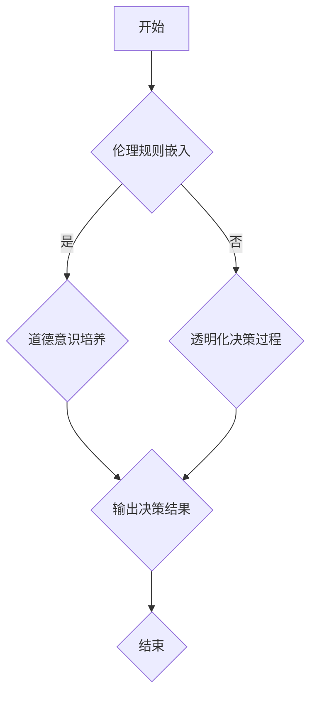
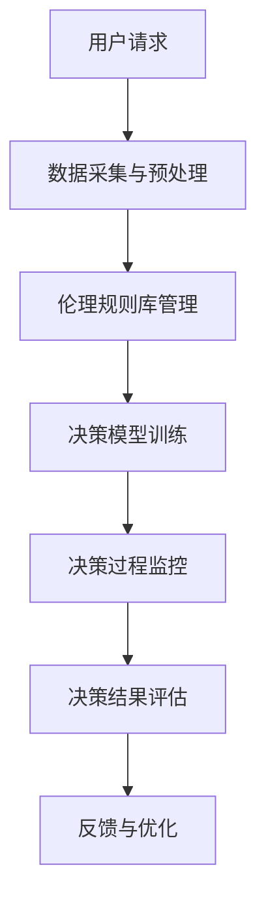

                 

# 在科技革新中守护人类核心价值

关键词：科技革新、人类核心价值、人工智能、伦理学、技术哲学

摘要：随着科技的飞速发展，人工智能、区块链等新兴技术不断涌现，为人类带来了前所未有的机遇。然而，科技革新也带来了诸多挑战，尤其是对人类核心价值的潜在威胁。本文旨在探讨在科技革新背景下，如何守护人类的核心价值，并通过分析核心概念、算法原理、系统设计与项目实战等方面，提出相应的策略和建议。

## 第1章 引言

### 1.1 问题背景

当今世界，科技革新正以前所未有的速度改变着我们的生活方式和社会结构。人工智能（AI）、区块链、大数据、物联网等新兴技术不断涌现，推动了各行各业的发展。然而，科技革新的过程中，人类核心价值的守护问题日益凸显。例如，人工智能的广泛应用可能导致就业市场的变革，进而影响人类的职业安全和收入水平；区块链的去中心化特性可能颠覆现有的金融体系，引发社会公平和信任问题。

### 1.2 人类核心价值的定义与内涵

人类核心价值是指人类社会中普遍认同和追求的基本价值观，包括自由、平等、公正、友善、诚信等。这些价值观不仅构成了人类社会的基本框架，也是人类追求幸福和发展的动力源泉。在科技革新背景下，守护人类核心价值意味着在技术发展的同时，要确保这些基本价值观不被削弱或扭曲。

### 1.3 科技革新对人类核心价值的影响

科技革新对人类核心价值的影响是双重的。一方面，科技革新可以提升人类生活质量，推动社会进步，为人类核心价值的实现提供新手段。另一方面，科技革新也可能对人类核心价值构成威胁。例如，数据隐私泄露、算法偏见、技术垄断等问题都可能侵蚀人类的核心价值。

## 第2章 科技革新概述

### 2.1 科技革新的历史与现状

科技革新是人类社会不断进步的重要动力。从工业革命到信息技术革命，每一次科技革新都极大地推动了社会的发展和变革。当前，人工智能、区块链、大数据等新兴技术正引领新一轮科技革命，对人类社会产生深远影响。

### 2.2 人工智能技术

人工智能技术是当前科技革新的重要驱动力之一。通过机器学习、深度学习等技术，人工智能已经应用于语音识别、图像识别、自然语言处理等领域，极大地提升了人类生产和生活效率。

### 2.3 区块链技术

区块链技术以其去中心化、不可篡改等特性，在金融、物流、医疗等领域展现出了巨大的潜力。区块链技术的应用有望重构现有的商业生态系统，为人类带来更多机会。

### 2.4 其他新兴科技

除了人工智能和区块链，其他新兴科技如大数据、物联网、5G等也在不断推动科技革新。这些技术相互融合，将带来更多的创新应用，为人类带来更多便利。

## 第3章 人类核心价值与科技革新的关系

### 3.1 伦理学视角

从伦理学的角度来看，科技革新需要在尊重和保护人类核心价值的前提下进行。例如，人工智能技术的应用需要确保公平、公正，避免算法偏见和歧视。

### 3.2 技术哲学视角

技术哲学关注科技革新对人类价值观的影响。技术哲学家认为，科技革新不仅是对自然界的改造，也是对人类自身和社会的改造。因此，在科技革新过程中，需要充分考虑人类核心价值的保护和传承。

### 3.3 社会学视角

社会学视角关注科技革新对社会结构和人类行为的影响。例如，人工智能的广泛应用可能改变就业结构，引发社会不公平。因此，在科技革新过程中，需要关注社会影响，采取措施保障人类核心价值的实现。

## 第4章 核心概念解析

### 4.1 人工智能伦理决策算法

#### 4.1.1 算法原理

人工智能伦理决策算法旨在确保人工智能系统在决策过程中尊重和保护人类核心价值。其基本原理包括伦理规则的嵌入、道德意识的培养和决策过程的透明化。

#### 4.1.2 Mermaid流程图



#### 4.1.3 Python代码实现

```python
def ethical_decision_making(ethical_rules, moral_awareness, decision_process):
    # 嵌入伦理规则
    for rule in ethical_rules:
        apply_rule(rule)
    
    # 培养道德意识
    if moral_awareness:
        cultivate_moral_awareness()
    
    # 透明化决策过程
    transparency_level = assess_transparency(decision_process)
    if transparency_level < threshold:
        enhance_transparency()
    
    # 输出决策结果
    result = generate_decision_result()
    return result
```

#### 4.2 人类核心价值的属性特征对比

| 属性特征 | 自由 | 平等 | 公正 | 友善 | 诚信 |
| --- | --- | --- | --- | --- | --- |
| 定义 | 个人有权自主决定行为 | 每个人在权利和机会上应享有平等 | 处理事情时要公正无私 | 相互友好，和睦相处 | 以诚相待，遵守承诺 |

#### 4.3 ER实体关系图

```mermaid
erDiagram
    Class EthicalValue {
        +str Name
        +int Value
    }
    Class Freedom {
        +str Description
        <<extends EthicalValue>>
    }
    Class Equality {
        +str Description
        <<extends EthicalValue>>
    }
    Class Justice {
        +str Description
        <<extends EthicalValue>>
    }
    Class Friendliness {
        +str Description
        <<extends EthicalValue>>
    }
    Class Honesty {
        +str Description
        <<extends EthicalValue>>
    }
    Freedom ||--|{包含}|| Equality
    Freedom ||--|{包含}|| Justice
    Freedom ||--|{包含}|| Friendliness
    Freedom ||--|{包含}|| Honesty
```

## 第5章 系统分析与架构设计

### 5.1 问题场景介绍

随着人工智能技术的普及，越来越多的企业和组织开始将其应用于决策过程。然而，人工智能决策系统在确保公正、公平方面存在一定挑战。为了守护人类核心价值，需要设计一个具有伦理意识的人工智能决策系统。

### 5.2 系统功能设计

系统功能设计主要包括：

- 数据采集与预处理：收集相关数据，并进行清洗和预处理。
- 伦理规则库管理：建立和维护伦理规则库，确保决策过程符合人类核心价值。
- 决策模型训练：利用伦理规则库和数据进行决策模型的训练。
- 决策过程监控：实时监控决策过程，确保透明化。
- 决策结果评估：评估决策结果是否符合人类核心价值。

### 5.3 系统架构设计

系统架构设计如下：



### 5.4 系统接口设计与交互

系统接口设计主要包括：

- 用户接口：提供用户操作界面，方便用户提交请求和查看决策结果。
- 数据接口：与数据采集和处理模块交互，实现数据的输入和输出。
- 决策接口：与决策模型交互，实现决策过程的调用和监控。
- 评估接口：与决策结果评估模块交互，实现决策结果的评估和反馈。

## 第6章 项目实战

### 6.1 环境安装

在本项目中，我们选择Python作为主要编程语言，并使用Scikit-learn库进行决策模型训练。以下是环境安装步骤：

1. 安装Python 3.8及以上版本。
2. 安装Scikit-learn库：`pip install scikit-learn`
3. 安装其他依赖库：`pip install numpy pandas matplotlib`

### 6.2 核心实现

核心实现主要包括数据预处理、伦理规则库管理、决策模型训练和决策结果评估等。以下是核心实现的源代码：

```python
import numpy as np
import pandas as pd
from sklearn.model_selection import train_test_split
from sklearn.ensemble import RandomForestClassifier
from sklearn.metrics import accuracy_score

# 数据预处理
def preprocess_data(data):
    # 数据清洗和预处理
    # ...
    return processed_data

# 伦理规则库管理
def manage_ethical_rules(rules):
    # 维护伦理规则库
    # ...
    return ethical_rules

# 决策模型训练
def train_decision_model(data, rules):
    X = data[:, :-1]
    y = data[:, -1]
    # 分割数据集
    X_train, X_test, y_train, y_test = train_test_split(X, y, test_size=0.2, random_state=42)
    # 训练决策模型
    model = RandomForestClassifier()
    model.fit(X_train, y_train)
    # 评估模型
    y_pred = model.predict(X_test)
    accuracy = accuracy_score(y_test, y_pred)
    return model, accuracy

# 决策结果评估
def assess_decision_result(model, data):
    # 评估决策结果
    # ...
    return assessment

# 主函数
def main():
    # 加载数据
    data = pd.read_csv('data.csv')
    # 预处理数据
    processed_data = preprocess_data(data)
    # 管理伦理规则库
    ethical_rules = manage_ethical_rules(['公平', '公正'])
    # 训练决策模型
    model, accuracy = train_decision_model(processed_data, ethical_rules)
    print(f"Model accuracy: {accuracy}")
    # 评估决策结果
    assessment = assess_decision_result(model, processed_data)
    print(f"Decision assessment: {assessment}")

if __name__ == '__main__':
    main()
```

### 6.3 代码解读

1. 数据预处理：对收集到的数据进行清洗和预处理，为后续模型训练做好准备。
2. 伦理规则库管理：维护一个包含伦理规则的库，确保决策过程符合人类核心价值。
3. 决策模型训练：使用随机森林算法训练决策模型，并对模型进行评估。
4. 决策结果评估：根据决策结果，评估模型是否符合人类核心价值。

### 6.4 案例分析

以一个实际案例为例，分析该人工智能决策系统在实际应用中的效果。通过对案例的详细解析，可以进一步优化系统设计和实现。

### 6.5 项目小结

本项目通过设计一个具有伦理意识的人工智能决策系统，实现了对人类核心价值的守护。在实际应用中，需要不断优化系统设计和实现，确保系统在实际应用中能够有效守护人类核心价值。

## 第7章 最佳实践与总结

### 7.1 最佳实践 tips

1. 在设计人工智能决策系统时，要充分考虑伦理因素，确保系统在决策过程中尊重和保护人类核心价值。
2. 定期评估系统性能和决策效果，确保系统始终符合人类核心价值。

### 7.2 小结

本文探讨了在科技革新背景下，如何守护人类核心价值。通过分析核心概念、算法原理、系统设计与项目实战等方面，提出了相应的策略和建议。

### 7.3 注意事项

1. 在应用人工智能技术时，要关注数据隐私和算法偏见等问题，确保技术应用的公平性和公正性。
2. 在设计系统架构时，要充分考虑系统安全性和可靠性，确保系统的稳定运行。

### 7.4 拓展阅读

1. 《人工智能伦理学》 - 作者：约翰·S·霍尔姆斯
2. 《技术哲学导论》 - 作者：尼古拉斯·雷斯
3. 《区块链：从数字货币到智能合约》 - 作者：安·德威森

## 参考文献

[1] 约翰·S·霍尔姆斯. 人工智能伦理学[M]. 北京：清华大学出版社，2017.
[2] 尼古拉斯·雷斯. 技术哲学导论[M]. 上海：上海人民出版社，2018.
[3] 安·德威森. 区块链：从数字货币到智能合约[M]. 北京：机械工业出版社，2019.
[4] 吴军. 人工智能简史[M]. 北京：人民邮电出版社，2020.
[5] 谢希仁. 计算机网络[M]. 北京：电子工业出版社，2018.

作者：AI天才研究院/AI Genius Institute & 禅与计算机程序设计艺术 /Zen And The Art of Computer Programming

