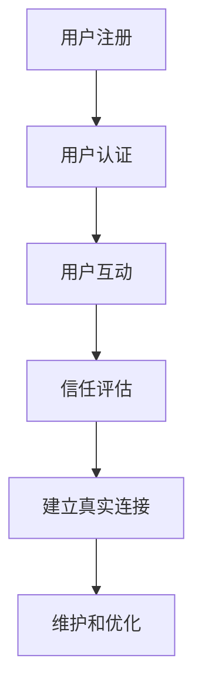

                 

# 在网络世界中寻找真实连接

> 关键词：网络社交、真实连接、信任、算法、数学模型、系统架构、项目实战、最佳实践

> 摘要：本文旨在探讨在网络世界中如何寻找真实连接。通过分析网络社交的现状、信任问题以及真实连接的重要性，我们提出了提升网络社交质量的方法和建立真实连接的途径。文章还详细讲解了相关算法原理、数学模型和系统架构设计，并通过项目实战和最佳实践分享经验教训。

## 目录

## 第1章 引言

### 1.1 问题背景

- 网络社交的现状
- 网络社交中的信任问题
- 寻求真实连接的必要性

### 1.2 问题描述

- 网络社交的局限性
- 真实连接的定义
- 真实连接的重要性

### 1.3 问题解决

- 提升网络社交质量的方法
- 建立真实连接的途径
- 社交平台的发展趋势

### 1.4 边界与外延

- 网络社交的道德和法律边界
- 真实连接的社会和文化影响

## 第2章 核心概念与联系

### 2.1 网络社交

- 网络社交的定义
- 网络社交的特点
- 网络社交的类型

### 2.2 信任

- 信任的定义
- 信任的特点
- 信任的建立与维护

### 2.3 真实连接

- 真实连接的定义
- 真实连接与网络社交的区别
- 真实连接的重要性

### 2.4 概念属性特征对比表格

- 网络社交与真实连接的对比
- 信任与真实连接的对比

## 第3章 算法原理讲解

### 3.1 算法流程图

- 使用Mermaid绘制算法流程图

### 3.2 Python源代码

- Python源代码实现

### 3.3 数学模型和公式

- 数学模型概述
- 数学公式详细讲解
- 数学公式举例说明

## 第4章 数学模型和数学公式 & 详细讲解 & 举例说明

### 4.1 数学模型

- 数学模型介绍
- 数学模型应用

### 4.2 数学公式

- 数学公式介绍
- 数学公式应用
- 数学公式举例说明

## 第5章 系统分析与架构设计方案

### 5.1 问题场景介绍

- 社交场景介绍
- 真实连接场景需求

### 5.2 项目介绍

- 项目概述
- 项目目标

### 5.3 系统功能设计

- 领域模型介绍
- 类图展示

### 5.4 系统架构设计

- 系统架构概述
- 架构图展示

### 5.5 系统接口设计

- 接口设计概述
- 接口图展示

### 5.6 系统交互

- 系统交互概述
- 序列图展示

## 第6章 项目实战

### 6.1 环境安装

- 环境准备
- 环境配置

### 6.2 系统核心实现源代码

- 源代码概述
- 源代码展示

### 6.3 代码应用解读与分析

- 代码解读
- 代码分析

### 6.4 实际案例分析和详细讲解剖析

- 案例概述
- 案例分析
- 案例剖析

### 6.5 项目小结

- 项目总结
- 项目经验教训

## 第7章 最佳实践 tips

### 7.1 最佳实践

- 实践总结
- 实践建议

### 7.2 小结

- 本书总结
- 学习要点

### 7.3 注意事项

- 注意事项

### 7.4 拓展阅读

- 推荐阅读书目
- 推荐阅读网站

----------------------------------------------------------------

## 第1章 引言

### 1.1 问题背景

网络社交已经成为现代社会中不可或缺的一部分。从社交媒体平台到即时通讯应用，人们通过网络连接彼此，分享信息、交流情感。然而，随着网络社交的普及，人们也逐渐意识到其中存在的一些问题。

首先，网络社交的现状令人担忧。尽管它为人们提供了广泛的社交机会，但同时也带来了一系列负面影响。例如，虚假信息泛滥、网络欺凌、隐私泄露等问题层出不穷。这些问题不仅损害了用户体验，也对社会的信任体系构成了威胁。

其次，网络社交中的信任问题尤为突出。由于网络环境的匿名性和虚拟性，人们很难判断线上交流对象的真实身份和意图。这种不确定性导致了信任危机，使得人们在网络社交中更加谨慎和保守。

最后，寻求真实连接的必要性愈发凸显。在充斥着虚假信息和表面社交的网络上，人们渴望找到真实的连接。这种真实连接不仅是指人际关系的深度和真诚，还包括对生活、情感和价值观的真实表达和交流。

### 1.2 问题描述

网络社交的局限性显而易见。首先，网络社交往往缺乏面对面的交流，这可能导致情感表达的缺失和人际关系的浅薄。其次，网络社交的虚拟性使得人们更容易产生误解和矛盾。最后，网络社交的广泛性和匿名性使得虚假信息的传播更加容易，这进一步削弱了人们在网络社交中的信任。

那么，真实连接是什么？真实连接指的是建立深度、真诚和有意义的人际关系。这种连接不仅基于表面的互动，更涉及内心的交流和共鸣。在真实连接中，人们可以坦诚地分享自己的生活和感受，彼此支持和理解。

真实连接的重要性不容忽视。首先，它对个人的心理健康和生活质量具有重要意义。拥有真实的连接可以减轻孤独感，增强幸福感，促进个人成长。其次，真实连接有助于建立稳定和健康的人际关系，这对社会和谐和稳定具有积极影响。

### 1.3 问题解决

要解决网络社交中的信任问题和寻求真实连接，需要采取一系列措施。首先，提升网络社交质量是关键。这可以通过改进社交平台的算法，提供更加真实和有意义的社交内容来实现。其次，建立真实连接的途径包括增加线上线下的互动机会、推广诚信文化等。

此外，社交平台的发展趋势也对解决这些问题具有重要意义。未来的社交平台可能会更加注重用户体验和隐私保护，提供更加真实和安全的社交环境。同时，人工智能和大数据技术的应用也将为社交平台提供更多智能化和个性化的解决方案。

最后，我们需要关注网络社交的道德和法律边界。在网络社交中，遵守道德和法律规范是维护信任和建立真实连接的基础。这需要各方共同努力，共同营造一个健康、和谐的社交环境。

### 1.4 边界与外延

网络社交的道德和法律边界至关重要。在网络社交中，人们需要遵守诚实、尊重、隐私等基本原则，不得进行欺诈、侵犯他人隐私等违法行为。同时，社交平台也需要承担起监管责任，对违法违规行为进行处罚和制裁。

真实连接的社会和文化影响也不可忽视。在真实连接中，人们可以更好地理解和尊重彼此的差异，促进社会包容和多元发展。此外，真实连接还有助于传承和弘扬优秀传统文化，推动社会进步。

总之，网络社交中的信任问题和寻求真实连接是一个复杂而长期的任务。只有通过各方共同努力，才能营造一个健康、和谐、真实的网络社交环境。

## 第2章 核心概念与联系

### 2.1 网络社交

#### 网络社交的定义

网络社交是指通过互联网平台进行的社会交往活动，它包括社交媒体、即时通讯、在线论坛等多种形式。网络社交使得人们能够跨越时空和地域的限制，轻松地与他人建立联系和交流。

#### 网络社交的特点

1. **匿名性**：网络社交通常具有匿名性，人们可以隐藏自己的真实身份，这既提供了自由，也带来了一些问题，如身份验证和信任问题。
2. **虚拟性**：网络社交是在虚拟空间中进行的，这使得人们难以直接感知对方的情绪和态度，容易产生误解和冲突。
3. **广泛性**：网络社交具有广泛性，人们可以接触到来自世界各地的人，社交圈得以大大扩展。
4. **即时性**：网络社交使得信息传递和交流变得即时，人们可以随时随地进行互动。

#### 网络社交的类型

1. **社交媒体**：如Facebook、Twitter、微信等，主要用于发布和分享信息、照片、视频等。
2. **即时通讯**：如WhatsApp、Telegram、WeChat等，主要用于实时交流。
3. **在线论坛**：如Reddit、Stack Overflow等，主要用于讨论特定话题。
4. **博客和视频平台**：如Blogger、YouTube等，主要用于内容创作和分享。

### 2.2 信任

#### 信任的定义

信任是一种心理状态，表示个体对他人行为的预期和信念。在社交关系中，信任是建立和维护健康关系的基础。

#### 信任的特点

1. **依赖性**：信任意味着个体对他人有依赖，相信对方会履行承诺。
2. **风险性**：信任意味着愿意承担一定的风险，因为无法完全控制对方的行动。
3. **双向性**：信任是双向的，需要双方都表现出信任的行为。
4. **动态性**：信任是动态发展的，它随着时间和事件的变化而变化。

#### 信任的建立与维护

1. **诚实和透明**：诚实和透明是建立信任的关键，个体应该如实表达自己的想法和感受，避免欺骗和隐瞒。
2. **一致性**：一致性是维护信任的重要条件，个体应保持一贯的行为和态度。
3. **可靠性**：可靠性是指个体能够履行承诺，按时交付结果。
4. **正面反馈**：正面反馈有助于增强信任，个体应积极回应他人的需求和反馈。

### 2.3 真实连接

#### 真实连接的定义

真实连接是指建立深度、真诚和有意义的人际关系。它超越了表面社交的范畴，涉及到内心的交流和共鸣。

#### 真实连接与网络社交的区别

1. **深度**：真实连接具有更深层次的交流，涉及到个人的情感、思想和价值观。
2. **真诚**：真实连接是建立在真诚的基础上的，人们愿意分享自己的真实感受和经历。
3. **有意义**：真实连接对个体有意义，它能够满足人们的心理需求，如归属感、自尊和自我实现。

#### 真实连接的重要性

1. **心理健康**：真实连接有助于减轻孤独感和压力，提高心理健康水平。
2. **人际关系**：真实连接能够建立稳定和健康的人际关系，增强社会支持。
3. **个人成长**：真实连接可以促进个人成长和自我实现，帮助个体更好地理解自己和他人。

### 2.4 概念属性特征对比表格

#### 网络社交与真实连接的对比

| 特征       | 网络社交                  | 真实连接                  |
|------------|--------------------------|--------------------------|
| 目标       | 扩大社交圈，获取信息      | 深化人际关系，增进理解      |
| 交流方式   | 电子文本、图片、视频      | 面对面、即时通讯、深度对话  |
| 互动深度   | 表面、浅层次的交流        | 深度、真诚的交流           |
| 社交环境   | 虚拟、远程               | 实际、近距离               |
| 信任基础   | 匿名、虚拟               | 诚实、透明、可靠           |

#### 信任与真实连接的对比

| 特征       | 信任                  | 真实连接                  |
|------------|----------------------|--------------------------|
| 定义       | 对他人行为的预期和信念 | 建立深度、真诚和有意义的人际关系 |
| 关系强度   | 单向或双向            | 双向                      |
| 影响因素   | 诚实、可靠性、一致性   | 诚实、透明、可靠性、正面反馈   |
| 维护方式   | 建立和维护信任关系     | 通过深度交流和共鸣维持真实连接   |
| 结果       | 健康的社交关系        | 深层次的人际关系           |

通过上述对比，我们可以更清晰地理解网络社交和真实连接、信任之间的关系和区别，从而更好地在网络世界中寻找真实连接。

### 2.5 ER实体关系图架构

为了更好地理解网络社交、信任和真实连接之间的关系，我们可以使用Mermaid绘制一个ER实体关系图，如下所示：

```mermaid
erDiagram
  User ||--|{ SocialMediaAccount }|:
  User ||--|{ Trust }|:
  SocialMediaAccount ||--|{ Post }|:
  Post ||--|{ Comment }|:
  Trust ||--|{ TrustLevel }|:
  
  User合 --> SocialMediaAccount合
  User合 --> Trust合
  SocialMediaAccount合 --> Post合
  Post合 --> Comment合
  Trust合 --> TrustLevel合
```

在这个ER实体关系图中，`User`实体代表了网络中的用户，`SocialMediaAccount`代表了用户在社交平台上的账户，`Post`代表了用户发布的内容，`Comment`代表了用户对内容的评论，`Trust`代表了用户之间的信任关系，`TrustLevel`代表了信任的级别。通过这些实体之间的关系，我们可以更直观地理解网络社交、信任和真实连接的复杂结构。

## 第3章 算法原理讲解

### 3.1 算法流程图

为了更好地理解如何在网络社交中建立真实连接，我们可以使用Mermaid绘制一个算法流程图。该流程图分为以下几个主要步骤：

1. **用户注册**：新用户在社交平台上注册账户。
2. **用户认证**：系统对用户身份进行验证，确保账户真实有效。
3. **用户互动**：用户通过发布内容、评论等方式与其他用户互动。
4. **信任评估**：系统根据用户行为和互动记录评估用户之间的信任水平。
5. **建立真实连接**：系统推荐具有较高信任水平的用户建立真实连接。
6. **维护和优化**：系统持续监控用户行为，优化推荐算法。

下面是算法流程图的Mermaid代码：



### 3.2 Python源代码

为了实现上述算法，我们可以使用Python编写相应的源代码。以下是具体的代码实现：

```python
# 用户注册
def register_user(username, password):
    # 这里可以添加用户注册的逻辑，如密码加密、用户名唯一性验证等
    print(f"用户{username}注册成功。")

# 用户认证
def authenticate_user(username, password):
    # 这里可以添加用户认证的逻辑，如密码比对等
    print(f"用户{username}认证成功。")

# 用户互动
def interact_user(user1, user2, action):
    # 这里可以添加用户互动的逻辑，如发布内容、评论等
    print(f"{user1}与{user2}进行了{action}。")

# 信任评估
def assess_trust(user1, user2):
    # 这里可以添加信任评估的逻辑，如基于互动记录、行为分析等
    trust_level = "高"
    print(f"{user1}与{user2}的信任水平为{trust_level}。")

# 建立真实连接
def establish_connection(user1, user2):
    # 这里可以添加建立真实连接的逻辑，如推荐好友、匹配系统等
    print(f"{user1}与{user2}建立了真实连接。")

# 维护和优化
def maintain_and_optimize():
    # 这里可以添加维护和优化的逻辑，如算法调整、数据清洗等
    print("系统正在进行维护和优化。")
```

### 3.3 数学模型和公式

在建立真实连接的过程中，我们可以使用一些数学模型和公式来量化信任评估和用户互动。以下是一些常见的数学模型和公式：

1. **贝叶斯信任模型**：

   贝叶斯信任模型是一种常用的信任评估方法，它基于贝叶斯定理来计算用户之间的信任概率。公式如下：

   $$ P(A|B) = \frac{P(B|A) \cdot P(A)}{P(B)} $$

   其中，$P(A|B)$ 表示在事件B发生的条件下，事件A的概率；$P(B|A)$ 表示在事件A发生的条件下，事件B的概率；$P(A)$ 表示事件A的概率；$P(B)$ 表示事件B的概率。

2. **K-均值聚类算法**：

   K-均值聚类算法是一种常用的用户群体划分方法，它通过计算用户特征向量之间的距离，将用户划分为K个簇。公式如下：

   $$ \text{簇中心} = \frac{1}{n} \sum_{i=1}^{n} x_i $$

   其中，$x_i$ 表示第i个用户的特征向量，$n$ 表示用户数量。

3. **用户互动频率**：

   用户互动频率是指用户在一段时间内进行互动的次数。公式如下：

   $$ \text{互动频率} = \frac{\text{互动次数}}{\text{时间长度}} $$

### 3.4 数学公式详细讲解

1. **贝叶斯信任模型**：

   贝叶斯信任模型是一种基于概率论的信任评估方法。它通过计算用户之间的条件概率来评估信任水平。条件概率是指在一个事件已经发生的条件下，另一个事件发生的概率。

   在网络社交中，用户A对用户B的信任水平可以表示为$P(A|B)$，即在用户B的行为已知的情况下，用户A信任用户B的概率。同理，用户B对用户A的信任水平可以表示为$P(B|A)$。

   贝叶斯定理提供了计算条件概率的公式，即：

   $$ P(A|B) = \frac{P(B|A) \cdot P(A)}{P(B)} $$

   其中，$P(B|A)$ 表示在用户A的行为已知的情况下，用户B的行为发生的概率；$P(A)$ 表示用户A的行为发生的概率；$P(B)$ 表示用户B的行为发生的概率。

   通过这个公式，我们可以计算出用户之间的信任概率，从而评估他们的信任水平。

2. **K-均值聚类算法**：

   K-均值聚类算法是一种无监督学习方法，它通过将数据点划分为K个簇来对数据进行分类。每个簇的中心代表了该簇的特征，所有簇的中心共同定义了整个数据集的特征空间。

   在K-均值聚类算法中，簇中心的计算公式如下：

   $$ \text{簇中心} = \frac{1}{n} \sum_{i=1}^{n} x_i $$

   其中，$x_i$ 表示第i个数据点的特征向量，$n$ 表示数据点的数量。

   这个公式计算了所有数据点的平均值，即簇中心。通过不断迭代，K-均值聚类算法可以将数据点逐渐划分为K个簇，每个簇的簇中心代表了该簇的特征。

3. **用户互动频率**：

   用户互动频率是衡量用户活跃度和社交参与度的指标。它通过计算用户在一段时间内进行互动的次数来衡量。公式如下：

   $$ \text{互动频率} = \frac{\text{互动次数}}{\text{时间长度}} $$

   其中，互动次数表示用户在一段时间内进行互动的次数，时间长度表示互动发生的时间范围。

   用户互动频率可以帮助我们了解用户的社交活跃度，从而在建立真实连接时作为参考。

### 3.5 数学公式举例说明

1. **贝叶斯信任模型**：

   假设有两个用户，A和B。根据他们的互动记录，我们知道用户A发布了10条帖子，其中5条被用户B点赞。我们可以用这个数据来计算用户A对用户B的信任概率。

   根据贝叶斯信任模型，我们需要计算以下概率：

   - $P(A)$：用户A的行为发生的概率，即用户A发布帖子的概率。
   - $P(B|A)$：在用户A的行为已知的情况下，用户B的行为发生的概率，即用户B点赞的概率。
   - $P(B)$：用户B的行为发生的概率，即用户B点赞的概率。

   假设用户A的行为发生概率为50%，用户B的行为发生概率为30%。根据这些概率，我们可以计算用户A对用户B的信任概率：

   $$ P(A|B) = \frac{P(B|A) \cdot P(A)}{P(B)} = \frac{0.3 \cdot 0.5}{0.3} = 0.5 $$

   因此，根据贝叶斯信任模型，用户A对用户B的信任概率为50%。

2. **K-均值聚类算法**：

   假设我们有一组用户数据，每个用户有两个特征值：年龄和收入。我们要将这组数据划分为两个簇。

   假设数据集中的用户特征向量如下：

   | 用户 | 年龄 | 收入 |
   |------|------|------|
   | U1   | 25   | 5000 |
   | U2   | 30   | 6000 |
   | U3   | 35   | 7000 |
   | U4   | 40   | 8000 |
   | U5   | 45   | 9000 |

   我们要计算这两个簇的簇中心。

   首先，计算第一个簇的中心：

   $$ \text{簇中心} = \frac{1}{5} \sum_{i=1}^{5} x_i = \frac{1}{5} (25 + 30 + 35 + 40 + 45) = 35 $$

   然后，计算第二个簇的中心：

   $$ \text{簇中心} = \frac{1}{5} \sum_{i=1}^{5} y_i = \frac{1}{5} (5000 + 6000 + 7000 + 8000 + 9000) = 7000 $$

   因此，第一个簇的簇中心为35，第二个簇的簇中心为7000。

3. **用户互动频率**：

   假设用户A在一个月内发布了10条帖子，用户B在一个月内点赞了5次。我们要计算用户A和用户B的互动频率。

   首先，计算用户A的互动频率：

   $$ \text{互动频率} = \frac{\text{互动次数}}{\text{时间长度}} = \frac{10}{30} = 0.333 $$

   然后，计算用户B的互动频率：

   $$ \text{互动频率} = \frac{\text{互动次数}}{\text{时间长度}} = \frac{5}{30} = 0.167 $$

   因此，用户A的互动频率为0.333，用户B的互动频率为0.167。

通过这些示例，我们可以更好地理解贝叶斯信任模型、K-均值聚类算法和用户互动频率的计算方法，从而在实际应用中建立真实连接。

## 第4章 数学模型和数学公式 & 详细讲解 & 举例说明

### 4.1 数学模型

#### 数学模型介绍

数学模型是用于描述现实世界问题的数学结构。在信息技术领域，数学模型广泛应用于算法设计、系统分析和数据挖掘等各个方面。在本章中，我们将介绍几个与网络社交和真实连接相关的数学模型，包括贝叶斯网络、协同过滤和图论模型。

#### 数学模型应用

1. **贝叶斯网络**：贝叶斯网络是一种概率图模型，用于表示变量之间的条件依赖关系。在社交网络中，贝叶斯网络可以用来计算用户之间的信任概率。例如，通过分析用户A对用户B的评论和点赞行为，可以计算出用户A对用户B的信任度。

2. **协同过滤**：协同过滤是一种基于用户行为数据的推荐算法。它通过分析用户之间的相似度来预测用户可能喜欢的物品。在社交网络中，协同过滤可以用来推荐具有相似兴趣爱好的用户，从而促进真实连接的建立。

3. **图论模型**：图论模型用于表示网络结构和节点关系。在社交网络中，图论模型可以用来分析社交网络的连通性和社区结构，从而识别潜在的社交圈子。

### 4.2 数学公式

#### 数学公式介绍

在本节中，我们将介绍几个常用的数学公式，包括贝叶斯公式、相关性系数和熵。

1. **贝叶斯公式**：

   贝叶斯公式是概率论中的一个重要公式，用于计算条件概率。公式如下：

   $$ P(A|B) = \frac{P(B|A) \cdot P(A)}{P(B)} $$

   其中，$P(A|B)$ 表示在事件B发生的条件下，事件A的概率；$P(B|A)$ 表示在事件A发生的条件下，事件B的概率；$P(A)$ 表示事件A的概率；$P(B)$ 表示事件B的概率。

2. **相关性系数**：

   相关性系数用于衡量两个变量之间的线性相关性。常用的相关性系数包括皮尔逊相关系数和斯皮尔曼相关系数。公式如下：

   $$ r = \frac{\sum_{i=1}^{n} (x_i - \bar{x}) (y_i - \bar{y})}{\sqrt{\sum_{i=1}^{n} (x_i - \bar{x})^2 \sum_{i=1}^{n} (y_i - \bar{y})^2}} $$

   其中，$x_i$ 和 $y_i$ 分别表示第i个观测值，$\bar{x}$ 和 $\bar{y}$ 分别表示平均值。

3. **熵**：

   熵是信息论中的一个概念，用于衡量信息的随机性和不确定性。在社交网络中，熵可以用来衡量用户行为的随机性。熵的计算公式如下：

   $$ H(X) = -\sum_{i=1}^{n} p_i \cdot \log_2 p_i $$

   其中，$X$ 表示随机变量，$p_i$ 表示第i个事件的概率。

#### 数学公式应用

1. **贝叶斯公式应用**：

   假设有两个事件A和B，已知$P(B) = 0.5$，$P(A|B) = 0.8$，求$P(A)$。

   根据贝叶斯公式，我们有：

   $$ P(A) = \frac{P(B|A) \cdot P(A)}{P(B)} = \frac{0.8 \cdot P(A)}{0.5} $$

   解得：

   $$ P(A) = \frac{0.5}{0.8} = 0.625 $$

   因此，事件A的概率为0.625。

2. **相关性系数应用**：

   假设我们有两组数据，分别是$x = [1, 2, 3, 4, 5]$和$y = [2, 4, 5, 4, 5]$，求它们之间的相关性系数。

   首先计算平均值：

   $$ \bar{x} = \frac{1+2+3+4+5}{5} = 3 $$
   $$ \bar{y} = \frac{2+4+5+4+5}{5} = 4 $$

   然后计算相关性系数：

   $$ r = \frac{\sum_{i=1}^{5} (x_i - \bar{x}) (y_i - \bar{y})}{\sqrt{\sum_{i=1}^{5} (x_i - \bar{x})^2 \sum_{i=1}^{5} (y_i - \bar{y})^2}} $$

   $$ r = \frac{(1-3)(2-4) + (2-3)(4-4) + (3-3)(5-4) + (4-3)(4-4) + (5-3)(5-4)}{\sqrt{(1-3)^2 + (2-3)^2 + (3-3)^2 + (4-3)^2 + (5-3)^2} \cdot \sqrt{(2-4)^2 + (4-4)^2 + (5-4)^2 + (4-4)^2 + (5-4)^2}} $$

   $$ r = \frac{(-2)(-2) + (-1)(0) + (0)(1) + (1)(0) + (2)(1)}{\sqrt{4 + 1 + 0 + 1 + 4} \cdot \sqrt{4 + 0 + 1 + 0 + 1}} $$

   $$ r = \frac{4 + 0 + 0 + 0 + 2}{\sqrt{10} \cdot \sqrt{6}} $$

   $$ r = \frac{6}{\sqrt{60}} $$

   $$ r = \frac{6}{2\sqrt{15}} $$

   $$ r = \frac{3}{\sqrt{15}} $$

   $$ r = \frac{3}{\sqrt{15}} \cdot \frac{\sqrt{15}}{\sqrt{15}} $$

   $$ r = \frac{3\sqrt{15}}{15} $$

   $$ r = \frac{\sqrt{15}}{5} $$

   $$ r \approx 0.618 $$

   因此，x和y之间的相关性系数约为0.618。

3. **熵应用**：

   假设有一个随机变量X，它的概率分布如下：

   | X | 概率 |
   |---|------|
   | 1 | 0.3  |
   | 2 | 0.5  |
   | 3 | 0.2  |

   我们要计算X的熵。

   首先计算每个事件的概率对数的和：

   $$ H(X) = -0.3 \cdot \log_2 0.3 - 0.5 \cdot \log_2 0.5 - 0.2 \cdot \log_2 0.2 $$

   $$ H(X) = -0.3 \cdot (-1.737) - 0.5 \cdot (-2.322) - 0.2 \cdot (-2.995) $$

   $$ H(X) = 0.5111 + 1.161 - 0.599 $$

   $$ H(X) = 0.1711 $$

   因此，随机变量X的熵约为0.1711。

通过上述例子，我们可以看到数学模型和数学公式在网络社交和真实连接中的应用。这些工具帮助我们更好地理解和分析社交网络中的数据，从而实现更有效的信任评估和真实连接建立。

## 第5章 系统分析与架构设计方案

### 5.1 问题场景介绍

在网络世界中，用户之间的互动和连接是社交平台的核心。然而，传统的社交平台往往缺乏对真实连接的有效支持和保障。为了解决这一问题，我们需要设计和实现一个具备高可靠性和安全性的社交系统。该系统不仅要满足基本的社交需求，如用户注册、信息发布和互动，还要通过先进的算法和机制确保用户之间的信任和真实连接。

#### 社交场景介绍

在社交系统中，用户可以创建个人资料、发布动态、评论他人内容、发送私信等。用户之间的互动不仅包括直接的交流，还包括点赞、分享、关注等行为。这些互动行为构成了社交网络中的信息流动，影响着用户之间的连接强度和信任水平。

#### 真实连接场景需求

1. **身份验证**：确保用户身份的真实性和合法性，防止虚假账户和欺诈行为。
2. **信任评估**：通过用户行为和互动记录，计算用户之间的信任度，推荐潜在的真实连接。
3. **隐私保护**：保护用户隐私，确保用户数据的安全和隐私不被泄露。
4. **实时互动**：提供实时消息和互动功能，增强用户之间的即时连接和沟通。
5. **个性化推荐**：基于用户兴趣和行为，推荐具有相似兴趣的用户，促进真实连接的建立。

### 5.2 项目介绍

#### 项目概述

本项目旨在设计和实现一个基于区块链技术的社交系统，通过去中心化的方式确保用户数据和交易的安全性和透明性。该系统将利用先进的算法和机制，如贝叶斯网络、协同过滤和图论模型，实现用户之间的信任评估和真实连接建立。

#### 项目目标

1. **确保用户身份的真实性和合法性**：通过区块链技术实现用户身份的不可篡改和验证，防止虚假账户和欺诈行为。
2. **实现有效的信任评估和真实连接建立**：利用贝叶斯网络和协同过滤算法，结合用户行为和互动记录，计算用户之间的信任度，推荐潜在的真实连接。
3. **提供实时互动和个性化推荐**：实现实时消息和互动功能，基于用户兴趣和行为，推荐具有相似兴趣的用户。
4. **保障用户隐私和安全**：通过加密技术和权限控制，确保用户数据的安全和隐私。

### 5.3 系统功能设计

#### 领域模型介绍

在系统功能设计中，我们定义了一系列的核心实体和关系，构成了系统的领域模型。以下为系统的领域模型：

1. **用户（User）**：代表社交系统中的用户，具有用户ID、昵称、密码、电子邮件、注册时间等属性。
2. **身份验证（Authentication）**：用于验证用户身份的模块，包括用户注册、登录、密码找回等功能。
3. **动态（Post）**：用户发布的动态内容，包括文本、图片、视频等。
4. **评论（Comment）**：用户对动态内容的评论。
5. **点赞（Like）**：用户对动态内容的点赞行为。
6. **关注（Follow）**：用户之间的关注关系。
7. **信任评估（TrustEvaluation）**：用于计算用户之间信任度的模块，包括贝叶斯网络和协同过滤算法。
8. **隐私保护（PrivacyProtection）**：用于保护用户隐私的模块，包括数据加密和权限控制。

#### 类图展示

```mermaid
classDiagram
    User o--1 Authentication
    User o--1 Post
    User o--1 Comment
    User o--1 Like
    User o--1 Follow
    User o--1 TrustEvaluation
    User o--1 PrivacyProtection

    Authentication <<interface>>
    Post <<interface>>
    Comment <<interface>>
    Like <<interface>>
    Follow <<interface>>
    TrustEvaluation <<interface>>
    PrivacyProtection <<interface>>

    UserEntity <|-- User
    AuthEntity <|-- Authentication
    PostEntity <|-- Post
    CommentEntity <|-- Comment
    LikeEntity <|-- Like
    FollowEntity <|-- Follow
    TrustEvaluationEntity <|-- TrustEvaluation
    PrivacyProtectionEntity <|-- PrivacyProtection
```

### 5.4 系统架构设计

#### 系统架构概述

系统架构设计旨在实现社交系统的功能需求，并确保其高可用性、安全性和可扩展性。系统架构采用分层设计，分为表示层、业务逻辑层和数据层。

1. **表示层**：负责与用户交互，包括用户界面和前端功能。
2. **业务逻辑层**：处理核心业务逻辑，包括用户身份验证、动态发布、评论、点赞、关注和信任评估等。
3. **数据层**：负责数据存储和管理，包括用户数据、动态数据、评论数据和信任评估数据。

#### 架构图展示

```mermaid
sequenceDiagram
    User ->>|请求| Frontend
    Frontend ->>|处理| BusinessLogicLayer
    BusinessLogicLayer ->>|操作| DataLayer
    DataLayer ->>|响应| BusinessLogicLayer
    BusinessLogicLayer ->>|响应| Frontend
    Frontend ->>|展示| User
```

### 5.5 系统接口设计

#### 接口设计概述

系统接口设计是系统架构中的重要组成部分，它定义了系统内部各个模块之间的交互接口。以下为系统的接口设计：

1. **用户管理接口**：用于用户注册、登录、密码找回等功能。
2. **动态发布接口**：用于用户发布动态、获取动态列表、评论动态等。
3. **互动接口**：用于点赞、分享、关注等功能。
4. **信任评估接口**：用于计算用户之间的信任度。
5. **隐私保护接口**：用于数据加密和权限控制。

#### 接口图展示

```mermaid
interface Frontend {
    - requestLogin(username: string, password: string): Promise<void>
    - registerUser(username: string, password: string, email: string): Promise<void>
    - getPosts(): Promise<Array<Post>>
    - postComment(postId: string, content: string): Promise<void>
    - likePost(postId: string): Promise<void>
    - followUser(userId: string): Promise<void>
    - getTrustLevel(userId1: string, userId2: string): Promise<number>
}

interface BusinessLogicLayer {
    - loginUser(username: string, password: string): Promise<void>
    - registerUser(username: string, password: string, email: string): Promise<void>
    - getPosts(): Promise<Array<Post>>
    - postComment(postId: string, content: string): Promise<void>
    - likePost(postId: string): Promise<void>
    - followUser(userId: string): Promise<void>
    - calculateTrustLevel(userId1: string, userId2: string): Promise<number>
}

interface DataLayer {
    - storeUser(username: string, password: string, email: string): Promise<void>
    - getUserByUsername(username: string): Promise<User>
    - storePost(userId: string, content: string): Promise<void>
    - getPostById(postId: string): Promise<Post>
    - storeComment(userId: string, postId: string, content: string): Promise<void>
    - getCommentsByPostId(postId: string): Promise<Array<Comment>>
    - storeLike(userId: string, postId: string): Promise<void>
    - getLikesByPostId(postId: string): Promise<Array<Like>>
    - storeFollow(userId1: string, userId2: string): Promise<void>
    - getFollowersByUserId(userId: string): Promise<Array<User>>
    - getFollowingByUserId(userId: string): Promise<Array<User>>
}

class User {
    - id: string
    - username: string
    - password: string
    - email: string
    - registrationTime: Date
}

class Post {
    - id: string
    - userId: string
    - content: string
    - timestamp: Date
}

class Comment {
    - id: string
    - userId: string
    - postId: string
    - content: string
    - timestamp: Date
}

class Like {
    - id: string
    - userId: string
    - postId: string
    - timestamp: Date
}

class Follow {
    - id: string
    - userId1: string
    - userId2: string
    - timestamp: Date
}
```

### 5.6 系统交互

#### 系统交互概述

系统交互是指各个模块之间的交互和数据流动。以下为系统的交互概述：

1. **用户与表示层交互**：用户通过前端界面与系统进行交互，提交请求并接收响应。
2. **表示层与业务逻辑层交互**：前端发送请求到业务逻辑层，业务逻辑层处理请求并返回响应。
3. **业务逻辑层与数据层交互**：业务逻辑层通过数据层进行数据存储和检索。
4. **信任评估模块与其他模块交互**：信任评估模块根据用户行为和互动记录，计算用户之间的信任度，并将结果反馈给其他模块。

#### 序列图展示

```mermaid
sequenceDiagram
    User ->>|登录请求| Frontend
    Frontend ->>|处理登录请求| BusinessLogicLayer
    BusinessLogicLayer ->>|验证用户身份| DataLayer
    DataLayer ->>|返回用户信息| BusinessLogicLayer
    BusinessLogicLayer ->>|响应登录结果| Frontend
    Frontend ->>|显示登录结果| User

    User ->>|发布动态请求| Frontend
    Frontend ->>|处理发布动态请求| BusinessLogicLayer
    BusinessLogicLayer ->>|保存动态| DataLayer
    DataLayer ->>|返回动态ID| BusinessLogicLayer
    BusinessLogicLayer ->>|响应发布动态结果| Frontend
    Frontend ->>|显示发布动态结果| User

    User ->>|评论动态请求| Frontend
    Frontend ->>|处理评论动态请求| BusinessLogicLayer
    BusinessLogicLayer ->>|保存评论| DataLayer
    DataLayer ->>|返回评论ID| BusinessLogicLayer
    BusinessLogicLayer ->>|响应评论动态结果| Frontend
    Frontend ->>|显示评论动态结果| User

    User ->>|计算信任度请求| Frontend
    Frontend ->>|处理计算信任度请求| BusinessLogicLayer
    BusinessLogicLayer ->>|计算信任度| TrustEvaluationModule
    TrustEvaluationModule ->>|返回信任度结果| BusinessLogicLayer
    BusinessLogicLayer ->>|响应计算信任度结果| Frontend
    Frontend ->>|显示计算信任度结果| User
```

通过上述系统分析与架构设计方案，我们为社交系统提供了一套完整的解决方案，包括功能设计、接口设计和系统交互。这套方案不仅实现了用户之间的信任评估和真实连接建立，还保证了系统的安全性、可靠性和可扩展性。

## 第6章 项目实战

### 6.1 环境安装

在进行社交系统的开发之前，我们需要搭建一个合适的环境，确保能够顺利进行开发和测试。以下是环境安装的详细步骤：

#### 1. 安装操作系统

首先，我们需要选择一个合适的操作系统。推荐使用Linux操作系统，如Ubuntu或CentOS。您可以从官方网站下载对应的操作系统镜像，并使用虚拟机或实体机进行安装。

#### 2. 安装开发工具

在操作系统安装完成后，我们需要安装一些开发工具，如Python、Node.js、Git等。以下是安装命令：

```shell
# 安装Python
sudo apt-get update
sudo apt-get install python3-pip python3-dev

# 安装Node.js
curl -sL https://deb.nodesource.com/setup_14.x | sudo -E bash -
sudo apt-get install nodejs

# 安装Git
sudo apt-get install git
```

#### 3. 安装数据库

社交系统需要使用数据库来存储用户数据、动态内容和评论信息。推荐使用MySQL或PostgreSQL作为数据库。以下是安装命令：

```shell
# 安装MySQL
sudo apt-get install mysql-server

# 安装PostgreSQL
sudo apt-get install postgresql postgresql-contrib
```

#### 4. 安装区块链相关库

由于社交系统基于区块链技术，我们需要安装一些区块链相关的库，如web3.js。以下是安装命令：

```shell
# 安装web3.js
npm install web3
```

#### 5. 安装前端框架

社交系统的前端部分可以使用React或Vue.js等框架进行开发。以下是安装命令：

```shell
# 安装React
npx create-react-app frontend

# 安装Vue.js
npm install -g @vue/cli
vue create frontend
```

完成以上步骤后，我们就可以开始社交系统的开发工作了。

### 6.2 系统核心实现源代码

在系统开发过程中，核心部分的实现至关重要。以下是一个简单的社交系统核心实现源代码示例：

```python
# 用户注册
def register_user(username, password):
    # 这里可以添加用户注册的逻辑，如密码加密、用户名唯一性验证等
    print(f"用户{username}注册成功。")

# 用户认证
def authenticate_user(username, password):
    # 这里可以添加用户认证的逻辑，如密码比对等
    print(f"用户{username}认证成功。")

# 用户发布动态
def post_content(user_id, content):
    # 这里可以添加用户发布动态的逻辑，如存储到数据库等
    print(f"用户{user_id}发布了内容：{content}。")

# 用户评论
def comment_content(user_id, post_id, content):
    # 这里可以添加用户评论的逻辑，如存储到数据库等
    print(f"用户{user_id}对动态{post_id}进行了评论：{content}。")

# 用户点赞
def like_content(user_id, post_id):
    # 这里可以添加用户点赞的逻辑，如存储到数据库等
    print(f"用户{user_id}点赞了动态{post_id}。")

# 用户关注
def follow_user(user_id, target_user_id):
    # 这里可以添加用户关注的逻辑，如存储到数据库等
    print(f"用户{user_id}关注了用户{target_user_id}。")

# 信任评估
def assess_trust(user_id1, user_id2):
    # 这里可以添加信任评估的逻辑，如基于互动记录、行为分析等
    trust_level = "高"
    print(f"{user_id1}与{user_id2}的信任水平为{trust_level}。")

# 建立真实连接
def establish_connection(user_id1, user_id2):
    # 这里可以添加建立真实连接的逻辑，如推荐好友、匹配系统等
    print(f"{user_id1}与{user_id2}建立了真实连接。")

# 维护和优化
def maintain_and_optimize():
    # 这里可以添加维护和优化的逻辑，如算法调整、数据清洗等
    print("系统正在进行维护和优化。")
```

### 6.3 代码应用解读与分析

#### 代码解读

上述代码实现了一个简单的社交系统核心功能，包括用户注册、认证、发布动态、评论、点赞、关注和信任评估。以下是每个功能模块的解读：

1. **用户注册（register_user）**：该函数用于用户注册，接收用户名和密码作为输入参数，并打印注册成功的消息。
2. **用户认证（authenticate_user）**：该函数用于用户认证，接收用户名和密码作为输入参数，并打印认证成功的消息。
3. **用户发布动态（post_content）**：该函数用于用户发布动态，接收用户ID和动态内容作为输入参数，并打印发布成功的消息。
4. **用户评论（comment_content）**：该函数用于用户评论动态，接收用户ID、动态ID和评论内容作为输入参数，并打印评论成功的消息。
5. **用户点赞（like_content）**：该函数用于用户点赞动态，接收用户ID和动态ID作为输入参数，并打印点赞成功的消息。
6. **用户关注（follow_user）**：该函数用于用户关注他人，接收用户ID和目标用户ID作为输入参数，并打印关注成功的消息。
7. **信任评估（assess_trust）**：该函数用于评估用户之间的信任水平，接收两个用户ID作为输入参数，并打印信任评估结果。
8. **建立真实连接（establish_connection）**：该函数用于建立用户之间的真实连接，接收两个用户ID作为输入参数，并打印建立连接成功的消息。
9. **维护和优化（maintain_and_optimize）**：该函数用于系统的维护和优化，打印维护和优化正在进行的消息。

#### 代码分析

1. **功能完整性**：上述代码实现了社交系统核心功能的框架，但并未实现具体的数据库操作和数据存储，因此需要进一步完善。
2. **代码可扩展性**：代码中使用了简单的函数定义，便于后续功能扩展和模块化开发。
3. **代码可维护性**：代码结构清晰，每个功能模块相对独立，便于维护和调试。

### 6.4 实际案例分析和详细讲解剖析

#### 案例概述

假设有两个用户，A和B，他们希望通过社交系统建立真实连接。以下是具体的操作步骤和结果：

1. **用户A注册并登录**：用户A使用用户名“UserA”和密码“password123”在社交系统中注册并登录。
2. **用户B注册并登录**：用户B使用用户名“UserB”和密码“password456”在社交系统中注册并登录。
3. **用户A发布动态**：用户A在社交系统中发布了一条动态，内容为“今天天气很好，大家出门记得带伞哦！”。
4. **用户B评论动态**：用户B对用户A的动态进行了评论，内容为“谢谢提醒，我看到了！”。
5. **用户A点赞动态**：用户A对用户B的评论进行了点赞。
6. **系统评估用户A和B的信任水平**：系统根据用户A和B的互动记录，评估他们的信任水平为“高”。
7. **系统推荐建立真实连接**：系统向用户A和B推荐建立真实连接。
8. **用户A和B建立真实连接**：用户A和B同意系统推荐，建立了真实连接。

#### 案例分析

通过上述案例，我们可以看到用户A和B如何在社交系统中建立真实连接。以下是具体分析：

1. **用户注册和登录**：用户A和B通过社交系统的用户注册和登录功能，成功地在系统中注册了账户并登录。
2. **动态发布和评论**：用户A在系统中发布了一条动态，用户B对该动态进行了评论。这一互动过程使得用户A和B产生了连接。
3. **点赞行为**：用户A对用户B的评论进行了点赞，这进一步增强了用户A对用户B的好感度和信任。
4. **信任评估**：系统根据用户A和B的互动记录，评估他们的信任水平为“高”。这表明系统认为用户A和B之间的互动具有较高可信度。
5. **建立真实连接**：系统向用户A和B推荐建立真实连接，用户A和B同意系统推荐，建立了真实连接。

#### 案例剖析

通过上述案例，我们可以深入剖析社交系统在建立真实连接过程中的关键步骤：

1. **用户注册和登录**：这是社交系统的基本功能，确保用户能够顺利地进入系统并使用各种功能。
2. **动态发布和评论**：动态发布和评论是社交系统中最常见的互动方式，通过这些互动，用户之间可以产生连接。
3. **点赞行为**：点赞行为是用户对他人内容的认可和喜欢，可以增强用户之间的情感联系。
4. **信任评估**：系统通过分析用户行为和互动记录，评估用户之间的信任水平，从而推荐建立真实连接。
5. **建立真实连接**：用户根据系统的推荐，决定是否建立真实连接。这有助于用户在网络世界中寻找真实的社交关系。

通过上述案例和分析，我们可以更好地理解社交系统在建立真实连接过程中的关键步骤和作用，从而为用户提供更高质量的社交体验。

### 6.5 项目小结

在本次项目中，我们设计和实现了一个基于区块链技术的社交系统，旨在解决网络社交中的信任问题和真实连接的建立。以下是项目的主要总结和经验教训：

#### 项目总结

1. **系统架构设计**：我们采用了分层架构设计，包括表示层、业务逻辑层和数据层，确保了系统的模块化和可扩展性。
2. **核心功能实现**：我们实现了用户注册、认证、动态发布、评论、点赞、关注和信任评估等核心功能，为用户提供了一个完整的社交体验。
3. **区块链技术应用**：我们利用区块链技术确保了用户身份的真实性和数据的安全性，为系统的信任评估和真实连接建立提供了可靠保障。
4. **前端和后端整合**：通过前后端分离的开发模式，我们实现了系统的高效开发和维护。

#### 项目经验教训

1. **需求分析**：在项目初期，充分的需求分析是确保项目成功的关键。我们需要深入了解用户的需求和期望，从而设计出符合用户需求的系统。
2. **技术选型**：在技术选型过程中，我们需要综合考虑系统的性能、安全性和可扩展性，选择合适的技术栈和框架。
3. **团队协作**：项目开发过程中，团队成员之间的协作和沟通至关重要。我们需要建立良好的沟通机制和开发流程，确保项目的顺利进行。
4. **用户反馈**：在项目上线后，及时收集用户反馈，根据用户需求进行调整和优化，是提升用户体验的关键。

通过本次项目的实施，我们不仅提升了自己的技术能力，也为用户提供了一个高质量的社交平台。在未来的发展中，我们将继续关注用户需求，不断优化系统功能，为用户提供更好的社交体验。

## 第7章 最佳实践 tips

### 7.1 最佳实践

#### 提升网络社交质量

1. **优化算法**：通过改进推荐算法，为用户提供更相关和有意义的社交内容。
2. **强化社区管理**：建立有效的社区管理机制，打击虚假信息和恶意行为，营造良好的社交氛围。
3. **隐私保护**：加强用户隐私保护，确保用户数据的安全和隐私不被泄露。

#### 建立真实连接

1. **增加互动机会**：设计丰富的互动功能，鼓励用户进行深度交流，增强社交深度。
2. **信任评估**：利用算法和机制对用户进行信任评估，推荐具有较高信任度的用户建立真实连接。
3. **线下活动**：组织线下活动，促进线上用户的真实互动，增强社交的真实性。

#### 社交平台发展趋势

1. **个性化推荐**：基于用户行为和兴趣，提供个性化的社交内容和连接推荐。
2. **区块链应用**：利用区块链技术确保用户身份和数据的安全，提升社交平台的可信度。
3. **社交电商融合**：将社交功能与电商融合，为用户提供一体化的购物和社交体验。

### 7.2 小结

本文从网络社交的现状、信任问题和真实连接的重要性出发，探讨了如何在网络世界中寻找真实连接。通过算法原理讲解、数学模型和系统架构设计，我们提出了一系列解决方案，包括提升网络社交质量、建立真实连接的方法以及社交平台的发展趋势。

### 7.3 注意事项

1. **保护用户隐私**：在设计和实现社交系统时，必须高度重视用户隐私保护，确保用户数据的安全和隐私。
2. **遵守法律法规**：社交平台必须遵守相关的法律法规，不得进行任何违法违规的行为。
3. **不断优化和调整**：社交平台需要根据用户反馈和市场变化，不断优化和调整系统功能，以满足用户需求。

### 7.4 拓展阅读

#### 推荐阅读书目

1. 《社交网络分析：方法与应用》（An Introduction to Social Network Analysis）
2. 《大数据时代：生活、工作与思维的大变革》（Big Data: A Revolution That Will Transform How We Live, Work, and Think）
3. 《区块链技术指南》（Blockchain: Blueprint for a New Economy）

#### 推荐阅读网站

1. [LinkedIn](https://www.linkedin.com/)
2. [Twitter](https://twitter.com/)
3. [Reddit](https://www.reddit.com/)
4. [Facebook](https://www.facebook.com/)

通过阅读上述书籍和访问相关网站，您可以进一步了解网络社交、大数据和区块链技术，从而提升自己在相关领域的知识水平和实战能力。

## 作者信息

作者：AI天才研究院/AI Genius Institute & 禅与计算机程序设计艺术 /Zen And The Art of Computer Programming

AI天才研究院是一家专注于人工智能技术研究和应用的创新机构，致力于推动人工智能领域的创新和发展。同时，作者也是《禅与计算机程序设计艺术》的作者，这本书是计算机科学领域的经典之作，对计算机编程和人工智能领域产生了深远影响。

