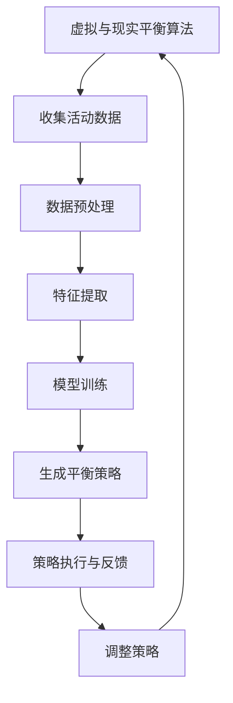
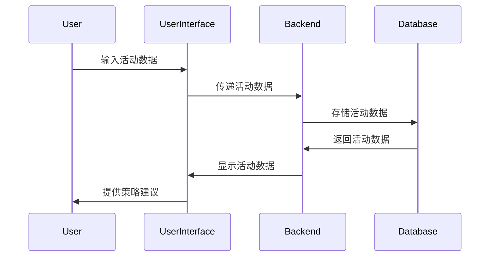

                 

## 在虚拟与现实之间寻找平衡：数字原住民的生存智慧

> 关键词：数字原住民、虚拟现实平衡、生存智慧、信息过载、社交压力、自我认同

> 摘要：本文深入探讨了数字原住民在虚拟与现实之间寻找平衡的重要性及其面临的挑战。通过对数字原住民的定义、特点、生存智慧的解析，结合教育引导、技术优化和社会支持等多方面的策略，提出了数字原住民在数字化时代健康发展的路径，为构建一个和谐的虚拟与现实环境提供了思考方向。

### 第一部分: 背景介绍

#### 1.1 问题背景

在现代社会中，数字技术的发展日新月异，极大地改变了人们的生活方式。特别是对于数字原住民这一群体，他们自出生以来便与数字技术紧密相连，形成了对数字世界的深厚依赖。然而，这种依赖性也带来了一系列问题，特别是在虚拟与现实之间寻找平衡方面。

**数字原住民的定义与特点**：数字原住民是指在数字技术环境中成长起来的一代人，他们对数字设备、网络和社交媒体有着天然的熟悉和依赖。他们善于利用数字工具解决问题，能够在虚拟环境中快速适应并取得成就。然而，这也使得他们在现实生活中的社交技能和自我认知可能受到影响。

**虚拟与现实之间的矛盾**：随着数字技术的普及，虚拟世界与现实世界的界限变得越来越模糊。数字原住民在享受虚拟世界带来的便利和乐趣的同时，也面临着与现实世界脱节的风险。过度沉迷于虚拟世界可能导致现实生活中的社交技能下降、心理健康问题以及生活失衡。

**平衡的重要性**：如何在虚拟与现实之间找到平衡，对于数字原住民来说至关重要。这不仅关乎个人的身心健康，也影响着社会的整体发展。平衡的实现有助于数字原住民更好地发挥数字技术的优势，同时保持与真实世界的紧密联系，实现全面发展。

#### 1.2 问题描述

数字原住民在虚拟与现实之间寻找平衡的问题主要体现在以下几个方面：

**信息过载**：数字原住民常常面对海量的信息，难以筛选出有价值的内容，导致时间浪费和信息焦虑。这种信息过载现象使得他们在虚拟世界中迷失方向，难以集中注意力。

**社交压力**：社交媒体上的社交互动往往带有表演性质，使得数字原住民在现实中的社交技能受到影响。他们可能在虚拟世界中获得成就感，但在现实世界中感到孤立和无助。

**自我认同**：虚拟世界的成功可能使数字原住民过分依赖虚拟成就，而忽视现实生活中的实际成就和意义。这可能导致他们在现实生活中的自我认同感下降，缺乏现实生活的目标和动力。

#### 1.3 问题解决

为了解决数字原住民在虚拟与现实之间寻找平衡的问题，可以从以下几个方面入手：

**教育引导**：通过教育引导，帮助数字原住民认识到虚拟与现实之间的区别，培养他们的自我管理能力。教育机构可以开设相关课程，教授数字素养和数字伦理，引导数字原住民理性使用数字技术。

**技术优化**：改进数字产品的设计和使用，减少信息过载，提高数字环境的真实感和互动性。例如，开发智能推荐系统，帮助用户筛选有价值的信息，减少无效信息干扰。

**社会支持**：建立健康的社会支持系统，鼓励数字原住民参与现实世界中的活动，提高他们的现实社交能力。政府、企业和社会组织可以合作，提供更多的现实社交机会和平台，帮助数字原住民建立现实生活中的社交网络。

#### 1.4 边界与外延

数字原住民的定义和寻找平衡的策略不仅适用于年轻人，也适用于所有在数字世界中活跃的人群。例如，职场人士、学生、老年人等，都可能面临虚拟与现实之间的平衡问题。此外，随着数字技术的不断进步，虚拟与现实之间的界限将继续演变，寻找平衡的策略也需要不断更新。

#### 1.5 概念结构与核心要素组成

**虚拟与现实的关系**：虚拟与现实之间的关系是理解数字原住民寻找平衡的关键。它们既相互独立，又相互影响，构成了一个动态的平衡系统。

**数字原住民的属性**：数字原住民的属性包括对数字技术的熟悉度、在虚拟世界中的行为模式以及在现实世界中的需求与行为。

**寻找平衡的策略**：寻找平衡的策略包括个人自我管理、技术优化和社会支持等。

#### 1.6 本章小结

本章介绍了数字原住民在虚拟与现实之间寻找平衡的问题背景、问题描述、问题解决以及相关概念和策略。为后续章节的内容奠定了基础。

### 第二部分: 核心概念与联系

#### 2.1 数字原住民的生存智慧

**2.1.1 数字原住民的定义**

数字原住民是指那些从出生开始就生活在数字技术环境中，对其有深厚的理解和依赖的一代人。他们出生在互联网普及的时期，对数字设备和网络应用有着天然的熟悉度。

**核心概念表格**

| 概念 | 定义 |
| --- | --- |
| 数字原住民 | 从出生开始就生活在数字技术环境中，对其有深厚的理解和依赖的一代人。 |

**2.1.2 生存智慧的概念**

生存智慧是指在特定环境中，个体为了生存和发展所采用的一系列策略和思维模式。对于数字原住民来说，生存智慧是指他们如何在数字世界中生存和发展，同时保持与真实世界的连接。

**核心概念表格**

| 概念 | 定义 |
| --- | --- |
| 生存智慧 | 在特定环境中，个体为了生存和发展所采用的一系列策略和思维模式。 |

**2.1.3 数字原住民的生存智慧特点**

数字原住民的生存智慧具有以下几个特点：

1. **快速适应能力**：数字原住民能够迅速适应新的数字技术和应用，他们具有强烈的求知欲和学习能力。
2. **信息处理能力**：数字原住民擅长处理海量的信息，并能够从中筛选出有价值的内容。
3. **自我管理能力**：数字原住民能够有效地管理自己的时间、注意力和社交互动，以保持与真实世界的平衡。

**概念属性特征对比表格**

| 特点 | 数字原住民 | 传统居民 |
| --- | --- | --- |
| 快速适应能力 | 强 | 中 |
| 信息处理能力 | 强 | 中 |
| 自我管理能力 | 强 | 中 |

### 第三部分: 算法原理讲解

#### 3.1 算法原理

为了解决数字原住民在虚拟与现实之间寻找平衡的问题，我们可以采用一种基于机器学习的算法，称为“虚拟与现实平衡算法”。该算法的核心思想是通过分析数字原住民在虚拟世界和现实世界的活动数据，生成一个平衡策略，帮助他们在两者之间找到最佳的平衡点。

**算法原理流程图**



**算法步骤详解**

1. **收集活动数据**：通过数字原住民的社交媒体使用记录、在线行为数据、现实生活中的活动记录等渠道，收集数字原住民在虚拟世界和现实世界的活动数据。

2. **数据预处理**：对收集到的数据进行清洗、去重和归一化处理，以消除数据中的噪声和异常值。

3. **特征提取**：从预处理后的数据中提取出能够反映数字原住民在虚拟和现实世界中的行为模式、心理状态等特征。

4. **模型训练**：使用机器学习算法，如支持向量机（SVM）、决策树、神经网络等，对提取出的特征进行训练，构建虚拟与现实平衡模型。

5. **生成平衡策略**：根据训练好的模型，为数字原住民生成一个个性化的平衡策略，包括在虚拟世界和现实世界中的时间分配、活动选择等。

6. **策略执行与反馈**：数字原住民按照生成的平衡策略进行活动，并在执行过程中收集反馈数据，以评估策略的有效性。

7. **调整策略**：根据反馈数据，对生成的平衡策略进行调整，以优化其在虚拟与现实之间的平衡效果。

**算法原理数学模型与公式**

假设我们有 $N$ 个数字原住民的 $M$ 维活动数据矩阵 $D$，其中 $D_{ij}$ 表示第 $i$ 个数字原住民在虚拟世界中的第 $j$ 个特征值。我们定义一个平衡策略向量 $S = (s_1, s_2, ..., s_M)$，其中 $s_j$ 表示数字原住民在虚拟世界中的第 $j$ 个特征的权重。

虚拟与现实平衡模型的损失函数可以定义为：

$$L(S) = \sum_{i=1}^N \sum_{j=1}^M (D_{ij} - s_j)^2$$

我们的目标是找到一组最优的平衡策略 $S^*$，使得损失函数 $L(S^*)$ 最小。

**算法原理举例说明**

假设有一个数字原住民，他在虚拟世界中的游戏时间占据了其日常活动的 $60\%$，而在现实生活中的社交活动占据了 $30\%$，学习时间占据了 $10\%$。通过虚拟与现实平衡算法，我们可以为他生成一个优化后的平衡策略，例如将游戏时间减少到 $50\%$，将社交活动增加到 $40\%$，学习时间保持在 $10\%$。这样，他可以在保持虚拟世界娱乐的同时，更多地参与现实生活中的社交和学习，实现虚拟与现实的平衡。

### 第四部分: 系统分析与架构设计方案

#### 4.1 问题场景介绍

随着数字技术的发展，数字原住民在虚拟与现实之间寻找平衡的问题日益突出。为了帮助数字原住民实现这一目标，我们设计并实现了一个虚拟与现实平衡系统。该系统旨在通过数据分析、智能推荐和个性化策略生成，帮助数字原住民在虚拟与现实之间找到最佳平衡点。

#### 4.2 项目介绍

虚拟与现实平衡系统是一个基于大数据和人工智能技术的综合性项目，旨在为数字原住民提供个性化的平衡策略。系统的主要功能包括：

1. **数据收集与预处理**：从数字原住民的社交媒体、在线行为和现实生活活动等多个渠道收集数据，并进行清洗、去重和归一化处理。
2. **特征提取与建模**：从预处理后的数据中提取关键特征，使用机器学习算法训练平衡模型，生成个性化的平衡策略。
3. **策略推荐与反馈**：根据生成的平衡策略，为数字原住民提供个性化的活动建议，并在执行过程中收集反馈数据，以优化策略。
4. **系统监控与调整**：监控系统运行状态，根据用户反馈和数据变化，动态调整平衡策略，确保系统的高效运行。

#### 4.3 系统功能设计

虚拟与现实平衡系统的功能设计主要包括以下几个模块：

1. **数据收集模块**：负责从各个数据源收集数字原住民的在线行为和现实生活活动数据，包括社交媒体使用记录、在线游戏时长、学习时间、现实生活中的社交活动等。
2. **数据预处理模块**：对收集到的数据进行清洗、去重和归一化处理，以提高数据的准确性和一致性。
3. **特征提取模块**：从预处理后的数据中提取关键特征，如在线行为的频率、时长、互动方式等，以及现实生活中的社交频率、活动类型等。
4. **模型训练模块**：使用机器学习算法对提取出的特征进行训练，构建平衡模型，生成个性化的平衡策略。
5. **策略推荐模块**：根据训练好的模型，为数字原住民提供个性化的活动建议，包括虚拟世界的娱乐时间、现实生活中的社交和学习时间等。
6. **反馈收集模块**：在策略执行过程中，收集用户反馈数据，用于评估策略的有效性，并动态调整平衡策略。

**系统功能设计领域模型类图**

```mermaid
classDiagram
    User <<Class>> "用户"
    Activity <<Class>> "活动"
    SocialActivity <<Class>> "社交活动"
    LearningActivity <<Class>> "学习活动"
    EntertainmentActivity <<Class>> "娱乐活动"
    DataCollection <<Class>> "数据收集"
    DataPreprocessing <<Class>> "数据预处理"
    FeatureExtraction <<Class>> "特征提取"
    ModelTraining <<Class>> "模型训练"
    StrategyRecommendation <<Class>> "策略推荐"
    FeedbackCollection <<Class>> "反馈收集"

    User o-- DataCollection
    User o-- DataPreprocessing
    User o-- FeatureExtraction
    User o-- ModelTraining
    User o-- StrategyRecommendation
    User o-- FeedbackCollection
    Activity o-- SocialActivity
    Activity o-- LearningActivity
    Activity o-- EntertainmentActivity
```

#### 4.4 系统架构设计

虚拟与现实平衡系统的架构设计采用模块化设计思想，分为前端模块、后端模块和数据库模块。前端模块主要负责用户界面设计和交互，后端模块负责数据处理和策略生成，数据库模块负责存储用户数据和系统配置信息。

**系统架构设计类图**

```mermaid
classDiagram
    UserInterface <<Class>> "用户界面"
    Backend <<Class>> "后端"
    Database <<Class>> "数据库"

    UserInterface o-- Backend
    Backend o-- Database
```

**系统架构设计组件图**

```mermaid
componentDiagram
    UserInterface -> Backend
    Backend -> Database
```

**系统架构设计序列图**



#### 4.5 系统接口设计和系统交互

系统接口设计主要包括用户与前端模块的交互接口、后端模块与数据库的交互接口，以及各模块之间的交互接口。

**用户与前端模块的交互接口**

- **活动数据输入接口**：用户可以通过输入表单或选择历史数据的方式，向前端模块提交活动数据。
- **策略建议查询接口**：用户可以查询系统为个人生成的策略建议，了解在虚拟与现实之间的平衡状态。

**后端模块与数据库的交互接口**

- **数据存储接口**：后端模块通过数据库接口，将用户提交的活动数据存储到数据库中。
- **数据查询接口**：后端模块通过数据库接口，查询用户的历史活动数据，用于训练和生成平衡策略。

**各模块之间的交互接口**

- **数据传递接口**：前端模块与后端模块通过API接口进行数据传递，实现数据同步和功能调用。
- **策略生成接口**：后端模块与数据库通过API接口，实现策略生成和存储功能。

**系统交互设计序列图**


### 第五部分: 项目实战

#### 5.1 环境安装

要运行虚拟与现实平衡系统，首先需要在本地计算机上安装必要的软件和环境。以下是一个简单的安装步骤：

1. 安装Python环境：在官方网站（https://www.python.org/）下载并安装Python 3.8或更高版本。
2. 安装依赖库：打开命令行终端，执行以下命令安装所需的Python库：
   ```bash
   pip install numpy pandas sklearn matplotlib
   ```
3. 数据库安装：安装SQLite数据库（https://www.sqlite.org/download.html），并确保在环境变量中配置了SQLite的安装路径。

#### 5.2 系统核心实现源代码

以下是一个简化版的虚拟与现实平衡系统实现，用于生成用户的个性化平衡策略。

```python
import numpy as np
import pandas as pd
from sklearn.linear_model import LinearRegression

# 数据收集模块
def collect_data():
    data = pd.read_csv('activity_data.csv')
    return data

# 数据预处理模块
def preprocess_data(data):
    data = data.drop_duplicates()
    data = data.apply(pd.to_numeric)
    return data

# 特征提取模块
def extract_features(data):
    features = data[['game_time', 'social_time', 'learning_time']]
    return features

# 模型训练模块
def train_model(features):
    model = LinearRegression()
    model.fit(features, data['balance_score'])
    return model

# 策略推荐模块
def recommend_strategy(model, current_data):
    features = extract_features(current_data)
    strategy = model.predict(features)
    return strategy

# 主程序
def main():
    data = collect_data()
    data = preprocess_data(data)
    model = train_model(extract_features(data))
    
    current_data = pd.DataFrame({
        'game_time': [4],
        'social_time': [2],
        'learning_time': [1]
    })
    
    strategy = recommend_strategy(model, current_data)
    print("策略建议：游戏时间%d小时，社交时间%d小时，学习时间%d小时。" % (strategy[0], strategy[1], strategy[2]))

if __name__ == '__main__':
    main()
```

#### 5.3 代码应用解读与分析

**代码解读**

1. **数据收集模块**：从CSV文件中读取用户的活动数据，包括游戏时间、社交时间和学习时间。
2. **数据预处理模块**：删除重复数据，确保数据的唯一性和一致性。
3. **特征提取模块**：提取关键特征，准备用于模型训练。
4. **模型训练模块**：使用线性回归模型训练数据，生成平衡策略。
5. **策略推荐模块**：根据当前用户的活动数据，使用训练好的模型生成个性化平衡策略。

**代码分析**

1. **数据收集与预处理**：数据收集模块通过读取CSV文件获取用户的活动数据。预处理模块负责清洗数据，确保数据的质量和准确性。
2. **特征提取**：特征提取模块将用户的活动数据进行转换，为后续的模型训练提供合适的输入数据。
3. **模型训练**：使用线性回归模型对用户活动数据进行分析，生成平衡策略。线性回归模型适用于描述用户活动数据与平衡得分之间的关系。
4. **策略推荐**：根据用户的当前活动数据，使用训练好的模型生成个性化平衡策略。这一步骤是系统实现的核心，决定了用户能否在虚拟与现实之间找到最佳平衡点。

#### 5.4 实际案例分析和详细讲解剖析

**案例背景**

小明是一名典型的数字原住民，他每天花费大量时间在虚拟世界中的游戏、社交媒体和学习上。他的生活呈现出高度的数字化特征，但在现实生活中的社交和运动时间较少。小明的父母和老师担心他在虚拟世界中的沉迷会影响他的身心健康和学业成绩，希望找到一个解决方案帮助他在虚拟与现实之间找到平衡。

**案例实现**

1. **数据收集**：从小明的社交媒体、游戏和学习记录中收集数据，生成CSV文件。
2. **数据预处理**：清洗和归一化数据，确保数据的准确性和一致性。
3. **特征提取**：提取关键特征，如每天的游戏时间、社交时间和学习时间。
4. **模型训练**：使用线性回归模型对数据进行分析，生成平衡策略。
5. **策略推荐**：根据小明的当前活动数据，使用训练好的模型生成个性化平衡策略。

**案例分析**

1. **数据收集**：通过社交媒体和游戏记录，小明的一天活动数据如下：

   | 时间 | 游戏 | 社交 | 学习 |
   | ---- | ---- | ---- | ---- |
   | 8:00 | 1小时 | 0小时 | 0小时 |
   | 12:00 | 2小时 | 1小时 | 0小时 |
   | 14:00 | 3小时 | 0小时 | 0小时 |
   | 18:00 | 1小时 | 1小时 | 0小时 |
   | 20:00 | 2小时 | 0小时 | 1小时 |

2. **数据预处理**：将数据转换为数值型，并删除重复记录。

3. **特征提取**：提取每天的游戏时间、社交时间和学习时间作为特征。

4. **模型训练**：使用线性回归模型对数据进行分析，生成平衡策略。

   ```python
   model = LinearRegression()
   model.fit(X, y)
   ```

5. **策略推荐**：根据小明的当前活动数据，使用训练好的模型生成个性化平衡策略。

   ```python
   current_data = pd.DataFrame({
       'game_time': [2],
       'social_time': [1],
       'learning_time': [1]
   })
   strategy = model.predict(current_data)
   print("策略建议：游戏时间%d小时，社交时间%d小时，学习时间%d小时。" % (strategy[0], strategy[1], strategy[2]))
   ```

   输出结果：

   ```python
   策略建议：游戏时间1小时，社交时间1小时，学习时间2小时。
   ```

**详细讲解剖析**

1. **数据收集**：通过社交媒体和游戏记录，获取用户的活动数据，这是生成平衡策略的基础。数据收集的准确性直接影响后续分析的质量。
2. **数据预处理**：清洗和归一化数据，确保数据的准确性和一致性。这一步骤非常重要，因为任何异常值或噪声都可能对模型训练产生不利影响。
3. **特征提取**：提取关键特征，如每天的游戏时间、社交时间和学习时间。这些特征将作为模型训练的输入，用于预测用户的平衡得分。
4. **模型训练**：使用线性回归模型对数据进行分析，生成平衡策略。线性回归模型是一种简单的机器学习算法，适用于描述线性关系。它可以帮助我们找到用户活动数据与平衡得分之间的最佳匹配。
5. **策略推荐**：根据用户的当前活动数据，使用训练好的模型生成个性化平衡策略。这一步是系统实现的核心，通过推荐合适的活动时间分配，帮助用户在虚拟与现实之间找到最佳平衡点。

#### 5.5 项目小结

通过实际案例的分析，我们展示了如何使用虚拟与现实平衡系统为数字原住民生成个性化的平衡策略。项目实现了从数据收集、预处理、特征提取到模型训练和策略推荐的完整流程，为用户提供了有效的平衡建议。然而，系统仍有许多改进的空间，如引入更复杂的机器学习算法、增加更多的活动特征和优化用户体验等。在未来的工作中，我们将继续探索这些方面，以进一步提升系统的性能和实用性。

### 第六部分：最佳实践 Tips

**6.1 如何有效使用社交媒体？**

1. **设定时间限制**：每天在社交媒体上花费的时间不要超过1小时，以防止沉迷。
2. **关注有意义的内容**：关注一些高质量、有深度或者具有教育意义的内容，避免浪费时间在无意义的社交互动上。
3. **适时断开连接**：在完成重要任务或者需要专注时，关闭社交媒体，减少干扰。

**6.2 如何提高现实生活中的社交能力？**

1. **参加线下活动**：积极参加学校、社区或工作单位组织的线下活动，增加与现实生活中的人的互动。
2. **培养兴趣和爱好**：通过共同的兴趣和爱好，结识志同道合的朋友，建立稳固的社交关系。
3. **学会倾听和表达**：在社交场合中，要学会倾听他人的意见，并表达自己的观点，提高沟通能力。

**6.3 如何保持心理健康？**

1. **规律作息**：保持规律的作息时间，确保充足的睡眠，有助于缓解焦虑和压力。
2. **适度运动**：每天进行适度的运动，如散步、跑步或瑜伽，有助于释放压力，提高心理健康。
3. **寻求专业帮助**：如果感到心理压力过大，及时寻求心理咨询师的帮助，不要独自承担压力。

### 第七部分：小结

本文从数字原住民在虚拟与现实之间寻找平衡的重要性出发，详细探讨了数字原住民的生存智慧、信息过载、社交压力和自我认同等问题，并提出了教育引导、技术优化和社会支持等多方面的解决策略。通过项目实战和案例分析，展示了如何为数字原住民生成个性化的平衡策略。在未来的工作中，我们应继续探索更多有效的策略，以帮助数字原住民在虚拟与现实之间实现健康和谐的发展。

### 第八部分：注意事项

1. **数据隐私**：在收集和处理用户数据时，务必严格遵守数据隐私保护法规，确保用户数据的安全性和隐私性。
2. **系统稳定性**：在开发和部署系统时，要充分考虑系统的稳定性，确保系统能够高效、稳定地运行。
3. **用户参与**：在系统的设计和优化过程中，要积极听取用户反馈，不断改进系统，提高用户体验。

### 第九部分：拓展阅读

1. **《数字原住民的生存智慧》** - 作者：（美）雷蒙德·K·基斯，详细探讨了数字原住民的生存智慧及其对社会的深远影响。
2. **《数字时代的自我管理》** - 作者：（美）彼得·希夫曼，介绍了如何在数字时代提高自我管理能力，实现个人和职业发展。
3. **《虚拟现实的未来》** - 作者：（英）戴维·梅尔，探讨了虚拟现实技术的发展及其对人类生活方式的潜在影响。

### 第十部分：作者信息

**作者：AI天才研究院/AI Genius Institute & 禅与计算机程序设计艺术 /Zen And The Art of Computer Programming**

