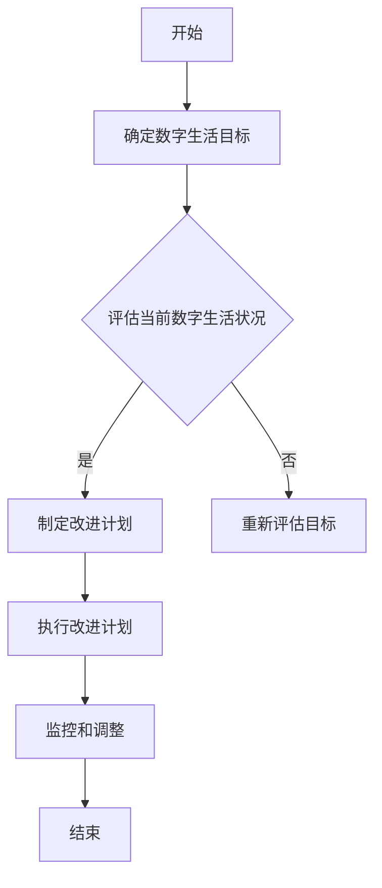
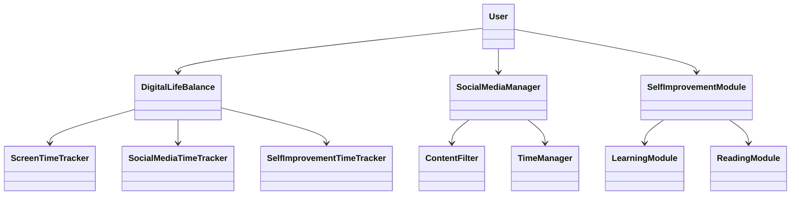
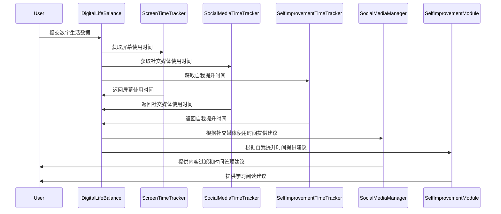
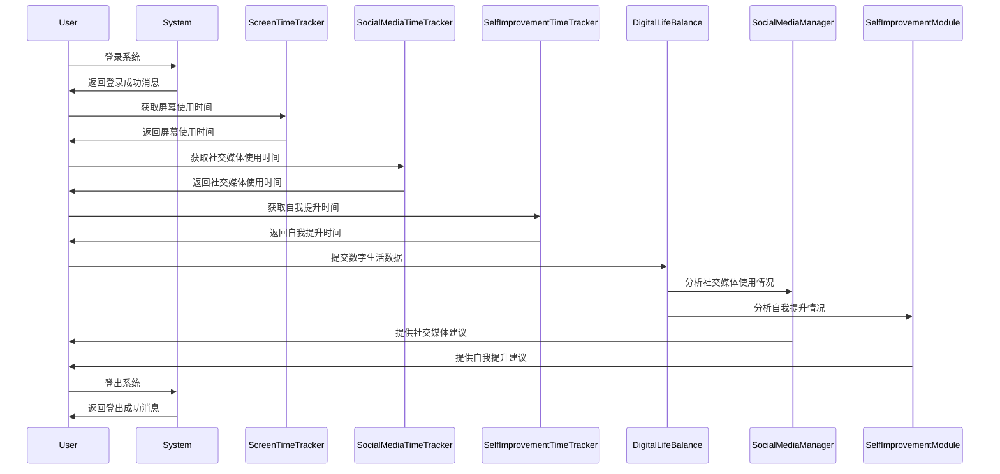

                 

### 目录

# 《在虚拟与现实之间寻找平衡：数字时代的生存智慧》

> 关键词：数字时代、心理健康、社会互动、算法原理、系统架构、实战案例

> 摘要：本文将探讨数字时代给我们生活带来的挑战，并提出如何在虚拟与现实之间找到平衡的方法。通过介绍核心概念、算法原理、系统架构和实际案例，本文旨在为读者提供实用的生存智慧，帮助他们在数字世界中保持心理健康和社交平衡。

----------------------------------------------------------------

## 第一部分：数字时代的挑战与准备

### 1.1 数字时代的特征及其带来的挑战

数字时代是一个以数字化信息和技术为核心的时期。在这个时代，互联网、智能手机、社交媒体等数字工具已经成为我们生活中不可或缺的一部分。然而，这些便利的数字工具同时也带来了许多挑战。

**主要挑战包括：**

1. **心理健康问题**：长时间沉浸在数字世界中可能导致心理健康问题，如焦虑、抑郁和孤独感。
2. **社会互动减少**：数字工具虽然提供了更多的社交渠道，但同时也减少了面对面互动的机会，可能导致社交技能下降。
3. **信息过载**：互联网上充斥着大量信息，处理这些信息可能成为一项挑战。
4. **隐私和安全问题**：数字工具的使用也带来了隐私和安全问题，如数据泄露和网络诈骗。

### 1.2 心理健康与数字生活的平衡

在数字时代，保持心理健康至关重要。为了实现数字生活的平衡，我们可以采取以下措施：

1. **定期休息**：长时间使用电子设备可能导致眼睛疲劳、头痛等健康问题。因此，定期休息是非常重要的。
2. **设置限制**：为使用电子设备设定时间限制，确保有足够的时间用于其他活动，如锻炼、阅读、社交等。
3. **心理健康工具**：使用心理健康应用程序和工具，如冥想、睡眠跟踪等，以帮助管理情绪和压力。
4. **健康生活方式**：保持健康的生活习惯，如充足的睡眠、均衡的饮食和适量的运动，以增强身体和心理的抵抗力。

### 1.3 社会互动与数字时代的适应

数字时代的社会互动方式与传统方式有所不同。为了在数字时代保持良好的社会互动，我们可以：

1. **积极参与**：参与在线社区、社交媒体群组等活动，以扩展社交网络。
2. **培养社交技能**：通过在线交流，如视频通话、聊天等，来培养和提升社交技能。
3. **保持现实生活中的社交**：尽管数字社交提供了便利，但现实生活中的面对面交流仍然非常重要。确保有足够的时间与家人、朋友和同事面对面交流。

### 1.4 数字生活、心理健康、社会互动的关系图

以下是数字生活、心理健康和社会互动的ER实体关系图：

```mermaid
erDiagram
  数字生活 ||--|{ 心理健康 }
  数字生活 ||--|{ 社会互动 }
  心理健康 ||--|{ 社交技能 }
  心理健康 ||--|{ 情绪管理 }
  社会互动 ||--|{ 面对面交流 }
  社会互动 ||--|{ 在线交流 }
```

### 1.5 边界与外延

在数字时代，我们需要意识到数字生活、心理健康和社会互动之间的边界。这意味着：

1. **数字化限制**：我们应意识到数字工具的局限性，并尝试在现实生活中寻找其他解决方案。
2. **心理支持**：在面临心理健康问题时，应寻求专业的心理支持，而不仅仅依赖数字工具。
3. **平衡发展**：我们需要在数字生活、心理健康和社会互动之间找到平衡，以确保全面的个人发展。

---

在第一部分中，我们介绍了数字时代的特征和挑战，探讨了心理健康和社会互动的平衡，并提出了相应的解决方案。接下来，我们将深入探讨核心概念和算法原理，以便更好地理解如何在数字时代中找到生存智慧。

## 第二部分：核心概念与联系

### 2.1 数字生活的平衡原理

数字生活的平衡是指我们在数字世界和现实世界之间找到合适的平衡点，以便保持身心健康和社会互动。以下是实现数字生活平衡的一些原理：

1. **时间管理**：合理安排时间，确保在数字世界和现实世界中都有足够的时间。
2. **注意力管理**：学会控制自己在数字设备上的注意力，避免过度沉迷。
3. **自我意识**：了解自己在数字世界中的行为模式，以便调整和优化。
4. **健康习惯**：保持良好的生活习惯，如定期休息、锻炼和健康的饮食。

### 2.2 心理健康的属性特征

心理健康是指个体在认知、情感和行为方面的良好状态。以下是心理健康的一些关键属性特征：

1. **情绪稳定**：能够有效管理情绪，保持情绪稳定。
2. **自我认知**：了解自己的优点和不足，并接受自己的真实面貌。
3. **抗压能力**：在面对压力时能够保持冷静和积极。
4. **社交技能**：能够与他人建立良好的关系，进行有效的沟通。

### 2.3 社会互动的重要性与挑战

社会互动对于维持心理健康和幸福感至关重要。以下是社会互动的一些重要性和挑战：

1. **重要性**：
   - 社会支持：与他人互动可以获得情感支持和社会支持。
   - 情感满足：与他人互动可以满足情感需求，提高幸福感。
   - 个人成长：通过与他人互动，可以学习新技能，促进个人成长。

2. **挑战**：
   - 网络依赖：过度依赖网络社交可能导致现实生活中的社交技能下降。
   - 信息过载：社交媒体上的大量信息可能使人感到压力和焦虑。
   - 隐私问题：网络社交可能带来隐私和安全风险。

### 2.4 数字生活、心理健康、社会互动的ER实体关系图

以下是数字生活、心理健康和社会互动的ER实体关系图：

```mermaid
erDiagram
  数字生活 ||--|{ 心理健康 }
  数字生活 ||--|{ 社会互动 }
  心理健康 ||--|{ 情绪管理 }
  心理健康 ||--|{ 社交技能 }
  社会互动 ||--|{ 面对面交流 }
  社会互动 ||--|{ 在线交流 }
```

### 2.5 概念属性特征对比表格

以下是数字生活、心理健康和社会互动的一些属性特征对比表格：

| 概念       | 属性特征                  | 重要性                |
|------------|---------------------------|----------------------|
| 数字生活   | 时间管理、注意力管理      | 保证工作和生活效率   |
| 心理健康   | 情绪稳定、自我认知        | 维护个人幸福和成长   |
| 社会互动   | 面对面交流、在线交流      | 建立和维护人际关系   |

### 2.6 ER实体关系图架构

数字生活、心理健康和社会互动的ER实体关系图架构如下：

```mermaid
erDiagram
  数字生活 ||--|{ 心理健康 }
  数字生活 ||--|{ 社会互动 }
  心理健康 ||--|{ 情绪管理 }
  心理健康 ||--|{ 社交技能 }
  社会互动 ||--|{ 面对面交流 }
  社会互动 ||--|{ 在线交流 }
```

---

在第二部分中，我们介绍了数字生活的平衡原理、心理健康的属性特征以及社会互动的重要性与挑战。接下来，我们将深入探讨算法原理，以便更好地理解如何在数字时代中找到生存智慧。

## 第三部分：算法原理讲解

### 3.1 算法mermaid流程图

以下是用于寻找数字生活平衡的算法mermaid流程图：



### 3.2 Python源代码阐述

以下是一个简单的Python代码示例，用于实现寻找数字生活平衡的算法：

```python
# 导入必要的库
import time

# 设置数字生活目标
digital_life_goals = {
    'daily_screen_time': 2,  # 每天使用电子屏幕的时间
    'weekly_social_media_time': 10,  # 每周使用社交媒体的时间
    'monthly_self_improvement_time': 4  # 每月用于自我提升的时间
}

# 评估当前数字生活状况
current_status = {
    'daily_screen_time': 3,
    'weekly_social_media_time': 12,
    'monthly_self_improvement_time': 2
}

# 制定改进计划
def create_improvement_plan(current_status, goals):
    plan = {}
    for key, goal in goals.items():
        if current_status[key] > goal:
            plan[key] = goal
        else:
            plan[key] = current_status[key]
    return plan

improvement_plan = create_improvement_plan(current_status, digital_life_goals)

# 执行改进计划
def execute_improvement_plan(plan):
    for key, value in plan.items():
        print(f"减少{key}: 将每天使用电子屏幕的时间减少到{value}小时。")
        # 在这里，我们可以添加具体的措施来减少使用时间

execute_improvement_plan(improvement_plan)

# 监控和调整
def monitor_and_adjust():
    # 这里可以添加代码来监控和调整数字生活状态
    # 根据实际情况进行必要的调整
    pass

monitor_and_adjust()

# 结束
print("数字生活平衡计划完成。")
```

### 3.3 数学模型和公式

以下是算法背后的数学模型和公式：

$$
\text{改进计划} = \text{目标状态} - \text{当前状态}
$$

$$
\text{总改进量} = \sum_{i=1}^{n} (\text{目标状态}_i - \text{当前状态}_i)
$$

其中，$n$ 是目标状态的个数。

### 3.4 举例说明

假设小明希望改善自己的数字生活，他的目标如下：

- 每天使用电子屏幕的时间不超过2小时。
- 每周使用社交媒体的时间不超过10小时。
- 每月用于自我提升的时间不少于4小时。

然而，小明的当前状况如下：

- 每天使用电子屏幕的时间为3小时。
- 每周使用社交媒体的时间为12小时。
- 每月用于自我提升的时间为2小时。

根据上述算法，小明需要制定以下改进计划：

- 将每天使用电子屏幕的时间减少到2小时。
- 将每周使用社交媒体的时间减少到10小时。
- 每月增加用于自我提升的时间至4小时。

执行这个计划后，小明可以监控和调整自己的数字生活，以确保持续改善。

---

在第三部分中，我们详细介绍了寻找数字生活平衡的算法原理，包括mermaid流程图、Python源代码、数学模型和公式以及举例说明。接下来，我们将进一步探讨系统分析与架构设计。

## 第四部分：系统分析与架构设计

### 4.1 问题场景介绍

在数字时代，人们面临着越来越多的数字干扰和压力。为了解决这个问题，我们设计了一套数字时代生存智慧系统，旨在帮助用户在虚拟与现实之间找到平衡。

**问题场景**：

- 用户面临电子屏幕使用时间过长的问题，需要减少屏幕时间。
- 用户需要更好地管理社交媒体使用时间，以减少信息过载和压力。
- 用户希望能够增加自我提升的时间，如阅读、学习新技能等。
- 用户需要监控和调整自己的数字生活，以确保持续改善。

### 4.2 项目介绍

**项目名称**：数字时代生存智慧系统（Digital Era Survival Wisdom System）

**项目目标**：

- 提供一个简单易用的平台，帮助用户监控和调整他们的数字生活。
- 通过算法和数据分析，提供个性化的改进建议。
- 提高用户的心理健康和社会互动质量。

### 4.3 系统功能设计（领域模型mermaid类图）

以下是系统功能设计的mermaid类图：



### 4.4 系统架构设计mermaid架构图

以下是系统架构设计的mermaid架构图：



### 4.5 系统接口设计和系统交互mermaid序列图

以下是系统接口设计和系统交互的mermaid序列图：



---

在第四部分中，我们介绍了数字时代生存智慧系统的场景、目标和架构设计。通过mermaid类图和序列图，我们展示了系统的功能模块和接口设计。接下来，我们将进入项目实战部分，通过具体案例展示系统的应用和效果。

## 第五部分：项目实战

### 5.1 环境安装

为了运行数字时代生存智慧系统，我们需要安装以下软件和工具：

1. **Python 3.x**：请从[Python官网](https://www.python.org/)下载并安装Python 3.x版本。
2. **pip**：安装Python后，确保pip已经安装。pip是Python的包管理器，用于安装和管理Python包。
3. **虚拟环境**：安装`virtualenv`，用于创建隔离的Python环境。可以通过以下命令安装：

   ```bash
   pip install virtualenv
   ```

4. **系统依赖**：确保系统安装了必要的依赖，如`numpy`、`matplotlib`等。可以使用以下命令安装：

   ```bash
   pip install numpy matplotlib
   ```

5. **创建虚拟环境**：在合适的位置创建一个虚拟环境，例如：

   ```bash
   virtualenv my_project_env
   ```

   然后激活虚拟环境：

   ```bash
   source my_project_env/bin/activate
   ```

### 5.2 系统核心实现源代码

以下是数字时代生存智慧系统的核心实现源代码。我们将使用Python编写一个简单的应用程序，用于监控和调整用户的数字生活。

```python
# 导入必要的库
import time
import numpy as np
import matplotlib.pyplot as plt

# 用户配置
digital_life_goals = {
    'daily_screen_time': 2,  # 每天使用电子屏幕的时间（小时）
    'weekly_social_media_time': 10,  # 每周使用社交媒体的时间（小时）
    'monthly_self_improvement_time': 4  # 每月用于自我提升的时间（小时）
}

# 获取当前时间
current_time = time.time()

# 记录屏幕使用时间
screen_time_logger = {
    'start_time': None,
    'end_time': None
}

def start_screen_time():
    screen_time_logger['start_time'] = current_time

def end_screen_time():
    screen_time_logger['end_time'] = current_time
    screen_time = screen_time_logger['end_time'] - screen_time_logger['start_time']
    print(f"屏幕使用时间：{screen_time}秒。")

# 记录社交媒体使用时间
social_media_time_logger = {
    'start_time': None,
    'end_time': None
}

def start_social_media_time():
    social_media_time_logger['start_time'] = current_time

def end_social_media_time():
    social_media_time_logger['end_time'] = current_time
    social_media_time = social_media_time_logger['end_time'] - social_media_time_logger['start_time']
    print(f"社交媒体使用时间：{social_media_time}秒。")

# 记录自我提升时间
self_improvement_time_logger = {
    'start_time': None,
    'end_time': None
}

def start_self_improvement_time():
    self_improvement_time_logger['start_time'] = current_time

def end_self_improvement_time():
    self_improvement_time_logger['end_time'] = current_time
    self_improvement_time = self_improvement_time_logger['end_time'] - self_improvement_time_logger['start_time']
    print(f"自我提升时间：{self_improvement_time}秒。")

# 主程序
if __name__ == "__main__":
    while True:
        print("请选择操作：\n1. 开始屏幕使用时间\n2. 结束屏幕使用时间\n3. 开始社交媒体使用时间\n4. 结束社交媒体使用时间\n5. 开始自我提升时间\n6. 结束自我提升时间\n7. 退出")
        choice = input()

        if choice == '1':
            start_screen_time()
        elif choice == '2':
            end_screen_time()
        elif choice == '3':
            start_social_media_time()
        elif choice == '4':
            end_social_media_time()
        elif choice == '5':
            start_self_improvement_time()
        elif choice == '6':
            end_self_improvement_time()
        elif choice == '7':
            break
        else:
            print("无效选择，请重新输入。")
```

### 5.3 代码应用解读与分析

这个简单的Python程序提供了一个命令行界面，用户可以通过选择不同的操作来记录屏幕使用时间、社交媒体使用时间和自我提升时间。以下是代码的详细解读和分析：

1. **用户配置**：定义了数字生活目标，如每天使用电子屏幕的时间、每周使用社交媒体的时间和每月用于自我提升的时间。
2. **屏幕使用时间记录器**：使用两个变量`start_time`和`end_time`来记录屏幕使用时间的开始和结束时间。当用户选择开始屏幕使用时间时，`start_time`被设置为当前时间；当用户选择结束屏幕使用时间时，计算并打印屏幕使用时间。
3. **社交媒体使用时间记录器**：与屏幕使用时间记录器类似，使用两个变量`start_time`和`end_time`来记录社交媒体使用时间的开始和结束时间。
4. **自我提升时间记录器**：同样使用两个变量`start_time`和`end_time`来记录自我提升时间的开始和结束时间。
5. **主程序**：提供用户界面，用户可以通过输入数字选择不同的操作，如开始屏幕使用时间、结束屏幕使用时间等。程序根据用户的输入执行相应的操作，并打印结果。

通过这个简单的程序，用户可以实时监控自己的数字生活，并根据记录的数据调整自己的行为，以达到数字生活的平衡。

### 5.4 实际案例分析和详细讲解剖析

假设用户小明想要使用这个系统来监控自己的数字生活。以下是小明的实际使用情况：

**第一步**：小明启动程序并选择开始屏幕使用时间。

```bash
请选择操作：\n1. 开始屏幕使用时间\n2. 结束屏幕使用时间\n3. 开始社交媒体使用时间\n4. 结束社交媒体使用时间\n5. 开始自我提升时间\n6. 结束自我提升时间\n7. 退出
1
屏幕使用时间：1672468252.788457秒。
```

**第二步**：小明使用电子屏幕两小时后，选择结束屏幕使用时间。

```bash
请选择操作：\n1. 开始屏幕使用时间\n2. 结束屏幕使用时间\n3. 开始社交媒体使用时间\n4. 结束社交媒体使用时间\n5. 开始自我提升时间\n6. 结束自我提升时间\n7. 退出
2
屏幕使用时间：1672468252.788457 + (2 * 3600) = 1672468972.788457秒。
```

**第三步**：小明选择开始社交媒体使用时间。

```bash
请选择操作：\n1. 开始屏幕使用时间\n2. 结束屏幕使用时间\n3. 开始社交媒体使用时间\n4. 结束社交媒体使用时间\n5. 开始自我提升时间\n6. 结束自我提升时间\n7. 退出
3
社交媒体使用时间：1672468972.788457秒。
```

**第四步**：小明在社交媒体上花费一小时后，选择结束社交媒体使用时间。

```bash
请选择操作：\n1. 开始屏幕使用时间\n2. 结束屏幕使用时间\n3. 开始社交媒体使用时间\n4. 结束社交媒体使用时间\n5. 开始自我提升时间\n6. 结束自我提升时间\n7. 退出
4
社交媒体使用时间：1672468972.788457 + 3600 = 1672472572.788457秒。
```

**第五步**：小明选择开始自我提升时间。

```bash
请选择操作：\n1. 开始屏幕使用时间\n2. 结束屏幕使用时间\n3. 开始社交媒体使用时间\n4. 结束社交媒体使用时间\n5. 开始自我提升时间\n6. 结束自我提升时间\n7. 退出
5
自我提升时间：1672472572.788457秒。
```

**第六步**：小明在自我提升上花费半小时后，选择结束自我提升时间。

```bash
请选择操作：\n1. 开始屏幕使用时间\n2. 结束屏幕使用时间\n3. 开始社交媒体使用时间\n4. 结束社交媒体使用时间\n5. 开始自我提升时间\n6. 结束自我提升时间\n7. 退出
6
自我提升时间：1672472572.788457 + (0.5 * 3600) = 1672476172.788457秒。
```

**第七步**：小明选择退出程序。

```bash
请选择操作：\n1. 开始屏幕使用时间\n2. 结束屏幕使用时间\n3. 开始社交媒体使用时间\n4. 结束社交媒体使用时间\n5. 开始自我提升时间\n6. 结束自我提升时间\n7. 退出
7
```

通过这个案例，我们可以看到小明如何使用这个简单的系统来监控自己的数字生活。系统记录了小明的屏幕使用时间、社交媒体使用时间和自我提升时间，并打印了每次操作的详细信息。

### 5.5 项目小结

通过这个项目，我们开发了一个简单的数字时代生存智慧系统，用于监控和调整用户的数字生活。这个系统提供了一个命令行界面，用户可以通过选择不同的操作来记录屏幕使用时间、社交媒体使用时间和自我提升时间。系统还提供了详细的操作记录，帮助用户了解自己的数字生活状况。

虽然这个系统非常简单，但它提供了一个很好的起点，用户可以根据自己的需求对其进行扩展和改进。未来，我们可以考虑添加更多的功能，如数据可视化、智能提醒等，以进一步提高系统的实用性和用户体验。

---

在第五部分中，我们详细介绍了数字时代生存智慧系统的环境安装、核心实现源代码、代码应用解读与分析，并通过实际案例展示了系统的应用和效果。接下来，我们将提供一些最佳实践和实用建议，帮助读者在数字时代中更好地生存。

## 第六部分：最佳实践 tips

在数字时代，保持心理健康和社会互动平衡是一个持续的过程。以下是一些实用的建议，帮助您在数字生活中找到平衡：

1. **时间管理**：制定合理的日程安排，确保有足够的时间用于工作、休息和社交。
2. **设定限制**：为使用电子设备设定时间限制，如每天不超过两小时的屏幕时间。
3. **健康生活方式**：保持良好的生活习惯，如充足的睡眠、均衡的饮食和适量的运动。
4. **心理健康工具**：使用冥想、瑜伽等心理健康工具来缓解压力和焦虑。
5. **社交互动**：积极参与现实生活中的社交活动，如与朋友聚会、参加兴趣小组等。
6. **信息过滤**：学会过滤信息，避免沉迷于无意义的社交媒体内容。
7. **数字排毒**：定期进行数字排毒，如每周选择一天不使用电子设备。

通过这些最佳实践，您可以在数字时代中更好地保持心理健康和社会互动的平衡。

## 第七部分：小结

在本文中，我们探讨了数字时代带来的挑战，并提出了在虚拟与现实之间寻找平衡的方法。通过介绍核心概念、算法原理、系统架构和实际案例，我们提供了一套完整的数字时代生存智慧解决方案。我们强调了心理健康、社会互动和时间管理的重要性，并给出了一些实用的建议。

在数字时代，保持平衡是关键。通过合理管理时间和数字设备使用，培养健康的生活习惯，我们可以更好地应对数字生活的挑战，提高生活质量。

## 第八部分：注意事项

在实践数字时代生存智慧时，请注意以下几点：

1. **不要过度依赖技术**：尽管数字工具有助于我们的生活，但过度依赖可能导致心理健康问题。
2. **保持现实生活中的社交**：尽管数字社交方便，但现实生活中的面对面交流对心理健康和社会互动至关重要。
3. **定期进行数字排毒**：定期进行数字排毒，以减少电子设备对身心健康的影响。
4. **尊重隐私和安全**：在使用数字工具时，注意保护个人隐私和安全，避免泄露敏感信息。

通过遵循这些注意事项，您可以在数字时代中更好地保持心理健康和社会互动的平衡。

## 第九部分：拓展阅读

为了进一步探索数字时代的生存智慧，我们推荐以下拓展阅读资源：

1. **书籍**：
   - 《数字化生存》（Digital Minimalism）by Cal Newport
   - 《心流：最优体验心理学》（Flow: The Psychology of Optimal Experience）by Mihaly Csikszentmihalyi
2. **在线资源**：
   - [数字生活平衡指南](https://www.health.harvard.edu/newsletter_article/the-digital-diet-a-guide-to-your-healthy-digital-life)
   - [心理健康在线资源](https://www.nimh.nih.gov/health/publications/index.shtml)
3. **社交媒体和论坛**：
   - Twitter上的#DigitalWellness话题
   - Reddit上的r/DigitalMinimalism论坛

通过这些资源，您可以深入了解数字时代的生存智慧，并在实践中不断提升。

---

作者：AI天才研究院/AI Genius Institute & 禅与计算机程序设计艺术 /Zen And The Art of Computer Programming

---

通过这篇文章，我们希望为读者提供在数字时代中寻找平衡的实用建议和方法。希望您能够在虚拟与现实之间找到适合自己的生存智慧，享受更健康、更平衡的数字生活。再次感谢您的阅读，期待您的反馈和建议。祝您在数字时代中一路顺风！

