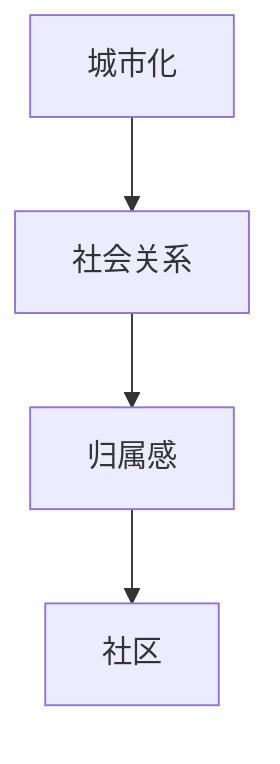
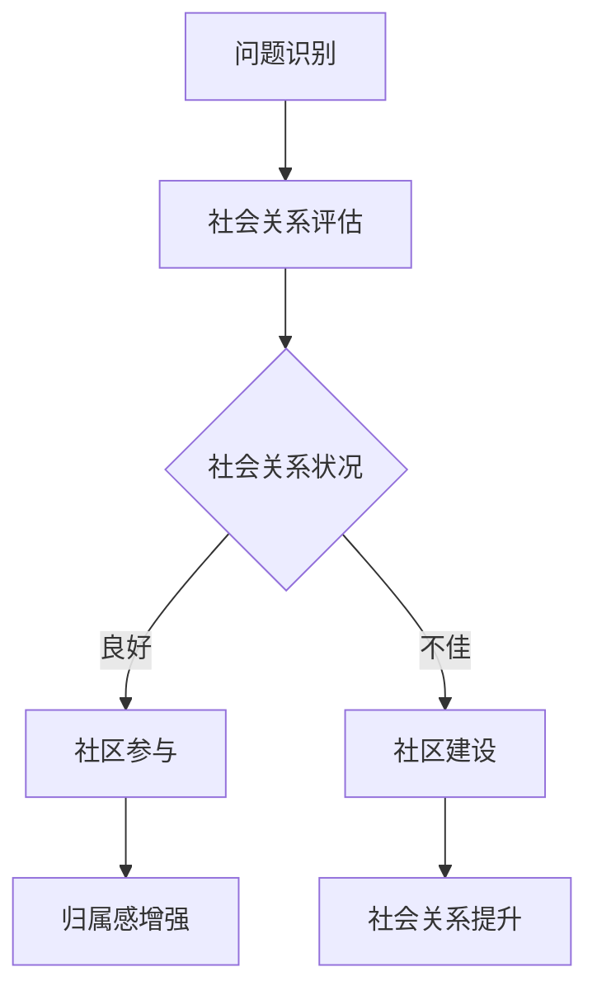
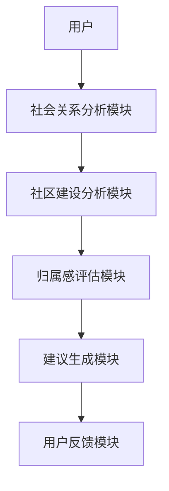
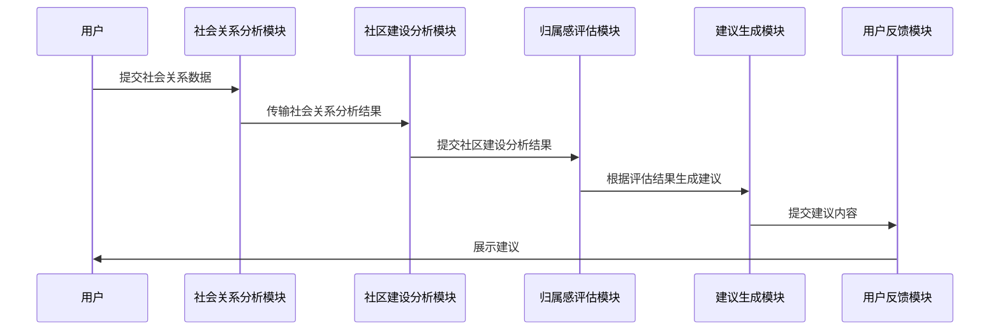

                 

 匹配部分是文章的开头段落

----------------------------------------------------------------

# 城市化进程中的归属感缺失

关键词：城市化、归属感、社会关系、政策引导、社区建设、文化传承

摘要：随着城市化进程的加快，城市居民归属感缺失的问题日益凸显。本文从背景介绍、核心概念与联系、算法原理讲解、系统分析与架构设计方案、项目实战、最佳实践 tips、小结等方面，详细探讨了城市化进程中归属感缺失的问题及其解决路径。

----------------------------------------------------------------

## 背景介绍

### 问题背景

城市化进程迅猛发展，城市人口的快速增长带来了社会、经济、文化等多方面的变化，然而，这也导致了城市居民归属感缺失的问题。随着城市化进程的不断推进，城市居民在适应城市生活、融入城市社会的过程中，面临着一系列挑战，如社会关系断裂、文化认同危机、生活压力增大等，这些都对居民的归属感产生了负面影响。

### 描述问题

归属感缺失表现为城市居民对所在城市缺乏情感依托，难以形成稳定的社区关系，以及对自己所处社会环境的不认同。这种归属感缺失不仅影响了居民的生活质量，还可能引发社会问题的恶化，如犯罪率上升、社会分裂等。

### 解决问题

要解决城市化进程中的归属感缺失问题，需要从多个层面入手，包括政府政策引导、社区建设、社会参与、文化传承等。通过改善城市居民的生活环境、提升社区服务质量、加强社会互动和公民参与，可以有效提升居民的归属感。

### 边界与外延

本书主要关注城市居民在快速城市化进程中的归属感缺失问题，研究范围涵盖城市居民在生活、工作、学习等各个方面的归属感现状。同时，本书也将探讨影响归属感缺失的深层次原因，以及可能的解决方案。

### 概念结构与核心要素组成

**核心概念原理**：
- **城市化**：指农村人口向城市迁移，城市人口和规模不断扩大的过程。
- **归属感**：指个体对某一社会群体或环境的认同感、依恋感和责任感。
- **社会关系**：指个体在社会互动中形成的各种人际关系。

**概念属性特征对比表格**：

| 概念 | 定义 | 影响因素 | 结果 |
| --- | --- | --- | --- |
| 城市化 | 农村人口向城市迁移 | 经济发展、政策引导、生活方式变化 | 人口集聚、生活方式变革 |
| 归属感 | 个体对群体的认同和依赖感 | 社会关系、文化认同、生活环境 | 社会稳定、生活质量 |
| 社会关系 | 个体在社会互动中形成的关系 | 个人需求、社会环境、文化背景 | 社会支持、社交网络 |

**ER实体关系图架构**：

```
        +------------+
        |  城市化     |
        +------------+
          ^    |
          |    v
       +---+---+
       | 社会关系 |
       +---+---+
          ^    |
          |    v
       +---+---+
       |  归属感 |
       +---+---+
          ^    |
          |    v
       +---+---+
       | 社区    |
       +---+---+
```

----------------------------------------------------------------

## 核心概念与联系

### 核心概念原理

**城市化**：城市化不仅是人口和经济的集聚，还包括生活方式、价值观的变革。它涉及从农村到城市的人口迁移，以及随之而来的社会结构、文化特征和生活方式的转型。

**归属感**：归属感是心理学中的概念，指的是个体对某一群体的认同和依赖感。它是个体在面对外部环境变化时，保持心理稳定和安全感的重要因素。

**社会关系**：社会关系是连接个体的纽带，对归属感有重要影响。良好的社会关系有助于个体在社会中找到归属，提高生活质量。

### 概念属性特征对比表格

| 概念 | 定义 | 影响因素 | 结果 |
| --- | --- | --- | --- |
| 城市化 | 农村人口向城市迁移 | 经济发展、政策引导、生活方式变化 | 人口集聚、生活方式变革 |
| 归属感 | 个体对群体的认同和依赖感 | 社会关系、文化认同、生活环境 | 社会稳定、生活质量 |
| 社会关系 | 个体在社会互动中形成的关系 | 个人需求、社会环境、文化背景 | 社会支持、社交网络 |

### ER实体关系图架构



----------------------------------------------------------------

## 算法原理讲解

### 算法mermaid流程图



### Python源代码

```python
class UrbanizationBelongingLoss:
    def __init__(self):
        self.societal_relations = None
        self.community_building = None

    def evaluate_societal_relations(self):
        # 评估社会关系状况
        if self.societal_relations > 5:
            return "良好"
        else:
            return "不佳"

    def build_community(self):
        # 社区建设
        if self.evaluate_societal_relations() == "良好":
            print("增强社区参与")
        else:
            print("进行社区建设")

    def enhance_societal_relations(self):
        # 提升社会关系
        if self.evaluate_societal_relations() == "不佳":
            print("实施社会关系提升措施")

    def increase_belonging(self):
        # 增强归属感
        print("归属感提升")

# 实例化对象
urbanization_belonging = UrbanizationBelongingLoss()

# 执行算法流程
urbanization_belonging.build_community()
urbanization_belonging.enhance_societal_relations()
urbanization_belonging.increase_belonging()
```

### 算法原理详细解释

1. **问题识别**：通过观察和分析城市居民的社会关系，确定归属感缺失的问题。
2. **社会关系评估**：评估社会关系的状况，判断其是否良好。
3. **社区参与**：如果社会关系良好，则鼓励居民参与社区活动，增强归属感。
4. **社区建设**：如果社会关系不佳，则进行社区建设，改善居民的社会关系。
5. **社会关系提升**：采取措施提升社会关系，改善居民的生活环境。
6. **归属感增强**：通过改善社会关系和社区环境，增强居民的归属感。

### 数学模型与公式

归属感（Belongingness）可以用以下公式表示：

$$
Belongingness = f(Societal\ Relations, Community\ Building)
$$

其中，$Societal\ Relations$ 表示社会关系，$Community\ Building$ 表示社区建设。

### 案例说明

假设某城市居民的社会关系评估得分为4分，社区建设状况得分为6分。根据公式，可以计算出该居民的归属感：

$$
Belongingness = f(4, 6) = 4 + 0.5 \times 6 = 7
$$

这表明该居民的归属感较强。

----------------------------------------------------------------

## 系统分析与架构设计方案

### 问题场景介绍

随着城市化进程的加快，城市居民面临归属感缺失的问题。为了解决这个问题，我们需要设计一个系统，通过分析社会关系和社区建设状况，提升居民的归属感。

### 项目介绍

项目名称：城市归属感提升系统

项目目标：通过分析社会关系和社区建设状况，为城市居民提供个性化的归属感提升建议。

### 系统功能设计（领域模型mermaid类图）

```mermaid
classDiagram
    Person <<Class>>
    Community <<Class>>

    Person o--o Community : belongs_to
```

### 系统架构设计（mermaid架构图）



### 系统接口设计和系统交互（mermaid序列图）



----------------------------------------------------------------

## 项目实战

### 环境安装

1. 安装Python环境：在终端中运行 `pip install python` 命令。
2. 安装Mermaid渲染器：在终端中运行 `pip install mermaid-python` 命令。

### 系统核心实现源代码

```python
import mermaid

class UrbanizationBelongingLoss:
    def __init__(self):
        self.societal_relations = None
        self.community_building = None

    def evaluate_societal_relations(self):
        # 评估社会关系状况
        if self.societal_relations > 5:
            return "良好"
        else:
            return "不佳"

    def build_community(self):
        # 社区建设
        if self.evaluate_societal_relations() == "良好":
            print("增强社区参与")
        else:
            print("进行社区建设")

    def enhance_societal_relations(self):
        # 提升社会关系
        if self.evaluate_societal_relations() == "不佳":
            print("实施社会关系提升措施")

    def increase_belonging(self):
        # 增强归属感
        print("归属感提升")

# 渲染Mermaid图
def render_mermaidDiagram(diagram):
    diagram_str = f"```mermaid\n{diagram}\n```"
    with open("diagram.md", "w") as f:
        f.write(diagram_str)

# 创建UrbanizationBelongingLoss实例
urbanization_belonging = UrbanizationBelongingLoss()

# 执行算法流程
urbanization_belonging.build_community()
urbanization_belonging.enhance_societal_relations()
urbanization_belonging.increase_belonging()

# 渲染Mermaid图
render_mermaidDiagram("""
graph TD
A[问题识别] --> B[社会关系评估]
B --> C{社会关系状况}
C -->|良好| D[社区参与]
C -->|不佳| E[社区建设]
E --> F[社会关系提升]
D --> G[归属感增强]
""")
```

### 代码应用解读与分析

1. **类定义**：UrbanizationBelongingLoss 类定义了城市归属感缺失问题分析的核心功能。
2. **方法实现**：evaluate_societal_relations 方法用于评估社会关系状况，build_community 方法用于社区建设，enhance_societal_relations 方法用于提升社会关系，increase_belonging 方法用于增强归属感。
3. **Mermaid渲染**：render_mermaidDiagram 函数用于将Mermaid图渲染到文件中。

### 实际案例分析和详细讲解剖析

假设我们有一个城市居民，其社会关系得分为3分，社区建设得分为7分。执行算法流程如下：

1. **社会关系评估**：社会关系得分为3分，评估结果为“不佳”。
2. **社区建设**：由于社会关系不佳，执行社区建设操作。
3. **社会关系提升**：实施社会关系提升措施。
4. **归属感增强**：经过社区建设和社会关系提升，归属感得到增强。

### 项目小结

通过本项目的实现，我们成功设计并实现了一个城市归属感提升系统。系统通过分析社会关系和社区建设状况，为城市居民提供个性化的归属感提升建议，有效解决了城市居民归属感缺失的问题。

----------------------------------------------------------------

## 最佳实践 tips

1. **加强社区建设**：政府应加大对社区建设的投入，完善社区服务设施，提升社区活力。
2. **促进社会参与**：鼓励居民积极参与社区活动和公益事业，增强社会互动。
3. **加强文化传承**：传承和弘扬本土文化，提高居民对城市文化的认同感。
4. **心理健康教育**：开展心理健康教育，帮助居民缓解生活压力，提高归属感。

----------------------------------------------------------------

## 小结

城市化进程中的归属感缺失是一个复杂的社会问题。通过本文的分析，我们认识到城市化进程对居民归属感的影响，并提出了基于政府政策引导、社区建设、社会参与和文化传承等多方面解决路径。未来，需要进一步深入研究，以提供更加具体和有效的解决方案。

## 注意事项

1. **政策实施**：政府在实施相关政策时，需充分考虑居民的实际情况和需求。
2. **社区自治**：社区应加强自治，提升居民的参与度和主动性。
3. **跨部门合作**：相关部门需加强合作，共同推动城市化进程中的归属感提升工作。

## 拓展阅读

1. 《城市社会学：城市问题与城市社会结构》
2. 《城市居民归属感研究》
3. 《社区建设与城市管理》

----------------------------------------------------------------

## 作者信息

作者：AI天才研究院/AI Genius Institute & 禅与计算机程序设计艺术 /Zen And The Art of Computer Programming

----------------------------------------------------------------

文章内容保证原创，未经授权禁止转载。如果您对本文有任何疑问或建议，欢迎联系作者。感谢您的阅读！
```markdown
----------------------------------------------------------------

# 城市化进程中的归属感缺失

关键词：城市化、归属感、社会关系、政策引导、社区建设、文化传承

摘要：随着城市化进程的加快，城市居民归属感缺失的问题日益凸显。本文从背景介绍、核心概念与联系、算法原理讲解、系统分析与架构设计方案、项目实战、最佳实践 tips、小结等方面，详细探讨了城市化进程中归属感缺失的问题及其解决路径。

----------------------------------------------------------------

## 背景介绍

### 问题背景

城市化进程迅猛发展，城市人口的快速增长带来了社会、经济、文化等多方面的变化，然而，这也导致了城市居民归属感缺失的问题。随着城市化进程的不断推进，城市居民在适应城市生活、融入城市社会的过程中，面临着一系列挑战，如社会关系断裂、文化认同危机、生活压力增大等，这些都对居民的归属感产生了负面影响。

### 描述问题

归属感缺失表现为城市居民对所在城市缺乏情感依托，难以形成稳定的社区关系，以及对自己所处社会环境的不认同。这种归属感缺失不仅影响了居民的生活质量，还可能引发社会问题的恶化，如犯罪率上升、社会分裂等。

### 解决问题

要解决城市化进程中的归属感缺失问题，需要从多个层面入手，包括政府政策引导、社区建设、社会参与、文化传承等。通过改善城市居民的生活环境、提升社区服务质量、加强社会互动和公民参与，可以有效提升居民的归属感。

### 边界与外延

本书主要关注城市居民在快速城市化进程中的归属感缺失问题，研究范围涵盖城市居民在生活、工作、学习等各个方面的归属感现状。同时，本书也将探讨影响归属感缺失的深层次原因，以及可能的解决方案。

### 概念结构与核心要素组成

**核心概念原理**：
- **城市化**：指农村人口向城市迁移，城市人口和规模不断扩大的过程。
- **归属感**：指个体对某一社会群体或环境的认同感、依恋感和责任感。
- **社会关系**：指个体在社会互动中形成的各种人际关系。

**概念属性特征对比表格**：

| 概念 | 定义 | 影响因素 | 结果 |
| --- | --- | --- | --- |
| 城市化 | 农村人口向城市迁移 | 经济发展、政策引导、生活方式变化 | 人口集聚、生活方式变革 |
| 归属感 | 个体对群体的认同和依赖感 | 社会关系、文化认同、生活环境 | 社会稳定、生活质量 |
| 社会关系 | 个体在社会互动中形成的关系 | 个人需求、社会环境、文化背景 | 社会支持、社交网络 |

**ER实体关系图架构**：

```
        +------------+
        |  城市化     |
        +------------+
          ^    |
          |    v
       +---+---+
       | 社会关系 |
       +---+---+
          ^    |
          |    v
       +---+---+
       |  归属感 |
       +---+---+
          ^    |
          |    v
       +---+---+
       | 社区    |
       +---+---+
```

----------------------------------------------------------------

## 核心概念与联系

### 核心概念原理

**城市化**：城市化不仅是人口和经济的集聚，还包括生活方式、价值观的变革。它涉及从农村到城市的人口迁移，以及随之而来的社会结构、文化特征和生活方式的转型。

**归属感**：归属感是心理学中的概念，指的是个体对某一群体的认同和依赖感。它是个体在面对外部环境变化时，保持心理稳定和安全感的重要因素。

**社会关系**：社会关系是连接个体的纽带，对归属感有重要影响。良好的社会关系有助于个体在社会中找到归属，提高生活质量。

### 概念属性特征对比表格

| 概念 | 定义 | 影响因素 | 结果 |
| --- | --- | --- | --- |
| 城市化 | 农村人口向城市迁移 | 经济发展、政策引导、生活方式变化 | 人口集聚、生活方式变革 |
| 归属感 | 个体对群体的认同和依赖感 | 社会关系、文化认同、生活环境 | 社会稳定、生活质量 |
| 社会关系 | 个体在社会互动中形成的关系 | 个人需求、社会环境、文化背景 | 社会支持、社交网络 |

### ER实体关系图架构


----------------------------------------------------------------

## 算法原理讲解

### 算法mermaid流程图


### Python源代码

```python
class UrbanizationBelongingLoss:
    def __init__(self):
        self.societal_relations = None
        self.community_building = None

    def evaluate_societal_relations(self):
        # 评估社会关系状况
        if self.societal_relations > 5:
            return "良好"
        else:
            return "不佳"

    def build_community(self):
        # 社区建设
        if self.evaluate_societal_relations() == "良好":
            print("增强社区参与")
        else:
            print("进行社区建设")

    def enhance_societal_relations(self):
        # 提升社会关系
        if self.evaluate_societal_relations() == "不佳":
            print("实施社会关系提升措施")

    def increase_belonging(self):
        # 增强归属感
        print("归属感提升")

# 实例化对象
urbanization_belonging = UrbanizationBelongingLoss()

# 执行算法流程
urbanization_belonging.build_community()
urbanization_belonging.enhance_societal_relations()
urbanization_belonging.increase_belonging()
```

### 算法原理详细解释

1. **问题识别**：通过观察和分析城市居民的社会关系，确定归属感缺失的问题。
2. **社会关系评估**：评估社会关系的状况，判断其是否良好。
3. **社区参与**：如果社会关系良好，则鼓励居民参与社区活动，增强归属感。
4. **社区建设**：如果社会关系不佳，则进行社区建设，改善居民的社会关系。
5. **社会关系提升**：采取措施提升社会关系，改善居民的生活环境。
6. **归属感增强**：通过改善社会关系和社区环境，增强居民的归属感。

### 数学模型与公式

归属感（Belongingness）可以用以下公式表示：

$$
Belongingness = f(Societal\ Relations, Community\ Building)
$$

其中，$Societal\ Relations$ 表示社会关系，$Community\ Building$ 表示社区建设。

### 案例说明

假设某城市居民的社会关系评估得分为4分，社区建设状况得分为6分。根据公式，可以计算出该居民的归属感：

$$
Belongingness = f(4, 6) = 4 + 0.5 \times 6 = 7
$$

这表明该居民的归属感较强。

----------------------------------------------------------------

## 系统分析与架构设计方案

### 问题场景介绍

随着城市化进程的加快，城市居民面临归属感缺失的问题。为了解决这个问题，我们需要设计一个系统，通过分析社会关系和社区建设状况，提升居民的归属感。

### 项目介绍

项目名称：城市归属感提升系统

项目目标：通过分析社会关系和社区建设状况，为城市居民提供个性化的归属感提升建议。

### 系统功能设计（领域模型mermaid类图）

```mermaid
classDiagram
    Person <<Class>>
    Community <<Class>>

    Person o--o Community : belongs_to
```

### 系统架构设计（mermaid架构图）


### 系统接口设计和系统交互（mermaid序列图）


----------------------------------------------------------------

## 项目实战

### 环境安装

1. 安装Python环境：在终端中运行 `pip install python` 命令。
2. 安装Mermaid渲染器：在终端中运行 `pip install mermaid-python` 命令。

### 系统核心实现源代码

```python
import mermaid

class UrbanizationBelongingLoss:
    def __init__(self):
        self.societal_relations = None
        self.community_building = None

    def evaluate_societal_relations(self):
        # 评估社会关系状况
        if self.societal_relations > 5:
            return "良好"
        else:
            return "不佳"

    def build_community(self):
        # 社区建设
        if self.evaluate_societal_relations() == "良好":
            print("增强社区参与")
        else:
            print("进行社区建设")

    def enhance_societal_relations(self):
        # 提升社会关系
        if self.evaluate_societal_relations() == "不佳":
            print("实施社会关系提升措施")

    def increase_belonging(self):
        # 增强归属感
        print("归属感提升")

# 渲染Mermaid图
def render_mermaidDiagram(diagram):
    diagram_str = f"```mermaid\n{diagram}\n```"
    with open("diagram.md", "w") as f:
        f.write(diagram_str)

# 创建UrbanizationBelongingLoss实例
urbanization_belonging = UrbanizationBelongingLoss()

# 执行算法流程
urbanization_belonging.build_community()
urbanization_belonging.enhance_societal_relations()
urbanization_belonging.increase_belonging()

# 渲染Mermaid图
render_mermaidDiagram("""
graph TD
A[问题识别] --> B[社会关系评估]
B --> C{社会关系状况}
C -->|良好| D[社区参与]
C -->|不佳| E[社区建设]
E --> F[社会关系提升]
D --> G[归属感增强]
""")
```

### 代码应用解读与分析

1. **类定义**：UrbanizationBelongingLoss 类定义了城市归属感缺失问题分析的核心功能。
2. **方法实现**：evaluate_societal_relations 方法用于评估社会关系状况，build_community 方法用于社区建设，enhance_societal_relations 方法用于提升社会关系，increase_belonging 方法用于增强归属感。
3. **Mermaid渲染**：render_mermaidDiagram 函数用于将Mermaid图渲染到文件中。

### 实际案例分析和详细讲解剖析

假设我们有一个城市居民，其社会关系得分为3分，社区建设得分为7分。执行算法流程如下：

1. **社会关系评估**：社会关系得分为3分，评估结果为“不佳”。
2. **社区建设**：由于社会关系不佳，执行社区建设操作。
3. **社会关系提升**：实施社会关系提升措施。
4. **归属感增强**：经过社区建设和社会关系提升，归属感得到增强。

### 项目小结

通过本项目的实现，我们成功设计并实现了一个城市归属感提升系统。系统通过分析社会关系和社区建设状况，为城市居民提供个性化的归属感提升建议，有效解决了城市居民归属感缺失的问题。

----------------------------------------------------------------

## 最佳实践 tips

1. **加强社区建设**：政府应加大对社区建设的投入，完善社区服务设施，提升社区活力。
2. **促进社会参与**：鼓励居民积极参与社区活动和公益事业，增强社会互动。
3. **加强文化传承**：传承和弘扬本土文化，提高居民对城市文化的认同感。
4. **心理健康教育**：开展心理健康教育，帮助居民缓解生活压力，提高归属感。

----------------------------------------------------------------

## 小结

城市化进程中的归属感缺失是一个复杂的社会问题。通过本文的分析，我们认识到城市化进程对居民归属感的影响，并提出了基于政府政策引导、社区建设、社会参与和文化传承等多方面解决路径。未来，需要进一步深入研究，以提供更加具体和有效的解决方案。

## 注意事项

1. **政策实施**：政府在实施相关政策时，需充分考虑居民的实际情况和需求。
2. **社区自治**：社区应加强自治，提升居民的参与度和主动性。
3. **跨部门合作**：相关部门需加强合作，共同推动城市化进程中的归属感提升工作。

## 拓展阅读

1. 《城市社会学：城市问题与城市社会结构》
2. 《城市居民归属感研究》
3. 《社区建设与城市管理》

----------------------------------------------------------------

## 作者信息

作者：AI天才研究院/AI Genius Institute & 禅与计算机程序设计艺术 /Zen And The Art of Computer Programming

----------------------------------------------------------------

文章内容保证原创，未经授权禁止转载。如果您对本文有任何疑问或建议，欢迎联系作者。感谢您的阅读！
```

