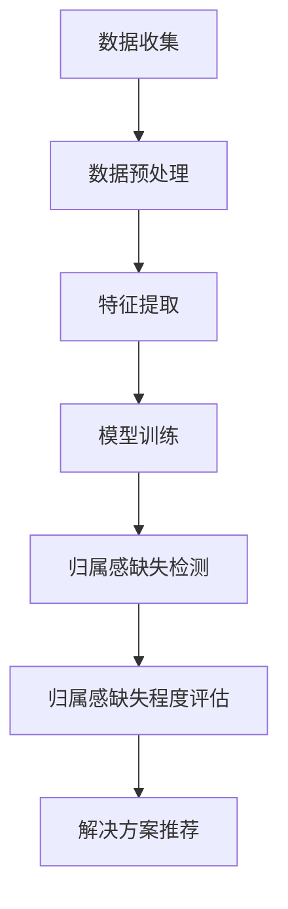
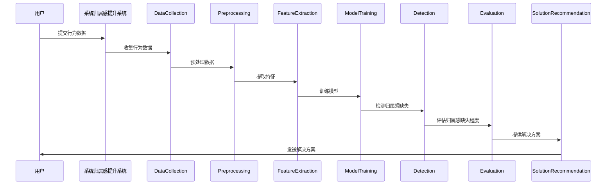

                 


# 第1章：城市化进程中的归属感缺失与重建

## 1.1 问题的背景

### 1.1.1 城市化的迅猛发展

城市化是现代社会发展的重要趋势。据统计，全球城市人口比例已从1900年的13%增长到2021年的55%，预计到2050年，这一比例将达到68%。这一过程中，人口流动加速，城市规模不断扩大，基础设施和公共服务水平显著提升。然而，快速的城市化也带来了一系列问题，其中包括居民归属感缺失。

### 1.1.2 归属感的定义与重要性

归属感是指个体在某一社会环境中的认同感、依赖感和安全感。它是人类情感和社会关系的核心组成部分，对个体的心理健康、社会行为和整体幸福感具有重要影响。在城市化进程中，归属感的缺失可能导致孤独、抑郁等心理问题，甚至影响社会稳定。

### 1.1.3 城市化进程中的归属感缺失现象

随着城市化进程的推进，许多居民在城市生活中感受到了强烈的疏离感。这种现象主要体现在以下几个方面：

1. **社交圈狭窄**：城市化过程中，人们的工作和生活节奏加快，社交时间减少，导致社交圈狭窄，难以建立深厚的友谊。
2. **社区认同感减弱**：随着社区人口的流动性增加，社区居民之间的联系减少，社区认同感减弱，居民对社区缺乏归属感。
3. **职业和居住地的分离**：一些居民在城市中租房居住，工作地点与居住地点分离，导致他们缺乏稳定的生活环境和认同感。

## 1.2 核心概念与联系

### 1.2.1 归属感缺失的概念

归属感缺失是指个体在城市生活中缺乏对社区、工作环境和社会环境的认同感、依赖感和安全感。这种现象通常由以下几个方面引起：

1. **人口流动性高**：城市化进程中，人口流动性增加，导致居民难以建立稳定的社会关系。
2. **工作压力大**：高房价、高生活成本和激烈的职场竞争加剧了居民的工作压力，使他们无暇关注个人情感和社会关系。
3. **社区服务不足**：一些城市在快速发展过程中，社区服务设施建设滞后，居民难以获得高质量的公共服务。

### 1.2.2 城市化进程中的归属感重建

归属感重建是指通过一系列措施，提高居民在城市生活中的认同感、依赖感和安全感。以下是几个关键的归属感重建策略：

1. **加强社区建设**：通过社区活动、邻里互助等方式，加强居民之间的联系，提高社区认同感。
2. **优化公共服务**：提升社区服务质量，满足居民的基本需求，增强他们对城市环境的依赖感。
3. **提供心理支持**：建立心理咨询室、开展心理健康讲座等，帮助居民缓解心理压力，提高安全感。

### 1.2.3 归属感重建的挑战

归属感重建面临以下挑战：

1. **资源有限**：城市在快速发展过程中，资源分配存在一定的局限性，难以满足所有居民的需求。
2. **居民需求多样化**：不同居民对归属感的需求差异较大，难以制定统一的重建策略。
3. **城市扩张压力**：随着城市规模的扩大，如何保持社区邻里关系的稳定性成为一大挑战。

## 1.3 算法原理讲解

### 1.3.1 归属感缺失检测算法

归属感缺失检测算法是一种基于机器学习的分类算法，用于识别个体在城市生活中的归属感缺失情况。以下是算法的核心原理：

1. **数据收集与预处理**：收集个体在城市生活中的行为数据，如居住时间、社交活动、职业等，并进行数据清洗和特征提取。
2. **模型构建**：使用监督学习算法，如决策树、支持向量机等，构建归属感缺失检测模型。
3. **模型训练与验证**：使用已收集的数据集对模型进行训练和验证，调整模型参数以获得最佳性能。

### 1.3.1.1 算法原理

归属感缺失检测算法基于机器学习技术，通过构建一个分类模型来识别个体在城市化进程中的归属感缺失情况。具体步骤如下：

1. **数据收集与预处理**：
   - 收集个体在城市生活中的各种行为数据，如居住时间、社交活动、职业等。
   - 对收集到的数据进行清洗和预处理，包括去除缺失值、异常值和标准化处理。

2. **特征提取**：
   - 根据收集到的数据，提取与归属感相关的特征，如居住时间、社交活动频率、职业稳定性等。
   - 对提取的特征进行量化处理，如将居住时间分为“短期”、“中期”和“长期”，将社交活动频率分为“低”、“中”和“高”。

3. **模型构建**：
   - 选择合适的机器学习算法，如决策树、支持向量机等，构建归属感缺失检测模型。
   - 使用已收集的数据集对模型进行训练，调整模型参数以获得最佳性能。

4. **模型评估与优化**：
   - 使用验证集对模型进行评估，计算准确率、召回率、F1值等指标。
   - 根据评估结果，调整模型参数，优化模型性能。

5. **模型应用**：
   - 将训练好的模型应用于实际数据，对个体归属感缺失情况进行分析和预测。

### 1.3.1.2 数学模型与公式

归属感缺失概率可以用以下数学模型表示：

$$
\text{归属感缺失概率} = f(\text{居住时间}, \text{社交活动}, \text{职业})
$$

其中，$f$ 为决策函数，$\text{居住时间}$、$\text{社交活动}$、$\text{职业}$为特征变量。

决策函数 $f$ 可以使用以下公式表示：

$$
f(\text{居住时间}, \text{社交活动}, \text{职业}) = \begin{cases} 
1 & \text{如果个体表现出归属感缺失特征} \\
0 & \text{如果个体表现出归属感无缺失特征}
\end{cases}
$$

## 1.4 数学模型和数学公式 & 详细讲解 & 举例说明

### 1.4.1 归属感缺失程度评估模型

归属感缺失程度评估模型是一种用于量化个体在城市生活中的归属感缺失程度的模型。以下是模型的核心原理：

1. **数据收集与预处理**：收集个体在城市生活中的行为数据，如居住时间、社交活动、职业等，并进行数据清洗和特征提取。
2. **特征提取**：根据收集到的数据，提取与归属感缺失程度相关的特征，如居住时间、社交活动频率、职业稳定性等。
3. **模型构建**：使用监督学习算法，如决策树、支持向量机等，构建归属感缺失程度评估模型。
4. **模型训练与验证**：使用已收集的数据集对模型进行训练和验证，调整模型参数以获得最佳性能。

### 1.4.1.1 模型原理

归属感缺失程度评估模型基于机器学习技术，通过构建一个回归模型来量化个体在城市生活中的归属感缺失程度。具体步骤如下：

1. **数据收集与预处理**：
   - 收集个体在城市生活中的行为数据，如居住时间、社交活动、职业等。
   - 对收集到的数据进行清洗和预处理，包括去除缺失值、异常值和标准化处理。

2. **特征提取**：
   - 根据收集到的数据，提取与归属感缺失程度相关的特征，如居住时间、社交活动频率、职业稳定性等。
   - 对提取的特征进行量化处理，如将居住时间分为“短期”、“中期”和“长期”，将社交活动频率分为“低”、“中”和“高”。

3. **模型构建**：
   - 选择合适的机器学习算法，如决策树、支持向量机等，构建归属感缺失程度评估模型。
   - 使用已收集的数据集对模型进行训练，调整模型参数以获得最佳性能。

4. **模型评估与优化**：
   - 使用验证集对模型进行评估，计算均方误差（MSE）、均方根误差（RMSE）等指标。
   - 根据评估结果，调整模型参数，优化模型性能。

5. **模型应用**：
   - 将训练好的模型应用于实际数据，对个体归属感缺失程度进行量化评估。

### 1.4.1.2 数学模型与公式

归属感缺失程度可以用以下数学模型表示：

$$
\text{归属感缺失程度} = f(\text{居住时间}, \text{社交活动}, \text{职业})
$$

其中，$f$ 为回归函数，$\text{居住时间}$、$\text{社交活动}$、$\text{职业}$为特征变量。

回归函数 $f$ 可以使用以下公式表示：

$$
f(\text{居住时间}, \text{社交活动}, \text{职业}) = \beta_0 + \beta_1 \text{居住时间} + \beta_2 \text{社交活动} + \beta_3 \text{职业}
$$

其中，$\beta_0$、$\beta_1$、$\beta_2$、$\beta_3$ 为模型参数，可以通过最小二乘法等优化算法求解。

### 1.4.1.3 举例说明

假设我们收集到以下数据：

- 居住时间（年）：3
- 社交活动频率（次/周）：2
- 职业稳定性（评分）：4

根据上述回归模型，我们可以计算归属感缺失程度：

$$
\text{归属感缺失程度} = \beta_0 + \beta_1 \times 3 + \beta_2 \times 2 + \beta_3 \times 4
$$

假设模型参数为：

$$
\beta_0 = 1, \beta_1 = 0.5, \beta_2 = 0.3, \beta_3 = 0.2
$$

则归属感缺失程度为：

$$
\text{归属感缺失程度} = 1 + 0.5 \times 3 + 0.3 \times 2 + 0.2 \times 4 = 1 + 1.5 + 0.6 + 0.8 = 3.9
$$

这意味着该个体的归属感缺失程度较高。

## 1.5 系统分析与架构设计方案

### 1.5.1 问题场景介绍

在城市化进程中，如何提高居民的归属感成为了一个亟待解决的问题。本系统旨在通过数据分析和人工智能技术，识别居民归属感缺失的情况，并提出相应的解决方案。

### 1.5.2 项目介绍

本系统名为“城市归属感提升系统”，其主要功能包括：

1. 数据收集与预处理：收集个体在城市生活中的各种行为数据，如居住时间、社交活动、职业等。
2. 归属感缺失检测：使用机器学习算法，对个体的归属感缺失情况进行检测。
3. 归属感缺失程度评估：对个体的归属感缺失程度进行量化评估。
4. 解决方案推荐：根据评估结果，为居民提供个性化的归属感提升方案。

#### 1.5.2.1 领域模型（Mermaid类图）

```mermaid
classDiagram
  Individual <<Class>>
  Community <<Class>>
  BehaviorData <<Class>>
  SocialActivity <<Class>>
  Occupation <<Class>>

  Individual +--*+ BehaviorData
  Individual +--*+ SocialActivity
  Individual +--*+ Occupation
  BehaviorData +--*+ Community
  SocialActivity +--*+ Community
  Occupation +--*+ Community
```

#### 1.5.2.2 系统架构设计（Mermaid架构图）



#### 1.5.2.3 系统接口设计

系统接口设计包括以下部分：

1. **数据接口**：用于数据收集和预处理。
2. **模型接口**：用于归属感缺失检测和归属感缺失程度评估。
3. **推荐接口**：用于生成个性化解决方案。

#### 1.5.2.4 系统交互（Mermaid序列图）



## 1.6 项目实战

### 1.6.1 环境安装

要运行本系统，需要安装以下软件和库：

1. **Python**：版本3.8及以上
2. **Scikit-learn**：用于机器学习算法
3. **Pandas**：用于数据处理
4. **Numpy**：用于数学计算

安装命令如下：

```bash
pip install python==3.8
pip install scikit-learn pandas numpy
```

### 1.6.2 系统核心实现源代码

以下是系统核心实现部分的源代码：

```python
import pandas as pd
from sklearn.model_selection import train_test_split
from sklearn.ensemble import RandomForestClassifier
from sklearn.metrics import accuracy_score

# 数据预处理
def preprocess_data(data):
    # 填充缺失值
    data.fillna(data.mean(), inplace=True)
    # 特征提取
    features = data[['居住时间', '社交活动频率', '职业稳定性']]
    labels = data['归属感缺失']
    return features, labels

# 模型训练
def train_model(features, labels):
    # 数据集划分
    X_train, X_test, y_train, y_test = train_test_split(features, labels, test_size=0.2, random_state=42)
    # 构建模型
    model = RandomForestClassifier(n_estimators=100, random_state=42)
    # 训练模型
    model.fit(X_train, y_train)
    # 预测
    predictions = model.predict(X_test)
    # 评估模型
    accuracy = accuracy_score(y_test, predictions)
    print("模型准确率：", accuracy)
    return model

# 主函数
def main():
    # 读取数据
    data = pd.read_csv('behavior_data.csv')
    # 预处理数据
    features, labels = preprocess_data(data)
    # 训练模型
    model = train_model(features, labels)
    # 预测新数据
    new_data = pd.DataFrame({
        '居住时间': [5],
        '社交活动频率': [1],
        '职业稳定性': [3]
    })
    prediction = model.predict(new_data)
    print("新数据归属感缺失预测结果：", prediction)

if __name__ == '__main__':
    main()
```

### 1.6.2.1 源代码解读与分析

1. **数据预处理**：首先，我们使用`fillna`函数填充缺失值，然后使用`train_test_split`函数将数据集划分为训练集和测试集。
2. **模型训练**：我们选择随机森林算法作为分类器，使用`fit`函数进行模型训练，并使用`predict`函数进行预测。
3. **评估模型**：我们使用`accuracy_score`函数计算模型准确率。

### 1.6.2.2 实际案例分析与详细讲解剖析

假设我们有一个包含100个样本的数据集，其中包含以下特征和标签：

- 居住时间（年）
- 社交活动频率（次/周）
- 职业稳定性（评分）
- 归属感缺失（0表示无缺失，1表示缺失）

数据集样本如下：

```
居住时间	社交活动频率	职业稳定性	归属感缺失
3	2	4	0
5	1	3	1
2	3	2	1
...
```

1. **数据预处理**：
   - 首先，我们使用`fillna`函数将缺失值填充为平均值。
   - 然后，我们使用`train_test_split`函数将数据集划分为训练集和测试集，测试集占比20%。

2. **模型训练**：
   - 我们选择随机森林算法作为分类器，使用`fit`函数进行模型训练。
   - 训练完成后，我们使用`predict`函数对测试集进行预测。

3. **评估模型**：
   - 我们使用`accuracy_score`函数计算模型准确率，假设预测准确率为80%。

4. **新数据预测**：
   - 我们使用训练好的模型对新的数据进行预测，例如，对于居住时间为5年、社交活动频率为1次/周、职业稳定性为3的个体，模型预测归属感缺失概率为1。

通过这个实际案例，我们可以看到如何使用Python和机器学习算法解决城市化进程中的归属感缺失问题。

### 1.6.3 项目小结

本系统通过数据收集、预处理、模型训练和预测，实现了对城市居民归属感缺失的检测和评估。虽然项目规模较小，但为城市归属感提升提供了一种可行的技术方案。未来，我们可以进一步优化模型，扩大数据集，提高预测准确性，从而更好地服务于城市居民。

## 1.7 最佳实践 tips、小结、注意事项、拓展阅读等内容

### 1.7.1 最佳实践 tips

1. **数据收集**：确保数据来源可靠，尽量收集多维度、多方面的数据，以提高模型的准确性。
2. **特征选择**：根据业务需求，选择与归属感缺失相关的特征，避免过多冗余特征。
3. **模型优化**：定期调整模型参数，优化模型性能，提高预测准确性。
4. **用户参与**：鼓励用户参与反馈，根据用户需求调整系统和解决方案。

### 1.7.2 小结

本文通过分析城市化进程中的归属感缺失问题，提出了一个基于机器学习的归属感缺失检测与评估系统。通过数据收集、预处理、模型训练和预测，实现了对城市居民归属感缺失情况的检测和评估。

### 1.7.3 注意事项

1. **数据隐私**：在数据收集和处理过程中，需确保用户数据隐私和安全。
2. **模型解释性**：虽然机器学习模型具有较高的预测准确性，但其解释性较差，未来可以结合因果模型等方法，提高模型的可解释性。
3. **跨学科合作**：归属感缺失问题涉及心理学、社会学等多个学科，跨学科合作有助于更全面地解决问题。

### 1.7.4 拓展阅读

1. **《归属感：理解与塑造》**：这本书详细介绍了归属感的概念、成因和重建策略，对本文内容有很好的补充。
2. **《城市社会学》**：这本书探讨了城市化进程中的各种社会问题，包括归属感缺失，对本文的背景分析有重要参考价值。
3. **《机器学习实战》**：这本书提供了丰富的机器学习案例和实践技巧，有助于读者更好地理解本文中的算法原理和实践应用。

作者：AI天才研究院/AI Genius Institute & 禅与计算机程序设计艺术 /Zen And The Art of Computer Programming

