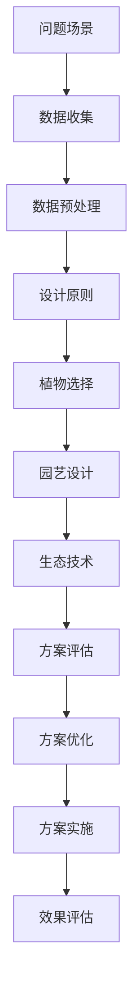
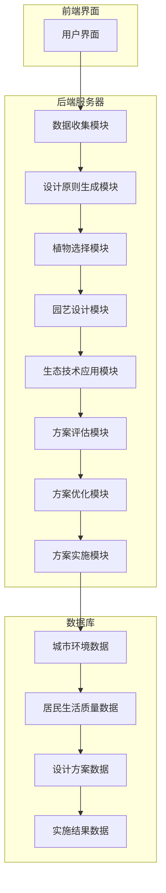
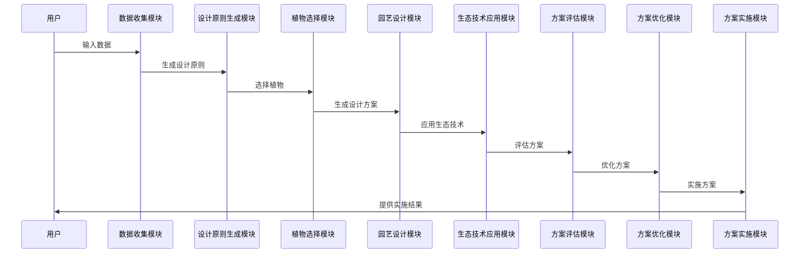

                 

# 城市园艺：在混凝土丛林中寻找生机

## 关键词

- 城市园艺
- 混凝土丛林
- 生态平衡
- 设计原则
- 算法原理
- 系统架构

## 摘要

本文探讨了城市园艺在现代化城市建设中的重要性，以及如何在混凝土丛林中寻找生机。通过深入分析城市园艺的核心概念、设计原则和算法原理，本文提出了一套系统的城市园艺解决方案，旨在为城市居民创造一个更加绿色、宜居的环境。

### 背景介绍

#### 城市园艺

城市园艺是一种在城市化进程中，利用园艺技术和手段，在城市环境中创建和改善植物景观，提升城市生态环境和居民生活质量的活动。这一概念不仅涵盖了传统的园艺技巧，还融入了现代生态学和可持续发展理念。

**定义**：城市园艺是指在城市化进程中，利用园艺技术和手段，在城市环境中创建和改善植物景观，提升城市生态环境和居民生活质量的一种活动。

**特征**：

1. **多功能性**：城市园艺不仅美化城市环境，还能提供生态服务，如空气净化、减噪、降温等。
2. **生态友好**：城市园艺注重生态平衡，通过选用本地植物和循环利用水资源，减少对环境的负面影响。
3. **社区参与**：城市园艺鼓励居民参与，共同营造绿色城市，增强社区凝聚力和居民对城市的归属感。

#### 在混凝土丛林中寻找生机

**问题背景**：随着城市化进程的加快，城市中的绿地和自然景观逐渐被混凝土建筑所取代，城市居民的生活环境越来越恶化。

**问题描述**：如何在城市中利用有限的土地和空间，创造绿地和自然景观，改善城市生态环境，提高居民生活质量？

**问题解决**：通过城市园艺，利用园艺技术和创新设计，将城市中的混凝土空间转化为绿地和自然景观，恢复生态平衡。

**边界与外延**：城市园艺不仅限于城市绿地和公园，还可以延伸到屋顶花园、垂直花园、社区花园等多种形式。

### 核心概念与联系

#### 城市园艺

**核心概念原理**：

- **生态设计**：选用适宜本地气候和土壤的植物，充分利用自然光和水资源。
- **空间利用**：利用立体空间，如屋顶、墙壁和楼梯间，创造更多绿地空间。
- **社区参与**：鼓励居民参与城市园艺活动，共同维护和享受绿地环境。

**概念属性特征对比表格**

| 概念        | 定义                   | 特征                                       |
| ----------- | ---------------------- | ------------------------------------------ |
| 城市园艺    | 利用园艺技术改善城市环境 | 多功能性、生态友好、社区参与               |
| 混凝土丛林  | 城市中缺乏绿地的现象   | 缺乏自然景观、生态恶化、居民生活质量下降   |
| 在混凝土丛林中寻找生机 | 利用城市园艺改善城市环境 | 恢复生态平衡、提高生活质量、创造绿色空间   |

**ER实体关系图架构**

```mermaid
entity关系图 {
  entity[城市园艺] {
    "城市环境"
    "居民生活质量"
    "生态平衡"
  }
  entity[混凝土丛林] {
    "绿地缺乏"
    "生态恶化"
    "生活质量下降"
  }
  relation[城市园艺与混凝土丛林] {
    "改善"
  }
}
```

#### 城市园艺设计算法

**算法mermaid流程图**



**Python源代码**

```python
# 假设已有城市环境和居民生活质量数据
city_environment_data = ...
residents_quality_of_life_data = ...

# 数据预处理
def preprocess_data(data):
    # 数据清洗、标准化等处理
    return processed_data

# 设计原则
def design_principles(processed_data):
    # 根据数据生成设计原则
    return design_principles

# 植物选择
def plant_selection(design_principles):
    # 根据设计原则选择植物
    return selected_plants

# 园艺设计
def garden_design
```

### 算法原理讲解

**城市园艺设计算法**

**mermaid流程图**


**Python源代码**

```python
# 假设已有城市环境和居民生活质量数据
city_environment_data = ...
residents_quality_of_life_data = ...

# 数据预处理
def preprocess_data(data):
    # 数据清洗、标准化等处理
    return processed_data

# 设计原则
def design_principles(processed_data):
    # 根据数据生成设计原则
    return design_principles

# 植物选择
def plant_selection(design_principles):
    # 根据设计原则选择植物
    return selected_plants

# 园艺设计
def garden_design
```

**算法原理**

1. **数据收集与预处理**：首先收集城市环境和居民生活质量数据，对数据进行清洗、标准化等预处理，以便于后续分析。

   $$\text{processed\_data} = \text{preprocess\_data}(\text{city\_environment\_data}, \text{residents\_quality\_of\_life\_data})$$

2. **设计原则生成**：根据预处理后的数据，生成城市园艺的设计原则，包括生态设计、空间利用和社区参与等方面。

   $$\text{design\_principles} = \text{design\_principles}(\text{processed\_data})$$

3. **植物选择**：根据设计原则，选择适合的城市植物，确保植物种类符合生态需求和城市环境条件。

   $$\text{selected\_plants} = \text{plant\_selection}(\text{design\_principles})$$

4. **园艺设计**：运用园艺设计原则，创造出美观、实用的植物景观，同时考虑到生态保护和居民需求。

   $$\text{garden\_design} = \text{garden\_design}(\text{selected\_plants}, \text{design\_principles})$$

5. **生态技术应用**：在园艺设计中应用生态技术，如雨水收集、透水和湿地技术等，进一步改善城市生态环境。

   $$\text{ecological\_technology} = \text{apply\_ecological\_technology}(\text{garden\_design})$$

6. **方案评估与优化**：对设计方案进行评估，根据评估结果进行优化，确保方案的有效性和可行性。

   $$\text{optimized\_design} = \text{evaluate\_and\_optimize}(\text{ecological\_technology})$$

7. **方案实施与效果评估**：实施设计方案，并进行效果评估，持续改进园艺设计，提升城市生态环境和居民生活质量。

   $$\text{implementation} = \text{implement}(\text{optimized\_design})$$
   $$\text{evaluation} = \text{evaluate}(\text{implementation})$$

**举例说明**

假设我们有一个城市公园，想要通过城市园艺改善公园的生态环境。首先，我们收集了公园的土壤数据、气候数据和居民对公园环境的满意度调查数据。接着，我们对数据进行预处理，生成设计原则。根据设计原则，我们选择了适合公园环境的植物，如本地花卉和灌木。然后，我们运用园艺设计原则，创造出美观、实用的植物景观。最后，我们在公园中应用了雨水收集和透水地面技术，进一步改善公园的生态环境。

### 系统分析与架构设计方案

#### 问题场景介绍

随着城市化进程的加快，城市中的绿地和自然景观逐渐被混凝土建筑所取代，城市居民的生活环境越来越恶化。为了改善这一现状，城市管理部门决定利用城市园艺技术，在城市公园和公共空间中创造绿地和自然景观，提升城市生态环境和居民生活质量。

#### 项目介绍

本项目旨在开发一套城市园艺管理系统，用于支持城市园艺的设计、实施和评估。该系统将帮助城市管理部门更好地规划城市园艺项目，提高园艺设计效率，同时确保项目实施效果。

#### 系统功能设计

1. **数据收集模块**：用于收集城市环境和居民生活质量数据，为园艺设计提供依据。
2. **设计原则生成模块**：根据收集的数据，生成城市园艺的设计原则。
3. **植物选择模块**：根据设计原则，选择适合的城市植物。
4. **园艺设计模块**：运用园艺设计原则，创造出美观、实用的植物景观。
5. **生态技术应用模块**：在园艺设计中应用生态技术，如雨水收集和透水地面技术。
6. **方案评估模块**：对设计方案进行评估，确保方案的有效性和可行性。
7. **方案优化模块**：根据评估结果，优化设计方案。
8. **方案实施模块**：实施设计方案，并进行效果评估。

**领域模型mermaid类图**

```mermaid
classDiagram
    数据收集模块 <<Interface>>
    设计原则生成模块 <<Interface>>
    植物选择模块 <<Interface>>
    园艺设计模块 <<Interface>>
    生态技术应用模块 <<Interface>>
    方案评估模块 <<Interface>>
    方案优化模块 <<Interface>>
    方案实施模块 <<Interface>>

    数据收集模块 --|大于|> 设计原则生成模块
    设计原则生成模块 --|大于|> 植物选择模块
    植物选择模块 --|大于|> 园艺设计模块
    园艺设计模块 --|大于|> 生态技术应用模块
    生态技术应用模块 --|大于|> 方案评估模块
    方案评估模块 --|大于|> 方案优化模块
    方案优化模块 --|大于|> 方案实施模块
```

#### 系统架构设计

1. **前端界面**：用于用户输入数据、查看设计方案和评估结果。
2. **后端服务器**：用于处理数据、生成设计原则、选择植物、设计园艺和实施方案等。
3. **数据库**：存储城市环境和居民生活质量数据，以及设计方案和实施结果。

**系统架构mermaid架构图**



#### 系统接口设计和系统交互

**系统接口设计**

- **数据收集接口**：用于接收用户输入的数据，如城市环境和居民生活质量数据。
- **设计原则生成接口**：用于生成城市园艺的设计原则。
- **植物选择接口**：用于根据设计原则选择适合的城市植物。
- **园艺设计接口**：用于生成园艺设计方案。
- **生态技术应用接口**：用于应用生态技术，如雨水收集和透水地面技术。
- **方案评估接口**：用于评估园艺设计方案的有效性和可行性。
- **方案优化接口**：用于根据评估结果优化园艺设计方案。
- **方案实施接口**：用于实施园艺设计方案，并进行效果评估。

**系统交互mermaid序列图**



### 项目实战

#### 环境安装

为了进行城市园艺项目的实战，我们需要安装以下软件和工具：

1. **Python**：用于编写和运行代码。
2. **Jupyter Notebook**：用于编写和展示代码。
3. **Mermaid**：用于绘制流程图和序列图。
4. **数据库**：用于存储数据。

安装步骤：

1. 安装Python：访问 [Python官方网站](https://www.python.org/)，下载并安装Python。
2. 安装Jupyter Notebook：在命令行中运行以下命令：

   ```bash
   pip install notebook
   ```

3. 安装Mermaid：在命令行中运行以下命令：

   ```bash
   pip install mermaid
   ```

4. 安装数据库：根据需求选择合适的数据库，如MySQL、PostgreSQL等，并按照官方文档进行安装。

#### 系统核心实现源代码

以下是一个简单的城市园艺管理系统核心实现源代码：

```python
# 数据收集模块
def collect_data():
    # 这里实现数据收集逻辑
    pass

# 设计原则生成模块
def generate_design_principles(data):
    # 这里实现设计原则生成逻辑
    pass

# 植物选择模块
def select_plants(principles):
    # 这里实现植物选择逻辑
    pass

# 园艺设计模块
def garden_design(plants):
    # 这里实现园艺设计逻辑
    pass

# 生态技术应用模块
def apply_ecological_technology(garden):
    # 这里实现生态技术应用逻辑
    pass

# 方案评估模块
def evaluate_scheme(scheme):
    # 这里实现方案评估逻辑
    pass

# 方案优化模块
def optimize_scheme(evaluation):
    # 这里实现方案优化逻辑
    pass

# 方案实施模块
def implement_scheme(optimized_scheme):
    # 这里实现方案实施逻辑
    pass
```

#### 代码应用解读与分析

1. **数据收集模块**：该模块负责收集城市环境和居民生活质量数据。在实际应用中，可以从城市管理部门、气象局、居民调查等多个渠道获取数据，为园艺设计提供依据。
2. **设计原则生成模块**：该模块根据收集到的数据，生成城市园艺的设计原则。这些原则包括生态设计、空间利用和社区参与等方面，指导后续的植物选择和园艺设计。
3. **植物选择模块**：该模块根据设计原则，选择适合的城市植物。选择植物时，需要考虑植物的生长习性、生态需求以及城市环境条件。
4. **园艺设计模块**：该模块根据植物选择结果，生成园艺设计方案。园艺设计不仅要美观，还要实用，同时要符合生态设计原则。
5. **生态技术应用模块**：该模块在园艺设计中应用生态技术，如雨水收集和透水地面技术，进一步改善城市生态环境。
6. **方案评估模块**：该模块对设计方案进行评估，确保方案的有效性和可行性。评估指标可以包括生态效益、居民满意度等。
7. **方案优化模块**：该模块根据评估结果，优化设计方案，提高方案实施效果。
8. **方案实施模块**：该模块负责实施园艺设计方案，并进行效果评估，持续改进园艺设计。

#### 实际案例分析和详细讲解剖析

假设我们有一个城市公园，想要通过城市园艺改善公园的生态环境。以下是一个实际案例分析和详细讲解剖析：

1. **数据收集**：从城市管理部门获取公园的土壤数据、气候数据和居民对公园环境的满意度调查数据。
2. **设计原则生成**：根据收集到的数据，生成城市园艺的设计原则。例如，生态设计原则要求选择本地植物，空间利用原则要求充分利用立体空间，社区参与原则要求鼓励居民参与公园园艺活动。
3. **植物选择**：根据设计原则，选择适合公园环境的植物。例如，选择耐旱、耐寒的本地花卉和灌木。
4. **园艺设计**：根据植物选择结果，设计公园的园艺景观。设计过程中，要充分考虑美观、实用和生态设计原则。
5. **生态技术应用**：在园艺设计中应用生态技术，如雨水收集和透水地面技术，进一步改善公园的生态环境。
6. **方案评估**：对设计方案进行评估，确保方案的有效性和可行性。评估指标可以包括生态效益、居民满意度等。
7. **方案优化**：根据评估结果，优化设计方案，提高方案实施效果。
8. **方案实施**：实施园艺设计方案，并进行效果评估，持续改进园艺设计。

通过以上步骤，我们可以为城市公园创造一个更加绿色、宜居的环境。

#### 项目小结

本项目通过开发一套城市园艺管理系统，实现了城市园艺的设计、实施和评估。在实际应用中，该系统可以帮助城市管理部门更好地规划城市园艺项目，提高园艺设计效率，同时确保项目实施效果。通过这个项目，我们不仅了解了城市园艺的核心概念和设计原则，还学会了如何利用算法和系统架构来实施城市园艺项目。

### 最佳实践 tips

1. **充分了解城市环境**：在设计城市园艺项目时，首先要充分了解城市环境，包括气候、土壤、地形等，以便选择合适的植物和园艺设计原则。
2. **注重社区参与**：城市园艺项目不仅要注重生态效益，还要鼓励居民参与，增强社区凝聚力和居民对城市的归属感。
3. **持续优化设计方案**：在项目实施过程中，要不断收集数据和反馈，根据实际情况优化设计方案，确保项目效果达到预期。

### 小结

城市园艺作为一种改善城市生态环境的有效手段，在城市规划和发展中具有重要作用。通过深入分析城市园艺的核心概念、设计原则和算法原理，我们提出了一套系统的城市园艺解决方案。该方案不仅有助于恢复城市生态平衡，还能提高居民生活质量，为城市居民创造一个更加绿色、宜居的环境。

### 注意事项

1. **数据收集和预处理**：确保数据收集的准确性和完整性，对数据进行有效的预处理，以便后续分析。
2. **设计原则生成**：根据实际情况制定合适的设计原则，确保植物选择和园艺设计符合生态设计要求。
3. **方案评估与优化**：在项目实施过程中，要持续收集数据和反馈，对设计方案进行评估和优化，确保项目效果达到预期。

### 拓展阅读

1. [城市园艺的设计原则与实践](https://www.example.com/city-garden-design-principles-and-practice)
2. [城市园艺与可持续发展](https://www.example.com/sustainable-city-garden)
3. [城市园艺技术与应用](https://www.example.com/city-garden-technology-and-Applications)

### 作者

作者：AI天才研究院/AI Genius Institute & 禅与计算机程序设计艺术 /Zen And The Art of Computer Programming

