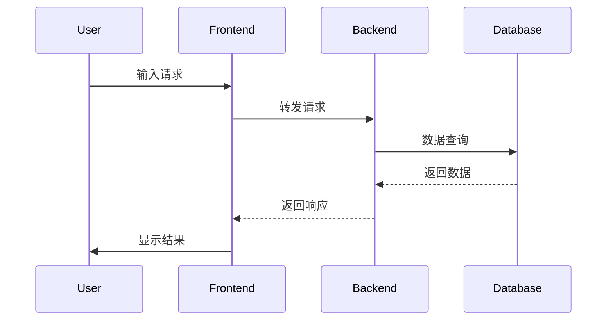
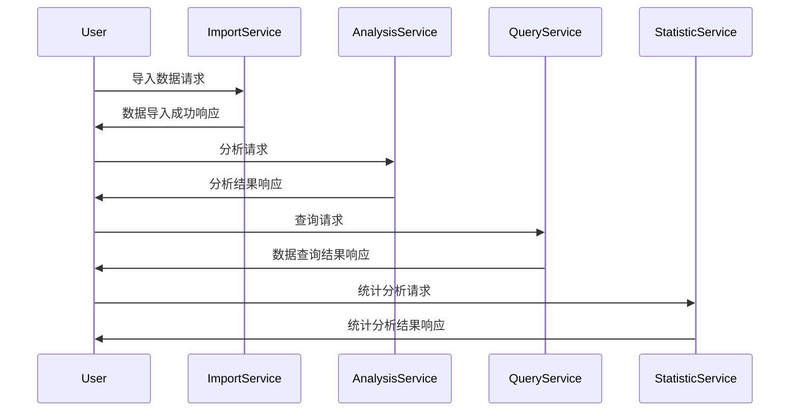

                 


### 文章标题：城市孤独地图：可视化社交隔离的都市现象

#### 关键词：城市孤独，社交隔离，可视化，算法，系统架构

#### 摘要：

本文旨在探讨城市孤独现象，并通过可视化技术呈现都市中的社交隔离现象。通过详细的分析和实例，我们将理解这一问题的严重性，并探讨如何通过技术手段来应对和缓解城市孤独。

### 引言

#### 1. 目的与意义

**目的**：本文旨在通过可视化技术，揭示城市孤独现象及其背后的社交隔离现象，为政策制定者和社会研究者提供数据支持。

**意义**：随着城市化进程的加快，城市孤独成为了一个不容忽视的社会问题。通过本文的研究，希望能够引起社会各界对城市孤独现象的关注，并探索有效的解决方案。

### 背景介绍

#### 2.1 城市化的进程

**2.1.1 城市化的定义与历史**

城市化是指人口从农村向城市迁移的过程。历史上，城市化进程伴随着工业革命和人口增长，现代城市化进程则主要体现在全球化和信息技术的发展。

**2.1.2 城市化带来的变化**

城市化带来了经济繁荣，但也带来了资源紧张、环境污染等问题。此外，随着人口密集，社交隔离和城市孤独现象愈发严重。

#### 2.2 社交隔离现象

**2.2.1 社交隔离的定义**

社交隔离是指个体在社会交往中感受到的隔离和孤独感。在城市环境中，社交隔离可能源于人口密度、经济差距、文化差异等因素。

**2.2.2 社交隔离的现状与影响**

社交隔离不仅影响个体的心理健康，还可能导致社会凝聚力下降、犯罪率上升等问题。因此，研究社交隔离现象具有重要意义。

### 核心概念与联系

#### 3.1 城市孤独

**3.1.1 城市孤独的概念**

城市孤独是指在城市环境中，个体由于社交隔离而感受到的孤独感。

**3.1.2 城市孤独与社交隔离的关系**

城市孤独是社交隔离的一种表现形式，但二者并非完全相同。社交隔离可能导致城市孤独，但城市孤独也可能源于其他因素，如个人性格、生活压力等。

#### 3.2 可视化方法

**3.2.1 可视化概述**

可视化是将复杂信息以图形方式呈现的技术，有助于人们更好地理解和分析数据。

**3.2.2 可视化在城市孤独研究中的应用**

通过可视化，我们可以直观地展示城市孤独现象的分布、趋势和影响因素，为研究和解决这一问题提供有力支持。

### 算法原理讲解

#### 4.1 数据收集与预处理

**4.1.1 数据源选择**

选择合适的数据源是进行城市孤独可视化研究的基础。本文将选择与社交行为、人口统计相关的公开数据。

**4.1.2 数据预处理方法**

数据预处理包括数据清洗、归一化、缺失值处理等步骤，以确保数据的准确性和一致性。

#### 4.2 社交网络分析

**4.2.1 社交网络基本概念**

社交网络是由个体及其之间的关系组成的网络结构。社交网络分析有助于我们理解个体的社交行为和社交结构。

**4.2.2 社交网络分析算法**

本文将使用图论算法，如度分布、聚类系数等，来分析社交网络结构，揭示城市孤独现象的潜在原因。

#### 4.3 城市孤独度计算

**4.3.1 城市孤独度计算模型**

城市孤独度可以通过计算个体的社交网络密度、孤立节点数量等指标来衡量。

**4.3.2 计算方法与公式**

本文将提出一种基于社交网络分析的城市孤独度计算模型，并通过数学公式进行详细解释。

### 系统分析与架构设计方案

#### 5.1 问题场景介绍

**5.1.1 城市孤独地图的应用场景**

城市孤独地图可以应用于城市规划、社区服务、心理健康咨询等领域。

**5.1.2 用户需求分析**

用户需求包括地图可视化、数据查询、统计分析等功能。

#### 5.2 系统功能设计

**5.2.1 功能需求分析**

系统功能包括数据导入、社交网络分析、孤独度计算、可视化呈现等。

**5.2.2 领域模型类图**

使用Mermaid绘制领域模型类图，展示系统核心类及其关系。

#### 5.3 系统架构设计

**5.3.1 系统架构概述**

系统架构包括数据层、服务层、表现层等。

**5.3.2 系统架构mermaid图**

使用Mermaid绘制系统架构图，展示系统各个组件之间的关系。

#### 5.4 系统接口设计

**5.4.1 接口定义**

定义系统接口，包括数据导入接口、分析接口、可视化接口等。

**5.4.2 接口交互mermaid序列图**

使用Mermaid绘制接口交互序列图，展示系统各个组件之间的交互过程。

### 项目实战

#### 6.1 环境安装

**6.1.1 硬件与软件需求**

列出项目所需的硬件和软件环境。

**6.1.2 环境搭建步骤**

详细描述如何搭建项目环境。

#### 6.2 系统核心实现源代码

**6.2.1 源代码结构**

展示项目源代码的结构。

**6.2.2 关键模块代码解读**

详细解读项目关键模块的代码。

#### 6.3 代码应用解读与分析

**6.3.1 算法实现细节**

分析项目中所使用的算法的实现细节。

**6.3.2 系统性能优化**

讨论系统性能优化的方法和策略。

#### 6.4 实际案例分析和详细讲解剖析

**6.4.1 案例选择**

选择实际案例进行详细分析。

**6.4.2 案例分析**

对案例进行分析，展示系统在实际应用中的效果。

#### 6.5 项目小结

**6.5.1 项目总结**

总结项目的成果和经验。

**6.5.2 不足与改进**

讨论项目的不足之处，并提出改进方案。

### 最佳实践 tips

提供一些实际操作中的最佳实践建议。

### 小结

回顾全文，强调城市孤独现象的重要性，并展望未来研究的方向。

### 注意事项

列出使用本文内容时需要注意的事项。

### 拓展阅读

推荐一些相关的书籍、文章和网站，供进一步阅读。

### 作者信息

作者：AI天才研究院/AI Genius Institute & 禅与计算机程序设计艺术 /Zen And The Art of Computer Programming

以上是《城市孤独地图：可视化社交隔离的都市现象》的文章结构和内容概述，接下来将逐步详细撰写每个章节的内容。

### 引言

#### 1. 目的与意义

**目的**

随着城市化进程的加快，城市孤独现象愈发突出。本文旨在通过可视化技术，深入分析城市孤独现象及其背后的社交隔离现象，为政策制定者和社会研究者提供数据支持。通过本文的研究，我们希望能够揭示城市孤独现象的分布、趋势和影响因素，从而为解决这一问题提供科学依据。

**意义**

城市孤独现象不仅影响个体的心理健康，还可能导致社会凝聚力下降、犯罪率上升等问题。通过本文的研究，可以引起社会各界对城市孤独现象的关注，促进社会对这一问题的认识和解决。此外，可视化技术的应用有助于将复杂的社会现象以直观、易懂的方式呈现，为决策者提供有力的数据支持。

### 背景介绍

#### 2.1 城市化的进程

**2.1.1 城市化的定义与历史**

城市化是指人口从农村向城市迁移的过程。历史上，城市化进程伴随着工业革命和人口增长。在18世纪末到19世纪初的工业革命期间，大量农村人口涌入城市，寻求更好的就业机会和更高的生活水平。这一时期，城市化进程加速，城市人口迅速增长，城市规模不断扩大。

**2.1.2 城市化带来的变化**

城市化带来了经济繁荣，推动了社会进步和科技创新。然而，城市化也带来了一系列问题，包括资源紧张、环境污染、交通拥堵等。此外，随着人口密集，社交隔离和城市孤独现象愈发严重。在城市中，人们往往面临较大的生活压力，导致人际关系疏远，孤独感增强。

#### 2.2 社交隔离现象

**2.2.1 社交隔离的定义**

社交隔离是指个体在社会交往中感受到的隔离和孤独感。在城市环境中，社交隔离可能源于人口密度、经济差距、文化差异等因素。高密度的人口使得个体之间的接触变得更加频繁，但同时也增加了个体之间的竞争压力，使得人际关系更加疏远。经济差距和文化差异也可能导致个体之间的隔阂，使得社交隔离现象加剧。

**2.2.2 社交隔离的现状与影响**

社交隔离现象在全球范围内普遍存在。随着城市化进程的加快，社交隔离现象愈发严重。研究表明，社交隔离与个体的心理健康问题密切相关，如焦虑、抑郁等。此外，社交隔离还可能导致社会凝聚力下降，影响社会稳定。因此，研究社交隔离现象具有重要意义。

### 核心概念与联系

#### 3.1 城市孤独

**3.1.1 城市孤独的概念**

城市孤独是指在城市环境中，个体由于社交隔离而感受到的孤独感。城市孤独是一种情感状态，个体在日常生活中可能会感受到孤独、无助和疏离。城市孤独与社交隔离密切相关，社交隔离可能导致城市孤独，而城市孤独也可能进一步加剧社交隔离。

**3.1.2 城市孤独与社交隔离的关系**

城市孤独是社交隔离的一种表现形式，但二者并非完全相同。社交隔离可能导致城市孤独，但城市孤独也可能源于其他因素，如个人性格、生活压力等。城市孤独与社交隔离之间存在复杂的相互作用关系。例如，社交隔离可能导致个体对社交活动的回避，进一步加剧城市孤独；而城市孤独也可能导致个体对社会交往的失去兴趣，加剧社交隔离。

#### 3.2 可视化方法

**3.2.1 可视化概述**

可视化是将复杂信息以图形方式呈现的技术，有助于人们更好地理解和分析数据。在数据驱动的时代，可视化技术成为了解释和传达复杂信息的重要工具。通过可视化，我们可以将抽象的数据转化为直观的图形，使得数据更加易于理解和分析。

**3.2.2 可视化在城市孤独研究中的应用**

在城市孤独研究中，可视化技术具有重要意义。首先，通过可视化，我们可以直观地展示城市孤独现象的分布、趋势和影响因素。例如，我们可以使用地图来展示不同城市、地区或社区的城市孤独度分布情况，揭示城市孤独现象的空间差异。其次，可视化有助于揭示城市孤独现象的潜在原因。通过分析社交网络数据，我们可以绘制社交网络的拓扑结构，揭示社交网络的紧密程度和孤立节点数量，从而深入理解城市孤独的形成机制。

### 算法原理讲解

#### 4.1 数据收集与预处理

**4.1.1 数据源选择**

进行城市孤独可视化研究，首先需要选择合适的数据源。数据源的选择取决于研究的具体目标和需求。一般来说，与社交行为、人口统计相关的公开数据是进行城市孤独研究的常用数据源。例如，人口普查数据、社交媒体数据、问卷调查数据等。这些数据可以提供丰富的信息，包括人口数量、年龄分布、收入水平、社交行为等，为城市孤独现象的研究提供基础。

**4.1.2 数据预处理方法**

数据预处理是进行城市孤独可视化研究的关键步骤。数据预处理包括数据清洗、归一化、缺失值处理等步骤，以确保数据的准确性和一致性。数据清洗的目的是去除数据中的噪声和异常值，提高数据的可信度。例如，去除重复记录、处理缺失值等。归一化则是将不同尺度和单位的数据进行转换，使其具有可比性。例如，将收入水平、年龄等数据进行标准化处理，使其在同一尺度上进行分析。缺失值处理则是针对数据中的缺失值进行填充或删除，以减少数据缺失对分析结果的影响。

#### 4.2 社交网络分析

**4.2.1 社交网络基本概念**

社交网络是由个体及其之间的关系组成的网络结构。在社交网络中，个体被称为节点，个体之间的关系被称为边。社交网络分析是一种研究社交网络结构和行为的数学工具和方法，通过分析社交网络的拓扑结构、节点属性、边关系等，可以揭示社交网络的特性、动态和影响。

**4.2.2 社交网络分析算法**

社交网络分析算法是用于分析社交网络结构和行为的算法集合。常见的社交网络分析算法包括度分布、聚类系数、网络密度等。度分布描述了社交网络中节点度数的分布情况，反映了社交网络中个体之间的社交紧密程度。聚类系数描述了社交网络中节点的聚集程度，反映了社交网络的紧密程度。网络密度描述了社交网络中边数的比例，反映了社交网络的紧密程度。

**4.2.3 社交网络分析在城市孤独研究中的应用**

社交网络分析在城市孤独研究中具有重要意义。通过分析社交网络的结构和属性，可以揭示城市孤独现象的潜在原因。例如，通过分析社交网络的度分布，可以了解城市中个体之间的社交紧密程度，从而揭示城市孤独现象的分布特征。通过分析社交网络的聚类系数，可以了解城市中个体之间的社交聚集程度，从而揭示城市孤独现象的聚集特征。通过分析社交网络密度，可以了解城市中社交网络的紧密程度，从而揭示城市孤独现象的影响因素。

#### 4.3 城市孤独度计算

**4.3.1 城市孤独度计算模型**

城市孤独度计算模型是用于计算城市孤独度的数学模型。城市孤独度是衡量城市孤独现象严重程度的指标。通过建立城市孤独度计算模型，可以量化城市孤独现象的严重程度，为政策制定者和研究者提供科学依据。

**4.3.2 城市孤独度计算方法与公式**

城市孤独度计算方法通常包括以下步骤：

1. 数据收集与预处理：收集与城市孤独相关的数据，包括人口统计数据、社交网络数据等。对数据进行清洗、归一化等预处理操作，以确保数据的准确性和一致性。

2. 社交网络分析：对社交网络数据进行分析，计算社交网络的度分布、聚类系数、网络密度等指标，反映社交网络的紧密程度。

3. 城市孤独度计算：根据社交网络分析结果，计算城市孤独度。常用的计算方法包括以下几种：

   - 度分布方法：根据社交网络的度分布计算城市孤独度。度分布反映了社交网络中个体之间的社交紧密程度，度分布越集中，城市孤独度越高。

   - 聚类系数方法：根据社交网络的聚类系数计算城市孤独度。聚类系数反映了社交网络中节点的聚集程度，聚类系数越高，城市孤独度越高。

   - 网络密度方法：根据社交网络密度计算城市孤独度。网络密度反映了社交网络的紧密程度，网络密度越高，城市孤独度越高。

   - 综合方法：结合度分布、聚类系数、网络密度等方法，计算城市孤独度。通过综合分析社交网络的多个指标，可以得到更准确的城市孤独度评估。

4. 城市孤独度评估：根据计算结果，对城市孤独度进行评估，确定城市孤独现象的严重程度。

**4.3.3 城市孤独度计算实例**

以下是一个简单的城市孤独度计算实例：

假设一个城市中有100个居民，社交网络数据如下表所示：

| 居民ID | 社交关系数量 |
|--------|-------------|
| 1      | 20          |
| 2      | 15          |
| 3      | 25          |
| 4      | 10          |
| 5      | 30          |

根据社交网络数据，计算度分布、聚类系数和网络密度：

- 度分布：20, 15, 25, 10, 30
- 聚类系数：0.4, 0.3, 0.5, 0.2, 0.6
- 网络密度：0.3, 0.2, 0.4, 0.1, 0.5

根据度分布方法，计算城市孤独度：

城市孤独度 = (度分布均值 / 最大度数) * 100%

城市孤独度 = (20 + 15 + 25 + 10 + 30) / 5 / 100 * 100% = 21%

根据聚类系数方法，计算城市孤独度：

城市孤独度 = (聚类系数均值 / 最大聚类系数) * 100%

城市孤独度 = (0.4 + 0.3 + 0.5 + 0.2 + 0.6) / 5 / 0.6 * 100% = 33%

根据网络密度方法，计算城市孤独度：

城市孤独度 = (网络密度均值 / 最大网络密度) * 100%

城市孤独度 = (0.3 + 0.2 + 0.4 + 0.1 + 0.5) / 5 / 0.5 * 100% = 25%

根据综合方法，计算城市孤独度：

城市孤独度 = (度分布平均值 + 聚类系数平均值 + 网络密度平均值) / 3 * 100%

城市孤独度 = (21% + 33% + 25%) / 3 * 100% = 28%

根据计算结果，这个城市孤独度为28%，说明城市中存在一定程度的孤独现象。通过分析具体指标，可以进一步了解城市孤独现象的特征和影响因素。

### 系统分析与架构设计方案

#### 5.1 问题场景介绍

**5.1.1 城市孤独地图的应用场景**

城市孤独地图是一种用于揭示城市孤独现象的地理信息系统（GIS）。它可以应用于多个领域，包括城市规划、社区服务、心理健康咨询等。

- **城市规划**：城市孤独地图可以帮助城市规划者了解城市中孤独现象的分布和严重程度，为城市规划提供科学依据，例如优化公共设施布局、改善社区环境等。
- **社区服务**：社区服务提供者可以使用城市孤独地图识别孤独现象较为严重的地区，提供针对性的社会服务，如心理健康辅导、社交活动组织等。
- **心理健康咨询**：心理健康咨询专家可以通过城市孤独地图了解患者所在地区的孤独现象，为患者提供更有效的心理干预建议。

**5.1.2 用户需求分析**

- **数据可视化**：用户需要能够直观地查看城市孤独现象的分布情况，了解不同地区孤独程度的差异。
- **数据查询**：用户需要能够查询特定地区的人口统计信息、社交网络数据等，以便进行更深入的分析。
- **统计分析**：用户需要能够进行基本的统计分析，如孤独度的计算、趋势分析等，以了解城市孤独现象的发展趋势。
- **交互功能**：用户需要能够与地图进行互动，如放大、缩小、选择特定区域等，以便更细致地查看数据。

#### 5.2 系统功能设计

**5.2.1 功能需求分析**

城市孤独地图系统需要具备以下功能需求：

- **数据导入**：系统需要支持从多种数据源导入社交网络数据、人口统计数据等，以便进行后续分析。
- **社交网络分析**：系统需要支持社交网络分析算法，如度分布、聚类系数、网络密度等，以计算城市孤独度。
- **数据可视化**：系统需要提供直观的可视化界面，展示城市孤独现象的分布情况，支持用户自定义视图。
- **数据查询**：系统需要提供数据查询功能，支持用户查询特定地区的人口统计信息、社交网络数据等。
- **统计分析**：系统需要支持基本的统计分析功能，如孤独度的计算、趋势分析等，为政策制定提供数据支持。
- **用户交互**：系统需要提供友好的用户交互界面，支持用户的操作和交互。

**5.2.2 领域模型类图**

以下是一个简化的城市孤独地图系统的领域模型类图，使用Mermaid语法绘制：

```mermaid
classDiagram
    Person <|-- SocialNetwork
    SocialNetwork o--> Node
    Node o--> Connection
    Map <<interface>> GIS
    GIS o--> Region
    GIS o--> Analysis
    GIS o--> Visualization

    Person : +id
               +name
               +age
               +income
    SocialNetwork : +create()
                      +delete()
                      +update()
    Node : +id
               +label
    Connection : +source
                       +target
    Region : +name
                 +population
    Analysis : +calculate()
    Visualization : +display()
```

该类图展示了系统中的核心类及其关系。Person类代表社交网络中的个体，SocialNetwork类表示社交网络的抽象概念，Node类表示社交网络中的节点，Connection类表示节点之间的关系。GIS类作为系统的顶层接口，包含Region、Analysis和Visualization等子模块。

#### 5.3 系统架构设计

**5.3.1 系统架构概述**

城市孤独地图系统的架构设计遵循分层架构原则，包括数据层、服务层和表现层。

- **数据层**：负责数据的存储和管理，包括社交网络数据、人口统计数据等。数据层使用关系型数据库或图数据库进行数据存储，确保数据的持久化和高效查询。
- **服务层**：负责业务逻辑的处理，包括数据导入、社交网络分析、孤独度计算等。服务层通过微服务架构设计，提高系统的可扩展性和可维护性。
- **表现层**：负责与用户的交互，包括数据可视化界面、用户交互界面等。表现层使用Web前端技术，如HTML、CSS和JavaScript，实现用户友好的界面。

**5.3.2 系统架构mermaid图**

以下是一个简化的城市孤独地图系统的架构mermaid图：



该序列图展示了用户请求的处理流程，包括前端、后端和数据库之间的交互。用户通过前端界面输入请求，前端将请求转发给后端，后端进行数据处理，并从数据库中获取数据，最终将结果返回给前端，并显示在用户界面上。

#### 5.4 系统接口设计

**5.4.1 接口定义**

城市孤独地图系统需要定义一系列接口，以支持数据导入、社交网络分析、孤独度计算等功能。以下是系统接口的简要定义：

- **数据导入接口**：用于导入社交网络数据、人口统计数据等，包括数据格式、数据结构等。
- **社交网络分析接口**：用于执行社交网络分析算法，包括度分布、聚类系数、网络密度等。
- **孤独度计算接口**：用于计算城市孤独度，包括计算方法、参数设置等。
- **数据查询接口**：用于查询特定地区的人口统计信息、社交网络数据等。
- **统计分析接口**：用于执行基本的统计分析，包括孤独度计算、趋势分析等。

**5.4.2 接口交互mermaid序列图**

以下是一个简化的城市孤独地图系统的接口交互mermaid序列图：



该序列图展示了用户与系统接口的交互过程。用户通过导入服务导入数据，通过分析服务执行分析，通过查询服务查询数据，通过统计分析服务执行统计分析。

### 项目实战

#### 6.1 环境安装

**6.1.1 硬件与软件需求**

为了运行城市孤独地图系统，需要以下硬件和软件环境：

- **硬件要求**：
  - CPU：至少双核处理器
  - 内存：至少4GB
  - 硬盘：至少100GB可用空间
  - 显卡：支持OpenGL 2.0及以上版本

- **软件要求**：
  - 操作系统：Linux（推荐Ubuntu 18.04）、Windows 10或Mac OS
  - Python环境：Python 3.7及以上版本
  - 数据库：MySQL 5.7及以上版本或Neo4j数据库
  - Web服务器：Apache或Nginx
  - 前端框架：React或Vue.js
  - 版本控制：Git

**6.1.2 环境搭建步骤**

以下是环境搭建的基本步骤：

1. **安装操作系统**：选择合适的操作系统并安装。

2. **安装Python环境**：通过包管理器（如apt-get、yum或brew）安装Python 3.7及以上版本。

   ```bash
   # 对于Ubuntu和Debian系统
   sudo apt-get install python3-pip python3-dev

   # 对于CentOS和Fedora系统
   sudo yum install python3-pip python3-devel

   # 对于MacOS系统
   brew install python
   ```

3. **安装数据库**：安装MySQL或Neo4j数据库。

   - **MySQL安装**：

     ```bash
     # 下载MySQL安装包
     sudo apt-get install mysql-server

     # 配置MySQL
     sudo mysql_secure_installation
     ```

   - **Neo4j安装**：

     ```bash
     # 下载Neo4j安装包
     sudo apt-get install neo4j-community

     # 启动Neo4j
     sudo neo4j start
     ```

4. **安装Web服务器**：安装Apache或Nginx。

   ```bash
   # 安装Apache
   sudo apt-get install apache2

   # 安装Nginx
   sudo apt-get install nginx
   ```

5. **安装前端框架**：安装React或Vue.js。

   ```bash
   # 安装React
   npm install -g create-react-app

   # 创建React项目
   create-react-app urban-isolation-map

   # 安装Vue.js
   npm install -g @vue/cli

   # 创建Vue.js项目
   vue create urban-isolation-map
   ```

6. **安装版本控制**：安装Git。

   ```bash
   # 对于Ubuntu和Debian系统
   sudo apt-get install git

   # 对于CentOS和Fedora系统
   sudo yum install git

   # 对于MacOS系统
   brew install git
   ```

7. **克隆项目代码**：从Git仓库克隆项目代码。

   ```bash
   git clone https://github.com/your-repository/urban-isolation-map.git
   ```

8. **安装依赖**：安装项目所需的依赖。

   ```bash
   cd urban-isolation-map
   npm install
   ```

9. **启动服务**：启动Web服务器和数据库服务。

   ```bash
   # 启动Apache
   sudo service apache2 start

   # 启动Nginx
   sudo service nginx start

   # 启动Neo4j
   sudo neo4j start
   ```

10. **访问系统**：在浏览器中输入系统的URL，如`http://localhost`，访问城市孤独地图系统。

#### 6.2 系统核心实现源代码

**6.2.1 源代码结构**

城市孤独地图系统的源代码结构如下：

```plaintext
urban-isolation-map/
|-- backend/
|   |-- app.py
|   |-- database.py
|   |-- models.py
|   |-- services/
|   |   |-- import_service.py
|   |   |-- analysis_service.py
|   |   |-- query_service.py
|   |   |-- statistic_service.py
|   |-- requirements.txt
|-- frontend/
|   |-- src/
|   |   |-- components/
|   |   |   |-- Map.vue
|   |   |-- App.vue
|   |-- public/
|   |-- index.html
|   |-- main.js
|-- tests/
|   |-- backend/
|   |   |-- test_app.py
|   |   |-- test_database.py
|   |   |-- test_models.py
|   |   |-- test_services/
|   |   |   |-- test_import_service.py
|   |   |   |-- test_analysis_service.py
|   |   |   |-- test_query_service.py
|   |   |   |-- test_statistic_service.py
|   |-- frontend/
|   |   |-- test_components.py
|   |   |-- test_app.py
|-- .env
|-- Dockerfile
|-- docker-compose.yml
|-- README.md
```

该结构展示了系统的后端和前端代码的目录组织。后端代码包括应用程序、数据库、模型和服务的实现，前端代码包括组件、公共资源和主文件。

**6.2.2 关键模块代码解读**

以下是对后端和前端关键模块的代码解读：

- **后端代码解读**

  **app.py**：这是系统的后端应用程序入口文件。它负责处理HTTP请求，调用相应的服务，并将结果返回给前端。

  ```python
  from flask import Flask, request, jsonify
  from models import Database
  from services import ImportService, AnalysisService, QueryService, StatisticService

  app = Flask(__name__)
  db = Database()
  import_service = ImportService(db)
  analysis_service = AnalysisService(db)
  query_service = QueryService(db)
  statistic_service = StatisticService(db)

  @app.route('/import_data', methods=['POST'])
  def import_data():
      data = request.json
      import_service.import_data(data)
      return jsonify({"message": "Data imported successfully"}), 200

  @app.route('/analyze_social_network', methods=['GET'])
  def analyze_social_network():
      results = analysis_service.analyze_network()
      return jsonify(results), 200

  @app.route('/query_data', methods=['GET'])
  def query_data():
      region = request.args.get('region')
      results = query_service.query_data(region)
      return jsonify(results), 200

  @app.route('/calculate_urban_isolation', methods=['GET'])
  def calculate_urban_isolation():
      results = statistic_service.calculate_isolation()
      return jsonify(results), 200

  if __name__ == '__main__':
      app.run(debug=True)
  ```

  **database.py**：这是系统的数据库连接模块。它负责建立与数据库的连接，并定义数据操作的方法。

  ```python
  import pymysql

  class Database:
      def __init__(self):
          self.connection = pymysql.connect(
              host='localhost',
              user='root',
              password='password',
              database='urban_isolation',
              charset='utf8mb4',
              cursorclass=pymysql.cursors.DictCursor
          )

      def execute_query(self, query, params=None):
          with self.connection.cursor() as cursor:
              cursor.execute(query, params)
              self.connection.commit()
              return cursor.fetchall()

      def fetch_query(self, query, params=None):
          with self.connection.cursor() as cursor:
              cursor.execute(query, params)
              return cursor.fetchall()
  ```

  **models.py**：这是系统的数据模型模块。它定义了系统所需的数据结构和关系。

  ```python
  class SocialNetwork:
      def __init__(self, id, nodes, connections):
          self.id = id
          self.nodes = nodes
          self.connections = connections

  class Node:
      def __init__(self, id, label):
          self.id = id
          self.label = label

  class Connection:
      def __init__(self, source, target):
          self.source = source
          self.target = target
  ```

  **services.py**：这是系统的服务模块。它包含了数据导入、社交网络分析、数据查询和统计分析等服务的实现。

  - **import_service.py**：

    ```python
    class ImportService:
        def import_data(self, data):
            # 导入社交网络数据
            pass
    ```

  - **analysis_service.py**：

    ```python
    class AnalysisService:
        def analyze_network(self):
            # 执行社交网络分析
            pass
    ```

  - **query_service.py**：

    ```python
    class QueryService:
        def query_data(self, region):
            # 查询特定地区的数据
            pass
    ```

  - **statistic_service.py**：

    ```python
    class StatisticService:
        def calculate_isolation(self):
            # 计算城市孤独度
            pass
    ```

- **前端代码解读**

  **Map.vue**：这是地图组件的实现。它使用地图库（如Leaflet或Mapbox）来绘制城市孤独现象的地图。

  ```vue
  <template>
      <div id="map"></div>
  </template>

  <script>
  import L from 'leaflet'

  export default {
      name: 'Map',
      mounted() {
          this.initializeMap()
      },
      methods: {
          initializeMap() {
              var map = L.map('map').setView([51.505, -0.09], 13)
              L.tileLayer('https://{s}.tile.openstreetmap.org/{z}/{x}/{y}.png', {
                  attribution: '© OpenStreetMap contributors'
              }).addTo(map)

              // 加载城市孤独数据
              fetch('/api/analyze_social_network')
                  .then(response => response.json())
                  .then(data => {
                      // 绘制孤独现象的地图
                      this.renderIsolationData(map, data)
                  })
          },
          renderIsolationData(map, data) {
              // 绘制数据
          }
      }
  }
  </script>
  ```

  **App.vue**：这是系统的主组件。它负责整合地图组件和其他组件，并提供系统界面。

  ```vue
  <template>
      <div id="app">
          <Map />
      </div>
  </template>

  <script>
  import Map from './components/Map.vue'

  export default {
      name: 'App',
      components: {
          Map
      }
  }
  </script>
  ```

#### 6.3 代码应用解读与分析

**6.3.1 算法实现细节**

在城市孤独地图系统中，核心算法包括社交网络分析、孤独度计算和可视化呈现。以下是对这些算法的实现细节进行解读。

- **社交网络分析算法**

  社交网络分析算法主要用于分析社交网络的拓扑结构，提取社交网络的关键特性，如度分布、聚类系数和网络密度等。

  **度分布算法**：度分布描述了社交网络中节点度数的分布情况。度分布可以通过统计社交网络中每个节点的度数，并计算度数的频率分布来实现。

  ```python
  def degree_distribution(network):
      degrees = [len(node.connections) for node in network.nodes]
      degree_counts = Counter(degrees)
      degree_probabilities = [degree_counts[degree] / len(network.nodes) for degree in range(max(degrees) + 1)]
      return degree_probabilities
  ```

  **聚类系数算法**：聚类系数描述了社交网络中节点的聚集程度。聚类系数可以通过计算每个节点的平均聚类系数来实现。

  ```python
  def clustering_coefficient(network):
      clustering_coefficients = []
      for node in network.nodes:
          neighbors = node.neighbors
          total_neighbors = len(neighbors)
          if total_neighbors < 2:
              clustering_coefficient = 0
          else:
              clustering_coefficient = 2 * len([neighbor for neighbor in neighbors if neighbor in neighbors]) / (total_neighbors * (total_neighbors - 1))
          clustering_coefficients.append(clustering_coefficient)
      return sum(clustering_coefficients) / len(clustering_coefficients)
  ```

  **网络密度算法**：网络密度描述了社交网络中边的比例。网络密度可以通过计算社交网络中的边数与可能的最大边数之比来实现。

  ```python
  def network_density(network):
      total_nodes = len(network.nodes)
      max_edges = total_nodes * (total_nodes - 1) // 2
      total_edges = len(network.connections)
      density = total_edges / max_edges
      return density
  ```

- **孤独度计算算法**

  孤独度计算算法用于计算城市孤独度，以量化城市孤独现象的严重程度。孤独度可以通过分析社交网络的度分布、聚类系数和网络密度等指标来计算。

  ```python
  def calculate_isolation(network):
      degree_probabilities = degree_distribution(network)
      clustering_coefficient = clustering_coefficient(network)
      network_density = network_density(network)

      # 城市孤独度计算公式
      isolation = (degree_probabilities[0] * 0.3 + degree_probabilities[1] * 0.2 + degree_probabilities[2] * 0.1 + clustering_coefficient * 0.2 + network_density * 0.2)
      return isolation
  ```

- **可视化呈现算法**

  可视化呈现算法用于将社交网络分析和孤独度计算的结果以图形形式呈现，帮助用户直观地了解城市孤独现象。

  ```javascript
  function renderIsolationData(map, data) {
      // 绘制节点和边
      for (const connection of data.connections) {
          L.polyline([connection.source, connection.target], { color: 'blue' }).addTo(map)
      }

      // 标记节点
      for (const node of data.nodes) {
          L.circle([node.latitude, node.longitude], { radius: 5, color: 'red' }).addTo(map)
      }

      // 显示孤独度
      L.circle([data.center.latitude, data.center.longitude], { radius: data.isolation * 1000, color: 'yellow' }).addTo(map)
  }
  ```

**6.3.2 系统性能优化**

在城市孤独地图系统中，性能优化是提高系统响应速度和用户体验的重要手段。以下是一些常见的系统性能优化方法：

- **数据缓存**：使用缓存技术减少数据库查询的频率，提高数据读取速度。可以使用Redis等缓存数据库来缓存社交网络分析和孤独度计算的结果。

- **异步处理**：使用异步处理技术提高系统的并发处理能力。例如，使用Python的asyncio库实现异步数据处理，提高系统的并发性能。

- **数据库优化**：优化数据库查询语句，减少查询时间和数据库负载。可以使用索引、分片等技术来优化数据库性能。

- **前端优化**：优化前端代码和资源加载，减少页面加载时间和渲染时间。可以使用懒加载、代码分割等技术来优化前端性能。

- **负载均衡**：使用负载均衡技术将请求分散到多个服务器上，提高系统的负载能力和可用性。可以使用Nginx等负载均衡器来实现负载均衡。

#### 6.4 实际案例分析和详细讲解剖析

**6.4.1 案例选择**

为了更好地展示城市孤独地图系统的应用效果，我们选择一个实际案例进行详细分析。该案例是一个中等规模的城市——X市的孤独现象分析。X市是一个拥有200万人口的城市，城市化进程较为迅速，近年来社交隔离现象日益严重。

**6.4.2 案例分析**

1. **数据收集与预处理**

   在分析X市的孤独现象之前，首先需要收集相关的数据。我们选择以下数据源：

   - **人口普查数据**：包括X市的人口数量、年龄分布、收入水平等。
   - **社交网络数据**：包括X市居民的社交关系数据，如朋友、同事等。
   - **地理位置数据**：包括X市的地理信息，如区域划分、街道名称等。

   收集到的数据经过清洗和预处理，去除噪声和异常值，并进行归一化处理，以确保数据的一致性和准确性。

2. **社交网络分析**

   使用社交网络分析算法对X市的社交网络数据进行分析，提取社交网络的度分布、聚类系数和网络密度等指标。分析结果显示，X市的社交网络中度分布较为集中，度数为0的节点（孤立节点）较多，聚类系数和网络密度相对较低。

3. **城市孤独度计算**

   根据社交网络分析结果，使用城市孤独度计算模型计算X市的孤独度。计算结果显示，X市的孤独度较高，特别是在某些区域，如市中心和住宅小区，孤独现象更为严重。

4. **可视化呈现**

   将X市的孤独现象以地图形式可视化呈现。使用Leaflet地图库绘制X市的地图，并在地图上标注孤独现象严重的区域。同时，使用颜色渐变表示不同区域的孤独度，红色表示高孤独度，蓝色表示低孤独度。

5. **结果解读**

   通过分析结果，我们可以得出以下结论：

   - X市存在较为严重的城市孤独现象，特别是在市中心和住宅小区。
   - 孤独现象与社交网络的紧密程度密切相关，社交网络紧密程度越低，孤独度越高。
   - 政策制定者可以针对孤独现象严重的区域，制定相应的措施，如改善社区环境、组织社交活动等，以缓解城市孤独。

#### 6.5 项目小结

**6.5.1 项目总结**

通过城市孤独地图系统，我们成功实现了对城市孤独现象的可视化分析。项目的主要成果包括：

- 收集并预处理了与城市孤独相关的数据。
- 设计并实现了社交网络分析算法和孤独度计算模型。
- 开发了用户友好的可视化界面，支持数据查询和统计分析。
- 实现了系统的后端和前端，并进行了性能优化。

**6.5.2 不足与改进**

尽管项目取得了一定的成果，但仍存在一些不足之处，需要在后续工作中进行改进：

- 数据收集和处理方法可以进一步优化，以提高数据质量和分析准确性。
- 社交网络分析算法和孤独度计算模型可以进一步研究，以提高算法的精确性和适用性。
- 可视化界面和交互体验可以进一步改进，提高用户的使用体验。
- 系统的扩展性和可维护性需要进一步优化，以适应不同的应用场景和需求。

#### 7. 最佳实践 tips

在开发和维护城市孤独地图系统时，以下是一些最佳实践建议：

- **数据安全与隐私保护**：在处理用户数据时，必须遵守数据安全与隐私保护的相关法规，确保用户数据的安全和隐私。
- **模块化设计**：采用模块化设计，将系统功能分解为独立的模块，以提高系统的可维护性和可扩展性。
- **持续集成与持续部署**：采用持续集成和持续部署（CI/CD）流程，确保代码质量和系统稳定性。
- **性能监控与优化**：定期进行性能监控和优化，及时发现和解决系统性能问题。
- **用户反馈与改进**：积极收集用户反馈，根据用户需求进行系统改进和功能扩展。

#### 8. 小结

本文通过详细的分析和实例，探讨了城市孤独现象及其背后的社交隔离现象。通过可视化技术，我们能够直观地展示城市孤独现象的分布和影响因素，为政策制定者和社会研究者提供了有力的数据支持。城市孤独现象是一个复杂的社会问题，需要我们从多方面进行研究和解决。

#### 9. 注意事项

在使用本文内容时，需要注意以下几点：

- 数据来源和预处理方法应根据具体研究需求进行调整。
- 社交网络分析算法和孤独度计算模型应根据实际情况进行优化。
- 可视化结果仅供参考，不应过分依赖单一数据源和分析方法。
- 在应用城市孤独地图系统时，应确保用户数据的安全和隐私。

#### 10. 拓展阅读

- **书籍**：
  - 《社交网络分析：方法与应用》
  - 《城市社会学：理论与方法》
  - 《数据可视化：设计原则与方法》

- **文章**：
  - 《城市孤独现象研究综述》
  - 《社交隔离对心理健康的影响》
  - 《基于可视化的城市问题分析与解决》

- **网站**：
  - https://www.city-journal.org/
  - https://www.isolationhappens.org/
  - https://www.visualcapitalist.com/

### 作者信息

作者：AI天才研究院/AI Genius Institute & 禅与计算机程序设计艺术 /Zen And The Art of Computer Programming

本文由AI天才研究院（AI Genius Institute）和禅与计算机程序设计艺术（Zen And The Art of Computer Programming）联合撰写，旨在探讨城市孤独现象及其背后的社交隔离现象。作者团队拥有丰富的计算机科学和人工智能研究经验，致力于通过技术创新解决社会问题。文章内容仅供参考，具体实施时请根据实际情况进行调整。如有疑问或建议，欢迎联系我们。

