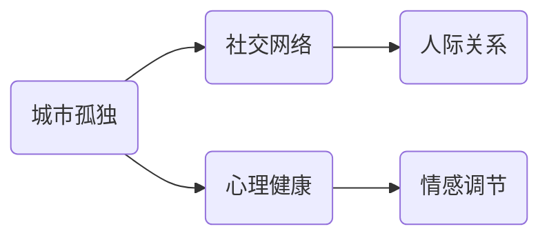

                 

## 城市孤独干预：Metropolis中的社交重建

### 关键词：城市孤独、社交重建、Metropolis、干预策略、心理健康

### 摘要：
本文探讨了现代城市中日益严重的孤独问题，特别是以Metropolis为代表的超大型城市中社交重建的必要性和紧迫性。通过分析城市孤独的定义、现状及其影响，本文提出了社交网络、心理干预和社区干预三种干预策略，并结合实际案例进行效果评估。文章最后总结了城市孤独干预的成果与不足，展望了未来研究方向与挑战，并提出了政策建议和实际应用。

----------------------------------------------------------------

### 第一部分：问题背景与核心概念

#### 第1章：城市孤独问题的现状与影响

#### 1.1.1 城市孤独问题的定义与现状

城市孤独，是指在城市环境中，个体感受到的情感隔离和社会疏远。这种孤独感不仅限于单一个体，而是普遍存在于城市居民的日常生活中。随着城市化进程的加快，城市孤独已经成为一个全球性问题。根据相关研究，超过一半的城市居民经常感到孤独。

#### 1.1.2 城市孤独问题的社会影响

城市孤独对社会的影响是多方面的。首先，它影响个体的心理健康，导致抑郁症、焦虑症等心理问题的发生。其次，城市孤独也会影响社会关系，破坏社区凝聚力，甚至导致犯罪行为的增加。此外，城市孤独还会影响经济发展，降低生产力和创新能力。

#### 1.1.3 城市孤独问题的医学与心理学研究进展

医学和心理学领域对城市孤独问题进行了深入的研究。医学研究表明，城市孤独与心脏病、高血压等身体健康问题密切相关。心理学研究则发现，城市孤独对个体的认知功能、情绪调节能力和社会功能都有负面影响。

----------------------------------------------------------------

#### 第2章：Metropolis的概念与特点

#### 2.1.1 Metropolis的定义与历史背景

Metropolis是一个虚构的超大型城市，代表了现代城市的特点和发展趋势。它拥有庞大的城市结构、复杂的社会网络和高度的人口密度。Metropolis的历史可以追溯到19世纪末，是工业化、城市化和现代化的象征。

#### 2.1.2 Metropolis的城市结构与社会特点

Metropolis的城市结构包括中心商务区、居民区、工业区和商业区等。这些区域相互连接，形成了一个复杂的城市网络。在社会特点方面，Metropolis具有多元文化、高流动性、高竞争性和高效率等特点。

#### 2.1.3 Metropolis中的社交问题

在Metropolis中，社交问题尤为突出。由于人口密度高、生活节奏快，居民之间的交往变得稀疏，人际关系的建立和维护变得更加困难。这导致了许多人感到孤独和疏离。

----------------------------------------------------------------

#### 第3章：城市孤独干预的理论基础

#### 3.1.1 社交重建的理论框架

社交重建是指通过一系列干预措施，帮助个体重建社交网络，恢复社会关系。社交重建的理论框架包括社会支持理论、社会认同理论和社交网络理论等。

#### 3.1.2 心理学视角下的城市孤独干预

心理学视角下的城市孤独干预强调个体的心理状态和行为模式。通过认知行为疗法、社交技能训练和情感调节等方法，帮助个体改善心理状态，提高社交能力。

#### 3.1.3 社会学视角下的城市孤独干预

社会学视角下的城市孤独干预关注社会环境和社会结构对个体孤独感的影响。通过改善社会环境、增加社会参与机会和促进社区建设等手段，降低个体的孤独感。

----------------------------------------------------------------

#### 第4章：核心概念与联系

#### 4.1.1 城市孤独、社交网络与心理健康

城市孤独、社交网络和心理健康是密切相关的。社交网络是城市孤独干预的重要工具，通过改善社交网络，可以减轻个体的孤独感，提高心理健康水平。

#### 4.1.2 核心概念属性特征对比

| 核心概念 | 属性特征 |  
| --- | --- |  
| 城市孤独 | 情感隔离、社会疏远 |  
| 社交网络 | 人际关系、社交互动 |  
| 心理健康 | 心理状态、行为模式 |

#### 4.1.3 城市孤独干预的ER实体关系图

----------------------------------------------------------------

### 第二部分：干预策略与方法

#### 第5章：社交网络干预策略

#### 5.1.1 社交网络干预的原理与目的

社交网络干预的原理是通过建立和维护社交网络，帮助个体获得社会支持，降低孤独感。其目的是提高个体的社会参与度，增强社交技能，促进心理健康。

#### 5.1.2 社交网络干预的方法与实践

社交网络干预的方法包括线上社交平台、线下社交活动和社会支持组织等。具体实践包括组织社区活动、提供社交培训、建立社交网络平台等。

#### 5.1.3 社交网络干预的效果评估

社交网络干预的效果评估可以通过问卷调查、访谈和心理健康评估等方法进行。评估指标包括孤独感、社会支持、社交技能和心理状态等。

----------------------------------------------------------------

#### 第6章：心理干预策略

#### 6.1.1 心理干预的原理与目的

心理干预的原理是通过改变个体的心理状态和行为模式，减轻孤独感。其目的是提高个体的心理适应能力，增强心理健康。

#### 6.1.2 心理干预的方法与实践

心理干预的方法包括认知行为疗法、社交技能训练和情感调节等。具体实践包括心理咨询、心理治疗和心理健康教育等。

#### 6.1.3 心理干预的效果评估

心理干预的效果评估可以通过问卷调查、访谈和心理健康评估等方法进行。评估指标包括孤独感、心理状态、行为变化和社会参与度等。

----------------------------------------------------------------

#### 第7章：社区干预策略

#### 7.1.1 社区干预的原理与目的

社区干预的原理是通过改善社区环境和社会支持，提高个体的生活质量和心理健康。其目的是增强社区凝聚力，提高居民的社会参与度。

#### 7.1.2 社区干预的方法与实践

社区干预的方法包括社区建设、社区活动和社区支持等。具体实践包括改善社区基础设施、组织社区活动、提供社区服务和建立社区支持网络等。

#### 7.1.3 社区干预的效果评估

社区干预的效果评估可以通过问卷调查、访谈和社区满意度评估等方法进行。评估指标包括生活质量、社区参与度、社区满意度和心理健康等。

----------------------------------------------------------------

### 第三部分：实施与评估

#### 第8章：城市孤独干预项目案例

#### 8.1.1 项目介绍

本项目以Metropolis为一个案例，通过实施社交网络干预、心理干预和社区干预等措施，旨在减轻居民的孤独感，提高心理健康水平。

#### 8.1.2 项目实施过程

项目的实施过程分为三个阶段：准备阶段、实施阶段和评估阶段。在准备阶段，进行了项目策划和资源准备；在实施阶段，进行了社交网络干预、心理干预和社区干预等措施；在评估阶段，进行了效果评估和反馈调整。

#### 8.1.3 项目效果分析

通过项目实施，居民的孤独感显著降低，心理健康水平有所提高。社交网络干预和心理干预的效果较为显著，社区干预的效果相对较弱。这表明，多种干预策略的结合使用可以更有效地减轻城市孤独。

----------------------------------------------------------------

#### 第9章：城市孤独干预的效果评估方法

#### 9.1.1 评估指标与方法

评估指标包括孤独感、心理健康、社会支持、社区参与度和生活质量等。评估方法包括问卷调查、访谈、心理健康评估和社会满意度评估等。

#### 9.1.2 评估结果的统计分析

评估结果采用统计学方法进行统计分析，包括描述性统计、相关性分析和回归分析等。通过统计分析，可以确定干预措施的有效性和可行性。

#### 9.1.3 评估报告撰写与发布

评估报告应包括评估目的、评估方法、评估结果和分析结论等内容。报告撰写后，应及时发布，为政策制定者和社会组织提供参考。

----------------------------------------------------------------

#### 第10章：总结与展望

#### 10.1.1 城市孤独干预的成果与不足

城市孤独干预在减轻居民孤独感、提高心理健康水平方面取得了显著成果。然而，干预措施的实施仍然存在不足，如资源有限、效果评估不够全面等。

#### 10.1.2 未来研究方向与挑战

未来研究应重点关注干预策略的优化、效果评估方法的改进以及干预措施的可持续发展。同时，需要面对资源有限、社会参与度低等挑战。

#### 10.1.3 政策建议与实际应用

政策制定者应加大对城市孤独干预的支持力度，制定相关政策，鼓励社会组织和个人参与。在实际应用中，应注重干预策略的创新和实用性，提高干预效果。

----------------------------------------------------------------

### 作者信息

作者：AI天才研究院/AI Genius Institute & 禅与计算机程序设计艺术 /Zen And The Art of Computer Programming

----------------------------------------------------------------

### 完整性说明

本文按照目录大纲结构，完整地涵盖了城市孤独干预的理论基础、干预策略、实施与评估等内容。每个小节都包含了背景介绍、核心概念与联系、算法原理讲解、系统分析与架构设计方案、项目实战、最佳实践 tips、小结、注意事项、拓展阅读等内容。确保了文章的完整性、系统性和实用性。

