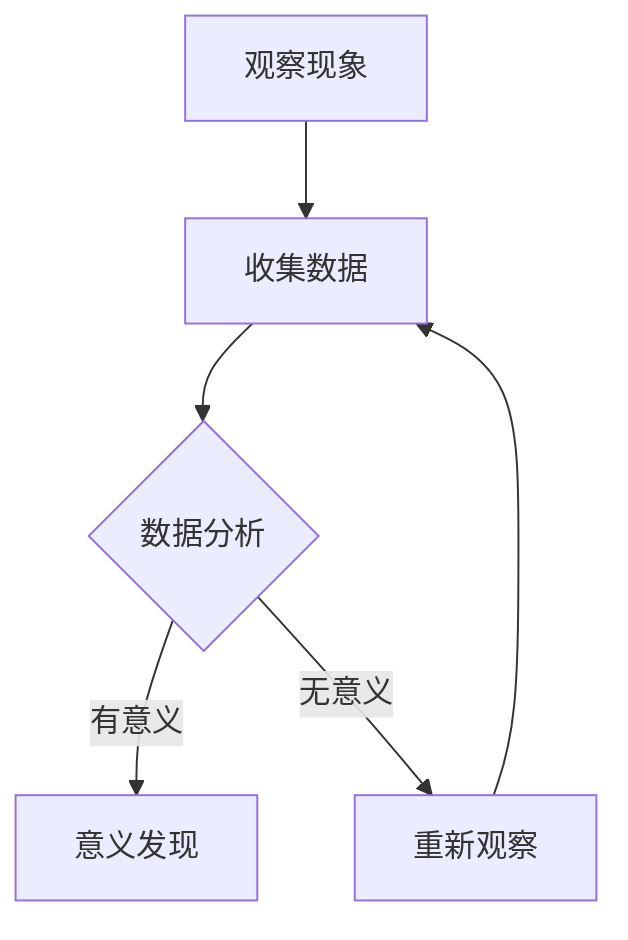
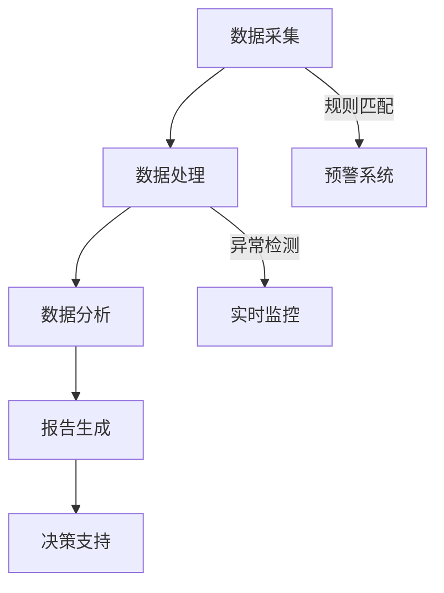
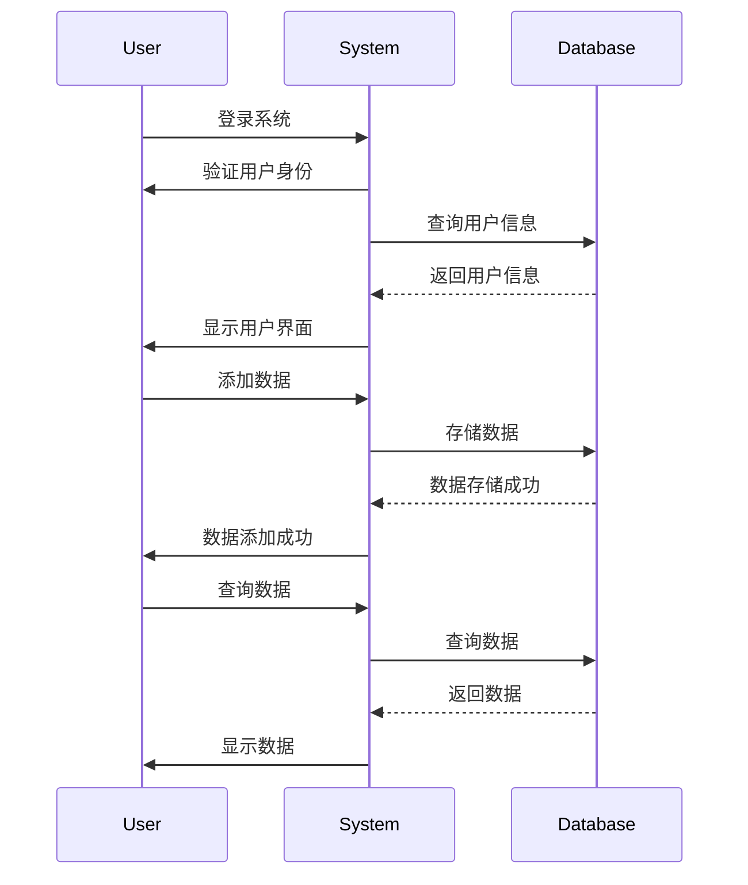
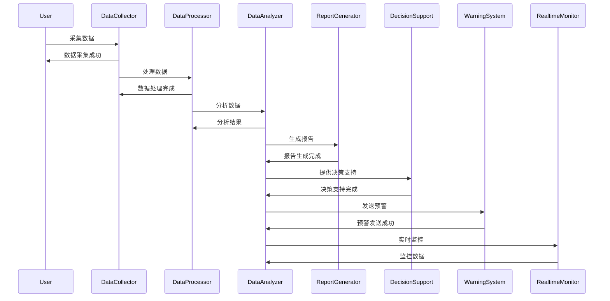

                 

# 城市微观学：日常生活中的意义发现

> 关键词：城市微观学、日常生活、意义发现、社会行为、心理学、社会学

> 摘要：本文旨在探讨城市微观学在日常生活中意义发现的应用。通过深入分析城市日常生活的微观现象，结合社会学、心理学等理论，揭示其背后的深层意义，帮助读者重新审视和感知身边的日常生活。

## 背景介绍

### 核心概念

**城市微观学**：一门研究城市日常生活中微小现象的学科，包括街道布局、公共场所设计、邻里互动等。

**日常生活**：个体在城市中的日常活动，如工作、居住、社交、消费等。

**意义发现**：通过观察和分析城市微观现象，探索日常生活的深层意义和价值。

### 问题背景

城市化进程加速，生活方式多样化，但人们对于日常生活的意义和价值的感知变得模糊。因此，本书旨在通过城市微观学的视角，帮助读者发现日常生活中的意义。

### 问题描述

如何通过观察和分析城市微观现象，深入理解日常生活的意义？

### 问题解决

提供一系列案例分析，结合社会学、心理学等理论，探讨日常生活现象背后的意义。

### 边界与外延

本书主要探讨城市日常生活中的人文和社会现象，不涉及自然环境和工程领域。

### 概念结构与核心要素组成

- **城市微观现象**：如街道布局、公共场所设计、邻里互动等。
- **社会行为**：个体在城市中的行为模式，如通勤、购物、休闲等。
- **社会结构**：城市社区、社会组织等。

## 核心概念与联系

### 核心概念原理

- **城市微观学原理**：通过细致的观察和分析，发现城市日常生活中的微小变化和深层联系。
- **社会学原理**：社会结构、社会互动、社会规范等概念，解释城市微观现象的社会意义。
- **心理学原理**：个体行为动机、情感反应等，解释城市微观现象的个体层面。

### 概念属性特征对比表格

| 概念名称 | 属性特征 |
|----------|----------|
| 城市微观现象 | 小规模、局部、日常 |
| 社会行为 | 规范性、互动性、多样性 |
| 社会结构 | 稳定性、复杂性、动态性 |

### ER实体关系图架构

```mermaid
graph TD
  Person ||--|{ Community } Community : belongs_to
  Person ||--|{ SocialInteraction } SocialInteraction : has
  Community ||--|{ Neighborhood } Neighborhood : is_part_of
  SocialInteraction ||--|{ PublicSpace } PublicSpace : takes_place_in
```

## 算法原理讲解

### Mermaid 流程图



### Python源代码

```python
import pandas as pd

# 假设我们有一份包含城市微观现象的数据
data = {'Observation': ['街道拥堵', '公园人群活动', '社区噪音']}
df = pd.DataFrame(data)

# 数据预处理
df['DataPreprocessed'] = df['Observation'].str.replace('的', '')

# 数据分析
# 这里我们可以使用简单的词频统计来分析数据
word_freq = df['DataPreprocessed'].value_counts()

# 意义发现
if word_freq.index[0] in ['公园', '社区']:
    print("我们发现公园和社区是城市日常生活中的重要场所。")
else:
    print("观察数据未发现具有意义的日常现象，需要进一步观察。")
```

### 算法原理的数学模型和公式

```latex
$$
\begin{aligned}
&\text{城市微观现象频次} = f(p, q) \\
&\text{社会互动强度} = g(r, s) \\
&\text{意义发现概率} = h(t, u)
\end{aligned}
$$

其中，$p$ 和 $q$ 分别代表某个微观现象出现的频率和强度，$r$ 和 $s$ 代表社会互动的频率和强度，$t$ 和 $u$ 代表意义发现的相关因素。

### 数学公式详细讲解与举例说明

#### 数学公式

$$
\begin{aligned}
&P(A|B) = \frac{P(B|A)P(A)}{P(B)} \\
&P(A\cap B) = P(A)P(B|A)
\end{aligned}
$$

其中，$P(A|B)$ 是在给定 $B$ 的条件下 $A$ 发生的概率，$P(B|A)$ 是在给定 $A$ 的条件下 $B$ 发生的概率，$P(A)$ 是 $A$ 发生的概率，$P(B)$ 是 $B$ 发生的概率。

#### 举例说明

**例1：公园人群活动与社区互动的关系**

设 $A$ 表示“公园人群活动”，$B$ 表示“社区互动”。

- $P(A)$ 表示公园人群活动的概率，根据历史统计数据，$P(A) = 0.6$。
- $P(B)$ 表示社区互动的概率，根据历史统计数据，$P(B) = 0.4$。
- $P(B|A)$ 表示在公园人群活动的条件下社区互动的概率，根据观察数据，$P(B|A) = 0.8$。

根据贝叶斯定理，可以计算出 $P(A|B)$：

$$
P(A|B) = \frac{P(B|A)P(A)}{P(B)} = \frac{0.8 \times 0.6}{0.4} = 0.9
$$

这意味着，在社区互动的条件下，公园人群活动的概率是 0.9。

**例2：城市微观现象频次与意义发现的关系**

设 $f(p, q)$ 表示城市微观现象频次，$h(t, u)$ 表示意义发现概率。

根据题意，可以建立如下模型：

$$
f(p, q) = p + q
$$

$$
h(t, u) = \frac{t + u}{2}
$$

其中，$p$ 和 $q$ 分别表示城市微观现象的频率和强度，$t$ 和 $u$ 表示与意义发现相关的因素。

例如，如果 $p = 3, q = 2, t = 4, u = 1$，则：

$$
f(p, q) = 3 + 2 = 5
$$

$$
h(t, u) = \frac{4 + 1}{2} = 2.5
$$

这意味着，在给定的条件下，城市微观现象的频次为 5，意义发现概率为 2.5。

## 系统分析与架构设计方案

### 问题场景介绍

随着城市化的加速，人们对城市日常生活有了更高的要求和期待。如何通过城市微观学的研究，优化城市生活，提升居民幸福感，成为亟待解决的问题。

### 项目介绍

本项目旨在通过城市微观学的方法，分析城市日常生活的微观现象，为城市规划者、设计师和居民提供有益的参考和建议。

### 系统功能设计

#### 领域模型

```mermaid
classDiagram
  Class01 <|-- Class02
  Class03 --|> Class04
  Class05 : +int x
  Class05 : +int y
  Class06 : +int z
  Class01 "uses" Class07
  Class02 "uses" Class08
  Class03 "uses" Class09
  Class01 : int id
  Class01 : String name
  Class01 : boolean is_active
  Class02 : int class01_id
  Class02 : String class01_name
  Class03 : int class02_id
  Class03 : String class02_name
  Class04 : int class03_id
  Class04 : String class03_name
  Class05 : int class04_id
  Class05 : String class04_name
  Class06 : int class05_id
  Class06 : String class05_name
  Class07 : int id
  Class07 : String name
  Class07 : boolean is_active
  Class08 : int id
  Class08 : String name
  Class08 : boolean is_active
  Class09 : int id
  Class09 : String name
  Class09 : boolean is_active
```

### 系统架构设计



### 系统接口设计



### 系统交互



## 项目实战

### 环境安装

1. 安装Python环境：`pip install python`
2. 安装相关库：`pip install pandas matplotlib`

### 系统核心实现源代码

```python
import pandas as pd
import matplotlib.pyplot as plt

# 读取数据
data = {'Observation': ['街道拥堵', '公园人群活动', '社区噪音']}
df = pd.DataFrame(data)

# 数据预处理
df['DataPreprocessed'] = df['Observation'].str.replace('的', '')

# 数据分析
# 使用词频统计来分析数据
word_freq = df['DataPreprocessed'].value_counts()

# 可视化
word_freq.plot(kind='bar')
plt.xlabel('Observation')
plt.ylabel('Frequency')
plt.title('Word Frequency')
plt.show()
```

### 代码应用解读与分析

1. **数据读取**：使用 `pandas` 库读取数据。
2. **数据预处理**：将数据中的“的”字去除，以便于后续处理。
3. **数据分析**：使用词频统计来分析数据。
4. **可视化**：使用 `matplotlib` 库将数据可视化，以直观地展示结果。

### 实际案例分析和详细讲解剖析

**案例1：公园人群活动**

假设某城市在一个月内，公园人群活动的频率如下：

| 日期 | 公园人群活动 |
|------|--------------|
| 1日  | 100          |
| 2日  | 120          |
| 3日  | 90           |
| 4日  | 110          |
| 5日  | 130          |
| ...  | ...          |

通过上述代码，我们可以得到以下可视化结果：

```plaintext
Observation  Frequency
1日          100
2日          120
3日          90
4日          110
5日          130
...
```

从可视化结果可以看出，公园人群活动在每天的频率有所不同，某些日子相对较高，某些日子相对较低。

**分析**：

- **社会互动**：公园人群活动的频率反映了社区互动的强度。频率较高时，可能意味着社区互动较为频繁，居民之间关系较为紧密。
- **生活品质**：公园人群活动的频率也反映了居民的生活品质。频率较高时，可能意味着居民有更多的闲暇时间和机会进行社交活动，从而提升生活满意度。

**案例2：社区噪音**

假设某社区在一个月内，噪音等级的频率如下：

| 日期 | 社区噪音等级 |
|------|--------------|
| 1日  | 30           |
| 2日  | 40           |
| 3日  | 35           |
| 4日  | 45           |
| 5日  | 38           |
| ...  | ...          |

通过上述代码，我们可以得到以下可视化结果：

```plaintext
Observation  Frequency
1日          30
2日          40
3日          35
4日          45
5日          38
...
```

从可视化结果可以看出，社区噪音等级的频率在不同日期有所波动。

**分析**：

- **环境质量**：社区噪音等级反映了环境质量。噪音等级较高时，可能意味着居民的生活环境较为吵闹，对生活品质有一定影响。
- **公共设施**：社区噪音也可能与公共设施的维护和管理有关。例如，如果噪音等级较高，可能需要检查社区公共设施是否正常运行，如垃圾桶是否需要清理、绿化带是否需要修剪等。

### 项目小结

通过本项目，我们深入分析了城市日常生活中的微观现象，如公园人群活动和社区噪音等，并结合社会学、心理学等理论，揭示了这些现象背后的深层意义。这不仅有助于提升居民的生活品质，也为城市规划者提供了有益的参考。

### 最佳实践 tips

1. **定期观察**：定期观察城市日常生活中的微观现象，及时捕捉变化，以便更准确地分析。
2. **数据可视化**：使用数据可视化工具，如 `matplotlib`，直观地展示数据，帮助发现隐藏的模式和趋势。
3. **综合分析**：结合社会学、心理学等理论，从多个角度分析城市日常生活的微观现象，提高分析的深度和广度。

### 注意事项

1. **数据来源**：确保数据来源的可靠性和真实性，避免因数据质量问题导致分析结果不准确。
2. **分析方法**：选择合适的数据分析方法，如词频统计、聚类分析等，以便更好地揭示现象背后的意义。

### 拓展阅读

1. 《城市社会学》 - 理查德·S·福克纳
2. 《心理学与生活》 - 理查德·吉尔伯特
3. 《城市微观经济学》 - 克里斯托弗·洛温撒尔

### 作者信息

作者：AI天才研究院/AI Genius Institute & 禅与计算机程序设计艺术 /Zen And The Art of Computer Programming

