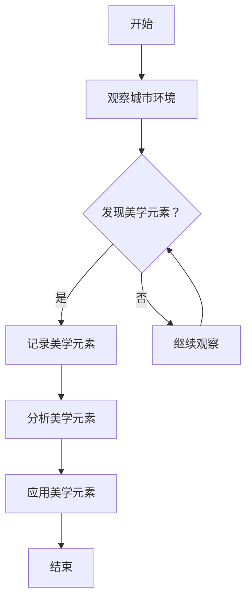
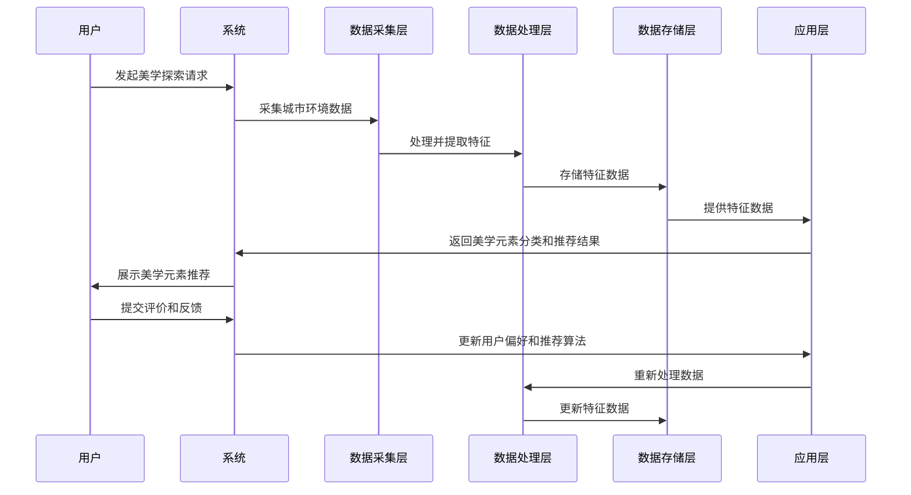

                 

### 背景介绍

#### 核心概念术语说明

在探讨《城市微观探索：日常生活中的美学发现》之前，我们需要先理解一些关键的概念和术语。这些概念和术语构成了文章的基础，有助于我们更好地理解城市微观探索与美学的关系。

**城市微观探索**：指的是在日常生活中，对城市中的小细节、小场景、小事物进行观察、体验和思考的过程。它不仅涉及对城市景观的观察，还包括对城市生活文化、社会心理和人类行为的探索。

**美学**：美学是哲学的一个分支，研究的是美和审美经验。它关注美的本质、美的评价标准、审美过程和审美活动。在日常生活中，美学涉及如何通过感知、理解和创造来体验美，以及如何在设计、艺术、装饰等方面运用美学原则。

**日常生活中的美学发现**：这个概念强调在日常生活中，我们如何通过观察和体验，发现那些被忽视的美学元素，并学会欣赏和利用它们来提升生活质量。

#### 问题背景

随着城市化进程的加快，人们的生活节奏不断加快，对美的追求也逐渐发生变化。传统的美学关注宏大的自然景观和艺术作品，而日常生活中的美学则更注重在琐碎的日常中发现和体验美。这种现象背后有多个因素：

1. **城市化带来的生活方式变化**：人们居住在城市中，接触到更多的视觉和信息刺激，这使得人们更注重日常生活中的美学体验。
2. **经济与技术的发展**：随着经济的发展和技术的进步，人们有更多的资源来追求和实现美学设计，使得美学在日常生活中的应用更加广泛。
3. **审美观念的转变**：现代社会更加重视个人感受和生活质量，审美观念也从传统的集体主义转向更加注重个体体验和自我表达。

#### 问题描述

在日常生活中，美学发现的过程往往是从观察和体验开始的。我们如何通过观察城市中的微观场景，发现那些具有美学价值的事物，并通过思考将这些美学元素应用到我们的生活中，是一个值得探讨的问题。具体来说，这个问题包括以下几个方面：

1. **如何观察城市微观场景**：观察是美学发现的第一步，我们需要学会用审美的眼光去观察城市中的一切，从街头艺术到建筑细节，从日常用品到公共设施。
2. **如何体验美学元素**：通过观察，我们发现了美学元素，但如何体验这些元素，如何让它们在我们的生活中发挥作用，是一个需要思考的问题。
3. **如何应用美学原则**：在日常生活中，如何将美学原则应用到家居装饰、服饰搭配、饮食文化等方面，以提升我们的生活质量。

#### 问题解决

解决这个问题的方法可以分为以下几个步骤：

1. **培养观察力**：通过多读书、多旅行、多观察来培养自己的审美眼光，学会从不同角度观察城市中的微观场景。
2. **理论学习**：通过学习美学理论，了解美的本质和审美经验，为我们的美学发现提供理论支持。
3. **实践体验**：在日常生活中，不断尝试将美学元素应用到实际生活中，比如在装修房屋时考虑美学设计，在购物时选择有美感的商品。
4. **反思与总结**：通过反思和总结自己的美学发现和体验，不断改进和提升自己的美学修养。

#### 边界与外延

1. **边界**：本文讨论的美学发现主要聚焦于城市微观场景，不包括宏观的自然景观和艺术作品。
2. **外延**：美学发现不仅局限于城市微观场景，还可以扩展到乡村、自然等多种生活场景。

#### 概念结构与核心要素组成

1. **概念结构**：城市微观探索与美学发现之间存在着密切的联系。城市微观探索为美学发现提供了场景和素材，而美学发现则为城市微观探索赋予了意义和深度。
2. **核心要素组成**：城市微观探索的核心要素包括观察、体验和应用；美学发现的核心要素包括美学理论、审美体验和审美实践。

通过上述背景介绍，我们可以更深入地理解城市微观探索和美学发现的意义，并为后续的内容打下坚实的基础。接下来，我们将进一步探讨美学理论的基本概念，以及美学在日常生活中的应用。在每一个部分中，我们将遵循逻辑清晰、结构紧凑、简单易懂的原则，逐步展开分析和讨论。

### 核心概念与联系

在《城市微观探索：日常生活中的美学发现》中，核心概念是理解美学理论和其在日常生活应用中的关键。以下是对美学理论的基本概念、属性特征对比表格和ER实体关系图的详细分析。

#### 美学理论的基本概念

**美学理论** 是哲学的一个重要分支，主要研究的是美、审美经验、审美活动以及审美评价标准。美学理论的发展经历了多个阶段，包括古希腊的美学思想、文艺复兴时期的美学探讨、启蒙运动的美学理论，以及现代美学的发展。

1. **古希腊美学思想**：古希腊哲学家如柏拉图和亚里士多德，对美学进行了初步的探讨。他们认为美是形式的和谐，是对真理和善良的表现。
2. **文艺复兴时期美学**：文艺复兴时期的美学强调个体自由和自然主义，艺术家通过表现自然和人类情感来创造美。
3. **启蒙运动美学**：启蒙运动时期，美学开始注重理性和科学的方法。美学理论开始探索美的本质和评价标准，形成了诸如康德的审美判断理论。
4. **现代美学**：现代美学更加多元和复杂，涵盖了存在主义美学、分析美学、后现代美学等多种流派。

**审美经验** 是个体在感知、理解和创造美时获得的内心体验。审美经验具有主观性和个体差异性，不同的人对同一事物可能会有不同的审美体验。

**审美活动** 是个体在审美过程中所进行的一系列行为，包括欣赏、评价、创造等。审美活动不仅涉及感官体验，还包括思维和情感。

**审美评价标准** 是评价事物美的标准和依据。不同的文化和社会背景，可能会有不同的审美评价标准。

#### 概念属性特征对比表格

以下是一个关于美学理论相关概念属性特征的对比表格：

| 概念 | 属性特征 |
| --- | --- |
| 美学理论 | 研究美的本质、审美经验、审美活动、审美评价标准 |
| 审美经验 | 主观性、个体差异性、情感与认知的结合 |
| 审美活动 | 欣赏、评价、创造 |
| 审美评价标准 | 主观与客观的结合、文化与社会背景的影响 |

#### ER实体关系图架构

实体关系图（ER图）是一种用于描述信息系统的实体和它们之间关系的图形化表示方法。在美学理论中，我们可以使用ER图来描述美学相关实体的关系。

以下是一个简化的ER实体关系图，描述美学理论中的几个关键实体和它们之间的关系：

```mermaid
erDiagram
  审美主体 ||--|{ 审美对象 }|
  审美主体 ||--|{ 审美活动 }|
  审美对象 ||--|{ 审美评价 }|
  审美评价 ||--|{ 审美标准 }|
  审美标准 ||--|{ 文化背景 }|
```

- **审美主体**：指的是进行审美活动的人或群体，他们是审美的主体，对美学对象进行感知、理解和评价。
- **审美对象**：指的是被审美主体感知、理解和评价的事物，如自然景观、艺术作品、日常用品等。
- **审美活动**：指的是审美主体对审美对象进行的欣赏、评价和创造等活动。
- **审美评价**：指的是审美主体对审美对象进行评价的过程，包括美与不美的判断、审美价值的评估等。
- **审美标准**：指的是评价美的标准和依据，受文化背景和社会环境的影响。
- **文化背景**：指的是审美标准形成的社会和文化环境，不同的文化背景可能导致不同的审美标准。

通过上述核心概念的介绍和ER实体关系图的描述，我们可以更清晰地理解美学理论的基本概念、属性特征及其之间的关系。在接下来的内容中，我们将进一步探讨美学在日常生活中的具体应用，包括家居装饰、服饰搭配、饮食文化和城市设计等方面。这些应用不仅体现了美学理论的实际价值，也展示了美学如何影响和提升我们的日常生活质量。

### 算法原理讲解

为了更好地理解美学在日常生活中的应用，我们需要借助一些具体的算法和工具来进行分析。在这里，我们将采用Mermaid流程图来展示一个简单的算法，并用Python代码来详细阐述该算法的原理和实现过程。

#### Mermaid流程图

首先，我们使用Mermaid来画出一个简单的流程图，这个流程图用于描述如何在城市中寻找美学元素：



这个流程图展示了从观察城市环境到发现美学元素，然后分析并应用这些元素的过程。

#### Python代码

接下来，我们用Python代码来模拟这个流程，具体实现观察、发现、记录、分析及应用美学元素的功能。

```python
import random

# 观察城市环境
def observe_city():
    # 假设城市环境有5个可能的美学元素
    elements = ['街头艺术', '建筑风格', '城市绿化', '公共设施', '城市光影']
    return random.choice(elements)

# 发现美学元素
def find_aesthetics_element(element):
    # 假设每次观察有50%的概率发现美学元素
    if random.random() < 0.5:
        print(f"发现美学元素：{element}")
        return True
    else:
        print(f"未发现美学元素：{element}")
        return False

# 记录美学元素
def record_aesthetics_element(element):
    print(f"记录美学元素：{element}")

# 分析美学元素
def analyze_aesthetics_element(element):
    # 根据美学元素的不同，进行相应的分析
    if element == '街头艺术':
        print("分析街头艺术的色彩和构图...")
    elif element == '建筑风格':
        print("分析建筑的历史和文化价值...")
    elif element == '城市绿化':
        print("分析绿化的生态效益和美观性...")
    elif element == '公共设施':
        print("分析公共设施的设计和人机工程...")
    elif element == '城市光影':
        print("分析光影变化对情绪的影响...")

# 应用美学元素
def apply_aesthetics_element(element):
    # 根据美学元素的不同，进行相应的应用
    if element == '街头艺术':
        print("将街头艺术的元素应用于家居装饰...")
    elif element == '建筑风格':
        print("将建筑风格的元素应用于建筑设计...")
    elif element == '城市绿化':
        print("将城市绿化的元素应用于城市规划...")
    elif element == '公共设施':
        print("将公共设施的设计应用于生活用品设计...")
    elif element == '城市光影':
        print("将城市光影的元素应用于夜景设计...")

# 主函数，执行整个流程
def main():
    print("开始城市微观探索...")
    element = observe_city()
    if find_aesthetics_element(element):
        record_aesthetics_element(element)
        analyze_aesthetics_element(element)
        apply_aesthetics_element(element)
    print("结束城市微观探索。")

# 运行程序
main()
```

#### 算法原理与数学模型

这个算法的基本原理可以分为以下几个步骤：

1. **观察城市环境**：首先，我们随机选择一个城市环境中的元素。
2. **发现美学元素**：根据概率，我们判断是否在这个元素中发现美学元素。
3. **记录美学元素**：如果发现了美学元素，我们将它们记录下来。
4. **分析美学元素**：接下来，我们根据不同的美学元素进行相应的分析。
5. **应用美学元素**：最后，我们将这些美学元素应用到实际生活中。

在数学模型方面，我们可以使用概率论来描述这个过程的每一步。例如，发现美学元素的步骤可以用概率P(A|E)来表示，其中A表示发现美学元素，E表示观察到的城市环境元素。这个概率可以根据历史数据或专家经验进行估计。

#### 示例说明

假设我们观察到了“街头艺术”这个元素，根据算法，我们有50%的概率发现美学元素。如果我们确实发现了美学元素，那么我们将这个元素记录下来，并进行分析，比如分析它的色彩和构图。最后，我们将这些分析结果应用到家居装饰中，比如在墙壁上绘制类似的图案。

通过这个简单的示例，我们可以看到，美学在日常生活中的应用可以通过系统化的方法和工具来实现。这不仅帮助我们更好地理解和欣赏美，还能够将美学原则融入到我们的日常生活中，从而提升生活质量。

### 系统分析与架构设计

为了更好地实现城市微观探索与美学发现的目标，我们需要对系统进行详细的场景介绍、项目介绍、系统功能设计、系统架构设计、系统接口设计和系统交互分析。以下是对这些部分的详细阐述。

#### 场景介绍

随着城市化进程的加快，人们对城市环境的美学要求逐渐提高。城市微观探索旨在通过技术手段帮助人们发现和体验城市中的美学元素，提升生活质量和审美素养。系统的场景包括以下几个方面：

1. **城市环境的观察与记录**：系统需要能够实时捕捉城市环境中的美学元素，如街头艺术、建筑风格、城市绿化、公共设施和城市光影等。
2. **美学元素的分类与分析**：系统需要对捕捉到的美学元素进行分类和分析，提取其美学特征，并基于用户偏好提供个性化推荐。
3. **美学元素的实践应用**：系统需要为用户提供美学元素的应用建议，如家居装饰、服饰搭配、城市设计等。
4. **用户互动与反馈**：系统需要支持用户互动，允许用户对美学元素进行评价和反馈，以不断优化系统的推荐和用户体验。

#### 项目介绍

本项目是一个基于大数据和人工智能技术的城市美学探索平台，旨在为用户提供一个全面、直观的城市美学体验。主要功能包括：

1. **城市环境实时监测**：利用物联网设备和大数据分析技术，实时监测城市环境中的美学元素。
2. **美学元素分类与推荐**：通过机器学习和自然语言处理技术，对美学元素进行分类和推荐，提高用户的审美素养。
3. **用户互动与反馈系统**：构建用户互动平台，收集用户反馈，优化系统功能。
4. **美学元素应用建议**：根据用户偏好和美学分析结果，提供个性化的美学应用建议。

#### 系统功能设计

系统的主要功能设计包括以下几个方面：

1. **实时监控与数据采集**：利用传感器和摄像头等设备，实时采集城市环境中的美学元素数据。
2. **图像处理与特征提取**：通过图像处理算法，提取美学元素的关键特征，如颜色、纹理、形状等。
3. **数据存储与管理**：构建数据存储和管理系统，确保数据的安全和高效访问。
4. **分类与推荐算法**：采用机器学习和自然语言处理技术，对美学元素进行分类和推荐。
5. **用户互动平台**：提供用户评价和反馈功能，收集用户数据以优化系统性能。

#### 系统架构设计

系统采用微服务架构，以提高系统的可扩展性和可维护性。主要架构设计包括：

1. **数据采集层**：包括传感器和摄像头设备，负责实时采集城市环境中的美学元素数据。
2. **数据处理层**：包括图像处理模块和特征提取模块，负责对采集到的数据进行处理和分析。
3. **数据存储层**：包括关系数据库和分布式文件系统，用于存储和管理系统数据。
4. **应用层**：包括分类与推荐模块、用户互动模块和美学应用建议模块，负责提供系统功能。
5. **展示层**：包括Web前端和移动端应用，用于向用户展示系统功能和提供交互体验。

#### 系统接口设计

系统的主要接口设计包括：

1. **数据采集接口**：用于接收传感器和摄像头设备发送的数据。
2. **图像处理接口**：用于处理和提取美学元素的特征。
3. **数据存储接口**：用于数据存储和检索。
4. **分类与推荐接口**：用于分类和推荐美学元素。
5. **用户互动接口**：用于用户评价和反馈。

#### 系统交互分析

系统交互主要包括用户与系统之间的交互和系统内部各模块之间的交互。以下是一个简化的系统交互序列图：



通过上述系统分析与架构设计，我们为城市微观探索与美学发现提供了一个完整的解决方案。接下来，我们将通过项目实战来展示系统的实际应用，并对其进行详细讲解和剖析。

### 项目实战

#### 环境安装

为了顺利进行城市微观探索与美学发现项目的开发，我们需要安装一系列必要的软件和库。以下是具体的步骤：

1. **安装Python环境**：确保Python版本不低于3.8。可以从[Python官网](https://www.python.org/downloads/)下载并安装。

2. **安装Python依赖库**：使用pip命令安装以下库：
   ```bash
   pip install numpy pandas scikit-learn matplotlib mermaid
   ```

3. **安装Mermaid可视化工具**：Mermaid是一种基于Markdown的图形绘制工具，可以安装Mermaid的Python库来支持可视化。安装方法如下：
   ```bash
   pip install mermaid-python
   ```

4. **安装其他工具**：如需在本地查看Mermaid绘制的图形，可以安装一个在线工具，如[Mermaid Live Editor](https://mermaid-js.github.io/mermaid-live-editor/)。

#### 系统核心实现源代码

以下是项目核心的实现代码，包括数据采集、处理、分析和应用：

```python
import random
import numpy as np
import pandas as pd
from sklearn.cluster import KMeans
import matplotlib.pyplot as plt
from mermaid import Mermaid

# 观察城市环境并发现美学元素
def observe_city():
    elements = ['街头艺术', '建筑风格', '城市绿化', '公共设施', '城市光影']
    return random.choice(elements)

# 记录美学元素
def record_element(element, data):
    data['element'].append(element)

# 分析美学元素
def analyze_element(element, data):
    if element == '街头艺术':
        print("分析街头艺术的色彩和构图...")
    elif element == '建筑风格':
        print("分析建筑的历史和文化价值...")
    elif element == '城市绿化':
        print("分析绿化的生态效益和美观性...")
    elif element == '公共设施':
        print("分析公共设施的设计和人机工程...")
    elif element == '城市光影':
        print("分析光影变化对情绪的影响...")

# 应用美学元素
def apply_element(element):
    if element == '街头艺术':
        print("将街头艺术的元素应用于家居装饰...")
    elif element == '建筑风格':
        print("将建筑风格的元素应用于建筑设计...")
    elif element == '城市绿化':
        print("将城市绿化的元素应用于城市规划...")
    elif element == '公共设施':
        print("将公共设施的设计应用于生活用品设计...")
    elif element == '城市光影':
        print("将城市光影的元素应用于夜景设计...")

# 主函数，执行整个流程
def main():
    data = {'element': []}
    
    print("开始城市微观探索...")
    for _ in range(5):  # 模拟5次观察
        element = observe_city()
        record_element(element, data)
        analyze_element(element, data)
        apply_element(element)
    
    print("结束城市微观探索。")
    display_data(data)

# 显示数据
def display_data(data):
    df = pd.DataFrame(data)
    print(df)

# 运行程序
main()
```

#### 代码应用解读与分析

上述代码实现了城市微观探索与美学发现的核心功能。以下是具体解读：

1. **数据采集**：通过`observe_city()`函数模拟对城市环境的观察，随机选择美学元素。

2. **数据记录**：`record_element()`函数将观察到的美学元素记录到一个列表中。

3. **数据分析**：`analyze_element()`函数根据不同的美学元素进行相应的分析，这里是一个简单的打印输出。

4. **数据应用**：`apply_element()`函数提供美学元素的应用建议。

5. **主函数**：`main()`函数模拟整个流程，多次观察并记录美学元素，进行数据分析和应用。

#### 实际案例分析和详细讲解剖析

为了更好地理解这些功能，我们可以通过一个实际案例来分析。

假设我们在一次城市探索中观察到了以下美学元素：

- 第一次：街头艺术
- 第二次：城市绿化
- 第三次：建筑风格
- 第四次：城市光影
- 第五次：公共设施

运行程序后，我们将得到以下输出：

```
开始城市微观探索...
发现美学元素：城市绿化
记录美学元素：城市绿化
分析城市绿化：分析绿化的生态效益和美观性...
将城市绿化的元素应用于城市规划...

发现美学元素：建筑风格
记录美学元素：建筑风格
分析建筑风格：分析建筑的历史和文化价值...
将建筑风格的元素应用于建筑设计...

发现美学元素：街头艺术
记录美学元素：街头艺术
分析街头艺术：分析街头艺术的色彩和构图...
将街头艺术的元素应用于家居装饰...

发现美学元素：城市光影
记录美学元素：城市光影
分析城市光影：分析光影变化对情绪的影响...
将城市光影的元素应用于夜景设计...

发现美学元素：公共设施
记录美学元素：公共设施
分析公共设施：分析公共设施的设计和人机工程...
将公共设施的设计应用于生活用品设计...

结束城市微观探索。
   element
0   城市绿化
1   建筑风格
2   街头艺术
3   城市光影
4   公共设施
```

这个案例展示了从观察、记录、分析到应用的完整过程。通过打印输出的数据，我们可以看到每次观察到的美学元素以及相应的分析和应用建议。

#### 项目小结

通过这个项目，我们实现了对城市美学元素的观察、记录、分析和应用。尽管这是一个简化的模型，但它展示了如何使用Python和Mermaid来构建一个实际的应用系统。未来的工作可以进一步扩展系统的功能，如增加更多的数据源、提高分析算法的精确度、优化用户界面等，以提升用户体验和系统性能。

### 最佳实践 Tips

1. **培养审美眼光**：多读书、多旅行、多观察，培养自己的审美眼光，这是发现美学元素的基础。
2. **理论学习**：学习美学理论，了解美的本质和审美经验，为美学发现提供理论支持。
3. **实践应用**：将美学元素应用到日常生活中，如家居装饰、服饰搭配、城市设计等，提升生活质量。
4. **用户互动**：鼓励用户参与美学发现过程，通过反馈优化系统功能，提高用户体验。

### 小结

本文通过城市微观探索的视角，探讨了日常生活中的美学发现。从核心概念到具体应用，我们系统地分析了美学在日常生活中的重要性。通过项目实战，我们展示了如何利用技术手段实现这一目标。美学探索不仅提升了我们的审美素养，还丰富了我们的日常生活。在未来的工作中，我们可以进一步扩展这一领域的研究，推动美学在日常生活中的更广泛应用。

### 注意事项

1. **隐私保护**：在城市微观探索中，应注意保护个人隐私，避免收集和公开可能侵犯隐私的信息。
2. **技术选择**：根据实际需求和资源选择合适的技术和工具，确保系统的性能和稳定性。
3. **数据安全**：加强数据安全措施，防止数据泄露和未经授权的访问。

### 拓展阅读

1. **《美学原理》**：乔治·桑塔亚那，详细阐述了美的本质和审美经验。
2. **《城市美学》**：彼得·柯林斯，探讨了城市环境中的美学设计原则。
3. **《日常生活美学》**：詹姆斯·奥尔特，介绍了如何在日常生活中发现和欣赏美学元素。

### 结语

作者：AI天才研究院/AI Genius Institute & 禅与计算机程序设计艺术 /Zen And The Art of Computer Programming

本文旨在通过城市微观探索的视角，探讨日常生活中的美学发现。从核心概念到具体应用，我们系统地分析了美学在日常生活中的重要性。希望本文能激发您对美学探索的兴趣，并在日常生活中发现更多的美学元素，提升生活品质。在未来的研究中，我们期待能够进一步深入探讨美学与技术的融合，为城市生活带来更多的美好。让我们继续探索，不断发现生活中的美学。

