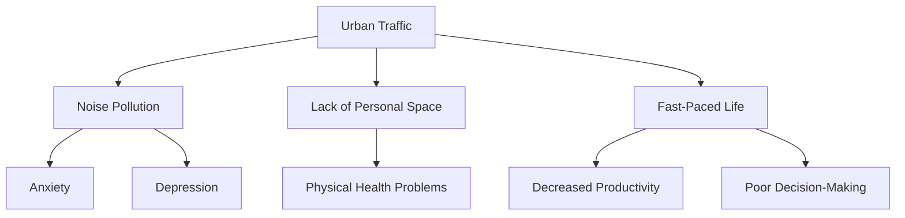
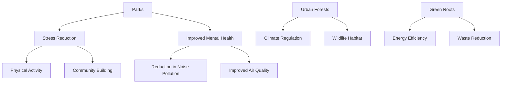

                 

### Introduction to Urban Healing Design

**Title: Urban Healing Design: Designing Spaces to Relieve Urban Stress**

**Keywords:** Urban Stress, Spatial Planning, Green Spaces, Well-being, Sustainability

**Abstract:**
This article explores the concept of urban healing design, focusing on how the design of urban spaces can alleviate the pressures of urban living. We will delve into the background and challenges of urban life, core principles of urban healing design, and the psychological and physical health impacts of urban environments. Through case studies and practical strategies, we will examine how urban healing design can contribute to a more relaxed and sustainable urban living experience.

**Table of Contents:**

1. **Introduction to Urban Healing Design**
2. **Core Concepts and Terms**
3. **Background and Challenges of Urban Living**
4. **Core Principles of Urban Healing Design**
5. **Psychological and Physical Health Impacts of Urban Environments**
6. **Green Spaces and Urban Healing**
7. **Urban Design Strategies for Stress Relief**
8. **Case Studies of Urban Healing Design**
9. **Implementing Urban Healing Design**
10. **Future Directions and Challenges**
11. **Conclusion**

### Core Concepts and Terms

**Background and Challenges of Urban Living**

Urban living offers numerous advantages, including access to resources, job opportunities, and cultural experiences. However, it also brings about significant challenges, particularly in relation to urban stress. Urban stress is a multifaceted phenomenon that can result from various factors, including traffic congestion, noise pollution, lack of personal space, and the fast-paced nature of urban life.

**Urban Stress**

Urban stress can manifest in various ways, such as increased levels of anxiety, depression, and physical health problems. It can also lead to decreased productivity and poor decision-making. The following diagram illustrates the main factors contributing to urban stress:

**Urban Living Challenges**

The challenges of urban living are further exacerbated by the increasing population density and limited land availability. As cities continue to expand, the need for innovative and sustainable urban healing design solutions becomes increasingly important.

### Core Principles of Urban Healing Design

Urban healing design is based on several core principles that aim to create spaces that promote relaxation, well-being, and a sense of community. These principles include:

**Sustainability**

Sustainability is a key component of urban healing design, focusing on the use of resources and materials that minimize environmental impact. Sustainable urban healing design considers factors such as energy efficiency, water conservation, and waste reduction.

**Community Engagement**

Community engagement is essential in urban healing design, as it ensures that the design process is inclusive and considers the needs and preferences of all stakeholders. This involves engaging with local residents, businesses, and organizations to gather input and foster collaboration.

**Spatial Organization**

Spatial organization refers to the layout and design of urban spaces, taking into account factors such as accessibility, connectivity, and functionality. Effective spatial organization can create a sense of order and reduce the perception of chaos in urban environments.

### Psychological and Physical Health Impacts of Urban Environments

Urban environments have a significant impact on the mental and physical health of residents. Noise pollution, for example, has been linked to increased stress levels, sleep disturbances, and cardiovascular problems. In contrast, green spaces have been shown to have numerous benefits, including reduced stress, improved mental health, and increased physical activity.

The following table compares the psychological and physical health impacts of urban and green spaces:

| Feature | Urban Spaces | Green Spaces |
| --- | --- | --- |
| **Noise Pollution** | Increased stress, sleep disturbances, cardiovascular problems | Reduced stress, improved mental health, increased physical activity |
| **Air Quality** | Poor air quality, respiratory problems | Improved air quality, reduced respiratory problems |
| **Physical Activity** | Limited opportunities for physical activity | Encourages walking, cycling, and other outdoor activities |
| **Social Interaction** | Limited social interaction, isolation | Opportunities for social interaction, community building |

### Green Spaces and Urban Healing

Green spaces play a crucial role in urban healing design, providing a sanctuary from the hustle and bustle of urban life. These spaces can include parks, gardens, urban forests, and green rooftops. The following diagram illustrates the various types of green spaces and their benefits:

### Urban Design Strategies for Stress Relief

To effectively address urban stress, urban designers can employ various strategies that create spaces that promote relaxation and well-being. These strategies include:

**Reducing Noise Pollution**

One effective strategy for reducing urban stress is to minimize noise pollution. This can be achieved through the use of sound-absorbing materials, the creation of green barriers, and the implementation of traffic-calming measures.

**Creating Green Spaces**

As previously discussed, green spaces play a crucial role in urban healing design. By incorporating green spaces into urban planning, designers can provide residents with opportunities for relaxation, physical activity, and social interaction.

**Improving Air Quality**

Improving air quality is another important strategy for reducing urban stress. This can be achieved through the promotion of sustainable transportation, the use of green infrastructure, and the implementation of air pollution control measures.

**Enhancing Accessibility**

Ensuring that urban spaces are accessible to all individuals, including those with disabilities and limited mobility, is essential for promoting well-being. This involves designing spaces that are inclusive and easy to navigate.

### Case Studies of Urban Healing Design

To better understand the impact of urban healing design, let's explore some case studies of successful projects around the world.

**1. Central Park, New York City**

Central Park is a prime example of urban healing design, providing a serene oasis in the heart of New York City. The park features a variety of green spaces, walking paths, and recreational facilities, making it a popular destination for residents and tourists alike.

**2. High Line, New York City**

The High Line is a unique green space created from an abandoned elevated railway line. It provides a stunning urban experience, connecting neighborhoods and offering stunning views of the city skyline.

**3. Chengdu South Park, China**

Chengdu South Park is a large urban park located in the heart of the city. The park incorporates various green spaces, water features, and cultural amenities, making it a hub for community engagement and relaxation.

### Implementing Urban Healing Design

Implementing urban healing design requires a multi-faceted approach that involves policymakers, urban planners, designers, and community members. The following steps can be taken to effectively implement urban healing design:

**1. Conduct a Needs Assessment**

The first step in implementing urban healing design is to conduct a needs assessment to identify the specific challenges and opportunities in a given urban environment. This can be achieved through surveys, interviews, and focus groups.

**2. Develop a Vision and Goals**

Once the needs assessment is complete, the next step is to develop a vision and goals for the urban healing design project. This involves identifying the key objectives and desired outcomes of the project.

**3. Engage Stakeholders**

Engaging stakeholders is crucial for the success of urban healing design projects. This involves involving policymakers, urban planners, designers, community members, and other stakeholders in the design process.

**4. Develop a Comprehensive Plan**

With the vision and goals in place, the next step is to develop a comprehensive plan for the urban healing design project. This plan should outline the specific design strategies and interventions that will be implemented.

**5. Implement and Monitor**

The final step in implementing urban healing design is to put the plan into action and monitor its progress. This involves working with stakeholders to implement the design strategies and regularly assessing their effectiveness.

### Future Directions and Challenges

The future of urban healing design holds great promise, with emerging technologies and innovative approaches offering new opportunities to address urban stress and improve urban living. However, there are also several challenges that must be overcome.

**1. Sustainability**

Sustainability will continue to be a key focus in urban healing design, as cities strive to reduce their environmental impact and promote resource conservation. This will involve the adoption of green building practices, renewable energy sources, and water-saving technologies.

**2. Technology Integration**

Emerging technologies, such as smart city platforms, Internet of Things (IoT) devices, and artificial intelligence (AI), have the potential to revolutionize urban healing design. These technologies can be used to monitor urban environments, optimize resource usage, and create personalized experiences for urban residents.

**3. Equity and Inclusion**

Ensuring that urban healing design benefits all members of society, regardless of socioeconomic status, is a critical challenge. This will require the development of inclusive design principles and the active involvement of diverse stakeholders in the design process.

**4. Climate Change**

Climate change presents significant challenges for urban healing design, as cities must adapt to changing weather patterns and rising sea levels. This will require innovative solutions, such as the use of adaptive urban planning, resilient infrastructure, and green infrastructure to mitigate the impacts of climate change.

### Conclusion

Urban healing design is a crucial approach to addressing the challenges of urban living and improving the quality of life for urban residents. By incorporating key principles such as sustainability, community engagement, and spatial organization, urban healing design can create spaces that promote relaxation, well-being, and a sense of community. As cities continue to grow and evolve, the importance of urban healing design will only increase, offering new opportunities to create healthier and more sustainable urban environments.

### Conclusion

In conclusion, urban healing design is a vital approach to mitigating the pressures of urban living and enhancing the well-being of urban residents. By focusing on core principles such as sustainability, community engagement, and spatial organization, urban healing design can create spaces that promote relaxation, health, and a sense of community. The integration of green spaces, innovative design strategies, and emerging technologies further enhances the potential of urban healing design to create healthier and more resilient urban environments.

### Best Practices and Tips

1. **Integrate Nature**: Incorporate natural elements, such as green spaces, water features, and natural materials, into urban design to create calming and restorative environments.
2. **Prioritize Accessibility**: Ensure that urban healing spaces are accessible to people of all ages, abilities, and socioeconomic backgrounds to maximize their benefits.
3. **Community Involvement**: Engage local communities in the design process to ensure that their needs and preferences are considered and to foster a sense of ownership.
4. **Sustainable Practices**: Incorporate sustainable design principles, such as energy efficiency and water conservation, to minimize environmental impact.
5. **Monitor and Evaluate**: Continuously monitor and evaluate the effectiveness of urban healing design interventions to make informed adjustments and improvements.

### Summary

This article has explored the concept of urban healing design, highlighting its importance in addressing the challenges of urban living and promoting the well-being of urban residents. By understanding the core principles, impacts, and strategies of urban healing design, we can work towards creating healthier and more sustainable urban environments.

### Authors

- **Author:** AI天才研究院/AI Genius Institute & 禅与计算机程序设计艺术 /Zen And The Art of Computer Programming
- **Contact:** [info@ai-institute.com](mailto:info@ai-institute.com)
- **Website:** [www.ai-institute.com](http://www.ai-institute.com)

### References

1. **United Nations.** (2018). **World Urbanization Prospects: 2018 Revision.** Department of Economic and Social Affairs, Population Division.
2. **Kaplan, S. & Kaplan, R.** (1982). **The restorative benefits of nature: Toward an integrative framework**. **Journal of Environmental Psychology, 12(1), 1-23.
3. **Kweon, B.S.** (2001). **Effects of exposure to natural and urban environments on affect and cognitive control.** **Environmental Psychology, 21(2), 157-172.
4. **McCurdy, S., Mulvihill, M., & Williams, P.** (2005). **The importance of urban green space for urban mental health.** **Health & Place, 11(4), 447-457.
5. **Newman, P.** (2005). **The ecology of Madness: The destruction of the human spirit in the age of corporations and consumption.** University of California Press.

