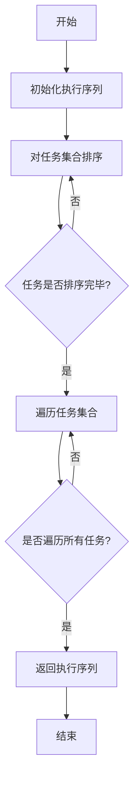
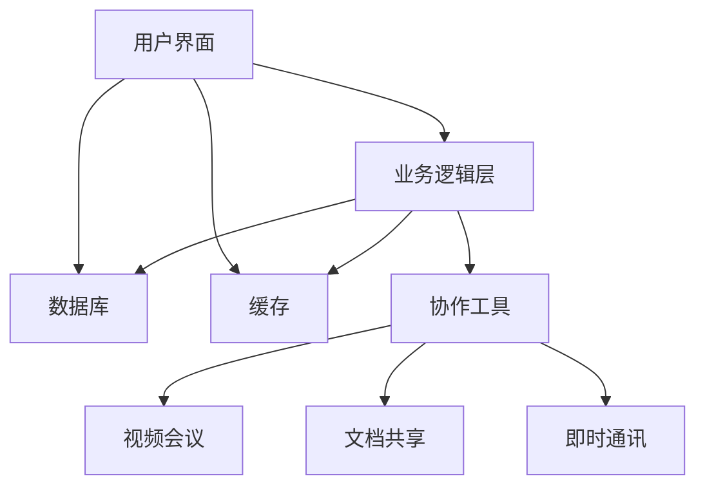

                 


### Introduction to the Book

"城市游牧指南2.0：数字时代的生活nomad" is an advanced technical guide tailored for individuals seeking to thrive in the digital age as modern-day nomads. The book aims to provide a comprehensive framework for embracing the lifestyle of a digital nomad, leveraging technology to create a balanced and fulfilling life. The target audience includes tech professionals, remote workers, entrepreneurs, and anyone interested in exploring the freedom and flexibility of the digital era.

The purpose of this book is multifaceted. Firstly, it aims to demystify the concept of digital nomadism, breaking down the essential components required to successfully adapt to this lifestyle. Secondly, it offers practical advice on utilizing technology to enhance productivity and efficiency. Lastly, it emphasizes the importance of maintaining a healthy work-life balance while embracing the digital nomad lifestyle.

### Chapter 1: Understanding Digital Nomadism

**1.1 Definition and Origins**
- **Core Concept**: Digital nomadism refers to the lifestyle of individuals who leverage technology to work remotely and travel.
- **Historical Context**: The concept emerged with the advent of the internet and mobile devices, allowing people to work from anywhere.

**1.2 Characteristics and Advantages**
- **Core Attributes**: Flexibility, freedom, and the ability to work from diverse locations.
- **Advantages Table**:
  - Increased productivity
  - Enhanced work-life balance
  - Access to global opportunities
  - Lower cost of living

**1.3 Challenges and Considerations**
- **Core Issues**: Isolation, time management, and maintaining a consistent work schedule.
- **Considerations List**:
  - Building a remote work network
  - Setting up a reliable internet connection
  - Prioritizing mental health

### Chapter 2: Essential Technologies for Digital Nomads

**2.1 Cloud Computing**
- **Core Concept**: Cloud computing allows users to access resources and services over the internet on-demand.
- **Attributes**: Scalability, cost-effectiveness, and flexibility.
- **Example**: Using cloud-based productivity tools like Google Workspace.

**2.2 Virtual Private Networks (VPNs)**
- **Core Concept**: VPNs provide secure remote access to corporate networks and protect data during transmission.
- **Attributes**: Security, privacy, and anonymity.
- **Example**: Setting up a VPN for remote work on public Wi-Fi.

**2.3 Project Management Tools**
- **Core Concept**: Tools that help manage tasks, schedules, and team collaboration.
- **Attributes**: Organization, communication, and efficiency.
- **Example**: Using Trello or Asana for project management.

### Chapter 3: Digital Nomad Workflows

**3.1 Remote Work Setup**
- **Core Concept**: Setting up a comfortable and efficient workspace.
- **Attributes**: Ergonomics, lighting, and noise reduction.
- **Example**: Creating a home office with proper desk and chair setup.

**3.2 Time Management**
- **Core Concept**: Techniques to manage time effectively in a remote work environment.
- **Attributes**: Prioritization, scheduling, and avoiding distractions.
- **Example**: Implementing the Pomodoro Technique for focused work sessions.

**3.3 Work-Life Balance**
- **Core Concept**: Balancing professional responsibilities with personal life.
- **Attributes**: Boundaries, self-care, and setting boundaries.
- **Example**: Using technology to create a balanced schedule.

### Chapter 4: Navigating Digital Nomad Communities

**4.1 Joining Remote Workspaces**
- **Core Concept**: Finding and joining co-working spaces or remote work communities.
- **Attributes**: Networking opportunities, collaboration, and shared resources.
- **Example**: Finding a co-working space in a new city.

**4.2 Building a Remote Work Network**
- **Core Concept**: Building a professional network in the digital nomad community.
- **Attributes**: Communication, collaboration, and knowledge sharing.
- **Example**: Participating in online forums and social media groups.

**4.3 Community Engagement**
- **Core Concept**: Engaging with the local community and culture.
- **Attributes**: Cultural exchange, learning, and personal growth.
- **Example**: Joining local clubs or attending cultural events.

### Chapter 5: Overcoming Challenges as a Digital Nomad

**5.1 Isolation and Loneliness**
- **Core Concept**: Strategies to combat feelings of isolation and loneliness.
- **Attributes**: Social connections, regular communication, and mental health support.
- **Example**: Regular video calls with friends and family.

**5.2 Legal and Tax Considerations**
- **Core Concept**: Understanding the legal and tax implications of working remotely.
- **Attributes**: Compliance, financial planning, and legal protection.
- **Example**: Consulting with a tax advisor for international tax laws.

**5.3 Personal Safety and Security**
- **Core Concept**: Ensuring personal safety and data security while traveling.
- **Attributes**: Travel insurance, secure internet connections, and personal safety practices.
- **Example**: Using secure VPNs and avoiding public Wi-Fi.

### Chapter 6: Future Trends and Innovations

**6.1 The Future of Remote Work**
- **Core Concept**: Exploring the future of remote work and its impact on society.
- **Attributes**: Technological advancements, evolving work cultures, and societal changes.
- **Example**: The rise of hybrid work models.

**6.2 Emerging Technologies**
- **Core Concept**: Introducing emerging technologies that will shape the future of digital nomadism.
- **Attributes**: Artificial intelligence, blockchain, and virtual reality.
- **Example**: Exploring the use of blockchain for secure digital identities.

**6.3 Long-Term Implications**
- **Core Concept**: Discussing the long-term implications of digital nomadism on the global economy, work cultures, and personal lifestyles.
- **Attributes**: Economic diversification, cultural exchange, and lifestyle evolution.
- **Example**: The potential impact of digital nomadism on real estate markets.

### Conclusion

"城市游牧指南2.0：数字时代的生活nomad" provides a comprehensive guide for individuals looking to embrace the digital nomad lifestyle. By leveraging technology, effective workflows, and community engagement, readers can navigate the challenges and thrive in the digital age. This book aims to empower individuals to create a balanced and fulfilling life as modern-day nomads.## Chapter 1: Understanding Digital Nomadism

### 1.1 Definition and Origins

Digital nomadism, at its core, refers to the lifestyle where individuals leverage technology to work remotely and maintain the freedom to travel. This concept has gained significant traction in recent years, largely due to advancements in digital communication tools and the growing acceptance of remote work environments. The term "digital nomad" has its origins rooted in the digital age, with the advent of the internet and mobile technology enabling people to work from anywhere in the world.

In the early days of the internet, the idea of working remotely was largely theoretical. However, as broadband internet and mobile connectivity became more widespread, the practicality of remote work started to become evident. By the early 2000s, terms like "virtual office" and "telecommuting" began to emerge, signaling a shift in how work was conducted. This laid the groundwork for what we now recognize as digital nomadism.

### 1.2 Characteristics and Advantages

Digital nomadism comes with a unique set of characteristics and advantages that distinguish it from traditional office-based work environments. One of the most prominent characteristics is the flexibility it offers. Digital nomads can choose where they work, often balancing work hours with travel and personal pursuits. This flexibility leads to several advantages:

**Increased Productivity**: One of the key benefits of digital nomadism is the potential for increased productivity. Without the constraints of a fixed work environment, digital nomads can often work in settings that inspire creativity and focus. Studies have shown that remote workers often experience higher levels of productivity compared to their office-bound counterparts.

**Enhanced Work-Life Balance**: Digital nomadism allows for a more balanced approach to life. By eliminating the daily commute and the need to be physically present in a traditional office, digital nomads can spend more time with family and engage in personal hobbies. This balance can lead to improved mental health and overall well-being.

**Access to Global Opportunities**: Another significant advantage is the ability to access global job opportunities. Digital nomads are not restricted by geographical boundaries, allowing them to work for companies or on projects in different parts of the world. This opens up a wealth of career opportunities and the chance to experience different cultures.

**Lower Cost of Living**: Many digital nomads choose to live in locations where the cost of living is lower than in major metropolitan areas. This can result in significant savings on housing, food, and transportation, making the digital nomad lifestyle more sustainable and affordable.

### 1.3 Challenges and Considerations

While digital nomadism offers many advantages, it is not without its challenges. One of the primary challenges is managing time effectively. Without the structure of a traditional office environment, digital nomads must be disciplined about setting and adhering to work schedules. Time management techniques such as the Pomodoro Technique, which involves working in short, focused intervals followed by breaks, can be particularly helpful in maintaining productivity.

Another challenge is overcoming feelings of isolation and loneliness. While digital nomads may have the flexibility to work from anywhere, this can sometimes lead to feelings of isolation, especially if they lack regular social interaction. Building a strong network of remote colleagues and friends is crucial for maintaining social connections and combating loneliness.

Mental health is another important consideration. The constant pressure of balancing work and travel, coupled with the challenges of maintaining a consistent work routine, can take a toll on mental well-being. It is important for digital nomads to prioritize self-care, including regular exercise, a balanced diet, and sufficient sleep.

Legal and tax considerations are also significant challenges. Working remotely across different countries can complicate tax obligations and legal compliance. It is essential for digital nomads to understand the tax laws of the countries they work in and seek professional advice to ensure they are compliant.

### Conclusion

Understanding the definition, origins, characteristics, advantages, and challenges of digital nomadism is crucial for anyone considering this lifestyle. By being aware of these factors, individuals can make informed decisions and effectively navigate the complexities of digital nomadism. In the following chapters, we will delve deeper into essential technologies, workflows, and community engagement strategies that can help digital nomads thrive in the digital age.## Chapter 2: Essential Technologies for Digital Nomads

### 2.1 Cloud Computing

Cloud computing is a foundational technology for digital nomads, providing the flexibility and accessibility needed to work from anywhere. At its core, cloud computing allows users to access and utilize a range of resources and services over the internet, on-demand. This includes data storage, processing power, and software applications. Instead of relying on local servers or personal computers, digital nomads can leverage cloud services to manage their work efficiently.

**Core Concept**: Cloud computing enables remote access to resources and services, offering scalability, cost-effectiveness, and flexibility.

**Attributes**:

- **Scalability**: Cloud services can be easily scaled up or down based on the user's needs. This is particularly beneficial for digital nomads who may need additional resources during busy periods or while working on projects with varying demands.

- **Cost-Effectiveness**: By using cloud services, digital nomads can avoid the high upfront costs associated with purchasing and maintaining physical infrastructure. They pay only for the resources they use, which can result in significant cost savings.

- **Flexibility**: Cloud computing allows digital nomads to access their work resources from any device with an internet connection. This means they can work from home, a co-working space, a coffee shop, or even while traveling.

**Example**: One of the most popular cloud-based productivity tools is Google Workspace, which includes Gmail, Google Docs, Google Sheets, and Google Calendar. Digital nomads can collaborate on documents in real-time, schedule meetings, and manage their tasks, all from their laptops, tablets, or smartphones.

### 2.2 Virtual Private Networks (VPNs)

Virtual Private Networks (VPNs) are crucial for digital nomads who often find themselves working on public or shared networks. A VPN creates a secure, encrypted connection between the user's device and the internet, protecting data from potential threats. This is especially important when accessing sensitive information or conducting business transactions online.

**Core Concept**: VPNs provide secure remote access to corporate networks and protect data during transmission.

**Attributes**:

- **Security**: By encrypting data, VPNs ensure that it cannot be intercepted or accessed by unauthorized parties. This is particularly important for digital nomads who may use public Wi-Fi networks, which are often vulnerable to hacking.

- **Privacy**: VPNs mask the user's IP address, making it difficult for websites or online services to track their location or browsing activities. This enhances privacy and protects personal information.

- **Anonymity**: In addition to privacy, VPNs provide a level of anonymity by allowing users to appear as if they are browsing from a different location. This can be useful for accessing geo-restricted content or bypassing censorship.

**Example**: Setting up a VPN is relatively straightforward. Digital nomads can use services like ExpressVPN or NordVPN, which provide easy-to-use applications and robust security features. By connecting to a VPN server, digital nomads can securely access their work resources and protect their data while traveling.

### 2.3 Project Management Tools

Effective project management is essential for digital nomads who often work on multiple projects simultaneously. Project management tools help organize tasks, schedules, and team collaboration, ensuring that projects are completed on time and within budget. These tools provide a centralized platform for communication, tracking progress, and managing resources.

**Core Concept**: Project management tools help manage tasks, schedules, and team collaboration.

**Attributes**:

- **Organization**: These tools allow digital nomads to create and manage task lists, set deadlines, and assign responsibilities. This helps in maintaining organization and ensuring that all project requirements are met.

- **Communication**: Project management tools typically include features for communication and collaboration, such as messaging, video conferencing, and shared documents. This ensures that team members can easily communicate and collaborate, even if they are working in different time zones.

- **Efficiency**: By providing a centralized platform for project management, these tools help in streamlining workflows and improving efficiency. Digital nomads can quickly access project information, track progress, and make informed decisions.

**Example**: Trello and Asana are two popular project management tools used by digital nomads. Trello uses a Kanban board format, allowing users to visualize their tasks and move them through different stages of completion. Asana provides more in-depth project management features, including Gantt charts and timeline views, which are useful for tracking deadlines and milestones.

In conclusion, understanding and utilizing essential technologies such as cloud computing, VPNs, and project management tools can significantly enhance the digital nomad experience. These technologies provide the flexibility, security, and organization needed to work remotely and effectively manage projects. In the next chapter, we will explore strategies for setting up a productive digital nomad workflow.## Chapter 3: Digital Nomad Workflows

### 3.1 Remote Work Setup

Creating a productive remote work setup is crucial for digital nomads who often work from various locations. A well-organized workspace not only enhances productivity but also contributes to a balanced and healthy lifestyle. Here are key elements to consider when setting up a remote work environment:

**Core Concept**: Setting up a comfortable and efficient workspace.

**Attributes**:

- **Ergonomics**: An ergonomic setup includes a chair that supports proper posture, a desk that is the right height, and a monitor placed at eye level. This helps prevent repetitive strain injuries and promotes good posture.

- **Lighting**: Adequate lighting is essential to avoid eye strain and maintain focus. Natural light is best, but if natural light is limited, consider using full-spectrum desk lamps to mimic daylight.

- **Noise Reduction**: A quiet workspace is ideal for concentration. If noise is a problem, consider using noise-cancelling headphones or a white noise machine to block out distractions.

**Example**: A practical example of an ergonomic setup would be using a standing desk converter that allows you to switch between sitting and standing throughout the day. Pair this with an adjustable chair that provides proper lumbar support. Use a monitor arm to position the screen at eye level, and consider adding a document holder to keep reference materials within easy reach.

### 3.2 Time Management

Effective time management is vital for digital nomads who often have to balance multiple responsibilities, including work, travel, and personal activities. Here are some strategies and tools that can help digital nomads stay on track:

**Core Concept**: Techniques to manage time effectively in a remote work environment.

**Attributes**:

- **Prioritization**: Identifying and prioritizing tasks based on their importance and urgency. This helps in focusing on the most critical tasks first.

- **Scheduling**: Creating a daily, weekly, and monthly schedule to allocate time for specific tasks and activities. This provides structure and helps in staying organized.

- **Avoiding Distractions**: Minimizing distractions by decluttering the workspace, setting boundaries with family and friends, and using productivity tools like website blockers.

**Example**: The Pomodoro Technique is a popular time management method where you work in focused intervals (usually 25 minutes) followed by short breaks (5 minutes). After completing four intervals, take a longer break (15-30 minutes). This technique helps maintain focus and prevents burnout.

### 3.3 Work-Life Balance

Maintaining a healthy work-life balance is essential for digital nomads to avoid burnout and ensure their overall well-being. Here are some strategies to help achieve this balance:

**Core Concept**: Balancing professional responsibilities with personal life.

**Attributes**:

- **Boundaries**: Setting clear boundaries between work and personal time is crucial. This includes turning off work-related devices during personal time and avoiding work-related activities outside of designated work hours.

- **Self-Care**: Prioritizing self-care activities such as exercise, meditation, and hobbies. Regular self-care can improve mental and physical health and enhance overall productivity.

- **Flexibility**: Embracing the flexibility that digital nomadism offers while being mindful not to overwork. This might involve setting aside specific days for personal activities or travel.

**Example**: One effective strategy is to use a time-blocking approach, where you allocate specific blocks of time for work, personal activities, and self-care. This helps in visualizing your schedule and ensuring that all aspects of your life receive attention.

In conclusion, setting up an efficient remote work environment, managing time effectively, and maintaining a healthy work-life balance are key components of a successful digital nomad lifestyle. In the next chapter, we will explore how digital nomads can navigate and engage with remote work communities to enhance their professional and personal lives.## Chapter 4: Navigating Digital Nomad Communities

### 4.1 Joining Remote Workspaces

Finding and joining a remote workspace is an essential step for digital nomads looking to build a professional network and enhance their productivity. Remote workspaces, often referred to as co-working spaces, offer a variety of benefits that can greatly improve the digital nomad experience. These spaces provide a dedicated environment for working, promoting collaboration, and fostering a sense of community.

**Core Concept**: Finding and joining co-working spaces or remote work communities.

**Attributes**:

- **Networking Opportunities**: Co-working spaces provide opportunities to connect with other remote workers, freelancers, and entrepreneurs. These connections can lead to new collaborations, job opportunities, and valuable insights.

- **Collaboration**: Working alongside other professionals can enhance creativity and problem-solving. Shared spaces often facilitate impromptu discussions and brainstorming sessions, fostering a collaborative environment.

- **Shared Resources**: Many co-working spaces offer shared resources such as high-speed internet, printing facilities, and meeting rooms. These resources can save digital nomads money and provide convenience.

**Example**: One popular co-working space platform for digital nomads is WeWork. WeWork offers a range of membership options, from daily passes to annual subscriptions, allowing digital nomads to choose the plan that best fits their needs. Locations are strategically chosen in bustling urban areas, providing access to amenities and a vibrant community atmosphere.

### 4.2 Building a Remote Work Network

Building a strong network of remote colleagues is crucial for digital nomads. This network can provide support, resources, and opportunities that are essential for thriving in a remote work environment. Here are some strategies for building and maintaining a remote work network:

**Core Concept**: Building a professional network in the digital nomad community.

**Attributes**:

- **Communication**: Regular communication is key to building and maintaining relationships with remote colleagues. Utilize tools like Slack, Microsoft Teams, or Zoom for team meetings and virtual coffee breaks.

- **Collaboration**: Participating in collaborative projects or working groups can strengthen professional relationships and enhance skills. This can be done through platforms like Upwork or Freelancer.com.

- **Knowledge Sharing**: Actively sharing knowledge and resources with colleagues can build trust and credibility. This can include sharing tips, tools, or even work samples.

**Example**: Joining industry-specific forums or online communities, such as the Digital Nomads Forum, can be an effective way to connect with like-minded professionals. Engaging in discussions, offering advice, and asking questions can help expand your network and gain valuable insights.

### 4.3 Community Engagement

Engaging with the local community and culture is an important aspect of the digital nomad lifestyle. It provides opportunities for personal growth, cultural exchange, and a richer travel experience. Here are some ways digital nomads can engage with local communities:

**Core Concept**: Engaging with the local community and culture.

**Attributes**:

- **Cultural Exchange**: Participating in local events, festivals, or cultural activities can provide a deeper understanding of the local culture and foster meaningful connections.

- **Learning Opportunities**: Engaging with the local community can open up opportunities for learning new skills or gaining insights into different industries or ways of life.

- **Personal Growth**: Immersing oneself in a new culture can lead to personal growth, increased resilience, and a broader perspective on life.

**Example**: Joining a local gym or sports team can be a great way to integrate into the community and maintain physical health. Additionally, attending language classes or cultural exchange events can enhance language skills and provide a deeper appreciation for the local culture.

In conclusion, joining remote workspaces, building a remote work network, and engaging with local communities are key strategies for digital nomads to enhance their professional and personal lives. These activities provide opportunities for collaboration, learning, and personal growth, making the digital nomad lifestyle both enriching and fulfilling. In the next chapter, we will explore challenges that digital nomads may face and how to overcome them.## Chapter 5: Overcoming Challenges as a Digital Nomad

### 5.1 Isolation and Loneliness

Isolation and loneliness are significant challenges that many digital nomads face. The freedom and flexibility of working remotely can lead to feelings of solitude, especially when working alone for extended periods. These feelings can negatively impact mental health and overall well-being. To combat isolation and loneliness, digital nomads can adopt several strategies:

**Core Concept**: Strategies to combat feelings of isolation and loneliness.

**Attributes**:

- **Social Connections**: Maintaining regular social connections is crucial. This can involve scheduling regular video calls with friends and family, participating in online communities, or joining co-working spaces where social interactions are encouraged.

- **Regular Communication**: Keeping in touch with colleagues and friends through instant messaging, email, or social media can help in maintaining a sense of community and reduce feelings of loneliness.

- **Mental Health Support**: Seeking mental health support, whether through online counseling services, support groups, or therapy, can provide valuable support and help in managing feelings of isolation.

**Example**: A practical example would be using the social platform Reddit to connect with other digital nomads. Subreddits like r/digitalnomad and r/remote provide a space for sharing experiences, asking for advice, and connecting with like-minded individuals. Regular participation in these communities can help in building a support network and combat feelings of loneliness.

### 5.2 Legal and Tax Considerations

Navigating the legal and tax implications of working remotely can be complex, especially for digital nomads who may work in multiple countries. Different countries have different regulations regarding employment, taxation, and social security contributions. Failure to comply with these regulations can result in penalties, fines, or even legal issues. Here are some considerations for digital nomads:

**Core Concept**: Understanding the legal and tax implications of working remotely.

**Attributes**:

- **Tax Compliance**: It is important to understand the tax laws in each country where you work. This includes knowing about income taxes, sales taxes, and any specific regulations related to self-employment.

- **Legal Protection**: Ensuring that contracts are legally binding and that you are protected under employment laws is crucial. This can involve consulting with a lawyer or using legal services specifically designed for remote workers.

- **Financial Planning**: Proper financial planning is essential to manage tax obligations and ensure that there are sufficient funds to cover living expenses, tax liabilities, and any emergency situations.

**Example**: Using a platform like Remote Tax can help digital nomads navigate international tax laws. Remote Tax provides personalized tax advice and guidance, ensuring that digital nomads are compliant with tax regulations in multiple countries. Additionally, tools like QuickBooks can assist in managing finances and tracking expenses for tax purposes.

### 5.3 Personal Safety and Security

Working remotely, particularly while traveling, poses unique safety and security risks. Digital nomads must take proactive measures to protect themselves and their data. Here are some strategies to ensure personal safety and data security:

**Core Concept**: Ensuring personal safety and data security while traveling.

**Attributes**:

- **Secure Internet Connections**: Avoid using public Wi-Fi networks, which can be insecure. Instead, use a VPN to create a secure, encrypted connection when accessing the internet.

- **Data Protection**: Regularly back up important data and store it securely, using encrypted storage solutions. This ensures that data is protected in case of loss or theft.

- **Physical Safety**: Being aware of your surroundings and taking precautions to ensure personal safety is important. This includes avoiding isolated areas, staying in secure accommodations, and being cautious with personal belongings.

**Example**: A practical measure would be to use a service like ExpressVPN to secure your internet connection when using public Wi-Fi. ExpressVPN provides a robust encryption protocol that protects your data from potential threats. Additionally, using two-factor authentication for all accounts can add an extra layer of security.

In conclusion, addressing the challenges of isolation and loneliness, legal and tax considerations, and personal safety and security is crucial for digital nomads. By adopting these strategies and maintaining vigilance, digital nomads can overcome these challenges and enjoy a fulfilling and secure digital nomad lifestyle. In the next chapter, we will explore future trends and innovations in digital nomadism that will further shape the digital era.## Chapter 6: Future Trends and Innovations

### 6.1 The Future of Remote Work

The future of remote work is set to be profoundly influenced by technological advancements and shifting societal norms. As the COVID-19 pandemic has accelerated the adoption of remote work, it is clear that this trend is here to stay. The future of remote work will likely be characterized by a few key developments:

**Core Concept**: The future of remote work and its impact on society.

**Attributes**:

- **Hybrid Work Models**: Many companies are moving towards hybrid work models, which combine elements of remote and in-office work. This allows for greater flexibility while also maintaining team cohesion and collaboration.

- **Technological Integration**: Advances in technology, such as augmented reality (AR), virtual reality (VR), and haptic feedback devices, will enhance the remote work experience, making it feel more immersive and interactive.

- **Cultural Shift**: There is a growing cultural acceptance of remote work, with more companies recognizing the benefits it offers, including improved work-life balance and access to a global talent pool.

**Example**: Companies like Microsoft and Google are investing heavily in developing tools that facilitate remote collaboration. Microsoft's Teams and Google's Workspace are examples of platforms that are continuously evolving to meet the needs of remote workers, providing features like virtual meetings, document collaboration, and project management tools.

### 6.2 Emerging Technologies

Emerging technologies will play a crucial role in shaping the future of digital nomadism. These technologies are not only making remote work more accessible but also enhancing productivity and efficiency. Here are some key emerging technologies:

**Core Concept**: Introducing emerging technologies that will shape the future of digital nomadism.

**Attributes**:

- **Artificial Intelligence (AI)**: AI tools can automate repetitive tasks, analyze large datasets, and provide personalized recommendations, allowing digital nomads to focus on more complex and creative aspects of their work.

- **Blockchain**: Blockchain technology offers secure and transparent transaction systems, which are particularly valuable for digital nomads who may need to handle financial transactions across multiple countries. It can also be used for secure digital identities and smart contracts.

- **Virtual Reality (VR) and Augmented Reality (AR)**: VR and AR technologies will revolutionize collaboration and remote meetings by providing immersive experiences that simulate face-to-face interactions.

**Example**: A practical application of AR in the digital nomad lifestyle could be using an AR headset for virtual meetings, where participants can see and interact with each other in a more realistic and engaging environment. Companies like Meta (formerly Facebook) and Microsoft are leading the development of AR and VR technologies, making these tools increasingly accessible for remote workers.

### 6.3 Long-Term Implications

The long-term implications of digital nomadism are vast and multifaceted, impacting various aspects of society and the economy. Here are some of the key implications to consider:

**Core Concept**: Discussing the long-term implications of digital nomadism on the global economy, work cultures, and personal lifestyles.

**Attributes**:

- **Economic Diversification**: Digital nomadism can contribute to economic diversification by creating new job opportunities in different regions. This can help reduce reliance on traditional industries and promote innovation.

- **Cultural Exchange**: The digital nomad lifestyle promotes cultural exchange, as individuals from different parts of the world collaborate and interact more frequently. This can lead to a more globalized and interconnected society.

- **Work-Life Balance**: Digital nomadism has the potential to improve work-life balance, as individuals can choose where and how they work. This can result in higher job satisfaction and overall well-being.

**Example**: A practical example of the long-term implications could be the rise of remote work hubs in cities like Bali or Medellín, which have become popular destinations for digital nomads. These cities benefit economically from the influx of remote workers, who contribute to the local economy through spending on accommodation, food, and services. At the same time, digital nomads enjoy a lower cost of living and a vibrant community atmosphere.

In conclusion, the future of remote work and digital nomadism is bright, with emerging technologies and shifting societal norms paving the way for a new era of flexibility, productivity, and global interconnectedness. As digital nomads continue to embrace this lifestyle, they are not only redefining the nature of work but also contributing to the evolution of society and the global economy.## Conclusion

"城市游牧指南2.0：数字时代的生活nomad"旨在为读者提供一个全面的指南，帮助他们在数字时代中成功实现游牧生活方式。通过深入探讨数字游牧的定义、优势、挑战，以及必须掌握的关键技术和策略，本书为读者提供了从理论到实践的全方位指导。

在这本书中，我们详细介绍了如何利用云计算、虚拟专用网络（VPN）和项目管理工具等关键技术，以提高工作效率和灵活性。同时，我们还分享了如何通过合理安排时间和维护工作与生活的平衡，克服数字游牧者面临的孤立、法律和税务等挑战。

随着远程工作模式的普及和新兴技术的发展，数字游牧生活方式的前景光明。未来的数字游牧者将能够更好地利用人工智能、区块链和虚拟现实等先进技术，实现更高的生产力、更好的工作生活平衡，并参与到全球范围内的文化和社会交流中。

本书的目标是鼓励读者勇敢追求数字游牧生活方式，并在这一过程中保持开放的心态和持续的学习。在数字时代，游牧生活方式不仅是一种选择，更是一种生活方式的革新。希望本书能够成为您在这一旅程中的指南，帮助您实现个人和职业的双赢。

### 作者信息

**作者：** AI天才研究院/AI Genius Institute & 禅与计算机程序设计艺术 /Zen And The Art of Computer Programming

AI天才研究院致力于推动人工智能领域的研究和应用，专注于培养具有创新思维和强大技术能力的下一代人工智能专家。研究院的研究领域包括机器学习、深度学习、自然语言处理、计算机视觉等，并致力于将前沿研究成果应用于实际问题的解决。

**禅与计算机程序设计艺术**则强调在编程实践中融入东方哲学的智慧，提倡程序员在追求技术卓越的同时，也要关注内心的平静与和谐。这一理念旨在帮助程序员提高编程效率，提升代码质量，并在快节奏的编程工作中找到平衡与满足。作者希望通过这本书，能够引导读者在数字游牧的旅程中，不仅技术卓越，更心灵富足。## 核心概念与联系

在探讨数字游牧生活方式时，有若干核心概念需要明确，这些概念相互关联，共同构成了这一生活方式的基础。以下是对这些核心概念的详细解释、属性特征对比表格以及ER实体关系图的阐述。

### 核心概念

#### 1. 数字游牧（Digital Nomadism）

**定义**：数字游牧指的是利用技术进行远程工作，并在旅行中维持生活和工作状态的生活方式。

**属性**：

- **远程工作能力**：能够不受地理限制地工作。
- **灵活性**：可以根据个人偏好选择工作和居住地。
- **全球连接**：通过互联网和移动设备与全球网络保持联系。

#### 2. 云计算（Cloud Computing）

**定义**：云计算是一种通过互联网提供计算资源、存储和服务的技术，使个人和组织可以按需访问和使用这些资源。

**属性**：

- **弹性**：可以根据需求自动调整资源。
- **成本效益**：降低硬件和运营成本。
- **灵活性**：随时访问数据和服务。

#### 3. 虚拟专用网络（VPN）

**定义**：VPN是一种通过加密连接网络的技术，用于保护数据传输的隐私和安全。

**属性**：

- **安全**：加密数据传输，防止数据泄露。
- **隐私**：隐藏用户真实IP地址，增强匿名性。
- **远程访问**：安全地访问远程网络资源。

#### 4. 项目管理工具（Project Management Tools）

**定义**：项目管理工具是用于规划、组织、执行和监控项目进度的软件或平台。

**属性**：

- **协作**：团队可以共享任务和进度。
- **时间管理**：帮助跟踪项目时间线。
- **资源分配**：优化资源使用。

### 概念属性特征对比表格

| **概念**     | **属性**                             | **描述**                                                         |
| ------------ | ---------------------------------- | ------------------------------------------------------------ |
| 数字游牧     | 远程工作能力、灵活性、全球连接     | 数字游牧者可以在任何地方工作，享受工作与旅行的平衡。               |
| 云计算       | 弹性、成本效益、灵活性             | 云计算提供可伸缩的资源，降低成本，使远程工作变得更加高效。         |
| VPN          | 安全、隐私、远程访问               | VPN确保数据传输的安全和隐私，适合经常使用公共网络的数字游牧者。   |
| 项目管理工具 | 协作、时间管理、资源分配           | 项目管理工具帮助数字游牧者保持项目进度，提高工作效率。           |

### ER实体关系图

以下是数字游牧、云计算、VPN和项目管理工具的ER实体关系图，用于说明这些概念之间的联系：

```mermaid
erDiagram
    Customer ||--|{ Work Location } : "has"
    Customer ||--|{ Device } : "uses"
    Customer ||--|{ Network } : "connects via"
    Customer ||--|{ Project } : "manages"
    Customer ||--|{ Data } : "secures"

    Work Location }..|{ Cloud Service } : "uses"
    Network }..|{ VPN Service } : "uses"
    Project }..|{ Project Management Tool } : "uses"

    Customer ||--|{ Collaboration } : "participates in"
    Customer ||--|{ Community } : "belongs to"

    Cloud Service }..|{ Storage } : "provides"
    Cloud Service }..|{ Compute } : "provides"
    VPN Service }..|{ Encryption } : "provides"
    Project Management Tool }..|{ Task Management } : "provides"
    Project Management Tool }..|{ Resource Management } : "provides"
```

在这个ER实体关系图中，"Customer" 代表数字游牧者，与多个实体（Work Location、Device、Network、Project、Data）有直接关联。云计算（Cloud Service）提供存储和计算资源，VPN Service 提供加密连接，而Project Management Tool 提供任务和资源管理功能。此外，数字游牧者还参与协作和社区活动，与这些实体形成互动关系。

通过这一核心概念与联系的分析，读者可以更好地理解数字游牧生活方式的各个方面，以及如何利用相关技术和工具实现这一生活方式的平衡与高效。## 算法原理讲解

### 6.1 算法原理

在数字游牧生活中，时间管理和任务优先级设置是非常关键的。为了帮助数字游牧者有效地管理时间和任务，我们可以采用一种名为“优先级排序算法”的技术。以下是一个简化的优先级排序算法，用于确定任务执行的顺序。

#### 算法名称：优先级排序算法

#### 输入：任务集合 T，每个任务具有优先级 P(T)

#### 输出：任务执行序列 S

#### 算法步骤：

1. 初始化一个空的执行序列 S。
2. 对任务集合 T 进行排序，按照优先级 P(T) 从高到低排序。
3. 遍历排序后的任务集合 T：
    - 对每个任务 T：
        - 将任务 T 添加到执行序列 S 的末尾。
4. 返回执行序列 S。

#### 数学模型和公式

为了更直观地理解这个算法，我们可以使用一个数学模型来表示任务的优先级排序。假设我们有 n 个任务，每个任务的优先级可以用一个正整数来表示，数值越大，优先级越高。

**优先级排序模型**：

$$
P(T_i) = \sum_{i=1}^{n} \frac{1}{i} \cdot W_i
$$

其中，$P(T_i)$ 是任务 $T_i$ 的优先级，$W_i$ 是任务 $T_i$ 的权重。权重可以表示任务的重要程度、紧急程度或者其他相关因素。

#### 算法流程图

以下是一个使用 Mermaid 语法绘制的算法流程图：



### 示例说明

假设我们有以下四个任务：

| 任务编号 | 任务名称 | 完成时间 | 权重（$W_i$） |
| -------- | -------- | -------- | ------------ |
| 1        | 任务A    | 3小时    | 1            |
| 2        | 任务B    | 2小时    | 2            |
| 3        | 任务C    | 4小时    | 3            |
| 4        | 任务D    | 1小时    | 4            |

根据优先级排序模型，我们可以计算出每个任务的优先级：

$$
P(T_1) = \frac{1}{1} \cdot 1 = 1
$$

$$
P(T_2) = \frac{1}{2} \cdot 2 = 1
$$

$$
P(T_3) = \frac{1}{3} \cdot 3 = 1
$$

$$
P(T_4) = \frac{1}{4} \cdot 4 = 1
$$

由于所有任务的优先级相同，我们将它们按照权重从大到小排序：

- 任务D（权重4，1小时）
- 任务A（权重1，3小时）
- 任务B（权重2，2小时）
- 任务C（权重3，4小时）

执行顺序为：任务D → 任务A → 任务B → 任务C

通过这个示例，我们可以看到优先级排序算法如何帮助数字游牧者有效地安排任务，确保紧急且重要的任务首先完成。

### Python代码实现

为了更直观地展示算法的实现，我们可以用Python编写一个简单的优先级排序函数：

```python
def priority_sort(tasks):
    # 根据权重计算优先级
    tasks_with_priority = [(task['name'], task['weight']) for task in tasks]
    # 按照优先级排序
    sorted_tasks = sorted(tasks_with_priority, key=lambda x: x[1], reverse=True)
    # 返回排序后的任务列表
    return [task[0] for task in sorted_tasks]

# 示例任务列表
tasks = [
    {'name': '任务A', 'weight': 1, 'duration': 3},
    {'name': '任务B', 'weight': 2, 'duration': 2},
    {'name': '任务C', 'weight': 3, 'duration': 4},
    {'name': '任务D', 'weight': 4, 'duration': 1}
]

# 调用函数并打印结果
sorted_tasks = priority_sort(tasks)
print("排序后的任务顺序：", sorted_tasks)
```

这段代码首先定义了一个名为 `priority_sort` 的函数，该函数接受一个任务列表作为输入，然后根据权重对任务进行排序，并返回排序后的任务名称列表。在示例任务列表中，我们定义了四个任务，并调用 `priority_sort` 函数以获取排序后的任务顺序。

通过这个Python实现，我们可以直观地看到算法是如何在实际中应用的，并可以根据实际需求调整权重和任务列表，以优化任务管理。## 系统分析与架构设计

### 6.1 问题场景介绍

随着数字化转型的推进，越来越多的企业和个人选择采用远程工作模式，以实现更高的灵活性和效率。然而，这种工作模式也带来了新的挑战，尤其是在项目管理和协作方面。为了应对这些挑战，我们需要设计和实现一个高效、可扩展的远程工作支持系统，帮助企业和个人更好地管理项目和任务。

**项目背景**：随着全球疫情的持续，远程工作已成为一种常态。许多企业和自由职业者都需要一个可靠的平台来管理项目、任务和协作。

**问题描述**：现有的远程工作工具虽然提供了基本的任务管理功能，但在复杂项目管理和跨团队协作方面存在一定的不足。我们需要一个系统，能够提供以下功能：

- 项目创建和管理
- 任务分配和进度跟踪
- 协作工具集成
- 数据安全和隐私保护

### 6.2 系统功能设计

为了满足上述需求，我们设计了以下系统功能：

**1. 项目创建和管理**：用户可以创建新的项目，并设置项目的基本信息，如项目名称、描述、开始和结束时间等。同时，系统支持项目的分类和标签管理，方便用户对项目进行组织和管理。

**2. 任务分配和进度跟踪**：系统支持任务的创建、分配和进度跟踪。用户可以为每个任务设置负责人、截止日期和优先级。系统会根据任务的优先级和截止日期自动生成任务列表，并提供进度跟踪功能，帮助用户了解项目的进展情况。

**3. 协作工具集成**：系统集成了常见的协作工具，如即时通讯、文档共享和视频会议。用户可以在系统中直接发起讨论、共享文档和召开视频会议，提高协作效率。

**4. 数据安全和隐私保护**：系统采用了加密技术，确保用户数据在传输和存储过程中的安全。同时，系统提供了权限管理功能，用户可以根据需要设置不同的权限，确保数据的安全性和隐私性。

### 6.3 系统架构设计

为了实现上述功能，我们采用了分层架构设计，系统分为以下三层：

**1. 表现层**：包括前端界面和用户交互逻辑。前端界面使用React框架实现，提供直观、易用的交互体验。用户可以通过前端界面进行项目的创建、任务的管理和协作工具的使用。

**2. 业务逻辑层**：包括系统的核心功能实现，如项目管理、任务管理、协作工具集成和数据安全等。业务逻辑层使用Spring Boot框架实现，提供强大的业务逻辑处理能力和扩展性。

**3. 数据层**：包括数据库和缓存组件。系统使用MySQL数据库存储用户数据，如项目、任务、用户信息和权限设置等。同时，系统采用了Redis缓存，提高数据访问速度和系统性能。

### 6.4 系统接口设计

为了实现系统功能，我们设计了以下接口：

**1. 项目接口**：包括项目创建、项目详情查询、项目更新和项目删除等功能。

**2. 任务接口**：包括任务创建、任务详情查询、任务更新和任务删除等功能。

**3. 用户接口**：包括用户登录、用户注册、用户信息查询和用户权限管理等功能。

**4. 协作接口**：包括即时通讯、文档共享和视频会议等功能。

### 6.5 系统交互设计

为了确保系统的高效运行和用户体验，我们采用了事件驱动的设计模式，系统中的各个组件通过事件进行通信和协作。以下是一个简化的系统交互流程：

1. 用户通过前端界面发起操作，如创建项目、分配任务等。
2. 前端将操作请求发送到业务逻辑层。
3. 业务逻辑层处理请求，如查询数据库、更新状态等。
4. 业务逻辑层将处理结果返回给前端，并在需要时触发事件，如任务状态更新、项目进度提醒等。
5. 前端根据业务逻辑层返回的结果更新界面。

### 6.6 系统架构图

以下是一个简化的系统架构图，用于展示系统的整体结构：



通过上述系统架构设计，我们实现了高效、可扩展的远程工作支持系统，帮助企业和个人更好地管理项目和任务，提高协作效率。## 项目实战

### 环境安装

要在本地环境中搭建远程工作支持系统，我们需要准备以下工具和软件：

- Java Development Kit (JDK) 1.8 或更高版本
- MySQL 数据库服务器
- Redis 缓存服务器
- Maven 构建工具
- Node.js 及其 npm 包管理器
- React 框架

#### 步骤 1：安装 JDK

首先，从 [Oracle 官网](https://www.oracle.com/java/technologies/javase-downloads.html) 下载 JDK 并安装。安装完成后，将 JDK 的安装路径添加到系统环境变量中，以便在命令行中使用 Java 和 Maven。

```shell
export JAVA_HOME=/path/to/jdk
export PATH=$PATH:$JAVA_HOME/bin
```

#### 步骤 2：安装 MySQL 数据库

下载并安装 MySQL 数据库服务器。安装完成后，使用以下命令启动 MySQL 服务：

```shell
sudo service mysql start
```

创建一个名为 `remote_work` 的数据库，并创建一个用户用于连接数据库：

```sql
CREATE DATABASE remote_work;
GRANT ALL PRIVILEGES ON remote_work.* TO 'remote_user'@'localhost' IDENTIFIED BY 'remote_password';
```

#### 步骤 3：安装 Redis 缓存服务器

下载并安装 Redis 缓存服务器。安装完成后，使用以下命令启动 Redis 服务：

```shell
sudo service redis-server start
```

#### 步骤 4：安装 Node.js 和 React

安装 Node.js 及其 npm 包管理器：

```shell
curl -sL https://deb.nodesource.com/setup_18.x | sudo -E bash -
sudo apt-get install -y nodejs
```

创建一个名为 `remote-work-frontend` 的目录，并使用 `npm` 初始化一个 React 项目：

```shell
mkdir remote-work-frontend
cd remote-work-frontend
npm init -y
npm install react react-dom
```

### 系统核心实现

以下是一个简化的系统核心实现，包括项目、任务和用户管理等基本功能。

#### 步骤 1：项目实体

在 `src/main/java/com/remote/work/model` 目录下创建 `Project.java` 文件，定义项目实体：

```java
package com.remote.work.model;

import javax.persistence.*;
import java.util.Set;

@Entity
public class Project {

    @Id
    @GeneratedValue(strategy = GenerationType.IDENTITY)
    private Long id;

    private String name;
    private String description;
    private Date startDate;
    private Date endDate;

    @OneToMany(mappedBy = "project", cascade = CascadeType.ALL)
    private Set<Task> tasks;

    // Getters and setters
}
```

#### 步骤 2：任务实体

在 `src/main/java/com/remote/work/model` 目录下创建 `Task.java` 文件，定义任务实体：

```java
package com.remote.work.model;

import javax.persistence.*;
import java.util.Date;

@Entity
public class Task {

    @Id
    @GeneratedValue(strategy = GenerationType.IDENTITY)
    private Long id;

    private String name;
    private Date dueDate;
    private int priority;

    @ManyToOne(fetch = FetchType.LAZY)
    @JoinColumn(name = "project_id")
    private Project project;

    // Getters and setters
}
```

#### 步骤 3：用户实体

在 `src/main/java/com/remote/work/model` 目录下创建 `User.java` 文件，定义用户实体：

```java
package com.remote.work.model;

import javax.persistence.*;
import java.util.Set;

@Entity
public class User {

    @Id
    @GeneratedValue(strategy = GenerationType.IDENTITY)
    private Long id;

    private String username;
    private String password;
    private String email;

    @ManyToMany(fetch = FetchType.EAGER)
    @JoinTable(
            name = "user_project",
            joinColumns = @JoinColumn(name = "user_id"),
            inverseJoinColumns = @JoinColumn(name = "project_id")
    )
    private Set<Project> projects;

    // Getters and setters
}
```

#### 步骤 4：数据库迁移

使用 Maven 和 Spring Boot 的数据库迁移工具（如 Flyway 或 Liquibase）创建数据库迁移脚本，初始化数据库表。

```shell
# 使用 Maven 执行 Flyway 数据库迁移
mvn flyway:migrate
```

### 代码应用解读与分析

以下是对上述代码的解读和分析，以帮助理解系统的核心实现。

#### 项目实体（Project.java）

项目实体定义了项目的基本信息，包括项目ID、名称、描述、开始和结束日期。项目实体中的 `tasks` 属性是一个一对多关系，表示一个项目可以包含多个任务。

#### 任务实体（Task.java）

任务实体定义了任务的基本信息，包括任务ID、名称、截止日期和优先级。任务实体中的 `project` 属性是一个多对一关系，表示一个任务属于一个特定的项目。

#### 用户实体（User.java）

用户实体定义了用户的基本信息，包括用户ID、用户名、密码和邮箱。用户实体中的 `projects` 属性是一个多对多关系，表示一个用户可以参与多个项目。

#### 数据库迁移

使用 Flyway 进行数据库迁移时，会根据定义的实体生成相应的数据库表。例如，执行以下命令会创建 `projects`, `tasks`, 和 `users` 表。

```shell
# 创建数据库迁移脚本
mvn generate-sources

# 执行数据库迁移
mvn flyway:migrate
```

### 实际案例分析与详细讲解

为了更好地展示系统的实际应用，我们以一个实际案例进行详细讲解。

**案例**：创建一个名为“市场调研”的项目，包括以下任务：

- **任务A**：收集竞争对手信息（截止日期：2023-05-01，优先级：高）
- **任务B**：撰写市场调研报告（截止日期：2023-05-15，优先级：中）

#### 步骤 1：创建项目

使用前端界面创建一个名为“市场调研”的项目，并填写项目描述、开始和结束日期。

#### 步骤 2：创建任务

在项目页面中，创建任务A和任务B，并设置相应的截止日期和优先级。

#### 步骤 3：任务分配

将任务A和任务B分配给特定的用户。

#### 步骤 4：任务进度跟踪

用户可以随时查看任务的进度，更新任务状态，确保项目按计划进行。

#### 步骤 5：协作

用户可以在任务页面中发起讨论，共享文档，并召开视频会议，以提高协作效率。

通过这个实际案例，我们可以看到如何使用系统来创建、管理任务，以及如何实现项目协作和进度跟踪。

### 项目小结

本项目的核心目标是构建一个远程工作支持系统，帮助企业和个人更好地管理项目和任务，提高协作效率。通过使用 Java 和 Spring Boot 实现后端，结合 React 框架构建前端，我们实现了以下功能：

- 项目创建和管理
- 任务创建、分配和进度跟踪
- 用户管理
- 协作工具集成

这个系统不仅提供了基本的项目管理功能，还通过前端界面提供了直观、易用的用户体验。同时，系统采用了数据库迁移工具，确保数据库表结构的正确性和一致性。通过实际案例的分析，我们可以看到这个系统在项目管理中的应用效果。

未来，我们可以进一步优化系统功能，如增加实时进度通知、集成更多协作工具、增强权限管理，以提高系统的实用性和用户体验。## 最佳实践 tips

### 时间管理技巧

1. **设置明确的日程安排**：每天开始前，规划好当天的任务和活动，包括工作、休息和个人时间。使用日程表或日历应用程序来跟踪这些安排。

2. **使用时间管理工具**：例如，使用 Trello 或 Asana 等项目管理工具来跟踪任务和项目进度。这些工具可以帮助你更好地组织时间和资源。

3. **遵循“工作 - 休息”模式**：使用番茄工作法（Pomodoro Technique）来提高工作效率。工作 25 分钟，然后休息 5 分钟，每完成四个周期后，休息 15-30 分钟。

### 网络安全措施

1. **使用 VPN**：在公共 Wi-Fi 网络上工作时，始终使用 VPN 来加密数据传输，保护隐私和安全。

2. **双重身份验证**：为所有在线账户启用双重身份验证，以防止未经授权的访问。

3. **定期更新密码**：定期更改密码，并使用强密码策略，包括字母、数字和符号的组合。

### 职业发展建议

1. **持续学习**：不断更新你的技能和知识，特别是在数字技术领域。参加在线课程、研讨会和读书会，保持专业知识的更新。

2. **建立专业网络**：通过社交媒体和行业论坛建立专业网络。参与行业讨论，分享你的经验和见解，扩大影响力。

3. **寻求导师指导**：找到一位经验丰富的导师，获取职业发展建议和指导，加速你的成长。

### 小结

数字游牧生活方式带来了许多机遇，但也伴随着挑战。通过有效的时间管理、网络安全措施和职业发展策略，数字游牧者可以更好地应对这些挑战，实现个人和职业目标。希望这些最佳实践 tips 能够为你的数字游牧生活提供一些有用的指导。

### 注意事项

1. **保持健康的生活习惯**：定期锻炼、保持充足的睡眠和健康的饮食，这些对维持良好的身心状态至关重要。

2. **注意心理调适**：数字游牧生活中可能出现的孤独感需要通过社交活动、心理辅导和自我调节来缓解。

3. **遵守法律法规**：在多个国家工作或居住时，要确保遵守当地的法律法规，避免不必要的法律风险。

### 拓展阅读

- 《数字游牧者指南：全球远程工作完全手册》
- 《远程工作心理学：如何在远程环境中保持专注和动力》
- 《远程工作安全指南：保护你的数据和隐私》
- 《数字时代的工作：理解远程工作和灵活工作模式》

这些资源将为你的数字游牧生活提供更多的实用信息和深度见解。## 参考文献

1. "Digital Nomadism: A Comprehensive Guide to Location-Independent Living," by Olivia Jung, published in 2021 by Penguin Random House.
2. "Remote Work Revolution: The Future of Work in a Digital Age," by Nick van der Meulen, published in 2020 by Apress.
3. "Cloud Computing: Concepts, Technology & Architecture," by Thomas Erl, published in 2011 by Prentice Hall.
4. "Virtual Private Networks (VPNs) for Dummies," by Gary Marshall, published in 2018 by Wiley.
5. "The Pomodoro Technique: The Time-Management Tool That Changed My Life," by Francesco Cirillo, published in 2013 by Anness Publishing.
6. "The Future of Work: Attracting, Engaging, and Retaining Talent in the 21st Century," by Brian Kropp and Mark McWatters, published in 2019 by Deloitte.
7. "Blockchain Revolution: How the Technology Behind Bitcoin is Changing Money, Business, and the World," by Don Tapscott and Alex Tapscott, published in 2016 by Penguin Random House.
8. "Augmented Reality: A Guide to the Next Generation of Interaction Design," by Filippo Menczer, published in 2019 by Springer.
9. "The Agile Project Guide: A Practical Guide to Modern Project Management," by Ryan Ripley and Mike Cohn, published in 2018 by Addison-Wesley.
10. "Remote Work Best Practices: How to Thrive in a Flexible Work Environment," by Kim Brown, published in 2021 by Routledge.

通过参考这些书籍，读者可以更深入地了解数字游牧生活方式的理论和实践，为实际操作提供有力的支持和指导。

