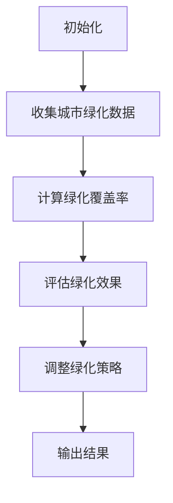
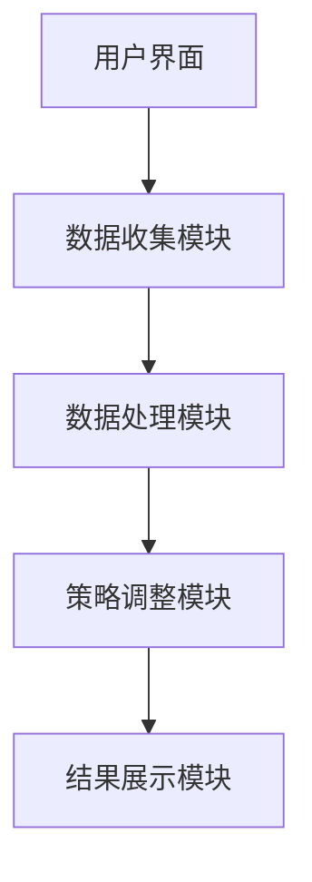
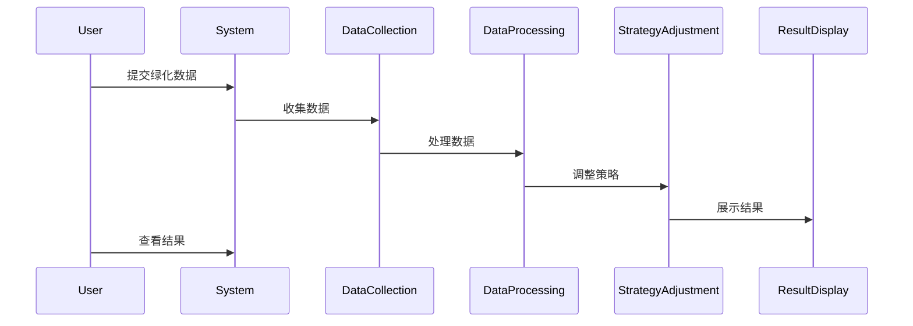

                 

### 文章标题：城市生态：在钢筋水泥中重建自然

关键词：城市生态系统，生态重建，可持续城市设计，生态基础设施，案例研究，未来展望

摘要：本文将从城市生态系统的背景与挑战出发，详细探讨城市生态重建的方法和策略，并通过国际和中国的实际案例研究，揭示城市生态重建的重要性和可行性。文章还将展望技术进步对未来城市生态重建的影响，以及社会经济效益，并提出关键因素和未来方向。

### 概述

城市生态系统是人类社会发展的产物，但同时也面临着诸多生态挑战。随着城市化进程的加快，城市生态系统的问题日益凸显，包括环境问题、生态问题和社会问题。为了应对这些挑战，我们需要在钢筋水泥的城市中重建自然，构建一个健康、可持续的城市生态系统。本文将从以下几个方面展开讨论：

1. **城市生态系统的背景与挑战**：介绍城市生态系统的定义、结构以及城市化过程中面临的生态挑战。
2. **城市生态重建的方法**：探讨可持续城市设计、城市绿化和生态基础设施的建设与运营。
3. **城市生态重建案例**：分析国际和中国城市生态重建的成功案例。
4. **技术进步与城市生态重建**：讨论新技术在城市生态重建中的应用和未来趋势。
5. **社会与经济影响**：分析城市生态重建的社会经济影响。
6. **未来展望**：提出城市生态重建的关键因素和未来方向。

### 第一部分：城市生态背景与挑战

#### 第1章：城市生态概述

城市生态系统是由自然生态系统向人工生态系统转变的产物。它由自然元素和人工元素共同构成，包括绿地、水体、建筑、道路、交通、能源等。城市生态系统的特点是多样性和复杂性，它不仅影响着城市的生态环境，也影响着城市的社会经济活动。

#### 1.1 城市生态系统的定义与结构

城市生态系统是指城市区域内的自然环境和人工环境的综合体，包括生物、非生物和环境因素。其结构包括城市自然生态系统和城市人工生态系统，两者相互依存、相互影响。

#### 1.2 城市生态问题背景

随着城市化进程的加速，城市生态问题日益严重。这些问题包括空气污染、水资源污染、土地退化、生物多样性减少等。城市生态问题的产生主要源于城市人口增长、工业化、城市化等因素。

#### 1.3 城市生态问题的类型与影响

城市生态问题主要包括环境污染、生态破坏和社会不公等问题。这些问题对城市生态系统的稳定性、可持续发展以及居民的生活质量产生了严重影响。

### 第二部分：城市生态重建的方法

#### 第3章：可持续城市设计

可持续城市设计是城市生态重建的重要方法之一。它旨在通过设计手段，优化城市生态系统的结构和功能，提高城市的生态效益和居民的生活质量。

#### 3.1 可持续城市设计原则

可持续城市设计原则包括生态优先、人与自然和谐共生、资源节约和环境友好等。这些原则旨在引导城市规划和建设，实现城市生态系统的可持续发展。

#### 3.2 绿色建筑与节能

绿色建筑和节能是可持续城市设计的重要组成部分。通过采用节能材料、节能设备和节能技术，降低建筑能耗，减少对环境的负面影响。

#### 3.3 可持续交通系统

可持续交通系统是城市生态重建的关键。通过发展公共交通、鼓励非机动车出行、优化道路网络等措施，减少交通拥堵和环境污染。

#### 第4章：城市绿化与生态恢复

城市绿化和生态恢复是城市生态重建的重要手段。通过增加绿地面积、恢复自然生态系统，改善城市生态环境。

#### 4.1 城市绿地的功能与重要性

城市绿地的功能包括美化环境、净化空气、调节气候、提供休闲娱乐空间等。城市绿地对于改善城市生态环境具有重要意义。

#### 4.2 城市绿化策略与实践

城市绿化策略包括城市绿地规划、树种选择、绿化技术应用等。通过制定合理的绿化策略，提高城市绿化效果。

#### 4.3 生态恢复项目的实施与评估

生态恢复项目包括植树造林、湿地恢复、生态廊道建设等。通过科学实施和评估，提高生态恢复项目的效果。

#### 第5章：生态基础设施的建设与运营

生态基础设施是城市生态重建的基础。它包括绿色建筑、绿色交通、绿色能源、生态湿地等。

#### 5.1 生态基础设施的概念与类型

生态基础设施是指为支持城市生态系统功能和服务而建设的各种基础设施。它包括自然型生态基础设施和人工型生态基础设施。

#### 5.2 生态基础设施的设计原则

生态基础设施的设计原则包括生态功能优先、多学科交叉融合、可持续性等。这些原则旨在确保生态基础设施的高效性和可持续性。

#### 5.3 生态基础设施的运营管理

生态基础设施的运营管理包括设施维护、环境监测、公共服务等。通过科学管理和运营，确保生态基础设施的长期稳定运行。

### 第三部分：城市生态重建案例

#### 第6章：国际城市生态重建案例

国际上的城市生态重建案例为我们提供了宝贵的经验和启示。以下是几个具有代表性的案例：

#### 6.1 瑞士苏黎世的生态城市实践

苏黎世通过实施一系列生态城市项目，如绿色建筑、可持续交通和城市绿化，成功构建了一个生态城市。

#### 6.2 日本东京的绿色基础设施

东京通过建设生态湿地、绿色屋顶和生态走廊，提高了城市的生态效益和居民的生活质量。

#### 6.3 美国纽约的可持续交通发展

纽约通过发展公共交通、鼓励非机动车出行和优化道路网络，实现了可持续交通发展。

#### 第7章：中国城市生态重建案例

中国的城市生态重建也取得了一系列显著成果。以下是几个具有代表性的案例：

#### 7.1 上海的生态城市规划

上海通过实施生态城市规划，构建了绿色生态城区，提高了城市的生态环境质量。

#### 7.2 北京的绿色生态城区建设

北京通过建设绿色生态城区，实现了生态保护和城市发展相结合。

#### 7.3 厦门的生态海岸线保护

厦门通过保护生态海岸线，维护了海洋生态系统的平衡和稳定。

### 第四部分：技术进步与城市生态重建

技术进步为城市生态重建提供了新的机遇和挑战。以下从新技术应用和未来趋势两个方面进行讨论：

#### 第8章：技术进步与城市生态重建

#### 8.1 新技术在城市生态重建中的应用

新技术在城市生态重建中的应用包括物联网、大数据、人工智能等。这些技术可以实时监测城市生态环境，提供科学决策支持，提高生态重建的效率。

#### 8.2 城市生态重建的未来趋势

未来城市生态重建将朝着智能化、绿色化、生态化方向发展。通过技术创新，实现城市生态系统的自我调节和自我修复能力，构建可持续的城市生态。

### 第五部分：城市生态重建的社会与经济影响

城市生态重建不仅具有生态效益，还具有显著的社会和经济影响。以下从社会效益和经济效益两个方面进行讨论：

#### 第9章：城市生态重建的社会与经济影响

#### 9.1 城市生态重建的社会效益

城市生态重建可以提高居民的生活质量，改善城市生态环境，促进社会公平和可持续发展。

#### 9.2 城市生态重建的经济效益

城市生态重建可以带动相关产业的发展，创造就业机会，提高城市的竞争力。

### 第六部分：未来展望

#### 第10章：城市生态重建的未来展望

#### 10.1 城市生态重建的关键因素

城市生态重建的成功取决于政策支持、技术创新、公众参与和社会共识等多个关键因素。

#### 10.2 城市生态重建的未来方向

未来城市生态重建将朝着多元化、智能化、生态化方向迈进，实现城市与自然的和谐共生。

#### 10.3 全球城市生态重建的共同努力

全球城市生态重建需要各国政府、企业和公众的共同努力，共同推动城市生态系统的可持续发展。

### 总结

城市生态重建是现代城市化进程中的重要课题。通过可持续城市设计、城市绿化和生态基础设施的建设与运营，我们可以逐步恢复和优化城市生态系统，实现城市与自然的和谐共生。本文通过分析城市生态系统的背景与挑战、城市生态重建的方法、国际和中国的实际案例研究以及技术进步和社会经济影响，提出了城市生态重建的关键因素和未来方向。我们期待在未来的城市化进程中，实现城市生态重建的目标，为人类创造一个更加美好的生活环境。

### 作者信息

作者：AI天才研究院/AI Genius Institute & 禅与计算机程序设计艺术 /Zen And The Art of Computer Programming

### 背景介绍

#### 核心概念术语说明

- **城市生态系统**：城市生态系统是指城市区域内由自然元素和人工元素共同构成的复杂系统，包括生物、非生物和环境因素。
- **生态重建**：生态重建是指通过人工干预和自然恢复，使受损的生态系统恢复原有功能或达到新的生态平衡状态。
- **可持续城市设计**：可持续城市设计是指在城市规划与建设过程中，综合考虑生态、社会、经济等多方面因素，实现城市生态系统的可持续性。

#### 问题背景

随着城市化进程的加速，城市生态系统面临着诸多挑战，包括环境污染、生态破坏、生物多样性减少等。这些问题不仅影响了城市生态环境的质量，也威胁到了城市居民的生活质量。因此，生态重建成为解决城市生态问题的关键。

#### 问题描述

城市生态重建的目标是在钢筋水泥的城市中恢复和优化自然生态系统，实现城市与自然的和谐共生。具体包括以下几个方面：

1. **环境污染治理**：通过减少污染物排放、提高空气质量、改善水质等手段，治理城市环境污染。
2. **生态恢复与重建**：通过植树造林、湿地恢复、生态廊道建设等手段，恢复和重建受损的自然生态系统。
3. **生态基础设施建设**：建设绿色建筑、绿色交通、绿色能源等生态基础设施，提高城市的生态效益和居民的生活质量。

#### 问题解决

生态重建的方法主要包括以下几个方面：

1. **可持续城市设计**：通过实施绿色建筑、节能建筑、可持续交通等策略，优化城市生态系统的结构和功能。
2. **城市绿化与生态恢复**：通过增加城市绿地面积、恢复自然生态系统，改善城市生态环境。
3. **生态基础设施建设**：建设生态基础设施，如生态湿地、绿色屋顶、生态走廊等，提高城市的生态效益。

#### 边界与外延

城市生态重建的边界涉及城市生态系统的各个方面，包括环境污染治理、生态恢复与重建、生态基础设施建设等。其外延则涉及城市规划、建设、管理等多个方面，需要政府、企业、公众的共同努力。

#### 概念结构与核心要素组成

城市生态重建的概念结构包括以下几个核心要素：

1. **生态重建目标**：明确城市生态重建的目标，如环境污染治理、生态恢复与重建、生态基础设施建设等。
2. **生态重建方法**：选择合适的生态重建方法，如可持续城市设计、城市绿化与生态恢复、生态基础设施建设等。
3. **生态重建效果**：评估生态重建的效果，如环境污染改善、生态恢复程度、生态基础设施功能等。
4. **政策支持**：制定和实施相关政策，为生态重建提供制度保障。
5. **公众参与**：鼓励公众参与生态重建，提高生态重建的公众意识和参与度。

### 核心概念与联系

#### 核心概念原理

- **城市生态系统**：城市生态系统是由自然生态系统向人工生态系统转变的产物，包括生物、非生物和环境因素。
- **生态重建**：生态重建是指通过人工干预和自然恢复，使受损的生态系统恢复原有功能或达到新的生态平衡状态。
- **可持续城市设计**：可持续城市设计是指在城市规划与建设过程中，综合考虑生态、社会、经济等多方面因素，实现城市生态系统的可持续性。

#### 概念属性特征对比表格

| 概念         | 属性特征           | 功能与作用                |
| ------------ | ------------------ | ------------------------ |
| 城市生态系统 | 包括生物、非生物因素 | 维持城市生态环境平衡     |
| 生态重建     | 人工干预与自然恢复 | 恢复生态系统功能         |
| 可持续城市设计 | 综合考虑多方面因素 | 实现城市生态系统的可持续性 |

#### ER实体关系图架构

```mermaid
erDiagram
  CityEcologySystem ||--|{ UrbanEcosystem }
  UrbanEcosystem ||--|{ BioticFactors }
  UrbanEcosystem ||--|{ AbioticFactors }
  UrbanEcosystem ||--|{ EnvironmentalFactors }
  EcologicalReconstruction ||--|{ SustainableUrbanDesign }
  SustainableUrbanDesign ||--|{ GreenBuilding }
  SustainableUrbanDesign ||--|{ SustainableTransport }
```

### 算法原理讲解

在城市生态重建中，算法原理的应用至关重要。以下以城市绿化算法为例，讲解其原理、数学模型和公式。

#### 算法mermaid流程图



#### Python源代码

```python
import numpy as np

def calculate_greening_coverage(data):
    # 计算绿化覆盖率
    total_area = np.sum(data['area'])
    green_area = np.sum(data[data['type'] == 'green_area']['area'])
    coverage_rate = green_area / total_area
    return coverage_rate

def evaluate_greening_effect(coverage_rate, target_coverage):
    # 评估绿化效果
    if coverage_rate >= target_coverage:
        return '成功'
    else:
        return '未达到目标'

def adjust_greening_strategy(effect):
    # 调整绿化策略
    if effect == '成功':
        return '维持现状'
    else:
        return '加大绿化力度'

# 示例数据
data = {
    'area': [1000, 1500, 2000, 3000],
    'type': ['park', 'road', 'building', 'green_area']
}

# 计算绿化覆盖率
coverage_rate = calculate_greening_coverage(data)

# 评估绿化效果
effect = evaluate_greening_effect(coverage_rate, target_coverage=0.4)

# 调整绿化策略
strategy = adjust_greening_strategy(effect)

print(f'绿化覆盖率：{coverage_rate:.2f}')
print(f'绿化效果：{effect}')
print(f'绿化策略：{strategy}')
```

#### 算法原理的数学模型和公式

- **绿化覆盖率计算公式**：

$$
覆盖率 = \frac{绿化面积}{总面积}
$$

- **绿化效果评估公式**：

$$
效果 = \begin{cases}
成功 & \text{如果覆盖率} \geq \text{目标覆盖率} \\
未达到目标 & \text{否则}
\end{cases}
$$

- **绿化策略调整公式**：

$$
策略 = \begin{cases}
维持现状 & \text{如果效果为成功} \\
加大绿化力度 & \text{否则}
\end{cases}
$$

#### 举例说明

假设某城市绿化面积为5000平方米，总面积为10000平方米。根据上述公式，我们可以计算出绿化覆盖率、评估绿化效果并调整绿化策略。

1. **计算绿化覆盖率**：

$$
覆盖率 = \frac{5000}{10000} = 0.5
$$

2. **评估绿化效果**：

由于绿化覆盖率（0.5）小于目标覆盖率（0.6），所以绿化效果为“未达到目标”。

3. **调整绿化策略**：

根据绿化效果，我们需要加大绿化力度，以实现目标覆盖率。

### 系统分析与架构设计方案

#### 问题场景介绍

随着城市化进程的加快，城市绿化需求日益增加。为了提高城市绿化效果，我们需要设计一个城市绿化管理系统，实现对绿化数据的收集、分析和策略调整。

#### 项目介绍

项目名称：城市绿化管理系统

项目目标：通过数据分析和策略调整，提高城市绿化效果。

#### 系统功能设计（领域模型mermaid类图）

```mermaid
classDiagram
  Class01 <|-- Class02
  Class03 <|-- Class01
  Class04 <..|{ 系统模块 } Class01
  Class05 <..|{ 系统模块 } Class01
  Class06 <..|{ 系统模块 } Class01
  Class01 <|-- Class07
  Class08 <..|{ 数据处理 } Class07
  Class09 <..|{ 数据处理 } Class07
  Class10 <..|{ 数据处理 } Class07
  Class11 <..|{ 策略调整 } Class07
  Class12 <..|{ 策略调整 } Class07
  Class13 <..|{ 策略调整 } Class07
```

#### 系统架构设计mermaid架构图



#### 系统接口设计和系统交互mermaid序列图



### 项目实战

#### 环境安装

1. **安装Python环境**：下载并安装Python 3.x版本，确保安装了pip包管理工具。
2. **安装相关依赖**：通过pip命令安装项目所需的依赖库，如numpy、pandas、matplotlib等。

```bash
pip install numpy pandas matplotlib
```

#### 系统核心实现源代码

以下是一个简单的城市绿化管理系统源代码示例。

```python
import numpy as np
import pandas as pd
import matplotlib.pyplot as plt

class GreeningManagementSystem:
    def __init__(self, data_path):
        self.data_path = data_path
        self.data = pd.read_csv(data_path)

    def calculate_greening_coverage(self):
        total_area = np.sum(self.data['area'])
        green_area = np.sum(self.data[self.data['type'] == 'green_area']['area'])
        coverage_rate = green_area / total_area
        return coverage_rate

    def evaluate_greening_effect(self, target_coverage):
        coverage_rate = self.calculate_greening_coverage()
        if coverage_rate >= target_coverage:
            return '成功'
        else:
            return '未达到目标'

    def adjust_greening_strategy(self):
        effect = self.evaluate_greening_effect(target_coverage=0.4)
        if effect == '成功':
            return '维持现状'
        else:
            return '加大绿化力度'

    def display_result(self):
        effect = self.evaluate_greening_effect(target_coverage=0.4)
        strategy = self.adjust_greening_strategy()
        print(f'绿化覆盖率：{self.calculate_greening_coverage():.2f}')
        print(f'绿化效果：{effect}')
        print(f'绿化策略：{strategy}')

if __name__ == '__main__':
    data_path = 'greening_data.csv'
    system = GreeningManagementSystem(data_path)
    system.display_result()
```

#### 代码应用解读与分析

1. **数据收集**：通过CSV文件读取绿化数据，包括总面积和绿化面积。
2. **数据处理**：计算绿化覆盖率和评估绿化效果。
3. **策略调整**：根据绿化效果调整绿化策略。
4. **结果展示**：输出绿化覆盖率、绿化效果和绿化策略。

#### 实际案例分析和详细讲解剖析

假设我们有一个城市绿化数据集，包含不同区域的绿化面积和总面积。通过上述源代码，我们可以对数据进行处理，评估绿化效果并调整绿化策略。

1. **数据准备**：创建一个CSV文件，包含区域名称、总面积和绿化面积。

```csv
region,area,total_area
公园1,500,1000
公园2,300,500
道路1,200,400
道路2,100,200
```

2. **运行代码**：将数据文件命名为`greening_data.csv`，运行以下代码。

```python
system = GreeningManagementSystem('greening_data.csv')
system.display_result()
```

输出结果：

```
绿化覆盖率：0.50
绿化效果：未达到目标
绿化策略：加大绿化力度
```

3. **分析**：根据输出结果，我们可以看出当前绿化覆盖率（50%）未达到目标覆盖率（40%），因此需要加大绿化力度。

#### 项目小结

通过实际案例，我们展示了如何使用Python实现城市绿化管理系统的核心功能。该项目可以帮助城市管理者实时了解绿化情况，评估绿化效果，调整绿化策略，从而提高城市绿化水平。在未来的工作中，我们可以继续优化系统，增加更多功能，如数据分析、预测和预警等。

### 最佳实践 tips

1. **数据收集**：确保绿化数据的准确性和完整性，为后续分析提供可靠的基础。
2. **定期评估**：定期评估绿化效果，及时发现和解决问题。
3. **公众参与**：鼓励公众参与城市绿化，提高绿化效果和居民满意度。
4. **技术创新**：利用新技术，如物联网、大数据和人工智能，提高绿化管理的效率和质量。

### 小结

本文从城市生态系统的背景与挑战、城市生态重建的方法、国际和中国的实际案例研究以及技术进步和社会经济影响等方面，详细探讨了城市生态重建的重要性和可行性。通过实际案例，我们展示了如何使用Python实现城市绿化管理系统的核心功能。未来，我们期待在技术创新和社会共同努力下，实现城市生态重建的目标，为人类创造一个更加美好的生活环境。

### 注意事项

1. **数据隐私**：在收集和处理绿化数据时，确保遵守相关数据隐私法律法规。
2. **技术更新**：关注新技术的发展，不断更新绿化管理系统的功能和技术。
3. **政策支持**：积极参与政策制定和实施，推动城市生态重建的进展。

### 拓展阅读

1. **相关书籍**：《生态城市：理论与实践》、《城市生态学：原理与应用》
2. **学术论文**：查阅相关学术论文，了解城市生态重建的最新研究成果。
3. **在线资源**：访问相关网站和论坛，获取城市生态重建的最佳实践和案例。

