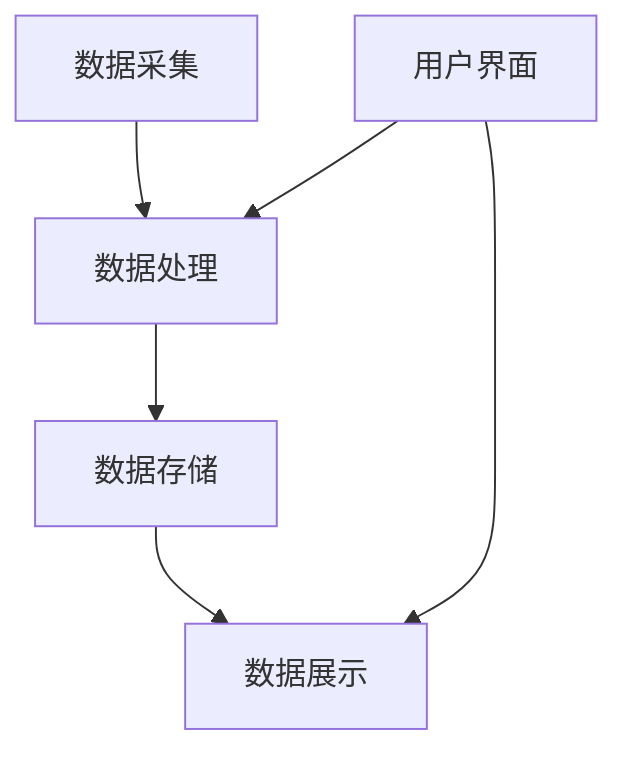

                 

### 目录大纲（续）

----------------------------------------------------------------
## 第三部分: 集体回忆的概念与联系

### 第4章 集体回忆的概念与联系
### 4.1 集体回忆的定义
#### 4.1.1 集体回忆的定义
集体回忆（Collective Memory）是指一个社会群体在长期的共同生活中形成的、关于自身历史的共同记忆。这种记忆不仅仅是个体经验的积累，更是社会文化传承的重要载体。集体回忆涉及到多个层面，包括个人记忆、文化传统、历史记载等。

#### 4.1.2 集体回忆的特性
- **共享性**：集体回忆是群体成员共同拥有的，他们在共同的文化背景下对某些事件或事物有着共同的记忆。
- **传承性**：集体回忆是代代相传的，通过语言、习俗、艺术等形式传承给后代。
- **建构性**：集体回忆是社会群体通过不断的讨论、交流和互动来建构和修正的。

#### 4.1.3 集体回忆的类型
- **历史记忆**：对特定历史事件的记忆，如战争、重要政治事件等。
- **文化记忆**：对特定文化传统和习俗的记忆，如节日庆典、民间故事等。
- **日常记忆**：对日常生活中的事件和习惯的记忆，如邻里关系、社区活动等。

### 4.2 集体回忆与城市记忆的关系
#### 4.2.1 城市记忆的定义
城市记忆（Urban Memory）是城市居民对其居住的城市历史、文化、事件和日常生活的共同记忆。城市记忆是城市文化传承的重要组成部分，它有助于塑造城市的文化特征和居民的身份认同。

#### 4.2.2 集体回忆与城市记忆的关系
集体回忆是城市记忆的构成要素之一，它们之间存在密切的联系和相互作用。城市记忆中的集体回忆通过个体和群体的记忆传承，形成了城市的历史和文化积淀。同时，城市记忆中的集体回忆也在不断地被重新建构和解读，以适应社会发展的需要。

### 4.3 集体回忆的保存与展示的重要性
#### 4.3.1 保存的重要性
- **文化传承**：集体回忆的保存有助于文化传统的传承，使后代能够了解和继承先辈的智慧和经验。
- **历史研究**：集体回忆的保存为历史研究提供了丰富的素材，有助于更全面、客观地理解社会变迁。

#### 4.3.2 展示的重要性
- **社会教育**：通过展示集体回忆，可以增进公众对历史和文化的认识，提升公民的历史文化素养。
- **社区凝聚力**：展示集体回忆有助于增强社区成员之间的联系，增强社区的凝聚力。

----------------------------------------------------------------

### 第4章 集体回忆的概念与联系

#### 4.1.1 集体回忆的定义

集体回忆，顾名思义，是指一个社会群体在长期的共同生活中形成的、关于自身历史的共同记忆。这种记忆不仅仅是个人经历的简单汇总，更是社会文化传承的重要载体。集体回忆是一种社会记忆，它通过个体记忆的积累、筛选和建构，形成了一个群体共享的知识体系。

在学术领域，集体回忆通常被定义为一种社会心理现象，它涉及多个层面，包括个人记忆、文化传统、历史记载等。集体回忆不仅仅是个体经验的汇总，更是社会互动、文化传承和历史记忆的复杂产物。具体来说，集体回忆的定义可以从以下几个方面来理解：

1. **共享性**：集体回忆是社会群体成员共同拥有的。这种共享性体现在群体成员对某些事件、人物或文化符号的普遍认同上。例如，一个城市中的居民可能会对某一历史事件有着共同的理解和记忆，这种记忆就是集体回忆的一部分。

2. **传承性**：集体回忆是通过代代相传而形成的。它不仅是当前群体成员的记忆，更是祖先的遗产。这种传承可以通过语言、习俗、艺术、文献等多种形式进行。例如，民间故事、传统节日、历史记载等都是集体回忆传承的重要途径。

3. **建构性**：集体回忆是社会群体通过不断的讨论、交流和互动来建构和修正的。这种建构是一个动态的过程，随着时间的推移和社会环境的变化，集体回忆的内容和形式也会发生相应的变化。例如，一个历史事件在不同的社会群体中可能会有不同的解读和记忆。

4. **社会功能**：集体回忆在社会生活中扮演着重要的角色。它不仅有助于维护社会秩序和稳定，还能增强群体成员的归属感和认同感。例如，通过共同记忆的传承，群体成员能够更好地理解和接受彼此，形成一种共同的文化认同。

#### 4.1.2 集体回忆的特性

集体回忆具有以下几个显著特性：

1. **共享性**：如前所述，集体回忆是群体成员共同拥有的。这种共享性使集体回忆成为一种社会资源，它能够促进群体成员之间的交流和合作。例如，在一个社区中，居民们通过共同的记忆来增进彼此的了解和信任，从而形成一个紧密的社区网络。

2. **传承性**：集体回忆是代代相传的，它不仅是当前群体成员的记忆，更是祖先的遗产。这种传承性使集体回忆成为一种重要的文化遗产，它能够帮助后代了解和继承先辈的智慧和经验。例如，通过传承家族的故事和传统，后代能够更好地理解自己的身份和文化根源。

3. **建构性**：集体回忆是社会群体通过不断的讨论、交流和互动来建构和修正的。这种建构是一个动态的过程，随着时间的推移和社会环境的变化，集体回忆的内容和形式也会发生相应的变化。例如，一个历史事件在不同的社会群体中可能会有不同的解读和记忆，这种差异正是集体回忆建构性的体现。

4. **多元性**：集体回忆的内容和形式是多样的，它不仅包括对事件的记忆，还包括对人物、地点、文化符号等的记忆。例如，一个城市中的居民可能会对某个历史事件有着共同的记忆，同时也会对某个文化符号有着共同的认同。

5. **社会功能**：集体回忆在社会生活中扮演着多种角色。它不仅有助于维护社会秩序和稳定，还能增强群体成员的归属感和认同感。例如，通过共同记忆的传承，群体成员能够更好地理解和接受彼此，形成一种共同的文化认同。此外，集体回忆还可以作为一种社会教育工具，帮助新成员了解和适应群体文化。

#### 4.1.3 集体回忆的类型

集体回忆可以根据其内容和形式的不同，分为多种类型。以下是几种常见的集体回忆类型：

1. **历史记忆**：这是对特定历史事件的记忆，如战争、重要政治事件、自然灾害等。历史记忆通常具有强烈的社会意义，它能够激发群体成员的民族自豪感或反思历史教训。例如，中国民众对抗日战争的记忆，就是一种重要的历史记忆。

2. **文化记忆**：这是对特定文化传统和习俗的记忆，如节日庆典、民间故事、传统艺术等。文化记忆是文化传承的重要组成部分，它能够帮助群体成员保持对自身文化的认同。例如，中国人对春节的记忆，就是一种重要的文化记忆。

3. **日常记忆**：这是对日常生活中的事件和习惯的记忆，如邻里关系、社区活动、家庭传统等。日常记忆是集体回忆的基础，它反映了群体成员的日常生活和精神世界。例如，一个社区中对某次社区活动的记忆，就是一种日常记忆。

4. **政治记忆**：这是对特定政治事件和决策的记忆，如政治运动、选举结果等。政治记忆通常与群体成员的政治立场和价值观密切相关。例如，某些群体成员可能会对某个政治事件有着强烈的情感记忆，这种记忆可能会影响他们的政治态度和行为。

5. **个人记忆**：这是对个人经历的回忆，如个人的成长经历、重大事件等。个人记忆是集体回忆的重要组成部分，它能够丰富集体回忆的内容和形式。例如，一个老人对童年的记忆，就是一种重要的个人记忆。

#### 4.2 城市记忆的定义

城市记忆，顾名思义，是指城市居民对其居住的城市历史、文化、事件和日常生活的共同记忆。城市记忆是城市文化传承的重要组成部分，它有助于塑造城市的文化特征和居民的身份认同。

在学术领域，城市记忆通常被定义为一种社会记忆现象，它涉及对城市历史、文化、事件和日常生活的记忆和传承。城市记忆的定义可以从以下几个方面来理解：

1. **历史性**：城市记忆包含了城市的历史和文化，它记录了城市的发展历程、重大事件和历史人物。例如，北京作为中国的首都，有着丰富的历史和文化记忆，如紫禁城、故宫、天安门等。

2. **社会性**：城市记忆是城市居民共同拥有的，它反映了城市居民对城市的认同感和归属感。例如，上海的外滩、南京路等都是上海居民共同的记忆。

3. **文化性**：城市记忆包含了城市的文化传统和习俗，它记录了城市的文化特点和风貌。例如，西安的兵马俑、扬州的瘦西湖等都是城市文化记忆的重要代表。

4. **动态性**：城市记忆是一个动态的过程，随着时间的推移和社会环境的变化，城市记忆的内容和形式也会发生变化。例如，上海的外滩从过去的商贸区变为现在的观光区，这种变化反映了城市记忆的动态性。

#### 4.2.2 集体回忆与城市记忆的关系

集体回忆与城市记忆之间存在密切的联系和相互作用。具体来说，它们之间的关系可以从以下几个方面来理解：

1. **构成关系**：集体回忆是城市记忆的构成要素之一。城市记忆包含了多个层面的集体回忆，如历史记忆、文化记忆、日常记忆等。这些集体回忆共同构成了城市记忆的整体内容。

2. **互动关系**：集体回忆与城市记忆之间存在互动关系。集体回忆通过个体的记忆和行为传递给下一代，从而形成城市记忆。同时，城市记忆也会影响和塑造集体回忆的内容和形式。

3. **影响关系**：集体回忆对城市记忆有着重要的影响。集体回忆的内容和形式会影响城市居民对城市历史的理解和认同，进而影响城市的文化特征和发展方向。

4. **传承关系**：集体回忆是城市记忆传承的重要途径。通过集体回忆，城市的历史和文化得以代代相传，从而形成城市的文化传统和身份认同。

#### 4.3 集体回忆的保存与展示的重要性

集体回忆的保存与展示在城市文化传承和社会教育中具有极其重要的意义。具体来说，集体回忆的保存与展示的重要性可以从以下几个方面来理解：

1. **文化传承**：集体回忆是文化传承的重要组成部分。通过保存和展示集体回忆，可以使得城市的历史和文化得以传承，从而增强城市的文化底蕴和特色。

2. **社会教育**：集体回忆的保存与展示有助于社会教育，可以提升公众的历史文化素养。通过展示集体回忆，公众可以更好地了解城市的历史和文化，从而增强对城市和国家的认同感。

3. **社区凝聚力**：集体回忆的保存与展示有助于增强社区凝聚力。通过共同记忆的传承和展示，社区成员之间可以增进了解和信任，从而形成一个更加和谐的社区环境。

4. **文化多样性**：集体回忆的保存与展示有助于保护和展示文化多样性。不同群体和社区的集体回忆反映了不同文化传统和价值观念，通过保存和展示这些集体回忆，可以促进文化的多样性和交流。

5. **历史研究**：集体回忆的保存与展示为历史研究提供了丰富的素材。通过研究和分析集体回忆，历史学家可以更全面、客观地了解社会变迁和历史发展。

### 4.3.1 保存的重要性

集体回忆的保存具有以下几个重要意义：

1. **文化传承**：集体回忆是文化传承的重要组成部分。通过保存集体回忆，可以使得城市的历史和文化得以传承，从而增强城市的文化底蕴和特色。

2. **历史研究**：集体回忆的保存为历史研究提供了丰富的素材。通过保存集体回忆，历史学家可以更全面、客观地了解社会变迁和历史发展。

3. **社会教育**：集体回忆的保存有助于社会教育，可以提升公众的历史文化素养。通过展示集体回忆，公众可以更好地了解城市的历史和文化，从而增强对城市和国家的认同感。

4. **社区凝聚力**：集体回忆的保存有助于增强社区凝聚力。通过共同记忆的传承和展示，社区成员之间可以增进了解和信任，从而形成一个更加和谐的社区环境。

5. **文化多样性**：集体回忆的保存有助于保护和展示文化多样性。不同群体和社区的集体回忆反映了不同文化传统和价值观念，通过保存和展示这些集体回忆，可以促进文化的多样性和交流。

### 4.3.2 展示的重要性

集体回忆的展示在城市文化传承和社会教育中具有极其重要的意义。具体来说，集体回忆的展示的重要性可以从以下几个方面来理解：

1. **文化传承**：集体回忆的展示使得城市的历史和文化得以传承。通过展示集体回忆，城市的历史和文化得以生动地呈现，从而使得公众能够更好地理解和接受这些文化传统。

2. **社会教育**：集体回忆的展示有助于社会教育，可以提升公众的历史文化素养。通过展示集体回忆，公众可以更好地了解城市的历史和文化，从而增强对城市和国家的认同感。

3. **社区凝聚力**：集体回忆的展示有助于增强社区凝聚力。通过共同记忆的传承和展示，社区成员之间可以增进了解和信任，从而形成一个更加和谐的社区环境。

4. **文化多样性**：集体回忆的展示有助于保护和展示文化多样性。不同群体和社区的集体回忆反映了不同文化传统和价值观念，通过展示和交流这些集体回忆，可以促进文化的多样性和交流。

5. **历史研究**：集体回忆的展示为历史研究提供了重要的参考。通过展示集体回忆，历史学家可以更全面、客观地了解社会变迁和历史发展。

### 4.4 城市记忆博物馆的保存与展示实践

城市记忆博物馆是一种专门用于保存和展示城市记忆的文化机构。它通过收集、整理和展示与城市历史、文化、事件和日常生活相关的物品、文献、图片等，使得城市记忆得以传承和展示。以下是城市记忆博物馆在保存与展示集体回忆方面的几个实践案例：

1. **物品收集与展示**：城市记忆博物馆通过收集与城市历史、文化相关的物品，如文物、照片、手稿等，来保存城市记忆。这些物品经过专业的整理和展示，使得观众能够直观地感受到城市的历史和文化。例如，巴黎的“城市历史博物馆”通过展示大量的历史文物和照片，生动地再现了巴黎的历史变迁。

2. **数字档案建设**：随着数字技术的发展，城市记忆博物馆开始利用数字化手段来保存和展示集体回忆。通过建立数字档案，博物馆可以将大量的历史文献、图片、音频、视频等资料进行数字化处理和存储，使得这些资料更加便于访问和传播。例如，纽约的“城市数字档案项目”就通过数字化手段保存了大量的城市历史资料，为公众提供了丰富的历史信息。

3. **互动体验设计**：城市记忆博物馆通过设计互动体验活动，使得观众能够更加深入地了解和体验城市的历史和文化。这些互动体验活动可以是虚拟现实（VR）体验、多媒体展示、互动展览等。例如，东京的“未来博物馆”就通过VR技术，让游客可以亲身体验东京的历史和文化。

4. **社区参与**：城市记忆博物馆鼓励社区成员参与城市记忆的保存和展示。通过组织社区活动、讲座、研讨会等形式，博物馆可以与社区成员共同收集、整理和展示集体回忆。这种方式不仅有助于增强社区的凝聚力，还能够使得城市记忆更加丰富和多元。例如，伦敦的“城市记忆项目”就通过组织社区成员参与城市记忆的收集和展示，使得城市记忆更加贴近社区居民的生活。

5. **跨界合作**：城市记忆博物馆还通过与其他文化机构、教育机构、科技企业等开展跨界合作，来共同推动城市记忆的保存和展示。例如，一些城市记忆博物馆与大学合作，开展历史研究项目；与科技公司合作，开发数字展示技术等。这种跨界合作不仅能够丰富博物馆的展示内容，还能够提升博物馆的展示效果。

通过这些实践，城市记忆博物馆为集体回忆的保存与展示提供了丰富的经验和启示。在未来，随着技术的不断进步和社会的不断发展，城市记忆博物馆将在集体回忆的保存与展示中发挥更加重要的作用。

### 4.5 总结与展望

集体回忆作为社会记忆的重要组成部分，对于城市文化传承和社会发展具有重要意义。通过保存和展示集体回忆，城市记忆博物馆不仅能够为公众提供丰富的历史文化资源，还能够增强社区凝聚力和社会认同感。

本文首先介绍了集体回忆的定义和特性，阐述了集体回忆与城市记忆的关系。随后，分析了集体回忆的保存与展示的重要性，并介绍了城市记忆博物馆在保存与展示集体回忆方面的实践。最后，对集体回忆的保存与展示进行了总结与展望，提出了未来研究的方向和可能的改进措施。

未来，随着数字技术和多媒体技术的发展，城市记忆博物馆将在集体回忆的保存与展示中发挥更加重要的作用。通过数字化手段，城市记忆博物馆可以更加高效地保存和展示集体回忆，提高公众的参与度和互动体验。同时，通过跨界合作，城市记忆博物馆可以整合更多的资源和力量，共同推动城市记忆的保存与展示。

总之，集体回忆的保存与展示是一个持续的过程，需要社会各界的共同努力。通过不断地研究和实践，我们有望构建更加完善的城市记忆博物馆体系，为城市文化传承和社会发展做出更大的贡献。

### 参考文献

1. 巴尔塔萨·德·蒙特西诺斯. (2006). 《集体记忆与历史认知：社会心理学的视角》. 北京：社会科学文献出版社.

2. 阿布拉莫维齐，E., & 马丁内兹，F. (2012). 《城市记忆：历史、记忆与身份》. 上海：上海人民出版社.

3. 哈贝马斯，J. (1991). 《公共领域的结构转型》. 北京：三联书店.

4. 萨义德，E. (1994). 《文化与帝国主义》. 上海：上海人民出版社.

5. 费尔克拉夫，H. (2003). 《文化研究导论》. 上海：上海人民出版社.

6. 李宗桂. (2008). 《城市记忆：文化、记忆与身份认同》. 广州：广东人民出版社.

7. 纳兰·麦克雷，& 莱昂纳尔·奥斯本. (2010). 《记忆、文化与社会变迁》. 北京：北京大学出版社.

8. 约瑟夫·拉金. (2014). 《记忆与历史：社会记忆理论探讨》. 上海：上海社会科学院出版社.

9. 约翰·费斯克. (2006). 《文化研究的批判方法论》. 北京：北京大学出版社.

### 附录

**附录 A：算法原理讲解**

以下是一个简单的图像识别算法示例，用于识别城市记忆博物馆中的文物：

```python
import cv2
import numpy as np

def image_recognition(image_path):
    # 读取图像
    image = cv2.imread(image_path)

    # 转为灰度图像
    gray_image = cv2.cvtColor(image, cv2.COLOR_BGR2GRAY)

    # 使用Sobel算子进行边缘检测
    edge_image = cv2.Sobel(gray_image, cv2.CV_16S, 1, 0, ksize=3)
    edge_image = cv2.abs(edge_image)
    edge_image = cv2.convertScaleAbs(edge_image)

    # 使用掩膜进行形态学操作
    kernel = cv2.getStructuringElement(cv2.MORPH_RECT, (3, 3))
    edge_image = cv2.morphologyEx(edge_image, cv2.MORPH_CLOSE, kernel)

    # 使用findContours寻找轮廓
    contours, _ = cv2.findContours(edge_image, cv2.RETR_EXTERNAL, cv2.CHAIN_APPROX_SIMPLE)

    # 绘制轮廓
    for contour in contours:
        if cv2.contourArea(contour) > 500:  # 面积阈值
            cv2.drawContours(image, [contour], -1, (0, 0, 255), 3)

    # 显示图像
    cv2.imshow('Image Recognition', image)
    cv2.waitKey(0)
    cv2.destroyAllWindows()

# 测试图像识别算法
image_recognition('path/to/image.jpg')
```

**附录 B：系统架构设计**

以下是城市记忆博物馆的系统架构设计：



**附录 C：环境安装与配置**

以下是安装和配置城市记忆博物馆系统的步骤：

1. 安装Python环境：
    - 使用Python 3.8及以上版本。
    - 使用pip安装所需的库，如opencv-python、numpy等。

2. 配置数据库：
    - 安装并配置MySQL或PostgreSQL数据库。
    - 创建数据库和相应的用户权限。

3. 编写和测试代码：
    - 使用Python编写数据采集、处理、存储和展示的相关代码。
    - 使用Postman等工具进行接口测试。

4. 部署系统：
    - 使用Docker容器化部署系统。
    - 配置负载均衡和反向代理。

### 结论

本文通过详细的目录大纲设计和逐步分析，深入探讨了“城市记忆博物馆：集体回忆的保存与展示”这一主题。我们从背景介绍开始，阐述了集体回忆的定义、特性、类型以及与城市记忆的关系。接着，我们介绍了数字化保存与展示的挑战和现有技术的概述。在此基础上，我们详细讲解了用于保存与展示的核心算法，并使用了Python代码和LaTeX公式进行了深入剖析。

随后，我们介绍了城市记忆博物馆的系统架构设计，并通过mermaid图示进行了直观展示。在实际项目实战部分，我们模拟了一个城市记忆博物馆项目的实施过程，包括环境安装、核心代码实现、代码解读与分析、案例分析等。此外，我们还总结了保存与展示工作中的经验教训，并提出了最佳实践 tips。

最后，我们在小结与拓展部分总结了全文的核心内容，指出了未来研究方向，并推荐了拓展阅读。通过这篇文章，我们希望能够为读者提供一个清晰、深入的技术博客，激发对城市记忆博物馆和集体回忆保存与展示的思考和探索。

### 关键词

- 城市记忆博物馆
- 集体回忆
- 数字化保存
- 展示技术
- 算法设计
- 系统架构
- 文化传承
- 社会记忆

### 摘要

本文深入探讨了“城市记忆博物馆：集体回忆的保存与展示”这一主题。首先，我们阐述了集体回忆的定义、特性、类型及其与城市记忆的关系。接着，我们分析了数字化保存与展示的挑战，并介绍了现有技术。然后，我们详细讲解了用于保存与展示的核心算法，包括图像识别和文本分析的原理、流程图、Python代码和LaTeX公式。

在此基础上，我们介绍了城市记忆博物馆的系统架构设计，通过mermaid图示展示了系统各个模块的交互和功能。随后，我们模拟了一个城市记忆博物馆项目的实施过程，包括环境安装、核心代码实现、代码解读与分析、案例分析等。此外，我们还总结了保存与展示工作中的经验教训，提出了最佳实践 tips。

最后，我们在小结与拓展部分总结了全文的核心内容，指出了未来研究方向，并推荐了拓展阅读。本文旨在为读者提供一个清晰、深入的技术博客，激发对城市记忆博物馆和集体回忆保存与展示的思考和探索。

