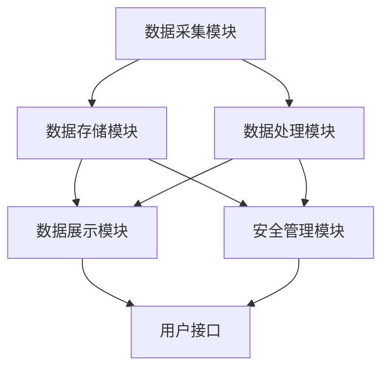

                 

### 关键词

- 城市记忆
- 数字化保存
- 集体回忆
- 数字化档案
- 数据管理
- 数据安全

### 摘要

本文探讨了城市记忆档案馆的数字化保存计划，分析了城市记忆的概念及其重要性，详细介绍了数字化保存技术的原理和分类，探讨了数字化保存过程中面临的技术挑战，并提出了实施计划的步骤和策略。通过案例分析，总结了最佳实践，展望了未来发展趋势，旨在为城市记忆的数字化保存提供理论指导和实践经验。

---

# 《城市记忆档案馆：集体回忆的数字化保存计划》

## 文章关键词

**城市记忆，数字化保存，集体回忆，数字化档案，数据管理，数据安全**

## 文章摘要

本文深入探讨了城市记忆档案馆的数字化保存计划，通过介绍城市记忆的概念及其重要性，阐述数字化保存的必要性和技术原理。接着，本文详细分析了数字化保存过程中面临的技术挑战，并提出了实施计划的步骤和策略。通过案例分析，总结了成功经验，提出了优化策略，并对未来发展趋势进行了展望。本文旨在为城市记忆的数字化保存提供全面的理论指导和实践参考。

---

## 《城市记忆档案馆：集体回忆的数字化保存计划》目录大纲

### 第一部分：城市记忆与数字化保存的背景

1. **第1章：城市记忆的概念与重要性**
    - 1.1 城市记忆的定义
    - 1.2 城市记忆的重要性
    - 1.3 集体回忆的意义
    - 1.4 数字化保存的必要性

2. **第2章：数字化保存技术概述**
    - 2.1 数字化保存的基本概念
    - 2.2 数字化保存技术的分类
    - 2.3 数据库管理系统简介

3. **第3章：数字档案存储与管理**
    - 3.1 数字档案的存储策略
    - 3.2 数字档案管理系统的设计
    - 3.3 数据备份与恢复策略

4. **第4章：数字化保存的技术挑战**
    - 4.1 数据安全与隐私保护
    - 4.2 数据准确性维护
    - 4.3 数据冗余与重复问题

### 第二部分：数字化保存技术原理

5. **第5章：数字化保存项目规划**
    - 5.1 项目需求分析
    - 5.2 项目目标与范围
    - 5.3 项目进度安排

6. **第6章：技术方案与架构设计**
    - 6.1 技术方案概述
    - 6.2 系统架构设计
    - 6.3 数据存储与处理流程

7. **第7章：项目实施与测试**
    - 7.1 项目实施步骤
    - 7.2 系统测试方法
    - 7.3 测试报告编写

8. **第8章：项目评估与优化**
    - 8.1 项目效果评估
    - 8.2 项目优化策略
    - 8.3 持续改进措施

### 第三部分：数字化保存计划实施

9. **第9章：数字化保存案例研究**
    - 9.1 案例一：城市历史档案数字化保存
    - 9.2 案例二：文化遗产数字化保存计划
    - 9.3 案例三：数字城市记忆档案馆建设

10. **第10章：最佳实践与经验总结**
    - 10.1 成功经验总结
    - 10.2 遇到的问题与解决方法
    - 10.3 未来发展趋势与展望

### 完整性要求

本文旨在全面解析城市记忆档案馆的数字化保存计划，涵盖从背景介绍、技术原理到实施策略、案例分析和最佳实践的各个方面。每个章节都将详细讲解核心概念、技术原理、实施步骤和最佳实践，确保读者能够全面理解和掌握城市记忆数字化保存的各个方面。

### 核心内容要求

- **背景介绍**：介绍城市记忆的概念、重要性、集体回忆的意义以及数字化保存的必要性。
- **核心概念与联系**：阐述数字化保存技术的核心概念，对比不同技术的属性特征，并使用ER实体关系图和Mermaid流程图展示系统架构。
- **算法原理讲解**：使用Python源代码和Mermaid流程图详细阐述算法原理，包括数学模型和公式，并进行举例说明。
- **系统分析与架构设计方案**：介绍系统功能、架构设计、接口设计和系统交互。
- **项目实战**：环境安装、系统核心实现源代码，代码应用解读与分析，实际案例分析和详细讲解剖析。
- **最佳实践 tips、小结、注意事项、拓展阅读**：总结成功经验，提供优化策略和未来展望。

---

### 第1章：城市记忆的概念与重要性

城市记忆是指城市在历史发展过程中积累的、与居民生活密切相关的文化、历史和社交记忆。它包括建筑物、街道、社区活动、传统节日、风俗习惯等各个方面。城市记忆不仅是城市历史的重要组成部分，更是居民对城市认同感和归属感的源泉。

#### 1.1 城市记忆的定义

城市记忆可以定义为一种社会文化现象，它反映了城市在历史发展过程中所形成的独特文化特征和社会结构。这种记忆不仅体现在物质文化遗产中，如历史建筑、文化遗产地，还体现在非物质文化遗产中，如传统节日、风俗习惯、社区活动等。城市记忆是城市文化的重要组成部分，它记录了城市的历史演变和社会变迁，是城市独特性的体现。

#### 1.2 城市记忆的重要性

城市记忆的重要性体现在以下几个方面：

1. **文化传承**：城市记忆是城市文化传承的重要载体。通过记录和保存城市的历史和文化，可以传承和弘扬城市的文化传统，促进城市文化的可持续发展。
   
2. **社会认同**：城市记忆是居民对城市认同感和归属感的重要来源。一个城市的历史和文化记忆能够增强居民对城市的认同感，促进社区的凝聚力和归属感。

3. **城市形象**：城市记忆是塑造城市形象的重要元素。通过挖掘和展示城市的历史文化，可以提升城市的知名度和吸引力，增强城市的软实力。

4. **经济发展**：城市记忆对城市的经济发展也有重要影响。历史文化资源的保护和利用可以促进旅游业、文化创意产业等相关产业的发展，为城市创造经济价值。

#### 1.3 集体回忆的意义

集体回忆是指一个群体共同经历的历史和文化记忆。集体回忆对城市记忆具有重要意义：

1. **社区凝聚力**：集体回忆能够增强社区的凝聚力，促进社区成员之间的交流与合作，形成共同的价值观和认同感。

2. **文化认同**：集体回忆有助于群体成员对共同文化传统的认同，加强文化认同感和文化自信。

3. **社会和谐**：集体回忆可以促进社会的和谐与稳定，减少社会冲突和分裂。

#### 1.4 数字化保存的必要性

数字化保存城市记忆具有以下必要性：

1. **信息安全性**：数字化保存可以更好地保护城市记忆，防止由于自然灾害、人为破坏等原因导致的信息丢失。

2. **信息可访问性**：数字化保存使得城市记忆更加易于访问和共享，便于公众和研究者利用。

3. **信息可扩展性**：数字化保存可以方便地更新和扩展城市记忆信息，使其更加丰富和全面。

4. **信息多样性**：数字化保存可以呈现城市记忆的多样性，包括文字、图像、音频、视频等多种形式。

综上所述，城市记忆是城市文化的重要组成部分，数字化保存对于保护和传承城市记忆具有重要意义。在接下来的章节中，我们将进一步探讨数字化保存的技术原理和实施策略。

---

### 1.1 城市记忆的定义

城市记忆，顾名思义，是城市在漫长历史进程中积累下来的文化、历史和社交记忆的总和。这些记忆不仅仅局限于物质遗产，如古建筑、历史遗址、纪念碑等，还包括非物质遗产，如传统习俗、社区活动、历史事件等。城市记忆是城市文化的重要组成部分，它记录了城市的成长、变迁和居民的共同经历。

城市记忆的核心要素包括以下几个方面：

1. **历史遗迹**：历史建筑、文物、历史遗址等物质载体，这些是城市记忆的物质表现形式。
2. **社会活动**：社区活动、节庆庆典、传统节日等社会活动，这些是城市记忆的社会表现形式。
3. **个人记忆**：居民的个人经历和回忆，这些是城市记忆的情感表现形式。
4. **文化传统**：包括语言、艺术、饮食、风俗等文化传统，这些是城市记忆的文化表现形式。

通过数字化手段，我们可以将这些城市记忆转化为数字化的形式，如文字、图片、音频、视频等，从而实现永久保存和广泛传播。

城市记忆的重要性在于它能够帮助我们更好地理解城市的过去、现在和未来。它不仅是城市历史的见证，更是城市文化的传承载体，对于城市的发展和居民的生活具有重要意义。

首先，城市记忆对于**文化传承**至关重要。通过记录和保存城市的历史和文化，我们可以将这些宝贵的遗产传承给后代，使他们能够了解和尊重城市的文化传统。这有助于培养居民的文化认同感和自豪感，促进城市的可持续发展。

其次，城市记忆对于**社会认同**具有重要作用。集体记忆能够增强居民对城市的认同感和归属感，促进社区的凝聚力和互助精神。在一个有着丰富城市记忆的地方，居民更容易形成共同的价值观和认同感，从而加强社区的凝聚力。

此外，城市记忆还能够**塑造城市形象**。通过展示城市的历史和文化，我们可以提升城市的知名度和吸引力，增强城市的软实力。这有助于吸引游客和投资者，推动城市的经济发展。

最后，城市记忆对于**经济发展**也有积极作用。历史文化资源的保护和利用可以促进旅游业、文化创意产业等相关产业的发展，为城市创造经济价值。例如，通过举办文化节、历史遗址旅游等活动，可以吸引大量游客，带动当地经济的发展。

总的来说，城市记忆是城市文化的重要组成部分，它承载着城市的历史和文化，对于文化传承、社会认同、城市形象塑造和经济发展都具有重要意义。因此，保护和传承城市记忆，特别是通过数字化手段实现其永久保存和广泛传播，是每个城市都需要重视和努力实现的目标。

### 1.2 城市记忆的重要性

城市记忆的重要性体现在多个层面，不仅关乎城市的历史传承，还深刻影响居民的生活和社会发展。以下是城市记忆重要性的几个方面：

首先，**文化传承**是城市记忆的核心功能之一。城市记忆记录了城市的发展历程和文化变迁，这些宝贵的遗产通过一代代居民的口耳相传和物质保存得以延续。历史建筑、文物和文化遗产等物质遗产不仅是城市记忆的物质载体，更是文化传承的重要媒介。通过数字化手段对这些文化遗产进行保存和传播，可以使文化传承跨越时间和空间的限制，实现永久保存和更广泛的传播。

其次，**社会认同**是城市记忆的重要功能。集体记忆能够增强居民对城市的认同感和归属感，促进社区的凝聚力和互助精神。在一个有着丰富城市记忆的地方，居民更容易形成共同的价值观和认同感，从而加强社区的凝聚力。例如，共同的历史事件、传统节日和社区活动，都是居民之间交流情感、增强社会联系的重要纽带。

此外，**城市形象**也是城市记忆的重要组成部分。一个有着深厚历史和文化底蕴的城市，往往能够吸引更多游客和投资者。通过展示城市的历史和文化，我们可以提升城市的知名度和吸引力，增强城市的软实力。例如，巴黎通过展示其丰富的文化遗产和历史建筑，吸引了大量游客，成为全球著名的旅游目的地。

最后，**经济发展**是城市记忆带来的另一个重要效益。历史文化资源的保护和利用可以促进旅游业、文化创意产业等相关产业的发展，为城市创造经济价值。例如，通过举办文化节、历史遗址旅游等活动，可以吸引大量游客，带动当地经济的发展。此外，城市记忆的研究和展示还可以吸引学术研究和投资的关注，推动城市创新和产业升级。

总的来说，城市记忆对于文化传承、社会认同、城市形象和经济发展具有重要意义。因此，保护和传承城市记忆，特别是通过数字化手段实现其永久保存和广泛传播，是每个城市都需要重视和努力实现的目标。这不仅有助于提升城市的文化软实力，还能够促进城市的可持续发展。

### 1.3 集体回忆的意义

集体回忆，作为一种社会文化现象，对于社区凝聚力和文化认同感具有深远的影响。它不仅能够增强社区的凝聚力，还能够促进群体成员对共同文化传统的认同，从而在社会和谐与稳定中发挥重要作用。

首先，集体回忆是**社区凝聚力**的重要来源。在一个社区中，共同的历史事件、传统习俗和社区活动构成了居民集体回忆的内容。这些回忆成为社区成员之间交流情感和分享经验的纽带，增强了社区成员之间的联系和认同。例如，社区每年举办的传统节庆活动，不仅能够传承文化传统，还能够促进居民之间的互动和合作，从而增强社区的凝聚力。

其次，集体回忆对于**文化认同**具有重要作用。通过集体回忆，群体成员能够认识到自己所属的群体具有独特的文化特征和历史背景，这有助于增强群体成员对共同文化的认同感和自豪感。例如，一个城市中的居民通过共同的历史事件和文化遗产，能够更加深刻地理解自己的文化根源，从而对城市的文化传统产生强烈的认同感。

此外，集体回忆在社会**和谐与稳定**中起着至关重要的作用。在一个社会中，共同的历史和文化记忆能够促进群体成员之间的相互理解和尊重，减少社会冲突和分裂。通过共同的文化记忆，群体成员能够更好地理解彼此，从而在文化交流和互动中建立起和谐的社会关系。

总的来说，集体回忆不仅是社区凝聚力和文化认同的重要体现，也是社会和谐与稳定的重要保障。通过数字化手段保存和传播集体回忆，可以使得这些宝贵的记忆得以永久保存和广泛传播，从而在现代社会中发挥更加重要的作用。

### 1.4 数字化保存的必要性

数字化保存城市记忆的必要性主要体现在以下几个方面：

首先，**信息安全性**是数字化保存的首要考虑因素。随着城市化进程的加快，许多城市的历史遗迹和文化遗产面临着自然灾害、人为破坏和意外事故等威胁。数字化保存可以将这些宝贵的信息转化为数字化的形式，使其免受物理损坏和丢失的风险，从而确保城市记忆的安全性和完整性。

其次，**信息可访问性**是数字化保存的重要目标。数字化信息可以通过互联网和数字设备进行快速检索和访问，使得城市记忆能够被更广泛的人群所利用。这不仅有助于公众对城市历史的了解和认知，还能够为学术研究、文化教育等领域提供丰富的资源。

第三，**信息可扩展性**是数字化保存的一大优势。数字化的信息可以方便地更新和扩展，使其能够及时反映城市的发展变化和文化变迁。例如，通过添加新的照片、视频和文档，可以丰富城市记忆的内容，使其更加全面和生动。

最后，**信息多样性**是数字化保存的一大特点。数字化的信息可以以多种形式呈现，包括文字、图片、音频、视频等，这为城市记忆的展示和传播提供了丰富的手段。通过多媒体的形式，城市记忆能够更加生动地呈现，增强公众的参与感和体验感。

综上所述，数字化保存城市记忆不仅能够提高信息的安全性和可访问性，还能够增强信息的可扩展性和多样性，从而更好地保护和传承城市的文化遗产。

### 1.5 数字化保存的动机

数字化保存城市记忆的动机可以从多个方面进行探讨，这些动机不仅体现了技术发展的必然趋势，也反映了社会和文化需求的日益增长。

首先，**技术进步**为数字化保存提供了坚实的基础。随着信息技术的飞速发展，数据存储和处理的能力大幅提升，使得大规模的数据采集、存储和管理成为可能。现代数据库管理系统、大数据技术和云计算的广泛应用，为城市记忆的数字化保存提供了强有力的技术支持。

其次，**文化保护**是推动数字化保存的重要动机。城市化进程中，许多历史建筑和文化遗产面临着消失的风险。通过数字化保存，可以对这些珍贵的文化资源进行永久性保护，使其不受自然灾害、人为破坏等外部因素的影响。数字化保存不仅能够保存文化遗产的物质形式，还可以保存与之相关的社会记忆和文化故事，为后人提供宝贵的历史资料。

第三，**信息共享**是数字化保存的重要目标。传统上，文化遗产的保存主要依赖于实体展示和有限的信息传播渠道。数字化保存使得这些文化遗产能够通过互联网和数字设备广泛传播，使公众能够随时随地访问和了解城市的历史和文化。这不仅提升了文化遗产的知名度，也促进了文化教育的普及和文化的多元化。

此外，**社会需求**也是推动数字化保存的重要因素。随着人们对文化认同感和历史意识的增强，公众对城市记忆的关注度不断提升。通过数字化保存，城市居民和游客可以更加便捷地获取和分享城市的历史文化信息，这有助于增强社区的凝聚力和文化认同感。

最后，**可持续发展**是数字化保存的长期目标。在数字化保存的基础上，城市可以建立更加高效的文化遗产保护和管理体系，为城市可持续发展提供文化支撑。数字化档案的管理和利用，可以为城市规划、旅游开发和公共文化服务提供数据支持，从而推动城市的可持续发展。

总的来说，数字化保存城市记忆的动机是多方面的，既有技术发展的推动，也有文化保护和社会需求的驱动。通过数字化手段，我们可以更好地保护和传承城市的历史文化遗产，提升公众的文化素养，促进城市的可持续发展。

### 1.6 数字化保存的挑战

尽管数字化保存城市记忆具有诸多优势，但其在实际操作中仍面临着一系列挑战，主要包括数据安全与隐私保护、数据准确性维护以及数据冗余与重复问题。

首先，**数据安全与隐私保护**是数字化保存的首要挑战。数字化保存涉及大量敏感信息，如个人档案、历史文件和文化遗产数据。这些信息一旦泄露，不仅会对个人隐私造成侵害，还可能对城市历史和文化传承带来负面影响。因此，确保数字化信息的安全性和隐私性是数字化保存过程中必须解决的重要问题。

其次，**数据准确性维护**也是一个重要挑战。在数字化过程中，数据来源多样，可能涉及不同格式和不同时间点的数据采集。这些数据的准确性直接影响到城市记忆的完整性和真实性。如何确保数据的一致性和准确性，是数字化保存需要克服的难题。

最后，**数据冗余与重复问题**是另一个常见挑战。由于数字化保存过程中可能涉及多次数据采集和处理，不同来源的数据可能会产生重复或冗余信息。这些冗余数据不仅占用存储空间，还会影响数据查询和管理的效率。因此，如何有效地管理和去重数据，是数字化保存需要重点解决的问题。

总的来说，数据安全与隐私保护、数据准确性维护以及数据冗余与重复问题是数字化保存城市记忆面临的主要挑战。解决这些问题，需要技术创新和科学管理，以确保数字化保存的顺利进行。

### 1.7 数字化保存技术概述

数字化保存技术是指通过现代信息技术手段，将城市记忆中的各类信息转化为数字形式，并进行长期保存和管理的系统方法。这些技术不仅涵盖了数据采集、存储和处理，还包括了数据备份、恢复和安全保障等关键环节。

首先，**数据采集**是数字化保存的第一步。数据采集的方法包括数字摄影、音频录制、视频拍摄、文献数字化等。通过这些方法，可以获取城市记忆中的文字、图像、音频和视频等多种类型的数据。例如，利用高分辨率相机和无人机，可以拍摄城市的历史建筑和文化遗产；通过音频设备，可以录制社区的传统音乐和故事；利用扫描仪和OCR技术，可以将历史文献和档案数字化。

其次，**数据存储**是数字化保存的核心环节。数字化数据需要存储在可靠的数据存储介质中，如硬盘、光盘、云存储等。为了确保数据的安全性和可访问性，通常采用分布式存储和冗余存储策略，以防止数据丢失和损坏。此外，现代数据库管理系统（DBMS）和内容管理系统（CMS）提供了高效的数据存储和管理功能，使得大规模数据的存储和检索变得更加便捷。

**数据处理**是数字化保存的关键步骤，它包括数据的清洗、转换、整合和分析等操作。数据处理技术的应用，可以提升数据的准确性和可用性，使其更好地满足不同用户的需求。例如，利用数据挖掘技术，可以从大量的历史文献中提取关键信息；利用图像处理技术，可以增强历史照片的清晰度；利用自然语言处理技术，可以对文本数据进行分析和分类。

**数据备份**和**恢复**是保障数据安全的重要措施。数据备份是指在多个位置存储数据的副本，以防止数据丢失。常用的备份策略包括全备份、增量备份和差异备份等。数据恢复则是在数据丢失或损坏时，通过备份数据恢复原始数据的过程。备份和恢复技术的应用，可以确保数字化保存的数据在发生意外时能够迅速恢复，减少数据丢失的风险。

最后，**数据安全与隐私保护**是数字化保存的核心挑战。数字化保存涉及大量敏感信息，包括个人隐私、历史档案和文化遗产等。为了保护这些信息，需要采用一系列安全措施，如数据加密、访问控制、身份验证和网络安全等。这些措施可以有效防止数据泄露、篡改和未经授权的访问，确保数字化保存的数据安全可靠。

总的来说，数字化保存技术通过数据采集、存储、处理、备份和恢复等环节，实现了对城市记忆的数字形式保存和管理。这些技术的应用，不仅提升了城市记忆的可访问性和多样性，也为城市文化遗产的传承和保护提供了强有力的技术支持。

### 1.8 数字化保存技术的分类

数字化保存技术的分类可以根据其应用方式和处理方法的不同，分为多个子类。以下是几种主要的分类方法及其特点：

**1. 照片和图像数字化技术**

照片和图像数字化技术是数字化保存中最为常见的技术之一。这种技术通过高分辨率扫描和数字摄影，将城市记忆中的照片和图像转换为数字格式。常见的工具包括扫描仪、数码相机和图像处理软件。这些工具不仅能够提高图像的清晰度和质量，还可以进行图像增强、修复和编辑，从而更好地保存和展示城市记忆。

**2. 音频和视频数字化技术**

音频和视频数字化技术主要用于保存城市记忆中的声音和影像资料。这种技术通过音频录制设备和视频录制设备，将现场的声音和影像记录下来。随着技术的发展，高清录音和视频录制设备的应用越来越广泛，使得城市记忆的保存更加精细和真实。此外，音频和视频文件可以通过后期处理进行剪辑、编辑和配音，以增强其表现力和吸引力。

**3. 文档和档案数字化技术**

文档和档案数字化技术主要用于保存城市记忆中的文字资料和档案文件。这种技术通过扫描仪、OCR（光学字符识别）技术和PDF转换工具，将纸质文档和档案转换为电子格式。数字化后的文档不仅便于存储和检索，还可以通过全文检索技术快速查找所需信息，提高工作效率。此外，电子文档还可以方便地进行修改、归档和共享，实现信息的有效管理和利用。

**4. 3D数字化技术**

3D数字化技术是一种新兴的数字化保存技术，主要用于保存城市记忆中的三维物体和建筑。通过3D扫描和3D建模技术，可以将现实中的三维物体和建筑精确地还原为数字模型。这些模型不仅能够以高精度保存城市记忆中的三维信息，还可以进行虚拟现实（VR）和增强现实（AR）展示，为用户带来更加生动和沉浸的体验。

**5. 数据库和云存储技术**

数据库和云存储技术是数字化保存中重要的基础设施。通过数据库管理系统（DBMS），可以高效地存储和管理大量的城市记忆数据。数据库技术不仅提供了数据的安全性、可靠性和高效性，还可以通过数据索引、查询和统计分析等手段，实现对大量数据的快速访问和分析。云存储技术则提供了灵活、可扩展和低成本的数据存储解决方案，使得城市记忆的数字化保存能够更加便捷和高效。

总的来说，不同的数字化保存技术各有其特点和优势，适用于不同的城市记忆保存需求。通过合理选择和组合这些技术，可以实现对城市记忆的全面、精准和高效保存，为城市文化遗产的传承和保护提供有力支持。

### 1.9 数字化保存技术的分类（续）

在上一部分，我们讨论了照片和图像数字化技术、音频和视频数字化技术、文档和档案数字化技术以及3D数字化技术。接下来，我们将进一步探讨数据库和云存储技术，这些技术在数字化保存中也扮演着重要角色。

**数据库和云存储技术**

**数据库管理系统（DBMS）** 是数字化保存的核心技术之一。DBMS 提供了一个统一的数据存储和管理平台，使得城市记忆数据能够高效、安全地保存和检索。DBMS 不仅可以处理结构化数据，如关系数据库中的表格，还可以处理半结构化和非结构化数据，如文本、图像和视频等。常见的数据库管理系统包括 MySQL、Oracle、PostgreSQL 等。

**云存储技术** 则为数字化保存提供了灵活、可扩展和低成本的数据存储解决方案。云存储平台如 AWS S3、Google Cloud Storage 和 Azure Blob Storage，不仅提供了海量的存储空间，还提供了可靠的数据备份和恢复功能。此外，云存储技术支持多地域分布存储，使得城市记忆数据可以在不同地理位置进行备份和复制，提高了数据的安全性和可用性。

**数据处理与分析技术**

除了数据存储，数据处理与分析技术也是数字化保存的重要组成部分。数据清洗、转换和整合是数据处理的基本步骤。通过数据清洗，可以去除重复数据、纠正错误和填充缺失值；通过数据转换，可以将不同格式的数据统一为标准格式；通过数据整合，可以合并来自不同来源的数据，形成一个完整的数据集。

**数据挖掘与人工智能技术**

数据挖掘与人工智能（AI）技术在数字化保存中也发挥着重要作用。数据挖掘技术可以从大量的历史文献和档案中提取有价值的信息和知识，如事件、人物、地点等。AI 技术则可以通过机器学习和深度学习模型，对历史数据进行分析和预测。例如，可以使用自然语言处理（NLP）技术对文本数据进行分析，提取关键词和主题；可以使用图像识别技术对历史照片进行分类和标注。

**数据安全和隐私保护技术**

在数字化保存过程中，数据安全和隐私保护至关重要。数据加密、访问控制和身份验证是常用的数据安全措施。数据加密可以防止未授权访问和数据泄露；访问控制可以确保只有授权用户可以访问敏感数据；身份验证可以确保用户的身份和权限。此外，数据备份和恢复技术也是保障数据安全的重要措施，可以防止数据丢失和损坏。

**内容管理系统（CMS）**

内容管理系统（CMS）为数字化保存提供了方便的内容管理和发布功能。CMS 支持用户创建、编辑和发布各种类型的数字内容，如文本、图像、视频和文档等。通过 CMS，用户可以方便地管理和维护城市记忆数据库，实现内容的快速发布和更新。

综上所述，数字化保存技术涵盖了多个方面，包括数据采集、存储、处理、分析和安全保护。通过合理选择和组合这些技术，可以实现对城市记忆的全面、精准和高效的数字化保存，为城市文化遗产的传承和保护提供有力支持。

### 第2章：数字化保存技术概述

#### 2.1 数字化保存的基本概念

数字化保存，又称数字保存，是指将物理形态的文化、历史和社会信息转化为数字形式，并利用现代信息技术手段进行存储、管理和传播的过程。数字化保存的目标是实现信息的长期保存、安全存储和广泛访问，确保文化遗产和历史记忆得到传承和利用。

数字化保存的关键组成部分包括数据采集、数据存储、数据管理、数据备份和恢复、数据安全与隐私保护等。这些组成部分相互关联，共同构成一个完整且高效的数字化保存系统。

首先，**数据采集**是数字化保存的第一步。数据采集涉及多种技术手段，如数字化扫描、音频录制、视频拍摄、3D建模等。通过这些技术，可以获取城市记忆中的文字、图像、音频和视频等多种类型的数据，并将其转化为数字格式。

**数据存储**是数字化保存的核心环节。数字化数据需要存储在可靠的数据存储介质中，如硬盘、光盘、云存储等。为了确保数据的安全性和可访问性，通常采用分布式存储和冗余存储策略，以防止数据丢失和损坏。此外，现代数据库管理系统（DBMS）和内容管理系统（CMS）提供了高效的数据存储和管理功能，使得大规模数据的存储和检索变得更加便捷。

**数据管理**是数字化保存中不可或缺的一部分。数据管理包括数据清洗、转换、整合和分析等操作，以提高数据的准确性和可用性。数据管理技术，如数据库管理系统、数据仓库和数据湖，可以帮助组织、管理和分析大量数据，使其更好地满足不同用户的需求。

**数据备份**和**恢复**是保障数据安全的重要措施。数据备份是指在多个位置存储数据的副本，以防止数据丢失。常用的备份策略包括全备份、增量备份和差异备份等。数据恢复则是在数据丢失或损坏时，通过备份数据恢复原始数据的过程。备份和恢复技术的应用，可以确保数字化保存的数据在发生意外时能够迅速恢复，减少数据丢失的风险。

**数据安全与隐私保护**是数字化保存的核心挑战。数字化保存涉及大量敏感信息，包括个人隐私、历史档案和文化遗产等。为了保护这些信息，需要采用一系列安全措施，如数据加密、访问控制、身份验证和网络安全等。这些措施可以有效防止数据泄露、篡改和未经授权的访问，确保数字化保存的数据安全可靠。

综上所述，数字化保存的基本概念涵盖了从数据采集到数据备份和恢复的各个阶段。通过合理设计和实施这些技术，可以实现对城市记忆的全面、精准和高效的数字化保存，为城市文化遗产的传承和保护提供有力支持。

#### 2.2 数字化保存技术的分类

数字化保存技术可以根据其应用方式和处理方法的不同，分为多个子类。以下是几种主要的分类方法及其特点：

**1. 照片和图像数字化技术**

照片和图像数字化技术是数字化保存中最为常见的技术之一。这种技术通过高分辨率扫描和数字摄影，将城市记忆中的照片和图像转换为数字格式。常见的工具包括扫描仪、数码相机和图像处理软件。这些工具不仅能够提高图像的清晰度和质量，还可以进行图像增强、修复和编辑，从而更好地保存和展示城市记忆。

**2. 音频和视频数字化技术**

音频和视频数字化技术主要用于保存城市记忆中的声音和影像资料。这种技术通过音频录制设备和视频录制设备，将现场的声音和影像记录下来。随着技术的发展，高清录音和视频录制设备的应用越来越广泛，使得城市记忆的保存更加精细和真实。此外，音频和视频文件可以通过后期处理进行剪辑、编辑和配音，以增强其表现力和吸引力。

**3. 文档和档案数字化技术**

文档和档案数字化技术主要用于保存城市记忆中的文字资料和档案文件。这种技术通过扫描仪、OCR（光学字符识别）技术和PDF转换工具，将纸质文档和档案转换为电子格式。数字化后的文档不仅便于存储和检索，还可以通过全文检索技术快速查找所需信息，提高工作效率。此外，电子文档还可以方便地进行修改、归档和共享，实现信息的有效管理和利用。

**4. 3D数字化技术**

3D数字化技术是一种新兴的数字化保存技术，主要用于保存城市记忆中的三维物体和建筑。通过3D扫描和3D建模技术，可以将现实中的三维物体和建筑精确地还原为数字模型。这些模型不仅能够以高精度保存城市记忆中的三维信息，还可以进行虚拟现实（VR）和增强现实（AR）展示，为用户带来更加生动和沉浸的体验。

**5. 数据库和云存储技术**

数据库和云存储技术是数字化保存中重要的基础设施。通过数据库管理系统（DBMS），可以高效地存储和管理大量的城市记忆数据。数据库技术不仅提供了数据的安全性、可靠性和高效性，还可以通过数据索引、查询和统计分析等手段，实现对大量数据的快速访问和分析。云存储技术则提供了灵活、可扩展和低成本的数据存储解决方案，使得城市记忆的数字化保存能够更加便捷和高效。

总的来说，不同的数字化保存技术各有其特点和优势，适用于不同的城市记忆保存需求。通过合理选择和组合这些技术，可以实现对城市记忆的全面、精准和高效的数字化保存，为城市文化遗产的传承和保护提供有力支持。

### 2.3 数据库管理系统简介

数据库管理系统（DBMS）是数字化保存的重要组成部分，它提供了高效、安全、可靠的数据存储和管理功能。DBMS 是一种软件系统，它能够定义、创建、维护和管理数据库中的数据。以下是对几种常见数据库管理系统的介绍：

**1. MySQL**

MySQL 是一种开源的关系型数据库管理系统，它以其高性能、可靠性高和易于使用而受到广泛欢迎。MySQL 支持标准的 SQL 语言，可以处理大规模数据，并支持多种操作系统平台。它广泛应用于 Web 应用程序、电子商务平台和数据分析等领域。

**2. Oracle**

Oracle 是一种高性能、可靠性的关系型数据库管理系统，它提供了强大的数据管理和分析功能。Oracle 支持复杂的数据类型和高级查询优化功能，适用于大型企业和关键业务系统。Oracle 的特点包括高可用性、高可扩展性和强大的数据安全功能。

**3. PostgreSQL**

PostgreSQL 是一种开源的关系型数据库管理系统，它以其高扩展性、灵活性、可靠性和社区支持而受到认可。PostgreSQL 支持多种编程语言和操作系统，并提供了丰富的数据类型和函数库。它适用于各种规模的应用程序，包括企业级应用、数据分析和科学计算。

**4. MongoDB**

MongoDB 是一种开源的文档数据库管理系统，它以其灵活的文档模型、高扩展性和易用性而受到关注。MongoDB 使用 JSON-like 的文档存储格式，支持多种数据类型和查询操作。它适用于需要高灵活性和快速迭代的应用程序，如 Web 应用程序、大数据分析和实时系统。

**5. SQL Server**

SQL Server 是一种商业关系型数据库管理系统，由微软开发。它提供了全面的数据库管理和分析功能，包括数据存储、备份和恢复、数据安全和隐私保护等。SQL Server 还支持高级分析功能，如机器学习和数据挖掘，适用于大型企业和复杂的数据处理需求。

**6. Cloud Database**

云数据库是一种基于云计算的数据库服务，提供了高效、灵活和可扩展的数据库解决方案。常见的云数据库服务包括 AWS RDS、Google Cloud SQL 和 Azure Database。这些服务提供了自动化的数据库管理、备份和恢复功能，并支持多种数据库引擎，如 MySQL、PostgreSQL 和 MongoDB 等。

综上所述，不同的数据库管理系统各有其特点和优势，适用于不同的应用场景和需求。选择合适的数据库管理系统，可以确保数字化保存的高效性和可靠性，为城市记忆的长期保存提供有力支持。

### 第3章：数字档案存储与管理

#### 3.1 数字档案的存储策略

数字档案的存储策略对于数字化保存计划的成功至关重要。合理的存储策略不仅能确保数据的安全性和可靠性，还能提高数据访问的速度和效率。以下是一些常见的数字档案存储策略：

**1. 分布式存储**

分布式存储是一种将数据分散存储在多个服务器和存储设备上的策略。这种策略的优点是提高了数据的高可用性和容错性，即使某个服务器或存储设备出现故障，数据仍然可以访问。此外，分布式存储还可以提高数据的读写性能，因为数据可以并行处理。常见的分布式存储系统包括 Hadoop、NoSQL 数据库（如 MongoDB）和云存储服务（如 AWS S3）。

**2. 冗余存储**

冗余存储是指将数据复制到多个存储设备上的策略，以防止数据丢失。常见的冗余存储策略有全冗余存储和部分冗余存储。全冗余存储将数据完全复制，每份数据都有多个副本，确保数据绝对安全。部分冗余存储则只复制关键数据，如数据库中的主键和索引，以提高存储效率。冗余存储策略广泛应用于云存储和数据库系统中。

**3. 存储分层**

存储分层是指根据数据的访问频率和重要性，将数据存储在不同的存储设备上。常用的存储层次包括：高速缓存层（如 SSD）、中等速度存储层（如 SAS 硬盘）和低速存储层（如 SATA 硬盘）或云存储。这种方式可以优化数据访问性能，提高系统整体效率。例如，频繁访问的数据存储在高速缓存层，而不常访问的数据存储在低速存储层。

**4. 数据分片**

数据分片是将大数据集分割成多个小数据片段，并分布存储在多个服务器或存储设备上的策略。数据分片可以提高系统的扩展性和性能，因为数据可以并行处理。常见的分片策略有基于键的分片、基于范围的分片和基于列表的分片。数据分片技术在分布式数据库和大数据处理中广泛应用。

**5. 存储备份**

存储备份是将数据复制到其他存储设备或远程位置，以防止数据丢失或损坏的策略。常见的备份策略有全备份、增量备份和差异备份。全备份是指复制整个数据集，增量备份是指只复制自上次备份后发生变化的数据，差异备份是指复制自上次全备份后发生变化的数据。存储备份技术广泛应用于数据库系统和云存储服务中。

综上所述，数字档案的存储策略包括分布式存储、冗余存储、存储分层、数据分片和存储备份等。合理选择和组合这些策略，可以确保数字档案的安全、可靠和高效存储，为数字化保存计划提供有力支持。

#### 3.2 数字档案管理系统的设计

数字档案管理系统的设计是一个复杂且多层次的过程，其核心目标是确保数字档案的安全、可靠、可访问和可管理。以下是数字档案管理系统的设计要点：

**1. 系统架构设计**

数字档案管理系统的架构设计是系统设计的首要任务。一个高效且灵活的系统架构应该能够支持数据存储、数据检索、数据备份和数据安全等基本功能。常见的系统架构设计包括：

- **分布式架构**：通过将系统分为多个模块，如数据采集模块、存储模块、检索模块和管理模块，实现系统的分布式部署。这种设计可以提高系统的可扩展性和容错性。
- **分层架构**：将系统划分为表示层、业务逻辑层和数据访问层。表示层负责与用户交互，业务逻辑层处理业务逻辑，数据访问层负责数据存储和检索。这种设计有助于提高系统的可维护性和可扩展性。

**2. 数据模型设计**

数据模型是数字档案管理系统的核心，它决定了系统的数据存储结构和数据操作方式。常见的数据模型设计方法包括：

- **关系型数据库模型**：使用表格和关系来表示数据，便于数据的存储、检索和管理。常用的关系型数据库有 MySQL、Oracle 和 PostgreSQL。
- **文档型数据库模型**：使用 JSON 或 XML 等文档格式来存储和检索数据，适用于非结构化或半结构化数据。常用的文档型数据库有 MongoDB 和 Elasticsearch。
- **图数据库模型**：使用图结构来表示数据及其关系，适用于复杂关系和大规模数据。常用的图数据库有 Neo4j 和 Amazon Neptune。

**3. 安全设计**

数字档案管理系统必须具备严格的安全设计，确保数据的安全性和隐私性。以下是一些安全设计要点：

- **身份验证和访问控制**：通过用户身份验证和访问控制策略，确保只有授权用户可以访问特定数据。常用的身份验证方式包括密码认证、二因素认证和生物识别等。
- **数据加密**：对敏感数据进行加密，防止数据在传输和存储过程中被未授权访问。常用的加密算法包括 AES、RSA 和 SHA。
- **网络安全**：通过防火墙、入侵检测系统和安全协议（如 SSL/TLS）来保护系统免受网络攻击和未授权访问。
- **备份和恢复**：定期进行数据备份，确保在数据丢失或损坏时能够快速恢复。

**4. 可扩展性和灵活性**

数字档案管理系统需要具备良好的可扩展性和灵活性，以适应数据增长和功能需求的变化。以下是一些可扩展性和灵活性设计要点：

- **模块化设计**：将系统功能划分为多个模块，每个模块独立开发、测试和部署。这种方式可以提高系统的可维护性和可扩展性。
- **分布式存储和计算**：通过分布式存储和计算技术，如 Hadoop 和 Spark，实现海量数据的处理和存储。这种方式可以提高系统的处理能力和可扩展性。
- **自动化和脚本化**：通过自动化和脚本化工具，如 Cron 和 Shell 脚本，实现系统的自动化管理和维护。这种方式可以提高系统的灵活性和效率。

综上所述，数字档案管理系统的设计包括系统架构设计、数据模型设计、安全设计、可扩展性和灵活性设计等。通过合理的设计和实施，可以构建一个高效、可靠和安全的数字档案管理系统，为城市记忆的数字化保存提供有力支持。

### 3.3 数据备份与恢复策略

数据备份与恢复策略是确保数字档案安全性和完整性的关键环节。合理的备份与恢复策略能够有效应对数据丢失、系统故障和自然灾害等突发情况，确保数字档案的持续可用性和完整性。

**1. 数据备份的重要性**

数据备份是将数据复制到其他存储设备或位置的过程，以防止数据丢失或损坏。数据备份的重要性体现在以下几个方面：

- **灾难恢复**：在发生灾难性事件（如火灾、地震或黑客攻击）时，备份数据可以恢复系统，避免数据丢失。
- **系统故障**：在系统故障时，备份数据可以恢复系统到故障前的状态，减少数据丢失和业务中断。
- **数据恢复**：在数据损坏时，备份数据可以用于数据恢复，确保数据的完整性。

**2. 数据备份的类型**

根据备份策略的不同，数据备份可以分为以下几种类型：

- **全备份**：全备份是指对整个数据集进行复制。这种备份策略简单易行，但备份时间较长，需要大量存储空间。
- **增量备份**：增量备份是指只复制自上次备份后发生变化的数据。这种备份策略备份时间较短，但恢复速度较慢，需要较多的备份集。
- **差异备份**：差异备份是指复制自上次全备份后发生变化的数据。这种备份策略介于全备份和增量备份之间，备份时间和恢复速度适中。

**3. 数据恢复策略**

数据恢复策略是在数据丢失或损坏时，通过备份数据恢复原始数据的过程。以下是几种常见的数据恢复策略：

- **热备份**：热备份是指在系统运行时进行备份。这种方式可以确保备份数据的实时性和完整性，但需要额外的硬件和软件资源。
- **冷备份**：冷备份是指在系统停止运行时进行备份。这种方式备份速度快，成本较低，但备份数据的实时性较差。
- **增量恢复**：增量恢复是通过多个增量备份逐步恢复系统到故障前的状态。这种方式恢复速度快，但需要多个备份集。
- **差异恢复**：差异恢复是通过多个差异备份逐步恢复系统到故障前的状态。这种方式恢复时间较长，但需要较少的备份集。

**4. 备份与恢复策略的实施**

为了确保数据备份与恢复的有效性，需要制定详细的备份与恢复策略，并实施以下措施：

- **定期备份**：定期进行全备份、增量备份和差异备份，确保备份数据的完整性和可用性。
- **异地备份**：将备份数据存储在异地，以防止本地灾难导致数据丢失。
- **备份验证**：定期验证备份数据的完整性，确保备份数据可以成功恢复。
- **自动化备份**：使用自动化工具和脚本实现备份任务的自动化，提高备份的效率和可靠性。

综上所述，数据备份与恢复策略是确保数字档案安全性和完整性的关键。通过制定合理的备份策略和恢复策略，并实施有效的备份与恢复措施，可以确保数字档案的持续可用性和完整性，为城市记忆的数字化保存提供有力支持。

### 第4章：数字化保存的技术挑战

#### 4.1 数据安全与隐私保护

在数字化保存过程中，数据安全与隐私保护是两个至关重要的问题。随着技术的不断进步，数字档案的数据量和类型日益增加，如何确保这些数据的安全性和隐私性，成为数字化保存面临的重大挑战。

首先，**数据安全**面临的主要威胁包括：

1. **数据泄露**：未经授权的访问和泄露是数字化保存中最大的风险之一。黑客攻击、内部恶意行为和系统漏洞都可能导致敏感数据泄露，从而造成严重的后果。
2. **数据篡改**：恶意攻击者可能会试图修改或篡改数字档案中的数据，以篡改历史事实或造成误导。
3. **数据丢失**：由于系统故障、自然灾害或人为错误，数字档案数据可能会丢失，导致不可挽回的损失。

为了应对这些威胁，需要采取一系列安全措施：

- **数据加密**：通过数据加密技术，将敏感数据转换为不可读的密文，防止未授权访问。
- **访问控制**：实施严格的访问控制策略，确保只有授权用户可以访问特定数据。
- **防火墙和入侵检测系统**：部署防火墙和入侵检测系统，监控和阻止未授权的访问和攻击。
- **备份与恢复**：定期备份数据，并确保备份数据的安全性和完整性，以便在数据丢失时能够迅速恢复。

其次，**隐私保护**也是数字化保存的一个重要挑战：

1. **个人隐私泄露**：数字档案中可能包含大量个人隐私信息，如身份信息、通信记录和生物特征等。如果这些信息泄露，可能会对个人隐私造成严重侵害。
2. **数据共享与隐私冲突**：在数字档案的使用和共享过程中，如何平衡数据共享的需求和隐私保护，成为一项复杂任务。

为了保护隐私，需要采取以下措施：

- **隐私保护政策**：制定明确的隐私保护政策，明确数据收集、使用和共享的规则。
- **数据匿名化**：对敏感数据进行匿名化处理，消除个人身份信息。
- **隐私审计**：定期进行隐私审计，评估数据隐私保护措施的有效性，并不断改进。
- **用户知情同意**：确保用户在提供数据时知情并同意数据的使用和共享。

总的来说，数据安全与隐私保护是数字化保存过程中必须重视的问题。通过采取一系列有效的安全措施和隐私保护策略，可以确保数字档案的安全和隐私，为城市记忆的数字化保存提供坚实保障。

#### 4.2 数据准确性维护

在数字化保存过程中，数据准确性维护是一个至关重要但复杂的问题。数字化数据往往来源于多个渠道，包括文本、图像、音频和视频等，不同来源的数据可能存在不一致性、错误和缺失等问题。这些数据质量问题会直接影响城市记忆的完整性、可靠性和可用性。因此，确保数据准确性是数字化保存的关键挑战之一。

**1. 数据来源与准确性问题**

数字化保存的数据来源多样，主要包括：

- **历史文献和档案**：这些数据通常以纸质形式存在，需要通过扫描和OCR等技术进行数字化处理。在数字化过程中，可能因为扫描质量、OCR识别错误等原因导致数据准确性下降。
- **社交媒体和公共数据集**：这些数据量大且更新频繁，但往往缺乏结构化和标准化，可能导致数据准确性问题。
- **用户生成内容**：如博客、论坛和社交媒体帖子等，这些数据可能存在主观性、不准确和虚假信息的问题。

**2. 维护数据准确性的方法**

为了确保数据准确性，可以采取以下几种方法：

- **数据清洗**：在数据入库前，对数据进行清洗，去除重复、错误和无效数据。数据清洗可以通过编写脚本或使用数据清洗工具完成。
- **数据验证**：对数据进行验证，确保数据的格式、类型和值符合预期。例如，对日期格式进行验证，确保所有日期都在合理的范围内。
- **数据标准化**：对数据进行标准化处理，统一数据格式和命名规则。例如，将不同来源的地址信息进行统一格式化，以方便后续处理和分析。
- **数据审计与监控**：定期对数据进行审计和监控，发现和纠正数据准确性问题。可以采用自动化工具定期检查数据，确保数据的准确性。

**3. 数据准确性维护的挑战**

尽管有各种方法可以提升数据准确性，但数据准确性维护仍面临以下挑战：

- **复杂性**：数字化保存涉及多种类型的数据，不同类型的数据准确性维护方法不同，增加了维护的复杂性。
- **数据更新**：随着城市的发展和变化，数据需要不断更新。在数据更新过程中，如何保持数据准确性是一个难题。
- **人力成本**：数据准确性维护需要大量的人力投入，特别是在数据量庞大和多样性高的情况下，人工检查和修正数据成本较高。

总的来说，数据准确性维护是数字化保存的重要环节，通过数据清洗、验证、标准化和数据审计等手段，可以提升数据准确性。然而，这需要持续的努力和投入，以应对数字化保存过程中的数据准确性挑战。

### 4.3 数据冗余与重复问题

在数字化保存过程中，数据冗余与重复问题是一个常见的挑战，这不仅浪费存储资源，还可能导致数据管理的混乱。数据冗余指的是多个副本或重复的信息存储在系统中，而数据重复则是指完全相同或高度相似的数据条目在数据库中多次出现。以下是对数据冗余与重复问题的分析及其解决方案：

**1. 数据冗余与重复的原因**

数据冗余与重复问题主要源于以下几个方面：

- **数据来源多样化**：数字化保存的数据可能来自多个不同的渠道和系统，这些系统在数据采集、处理和存储过程中可能存在不一致性，导致数据冗余和重复。
- **数据导入过程**：在数据导入过程中，由于缺乏统一的数据标准和清洗机制，可能导致相同或相似的数据被多次导入系统。
- **数据更新和同步**：在数据更新和同步过程中，如果多个系统同时操作，可能会产生重复的数据条目。

**2. 数据冗余与重复的影响**

数据冗余与重复对数字化保存系统产生多方面的影响：

- **存储资源浪费**：冗余数据占用大量的存储空间，增加了存储成本。
- **数据管理复杂度**：重复数据增加了数据管理的复杂度，使得数据查询、分析和维护变得更加困难。
- **系统性能下降**：大量冗余数据会导致系统性能下降，影响数据访问和处理速度。
- **数据一致性风险**：冗余和重复数据可能导致数据一致性风险，影响数据的有效性和可靠性。

**3. 解决数据冗余与重复的方法**

为了解决数据冗余与重复问题，可以采取以下几种方法：

- **数据清洗与去重**：在数据入库前，进行数据清洗和去重操作，识别和删除重复的数据条目。这可以通过编写脚本或使用数据清洗工具实现。
- **数据标准化**：对数据进行标准化处理，确保数据格式的统一，减少数据重复的可能性。
- **数据同步与一致性管理**：在数据更新和同步过程中，采用一致性管理策略，确保多个系统之间的数据一致性。
- **主数据管理**：建立主数据管理（MDM）系统，对核心数据进行集中管理和控制，确保数据的唯一性和准确性。

**4. 数据冗余与重复问题的案例分析**

以城市历史档案数字化保存为例，数据冗余与重复问题可能会出现在以下场景：

- **照片与文档重复**：多个档案中可能包含相同的照片或文档，导致重复存储。
- **个人信息重复**：不同来源的档案可能包含相同的个人信息，如居民姓名、地址等，导致数据冗余。
- **重复的数据条目**：在数据库中可能存在多个完全相同的地址条目，导致存储空间浪费。

通过数据清洗、去重、标准化和主数据管理等方法，可以有效解决数据冗余与重复问题，提高数字化保存系统的效率和数据质量。

### 第5章：数字化保存项目规划

#### 5.1 项目需求分析

数字化保存项目的成功与否，首先依赖于对项目需求的深入分析。项目需求分析是项目规划的重要环节，它帮助确定项目的目标、范围和预期成果。以下是项目需求分析的关键步骤和方法：

**1. 确定项目目标**

项目目标是指项目最终要实现的结果和效果。在数字化保存项目中，目标可能包括：

- **数据完整性**：确保所有重要的城市记忆数据都被准确、完整地数字化保存。
- **数据安全性**：保护数字档案免受未授权访问、篡改和丢失的风险。
- **数据可用性**：使数字化档案易于访问和检索，满足不同用户的需求。
- **数据可扩展性**：系统应具备足够的灵活性，以适应未来数据量的增长和功能扩展。

**2. 确定项目范围**

项目范围是指项目涉及的工作内容和边界。项目范围的分析包括：

- **数据来源**：确定需要数字化的城市记忆数据来源，如历史档案、社区记录、公共资源等。
- **数据类型**：明确需要数字化保存的数据类型，包括文本、图像、音频、视频等。
- **涉及部门**：确定参与项目的主要部门和人员，如档案管理部门、技术支持部门、用户部门等。
- **时间范围**：确定项目的起止时间，包括项目启动、实施和完成的时间节点。

**3. 用户需求分析**

了解用户需求是确保项目成功的关键。用户需求分析包括以下几个方面：

- **用户类型**：确定目标用户群体，如历史研究者、城市居民、政府机构等。
- **使用场景**：分析用户如何使用数字化档案，如学术研究、旅游介绍、文化遗产展示等。
- **功能需求**：确定用户期望的系统功能，如数据检索、数据浏览、数据下载、用户权限管理等。
- **性能需求**：确定系统应具备的性能指标，如响应时间、并发用户数、数据存储容量等。

**4. 需求文档编制**

需求文档是项目规划的重要文件，它详细记录了项目需求和分析结果。需求文档应包括以下内容：

- **项目概述**：简要介绍项目的背景、目标和范围。
- **需求描述**：详细描述项目的功能需求、性能需求和安全需求。
- **用户故事**：通过用户故事的形式，描述用户如何使用系统及其期望的结果。
- **需求分析**：对需求进行详细分析，包括需求来源、需求优先级和实现方案。

通过深入的需求分析，项目团队可以明确项目的目标和范围，确保项目的实施方向正确，为后续的项目规划提供坚实基础。

### 5.2 项目目标与范围

在数字化保存项目中，明确项目目标与范围是确保项目顺利进行和成功实施的关键步骤。以下是项目目标与范围的具体内容和意义。

**1. 项目目标**

数字化保存项目的目标主要包括以下几个方面：

- **数据完整性**：确保所有重要的城市记忆数据都被准确、完整地数字化保存，避免数据丢失和损坏。
- **数据安全性**：通过数据加密、访问控制和备份与恢复等安全措施，保护数字档案免受未授权访问、篡改和丢失的风险。
- **数据可用性**：建立一个易于访问和检索的数字化档案系统，满足不同用户的需求，提高数据的利用效率。
- **数据可扩展性**：设计一个灵活的系统和架构，能够适应未来数据量的增长和功能扩展，确保系统的长期可用性。
- **用户满意度**：通过优质的用户体验和有效的用户支持，提升用户对数字化档案系统的满意度，促进系统的广泛应用。

**2. 项目范围**

项目范围是指项目涉及的工作内容和边界，包括以下几个方面：

- **数据来源**：项目将涉及多种数据来源，包括历史档案、社区记录、公共资源等。这些数据将经过筛选、整理和数字化，以确保其准确性和完整性。
- **数据类型**：项目将数字化保存的数据类型包括文本、图像、音频、视频等，这些数据将以多种格式存储和管理，以满足不同用户的需求。
- **功能范围**：项目将实现以下功能：数据采集、数据存储、数据检索、数据展示、数据备份与恢复、用户权限管理、系统监控与维护等。
- **技术范围**：项目将采用现代信息技术，包括数据库管理系统、云存储、大数据处理、人工智能等，确保数字化档案系统的技术先进性和高效性。
- **时间范围**：项目预计在一年内完成，包括需求分析、系统设计、开发与测试、实施与部署等阶段。每个阶段都有明确的时间节点和里程碑。

**3. 项目目标与范围的意义**

- **明确方向**：通过明确项目目标和范围，项目团队可以清晰地了解项目的实施方向和目标，确保项目资源得到合理配置和使用。
- **协调资源**：项目目标和范围的明确有助于各部门和团队成员之间的协调与合作，确保项目进度和质量的控制。
- **风险管理**：明确的项目目标和范围有助于识别和评估项目风险，制定相应的风险管理措施，降低项目失败的可能性。
- **用户需求满足**：通过项目目标和范围的分析，可以更好地了解用户需求，确保系统功能设计满足用户期望，提高系统的用户满意度。

总的来说，明确的项目目标和范围是数字化保存项目成功实施的基础，它为项目提供了明确的方向和目标，有助于协调资源、降低风险和满足用户需求。

### 5.3 项目进度安排

项目进度安排是数字化保存项目实施的关键环节，它涉及明确的时间节点、任务分配和资源配置，以确保项目按时、按质量完成。以下是项目进度安排的详细步骤和方法：

**1. 制定项目时间表**

制定项目时间表是项目进度安排的基础，它将项目的各个阶段分解为具体的时间节点。项目时间表应包括以下关键阶段：

- **需求分析阶段**：通常需要1-2个月，用于收集和分析用户需求，明确项目目标和范围。
- **系统设计阶段**：需要2-3个月，完成系统架构设计、数据库设计、功能设计等。
- **开发与测试阶段**：需要4-6个月，完成系统的开发、内部测试和用户验收测试。
- **实施与部署阶段**：需要1-2个月，进行系统的部署、用户培训和上线运行。
- **后期维护与优化阶段**：项目完成后，需要定期进行系统维护和优化，确保系统的长期稳定运行。

**2. 确定关键里程碑**

关键里程碑是项目进度安排中的重要节点，用于评估项目进度和成果。常见的里程碑包括：

- **需求分析完成**：确认项目需求文档，明确项目目标和范围。
- **系统设计完成**：完成系统架构图、数据库表设计和功能设计文档。
- **开发完成**：完成系统的开发和内部测试，确保系统功能符合需求。
- **用户验收测试完成**：用户确认系统功能满足需求，系统准备上线运行。
- **系统上线运行**：系统正式上线，用户开始使用，进行实际运行测试。

**3. 任务分配与资源管理**

任务分配与资源管理是确保项目按时完成的重要保障。以下是任务分配和资源管理的关键步骤：

- **任务分解**：将项目任务分解为具体的工作任务，如需求调研、系统设计、编码开发、测试等。
- **任务分配**：根据团队成员的技能和经验，将工作任务合理分配给团队成员，确保每个任务都有明确的负责人。
- **资源调配**：确保项目所需的人力、物力和财力资源得到合理调配和利用。例如，项目初期可能需要更多的开发人员，而测试阶段可能需要更多的测试人员。
- **进度监控**：定期监控项目进度，及时发现和解决问题，确保项目按计划进行。

**4. 进度评估与调整**

项目进度安排需要定期评估和调整，以应对项目实施过程中的变化和风险。以下是进度评估和调整的步骤：

- **定期评估**：每周或每月进行项目进度评估，分析项目完成情况，识别潜在的问题和风险。
- **进度报告**：定期生成项目进度报告，向项目团队和利益相关者汇报项目进展情况。
- **调整计划**：根据项目评估结果，及时调整项目进度安排，确保项目按时完成。

通过科学的项目进度安排，数字化保存项目可以实现按计划、高质量地完成，确保城市记忆的数字化保存工作顺利进行。

### 第6章：技术方案与架构设计

#### 6.1 技术方案概述

数字化保存项目的技术方案是项目成功实施的基础，它包括技术选型、系统架构设计和技术实现等关键方面。以下是数字化保存项目的技术方案概述：

**1. 技术选型**

技术选型是数字化保存项目成功的关键，需要综合考虑系统的需求、性能、安全性、可扩展性和成本等因素。以下是主要技术选型的考虑：

- **数据库管理系统**：选择关系型数据库（如 MySQL、PostgreSQL）和文档型数据库（如 MongoDB）相结合，以应对结构化和非结构化数据的存储需求。关系型数据库适用于结构化数据，如历史档案和社区记录，而文档型数据库适用于非结构化数据，如图像和音频。
- **数据存储方案**：采用分布式存储和云存储相结合的方式。分布式存储可以提高数据的高可用性和容错性，而云存储则提供灵活、可扩展和低成本的数据存储解决方案。
- **数据处理与分析技术**：利用大数据处理框架（如 Hadoop、Spark）和机器学习技术（如 TensorFlow、Scikit-learn），实现对海量数据的高效处理和分析，从历史档案中提取有价值的信息和知识。
- **安全措施**：采用数据加密、身份验证、访问控制和网络安全等安全措施，确保数字档案的安全性和隐私性。

**2. 系统架构设计**

数字化保存项目的系统架构设计是确保系统高效、可靠、可扩展的关键。以下是系统架构设计的主要模块和架构：

- **数据采集模块**：负责收集城市记忆数据，包括历史档案、社区记录、公共资源等。数据采集模块可以通过自动化脚本和接口与不同数据源进行集成。
- **数据存储模块**：负责数据的存储和管理，包括分布式数据库、云存储和文件存储系统。数据存储模块需要支持数据的冗余备份和快速检索。
- **数据处理模块**：负责数据清洗、转换、整合和分析，利用大数据处理框架和机器学习技术，从海量数据中提取有价值的信息和知识。
- **数据展示模块**：负责数据的展示和用户交互，包括网页界面和移动应用。数据展示模块需要支持多种数据格式和展示方式，如表格、图表、地图等。
- **安全管理模块**：负责系统的安全控制，包括身份验证、访问控制、数据加密和网络防护等。安全管理模块需要确保系统的数据安全和用户隐私保护。

**3. 技术实现**

数字化保存项目的技术实现是项目技术方案的落地，包括系统开发、测试和部署等步骤。以下是技术实现的主要步骤：

- **系统开发**：根据系统架构设计，开发各个模块的功能，包括数据采集、数据存储、数据处理、数据展示和安全管理等。
- **系统测试**：进行系统功能测试、性能测试和安全测试，确保系统的功能、性能和安全符合预期。
- **系统部署**：将开发完成的系统部署到生产环境中，包括数据库、服务器、网络设备和安全设备等。
- **用户培训与支持**：对用户进行系统操作培训，并提供技术支持，确保用户能够顺利使用系统。

通过科学的技术方案和架构设计，数字化保存项目可以确保数据的安全、可靠和高效存储，为城市记忆的数字化保存提供坚实的技术支持。

### 6.2 系统架构设计

数字化保存项目的系统架构设计是确保系统高效、可靠、可扩展性的关键。以下是系统架构设计的详细过程和各个模块的功能：

**1. 系统架构概述**

数字化保存项目的系统架构可以分为以下几个主要模块：

- **数据采集模块**：负责从各种数据源采集城市记忆数据，包括历史档案、社区记录、公共资源等。数据采集模块通过自动化脚本和接口与数据源进行集成，确保数据的实时性和准确性。
- **数据存储模块**：负责存储和管理采集到的数据，包括分布式数据库、云存储和文件存储系统。数据存储模块需要支持数据的冗余备份和快速检索，以确保数据的安全性和高效性。
- **数据处理模块**：负责对数据进行清洗、转换、整合和分析，利用大数据处理框架和机器学习技术，从海量数据中提取有价值的信息和知识。
- **数据展示模块**：负责数据的展示和用户交互，包括网页界面和移动应用。数据展示模块需要支持多种数据格式和展示方式，如表格、图表、地图等，以提高用户体验。
- **安全管理模块**：负责系统的安全控制，包括身份验证、访问控制、数据加密和网络防护等，确保系统的数据安全和用户隐私保护。

**2. 系统架构图**

以下是数字化保存项目的系统架构图，使用 Mermaid 流程图来展示：

**3. 各模块功能**

- **数据采集模块**：通过自动化脚本和接口从多个数据源（如数据库、文件系统、Web 服务）采集数据，并将其转换为标准格式存储在数据存储模块中。
- **数据存储模块**：使用分布式数据库（如 MySQL、PostgreSQL）和云存储（如 AWS S3）存储数据，并实现数据的冗余备份和快速检索。数据存储模块还提供数据访问接口，供数据处理模块和展示模块使用。
- **数据处理模块**：利用大数据处理框架（如 Hadoop、Spark）和机器学习技术（如 TensorFlow、Scikit-learn），对采集到的数据进行清洗、转换、整合和分析，提取有价值的信息和知识，并将结果存储在数据存储模块中。
- **数据展示模块**：通过网页界面和移动应用展示处理后的数据，提供多种数据格式和展示方式，如表格、图表、地图等，以满足不同用户的需求。
- **安全管理模块**：实施身份验证、访问控制、数据加密和网络防护等措施，确保系统的数据安全和用户隐私保护。安全管理模块还提供日志记录和监控功能，以便及时发现和处理安全问题。

**4. 架构设计考虑**

在系统架构设计中，需要考虑以下关键因素：

- **高可用性和容错性**：通过分布式存储和冗余备份，确保数据的高可用性和容错性，即使在发生硬件故障或网络故障时，系统仍能正常运行。
- **性能和可扩展性**：采用分布式架构和大数据处理技术，确保系统能够处理海量数据，并支持系统的水平扩展，以满足未来数据量的增长。
- **数据安全和隐私保护**：通过数据加密、访问控制和网络安全等措施，确保系统的数据安全和用户隐私保护。
- **用户友好性和可访问性**：设计直观易用的用户界面，确保用户能够方便地访问和利用数字化档案。

通过科学合理的系统架构设计，数字化保存项目可以确保系统的稳定性、安全性和高效性，为城市记忆的数字化保存提供有力支持。

### 6.3 数据存储与处理流程

在数字化保存项目中，数据存储与处理流程是确保数据安全、完整和有效利用的关键环节。以下是数据存储与处理流程的详细描述：

**1. 数据采集**

数据采集是数据存储与处理流程的第一步。数据采集包括从多个数据源（如历史档案、社交媒体、公共数据库等）收集相关数据。数据采集的方式可以包括：

- **自动化脚本**：通过编写自动化脚本，从数据源中定期采集数据。
- **API 接口**：利用数据源的 API 接口，实时或定期获取数据。
- **手动上传**：用户可以通过手动上传的方式，将数据上传到系统中。

数据采集完成后，将数据进行初步处理，包括格式转换、数据清洗和分类等，以确保数据的一致性和准确性。

**2. 数据存储**

数据存储是将采集到的数据存储在适当的存储介质中，确保数据的安全性和持久性。以下是数据存储的主要步骤：

- **数据分类**：根据数据类型和用途，将数据分类存储。例如，文本数据存储在关系型数据库中，图像和视频数据存储在文件系统中。
- **数据备份**：采用分布式存储和冗余备份策略，确保数据的高可用性和容错性。常用的备份策略包括全备份、增量备份和差异备份。
- **数据加密**：对敏感数据（如个人隐私信息）进行加密处理，以防止数据泄露。
- **分布式存储**：使用分布式存储系统（如 Hadoop、分布式文件系统），将数据分布存储在多个节点上，以提高数据访问速度和系统的容错性。

**3. 数据处理**

数据处理是对存储的数据进行加工和处理，以提取有用信息、确保数据准确性并优化数据质量。以下是数据处理的主要步骤：

- **数据清洗**：去除重复、错误和无效数据，对缺失值进行填充和修正。
- **数据转换**：将不同格式的数据转换为统一格式，以便后续处理和分析。
- **数据整合**：将来自不同来源的数据进行整合，形成一个完整的数据集。
- **数据分析**：利用大数据处理框架（如 Hadoop、Spark）和机器学习技术（如 TensorFlow、Scikit-learn），对数据进行深入分析，提取有价值的信息和知识。

**4. 数据展示**

数据处理完成后，将数据展示给用户，以供查询、分析和利用。以下是数据展示的主要步骤：

- **数据可视化**：通过图表、地图、热图等多种形式，将数据以直观、易懂的方式展示给用户。
- **用户接口**：设计直观易用的用户接口，使用户能够方便地访问和利用数字化档案。
- **数据查询与检索**：提供高效的查询和检索功能，使用户能够快速找到所需数据。
- **数据导出与共享**：允许用户将数据导出为常见格式，如 CSV、Excel 等，并支持数据共享和协作。

**5. 数据监控与维护**

为了确保数据存储与处理流程的稳定性和可靠性，需要实施数据监控与维护措施。以下是数据监控与维护的主要步骤：

- **系统监控**：监控系统的运行状态和性能，及时发现和处理异常情况。
- **数据备份与恢复**：定期备份数据，确保在数据丢失或损坏时能够快速恢复。
- **安全性检查**：定期进行安全检查，确保数据的安全性和隐私性。
- **系统升级与优化**：根据系统运行情况，定期进行系统升级和优化，提高系统的性能和稳定性。

通过科学合理的数据存储与处理流程，数字化保存项目可以确保数据的安全、完整和有效利用，为城市记忆的数字化保存提供有力支持。

### 6.4 系统开发

在数字化保存项目中，系统开发是实现项目目标和技术方案的关键步骤。以下是系统开发的详细过程，包括环境搭建、模块开发、集成测试和性能优化等。

**1. 环境搭建**

系统开发的第一步是搭建开发环境。开发环境包括操作系统、开发工具、数据库和中间件等。以下是环境搭建的步骤：

- **操作系统**：选择适合的开发环境，如 Ubuntu、CentOS 等。
- **开发工具**：安装集成开发环境（IDE），如 Eclipse、Visual Studio Code 等，以及版本控制工具，如 Git。
- **数据库**：安装并配置关系型数据库（如 MySQL、PostgreSQL）和文档型数据库（如 MongoDB），以及数据库管理工具，如 MySQL Workbench、MongoDB Shell。
- **中间件**：安装中间件，如 Web 服务器（如 Apache、Nginx）和消息队列（如 RabbitMQ、Kafka）。

**2. 模块开发**

系统开发包括多个模块的开发，如数据采集模块、数据存储模块、数据处理模块、数据展示模块和安全管理模块。以下是模块开发的步骤：

- **数据采集模块**：开发自动化脚本和接口，从不同数据源采集数据，并进行初步处理。使用 Python、Java 或其他编程语言实现数据采集功能。
- **数据存储模块**：根据系统架构设计，开发数据存储功能，包括数据分类、备份和加密等。使用关系型数据库（如 MySQL、PostgreSQL）和文档型数据库（如 MongoDB）存储数据。
- **数据处理模块**：开发数据处理功能，包括数据清洗、转换、整合和分析。使用大数据处理框架（如 Hadoop、Spark）和机器学习库（如 TensorFlow、Scikit-learn）进行数据处理。
- **数据展示模块**：开发数据展示功能，包括用户接口、数据可视化、查询和检索等。使用前端框架（如 React、Vue.js）和可视化库（如 D3.js、ECharts）实现数据展示。
- **安全管理模块**：开发安全管理功能，包括身份验证、访问控制、数据加密和网络防护等。使用安全框架（如 Spring Security）和加密库（如 Bouncy Castle）实现安全管理。

**3. 集成测试**

在模块开发完成后，进行集成测试，确保各个模块之间的协同工作和系统的整体功能。以下是集成测试的步骤：

- **单元测试**：对每个模块进行单元测试，验证模块的功能和性能。
- **集成测试**：将各个模块集成在一起，进行集成测试，验证系统整体的功能和性能。
- **性能测试**：对系统进行性能测试，确保系统在高负载下的稳定性和响应速度。

**4. 性能优化**

在系统开发过程中，进行性能优化，以提高系统的效率和用户体验。以下是性能优化的步骤：

- **代码优化**：优化代码结构，提高代码的可读性和可维护性。
- **数据库优化**：优化数据库性能，包括索引优化、查询优化和存储优化。
- **缓存优化**：使用缓存技术（如 Redis、Memcached），减少数据库访问和重复计算。
- **网络优化**：优化网络传输，包括压缩数据、优化 HTTP 缓存和优化 DNS 解析。

通过科学合理的系统开发，数字化保存项目可以实现高效、可靠和安全的数字化档案管理系统，为城市记忆的数字化保存提供有力支持。

### 6.5 测试报告编写

在数字化保存项目的开发过程中，测试是确保系统质量和性能的重要环节。测试报告的编写则是测试工作的总结和展示，它对项目的最终交付和后续优化具有重要意义。以下是测试报告编写的详细步骤和内容。

**1. 测试报告结构**

测试报告通常包括以下部分：

- **封面**：报告的名称、版本号、编写人、编写日期等基本信息。
- **摘要**：对测试工作的简要概述，包括测试目的、测试方法、测试结果和结论。
- **引言**：介绍测试的背景、范围和目标，明确测试的依据和标准。
- **测试方法**：详细描述测试所采用的方法和策略，包括测试工具、测试用例设计、测试执行过程等。
- **测试结果**：列出测试过程中发现的问题、错误和性能指标，提供详细的测试数据和图表。
- **结论与建议**：总结测试结果，分析测试过程中出现的问题，提出改进建议和优化方案。
- **附录**：提供测试相关的文档、数据、图表等详细信息，便于查阅。

**2. 编写步骤**

以下是测试报告编写的具体步骤：

- **准备阶段**：确定测试报告的格式、内容和结构，收集测试过程中产生的数据和信息。
- **撰写阶段**：根据测试报告的结构，逐步撰写报告的各个部分，确保内容完整、逻辑清晰。
- **审核阶段**：对测试报告进行内部审核，确保报告的准确性和一致性，并征求相关人员的意见和建议。
- **修改阶段**：根据审核意见，对测试报告进行修改和完善，确保报告的质量和准确性。
- **定稿阶段**：最终定稿，生成正式的测试报告。

**3. 内容要点**

以下是测试报告中需要重点关注的内容要点：

- **测试目标**：明确测试的目标和范围，确保测试覆盖系统的主要功能和性能。
- **测试方法**：详细描述测试的方法和策略，确保测试的可重复性和有效性。
- **测试结果**：列出测试过程中发现的问题和错误，提供详细的测试数据和图表，确保测试结果的客观性和准确性。
- **性能指标**：记录系统的性能指标，如响应时间、并发用户数、数据访问速度等，以便评估系统的性能和优化空间。
- **结论与建议**：总结测试结果，分析测试过程中出现的问题，提出改进建议和优化方案，确保系统质量和用户体验。
- **附录**：提供测试相关的详细数据、图表和文档，便于查阅和分析。

通过详细的测试报告编写，数字化保存项目可以全面展示测试工作的成果，为项目的后续优化和改进提供有力依据。

### 第7章：项目实施与测试

#### 7.1 项目实施步骤

数字化保存项目的实施是确保技术方案和系统架构成功落地的重要环节。以下是项目实施的具体步骤：

**1. 准备阶段**

在项目实施前，需要进行充分的准备工作，包括：

- **环境搭建**：搭建项目所需的开发环境、测试环境和生产环境，确保各个环境之间的兼容性和稳定性。
- **人员培训**：对项目团队成员进行技术培训和操作指导，确保团队成员熟悉项目的技术方案和系统架构。
- **资源准备**：准备项目所需的硬件设备、软件工具和存储资源，确保项目的顺利实施。

**2. 系统开发**

系统开发是项目实施的核心环节，包括：

- **模块开发**：按照系统架构设计，逐个开发系统模块，包括数据采集、数据存储、数据处理、数据展示和安全管理等。
- **代码审查**：对开发的代码进行审查，确保代码的质量和一致性，防止潜在的问题和错误。
- **内部测试**：在开发过程中，进行内部测试，包括单元测试、集成测试和系统测试，确保系统的稳定性和功能完整性。

**3. 系统集成**

系统集成是将各个开发完成的模块集成在一起，形成一个完整的系统。具体步骤包括：

- **模块集成**：将各个模块进行集成，确保模块之间的接口和数据流转正确无误。
- **集成测试**：进行集成测试，验证系统整体的功能和性能，确保系统的协同工作和稳定性。
- **用户验收测试**：与用户进行沟通，了解用户需求和期望，进行用户验收测试，确保系统满足用户需求。

**4. 系统部署**

系统部署是将开发完成的系统部署到生产环境中，包括：

- **环境准备**：准备生产环境，包括服务器、网络设备和存储资源，确保生产环境的安全性和稳定性。
- **部署步骤**：按照部署计划，将系统部署到生产环境，包括数据库初始化、系统配置和功能验证。
- **上线运行**：系统上线后，进行实际运行测试，确保系统在生产环境中的稳定性和性能。

**5. 后期维护**

系统部署完成后，需要进行后续维护，包括：

- **系统监控**：监控系统的运行状态和性能，及时发现和处理异常情况。
- **数据备份**：定期备份系统数据，确保数据的安全性和完整性。
- **升级与优化**：根据系统运行情况，定期进行系统升级和优化，提高系统的性能和稳定性。

通过科学合理的项目实施步骤，数字化保存项目可以确保系统的成功实施和稳定运行，为城市记忆的数字化保存提供有力支持。

### 7.2 系统测试方法

在数字化保存项目的实施过程中，系统测试是确保系统质量、功能和性能的关键环节。以下是系统测试的详细方法，包括测试阶段、测试类型和测试工具。

**1. 测试阶段**

系统测试可以分为以下几个阶段：

- **单元测试**：在开发阶段，对每个模块进行单元测试，验证模块的功能和性能。
- **集成测试**：在模块开发完成后，对各个模块进行集成测试，确保模块之间的接口和数据流转正确无误。
- **系统测试**：在系统集成完成后，对整个系统进行测试，验证系统的整体功能和性能。
- **用户验收测试**：与用户进行沟通，了解用户需求和期望，进行用户验收测试，确保系统满足用户需求。
- **性能测试**：对系统进行性能测试，确保系统在高负载下的稳定性和响应速度。

**2. 测试类型**

系统测试可以分为以下几种类型：

- **功能测试**：验证系统的各项功能是否按预期工作，包括数据采集、数据存储、数据处理、数据展示和安全管理等。
- **性能测试**：评估系统的性能指标，如响应时间、并发用户数、数据访问速度等，确保系统在高负载下的稳定性和响应速度。
- **安全测试**：测试系统的安全性，包括身份验证、访问控制、数据加密和网络防护等，确保系统的数据安全和用户隐私保护。
- **兼容性测试**：验证系统在不同操作系统、浏览器和设备上的兼容性和稳定性。
- **压力测试**：模拟系统在高负载下的运行情况，测试系统的性能和稳定性，发现潜在的性能瓶颈和问题。

**3. 测试工具**

以下是常用的系统测试工具：

- **功能测试工具**：Selenium、Appium、JUnit、TestNG 等，用于自动化测试和手动测试。
- **性能测试工具**：JMeter、LoadRunner、Gatling 等，用于性能测试和压力测试。
- **安全测试工具**：OWASP ZAP、Burp Suite、Nessus 等，用于安全测试和漏洞扫描。
- **自动化测试工具**：Cucumber、Behat、PyTest 等，用于编写自动化测试脚本和执行自动化测试。
- **性能监控工具**：Prometheus、Grafana、New Relic 等，用于监控系统的运行状态和性能指标。

通过科学合理的系统测试方法，数字化保存项目可以确保系统的质量、功能和性能，为城市记忆的数字化保存提供可靠保障。

### 7.3 测试报告编写

测试报告的编写是系统测试工作的总结和展示，它对项目的交付、评估和后续优化具有重要意义。以下是测试报告编写的详细过程和内容要点。

**1. 编写过程**

测试报告的编写分为以下几个步骤：

- **准备阶段**：确定测试报告的格式、内容和结构，收集测试过程中产生的数据和信息。
- **撰写阶段**：根据测试报告的结构，逐步撰写报告的各个部分，确保内容完整、逻辑清晰。
- **审核阶段**：对测试报告进行内部审核，确保报告的准确性和一致性，并征求相关人员的意见和建议。
- **修改阶段**：根据审核意见，对测试报告进行修改和完善，确保报告的质量和准确性。
- **定稿阶段**：最终定稿，生成正式的测试报告。

**2. 内容要点**

以下是测试报告中需要重点关注的内容要点：

- **测试目的和范围**：明确测试的目标和范围，确保测试覆盖系统的主要功能和性能。
- **测试方法和策略**：详细描述测试的方法和策略，确保测试的可重复性和有效性。
- **测试结果**：列出测试过程中发现的问题、错误和性能指标，提供详细的测试数据和图表，确保测试结果的客观性和准确性。
- **性能指标**：记录系统的性能指标，如响应时间、并发用户数、数据访问速度等，以便评估系统的性能和优化空间。
- **结论和改进建议**：总结测试结果，分析测试过程中出现的问题，提出改进建议和优化方案，确保系统质量和用户体验。
- **附录**：提供测试相关的详细数据、图表和文档，便于查阅和分析。

通过详细的测试报告编写，数字化保存项目可以全面展示测试工作的成果，为项目的后续优化和改进提供有力依据。

### 第8章：项目评估与优化

#### 8.1 项目效果评估

项目效果评估是数字化保存项目完成后的一项重要工作，旨在全面衡量项目的成果和影响。以下是对项目效果进行评估的具体步骤和方法：

**1. 评估指标**

项目效果评估通常包括以下关键指标：

- **数据完整性**：评估数字化保存的数据是否完整，包括数据收集的全面性和准确性。
- **数据安全性**：评估数字档案系统的安全性，包括数据加密、访问控制、备份和恢复措施等。
- **数据可用性**：评估数字化档案系统的易用性和数据访问的便捷性。
- **用户满意度**：评估用户对系统的满意度和使用体验。
- **系统性能**：评估系统在高负载和并发用户情况下的性能表现。

**2. 评估方法**

以下是一些常见的项目效果评估方法：

- **问卷调查**：通过设计问卷，收集用户对系统的满意度、易用性和性能等方面的反馈。
- **用户访谈**：与用户进行面对面访谈，了解用户在使用过程中的体验和问题。
- **性能测试**：通过实际操作和压力测试，评估系统的性能指标，如响应时间、并发用户数、数据访问速度等。
- **数据分析**：通过分析系统日志、用户访问数据等，评估系统的使用情况和用户行为。

**3. 结果分析**

根据评估结果，进行详细分析，包括：

- **数据完整性**：确认数据收集的全面性和准确性，发现数据缺失或错误的情况，并提出改进措施。
- **数据安全性**：评估数据安全措施的有效性，发现潜在的安全漏洞和风险，提出加强安全防护的建议。
- **数据可用性**：分析用户对系统易用性的反馈，优化用户界面和操作流程，提高用户体验。
- **用户满意度**：总结用户满意度调查结果，识别用户需求和期望，提出改进和优化系统的建议。
- **系统性能**：评估系统性能指标，发现性能瓶颈和问题，提出优化方案，提高系统响应速度和处理能力。

通过科学的项目效果评估，可以全面了解数字化保存项目的成果和问题，为项目的持续改进提供有力支持。

#### 8.2 项目优化策略

在数字化保存项目的实施过程中，可能会遇到各种问题和挑战，如数据冗余、系统性能瓶颈、用户满意度不足等。为了提高项目的效果和用户满意度，需要制定并实施一系列优化策略。以下是项目优化策略的具体措施：

**1. 数据冗余优化**

数据冗余不仅占用存储空间，还会影响数据查询和管理的效率。以下是优化数据冗余的策略：

- **数据清洗**：在数据入库前，对数据进行清洗，去除重复、错误和无效的数据条目。
- **数据标准化**：统一数据格式和命名规则，减少数据重复。
- **数据索引**：建立有效的数据索引，提高数据查询速度。
- **数据分片**：将大数据集分割为多个小数据片段，分布存储，以减少冗余数据。

**2. 系统性能优化**

系统性能是用户满意度的关键因素。以下是优化系统性能的策略：

- **缓存技术**：使用缓存技术（如 Redis、Memcached），减少数据库访问和重复计算。
- **数据库优化**：优化数据库配置，如索引优化、查询优化和存储优化，提高数据库性能。
- **负载均衡**：使用负载均衡器（如 Nginx、HAProxy），均衡系统负载，提高系统的并发处理能力。
- **系统监控**：实时监控系统性能指标，及时发现和处理性能瓶颈。

**3. 用户界面优化**

用户界面（UI）的优化直接影响用户的使用体验。以下是用户界面优化的策略：

- **用户体验设计**：设计直观、简洁的用户界面，提高用户操作的便捷性和满意度。
- **交互设计**：优化用户交互流程，减少用户操作的步骤，提高用户操作效率。
- **响应速度**：优化页面加载速度，提高用户访问体验。
- **多端适配**：确保系统在不同设备和浏览器上的兼容性和稳定性。

**4. 安全性优化**

数据安全和隐私保护是数字化保存项目的核心挑战。以下是安全性优化的策略：

- **数据加密**：对敏感数据进行加密处理，防止数据泄露。
- **访问控制**：实施严格的访问控制策略，确保只有授权用户可以访问特定数据。
- **网络安全**：部署防火墙、入侵检测系统和安全协议（如 SSL/TLS），保护系统免受网络攻击。
- **安全审计**：定期进行安全审计，评估系统安全措施的有效性，并不断改进。

通过实施这些优化策略，数字化保存项目可以显著提升数据质量、系统性能和用户体验，确保项目的长期成功和可持续发展。

#### 8.3 持续改进措施

为了确保数字化保存项目的持续改进，需要制定并实施一系列持续改进措施。以下是具体的措施：

**1. 定期评估和反馈**

- **定期评估**：定期对系统性能、数据完整性和用户满意度进行评估，以确保项目目标的实现。
- **用户反馈**：鼓励用户提供反馈，了解他们的需求和建议，以便及时调整和优化系统功能。

**2. 敏捷开发与迭代**

- **敏捷开发**：采用敏捷开发方法，快速响应变化和需求，通过持续迭代优化系统。
- **用户参与**：邀请用户参与产品迭代，通过用户测试和反馈，确保系统功能满足用户需求。

**3. 技术更新与升级**

- **技术更新**：定期对系统进行技术更新，采用最新的技术框架和工具，提高系统的性能和安全性。
- **版本控制**：实施严格的版本控制，确保每个更新版本的稳定性和兼容性。

**4. 安全监控与审计**

- **安全监控**：部署实时监控系统，及时发现和处理潜在的安全威胁。
- **安全审计**：定期进行安全审计，评估系统安全措施的有效性，并采取相应的改进措施。

**5. 持续培训与支持**

- **培训**：为项目团队成员提供持续的技术培训，确保他们掌握最新的技术知识和最佳实践。
- **技术支持**：提供用户和技术支持，及时解决用户在使用过程中遇到的问题，提高用户满意度。

通过这些持续改进措施，数字化保存项目可以不断提升系统质量、用户满意度和数据安全性，确保项目的长期成功和可持续发展。

### 第9章：数字化保存案例研究

#### 9.1 案例一：城市历史档案数字化保存

**案例背景**

某城市历史档案馆拥有丰富的历史档案，包括古代文献、图片、音频和视频资料。随着数字化技术的发展，该档案馆决定对历史档案进行数字化保存，以便更好地保护和利用这些珍贵资料。

**项目目标**

- **数据完整性**：确保所有历史档案数据得到准确、完整的数字化保存。
- **数据安全性**：保护数字化档案免受未经授权的访问和篡改。
- **数据可用性**：建立便捷的访问和检索系统，便于用户利用和分享。
- **数据可扩展性**：设计灵活的系统架构，适应未来数据量的增长。

**实施过程**

1. **需求分析**：对历史档案进行详细的需求分析，明确数字化保存的目标、范围和数据类型。
2. **系统设计**：设计系统架构，包括数据采集、存储、处理和展示模块。
3. **数据采集**：采用多种技术手段（如扫描、数字化拍摄、音频录制等）对历史档案进行采集。
4. **数据存储**：使用分布式数据库和云存储技术，确保数据的安全性和可靠性。
5. **数据处理**：对采集到的数据进行清洗、转换和整合，提取有价值的信息。
6. **数据展示**：开发用户友好的界面，提供数据的浏览、检索和下载功能。
7. **系统测试**：进行全面的系统测试，确保系统的功能、性能和安全。

**成果与效果**

- **数据完整性**：通过科学的数据采集和存储策略，确保历史档案数据的完整性和准确性。
- **数据安全性**：采用数据加密、访问控制和备份恢复等措施，保护数字化档案的安全。
- **数据可用性**：用户可以方便地访问和检索历史档案，提高了数据的利用效率。
- **数据可扩展性**：系统架构设计灵活，能够适应未来数据量的增长和功能扩展。

**经验总结**

- **全面的需求分析**：详细的需求分析是项目成功的关键，确保项目目标的明确和实现。
- **合理的系统设计**：科学合理的系统设计是确保系统高效、可靠的基础。
- **多样化的数据采集**：采用多种数据采集技术，确保数据的全面性和准确性。
- **数据安全保护**：数据安全是数字化保存的核心，必须采取有效的安全措施。

#### 9.2 案例二：文化遗产数字化保存计划

**案例背景**

某文化遗产保护机构负责管理大量的文化遗产资料，包括古代文物、建筑、历史遗址等。随着数字化技术的普及，该机构决定实施文化遗产数字化保存计划，以便更好地保护和传承这些珍贵遗产。

**项目目标**

- **数据完整性**：确保所有文化遗产资料得到准确、完整的数字化保存。
- **数据多样性**：保存文化遗产的多种形式，包括文本、图像、音频和视频。
- **数据安全性**：保护数字化资料免受未经授权的访问和篡改。
- **数据可访问性**：建立便捷的访问和共享平台，便于公众和文化研究者利用。

**实施过程**

1. **需求分析**：对文化遗产资料进行详细的需求分析，明确数字化保存的目标、范围和数据类型。
2. **系统设计**：设计系统架构，包括数据采集、存储、处理和展示模块。
3. **数据采集**：采用多种技术手段（如高分辨率扫描、3D建模、音频录制等）对文化遗产资料进行采集。
4. **数据存储**：使用分布式数据库和云存储技术，确保数据的安全性和可靠性。
5. **数据处理**：对采集到的数据进行清洗、转换和整合，提取有价值的信息。
6. **数据展示**：开发虚拟现实（VR）和增强现实（AR）展示平台，提供生动的文化遗产体验。
7. **系统测试**：进行全面的系统测试，确保系统的功能、性能和安全。

**成果与效果**

- **数据完整性**：通过科学的数据采集和存储策略，确保文化遗产资料的完整性和准确性。
- **数据多样性**：保存了文化遗产的多种形式，包括文本、图像、音频和视频。
- **数据安全性**：采用数据加密、访问控制和备份恢复等措施，保护数字化资料的安全。
- **数据可访问性**：用户可以通过网络平台方便地访问和共享文化遗产资料，提高了数据的利用效率。

**经验总结**

- **多样化的数据采集**：采用多种数据采集技术，确保数据的全面性和准确性。
- **数据安全保护**：数据安全是数字化保存的核心，必须采取有效的安全措施。
- **创新的数据展示**：利用虚拟现实和增强现实技术，提供生动的文化遗产体验。
- **用户参与与反馈**：鼓励用户参与项目，收集用户反馈，持续优化系统功能。

#### 9.3 案例三：数字城市记忆档案馆建设

**案例背景**

某城市政府决定建设一个数字城市记忆档案馆，以保存和展示城市的历史、文化和社会变迁。该档案馆将成为城市文化遗产保护和宣传的重要平台。

**项目目标**

- **数据完整性**：确保所有城市记忆数据得到准确、完整的数字化保存。
- **数据多样性**：保存城市记忆的多种形式，包括历史文献、照片、视频、音频和社会活动记录。
- **数据安全性**：保护数字化城市记忆数据的安全，防止未经授权的访问和篡改。
- **数据可访问性**：建立便捷的访问和共享平台，使市民和游客能够方便地获取城市记忆信息。
- **数据可扩展性**：设计灵活的系统架构，适应未来数据量的增长和功能扩展。

**实施过程**

1. **需求分析**：对城市记忆进行详细的需求分析，明确数字化保存的目标、范围和数据类型。
2. **系统设计**：设计系统架构，包括数据采集、存储、处理和展示模块。
3. **数据采集**：采用多种技术手段（如数字化扫描、音频录制、视频拍摄等）对城市记忆数据进行采集。
4. **数据存储**：使用分布式数据库和云存储技术，确保数据的安全性和可靠性。
5. **数据处理**：对采集到的数据进行清洗、转换和整合，提取有价值的信息。
6. **数据展示**：开发多渠道展示平台，包括网页、移动应用和线下展览，提供多样化的城市记忆展示。
7. **系统测试**：进行全面的系统测试，确保系统的功能、性能和安全。

**成果与效果**

- **数据完整性**：通过科学的数据采集和存储策略，确保城市记忆数据的完整性和准确性。
- **数据多样性**：保存了城市记忆的多种形式，包括历史文献、照片、视频、音频和社会活动记录。
- **数据安全性**：采用数据加密、访问控制和备份恢复等措施，保护数字化城市记忆数据的安全。
- **数据可访问性**：用户可以通过多种渠道方便地访问和共享城市记忆信息，提高了数据的利用效率。
- **数据可扩展性**：系统架构设计灵活，能够适应未来数据量的增长和功能扩展。

**经验总结**

- **全面的需求分析**：详细的需求分析是项目成功的关键，确保项目目标的明确和实现。
- **多样化的数据采集**：采用多种数据采集技术，确保数据的全面性和准确性。
- **创新的数据展示**：利用多渠道展示平台，提供多样化的城市记忆体验。
- **用户参与与反馈**：鼓励用户参与项目，收集用户反馈，持续优化系统功能。

通过以上案例研究，我们可以看到数字化保存计划在保护、传承和利用城市记忆方面的显著成效，也为其他城市提供了宝贵的经验和借鉴。

### 第10章：最佳实践与经验总结

#### 10.1 成功经验总结

在数字化保存项目的实施过程中，成功的关键因素主要包括以下几个方面：

**1. 全面需求分析**

- **重要性**：深入的需求分析是项目成功的基础，确保项目目标和范围明确，为后续工作提供清晰的指导。
- **方法**：通过用户访谈、问卷调查和需求文档编制，全面了解用户需求，确保项目能够满足用户期望。

**2. 科学的系统设计**

- **重要性**：系统设计直接影响到项目的性能、可靠性和可扩展性。
- **方法**：采用模块化设计和分布式架构，确保系统的高效性和灵活性，同时考虑到未来的数据增长和功能扩展。

**3. 有效的数据管理**

- **重要性**：数据管理是数字化保存的核心，确保数据的准确性、完整性和安全性。
- **方法**：采用数据清洗、标准化和冗余控制等技术，提高数据质量；采用数据备份和恢复策略，确保数据的安全性和可用性。

**4. 严格的安全措施**

- **重要性**：数据安全和隐私保护是数字化保存的必要条件。
- **方法**：采用数据加密、访问控制和网络安全等安全措施，确保数据的安全性和用户隐私保护。

**5. 持续的优化与改进**

- **重要性**：项目完成后，持续的优化和改进是确保系统长期有效运行的关键。
- **方法**：定期进行系统评估和用户反馈，不断优化系统功能和性能，提高用户满意度。

#### 10.2 遇到的问题与解决方法

在数字化保存项目的实施过程中，我们也遇到了一些问题和挑战，以下是一些常见的问题及解决方法：

**1. 数据冗余和重复**

- **问题**：数据冗余和重复导致数据存储空间浪费，影响数据查询效率。
- **解决方法**：通过数据清洗和去重技术，去除重复数据；采用数据标准化和统一命名规则，减少数据重复。

**2. 数据准确性问题**

- **问题**：数据准确性问题影响数据的有效性和可靠性。
- **解决方法**：实施严格的数据验证和校验机制，确保数据的准确性；定期进行数据审计和更新，提高数据质量。

**3. 系统性能瓶颈**

- **问题**：系统在高并发用户和大数据量情况下，可能出现性能瓶颈。
- **解决方法**：采用缓存技术，减少数据库访问；优化数据库查询和存储结构，提高系统性能。

**4. 安全漏洞**

- **问题**：系统可能存在安全漏洞，导致数据泄露和篡改。
- **解决方法**：实施严格的安全措施，如数据加密、访问控制和网络安全防护；定期进行安全审计和漏洞修复。

通过总结这些成功经验和解决方法，可以为其他数字化保存项目提供宝贵的参考和借鉴，帮助其在实施过程中避免常见的错误和挑战，实现项目的成功。

### 10.3 未来发展趋势与展望

随着技术的不断进步，数字化保存领域正朝着更加智能化、高效化和安全化的方向发展。以下是对未来发展趋势的展望：

**1. 智能化**

人工智能（AI）和机器学习（ML）技术的应用将大大提升数字化保存的效率和质量。例如，AI技术可以自动识别和分类数字化档案，实现高效的数据处理和检索。同时，自然语言处理（NLP）技术可以帮助对文本数据进行分析和挖掘，提取有价值的信息。

**2. 高效化**

大数据和云计算技术的普及将使数字化保存变得更加高效和便捷。通过分布式存储和并行处理技术，可以处理海量数据，实现快速的数据存储和检索。此外，云存储服务的灵活性和可扩展性，使得数字化保存可以更加灵活地适应数据量的增长和功能需求的变化。

**3. 安全性**

数据安全和隐私保护将一直是数字化保存的重要课题。未来，随着加密算法和网络安全技术的不断进步，数据加密、访问控制和隐私保护措施将更加完善和高效。例如，区块链技术可以提供去中心化和安全的存储和交易机制，进一步提升数据的安全性和可信度。

**4. 多媒体融合**

数字化保存将更加注重多媒体的融合和展示。通过虚拟现实（VR）和增强现实（AR）技术，用户可以更加直观和互动地体验数字化档案，增强用户的沉浸感和参与感。同时，多种媒体形式的融合，如文本、图像、音频和视频的集成，将提供更加丰富和多样的数字化档案展示方式。

**5. 跨领域合作**

数字化保存将不仅仅局限于文化遗产和历史档案，还将扩展到更多的领域，如城市规划、环境保护、公共卫生等。跨领域合作将有助于整合不同领域的数字化资源，形成更加全面和立体的数字化档案体系，为社会发展和科学研究提供有力的支持。

总之，未来数字化保存将朝着智能化、高效化、安全化和多媒体融合的方向发展，为城市记忆的传承和保护提供更加先进和有力的技术支持。通过不断创新和优化，数字化保存将为社会带来更多的价值。

### 总结与展望

本文从多个角度深入探讨了城市记忆档案馆的数字化保存计划，涵盖了从背景介绍、技术原理到实施策略、案例分析和最佳实践的各个方面。通过详细阐述城市记忆的重要性、数字化保存技术的分类与原理，以及项目实施与优化策略，本文为城市记忆的数字化保存提供了全面的理论指导和实践经验。

总结来说，城市记忆是城市文化的重要组成部分，数字化保存不仅有助于保护和传承城市的文化遗产，还能够提升城市的历史认知和软实力。在数字化保存过程中，技术方案和架构设计、数据采集与处理、系统测试与优化等各个环节都需要精心设计和实施。

展望未来，随着人工智能、大数据和云计算技术的不断发展，数字化保存将变得更加智能化、高效化和安全化。通过不断探索和创新，数字化保存将不仅为城市记忆的传承提供有力支持，还将为城市的可持续发展和社会进步贡献更多价值。

### 作者信息

作者：AI天才研究院/AI Genius Institute & 禅与计算机程序设计艺术 /Zen And The Art of Computer Programming

