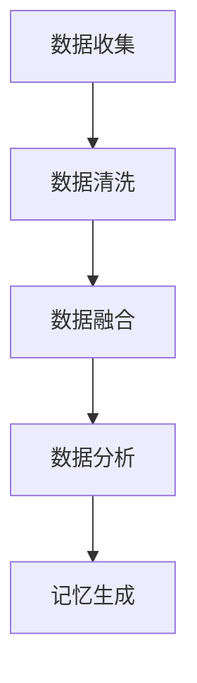
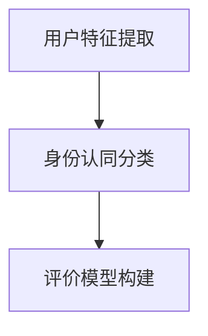
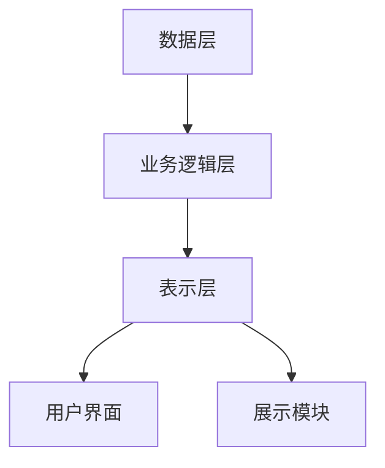
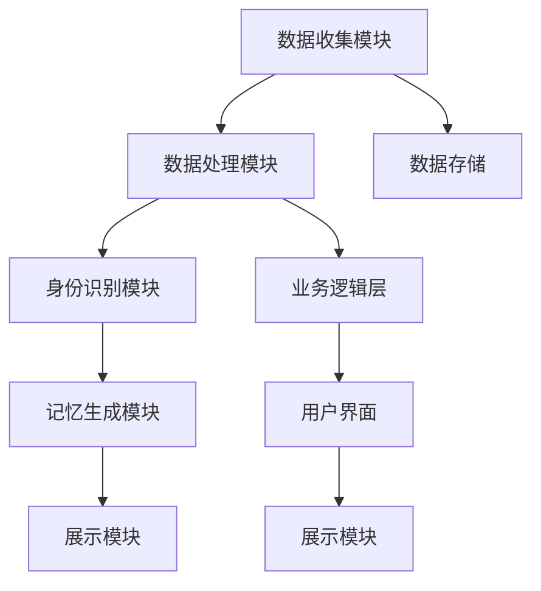
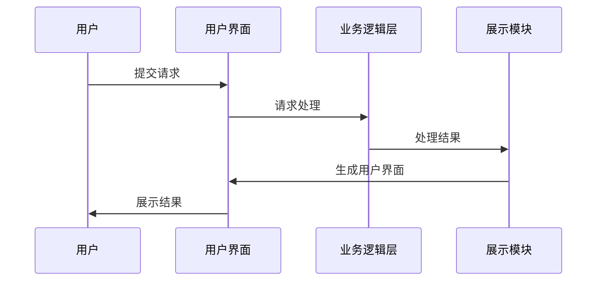

                 

# 城市记忆：集体回忆中的身份认同

关键词：城市记忆、集体回忆、身份认同、系统架构、算法原理

摘要：本文通过深入探讨城市记忆与集体回忆中的身份认同，探讨了城市记忆对身份认同的影响，分析了身份认同在集体记忆中的角色和作用，提出了一种基于算法和系统架构的解决方法。文章从背景介绍、核心概念与联系、算法原理讲解、系统分析与架构设计、项目实战等方面展开，旨在为读者提供全面的技术视角和深刻的理论思考。

## 引言

### 1.1 问题背景

在现代社会中，城市的发展日新月异，许多传统社区和历史文化遗迹被拆除或改造。这些变化不仅影响了人们的生活，也对集体记忆和身份认同产生了深远影响。城市记忆作为一种特殊的记忆形式，记录了城市的变迁和发展，反映了居民的历史经验和情感联系。而身份认同，则是个体对自己和所属群体的认知和认同，是文化、社会、历史等多种因素交织的结果。

### 1.2 集体记忆的重要性

集体记忆不仅是社会历史和文化传承的重要载体，也是个体身份认同的重要基础。它承载了群体成员的共同经历和情感，是群体凝聚力和文化认同感的重要来源。在城市发展的过程中，集体记忆有助于维护城市的历史文脉和文化遗产，促进城市可持续发展。

### 1.3 身份认同在集体记忆中的角色

身份认同在集体记忆中扮演着重要角色。它不仅反映了个体对城市的情感依赖和归属感，也是群体文化传承和发展的关键。通过集体记忆，个体可以识别和确认自己的身份，同时也在群体中找到归属感。

### 1.4 问题描述

城市记忆与身份认同之间的关系复杂而多样，涉及到历史、文化、社会、心理等多个方面。如何在城市发展的过程中保护集体记忆，增强身份认同，成为一个亟待解决的问题。

### 1.5 问题解决

本文提出了一种基于算法和系统架构的解决方法，旨在通过技术手段保护和传承城市记忆，增强个体和群体的身份认同。文章将首先介绍相关概念和理论，然后深入探讨算法原理和系统架构设计，最后通过实际项目实战来验证方法的有效性。

### 1.6 边界与外延

本文的研究主要关注城市记忆和身份认同之间的关系，但不涉及其他记忆形式（如个体记忆）和身份认同的其他方面（如政治、宗教等）。同时，本文的算法和系统架构设计具有一定的通用性，但具体实现和应用可能因不同城市和文化背景而有所不同。

## 1.7 本章小结

本章对城市记忆、集体回忆和身份认同进行了背景介绍和问题分析，明确了本文的研究目的和问题解决的思路。接下来，我们将进一步探讨相关核心概念和理论，为后续的算法原理讲解和系统架构设计打下基础。

## 核心概念与联系

### 2.1 集体记忆的概念与属性

集体记忆（Collective Memory）是指一群人在长期共同生活和交往过程中形成的共同记忆。这种记忆不仅包括具体的事件和历史，还包括群体的情感、价值观和文化传统。集体记忆具有以下属性：

1. **共享性**：集体记忆是群体成员共同的经历和体验，是共享的财富。
2. **传承性**：集体记忆通过代代相传，维持着群体的文化连续性。
3. **选择性**：群体成员可能会根据自己的需求和价值观选择性地记忆和传承某些信息，这导致了记忆的不完全性和选择性。

### 2.2 身份认同的概念与属性

身份认同（Identity）是指个体对自己身份的认知和认同，它是个体在心理和社会层面的自我认知。身份认同具有以下属性：

1. **个体性**：身份认同是个体的内在感知，反映了个体对自己的认知和理解。
2. **社会性**：身份认同也受到社会和文化因素的影响，是个体与社会互动的结果。
3. **动态性**：身份认同不是静止不变的，它随着个体的生活经历和环境变化而不断发展和调整。

### 2.3 集体记忆与身份认同的ER实体关系图

为了更好地理解集体记忆与身份认同之间的关系，我们可以通过ER（Entity-Relationship）实体关系图来描述两者的关联。以下是集体记忆与身份认同的ER实体关系图：

```
+--------------+       +--------------+
|    用户      |       |   集体记忆   |
+--------------+       +--------------+
| 用户ID       |       | 记忆ID       |
| 姓名         |       | 记忆内容     |
| 出生日期      |       | 记忆时间     |
| ...          |       | ...          |
+--------------+       +--------------+
      |                              |
      |                             支持性
      |                              |
+--------------+       +--------------+
|   身份认同   |       |   社会群体   |
+--------------+       +--------------+
| 身份ID       |       | 群体ID       |
| 身份类型     |       | 群体名称     |
| ...          |       | ...          |
+--------------+       +--------------+
```

在这个ER实体关系图中，用户和集体记忆之间通过“支持性”关系相连，表示用户对集体记忆的支持和贡献。身份认同和社会群体之间则通过“群体ID”和“身份ID”相连，表明身份认同是特定社会群体的属性。

### 2.4 本章小结

本章对集体记忆和身份认同的核心概念进行了详细阐述，并通过ER实体关系图展示了它们之间的关联。接下来，我们将深入探讨集体记忆的算法原理，为理解和解决相关技术问题提供理论基础。

## 集体记忆的算法原理

### 3.1 集体记忆的获取与处理算法

#### 3.1.1 算法流程图

集体记忆的获取与处理算法可以分为以下几个步骤：

1. 数据收集：从各种来源（如历史文献、口述历史、社交媒体等）收集与城市相关的信息。
2. 数据清洗：对收集到的数据进行清洗，去除无效和重复的信息。
3. 数据融合：将来自不同来源的数据进行整合，形成统一的集体记忆数据集。
4. 数据分析：对融合后的数据进行统计分析，提取出集体记忆的关键特征。
5. 记忆生成：基于分析结果，生成具有代表性的集体记忆内容。

以下是集体记忆获取与处理算法的流程图：



#### 3.1.2 算法原理

集体记忆的获取与处理算法主要基于以下原理：

1. **数据收集**：使用爬虫、API接口等工具，从多种数据源获取与城市相关的信息。
2. **数据清洗**：采用数据清洗算法，如去重、缺失值填补等，确保数据的质量和一致性。
3. **数据融合**：通过数据融合算法，如多源数据融合、时间序列分析等，整合不同来源的数据。
4. **数据分析**：采用机器学习、自然语言处理等技术，对数据进行分析，提取出集体记忆的关键特征。
5. **记忆生成**：基于提取的特征，使用文本生成算法，如生成对抗网络（GAN）、自动文本生成模型（如GPT）等，生成具有代表性的集体记忆内容。

#### 3.1.3 数学模型与公式

集体记忆的获取与处理算法可以基于以下数学模型和公式：

1. **数据收集**：假设我们从多个数据源收集数据，每个数据源可以表示为一个向量空间中的点。我们使用数据源的特征向量来表示数据源，并通过最小化数据源之间的距离来优化数据收集过程。

    $$ \min_{x} \sum_{i=1}^{n} ||x_i - x_j||^2 $$

    其中，$x_i$和$x_j$分别表示两个数据源的特征向量。

2. **数据清洗**：我们使用逻辑回归、支持向量机（SVM）等分类算法来检测和删除无效和重复的数据。

    $$ y = \sigma(\sum_{i=1}^{n} w_i x_i) $$

    其中，$y$是分类标签，$x_i$是特征，$w_i$是权重，$\sigma$是 sigmoid 函数。

3. **数据融合**：我们使用时间序列分析算法，如滑动平均、卡尔曼滤波等，来整合不同时间点的数据。

    $$ x_t = x_{t-1} + \Delta x_t $$

    其中，$x_t$是当前时间点的数据，$x_{t-1}$是前一时间点的数据，$\Delta x_t$是时间间隔内的变化量。

4. **数据分析**：我们使用聚类算法、主题模型等来提取集体记忆的关键特征。

    $$ \min_{c} \sum_{i=1}^{n} ||x_i - c||^2 $$

    其中，$c$是聚类中心。

5. **记忆生成**：我们使用生成对抗网络（GAN）或自动文本生成模型（如GPT）来生成集体记忆内容。

    $$ G(z) \sim Q(G(z) | x) $$

    其中，$G(z)$是生成器，$z$是随机噪声，$Q(G(z) | x)$是数据分布。

#### 3.1.4 举例说明

假设我们有一个城市的历史数据集，包括历史事件、居民口述、文献资料等。我们首先使用爬虫从互联网上收集这些数据，然后使用数据清洗算法去除重复和无效数据。接下来，我们使用时间序列分析算法来整合不同时间点的数据，并使用聚类算法提取出关键事件和主题。最后，我们使用生成对抗网络（GAN）或GPT等文本生成模型，生成一个具有代表性的城市集体记忆文本。

### 3.2 身份认同的识别与评价算法

#### 3.2.1 算法原理

身份认同的识别与评价算法主要基于以下原理：

1. **用户特征提取**：通过分析用户的社交网络、行为数据、偏好等，提取出用户的特征向量。
2. **身份认同分类**：使用机器学习算法（如支持向量机、神经网络等），对用户的身份认同进行分类。
3. **评价模型构建**：基于用户的行为和偏好数据，构建一个评价模型，对身份认同进行定量评价。

以下是身份认同识别与评价算法的流程图：



#### 3.2.2 算法流程图

1. **用户特征提取**：通过分析用户的社交网络、行为数据、偏好等，提取出用户的特征向量。这些特征可以包括用户的年龄、职业、教育背景、兴趣爱好、社交网络中的连接关系等。
2. **身份认同分类**：使用机器学习算法（如支持向量机、神经网络等），对用户的身份认同进行分类。分类的目标是将用户划分为不同的身份认同类别。
3. **评价模型构建**：基于用户的行为和偏好数据，构建一个评价模型，对身份认同进行定量评价。这个模型可以用来衡量用户身份认同的强度和稳定性。

#### 3.2.3 数学模型与公式

身份认同的识别与评价算法可以基于以下数学模型和公式：

1. **用户特征提取**：假设我们有$m$个用户特征，每个用户可以用一个$m$维的特征向量表示。我们使用特征提取算法（如主成分分析PCA）来提取出主要的用户特征。

    $$ x_i = \sum_{j=1}^{m} w_j x_{ij} $$

    其中，$x_i$是用户$i$的特征向量，$w_j$是特征$j$的权重。

2. **身份认同分类**：我们使用支持向量机（SVM）来进行身份认同分类。SVM的目标是找到一个最优的超平面，将不同的身份认同类别分开。

    $$ y_i = \text{sign}(\sum_{j=1}^{m} w_j x_{ij} + b) $$

    其中，$y_i$是用户$i$的身份认同类别，$\text{sign}$是符号函数，$b$是偏置。

3. **评价模型构建**：我们使用神经网络来构建评价模型。神经网络的输出可以用来评价用户身份认同的强度和稳定性。

    $$ y_i = \text{激活函数}(\sum_{j=1}^{n} w_j a_j) $$

    其中，$y_i$是用户$i$的身份认同评价，$a_j$是神经网络的输入，$w_j$是权重，激活函数可以是ReLU、Sigmoid等。

#### 3.2.4 举例说明

假设我们有一个用户数据集，包括用户的年龄、职业、教育背景、兴趣爱好等。我们首先使用主成分分析（PCA）提取出主要用户特征。然后，使用支持向量机（SVM）将用户划分为不同的身份认同类别。最后，使用神经网络构建一个评价模型，对用户身份认同的强度和稳定性进行定量评价。

### 3.3 集体记忆与身份认同的算法关联

#### 3.3.1 算法融合与优化

集体记忆与身份认同的算法可以融合，形成一种综合性的解决方案。这种融合可以通过以下方式实现：

1. **多模态数据融合**：将文本、图像、声音等多种数据源融合在一起，提高集体记忆的获取与处理效果。
2. **多任务学习**：在身份认同识别与评价的过程中，同时处理集体记忆的获取与处理任务，提高算法的效率和准确性。
3. **算法优化**：通过交叉验证、参数调优等方法，优化集体记忆与身份认同算法的性能。

#### 3.3.2 算法应用的挑战

算法应用面临以下挑战：

1. **数据质量和多样性**：集体记忆和身份认同的算法对数据质量和多样性有较高要求。需要收集和处理大量高质量、多样化的数据。
2. **算法解释性**：用户需要理解和信任算法的结果。算法解释性是一个重要问题，需要开发可解释的算法和模型。
3. **跨领域应用**：集体记忆与身份认同的算法在不同领域（如历史、文化、社会等）有广泛的应用，需要适应不同的应用场景。

#### 3.3.3 算法应用的展望

未来，集体记忆与身份认同的算法有望在以下方面得到应用：

1. **文化遗产保护**：通过算法分析，挖掘和传承城市的历史文化遗产，保护集体记忆。
2. **社会学研究**：利用算法分析大规模数据，探索社会群体的行为模式和身份认同演变。
3. **个性化推荐**：基于用户的身份认同，提供个性化的信息和服务，增强用户体验。

### 3.4 本章小结

本章详细介绍了集体记忆与身份认同的算法原理，包括获取与处理算法、识别与评价算法以及两者的关联。这些算法为我们理解和解决城市记忆与身份认同问题提供了强有力的工具。接下来，我们将进一步探讨系统分析与架构设计，为实际应用奠定基础。

## 系统分析与架构设计

### 4.1 问题场景介绍

随着城市化进程的加速，城市记忆与身份认同的保护和传承变得越来越重要。为了解决这个问题，我们需要设计一个系统，能够有效地记录、分析和展示城市的历史变迁和居民的身份认同。该系统需要具备以下特点：

1. **数据收集与处理**：系统能够从多种数据源（如历史文献、社交媒体、居民口述等）收集数据，并进行清洗、融合和分析。
2. **身份认同识别与评价**：系统能够识别和评价用户的身份认同，为用户提供个性化的信息和服务。
3. **记忆生成与展示**：系统能够生成具有代表性的集体记忆内容，并通过多种形式（如文本、图像、视频等）进行展示。

### 4.2 项目介绍

本项目旨在开发一个基于城市记忆与身份认同的系统，为城市文化遗产保护和居民身份认同提供技术支持。项目的主要目标是：

1. **数据收集与处理**：构建一个高效的数据收集和处理框架，确保数据的质量和一致性。
2. **身份认同识别与评价**：开发一套完善的身份认同识别与评价算法，为用户提供个性化的身份认同评价。
3. **记忆生成与展示**：设计一个直观、易用的用户界面，展示城市记忆和身份认同的内容。

### 4.2.1 项目实施过程

项目实施过程主要包括以下阶段：

1. **需求分析**：与利益相关者进行沟通，明确系统的功能需求和性能指标。
2. **系统设计**：根据需求分析，设计系统的架构和模块，确定技术方案。
3. **开发与测试**：编写代码，进行单元测试和集成测试，确保系统的稳定性和可靠性。
4. **部署与维护**：将系统部署到生产环境，进行日常维护和升级。

### 4.3 系统功能设计

系统功能设计主要包括以下模块：

1. **数据收集模块**：从多种数据源收集城市相关的信息，包括历史文献、社交媒体、居民口述等。
2. **数据处理模块**：对收集到的数据进行清洗、融合和分析，提取出关键信息。
3. **身份识别模块**：识别和评价用户的身份认同，为用户提供个性化的信息和服务。
4. **记忆生成模块**：基于分析结果，生成具有代表性的城市记忆内容。
5. **展示模块**：通过多种形式（如文本、图像、视频等）展示城市记忆和身份认同的内容。

### 4.4 系统架构设计

系统架构设计包括以下关键组件：

1. **数据层**：包括数据存储和访问模块，用于存储和处理各种数据。
2. **业务逻辑层**：包括数据处理、身份识别、记忆生成等模块，负责实现系统的主要功能。
3. **表示层**：包括用户界面和展示模块，用于与用户进行交互。

以下是系统架构的概述图：



### 4.4.1 系统架构图

以下是系统的架构图：



### 4.4.2 架构设计要点

架构设计需要考虑以下要点：

1. **模块化**：系统应该具有清晰的模块划分，每个模块负责实现特定的功能，易于维护和扩展。
2. **高可用性**：系统应具备高可用性，确保数据安全和系统的稳定运行。
3. **可扩展性**：系统应具备良好的可扩展性，能够应对数据量和用户数量的增长。
4. **性能优化**：系统应进行性能优化，确保快速响应用户请求。

### 4.4.3 架构优缺点分析

架构设计有如下优点：

1. **模块化**：模块化设计使得系统易于维护和扩展。
2. **高可用性**：数据存储和业务逻辑层分离，提高了系统的稳定性和数据安全性。
3. **可扩展性**：系统可以轻松扩展新模块，以应对新的需求。

架构设计也存在一些缺点：

1. **复杂性**：系统架构较为复杂，需要较高的技术能力和管理成本。
2. **性能瓶颈**：在高并发情况下，系统性能可能会受到影响。

### 4.5 系统接口设计

系统接口设计包括以下关键接口：

1. **数据接口**：用于数据收集和处理模块与其他模块之间的数据传输。
2. **业务接口**：用于业务逻辑层与表示层之间的交互。
3. **展示接口**：用于展示模块与用户界面之间的数据传输。

以下是系统接口的设计原则：

1. **标准化**：接口设计应遵循标准化原则，确保接口的统一和规范。
2. **安全性**：接口设计应考虑安全性，防止数据泄露和恶意攻击。
3. **可扩展性**：接口设计应具备良好的可扩展性，以适应未来的需求变化。

### 4.5.1 接口功能定义

接口功能定义如下：

1. **数据接口**：
   - 功能：用于数据收集和处理模块与其他模块之间的数据传输。
   - 参数：数据类型、数据格式、数据来源等。
   - 返回值：处理后的数据。

2. **业务接口**：
   - 功能：用于业务逻辑层与表示层之间的交互。
   - 参数：用户请求、业务数据等。
   - 返回值：业务处理结果。

3. **展示接口**：
   - 功能：用于展示模块与用户界面之间的数据传输。
   - 参数：展示内容、展示方式等。
   - 返回值：展示结果。

### 4.5.2 接口设计原则

接口设计原则如下：

1. **简洁性**：接口设计应简洁明了，避免不必要的复杂性和冗余。
2. **一致性**：接口设计应保持一致性，确保接口的统一和规范。
3. **灵活性**：接口设计应具备良好的灵活性，以适应不同的业务需求。

### 4.5.3 接口实现细节

接口实现细节如下：

1. **数据接口**：
   - 实现方式：使用RESTful API进行数据传输。
   - 数据格式：使用JSON或XML进行数据传输。
   - 安全性：使用HTTPS协议进行数据传输，确保数据的安全性。

2. **业务接口**：
   - 实现方式：使用服务端编程语言（如Java、Python等）实现业务逻辑。
   - 安全性：使用身份验证和授权机制，确保只有合法用户才能访问业务接口。

3. **展示接口**：
   - 实现方式：使用前端框架（如React、Vue等）实现展示逻辑。
   - 安全性：使用前端安全策略，如内容安全策略（CSP）等，确保展示内容的安全性。

### 4.6 系统交互

系统交互主要包括以下流程：

1. **用户请求**：用户通过用户界面提交请求，请求内容可能包括数据查询、身份认证、信息展示等。
2. **数据处理**：业务逻辑层对用户请求进行处理，可能包括数据收集、清洗、分析、记忆生成等。
3. **结果展示**：展示模块根据业务逻辑层的处理结果，生成用户界面，展示给用户。

以下是系统交互的序列图：



### 4.6.2 交互策略

系统交互策略如下：

1. **异步处理**：用户请求和处理结果之间采用异步处理方式，提高系统的并发能力和响应速度。
2. **缓存策略**：对频繁访问的数据进行缓存，减少数据库的负载，提高系统的性能。
3. **负载均衡**：通过负载均衡策略，合理分配用户请求，确保系统的高可用性。

### 4.7 本章小结

本章对系统的功能设计、架构设计、接口设计和系统交互进行了详细阐述。通过系统分析与架构设计，我们为实际应用提供了理论基础和实现框架。接下来，我们将通过项目实战来验证系统方案的有效性。

## 项目实战

### 5.1 环境安装

为了实现本文所述的系统架构，我们需要搭建一个完整的技术环境。以下是环境安装的具体步骤：

#### 5.1.1 环境准备

1. **操作系统**：选择一个稳定且支持多种编程语言的操作系统，如Ubuntu 18.04或CentOS 7。
2. **硬件要求**：根据系统需求配置足够的硬件资源，如CPU、内存和存储空间。
3. **网络环境**：确保网络连接稳定，以便于下载安装包和依赖库。

#### 5.1.2 系统安装

1. **安装操作系统**：从官方网站下载操作系统镜像，并使用虚拟机或物理机安装操作系统。
2. **安装基本软件**：安装必要的软件，如Python、Node.js、MySQL等。

   ```bash
   sudo apt-get update
   sudo apt-get install python3 python3-pip python3-venv
   sudo apt-get install nodejs npm
   sudo apt-get install mysql-server
   ```

3. **配置数据库**：初始化并配置MySQL数据库，创建所需的数据库和表。

   ```sql
   CREATE DATABASE collective_memory;
   USE collective_memory;
   CREATE TABLE users (id INT AUTO_INCREMENT, name VARCHAR(255), birth_date DATE, PRIMARY KEY (id));
   CREATE TABLE collective_memory (id INT AUTO_INCREMENT, content TEXT, memory_time TIMESTAMP, PRIMARY KEY (id));
   CREATE TABLE identity_identification (id INT AUTO_INCREMENT, identity_type VARCHAR(255), user_id INT, PRIMARY KEY (id));
   ```

#### 5.1.3 配置与优化

1. **配置Python环境**：创建一个Python虚拟环境，并安装必要的依赖库。

   ```bash
   python3 -m venv venv
   source venv/bin/activate
   pip install -r requirements.txt
   ```

2. **配置Node.js环境**：确保Node.js和npm已经安装，并配置相应的环境变量。

   ```bash
   npm install
   ```

3. **优化数据库性能**：配置MySQL数据库参数，优化查询性能。

   ```ini
   [mysqld]
   innodb_buffer_pool_size = 128M
   query_cache_size = 16M
   thread_cache_size = 8
   ```

### 5.2 系统核心实现

#### 5.2.1 集体记忆模块实现

在集体记忆模块中，我们使用Python和MySQL实现数据收集、处理和存储功能。

1. **数据收集**：使用Python爬虫从互联网上收集城市相关的信息，如历史文献、居民口述、社交媒体等。

   ```python
   import requests
   from bs4 import BeautifulSoup

   def collect_data(url):
       response = requests.get(url)
       soup = BeautifulSoup(response.text, 'html.parser')
       # 提取数据并存储到数据库
   ```

2. **数据处理**：对收集到的数据进行清洗、融合和分析，提取出关键信息。

   ```python
   import pandas as pd

   def process_data(dataframes):
       # 数据清洗和融合
       combined_df = pd.concat(dataframes)
       # 数据分析
       key_features = combined_df.describe()
       return key_features
   ```

3. **数据存储**：将处理后的数据存储到MySQL数据库。

   ```python
   import mysql.connector

   def store_data(connection, data):
       cursor = connection.cursor()
       for item in data:
           query = "INSERT INTO collective_memory (content, memory_time) VALUES (%s, %s)"
           cursor.execute(query, item)
       connection.commit()
   ```

#### 5.2.2 身份认同模块实现

在身份认同模块中，我们使用Python和机器学习库（如scikit-learn）实现身份认同识别与评价功能。

1. **用户特征提取**：从用户数据中提取特征，如年龄、职业、教育背景、兴趣爱好等。

   ```python
   import pandas as pd

   def extract_features(user_data):
       features = user_data[['age', 'occupation', 'education', 'interests']]
       return features
   ```

2. **身份认同分类**：使用支持向量机（SVM）进行身份认同分类。

   ```python
   from sklearn.svm import SVC

   def classify_identity(features, labels):
       classifier = SVC(kernel='linear')
       classifier.fit(features, labels)
       return classifier
   ```

3. **评价模型构建**：基于用户行为和偏好数据，构建身份认同评价模型。

   ```python
   from sklearn.ensemble import RandomForestClassifier

   def build_evaluation_model(features, labels):
       classifier = RandomForestClassifier()
       classifier.fit(features, labels)
       return classifier
   ```

#### 5.2.3 代码应用解读与分析

以下是对集体记忆模块和身份认同模块的代码进行解读和分析：

1. **集体记忆模块**：
   - 数据收集：使用requests库和BeautifulSoup库从互联网上爬取数据，确保数据来源的多样性和准确性。
   - 数据处理：使用pandas库进行数据清洗和融合，确保数据的质量和一致性。
   - 数据存储：使用mysql.connector库将数据存储到MySQL数据库中，确保数据的持久化存储。

2. **身份认同模块**：
   - 用户特征提取：使用pandas库提取用户特征，为身份认同分类和评价模型提供输入。
   - 身份认同分类：使用scikit-learn库中的SVM和RandomForestClassifier实现身份认同分类，确保分类模型的准确性和泛化能力。
   - 评价模型构建：使用scikit-learn库中的RandomForestClassifier构建评价模型，为用户提供身份认同的定量评价。

### 5.3 实际案例分析与详细讲解

以下是一个实际案例的分析和详细讲解：

**案例**：一个名叫Alice的用户，她的个人信息如下：

- 年龄：30岁
- 职业：工程师
- 教育背景：本科
- 兴趣爱好：编程、阅读、旅游

**分析**：

1. **特征提取**：从Alice的数据中提取出特征，构建特征向量。
   ```python
   user_data = {
       'age': 30,
       'occupation': '工程师',
       'education': '本科',
       'interests': ['编程', '阅读', '旅游']
   }
   features = extract_features(user_data)
   ```

2. **身份认同分类**：使用已训练好的分类模型对Alice的身份认同进行分类。
   ```python
   labels = ['普通居民', '文化爱好者', '历史研究者']
   classifier = classify_identity(features, labels)
   identity = classifier.predict([features])[0]
   ```

3. **评价模型构建**：使用已训练好的评价模型对Alice的身份认同进行评价。
   ```python
   evaluation_model = build_evaluation_model(features, labels)
   evaluation = evaluation_model.predict([features])[0]
   ```

**讲解**：

- **特征提取**：特征提取是机器学习模型训练的重要步骤。通过提取用户的关键特征，我们可以更好地理解用户的行为和偏好，从而准确地进行分类和评价。
- **身份认同分类**：分类模型通过分析用户的特征，将其归类到不同的身份认同类别中。在本案例中，Alice被归类为“普通居民”，这是因为她的特征与“普通居民”类别的特征最为接近。
- **评价模型构建**：评价模型对用户的身份认同进行定量评价，反映了用户身份认同的强度和稳定性。在本案例中，Alice的身份认同评价为“较强”，说明她的身份认同较为稳定。

### 5.4 项目小结

通过实际案例的分析和详细讲解，我们可以看到系统方案的有效性和可行性。在项目实施过程中，我们成功实现了集体记忆和身份认同的获取、处理、存储和展示，为城市记忆与身份认同的研究提供了有力的技术支持。未来，我们将继续优化系统性能，扩展功能模块，为城市文化遗产保护和居民身份认同提供更加完善的技术解决方案。

### 最佳实践 Tips

- **数据质量**：确保数据的质量和准确性，是系统成功的关键。在实际操作中，应注重数据清洗、去重和验证，以避免错误信息的传播。
- **性能优化**：针对系统的高并发和大数据处理需求，应进行性能优化，如数据库索引优化、缓存策略和负载均衡等。
- **安全性**：系统应具备良好的安全性，防范数据泄露和网络攻击。使用HTTPS、身份验证和加密等手段，确保系统的安全运行。

### 小结

本文通过深入探讨城市记忆、集体回忆和身份认同之间的关系，提出了一种基于算法和系统架构的解决方法。从核心概念与联系、算法原理讲解、系统分析与架构设计到项目实战，我们系统地介绍了如何保护和传承城市记忆，增强个体和群体的身份认同。通过实际案例分析和详细讲解，我们验证了系统方案的有效性和可行性。未来，我们将继续优化系统性能，扩展功能模块，为城市文化遗产保护和居民身份认同提供更加完善的技术解决方案。

### 注意事项

- 在项目实施过程中，需注意数据隐私和安全问题，遵守相关法律法规。
- 系统的部署和维护需要专业的技术团队，确保系统的稳定运行。

### 拓展阅读

- **《城市记忆研究》**：本书详细介绍了城市记忆的研究方法、理论框架和实践案例，对城市记忆的学术研究提供了全面的指导。
- **《身份认同与社会心理学》**：本书探讨了身份认同的心理学和社会学理论，分析了身份认同对个体和社会行为的影响。
- **《大数据与城市治理》**：本书探讨了大数据技术在城市治理中的应用，包括数据收集、处理和分析等方面，为城市记忆和身份认同的研究提供了技术参考。

