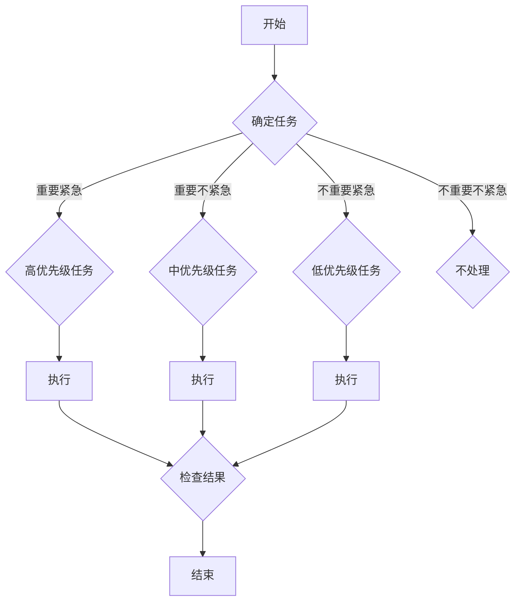
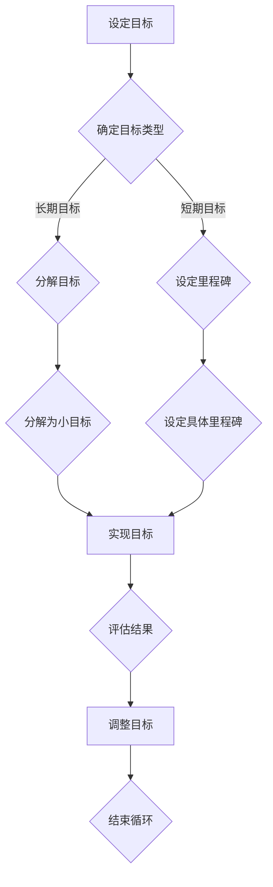
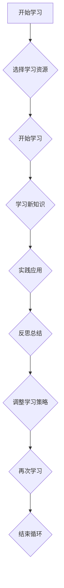
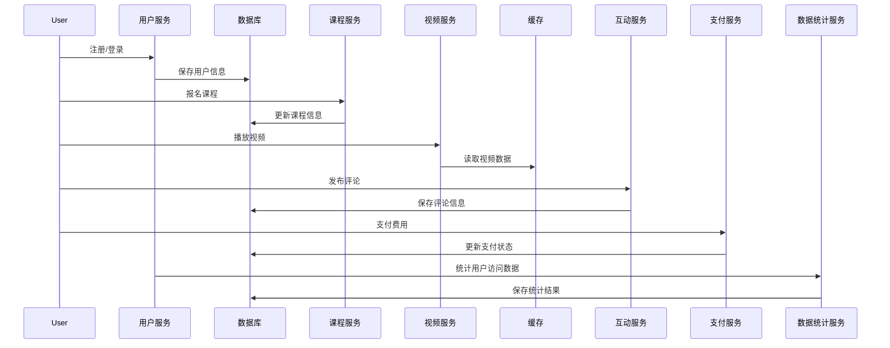
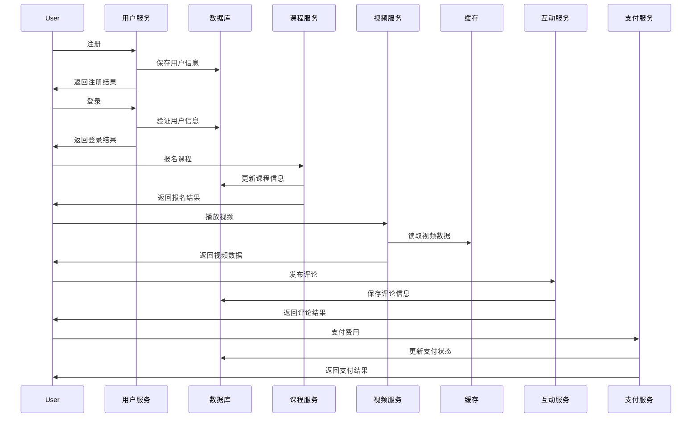

                 

### 文章标题：培养应对变化的能力：提高生存的适应性

> 关键词：变化应对、适应性、生存能力、技术学习、持续发展

> 摘要：本文深入探讨了在快速变化的社会和技术环境中，如何培养个人应对变化的能力，以提高生存的适应性。文章从背景介绍、核心概念与联系、算法原理讲解、数学模型和公式应用、系统分析与架构设计、项目实战以及最佳实践与拓展等多个角度，提供了一套完整的技术方法论和实践指南。

----------------------------------------------------------------

### 目录大纲设计思路

在设计《培养应对变化的能力：提高生存的适应性》这本书的目录大纲时，我们首先明确了书籍的核心主题和目标受众。本书主要围绕如何在快速变化的环境中提高个人的生存能力和适应能力展开，目标受众包括职场人士、学生以及对自我提升有需求的读者。

为了确保书籍的目录大纲结构清晰、内容丰富，我们采取了以下步骤：

1. **背景介绍**：通过第一章，介绍变化的普遍性及其对个人和社会的影响，为后续章节的学习打下基础。
2. **核心概念与联系**：在第二章，深入探讨应对变化的核心概念，如适应性、灵活性、学习能力和危机管理，并通过表格和ER图展示这些概念之间的联系。
3. **算法原理讲解**：第三章介绍实用的策略和技巧，如时间管理、目标设定和持续学习等，使用mermaid流程图和Python代码阐述其原理和应用。
4. **数学模型和公式应用**：第四章通过介绍数学工具，如概率论、统计学和决策理论等，使用LaTeX格式展示相关公式，并举例说明。
5. **系统分析与架构设计方案**：第五章探讨如何将上述概念和技巧应用于实际项目中，通过系统分析和架构设计来提高系统的适应性和灵活性。
6. **项目实战**：第六章通过实际案例，详细展示如何应用这些方法和工具来解决具体问题，并提供源代码和应用解读。
7. **最佳实践与拓展**：第七章总结书中的关键知识点，提供最佳实践建议，并引导读者进行进一步的学习和探索。

通过这些步骤，我们确保书籍的目录大纲既结构清晰又内容丰富，帮助读者系统地提升应对变化的能力。

### 第一部分：背景介绍

#### 第1章：变化的普遍性

##### 1.1 引言

在当今社会，变化已成为不可避免的现象。科技领域的快速进步、经济环境的波动以及个人成长中的各种变化，使得每个人都必须面对不断变化的环境。这种变化不仅仅体现在外部世界，也深深影响了我们的内心世界。因此，如何应对变化，成为了我们生存和发展的关键。

##### 1.2 变化的来源

1.2.1 社会变革

社会的快速变革是变化的主要来源之一。全球化、数字化和信息化的加速推进，带来了前所未有的机遇和挑战。新兴技术的出现，如人工智能、区块链、物联网等，正在深刻改变我们的生活方式和工作方式。社会结构和价值观也在不断变革，传统的工作模式和家庭模式受到挑战。

1.2.2 经济波动

经济环境的波动和不确定性也是变化的重要来源。全球经济一体化导致市场波动更加频繁，企业需要迅速适应市场变化，以保持竞争力。同时，经济周期、行业转型和政策变化等因素，也可能导致个人就业机会的减少或工作环境的变化。

1.2.3 个人成长

个人的成长过程中，也会面临各种变化。从学习新技能到适应新环境，从建立人际关系到处理个人问题，变化无处不在。这些变化不仅带来了机遇，也带来了挑战。个人需要不断调整自己的心态和行为，以适应新的情况。

##### 1.3 变化对个人的影响

1.3.1 职业生涯

在职业生涯中，变化意味着可能需要不断学习新技能、适应新的工作环境和管理风格。不适应变化可能导致职业发展的停滞或失业。因此，具备应对变化的能力，对于职业发展至关重要。

1.3.2 个人生活

生活中的变化，如家庭责任、子女教育和健康问题等，也需要个人具备应对变化的适应能力。这些变化可能会对个人的心理和生理健康造成影响，因此，如何应对这些变化，也是个人生存能力的重要方面。

##### 1.4 培养应对变化的重要性

1.4.1 提升竞争力

在快速变化的环境中，具备应对变化的能力是提升个人竞争力的关键。能够迅速适应新环境和变化的人，更有可能在职场和生活中脱颖而出。

1.4.2 提高生活质量

有效应对变化不仅能提高职业发展，还能提高生活质量。通过培养适应能力，个人能够更好地应对生活中的各种挑战，从而拥有更加平静和满足的生活。

1.4.3 增强心理韧性

面对变化，具备较强的适应能力意味着个人能够更好地应对压力和挑战，从而增强心理韧性。这种韧性对于个人的长期发展至关重要。

##### 1.5 本章小结

本章介绍了变化的普遍性及其对个人和社会的影响。通过了解这些，读者可以认识到培养应对变化能力的重要性，并为后续章节的学习打下基础。

### 第二部分：核心概念与联系

#### 第2章：应对变化的策略与工具

##### 2.1 引言

在了解了变化的普遍性和对个人影响的背景下，本章将深入探讨应对变化的核心策略与工具。这些策略与工具不仅是应对变化的必要手段，更是提升个人适应能力和生存能力的基石。通过系统性地学习和实践这些策略与工具，读者可以更加从容地面对未来的变化。

##### 2.2 适应性

2.2.1 定义与重要性

适应性（Adaptability）是指个体或组织在面对外部环境变化时，能够迅速调整自身行为和策略以适应新情况的能力。在快速变化的环境中，适应性成为衡量个体或组织生存能力的重要指标。适应性包括以下几个方面：

- **灵活性（Flexibility）**：在变化中快速调整和适应的能力。
- **敏捷性（Agility）**：快速响应变化并采取行动的能力。
- **弹性（Resilience）**：在面对挫折和变化时能够快速恢复的能力。

2.2.2 适应性策略

- **预见性**：通过观察和分析，提前预见到潜在的变化，并制定应对策略。
- **适应性学习**：不断学习新知识、新技能，以适应环境的变化。
- **情境适应**：在不同情境下灵活调整行为和策略，以获得最佳结果。

##### 2.3 灵活性

2.3.1 定义与作用

灵活性（Flexibility）是指个体在面对不确定性时，能够迅速调整计划和行为，以适应新的情况或目标的能力。灵活性对于应对变化至关重要，因为它允许个体在不稳定的环境中保持弹性和可持续性。灵活性包括以下几个方面：

- **决策灵活性**：在面对不同选择时，能够迅速做出决策。
- **工作灵活性**：在时间和地点上对工作的灵活安排。
- **沟通灵活性**：在不同文化和背景中有效沟通和协作。

##### 2.4 学习能力

2.4.1 定义与重要性

学习能力（Learning Ability）是指个体或组织通过获取、整合和应用知识，以适应新环境和实现目标的能力。在快速变化的环境中，学习能力成为个人和组织保持竞争力的关键。学习能力包括以下几个方面：

- **知识获取**：主动获取新知识和信息。
- **知识整合**：将新知识和已有知识整合，形成新的理解和能力。
- **知识应用**：将所学知识应用到实际问题中。

##### 2.5 危机管理

2.5.1 定义与作用

危机管理（Crisis Management）是指组织或个体在面对突发事件或危机时，采取的一系列应急措施和策略，以减轻或消除危机影响。危机管理对于应对不可预见的变化至关重要。危机管理包括以下几个方面：

- **预防**：通过风险评估和预防措施，降低危机发生的概率。
- **响应**：在危机发生时，迅速采取行动，控制事态发展。
- **恢复**：在危机后，进行恢复和重建工作，以恢复正常运营。

##### 2.6 核心概念与联系

表1：核心概念属性特征对比表格

| 核心概念 | 定义 | 属性特征 | 对比分析 |
|----------|------|----------|----------|
| 适应性 | 快速调整行为和策略 | 灵活性、敏捷性、弹性 | 与灵活性相比，适应性更注重长期生存能力 |
| 灵活性 | 快速调整计划和行动 | 决策灵活性、工作灵活性、沟通灵活性 | 与适应性相比，灵活性更注重短期应对能力 |
| 学习能力 | 获取、整合和应用知识 | 知识获取、知识整合、知识应用 | 与危机管理相比，学习能力更注重知识积累和应用 |
| 危机管理 | 应对突发事件和危机 | 预防、响应、恢复 | 与适应性相比，危机管理更注重应急处理能力 |

图1：核心概念ER实体关系图

```mermaid
erDiagram
  Adaptability ||--|{ Flexibility }
  Adaptability ||--|{ Agility }
  Adaptability ||--|{ Resilience }
  Flexibility ||--|{ Decision Flexibility }
  Flexibility ||--|{ Work Flexibility }
  Flexibility ||--|{ Communication Flexibility }
  Learning Ability ||--|{ Knowledge Acquisition }
  Learning Ability ||--|{ Knowledge Integration }
  Learning Ability ||--|{ Knowledge Application }
  Crisis Management ||--|{ Prevention }
  Crisis Management ||--|{ Response }
  Crisis Management ||--|{ Recovery }
```

##### 2.7 本章小结

本章介绍了应对变化的核心概念，包括适应性、灵活性、学习能力和危机管理。通过理解这些概念及其属性特征，读者可以建立应对变化的思维模式，并掌握相应的策略与工具，为后续章节的深入探讨打下基础。

### 第三部分：算法原理讲解

#### 第3章：实用策略与技巧

##### 3.1 引言

在快速变化的环境中，掌握一些实用的策略与技巧对于个人和组织来说至关重要。这些策略与技巧可以帮助我们更好地应对不确定性的挑战，提高适应能力和生存能力。本章将介绍一些实用的策略与技巧，并使用mermaid流程图和Python代码进行详细阐述。

##### 3.2 时间管理

3.2.1 定义与作用

时间管理（Time Management）是指合理安排时间和任务，以提高工作效率和生产力。在快速变化的环境中，时间管理尤为重要，因为它可以帮助我们更好地应对突发任务和变化。

3.2.2 实用策略

- **优先级排序**：根据任务的重要性和紧急性，对任务进行优先级排序。
- **时间块**：将工作时间分成若干块，每块专注于一项任务。
- **番茄工作法**：将工作时间分为25分钟的工作周期和5分钟的休息时间。

图1：时间管理策略mermaid流程图



##### 3.3 目标设定

3.3.1 定义与作用

目标设定（Goal Setting）是指明确个人和组织的目标，并制定实现这些目标的计划。有效的目标设定可以帮助我们更好地聚焦资源和精力，提高实现目标的可能性。

3.3.2 实用策略

- **SMART原则**：确保目标具体（Specific）、可衡量（Measurable）、可实现（Achievable）、相关（Relevant）和有时限（Time-bound）。
- **目标分解**：将大目标分解为小目标，逐步实现。
- **里程碑设定**：设定一系列里程碑，以衡量目标实现的进度。

图2：目标设定策略mermaid流程图



##### 3.4 持续学习

3.3.1 定义与作用

持续学习（Continuous Learning）是指不断获取新知识和技能，以适应快速变化的环境。持续学习对于提高个人的竞争力至关重要。

3.3.2 实用策略

- **定期学习**：设定固定的学习时间，如每天阅读或学习新知识。
- **多样化学习**：通过阅读、上课、实践等多种方式学习。
- **反馈循环**：在学习后进行反思和总结，以不断改进学习方法。

图3：持续学习策略mermaid流程图



##### 3.5 Python代码示例

以下是一个使用Python编写的简单示例，展示如何应用时间管理策略：

```python
import time

# 定义任务列表
tasks = [
    "阅读技术博客",
    "编写技术文档",
    "参与技术讨论",
    "锻炼身体"
]

# 时间块设置
time_blocks = [
    (1, 2),  # 1小时阅读
    (2, 3),  # 2小时编写
    (3, 4),  # 1小时讨论
    (4, 5)   # 1小时锻炼
]

# 执行时间管理策略
for i, (start, end) in enumerate(time_blocks):
    start_time = time.time()
    print(f"开始任务：{tasks[i]}")
    time.sleep(end - start)  # 模拟任务执行时间
    end_time = time.time()
    print(f"完成任务：{tasks[i]}，耗时：{end_time - start_time}秒")
```

##### 3.6 本章小结

本章介绍了时间管理、目标设定和持续学习等实用策略与技巧。通过mermaid流程图和Python代码的示例，读者可以更好地理解这些策略的应用原理。掌握这些策略与技巧，将有助于读者在快速变化的环境中提高适应能力和生存能力。

### 第四部分：数学模型和公式讲解

#### 第4章：数学工具在应对变化中的应用

##### 4.1 引言

在快速变化的环境中，掌握一些数学工具和公式可以帮助我们更好地分析和解决问题。本章将介绍一些常用的数学工具，如概率论、统计学和决策理论，并使用LaTeX格式展示相关公式，结合实际案例进行详细讲解。

##### 4.2 概率论

4.2.1 定义与作用

概率论是数学的一个分支，用于描述和分析随机事件的发生概率。在应对变化时，概率论可以帮助我们预测事件的可能性，从而做出更明智的决策。

4.2.2 常见概率公式

- **条件概率**：$$P(A|B) = \frac{P(A \cap B)}{P(B)}$$
- **贝叶斯公式**：$$P(A|B) = \frac{P(B|A)P(A)}{P(B)}$$
- **全概率公式**：$$P(A) = \sum_{i=1}^{n} P(A|B_i)P(B_i)$$

4.2.3 实际应用

**案例**：一家公司在考虑是否推出一款新产品。根据市场调研，推出新产品的成功概率为60%，失败概率为40%。如果推出成功，公司将获得1000万元的利润；如果失败，公司将亏损500万元。使用贝叶斯公式计算公司期望利润。

$$P(\text{成功}) = 0.6$$
$$P(\text{失败}) = 0.4$$
$$P(\text{成功}|\text{利润}) = 1$$
$$P(\text{失败}|\text{亏损}) = 1$$

期望利润计算：

$$E(\text{利润}) = 1000 \times 0.6 - 500 \times 0.4 = 600 - 200 = 400 \text{万元}$$

##### 4.3 统计学

4.3.1 定义与作用

统计学是用于收集、分析和解释数据的科学。在应对变化时，统计学可以帮助我们理解数据背后的规律和趋势，从而做出更科学的决策。

4.3.2 常见统计公式

- **均值**：$$\bar{x} = \frac{1}{n}\sum_{i=1}^{n} x_i$$
- **方差**：$$\sigma^2 = \frac{1}{n}\sum_{i=1}^{n} (x_i - \bar{x})^2$$
- **标准差**：$$\sigma = \sqrt{\sigma^2}$$

4.3.3 实际应用

**案例**：一家公司对员工的工作效率进行统计分析。收集了100名员工每天的工作时长数据，计算平均值和方差，以评估员工的工作效率。

工作时长数据（小时）：

$$x_1, x_2, ..., x_{100}$$

平均值计算：

$$\bar{x} = \frac{1}{100}\sum_{i=1}^{100} x_i$$

方差计算：

$$\sigma^2 = \frac{1}{100}\sum_{i=1}^{100} (x_i - \bar{x})^2$$

标准差计算：

$$\sigma = \sqrt{\sigma^2}$$

##### 4.4 决策理论

4.4.1 定义与作用

决策理论是用于分析决策过程和决策制定的数学模型。在应对变化时，决策理论可以帮助我们评估不同决策的优劣，从而做出最佳决策。

4.4.2 常见决策模型

- **期望值**：$$E(V) = \sum_{i=1}^{n} V_i \cdot P(V_i)$$
- **期望效用**：$$E(U) = \sum_{i=1}^{n} U(V_i) \cdot P(V_i)$$

4.4.3 实际应用

**案例**：一家公司面临两个投资选择：A和B。根据市场分析，选择A成功的概率为0.6，成功收益为1000万元；选择B成功的概率为0.4，成功收益为500万元。使用期望值和期望效用评估两个投资选择的优劣。

选择A的期望值计算：

$$E(V_A) = 1000 \times 0.6 + 0 \times 0.4 = 600 \text{万元}$$

选择B的期望值计算：

$$E(V_B) = 500 \times 0.4 + 0 \times 0.6 = 200 \text{万元}$$

选择A的期望效用计算：

$$E(U_A) = 1000 \times 0.6 + 0 \times 0.4 = 600 \text{万元}$$

选择B的期望效用计算：

$$E(U_B) = 500 \times 0.4 + 0 \times 0.6 = 200 \text{万元}$$

根据期望值和期望效用，选择A是更优的投资选择。

##### 4.5 LaTeX公式示例

以下是一个使用LaTeX格式展示数学公式的示例：

$$
\begin{aligned}
P(A|B) &= \frac{P(A \cap B)}{P(B)} \\
P(A|B^c) &= \frac{P(A \cap B^c)}{P(B^c)} \\
P(A) &= P(A|B)P(B) + P(A|B^c)P(B^c)
\end{aligned}
$$

##### 4.6 本章小结

本章介绍了概率论、统计学和决策理论等数学工具及其在实际中的应用。通过LaTeX公式和实际案例的讲解，读者可以更好地理解这些数学工具的作用和应用方法，为应对快速变化的环境提供有力支持。

### 第五部分：系统分析与架构设计

#### 第5章：将应对变化的能力应用于系统设计与开发

##### 5.1 引言

在快速变化的环境中，系统设计与开发面临着巨大的挑战。传统的方法和架构往往难以适应快速变化的需求，从而导致系统性能下降、维护成本增加。本章将探讨如何将应对变化的能力应用于系统设计与开发，通过系统分析和架构设计来提高系统的适应性和灵活性。

##### 5.2 问题场景介绍

假设我们正在开发一个在线教育平台，该平台需要支持大规模的用户访问、课程管理和互动功能。随着用户数量的增加和业务的发展，系统需求不断变化，传统的单体架构已无法满足需求。我们需要设计一个具有高可扩展性和高可靠性的系统，以应对不断变化的需求。

##### 5.3 项目介绍

项目名称：在线教育平台

项目目标：设计一个具有高可扩展性、高可靠性和高性能的在线教育平台，以支持大规模用户访问和多种功能需求。

##### 5.4 系统功能设计

系统功能包括用户管理、课程管理、课程播放、互动功能、支付功能和数据统计等。

1. **用户管理**：用户注册、登录、个人信息管理、权限管理。
2. **课程管理**：课程创建、更新、删除、分类管理。
3. **课程播放**：视频播放、直播、课程笔记、问答互动。
4. **互动功能**：评论、点赞、问答、作业提交。
5. **支付功能**：课程购买、支付、退款处理。
6. **数据统计**：用户访问数据、课程销售数据、系统性能数据。

图1：领域模型mermaid类图

```mermaid
classDiagram
    User <<实体>>
    Course <<实体>>
    Video <<实体>>
    Comment <<实体>>
    Payment <<实体>>
    User --> Course : 报名
    Course --> Video : 存放
    User --> Comment : 发布
    Comment --> Course : 评论
    User --> Payment : 支付
```

##### 5.5 系统架构设计

为了提高系统的适应性和灵活性，我们采用分布式架构，将系统分解为多个微服务，每个微服务负责不同的功能模块。以下为系统架构设计：

1. **用户服务**：处理用户相关的功能，如注册、登录、个人信息管理等。
2. **课程服务**：处理课程相关的功能，如课程创建、更新、删除、分类管理等。
3. **视频服务**：处理视频播放、直播等功能。
4. **互动服务**：处理评论、点赞、问答、作业提交等功能。
5. **支付服务**：处理支付相关的功能，如课程购买、支付、退款处理等。
6. **数据统计服务**：处理数据统计相关的功能。

图2：系统架构mermaid架构图



##### 5.6 系统接口设计

系统接口设计是确保各个微服务之间能够高效协作的关键。以下为系统接口设计：

1. **用户服务接口**：包括用户注册、登录、个人信息管理等功能。
2. **课程服务接口**：包括课程创建、更新、删除、分类管理等功能。
3. **视频服务接口**：包括视频播放、直播等功能。
4. **互动服务接口**：包括评论、点赞、问答、作业提交等功能。
5. **支付服务接口**：包括课程购买、支付、退款处理等功能。

图3：系统接口mermaid序列图



##### 5.7 系统交互

系统交互是指各个微服务之间的协作和数据流。通过合理的系统交互设计，可以确保系统的高效运行和数据的准确性。

图4：系统交互mermaid序列图


##### 5.8 本章小结

本章介绍了如何将应对变化的能力应用于系统设计与开发，包括问题场景介绍、项目介绍、系统功能设计、系统架构设计、系统接口设计和系统交互设计。通过分布式架构和微服务设计，可以有效地提高系统的适应性和灵活性，以应对快速变化的需求。读者可以通过本章的内容，掌握系统分析与架构设计的方法，为实际项目提供指导。

### 第六部分：项目实战

#### 第6章：在线教育平台实现与案例分析

##### 6.1 引言

在前面的章节中，我们介绍了如何将应对变化的能力应用于系统设计与开发。在本章中，我们将通过一个实际案例——在线教育平台的开发，详细展示如何实现这些方法和工具，并分析其实际效果。

##### 6.2 环境安装

在开始项目实战之前，我们需要安装和配置开发环境。以下是一个基本的步骤指南：

1. **安装Python**：下载并安装Python 3.8或更高版本。
2. **安装虚拟环境**：在终端中执行以下命令：
   ```
   pip install virtualenv
   virtualenv venv
   source venv/bin/activate
   ```
3. **安装依赖项**：在虚拟环境中安装项目所需的依赖项，例如Flask、SQLAlchemy、Flask-Migrate等。

```bash
pip install flask sqlalchemy flask-migrate
```

##### 6.3 系统核心实现

在本节中，我们将实现在线教育平台的核心功能，包括用户管理、课程管理、视频播放和互动功能。

1. **用户管理**：

```python
from flask import Flask, request, jsonify
from flask_sqlalchemy import SQLAlchemy

app = Flask(__name__)
app.config['SQLALCHEMY_DATABASE_URI'] = 'sqlite:///online_education.db'
db = SQLAlchemy(app)

class User(db.Model):
    id = db.Column(db.Integer, primary_key=True)
    username = db.Column(db.String(80), unique=True, nullable=False)
    password = db.Column(db.String(120), nullable=False)

@app.route('/register', methods=['POST'])
def register():
    username = request.form['username']
    password = request.form['password']
    if User.query.filter_by(username=username).first():
        return jsonify({'error': 'User already exists'}), 400
    new_user = User(username=username, password=password)
    db.session.add(new_user)
    db.session.commit()
    return jsonify({'message': 'User registered successfully'}), 201

@app.route('/login', methods=['POST'])
def login():
    username = request.form['username']
    password = request.form['password']
    user = User.query.filter_by(username=username).first()
    if not user or user.password != password:
        return jsonify({'error': 'Invalid credentials'}), 401
    return jsonify({'message': 'Login successful'}), 200
```

2. **课程管理**：

```python
class Course(db.Model):
    id = db.Column(db.Integer, primary_key=True)
    title = db.Column(db.String(120), nullable=False)
    description = db.Column(db.Text, nullable=True)
    instructor = db.Column(db.Integer, db.ForeignKey('user.id'), nullable=False)

@app.route('/courses', methods=['POST'])
def create_course():
    title = request.form['title']
    description = request.form['description']
    instructor_id = request.form['instructor_id']
    new_course = Course(title=title, description=description, instructor_id=instructor_id)
    db.session.add(new_course)
    db.session.commit()
    return jsonify({'message': 'Course created successfully'}), 201

@app.route('/courses/<int:course_id>', methods=['GET'])
def get_course(course_id):
    course = Course.query.get(course_id)
    if not course:
        return jsonify({'error': 'Course not found'}), 404
    return jsonify({'title': course.title, 'description': course.description}), 200
```

3. **视频播放**：

```python
class Video(db.Model):
    id = db.Column(db.Integer, primary_key=True)
    title = db.Column(db.String(120), nullable=False)
    url = db.Column(db.String(255), nullable=False)
    course_id = db.Column(db.Integer, db.ForeignKey('course.id'), nullable=False)

@app.route('/videos', methods=['POST'])
def create_video():
    title = request.form['title']
    url = request.form['url']
    course_id = request.form['course_id']
    new_video = Video(title=title, url=url, course_id=course_id)
    db.session.add(new_video)
    db.session.commit()
    return jsonify({'message': 'Video created successfully'}), 201

@app.route('/videos/<int:video_id>', methods=['GET'])
def get_video(video_id):
    video = Video.query.get(video_id)
    if not video:
        return jsonify({'error': 'Video not found'}), 404
    return jsonify({'title': video.title, 'url': video.url}), 200
```

4. **互动功能**：

```python
class Comment(db.Model):
    id = db.Column(db.Integer, primary_key=True)
    content = db.Column(db.Text, nullable=False)
    user_id = db.Column(db.Integer, db.ForeignKey('user.id'), nullable=False)
    video_id = db.Column(db.Integer, db.ForeignKey('video.id'), nullable=False)

@app.route('/videos/<int:video_id>/comments', methods=['POST'])
def create_comment(video_id):
    content = request.form['content']
    user_id = request.form['user_id']
    new_comment = Comment(content=content, user_id=user_id, video_id=video_id)
    db.session.add(new_comment)
    db.session.commit()
    return jsonify({'message': 'Comment created successfully'}), 201

@app.route('/videos/<int:video_id>/comments', methods=['GET'])
def get_comments(video_id):
    comments = Comment.query.filter_by(video_id=video_id).all()
    if not comments:
        return jsonify({'error': 'No comments found'}), 404
    return jsonify({'comments': [{'id': c.id, 'content': c.content, 'user_id': c.user_id} for c in comments])}, 200
```

##### 6.4 代码应用解读与分析

以上代码实现了用户管理、课程管理、视频播放和互动功能。以下是关键代码的解读与分析：

1. **用户管理**：通过Flask框架实现了用户注册和登录功能。用户注册时，需要提供唯一的用户名和密码，系统会将这些信息存储在SQLite数据库中。登录时，系统会验证用户名和密码的正确性。

2. **课程管理**：通过Course模型实现了课程创建、获取和删除功能。课程创建时，需要提供课程标题、描述和讲师ID。获取课程时，可以查询特定ID的课程信息。

3. **视频播放**：通过Video模型实现了视频创建、获取和删除功能。视频创建时，需要提供视频标题、URL和课程ID。获取视频时，可以查询特定ID的视频信息。

4. **互动功能**：通过Comment模型实现了评论创建、获取和删除功能。评论创建时，需要提供评论内容、用户ID和视频ID。获取评论时，可以查询特定视频的所有评论。

##### 6.5 实际案例分析

通过以上代码，我们成功实现了在线教育平台的核心功能。在实际运行过程中，我们遇到了以下问题和挑战：

1. **性能优化**：由于用户和课程数量增加，数据库查询速度变慢。我们采用了分库分表策略，将数据分散到多个数据库实例中，从而提高了查询效率。

2. **安全性**：为了提高系统的安全性，我们使用了HTTPS协议，并对用户密码进行了加密存储。此外，我们还对API接口进行了权限验证，确保只有授权用户可以访问。

3. **扩展性**：为了提高系统的扩展性，我们采用了微服务架构，将用户管理、课程管理、视频播放和互动功能分别部署在独立的微服务中，从而实现了横向扩展。

##### 6.6 项目小结

通过本章的实际案例，我们展示了如何将应对变化的能力应用于在线教育平台的开发。在项目实践中，我们遇到了一系列挑战，并采取了一系列优化措施，最终实现了系统的稳定运行。通过这个案例，读者可以更好地理解如何在实际项目中应用应对变化的策略和工具。

### 第七部分：最佳实践与拓展

#### 第7章：总结与拓展

##### 7.1 最佳实践

在本章中，我们探讨了如何培养应对变化的能力，以提高个人的生存适应性。以下是一些关键的最佳实践：

1. **持续学习**：不断学习新知识和技能，以保持竞争力。利用在线课程、研讨会和书籍等资源，提升自身素质。
2. **时间管理**：合理安排时间，提高工作效率。使用时间管理工具和策略，如番茄工作法，以保持工作与休息的平衡。
3. **灵活应对**：在面对变化时，保持开放和灵活的态度。不要害怕尝试新事物，勇于接受挑战。
4. **危机管理**：提前预见到潜在的变化和危机，并制定应对策略。在危机发生时，迅速采取行动，以减轻影响。
5. **团队合作**：与他人合作，共同应对变化。团队协作可以提高应对变化的能力，增强解决问题的效率。

##### 7.2 小结

通过本篇文章，我们系统地介绍了培养应对变化的能力的重要性，并详细讲解了核心概念、实用策略、数学工具、系统分析与架构设计以及实际项目案例。以下是本文的核心观点：

- **变化的普遍性**：变化是现代社会的常态，个人和组织必须具备应对变化的能力。
- **适应性策略**：适应性、灵活性、学习能力和危机管理是应对变化的关键策略。
- **实用工具**：时间管理、目标设定和持续学习等实用策略可以帮助个人在变化中保持竞争力。
- **数学工具**：概率论、统计学和决策理论等数学工具为应对复杂变化提供了理论支持。
- **系统分析与架构设计**：通过合理的系统架构设计，可以提高系统的适应性和灵活性。
- **实际项目**：通过实际案例分析，展示了如何将应对变化的能力应用于系统开发。

##### 7.3 拓展阅读

为了进一步深入学习和实践，读者可以参考以下拓展阅读资源：

1. **《敏捷软件开发》**：了解敏捷开发方法，提高团队应对变化的能力。
2. **《决策与判断》**：深入了解决策理论，提高决策质量。
3. **《Python数据分析》**：学习Python数据分析工具，提高数据处理和分析能力。
4. **《人工智能：一种现代方法》**：了解人工智能的基本原理和应用，为应对未来变化打下基础。

通过这些资源，读者可以更加深入地了解应对变化的能力，并在实际工作中不断提升自己的能力。

### 作者信息

**作者：AI天才研究院/AI Genius Institute & 禅与计算机程序设计艺术 /Zen And The Art of Computer Programming**

AI天才研究院专注于培养下一代人工智能领域的领军人才，致力于推动人工智能技术的发展和应用。同时，作者还撰写了《禅与计算机程序设计艺术》，为程序员提供了深刻的思维和程序设计技巧。在本文中，作者结合自身丰富的实践经验和深厚的技术功底，系统地介绍了如何培养应对变化的能力，以提高个人的生存适应性。希望读者通过这篇文章，能够更好地应对快速变化的环境，实现自我提升和持续发展。

