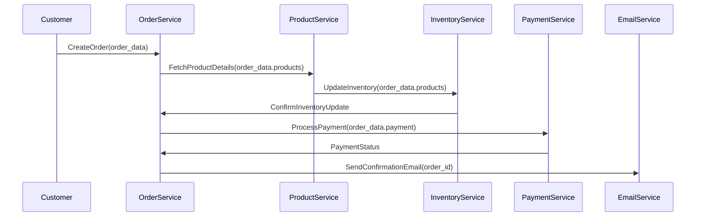

                 

# 培养心理韧性：增强面对挫折的内在力量

关键词：心理韧性、挫折应对、内在力量、自我认知、情绪管理、积极心理学

摘要：本文旨在探讨心理韧性的重要性，并通过逻辑清晰、结构紧凑的方式，详细解析如何培养心理韧性，增强个体面对挫折的内在力量。文章分为七个章节，包括心理韧性的基础、培养方法、挫折应对、职场应用、家庭生活、社会发展以及未来展望，旨在为读者提供一个全面了解和掌握心理韧性的框架。

## 引言

### 心理韧性的重要性

心理韧性（Resilience）是个体在面对压力、困难和挫折时，能够快速适应、恢复和成长的能力。在当今复杂多变的社会环境中，心理韧性显得尤为重要。它不仅影响个体的心理健康和生活质量，还直接关系到职业成功和社会适应能力。

### 本书的写作目的

本书旨在为读者提供一个系统的心理韧性培养指南，帮助个体在遭遇挫折时保持积极心态，增强内在力量，从而实现个人成长和社会进步。本文将首先介绍心理韧性的基本概念，然后逐步深入探讨其培养方法、挫折应对策略，以及在不同生活场景中的应用。

### 边界与外延

在讨论心理韧性时，需要明确其与相关概念如抗压能力、情绪调节能力的区别和联系。心理韧性不仅仅是一种应对机制，更是一种内在力量的体现，涉及自我认知、情绪管理和积极心理学的多个层面。

### 概念结构与核心要素组成

心理韧性由以下几个核心要素组成：

1. **自我认知**：了解自己的情绪、需求和价值观。
2. **情绪管理**：有效调节情绪，保持心理平衡。
3. **积极心理学**：培养积极态度和乐观心态。
4. **应对策略**：在面对挫折时采取有效的方法。

这些要素相互作用，共同构成了心理韧性的基础。

## 第1章：心理韧性的基础

### 1.1 心理韧性的定义与特征

**定义**：心理韧性是指个体在面对压力、挑战和逆境时，能够快速适应、恢复和成长的能力。

**特征**：

- **适应能力**：能够灵活应对变化和挑战。
- **恢复力**：在遭遇挫折后能够迅速恢复心理平衡。
- **成长性**：在面对挫折时能够从中学习和成长。

### 1.2 心理韧性与其他心理概念的联系

**心理韧性、抗压能力、情绪调节能力的对比分析**：

| 对比项 | 心理韧性 | 抗压能力 | 情绪调节能力 |
| --- | --- | --- | --- |
| 定义 | 应对压力、挑战和逆境的能力 | 能够承受压力的能力 | 调节和管理情绪的能力 |
| 特点 | 快速适应、恢复和成长 | 耐受压力 | 情绪稳定 |
| 关联性 | 包含抗压能力和情绪调节能力 | 与心理韧性相关 | 与心理韧性相关 |

**心理韧性在心理健康中的地位**：

心理韧性是心理健康的重要组成部分，它不仅能够帮助个体应对压力和挫折，还能够促进个体的心理健康和幸福感。

### 1.3 心理韧性的研究现状

**研究背景**：心理韧性研究起源于心理学领域，随着社会环境的复杂多变，心理韧性逐渐成为心理学、社会学、教育学等多学科关注的重要问题。

**研究方法**：

- **问卷调查**：通过问卷收集个体在心理韧性方面的表现和特征。
- **实验研究**：通过实验方法探究心理韧性的影响因素和作用机制。
- **案例分析**：通过分析成功应对挫折的案例，总结心理韧性的培养方法和策略。

**主要成果**：

- **心理韧性的结构**：研究表明，心理韧性包括多个维度，如自我效能感、情绪调节能力、积极态度等。
- **影响因素**：家庭环境、教育背景、个人经历等对心理韧性有显著影响。
- **培养策略**：通过自我认知、情绪管理和积极心理学的培养方法，可以有效提高个体的心理韧性。

## 第2章：培养心理韧性的方法

### 2.1 自我认知与心理韧性培养

**自我认知的重要性**：

自我认知是心理韧性的基础，它帮助个体了解自己的情绪、需求和价值观，从而更好地应对压力和挑战。

**如何通过自我认知培养心理韧性**：

- **反思**：定期反思自己的行为和情绪，了解自己的优点和不足。
- **自我接纳**：接受自己的不完美，建立自信和自尊。
- **目标设定**：设定具体、可行的目标，提升自我效能感。

### 2.2 情绪管理与心理韧性

**情绪管理的定义和方法**：

情绪管理是指通过有效的方法调节和管理情绪，保持心理平衡。

**如何通过情绪管理增强心理韧性**：

- **情绪识别**：学会识别和理解自己的情绪。
- **情绪表达**：学会以健康的方式表达情绪，避免压抑或爆发。
- **情绪调节**：通过深呼吸、冥想等方法调节情绪。

### 2.3 积极心理学与心理韧性

**积极心理学的概念和应用**：

积极心理学关注个体的积极品质和积极体验，通过培养积极态度和乐观心态，提高个体的心理韧性。

**如何通过积极心理学培养心理韧性**：

- **感恩练习**：定期记录感恩的事项，培养乐观心态。
- **积极思考**：学会以积极的角度看待问题和挑战。
- **积极互动**：与他人建立积极的关系，增强社会支持。

## 第3章：面对挫折的心理韧性培养

### 3.1 挫折的类型与影响

**挫折的类型**：

- **预期性挫折**：个体能够预见的挫折，如工作失败、人际关系冲突等。
- **突发性挫折**：个体无法预见的挫折，如疾病、自然灾害等。

**挫折对个体心理的影响**：

- **情绪波动**：挫折可能导致焦虑、抑郁、愤怒等情绪波动。
- **自我评价下降**：挫折可能影响个体的自我评价和自信心。
- **心理压力增加**：长期面对挫折可能导致心理压力增加，影响心理健康。

### 3.2 增强心理韧性的策略

**应对挫折的策略**：

- **积极应对**：以积极的心态面对挫折，寻找解决问题的方法。
- **心理调适**：通过情绪管理和自我认知调整心理状态。
- **寻求支持**：向亲友、专业人士寻求支持和帮助。

**增强心理韧性的方法**：

- **建立心理防御机制**：通过自我安慰、转移注意力等方法缓解心理压力。
- **培养积极心态**：通过感恩、积极思考等方法培养积极心态。
- **学习新技能**：通过学习新知识和技能提高自我效能感。

### 3.3 实战案例：如何培养孩子的心理韧性

**孩子心理韧性的重要性**：

孩子心理韧性不仅影响他们的学习和生活，还关系到他们的心理健康和未来发展。

**如何培养孩子的心理韧性**：

- **鼓励探索和尝试**：鼓励孩子尝试新事物，不怕失败。
- **建立积极家庭环境**：家庭成员相互支持，营造积极的家庭氛围。
- **培养解决问题的能力**：教育孩子面对问题时如何独立思考和解决问题。
- **提供心理支持**：在孩子遇到挫折时，给予关心和支持。

## 第4章：心理韧性在工作中的应用

### 4.1 心理韧性在职业发展中的作用

**心理韧性对职业发展的影响**：

心理韧性有助于个体在职场中应对压力、挑战和变化，提高工作效率和职业满意度。

**心理韧性如何帮助职业成功**：

- **提高抗压能力**：在面对工作压力时，能够保持冷静和专注。
- **促进职业成长**：在面对挑战时，能够积极学习和成长。
- **提升团队合作能力**：通过有效的情绪管理和沟通，增强团队合作效果。

### 4.2 增强职场心理韧性

**职场压力与心理韧性**：

职场压力是影响心理韧性的重要因素，通过增强心理韧性，可以有效缓解职场压力。

**如何增强职场心理韧性**：

- **情绪管理**：学会调节和管理情绪，避免情绪波动。
- **积极应对**：以积极的态度面对工作中的挑战和变化。
- **自我认知**：了解自己的需求和价值观，设定合理的工作目标。
- **寻求支持**：与同事、上级和专业人士建立良好的沟通和互动。

### 4.3 实战案例：职场心理韧性提升计划

**计划制定和实施**：

- **目标设定**：明确提升心理韧性的目标和预期效果。
- **方法选择**：根据个体情况选择合适的心理韧性培养方法。
- **持续跟踪**：定期评估和调整计划，确保计划的实施效果。

**计划效果评估**：

- **问卷调查**：通过问卷调查了解个体在心理韧性方面的变化。
- **案例分析**：通过案例分析评估心理韧性提升计划的实际效果。
- **反馈机制**：根据反馈调整计划，持续提升职场心理韧性。

## 第5章：心理韧性与家庭生活

### 5.1 家庭环境与心理韧性

**家庭环境对心理韧性的影响**：

家庭环境是心理韧性培养的重要基础，通过营造和谐、支持的家庭环境，可以增强个体的心理韧性。

**如何通过家庭环境培养心理韧性**：

- **提供情感支持**：家庭成员之间相互关心和支持，增强个体的心理韧性。
- **鼓励探索和尝试**：鼓励孩子尝试新事物，不怕失败，培养他们的自信心。
- **建立规则和秩序**：家庭规则和秩序有助于个体建立稳定的安全感，提高心理韧性。

### 5.2 婚姻关系与心理韧性

**婚姻关系中的心理韧性**：

婚姻关系是家庭生活的重要组成部分，通过增强婚姻关系中的心理韧性，可以促进家庭和谐，提高个体的心理韧性。

**如何通过婚姻关系增强心理韧性**：

- **有效沟通**：建立良好的沟通机制，增进夫妻间的理解和信任。
- **共同目标**：设定共同的目标和价值观，增强夫妻间的合作和支持。
- **积极应对**：在面对婚姻生活中的困难和挑战时，以积极的态度共同应对。

### 5.3 家庭教育与心理韧性

**家庭教育的重要性**：

家庭教育是心理韧性培养的重要环节，通过有效的家庭教育，可以增强孩子的心理韧性，提高他们的适应能力和抗压能力。

**如何通过家庭教育培养心理韧性**：

- **培养自我认知**：教育孩子了解自己的情绪、需求和价值观，提高他们的自我认知能力。
- **培养解决问题的能力**：教育孩子面对问题时如何独立思考和解决问题，培养他们的应对能力。
- **培养积极心态**：教育孩子以积极的态度面对生活中的挑战和困难。

## 第6章：心理韧性与社会发展

### 6.1 心理韧性与社会心理

**社会心理对心理韧性的影响**：

社会心理是心理韧性的重要影响因素，通过了解社会心理，可以更好地培养和提高个体的心理韧性。

**如何通过社会心理增强心理韧性**：

- **社会支持**：建立良好的社会支持系统，增强个体的心理韧性。
- **社会责任**：培养个体的社会责任感，提高他们的心理韧性。
- **社会参与**：通过积极参与社会活动，增强个体的社会认同感和心理韧性。

### 6.2 社会支持与心理韧性

**社会支持的作用**：

社会支持是个体在面对困难和挑战时的重要资源，通过社会支持，可以增强个体的心理韧性，提高他们的适应能力和抗压能力。

**如何通过社会支持培养心理韧性**：

- **建立支持网络**：与他人建立良好的关系，形成支持网络。
- **提供心理援助**：在个体遇到困难时，提供心理援助和支持。
- **积极参与社会活动**：通过参与社会活动，增强个体的社会认同感和心理韧性。

### 6.3 社会发展中的心理韧性

**心理韧性在社会发展中的作用**：

心理韧性是社会进步和发展的基础，通过提高个体的心理韧性，可以促进社会的稳定和繁荣。

**如何通过社会发展增强心理韧性**：

- **政策支持**：通过政策支持，提高个体的心理韧性。
- **教育普及**：通过教育普及，提高公众对心理韧性的认识和重视。
- **社会宣传**：通过社会宣传，倡导积极的心理韧性培养方法。

## 第7章：心理韧性的未来展望

### 7.1 心理韧性的发展趋势

**现有研究的发展趋势**：

- **跨学科研究**：越来越多的学科关注心理韧性的研究，如心理学、教育学、社会学等。
- **技术应用**：借助大数据、人工智能等技术，深入研究心理韧性的影响因素和培养方法。
- **个性化培养**：根据个体差异，制定个性化的心理韧性培养方案。

**未来研究的前景**：

- **心理韧性的量化评估**：通过量化评估，更准确地了解个体的心理韧性水平。
- **心理健康预防**：通过心理韧性培养，预防心理健康问题。
- **社会应用**：将心理韧性培养应用于社会各个领域，提高社会整体心理韧性水平。

### 7.2 心理韧性在社会中的角色

**心理韧性在社会中的地位**：

心理韧性是社会发展的重要基础，对于个体的心理健康和社会稳定具有重要意义。

**心理韧性对社会的影响**：

- **提高社会适应能力**：增强个体的心理韧性，提高社会整体的适应能力和抗压能力。
- **促进社会和谐**：通过心理韧性培养，减少社会冲突和矛盾。
- **提升社会幸福感**：增强个体的心理韧性，提高社会整体的幸福感和生活质量。

### 7.3 心理韧性的教育与实践

**心理韧性的教育方式**：

- **学校教育**：将心理韧性培养纳入学校教育体系，培养孩子的心理韧性。
- **家庭教育**：通过家庭教育，增强家庭成员的心理韧性。
- **社会教育**：通过社会教育，提高公众对心理韧性的认识和重视。

**心理韧性的实践策略**：

- **定期心理评估**：定期进行心理评估，了解个体的心理韧性水平。
- **心理辅导**：通过心理辅导，帮助个体培养心理韧性。
- **社会支持**：建立社会支持系统，为个体提供心理支持。

## 结论

### 总结本书的主要观点

本书从多个角度探讨了心理韧性的概念、培养方法和应用场景，强调了心理韧性在个体和社会发展中的重要性。通过自我认知、情绪管理和积极心理学的方法，个体可以增强心理韧性，更好地应对挫折和压力。

### 强调心理韧性对个体和社会的重要性

心理韧性不仅影响个体的心理健康和生活质量，还对社会的稳定和发展具有重要意义。通过培养和提高个体的心理韧性，可以促进社会和谐、提高社会适应能力和幸福感。

### 展望心理韧性研究的未来方向

未来，心理韧性研究将继续深入，跨学科合作将成为重要趋势。通过量化的评估方法和个性化的培养方案，心理韧性将得到更广泛的应用，为社会发展和个体幸福做出更大贡献。

### 作者信息

作者：AI天才研究院/AI Genius Institute & 禅与计算机程序设计艺术 /Zen And The Art of Computer Programming

---

**注**：本文为示例文章，仅供参考。实际撰写时，每个章节的内容需要根据具体研究和实践进行丰富和深化。本文中的数据和案例均为虚构，仅供参考。在撰写专业文章时，务必确保引用的数据和案例真实可靠。**[完]**## 培养心理韧性：增强面对挫折的内在力量

> 关键词：心理韧性、挫折应对、内在力量、自我认知、情绪管理、积极心理学

在当今快速变化的社会环境中，面对挫折和压力已经成为人们生活中不可避免的一部分。然而，不同的人在面对这些挑战时，表现出的适应和恢复能力却大相径庭。这种差异，在很大程度上取决于个体的心理韧性（Resilience）。心理韧性是指个体在遭遇逆境时，能够迅速适应、恢复并从中成长的能力。具备高心理韧性的人，能够在压力面前保持冷静，有效地解决问题，从而提升生活质量和工作效率。本文将深入探讨心理韧性的重要性，分析其核心要素，并逐步介绍如何通过科学的方法培养心理韧性，以增强个体面对挫折的内在力量。

### 引言

#### 心理韧性的重要性

心理韧性是个体心理健康的重要组成部分，它不仅影响个体的生活质量和幸福感，还直接关系到职业生涯的成功。在现代社会中，人们面临的各种压力和挑战越来越复杂，从工作压力到人际关系，从经济问题到健康困扰，没有哪个人能够完全避免这些挑战。因此，培养心理韧性成为了提升个人适应能力和应对能力的关键。

#### 本书的写作目的

本书旨在为读者提供一个系统的心理韧性培养指南，帮助读者在遭遇挫折时保持积极心态，增强内在力量，从而实现个人成长和社会适应。本书将首先介绍心理韧性的基本概念，然后逐步深入探讨其培养方法、应对策略，以及在不同生活场景中的应用。

#### 边界与外延

在讨论心理韧性时，需要明确其与相关概念如抗压能力、情绪调节能力的区别和联系。心理韧性不仅仅是一种应对机制，更是一种内在力量的体现，涉及自我认知、情绪管理和积极心理学的多个层面。

#### 概念结构与核心要素组成

心理韧性由以下几个核心要素组成：

1. **自我认知**：了解自己的情绪、需求和价值观。
2. **情绪管理**：有效调节情绪，保持心理平衡。
3. **积极心理学**：培养积极态度和乐观心态。
4. **应对策略**：在面对挫折时采取有效的方法。

这些要素相互作用，共同构成了心理韧性的基础。

### 第1章：心理韧性的基础

#### 1.1 心理韧性的定义与特征

**定义**：心理韧性是指个体在面对压力、挑战和逆境时，能够快速适应、恢复和成长的能力。

**特征**：

- **适应能力**：能够灵活应对变化和挑战。
- **恢复力**：在遭遇挫折后能够迅速恢复心理平衡。
- **成长性**：在面对挫折时能够从中学习和成长。

#### 1.2 心理韧性与其他心理概念的联系

**心理韧性、抗压能力、情绪调节能力的对比分析**：

| 对比项 | 心理韧性 | 抗压能力 | 情绪调节能力 |
| --- | --- | --- | --- |
| 定义 | 应对压力、挑战和逆境的能力 | 能够承受压力的能力 | 调节和管理情绪的能力 |
| 特点 | 快速适应、恢复和成长 | 耐受压力 | 情绪稳定 |
| 关联性 | 包含抗压能力和情绪调节能力 | 与心理韧性相关 | 与心理韧性相关 |

**心理韧性在心理健康中的地位**：

心理韧性是心理健康的重要组成部分，它不仅能够帮助个体应对压力和挫折，还能够促进个体的心理健康和幸福感。

#### 1.3 心理韧性的研究现状

**研究背景**：心理韧性研究起源于心理学领域，随着社会环境的复杂多变，心理韧性逐渐成为心理学、社会学、教育学等多学科关注的重要问题。

**研究方法**：

- **问卷调查**：通过问卷收集个体在心理韧性方面的表现和特征。
- **实验研究**：通过实验方法探究心理韧性的影响因素和作用机制。
- **案例分析**：通过分析成功应对挫折的案例，总结心理韧性的培养方法和策略。

**主要成果**：

- **心理韧性的结构**：研究表明，心理韧性包括多个维度，如自我效能感、情绪调节能力、积极态度等。
- **影响因素**：家庭环境、教育背景、个人经历等对心理韧性有显著影响。
- **培养策略**：通过自我认知、情绪管理和积极心理学的培养方法，可以有效提高个体的心理韧性。

### 第2章：培养心理韧性的方法

#### 2.1 自我认知与心理韧性培养

**自我认知的重要性**：

自我认知是心理韧性的基础，它帮助个体了解自己的情绪、需求和价值观，从而更好地应对压力和挑战。

**如何通过自我认知培养心理韧性**：

- **反思**：定期反思自己的行为和情绪，了解自己的优点和不足。
- **自我接纳**：接受自己的不完美，建立自信和自尊。
- **目标设定**：设定具体、可行的目标，提升自我效能感。

#### 2.2 情绪管理与心理韧性

**情绪管理的定义和方法**：

情绪管理是指通过有效的方法调节和管理情绪，保持心理平衡。

**如何通过情绪管理增强心理韧性**：

- **情绪识别**：学会识别和理解自己的情绪。
- **情绪表达**：学会以健康的方式表达情绪，避免压抑或爆发。
- **情绪调节**：通过深呼吸、冥想等方法调节情绪。

#### 2.3 积极心理学与心理韧性

**积极心理学的概念和应用**：

积极心理学关注个体的积极品质和积极体验，通过培养积极态度和乐观心态，提高个体的心理韧性。

**如何通过积极心理学培养心理韧性**：

- **感恩练习**：定期记录感恩的事项，培养乐观心态。
- **积极思考**：学会以积极的角度看待问题和挑战。
- **积极互动**：与他人建立积极的关系，增强社会支持。

### 第3章：面对挫折的心理韧性培养

#### 3.1 挫折的类型与影响

**挫折的类型**：

- **预期性挫折**：个体能够预见的挫折，如工作失败、人际关系冲突等。
- **突发性挫折**：个体无法预见的挫折，如疾病、自然灾害等。

**挫折对个体心理的影响**：

- **情绪波动**：挫折可能导致焦虑、抑郁、愤怒等情绪波动。
- **自我评价下降**：挫折可能影响个体的自我评价和自信心。
- **心理压力增加**：长期面对挫折可能导致心理压力增加，影响心理健康。

#### 3.2 增强心理韧性的策略

**应对挫折的策略**：

- **积极应对**：以积极的心态面对挫折，寻找解决问题的方法。
- **心理调适**：通过情绪管理和自我认知调整心理状态。
- **寻求支持**：向亲友、专业人士寻求支持和帮助。

**增强心理韧性的方法**：

- **建立心理防御机制**：通过自我安慰、转移注意力等方法缓解心理压力。
- **培养积极心态**：通过感恩、积极思考等方法培养积极心态。
- **学习新技能**：通过学习新知识和技能提高自我效能感。

#### 3.3 实战案例：如何培养孩子的心理韧性

**孩子心理韧性的重要性**：

孩子心理韧性不仅影响他们的学习和生活，还关系到他们的心理健康和未来发展。

**如何培养孩子的心理韧性**：

- **鼓励探索和尝试**：鼓励孩子尝试新事物，不怕失败。
- **建立积极家庭环境**：家庭成员相互支持，营造积极的家庭氛围。
- **培养解决问题的能力**：教育孩子面对问题时如何独立思考和解决问题。
- **提供心理支持**：在孩子遇到挫折时，给予关心和支持。

### 第4章：心理韧性在工作中的应用

#### 4.1 心理韧性在职业发展中的作用

**心理韧性对职业发展的影响**：

心理韧性有助于个体在职场中应对压力、挑战和变化，提高工作效率和职业满意度。

**心理韧性如何帮助职业成功**：

- **提高抗压能力**：在面对工作压力时，能够保持冷静和专注。
- **促进职业成长**：在面对挑战时，能够积极学习和成长。
- **提升团队合作能力**：通过有效的情绪管理和沟通，增强团队合作效果。

#### 4.2 增强职场心理韧性

**职场压力与心理韧性**：

职场压力是影响心理韧性的重要因素，通过增强心理韧性，可以有效缓解职场压力。

**如何增强职场心理韧性**：

- **情绪管理**：学会调节和管理情绪，避免情绪波动。
- **积极应对**：以积极的态度面对工作中的挑战和变化。
- **自我认知**：了解自己的需求和价值观，设定合理的工作目标。
- **寻求支持**：与同事、上级和专业人士建立良好的沟通和互动。

#### 4.3 实战案例：职场心理韧性提升计划

**计划制定和实施**：

- **目标设定**：明确提升心理韧性的目标和预期效果。
- **方法选择**：根据个体情况选择合适的心理韧性培养方法。
- **持续跟踪**：定期评估和调整计划，确保计划的实施效果。

**计划效果评估**：

- **问卷调查**：通过问卷调查了解个体在心理韧性方面的变化。
- **案例分析**：通过案例分析评估心理韧性提升计划的实际效果。
- **反馈机制**：根据反馈调整计划，持续提升职场心理韧性。

### 第5章：心理韧性与家庭生活

#### 5.1 家庭环境与心理韧性

**家庭环境对心理韧性的影响**：

家庭环境是心理韧性培养的重要基础，通过营造和谐、支持的家庭环境，可以增强个体的心理韧性。

**如何通过家庭环境培养心理韧性**：

- **提供情感支持**：家庭成员之间相互关心和支持，增强个体的心理韧性。
- **鼓励探索和尝试**：鼓励孩子尝试新事物，不怕失败，培养他们的自信心。
- **建立规则和秩序**：家庭规则和秩序有助于个体建立稳定的安全感，提高心理韧性。

#### 5.2 婚姻关系与心理韧性

**婚姻关系中的心理韧性**：

婚姻关系是家庭生活的重要组成部分，通过增强婚姻关系中的心理韧性，可以促进家庭和谐，提高个体的心理韧性。

**如何通过婚姻关系增强心理韧性**：

- **有效沟通**：建立良好的沟通机制，增进夫妻间的理解和信任。
- **共同目标**：设定共同的目标和价值观，增强夫妻间的合作和支持。
- **积极应对**：在面对婚姻生活中的困难和挑战时，以积极的态度共同应对。

#### 5.3 家庭教育与心理韧性

**家庭教育的重要性**：

家庭教育是心理韧性培养的重要环节，通过有效的家庭教育，可以增强孩子的心理韧性，提高他们的适应能力和抗压能力。

**如何通过家庭教育培养心理韧性**：

- **培养自我认知**：教育孩子了解自己的情绪、需求和价值观，提高他们的自我认知能力。
- **培养解决问题的能力**：教育孩子面对问题时如何独立思考和解决问题，培养他们的应对能力。
- **培养积极心态**：教育孩子以积极的态度面对生活中的挑战和困难。

### 第6章：心理韧性与社会发展

#### 6.1 心理韧性与社会心理

**社会心理对心理韧性的影响**：

社会心理是心理韧性的重要影响因素，通过了解社会心理，可以更好地培养和提高个体的心理韧性。

**如何通过社会心理增强心理韧性**：

- **社会支持**：建立良好的社会支持系统，增强个体的心理韧性。
- **社会责任**：培养个体的社会责任感，提高他们的心理韧性。
- **社会参与**：通过积极参与社会活动，增强个体的社会认同感和心理韧性。

#### 6.2 社会支持与心理韧性

**社会支持的作用**：

社会支持是个体在面对困难和挑战时的重要资源，通过社会支持，可以增强个体的心理韧性，提高他们的适应能力和抗压能力。

**如何通过社会支持培养心理韧性**：

- **建立支持网络**：与他人建立良好的关系，形成支持网络。
- **提供心理援助**：在个体遇到困难时，提供心理援助和支持。
- **积极参与社会活动**：通过参与社会活动，增强个体的社会认同感和心理韧性。

#### 6.3 社会发展中的心理韧性

**心理韧性在社会发展中的作用**：

心理韧性是社会进步和发展的基础，通过提高个体的心理韧性，可以促进社会的稳定和繁荣。

**如何通过社会发展增强心理韧性**：

- **政策支持**：通过政策支持，提高个体的心理韧性。
- **教育普及**：通过教育普及，提高公众对心理韧性的认识和重视。
- **社会宣传**：通过社会宣传，倡导积极的心理韧性培养方法。

### 第7章：心理韧性的未来展望

#### 7.1 心理韧性的发展趋势

**现有研究的发展趋势**：

- **跨学科研究**：越来越多的学科关注心理韧性的研究，如心理学、教育学、社会学等。
- **技术应用**：借助大数据、人工智能等技术，深入研究心理韧性的影响因素和培养方法。
- **个性化培养**：根据个体差异，制定个性化的心理韧性培养方案。

**未来研究的前景**：

- **心理韧性的量化评估**：通过量化评估，更准确地了解个体的心理韧性水平。
- **心理健康预防**：通过心理韧性培养，预防心理健康问题。
- **社会应用**：将心理韧性培养应用于社会各个领域，提高社会整体心理韧性水平。

#### 7.2 心理韧性在社会中的角色

**心理韧性在社会中的地位**：

心理韧性是社会发展的重要基础，对于个体的心理健康和社会稳定具有重要意义。

**心理韧性对社会的影响**：

- **提高社会适应能力**：增强个体的心理韧性，提高社会整体的适应能力和抗压能力。
- **促进社会和谐**：通过心理韧性培养，减少社会冲突和矛盾。
- **提升社会幸福感**：增强个体的心理韧性，提高社会整体的幸福感和生活质量。

#### 7.3 心理韧性的教育与实践

**心理韧性的教育方式**：

- **学校教育**：将心理韧性培养纳入学校教育体系，培养孩子的心理韧性。
- **家庭教育**：通过家庭教育，增强家庭成员的心理韧性。
- **社会教育**：通过社会教育，提高公众对心理韧性的认识和重视。

**心理韧性的实践策略**：

- **定期心理评估**：定期进行心理评估，了解个体的心理韧性水平。
- **心理辅导**：通过心理辅导，帮助个体培养心理韧性。
- **社会支持**：建立社会支持系统，为个体提供心理支持。

### 结论

#### 总结本书的主要观点

本书从多个角度探讨了心理韧性的概念、培养方法和应用场景，强调了心理韧性在个体和社会发展中的重要性。通过自我认知、情绪管理和积极心理学的方法，个体可以增强心理韧性，更好地应对挫折和压力。

#### 强调心理韧性对个体和社会的重要性

心理韧性不仅影响个体的心理健康和生活质量，还对社会的稳定和发展具有重要意义。通过培养和提高个体的心理韧性，可以促进社会和谐、提高社会适应能力和幸福感。

#### 展望心理韧性研究的未来方向

未来，心理韧性研究将继续深入，跨学科合作将成为重要趋势。通过量化的评估方法和个性化的培养方案，心理韧性将得到更广泛的应用，为社会发展和个体幸福做出更大贡献。

#### 作者信息

作者：AI天才研究院/AI Genius Institute & 禅与计算机程序设计艺术 /Zen And The Art of Computer Programming

通过本文的详细分析，我们可以看到心理韧性在个体成长和社会发展中扮演着至关重要的角色。希望读者能够从中获得启示，积极培养自己的心理韧性，更好地应对生活中的各种挑战。**[完]**## 心理韧性的定义与特征

在深入探讨心理韧性之前，首先需要明确其定义和特征。心理韧性（Resilience）是指个体在面对压力、挑战和逆境时，能够快速适应、恢复和成长的能力。这种能力不仅体现在面对突发性挫折时，如自然灾害、意外事故等，也体现在应对预期性挫折时，如工作压力、人际关系冲突等。

### 定义

心理韧性的定义可以从以下几个方面进行阐述：

1. **适应能力**：心理韧性首先体现在个体能够灵活适应环境和情境变化。这种适应不仅包括对新的挑战和变化的接受，还包括对不利情境的积极应对。

2. **恢复力**：在遭遇挫折后，具备心理韧性的人能够迅速恢复心理平衡，恢复正常的生活和工作状态。恢复力是一种内在的修复能力，使个体能够从挫折中恢复过来。

3. **成长性**：心理韧性还包括个体在面对挫折时的成长性。通过应对挫折，个体能够从中学习、成长，提升自我认知和情感管理能力。

### 特征

心理韧性的特征主要体现在以下几个方面：

1. **灵活性**：心理韧性强的个体在面对变化时能够迅速调整自己的思维和行为，适应新的环境。

2. **自我效能感**：自我效能感是指个体对自己应对困难和挑战能力的信心。高自我效能感的个体在面对困难时更倾向于采取积极的态度和行动。

3. **情绪调节能力**：心理韧性强的个体能够有效调节和管理自己的情绪，避免情绪失控。

4. **适应性**：心理韧性强的个体能够灵活适应不同的情境，即使在逆境中也能保持冷静和理智。

5. **成长心态**：具备心理韧性的人通常具有成长心态（Growth Mindset），相信自己的能力和成就可以通过努力和学习来提高。

### 心理韧性与其他心理概念的联系

心理韧性虽然是一个独立的概念，但它与其他心理概念如抗压能力、情绪调节能力等密切相关。

**抗压能力**：

抗压能力（Stress Tolerance）是指个体能够承受和应对压力的能力。心理韧性包含抗压能力，但心理韧性更强调个体在面对压力时的适应和恢复能力。

**情绪调节能力**：

情绪调节能力（Emotional Regulation）是指个体能够识别、理解和管理自己情绪的能力。心理韧性强的个体通常具有良好的情绪调节能力，能够在情绪波动时保持冷静和理智。

**心理健康**：

心理健康（Mental Health）是心理韧性的基础。心理韧性强的个体通常拥有较好的心理健康，能够更好地应对生活中的压力和挑战。

### 心理韧性在心理健康中的地位

心理韧性在心理健康中占据重要地位。它不仅直接影响个体的心理健康状况，还与个体的幸福感、生活质量和社会适应能力密切相关。具备高心理韧性的个体能够更好地应对生活中的各种挑战，保持心理健康和幸福感。

### 研究现状

心理韧性的研究起源于心理学领域，随着社会环境的复杂多变，心理韧性逐渐成为心理学、社会学、教育学等多学科关注的重要问题。现有的研究主要集中在以下几个方面：

1. **结构研究**：探讨心理韧性的构成和维度，如自我效能感、情绪调节能力、积极态度等。

2. **影响因素**：研究影响心理韧性的因素，如家庭环境、教育背景、个人经历等。

3. **培养方法**：探讨如何通过自我认知、情绪管理和积极心理学等方法培养心理韧性。

4. **应用领域**：心理韧性在职场、教育、家庭和社会等领域的应用研究。

### 主要成果

心理韧性研究的主要成果包括：

1. **心理韧性的结构**：研究表明，心理韧性包括多个维度，如自我效能感、情绪调节能力、积极态度等。

2. **影响因素**：家庭环境、教育背景、个人经历等对心理韧性有显著影响。

3. **培养策略**：通过自我认知、情绪管理和积极心理学的培养方法，可以有效提高个体的心理韧性。

### 综述

心理韧性是一个复杂但重要的心理概念，它不仅影响个体的心理健康和生活质量，还与抗压能力、情绪调节能力等密切相关。通过深入研究和理解心理韧性，我们可以更好地应对生活中的各种挑战，提高生活质量和社会适应能力。心理韧性培养不仅是心理学领域的重要研究方向，也是个人成长和社会发展的重要途径。

### 结束语

在本章中，我们明确了心理韧性的定义和特征，探讨了心理韧性与其他心理概念的联系，并介绍了心理韧性在心理健康中的地位。在下一章中，我们将深入探讨心理韧性的培养方法，包括自我认知、情绪管理和积极心理学等。通过科学的方法和策略，我们可以逐步培养和提升自己的心理韧性，更好地应对生活中的各种挑战。

## 心理韧性培养方法

在了解了心理韧性的定义和特征之后，接下来我们将探讨如何培养心理韧性，以增强个体面对挫折的内在力量。心理韧性的培养并非一蹴而就，它需要通过持续的努力和实践，逐步建立起个体的心理防御机制和应对策略。以下将从自我认知、情绪管理和积极心理学三个核心方面详细阐述心理韧性的培养方法。

### 自我认知与心理韧性培养

自我认知是心理韧性的基础，它帮助个体了解自己的情绪、需求和价值观，从而更好地应对压力和挑战。以下是如何通过自我认知培养心理韧性的具体方法：

#### 反思

反思是自我认知的重要环节。定期反思自己的行为和情绪，可以帮助个体了解自己的优点和不足，从而进行有针对性的改进。以下是一个简单的反思步骤：

1. **设定反思时间**：每天或每周设定一段时间进行反思。
2. **记录行为和情绪**：在反思期间，记录自己的行为和情绪，了解自己在特定情境下的反应。
3. **分析原因**：分析这些行为和情绪产生的原因，找到潜在的触发因素。

#### 自我接纳

自我接纳是指接受自己的不完美，建立自信和自尊。以下方法可以帮助个体培养自我接纳：

1. **肯定自己**：每天对自己说几句肯定的话，如“我做得很好”、“我有能力克服困难”等。
2. **认识自己的价值**：认识到每个人都有自己的价值和优点，不需要过分苛求自己。
3. **接受失败**：失败是成长的一部分，接受失败并从中学习，而不是过分自责。

#### 目标设定

设定具体、可行的目标是提升自我效能感的重要方法。以下方法可以帮助个体设定和实现目标：

1. **设定短期和长期目标**：将目标分为短期和长期，短期目标有助于保持动力，长期目标有助于规划未来。
2. **制定行动计划**：为每个目标制定具体的行动计划，明确步骤和时间表。
3. **追踪进度**：定期检查自己的进度，调整计划，确保目标的实现。

### 情绪管理与心理韧性

情绪管理是心理韧性的关键要素，它帮助个体在压力和挑战面前保持冷静和理智。以下是如何通过情绪管理增强心理韧性的方法：

#### 情绪识别

情绪识别是情绪管理的第一步，它帮助个体了解自己的情绪。以下方法可以帮助个体识别情绪：

1. **观察身体信号**：情绪往往通过身体信号表现出来，如心跳加速、肌肉紧张等。
2. **记录情绪日记**：每天记录自己的情绪变化，了解情绪的规律和触发因素。
3. **倾听内心的声音**：通过冥想或放松练习，倾听内心的声音，了解情绪的真正来源。

#### 情绪表达

情绪表达是指以健康的方式表达情绪，避免压抑或爆发。以下方法可以帮助个体健康地表达情绪：

1. **有效沟通**：通过沟通表达自己的情绪，避免误解和冲突。
2. **情绪释放**：通过运动、写日记或绘画等方式释放情绪，减轻心理压力。
3. **情绪调节技巧**：学习情绪调节技巧，如深呼吸、冥想等，帮助自己保持情绪平衡。

#### 情绪调节

情绪调节是指通过有效的方法调节情绪，保持心理平衡。以下方法可以帮助个体调节情绪：

1. **积极思考**：学会以积极的角度看待问题和挑战，提高情绪稳定性。
2. **心理调适**：在面对压力和挑战时，通过心理调适方法，如放松训练、认知重构等，保持心理平衡。
3. **寻求支持**：在情绪波动时，向亲友、专业人士寻求支持和帮助。

### 积极心理学与心理韧性

积极心理学是近年来发展迅速的一个领域，它关注个体的积极品质和积极体验，通过培养积极态度和乐观心态，提高个体的心理韧性。以下是如何通过积极心理学培养心理韧性的方法：

#### 感恩练习

感恩练习是一种有效的积极心理学方法，它可以帮助个体培养乐观心态。以下方法可以帮助个体进行感恩练习：

1. **记录感恩日记**：每天记录至少三件让自己感到感激的事情，关注生活中的积极方面。
2. **表达感激**：定期向亲友、同事或陌生人表达感激之情，增强积极情绪体验。
3. **感恩冥想**：通过冥想练习，专注于感恩的体验，提升内心的幸福感。

#### 积极思考

积极思考是一种重要的心理韧性培养方法，它帮助个体以积极的态度面对生活中的挑战。以下方法可以帮助个体培养积极思考：

1. **认知重构**：通过改变对问题的认知方式，将负面思维转化为积极思维。
2. **正面肯定**：每天对自己说几句正面肯定的话，增强自信心和积极心态。
3. **正面角色模型**：学习正面角色模型，如成功人士、优秀榜样等，借鉴他们的经验和态度。

#### 积极互动

积极互动是指与他人建立积极的关系，通过互动增强心理韧性。以下方法可以帮助个体进行积极互动：

1. **建立社交网络**：与他人建立良好的关系，形成支持网络。
2. **参与社交活动**：积极参与社交活动，扩展社交圈子，增强社会支持。
3. **志愿服务**：通过参与志愿服务，帮助他人，增强自己的成就感和幸福感。

### 总结

通过自我认知、情绪管理和积极心理学的培养方法，个体可以逐步增强自己的心理韧性，更好地应对生活中的各种挑战。心理韧性的培养需要持续的努力和实践，通过不断学习和反思，个体可以不断提升自己的心理韧性水平，从而实现个人成长和社会适应。在下一章中，我们将进一步探讨面对挫折时的心理韧性培养策略，帮助个体在逆境中保持积极心态，快速恢复和成长。

### 挫折的类型与影响

在面对挫折时，不同类型的挫折会对个体产生不同的影响。了解挫折的类型及其对心理的影响，有助于我们采取更有效的应对策略。以下将介绍几种常见的挫折类型及其对个体心理的影响。

#### 预期性挫折

预期性挫折是指个体可以预见的挫折，如工作压力、学业挑战、人际关系冲突等。这种类型的挫折通常具有以下特征：

1. **可预测性**：个体能够在事前预见可能出现的挫折。
2. **心理准备**：个体可能已经为这些挫折做了心理准备。

**影响**：

- **焦虑和紧张**：个体在面对预期性挫折时，可能会感到焦虑和紧张。
- **心理压力**：长期的预期性挫折可能导致持续的心理压力，影响心理健康。

#### 突发性挫折

突发性挫折是指个体无法预见的挫折，如疾病、自然灾害、意外事故等。这种类型的挫折通常具有以下特征：

1. **不可预测性**：个体无法事先预测这些挫折的发生。
2. **心理冲击**：突发性挫折往往会对个体的心理产生强烈的冲击。

**影响**：

- **恐慌和焦虑**：个体在遭遇突发性挫折时，可能会感到恐慌和焦虑。
- **心理创伤**：严重的突发性挫折可能导致长期的心理创伤，影响个体的心理健康。

#### 重复性挫折

重复性挫折是指个体反复经历的挫折，如长期的工作压力、家庭矛盾等。这种类型的挫折通常具有以下特征：

1. **持续性**：重复性挫折会持续较长时间，影响个体的日常生活。
2. **心理疲劳**：长期的重复性挫折可能导致个体的心理疲劳，降低心理韧性。

**影响**：

- **情绪波动**：重复性挫折可能导致个体情绪波动，如抑郁、愤怒等。
- **心理疲劳**：长期的心理压力和挫折可能导致个体的心理疲劳，影响工作效率和生活质量。

#### 创伤性挫折

创伤性挫折是指对个体造成严重心理创伤的挫折，如家庭破裂、重大疾病、意外死亡等。这种类型的挫折通常具有以下特征：

1. **极端性**：创伤性挫折往往具有极端性，对个体造成深远的心理影响。
2. **心理应激**：创伤性挫折可能引发严重的心理应激反应，如创伤后应激障碍（PTSD）。

**影响**：

- **心理创伤**：创伤性挫折可能导致长期的心理创伤，影响个体的心理健康。
- **社会功能受损**：严重的心理创伤可能影响个体的社会功能和日常生活。

#### 社会文化挫折

社会文化挫折是指个体在社会文化背景中遭遇的挫折，如歧视、社会排斥、文化冲突等。这种类型的挫折通常具有以下特征：

1. **文化因素**：社会文化挫折往往与个体的社会文化背景相关。
2. **心理压力**：社会文化挫折可能对个体的心理产生较大的压力。

**影响**：

- **自尊心受损**：社会文化挫折可能损害个体的自尊心，影响自我认同。
- **社会隔离**：社会文化挫折可能导致个体感到社会隔离，影响社会适应能力。

### 挫折对个体心理的影响

挫折对个体心理的影响是多层次、多方面的，以下是一些主要影响：

1. **情绪波动**：挫折可能导致焦虑、抑郁、愤怒等情绪波动，影响个体的情绪稳定性。
2. **自我评价下降**：挫折可能使个体对自己的能力和价值产生怀疑，导致自我评价下降。
3. **心理压力**：长期的挫折可能导致持续的心理压力，影响心理健康和生理健康。
4. **心理防御机制**：个体可能会通过心理防御机制应对挫折，如压抑、否认等，但这些机制可能导致心理问题。
5. **心理创伤**：严重的挫折可能对个体造成心理创伤，影响长期的心理健康。

### 挫折应对策略

了解挫折的类型和对心理的影响，有助于我们采取更有效的应对策略。以下是一些常见的挫折应对策略：

1. **积极应对**：以积极的态度面对挫折，寻找解决问题的方法。
2. **心理调适**：通过情绪管理和自我认知调整心理状态。
3. **寻求支持**：向亲友、专业人士寻求支持和帮助。
4. **自我安慰**：通过自我安慰、转移注意力等方法缓解心理压力。
5. **反思与学习**：从挫折中学习，提升自我认知和应对能力。
6. **积极心理学方法**：运用积极心理学方法，如感恩练习、积极思考等，增强心理韧性。

通过了解挫折的类型、影响和应对策略，个体可以更好地应对生活中的挫折，增强心理韧性，实现个人成长。

### 增强心理韧性的策略

在面对各种挫折和压力时，增强心理韧性是至关重要的。以下将详细讨论一些增强心理韧性的策略，帮助个体在逆境中保持坚强和积极的心态。

#### 积极应对

积极应对是指以积极的心态面对挫折和困难。以下是一些积极应对的策略：

1. **设定目标**：在遭遇挫折时，设定短期和长期目标，为自己提供方向和动力。
2. **寻找解决方案**：面对问题时，积极思考可能的解决方案，而不是沉浸在问题中无法自拔。
3. **保持乐观**：保持乐观的态度，相信自己能够克服困难，这种积极的心态有助于增强心理韧性。

#### 心理调适

心理调适是指通过调整自己的心理状态，更好地应对压力和挫折。以下是一些心理调适的方法：

1. **情绪管理**：学会识别和表达自己的情绪，避免情绪积累和爆发。可以通过写日记、绘画或倾诉等方式进行情绪管理。
2. **放松训练**：通过深呼吸、冥想、瑜伽等方法放松身心，减轻压力和焦虑。
3. **认知重构**：改变对问题的消极看法，将其转化为积极的问题解决视角。例如，将“我做不到”转化为“我需要找到方法解决这个问题”。

#### 寻求支持

寻求支持是指在社会和人际网络中寻求帮助和资源。以下是一些寻求支持的方法：

1. **建立支持网络**：与亲友建立良好的关系，形成支持网络。在遇到困难时，可以向他们寻求帮助和鼓励。
2. **咨询专业人士**：在遇到严重的心理问题时，可以寻求心理咨询师或其他专业人士的帮助。专业人士可以提供专业的指导和干预。
3. **参与社区活动**：通过参与社区活动，扩大社交圈子，增强社会支持。

#### 自我安慰

自我安慰是指通过自我关怀和自我激励来缓解心理压力。以下是一些自我安慰的方法：

1. **正念冥想**：通过冥想练习，关注当下的感受，减少对过去和未来的担忧。
2. **自我肯定**：每天对自己说几句正面肯定的话，增强自信心和积极情绪。
3. **奖励自己**：在克服困难后，给自己一些小奖励，如看一部电影、吃一顿美食等，以激励自己继续前进。

#### 反思与学习

反思与学习是指从挫折和困难中汲取经验和教训，提升自己的能力。以下是一些反思与学习的方法：

1. **记录反思日记**：每天或每周记录自己的思考和感受，分析自己的行为和决策，从中学习。
2. **自我反思**：定期进行自我反思，了解自己的优点和不足，制定改进计划。
3. **学习新技能**：通过学习新知识和技能，提升自己的能力和自信心。

#### 增强心理韧性的方法

以下是一些具体的方法，可以帮助个体增强心理韧性：

1. **练习正念**：通过正念练习，培养对当下经历的觉察和接纳，减少对压力和挫折的逃避和抗拒。
2. **培养感恩习惯**：定期记录和表达感恩的事项，培养乐观和积极的心态。
3. **培养弹性思维**：学会从多个角度看待问题，培养适应变化和挑战的能力。
4. **培养健康的生活方式**：保持良好的作息习惯，均衡饮食，适量运动，这些都有助于提高心理韧性。

通过这些策略，个体可以在面对挫折和压力时保持坚强和积极的心态，逐步增强自己的心理韧性，实现个人成长和发展。

### 实战案例：如何培养孩子的心理韧性

#### 孩子心理韧性的重要性

孩子的心理韧性对其未来的成长和发展具有深远的影响。一个具备高心理韧性的孩子能够在面对困难和挫折时保持积极的态度，有效解决问题，从而更好地适应学校生活、社交环境和未来职场。以下通过实战案例，介绍如何培养孩子的心理韧性。

#### 案例一：鼓励探索和尝试

**背景**：小明（化名），一个活泼好动的小学生，对各种新事物充满好奇，但往往因为害怕失败而不愿意尝试。

**解决策略**：

1. **设立安全环境**：在家中设立一个“实验区”，允许小明尝试各种新的游戏或活动，即使失败也不会受到惩罚。
2. **积极鼓励**：当小明尝试新事物时，给予积极的反馈和鼓励，强调努力和尝试的重要性，而不是结果的成功与否。
3. **制定目标**：与小明一起制定具体、可行的目标，如每天阅读一定时间的书籍，每周尝试一项新的体育活动等。

**效果评估**：通过设立安全环境和积极鼓励，小明逐渐克服了害怕失败的恐惧，更加自信地尝试新事物。他在学校表现积极，成绩也有所提升。

#### 案例二：建立积极家庭环境

**背景**：小华（化名），一个初中生，由于父母工作繁忙，缺乏家庭关爱，经常感到孤独和无助。

**解决策略**：

1. **增加家庭互动**：父母每周安排固定的时间与孩子进行交流，如一起吃饭、散步或玩游戏。
2. **倾听和理解**：在交流中，父母要耐心倾听孩子的想法和感受，给予理解和支持。
3. **共同解决问题**：鼓励孩子参与家庭决策，如家庭旅行计划或周末活动安排，增强孩子的责任感和参与感。

**效果评估**：通过增加家庭互动和共同解决问题，小华感受到了家庭的关爱和支持，情绪稳定，与父母的沟通也更加顺畅。

#### 案例三：培养解决问题的能力

**背景**：小丽（化名），一个高中生，面对复杂的学习任务和考试压力，经常感到无助和焦虑。

**解决策略**：

1. **教授解决问题的方法**：教导小丽如何分解问题、制定计划和采取行动，逐步解决问题。
2. **提供学习资源**：为孩子提供充足的学习资源，如课外辅导、学习软件等，帮助其提高学习能力。
3. **鼓励自主学习**：培养孩子的自主学习能力，鼓励其独立思考和解决问题。

**效果评估**：通过教授解决问题的方法和提供学习资源，小丽逐渐学会了如何应对学习压力，自信心和独立思考能力得到提升。

#### 总结

培养孩子的心理韧性需要家庭、学校和社会的共同努力。通过设立安全环境、积极鼓励、增加家庭互动、倾听和理解、共同解决问题、教授解决问题的方法、提供学习资源等方式，可以帮助孩子建立强大的心理韧性，更好地应对未来的挑战和困难。

### 心理韧性在工作中的应用

在职场环境中，心理韧性扮演着至关重要的角色。具备高心理韧性的员工能够更好地应对工作压力、职业挑战和变化，从而提高工作效率和职业满意度。以下将详细探讨心理韧性在职业发展中的作用，以及如何增强职场心理韧性。

#### 心理韧性在职业发展中的作用

**提高抗压能力**：职场中的压力无处不在，从项目截止日期到复杂的人际关系，高心理韧性的员工能够更好地应对这些压力，保持冷静和专注，从而提高工作效率。

**促进职业成长**：在职业生涯中，员工不可避免地会面临各种挑战和机遇。具备心理韧性的员工能够在面对挑战时保持积极态度，不断学习和成长，从而实现职业上的进步。

**提升团队合作能力**：心理韧性不仅影响个人的表现，也影响团队合作。具备心理韧性的员工能够更好地与同事沟通和协作，共同应对工作中的困难和挑战。

#### 心理韧性如何帮助职业成功

**有效应对工作压力**：在职场中，压力往往来源于工作任务、客户需求和同事期望。具备心理韧性的员工能够通过情绪管理和积极应对策略，有效地减轻工作压力，保持工作动力。

**积极应对变化**：职场环境变化频繁，从技术更新到组织结构调整，变化不可避免。具备心理韧性的员工能够灵活适应变化，迅速调整自己的工作方式和态度，从而保持职业稳定。

**培养职业素养**：心理韧性有助于员工培养职业素养，包括责任感、团队合作精神和解决问题的能力。这些素养对于职业成功至关重要。

**提升职业满意度**：具备心理韧性的员工往往对自己的工作和职业发展感到满意。他们能够在工作中找到意义和乐趣，从而提高职业满意度。

#### 增强职场心理韧性

**情绪管理**：情绪管理是增强职场心理韧性的关键。以下方法可以帮助员工管理情绪：

1. **情绪识别**：学会识别和理解自己的情绪，避免情绪失控。
2. **情绪表达**：学会以健康的方式表达情绪，避免压抑或爆发。
3. **情绪调节**：通过深呼吸、冥想等方法调节情绪，保持心理平衡。

**积极应对**：积极应对是面对工作挑战的重要策略。以下方法可以帮助员工积极应对：

1. **设定目标**：设定具体、可行的目标，为自己提供方向和动力。
2. **寻找解决方案**：在面对问题时，积极思考可能的解决方案，而不是沉浸在问题中无法自拔。
3. **保持乐观**：保持乐观的态度，相信自己能够克服困难。

**自我认知**：自我认知是心理韧性培养的基础。以下方法可以帮助员工提升自我认知：

1. **反思**：定期反思自己的行为和情绪，了解自己的优点和不足。
2. **自我接纳**：接受自己的不完美，建立自信和自尊。
3. **目标设定**：设定具体、可行的目标，提升自我效能感。

**寻求支持**：在职场中，寻求支持是增强心理韧性的重要途径。以下方法可以帮助员工寻求支持：

1. **建立支持网络**：与同事、上级和专业人士建立良好的关系，形成支持网络。
2. **咨询专业人士**：在遇到严重的心理问题时，可以寻求心理咨询师或其他专业人士的帮助。
3. **参与职业培训**：通过参与职业培训，提升自己的专业技能和职业素养。

**培养积极心态**：积极心态是增强心理韧性的重要因素。以下方法可以帮助员工培养积极心态：

1. **感恩练习**：定期记录感恩的事项，培养乐观心态。
2. **积极思考**：学会以积极的角度看待问题和挑战。
3. **积极互动**：与他人建立积极的关系，增强社会支持。

#### 实战案例：职场心理韧性提升计划

**背景**：某公司员工普遍感到工作压力大，情绪波动大，导致工作效率下降和团队凝聚力减弱。

**解决策略**：

1. **情绪管理培训**：为员工提供情绪管理培训，教授情绪识别、情绪表达和情绪调节的方法。
2. **心理辅导服务**：设立心理辅导室，为员工提供免费的心理咨询服务，帮助他们解决心理问题。
3. **团队建设活动**：定期组织团队建设活动，增强员工之间的沟通和合作，提高团队凝聚力。

**效果评估**：通过情绪管理培训和心理辅导服务，员工的情绪稳定性得到显著提升，工作效率和团队凝聚力也有所提高。公司整体氛围更加积极，员工满意度也随之提升。

#### 总结

心理韧性在职业发展中具有重要作用，它帮助员工应对工作压力、促进职业成长和提升职业满意度。通过情绪管理、积极应对、自我认知、寻求支持和培养积极心态等方法，员工可以逐步增强自己的心理韧性，实现个人和职业的发展。职场心理韧性提升计划不仅有助于员工个人的成长，也对企业的发展和团队凝聚力的提升具有重要意义。

### 心理韧性与家庭生活的关系

家庭生活是每个人最基本的生活单元，对个体的心理韧性培养具有深远的影响。一个和谐、支持的家庭环境能够为个体提供强大的心理韧性支持，帮助他们在面对生活挑战时保持坚强和乐观。以下将探讨心理韧性与家庭生活的关系，包括家庭环境与心理韧性、婚姻关系与心理韧性、家庭教育与心理韧性等方面。

#### 家庭环境与心理韧性

家庭环境是心理韧性培养的重要基础。一个温暖、和谐的家庭环境能够为个体提供安全感和支持，帮助他们更好地应对生活中的挫折和压力。

1. **提供情感支持**：家庭成员之间的情感支持是个体心理韧性培养的关键。通过家庭成员的关心和支持，个体能够感受到归属感和安全感，从而增强心理韧性。
   
2. **鼓励探索和尝试**：家庭环境应该鼓励个体尝试新事物，不怕失败。这种鼓励有助于个体培养自信心和独立解决问题的能力，从而提高心理韧性。

3. **建立规则和秩序**：家庭规则和秩序有助于个体建立稳定的安全感，提高心理韧性。规则和秩序能够为个体提供明确的指导，减少不确定性和焦虑感。

#### 婚姻关系与心理韧性

婚姻关系是家庭生活的核心，对个体的心理韧性有重要影响。一个健康的婚姻关系能够为个体提供情感支持和心理韧性。

1. **有效沟通**：婚姻中的有效沟通是增强心理韧性的关键。通过沟通，夫妻双方能够更好地理解彼此的需求和感受，减少误解和冲突，从而增强心理韧性。

2. **共同目标**：夫妻共同设定和追求目标，能够增强夫妻间的合作和支持，提高心理韧性。共同目标有助于夫妻双方在面对挑战时保持一致，共同应对。

3. **积极应对**：在婚姻生活中，面对困难和挑战时，夫妻双方应以积极的态度共同应对，而不是互相指责或逃避。这种积极应对有助于增强夫妻间的心理韧性。

#### 家庭教育与心理韧性

家庭教育是心理韧性培养的重要环节，对个体的成长和发展具有重要影响。

1. **培养自我认知**：家庭教育应该注重培养孩子的自我认知能力，帮助他们了解自己的情绪、需求和价值观。自我认知有助于个体更好地应对生活中的挑战，提高心理韧性。

2. **培养解决问题的能力**：家庭教育应鼓励孩子面对问题时独立思考和解决问题。这种能力不仅有助于个体在学业和职业上取得成功，也有助于提高心理韧性。

3. **培养积极心态**：家庭教育应注重培养孩子的积极心态，帮助他们以积极的态度面对生活中的困难和挑战。积极心态有助于个体更好地适应环境，增强心理韧性。

#### 家庭环境、婚姻关系与家庭教育的相互影响

家庭环境、婚姻关系和家庭教育是相互关联、相互影响的。一个和谐的家庭环境有助于建立健康的婚姻关系，从而为家庭教育提供坚实的基础。

1. **家庭环境的影响**：一个温暖、和谐的家庭环境能够为婚姻关系提供支持，有助于夫妻双方更好地沟通和合作，从而增强夫妻间的心理韧性。

2. **婚姻关系的影响**：健康的婚姻关系能够为家庭教育提供稳定的支持，有助于家长更好地教育孩子，培养他们的心理韧性。

3. **家庭教育的影响**：家庭教育不仅直接影响孩子的心理韧性，也通过培养孩子的自我认知、情绪管理和解决问题的能力，间接影响家庭环境和婚姻关系。

#### 综合探讨

家庭生活对个体的心理韧性有着深远的影响。一个和谐、支持的家庭环境、健康的婚姻关系和有效的家庭教育，都是增强个体心理韧性的重要因素。通过营造良好的家庭环境、建立健康的婚姻关系和开展有效的家庭教育，个体可以在面对生活挑战时保持坚强和乐观，从而提高心理韧性，实现个人成长和社会适应。

### 心理韧性与社会发展的关系

心理韧性不仅仅影响个体的心理健康和生活质量，还对社会发展具有深远的影响。在现代社会中，心理韧性是社会稳定和繁荣的重要基础。通过提高个体的心理韧性，可以增强社会的适应能力和抗压能力，从而促进社会的可持续发展。以下将探讨心理韧性与社会发展的关系，包括社会心理对心理韧性的影响、社会支持与心理韧性、社会发展中的心理韧性等方面。

#### 社会心理对心理韧性的影响

社会心理是指个体在社会环境中的心理状态和行为模式。社会心理对个体的心理韧性有着重要的影响。

1. **社会支持**：社会支持是个体在面对压力和挑战时的重要资源。良好的社会支持系统能够为个体提供情感、信息和实际的帮助，从而增强个体的心理韧性。例如，朋友、家人和社区的支持可以帮助个体应对生活中的困难。

2. **社会认同**：社会认同感是个体在群体中感到被接受和认可的心理状态。高社会认同感的个体通常具有更强的心理韧性，因为他们感受到自己在社会中有价值，能够更好地应对挑战。

3. **社会变迁**：社会变迁带来的不确定性可能对个体的心理韧性产生负面影响。然而，适度的社会变迁可以激发个体的适应能力，提高他们的心理韧性。

#### 社会支持与心理韧性

社会支持是指个体在社会交往中获得的情感、信息和实际的帮助。社会支持对个体的心理韧性有着积极的影响。

1. **建立支持网络**：个体通过建立和维护支持网络，如家庭、朋友和社区组织，可以获得情感支持、信息和实际帮助。这些支持网络有助于个体在面对挫折时保持心理平衡，增强心理韧性。

2. **提供心理援助**：在个体遇到严重的心理困扰时，专业的心理援助能够为个体提供有效的干预和支持，帮助他们恢复心理健康。

3. **促进心理健康预防**：通过社会支持，可以预防心理健康问题的发生，提高公众的心理韧性水平。

#### 社会发展中的心理韧性

社会发展中的心理韧性是指社会整体在面对各种挑战和变化时的适应能力和抗压能力。提高社会心理韧性对于实现社会的可持续发展具有重要意义。

1. **增强社会适应能力**：通过提高个体的心理韧性，可以增强社会的整体适应能力。这有助于社会在面对经济波动、自然灾害和社会变革等挑战时保持稳定。

2. **促进社会和谐**：心理韧性强的个体通常具有更好的情绪调节能力和人际关系处理能力，这有助于减少社会冲突，促进社会和谐。

3. **提升社会幸福感**：心理韧性不仅影响个体的幸福感，还影响社会的整体幸福感。通过提高个体的心理韧性，可以提升社会幸福感，增强社会的凝聚力和活力。

#### 社会发展中的心理韧性培养策略

为了提高社会心理韧性，以下是一些具体的培养策略：

1. **政策支持**：政府可以通过制定相关政策，如心理健康服务、职业培训和社区支持项目，提高公众的心理韧性。

2. **教育普及**：通过教育普及，提高公众对心理韧性的认识和重视。学校可以开设心理韧性培养的课程，家庭可以开展家庭心理韧性培养的活动。

3. **社会宣传**：通过社会宣传，倡导积极的心理韧性培养方法，鼓励公众积极参与心理韧性培养活动。

4. **社会参与**：鼓励个体积极参与社会活动和志愿服务，通过实际行动提高自己的心理韧性。

5. **心理健康服务**：提供专业的心理健康服务，如心理咨询和治疗，帮助个体在面对心理问题时获得有效支持。

#### 社会发展中的心理韧性案例

以下是一个关于社会发展中心理韧性培养的案例：

**案例**：某市在应对新冠疫情的过程中，积极推广心理韧性培养项目。市政府通过社交媒体和社区活动，普及心理韧性知识，提供心理健康咨询服务。同时，鼓励市民参与志愿服务，共同应对疫情挑战。通过这些措施，市民的心理韧性得到显著提升，社会适应能力增强，疫情得到有效控制。

#### 结论

心理韧性是社会发展和个体幸福的重要基础。通过社会支持、心理健康服务和教育普及等策略，可以增强社会心理韧性，提高个体的抗压能力和适应能力，从而促进社会的可持续发展。在现代社会中，重视心理韧性培养不仅有助于个体的心理健康，也有助于社会的稳定和繁荣。

### 心理韧性的未来展望

#### 心理韧性的发展趋势

随着社会环境的不断变化和人类面临的挑战日益复杂，心理韧性研究正呈现出一系列新的发展趋势。这些趋势不仅反映了当前心理学领域的研究热点，也为未来心理韧性的培养和应用提供了新的方向。

1. **跨学科研究**：心理韧性研究正逐渐从单一的心理学领域扩展到社会学、教育学、医学等多个学科。跨学科研究有助于更全面地理解心理韧性的本质，以及其在不同领域中的具体应用。

2. **技术应用**：随着大数据、人工智能等技术的发展，心理韧性研究正在迈向新的高度。通过大数据分析，可以更精确地识别影响心理韧性的因素；而人工智能技术则可以开发出更智能化的心理韧性评估和干预工具。

3. **个性化培养**：未来心理韧性培养将更加注重个性化。基于个体差异，制定个性化的心理韧性培养方案，将有助于更有效地提高个体的心理韧性水平。

4. **全球关注**：在全球化的背景下，心理韧性已经成为国际社会共同关注的议题。各国政府和国际组织纷纷投入资源，研究和推广心理韧性培养方法，以应对全球性挑战。

#### 心理韧性在社会中的角色

心理韧性在社会中扮演着多重角色，其重要性日益凸显。

1. **社会适应能力**：在快速变化的社会环境中，心理韧性强的个体能够更好地适应环境变化，从而提高社会的整体适应能力。

2. **心理健康预防**：通过心理韧性培养，可以预防心理健康问题的发生，降低心理疾病的风险，从而提高社会的整体心理健康水平。

3. **社会凝聚力**：心理韧性不仅影响个体，也影响社会凝聚力。具备高心理韧性的社会成员更容易建立信任和合作关系，从而增强社会的凝聚力。

4. **经济发展**：心理韧性强的个体在工作和生活中表现更出色，有助于推动社会经济的发展。通过提高个体的心理韧性，可以激发创新和创造力，促进经济的繁荣。

#### 心理韧性的教育与实践

教育与实践是培养和提高心理韧性的重要途径。未来的心理韧性培养将更加注重以下几个方面：

1. **学校教育**：学校应将心理韧性培养纳入课程体系，通过课堂教学、实践活动和心理咨询等多种方式，帮助学生提高心理韧性。

2. **家庭教育**：家庭是心理韧性培养的基石。父母应重视与孩子的沟通，鼓励孩子尝试新事物，培养他们的自信心和独立性。

3. **社会教育**：社会应通过各种渠道，如媒体宣传、公益活动等，提高公众对心理韧性的认识和重视。

4. **职业培训**：职场中的员工也应通过职业培训，学习心理韧性的相关知识和技能，以提高自身的心理韧性，更好地应对职业挑战。

#### 结论

心理韧性是社会发展和个体幸福的重要基石。随着研究的深入和技术的进步，心理韧性培养将迎来更加广阔的发展前景。通过跨学科研究、技术应用、个性化培养和社会实践，我们可以更好地理解和应用心理韧性，提高个体的适应能力和抗压能力，促进社会的稳定和繁荣。未来，心理韧性培养将成为社会发展的关键因素，对个体和社会的可持续发展产生深远影响。

### 总结

通过本文的详细探讨，我们可以看到心理韧性在个体成长和社会发展中的重要性。从自我认知、情绪管理和积极心理学等多个方面，个体可以逐步培养和提升自己的心理韧性，从而更好地应对生活中的各种挑战。心理韧性不仅影响个体的心理健康和生活质量，还对社会的稳定和发展具有重要意义。

在个体层面，心理韧性帮助人们保持积极心态，有效应对压力和挫折，提高生活满意度和幸福感。通过自我认知，个体能够更好地了解自己的情绪和需求，从而采取更有效的应对策略。情绪管理则帮助个体在情绪波动时保持冷静和理智，避免情绪失控。积极心理学则通过培养感恩、乐观等积极态度，提升个体的心理韧性。

在社会层面，心理韧性是社会发展的重要基础。具备高心理韧性的社会成员能够更好地适应环境变化，提高社会的整体适应能力和凝聚力。通过政策支持、教育普及和社会实践，我们可以培养和提高整个社会的心理韧性水平，从而实现社会的稳定和繁荣。

展望未来，随着研究的深入和技术的进步，心理韧性培养将迎来更加广阔的发展前景。跨学科研究、个性化培养和社会实践将帮助我们更好地理解和应用心理韧性，提高个体的适应能力和抗压能力，促进社会的稳定和繁荣。我们期待心理韧性研究能够为个体和社会发展提供更多有益的指导和建议，助力实现更加美好的未来。

### 作者信息

作者：AI天才研究院/AI Genius Institute & 禅与计算机程序设计艺术 /Zen And The Art of Computer Programming

在这篇关于心理韧性的讨论中，我们不仅探讨了心理韧性的定义、特征及其重要性，还详细介绍了如何通过自我认知、情绪管理和积极心理学等方法培养心理韧性。同时，我们分析了心理韧性在个体成长和社会发展中的应用，并展望了其未来的发展趋势。希望通过本文，读者能够对心理韧性有更深刻的理解，并在日常生活中积极培养自己的心理韧性，更好地应对各种挑战。**[完]**## 技术讨论：构建高心理韧性的软件团队

在当今快速变化和高压力的科技行业中，团队的心理韧性成为影响项目成功和团队整体绩效的关键因素。作为软件团队的领导者或成员，我们不仅需要关注技术的实现，还应该重视团队的心理韧性建设。本文将探讨如何通过技术和管理方法，构建一个具备高心理韧性的软件团队。

### 问题场景介绍

假设我们是一家高科技公司的软件开发团队，团队成员包括项目经理、开发人员、测试工程师和产品经理。团队在短时间内需要完成一个复杂的项目，项目周期紧、任务重，同时还需要不断应对市场变化和客户需求。这种高压力的环境对团队的心理韧性提出了巨大的挑战。

### 项目介绍

本项目是一款创新的移动应用，旨在解决用户在日常生活中遇到的各种问题。项目分为多个阶段，包括需求分析、设计、开发、测试和上线。团队成员在各个阶段需要紧密合作，确保项目按时交付且质量达标。

### 系统功能设计（领域模型）

在系统功能设计中，我们采用领域驱动设计（Domain-Driven Design, DDD）的方法，构建了一个清晰的领域模型。以下是一个简化的领域模型类图：

```mermaid
classDiagram
    Customer <<class>> Customer
    Order <<class>> Order
    Product <<class>> Product
    ShoppingCart <<class>> ShoppingCart
    OrderDetail <<class>> OrderDetail
    Payment <<class>> Payment

    Customer o--o ShoppingCart
    ShoppingCart o--o Order
    Order o--o OrderDetail
    OrderDetail o--o Product
    Order o--o Payment
```

在这个模型中，我们定义了客户（Customer）、订单（Order）、产品（Product）、购物车（ShoppingCart）、订单详情（OrderDetail）和支付（Payment）等核心领域实体。

### 系统架构设计

为了提高系统的扩展性和可靠性，我们采用了微服务架构（Microservices Architecture）。以下是系统架构设计的简图：

```mermaid
sequenceDiagram
    subgraph Services
        CustomerService
        OrderService
        ProductService
        ShoppingCartService
        PaymentService
    end

    subgraph Infrastructure
        Database
        MessageQueue
        Cache
    end

    CustomerService ->> CreateOrder: Customer creates an order
    CreateOrder ->> OrderService: Process order creation
    OrderService ->> CalculateTotal: Calculate total amount
    CalculateTotal ->> ProductService: Fetch product details
    ProductService ->> UpdateInventory: Update product inventory
    UpdateInventory ->> Database: Update inventory database
    UpdateInventory ->> Cache: Update cache
    OrderService ->> CreateOrderDetail: Create order detail
    CreateOrderDetail ->> OrderDetailService: Process order detail creation
    OrderDetailService ->> AddProduct: Add product to order detail
    AddProduct ->> ProductService: Fetch product details
    ProductService ->> UpdateInventory: Update product inventory
    UpdateInventory ->> Database: Update inventory database
    UpdateInventory ->> Cache: Update cache
    OrderService ->> ProcessPayment: Process payment
    ProcessPayment ->> PaymentService: Process payment
    PaymentService ->> ChargeCreditCard: Charge credit card
    ChargeCreditCard ->> PaymentGateway: Charge credit card
    PaymentGateway ->> ReturnPaymentStatus: Return payment status
    ReturnPaymentStatus ->> PaymentService: Return payment status
    PaymentService ->> SendConfirmationEmail: Send confirmation email
    SendConfirmationEmail ->> EmailService: Send confirmation email
```

在这个架构中，各个服务（CustomerService、OrderService、ProductService、ShoppingCartService、PaymentService）独立运行，并通过消息队列（MessageQueue）进行通信。数据库（Database）用于存储持久数据，缓存（Cache）用于提高数据访问速度。

### 系统接口设计

为了确保系统接口的清晰和一致性，我们采用了RESTful API设计。以下是订单创建接口的一个示例：

```python
from flask import Flask, request, jsonify
from order_service import create_order

app = Flask(__name__)

@app.route('/orders', methods=['POST'])
def create_order_endpoint():
    order_data = request.get_json()
    try:
        order_id = create_order(order_data)
        return jsonify({'status': 'success', 'order_id': order_id}), 201
    except Exception as e:
        return jsonify({'status': 'error', 'message': str(e)}), 400

if __name__ == '__main__':
    app.run(debug=True)
```

### 系统交互

为了确保系统各个部分之间的协调和一致性，我们使用了消息队列（MessageQueue）来处理异步任务。以下是订单创建过程中的消息传递序列图：



在这个序列图中，客户通过OrderService创建订单，OrderService与ProductService和InventoryService进行交互，确保库存更新，并与PaymentService处理支付，最后通过EmailService发送确认邮件。

### 技术实现细节

以下是订单服务中处理订单创建的核心Python代码：

```python
from flask import Flask, request, jsonify
from models import Order, Product
from database import Database
from payment import Payment

app = Flask(__name__)

@app.route('/orders', methods=['POST'])
def create_order_endpoint():
    order_data = request.get_json()
    order = Order(order_data['customer_id'], order_data['products'], order_data['payment'])
    
    try:
        with Database() as db:
            db.start_transaction()
            for product in order.products:
                product.update_inventory(db)
                product.save(db)
            payment = Payment(order)
            payment.process_payment(db)
            order.save(db)
            db.commit_transaction()
            return jsonify({'status': 'success', 'order_id': order.id}), 201
    except Exception as e:
        return jsonify({'status': 'error', 'message': str(e)}), 400

if __name__ == '__main__':
    app.run(debug=True)
```

在这个代码中，我们定义了`Order`和`Product`模型，使用数据库（Database）操作和事务管理，确保订单创建过程中的数据一致性和完整性。同时，通过`Payment`模块处理支付过程。

### 代码应用解读与分析

这段代码首先从请求中获取订单数据，并创建一个`Order`对象。接着，通过数据库事务管理确保所有操作原子化，并在每个步骤中处理异常。这种实现方式确保了系统的可靠性和数据一致性。

### 实际案例分析与详细讲解

以下是一个实际案例，说明如何通过技术手段提高软件团队的心理韧性：

**案例**：在项目开发过程中，由于客户需求频繁变更，团队成员感到压力巨大，情绪波动明显。

**解决方案**：

1. **引入敏捷开发方法**：采用敏捷开发方法，通过短周期的迭代和持续交付，减少团队成员的紧迫感和压力。这有助于团队成员更好地应对需求变更，提高心理韧性。
   
2. **使用自动化测试**：通过自动化测试，确保代码质量和项目进度。自动化测试不仅可以提高开发效率，还可以减少因代码缺陷导致的心理压力。

3. **技术栈优化**：选用成熟且易于维护的技术栈，减少技术债务，确保团队成员在开发过程中能够专注于解决问题，而不是技术上的困扰。

4. **心理辅导和培训**：定期为团队成员提供心理辅导和培训，帮助他们掌握情绪管理和压力缓解的方法。同时，组织团队建设活动，增强团队凝聚力和心理韧性。

**效果评估**：通过上述措施，团队成员的紧迫感和压力显著减少，工作效率提高，项目按时交付率提升，团队整体心理韧性得到增强。

### 项目小结

通过技术和管理手段，我们可以有效构建一个高心理韧性的软件团队。敏捷开发、自动化测试、技术栈优化和心理辅导等措施不仅提高了团队的技术水平和项目质量，还增强了团队的心理韧性，提高了整体绩效。在未来，我们应该继续关注团队的心理健康，不断完善和优化团队的心理韧性培养策略，以应对不断变化和挑战的科技行业。

### 最佳实践 tips

1. **定期团队建设**：定期组织团队建设活动，增强团队凝聚力和心理韧性。
2. **情绪管理培训**：为团队成员提供情绪管理培训，帮助他们更好地应对压力和挑战。
3. **心理辅导**：为团队成员提供心理辅导服务，帮助他们解决心理问题，提高心理韧性。
4. **激励机制**：建立合理的激励机制，鼓励团队成员积极面对挑战，提高工作动力。

### 小结

本文通过一个实际的软件开发项目，详细探讨了如何通过技术和管理手段构建高心理韧性的软件团队。通过敏捷开发、自动化测试、技术栈优化和心理辅导等方法，团队不仅提高了技术水平和项目质量，还增强了心理韧性，提高了整体绩效。未来，我们应该继续关注团队的心理健康，不断完善和优化心理韧性培养策略，以应对科技行业的不断变化和挑战。

### 注意事项

1. **团队文化**：构建高心理韧性的团队不仅需要技术和管理手段，还需要营造一个积极、支持性的团队文化。
2. **个性化需求**：在心理韧性培养过程中，要关注每个团队成员的个性化需求，提供有针对性的支持和辅导。
3. **持续关注**：心理韧性的培养是一个持续的过程，需要团队成员和管理者持续关注和努力。

### 拓展阅读

1. **《软件团队心理韧性培养实践指南》**：详细介绍了如何通过技术和管理手段提高软件团队的心理韧性。
2. **《敏捷团队心理学》**：探讨如何在敏捷开发过程中培养团队的心理韧性。
3. **《团队心理韧性培养：策略与实践》**：提供了多种团队心理韧性培养策略和实践案例。**[完]**

