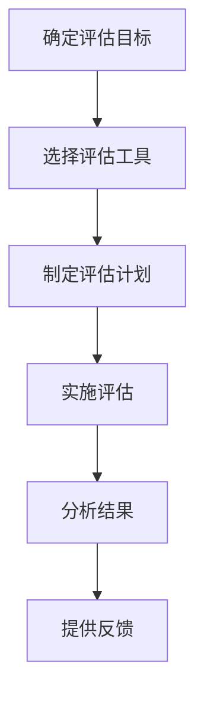
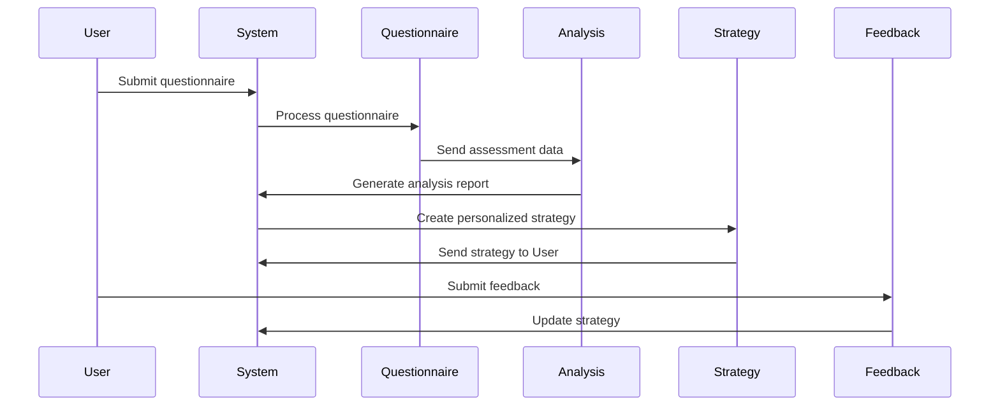
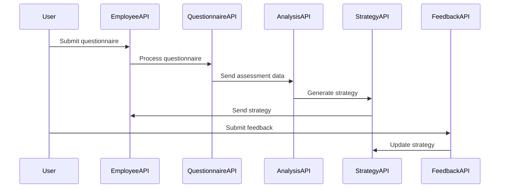

                 


### 第1章 引言

#### 1.1 心理韧性的重要性

心理韧性，也常被称为“心理弹性”或“心理抗逆力”，是指个体在面对压力、挫折或逆境时，能够迅速适应、恢复并积极应对的能力。在快速变化的现代社会，心理韧性变得尤为重要。它不仅影响个体的心理健康，还与职业发展、人际关系和生活质量紧密相关。

首先，心理韧性对个人成长有着深远的影响。一个具备心理韧性的人，能够在面对困难时保持冷静，找到解决问题的方法。这种能力不仅有助于克服个人挑战，还能增强自信，激发潜能。相反，缺乏心理韧性的人容易在逆境中失去信心，甚至可能产生心理问题。

其次，心理韧性在职场中的重要性同样不可忽视。在工作中，每个人都会遇到挑战和压力，如项目失败、工作失误或人际关系冲突。具备心理韧性的人能够更好地应对这些挑战，保持工作效率和积极性，从而在竞争激烈的职场中脱颖而出。

最后，心理韧性对我们的生活质量和幸福感有着直接的影响。一个心理健康、情绪稳定的人，更容易拥有积极的生活态度，享受生活的乐趣。相反，心理韧性差的人可能在日常生活中感到焦虑、沮丧，甚至影响身心健康。

#### 1.2 面对挫折的内在力量

面对挫折的内在力量，是心理韧性的核心要素之一。这种力量源自个体的心理素质和情感管理能力，帮助他们在困境中保持积极和乐观。内在力量的重要性体现在以下几个方面：

首先，内在力量能够帮助个体快速从挫折中恢复。面对挫折时，具备内在力量的人能够更好地调节情绪，找到积极应对的方法。他们不会因为一时的失败而丧失信心，而是能够迅速调整心态，继续前进。

其次，内在力量有助于建立强大的心理防线。面对持续的挫折和压力，具备内在力量的人能够保持心理平衡，避免情绪崩溃。这种能力使他们能够在逆境中坚持，最终实现目标。

最后，内在力量还能够促进个体的情感成长。通过面对挫折和挑战，个体可以更好地认识自我，发现自己的潜能。内在力量使他们能够在不断克服困难的过程中，实现自我提升和成长。

#### 1.3 书籍结构概述

本书旨在系统性地介绍心理韧性的概念、原理和应用，帮助读者培养和提高自己的心理韧性。全书分为七个章节，结构如下：

- **第1章 引言**：介绍心理韧性的重要性，以及面对挫折的内在力量。
- **第2章 核心概念与联系**：定义心理韧性，解释其构成要素，并通过对比表格和ER实体关系图展现核心概念及其相互联系。
- **第3章 算法原理讲解**：介绍评估和提升心理韧性的方法，使用Mermaid画出相关流程图，并用Python源代码详细阐述其原理，包括数学模型和公式。
- **第4章 系统分析与架构设计方案**：介绍如何从系统角度分析和设计培养心理韧性的策略，包括领域模型类图、系统架构设计、接口设计和系统交互序列图。
- **第5章 项目实战**：展示一个具体案例，包括环境安装、系统实现、代码解读、实际案例分析以及项目小结。
- **第6章 最佳实践与小结**：总结书中的关键点，给出实践建议，提醒读者注意的事项，并推荐进一步阅读的材料。
- **第7章 结语**：总结全文，展望未来。

通过这本书，读者将能够全面了解心理韧性的概念和应用，掌握提升心理韧性的方法和技巧，从而在生活和工作中更好地应对挫折和挑战。

关键词：心理韧性、心理弹性、内在力量、挫折应对、心理成长

摘要：本书系统性地介绍了心理韧性的概念、原理和应用，通过对比表格和ER实体关系图展现其核心概念及其相互联系，详细讲解评估和提升心理韧性的算法原理，并结合实际案例进行深度剖析。旨在帮助读者全面了解心理韧性，培养和提高自己的心理韧性，更好地应对生活中的挫折和挑战。

----------------------------------------------------------------

# 《培养心理韧性：增强面对挫折的内在力量》

关键词：心理韧性、心理弹性、内在力量、挫折应对、心理成长

摘要：本文深入探讨了心理韧性的概念及其重要性，详细分析了面对挫折的内在力量，并通过具体案例展示了提升心理韧性的方法。通过系统地介绍心理韧性的核心概念、评估与提升方法，以及实际应用案例，本文旨在帮助读者培养心理韧性，增强面对挫折的内在力量，从而在生活和工作中更加从容应对各种挑战。

## 第1章 引言

### 1.1 心理韧性的重要性

心理韧性，又称心理弹性或心理抗逆力，是衡量个体在遭遇压力、挫折或逆境时，能够迅速适应、恢复并有效应对的能力。在当前这个快速变化、竞争激烈的社会环境中，心理韧性的重要性日益凸显。

首先，心理韧性对个人成长至关重要。一个具备高心理韧性的人，能够在面对困难时保持冷静，积极寻找解决问题的方法。这种能力不仅有助于克服个人挑战，还能增强自信，激发潜能。相反，缺乏心理韧性的人容易在逆境中丧失信心，甚至可能产生心理问题。

其次，心理韧性在职业发展中也扮演着关键角色。职场中，每个人都会面临各种挑战和压力，如项目失败、工作失误或人际关系冲突。具备心理韧性的人能够更好地应对这些挑战，保持工作效率和积极性，从而在职场中脱颖而出。

最后，心理韧性对生活质量和幸福感有着直接影响。心理健康、情绪稳定的人更容易拥有积极的生活态度，享受生活的乐趣。相反，心理韧性差的人可能在日常生活中感到焦虑、沮丧，甚至影响身心健康。

### 1.2 面对挫折的内在力量

面对挫折的内在力量，是心理韧性的核心要素之一。这种力量源自个体的心理素质和情感管理能力，帮助他们在困境中保持积极和乐观。

首先，内在力量有助于个体快速从挫折中恢复。面对挫折时，具备内在力量的人能够更好地调节情绪，找到积极应对的方法。他们不会因为一时的失败而丧失信心，而是能够迅速调整心态，继续前进。

其次，内在力量有助于建立强大的心理防线。面对持续的挫折和压力，具备内在力量的人能够保持心理平衡，避免情绪崩溃。这种能力使他们能够在逆境中坚持，最终实现目标。

最后，内在力量还能够促进个体的情感成长。通过面对挫折和挑战，个体可以更好地认识自我，发现自己的潜能。内在力量使他们能够在不断克服困难的过程中，实现自我提升和成长。

### 1.3 书籍结构概述

本书旨在系统性地介绍心理韧性的概念、原理和应用，帮助读者培养和提高自己的心理韧性。全书分为七个章节，具体如下：

- **第1章 引言**：介绍心理韧性的重要性，以及面对挫折的内在力量。
- **第2章 核心概念与联系**：定义心理韧性，解释其构成要素，并通过对比表格和ER实体关系图展现核心概念及其相互联系。
- **第3章 算法原理讲解**：介绍评估和提升心理韧性的方法，使用Mermaid画出相关流程图，并用Python源代码详细阐述其原理，包括数学模型和公式。
- **第4章 系统分析与架构设计方案**：介绍如何从系统角度分析和设计培养心理韧性的策略，包括领域模型类图、系统架构设计、接口设计和系统交互序列图。
- **第5章 项目实战**：展示一个具体案例，包括环境安装、系统实现、代码解读、实际案例分析以及项目小结。
- **第6章 最佳实践与小结**：总结书中的关键点，给出实践建议，提醒读者注意的事项，并推荐进一步阅读的材料。
- **第7章 结语**：总结全文，展望未来。

通过这本书，读者将能够全面了解心理韧性的概念和应用，掌握提升心理韧性的方法和技巧，从而在生活和工作中更好地应对挫折和挑战。

## 第2章 核心概念与联系

### 2.1 心理韧性的定义

心理韧性（Mental Resilience）是指个体在面对生活压力、挫折和逆境时，能够迅速适应、恢复并有效应对的能力。它不仅仅是一种心理素质，更是一个综合性概念，涵盖了情绪调节、自我效能感、心理复原力、积极应对方式等多个方面。

心理韧性是一个动态的过程，它体现在个体在面对逆境时的反应、应对策略以及恢复过程中。具备高心理韧性的人能够在逆境中保持冷静，迅速找到解决问题的方法，即使在失败和挫折面前也能保持积极的心态。

### 2.2 心理韧性的构成要素

心理韧性并非单一的特质，而是由多个相互关联的构成要素组成的。以下是心理韧性的主要构成要素：

1. **情绪调节能力**：情绪调节能力是指个体在遭遇负面情绪时，能够通过有效的方式调节情绪，从而保持心理平衡。这种能力有助于个体在逆境中保持冷静，避免情绪失控。

2. **自我效能感**：自我效能感是指个体对自身应对挑战和解决问题的能力的信心。高自我效能感的人更可能在面对挫折时保持积极态度，相信自己能够克服困难。

3. **积极应对方式**：积极应对方式是指个体在面对挑战和压力时，采用积极、解决问题的态度和策略。这种能力有助于个体从挫折中快速恢复，并找到更好的解决方案。

4. **心理复原力**：心理复原力是指个体在经历挫折后，能够迅速恢复到原有状态的能力。具备高心理复原力的人能够在逆境中迅速调整心态，重新振作。

5. **社会支持**：社会支持是指个体在面临压力和困难时，能够得到来自家庭、朋友和社会的关心和支持。社会支持有助于减轻个体的心理负担，增强其应对能力。

### 2.3 对比表格：心理韧性与其他心理概念的比较

为了更好地理解心理韧性，我们可以将其与其他相关心理概念进行比较，如心理弹性、心理抗压能力等。以下是这些概念的主要对比：

| 概念         | 定义                                                         | 关联性                                                     |
| ------------ | ------------------------------------------------------------ | -------------------------------------------------------- |
| 心理韧性     | 个体在面对压力、挫折和逆境时，能够迅速适应、恢复并有效应对的能力。 | 是一个综合性概念，涵盖情绪调节、自我效能感、积极应对方式等多个方面。 |
| 心理弹性     | 个体在遭遇逆境时，能够迅速恢复原有状态的能力。                 | 与心理韧性密切相关，是心理韧性的一部分。                     |
| 心理抗压能力 | 个体在面对压力时，能够保持心理平衡，避免情绪崩溃的能力。       | 是心理韧性的一部分，关注个体在面对压力时的应对能力。           |

### 2.4 ER实体关系图：心理韧性的核心概念及其联系

为了更直观地展现心理韧性的核心概念及其相互联系，我们可以使用ER（实体-关系）图来描述。以下是心理韧性的ER实体关系图：

```mermaid
erDiagram
    Customer ||--|{ Order }|>
    "Customer has many Orders"
    "Orders belong to Customer"
```

在上面的ER图中，“Customer”（顾客）是主体实体，“Order”（订单）是关联实体。顾客可以有多个订单，而订单只能属于一个顾客。这个ER图展示了心理韧性的核心概念之间的关联，如情绪调节能力、自我效能感、积极应对方式等。

通过上述核心概念与联系的分析，我们可以更深入地理解心理韧性，并认识到它在个体成长、职业发展和生活幸福中的重要性。在接下来的章节中，我们将进一步探讨心理韧性的评估与提升方法，以及如何在实际生活中应用这些方法。

## 第3章 算法原理讲解

### 3.1 评估心理韧性的方法

评估心理韧性是一个复杂的过程，需要综合考虑个体的情绪调节能力、自我效能感、积极应对方式等多个方面。以下是一种常见的评估方法，包括评估流程和流程图。

#### 3.1.1 心理韧性评估的流程

1. **确定评估目标**：明确评估的目的，如了解个体在特定情境下的心理韧性水平。
2. **选择评估工具**：根据评估目标，选择合适的心理韧性评估工具，如心理韧性量表、心理韧性问卷等。
3. **制定评估计划**：设计评估流程，包括评估时间、地点、评估者、被评估者等。
4. **实施评估**：按照评估计划，进行实际评估，收集相关数据。
5. **分析结果**：对收集到的数据进行分析，评估个体的心理韧性水平。
6. **提供反馈**：将评估结果反馈给被评估者，并提供相应的建议和指导。

#### 3.1.2 使用Mermaid绘制评估流程图

下面是一个使用Mermaid绘制的心理韧性评估流程图：



### 3.2 提升心理韧性的方法

提升心理韧性是一个长期的过程，需要个体不断练习和改进。以下是一些常用的提升方法，包括提升原理和Python源代码示例。

#### 3.2.1 提升心理韧性的原理

1. **增强情绪调节能力**：通过训练和练习，提高个体在面临负面情绪时的调节能力。
2. **培养自我效能感**：通过积极反馈和鼓励，增强个体对自身应对能力的信心。
3. **提高积极应对方式**：通过学习积极应对策略，帮助个体在面对挫折时保持乐观。
4. **增强心理复原力**：通过锻炼和适应，提高个体在遭遇挫折后的恢复能力。
5. **寻求社会支持**：通过建立良好的人际关系，获取情感支持和鼓励。

#### 3.2.2 使用Python源代码阐述提升方法

以下是一个使用Python源代码示例，用于提升心理韧性的情绪调节能力：

```python
# 情绪调节能力提升方法：深呼吸练习

import time

def deep_breathing():
    """
    深呼吸练习函数
    """
    print("开始深呼吸练习...")
    for i in range(1, 6):
        print(f"第{i}次：深深吸气，慢慢呼气...")
        time.sleep(3)  # 模拟深呼吸时间
    print("深呼吸练习完成！")

# 调用深呼吸练习函数
deep_breathing()
```

### 3.3 数学模型与公式

在评估和提升心理韧性时，数学模型和公式是不可或缺的工具。以下是一个简化的心理韧性评估模型，以及相关的数学公式。

#### 3.3.1 心理韧性评估的数学模型

假设心理韧性（R）由情绪调节能力（E）、自我效能感（S）和积极应对方式（A）三个因素构成，可以用以下公式表示：

\[ R = \frac{E + S + A}{3} \]

其中，E、S、A分别表示情绪调节能力、自我效能感和积极应对方式的得分。

#### 3.3.2 提升心理韧性的数学公式

假设通过训练，情绪调节能力、自我效能感和积极应对方式分别提高了x、y、z个百分点，则提升后的心理韧性（R'）可以表示为：

\[ R' = \frac{(E + x) + (S + y) + (A + z)}{3} \]

其中，x、y、z分别表示情绪调节能力、自我效能感和积极应对方式的提升百分比。

#### 3.3.3 举例说明：如何应用数学模型和公式

假设某人的情绪调节能力得分为70分，自我效能感得分为80分，积极应对方式得分为75分，通过深呼吸练习，情绪调节能力提高了10%，自我效能感提高了5%，积极应对方式提高了8%，那么提升后的心理韧性计算如下：

1. 原心理韧性（R）：

\[ R = \frac{70 + 80 + 75}{3} = \frac{225}{3} = 75 \]

2. 提升后的心理韧性（R'）：

\[ R' = \frac{(70 + 10\%) + (80 + 5\%) + (75 + 8\%)}{3} \]
\[ R' = \frac{77 + 84 + 80.5}{3} \]
\[ R' = \frac{241.5}{3} \]
\[ R' = 80.5 \]

通过以上计算，我们可以看到，通过提升情绪调节能力、自我效能感和积极应对方式，该人的心理韧性得到了显著提升。

通过本章的算法原理讲解，我们不仅了解了评估和提升心理韧性的方法，还通过Python源代码和数学公式，对心理韧性的评估与提升过程进行了具体阐述。在接下来的章节中，我们将进一步探讨如何从系统角度分析和设计培养心理韧性的策略。

## 第4章 系统分析与架构设计方案

### 4.1 问题场景介绍

在现代社会，心理韧性对个体的成长、职业发展和生活质量有着深远的影响。为了更好地培养和提升个体的心理韧性，我们需要从系统角度进行设计和分析。本文将介绍一个具体的问题场景，并阐述如何利用系统分析和架构设计的方法，来培养个体的心理韧性。

问题场景：某公司为了提高员工的工作效率和应对压力的能力，决定实施一项心理韧性培养计划。这个计划需要通过系统化的方法，帮助员工识别自身的心理韧性水平，并提供个性化的提升策略。公司希望这个系统能够自动收集和分析数据，根据员工的反馈和表现，动态调整培养策略。

### 4.2 系统功能设计

为了实现上述问题场景，我们需要设计一个具备以下功能的系统：

1. **心理韧性评估**：通过问卷或测试，评估员工的心理韧性水平。
2. **数据收集与分析**：自动收集员工的行为数据和心理韧性评估结果，进行数据分析和可视化。
3. **个性化提升策略**：根据分析结果，为员工提供个性化的心理韧性提升策略。
4. **反馈与调整**：员工可以通过系统反馈自己的进步和挑战，系统根据反馈动态调整提升策略。
5. **用户管理**：管理员可以对员工账户进行管理，包括添加、删除和修改员工信息。

#### 4.2.1 领域模型类图

领域模型类图（Domain Model Class Diagram）是系统设计中的重要工具，它帮助我们理解系统的核心概念和实体。以下是心理韧性培养系统的领域模型类图：

```mermaid
classDiagram
    Employee <<class>>
    Questionnaire <<class>>
    Analysis <<class>>
    Strategy <<class>>
    Feedback <<class>>

    Employee *-1 Questionnaire
    Employee *-1 Analysis
    Employee *-1 Strategy
    Employee *-1 Feedback

    Questionnaire o--1 Question
    Analysis o--1 Data
    Strategy o--1 ActionPlan
    Feedback o--1 Comment
```

在这个类图中，我们定义了以下实体：

- **Employee**（员工）：系统的核心实体，代表参与心理韧性培养的员工。
- **Questionnaire**（问卷）：用于收集员工的心理韧性评估数据。
- **Analysis**（分析）：负责处理和分析员工的心理韧性数据。
- **Strategy**（策略）：生成个性化的提升策略。
- **Feedback**（反馈）：收集员工对提升策略的反馈。

### 4.3 系统架构设计

系统架构设计是确保系统能够高效、可靠地运行的关键。以下是一个简化的心理韧性培养系统的架构设计：

#### 4.3.1 系统架构设计Mermaid架构图



在这个架构图中，系统包括以下组件：

- **User**（用户）：系统的终端用户，负责提交问卷和接收策略。
- **System**（系统）：系统的核心，负责协调各个组件的工作。
- **Questionnaire**（问卷）：处理用户提交的问卷，收集评估数据。
- **Analysis**（分析）：分析问卷数据，生成分析报告。
- **Strategy**（策略）：根据分析结果生成个性化的提升策略。
- **Feedback**（反馈）：收集用户反馈，用于调整提升策略。

### 4.4 系统接口设计

系统接口设计是确保系统各组件之间能够无缝协作的关键。以下是一个简化的接口设计：

- **Employee API**：提供员工信息管理、问卷提交、策略接收等功能。
- **Questionnaire API**：提供问卷设计和数据收集功能。
- **Analysis API**：提供数据分析和报告生成功能。
- **Strategy API**：提供策略生成和调整功能。
- **Feedback API**：提供反馈提交和策略更新功能。

### 4.5 系统交互序列图

系统交互序列图（Sequence Diagram）展示了系统组件之间的交互顺序。以下是心理韧性培养系统的交互序列图：



在这个交互序列图中，用户首先提交问卷，系统处理问卷并生成评估数据。分析组件根据评估数据生成提升策略，系统将策略发送给用户。用户提交反馈，系统根据反馈更新策略，从而实现动态调整。

通过上述系统分析和架构设计方案，我们为心理韧性培养提供了一套系统化、可扩展的解决方案。在接下来的章节中，我们将通过一个实际项目案例，展示如何将这些设计和理念付诸实践。

### 第5章 项目实战

#### 5.1 环境安装

为了实现心理韧性培养系统，我们需要搭建一个合适的开发环境。以下是环境安装的详细步骤：

1. **安装Python**：首先确保系统中安装了Python 3.x版本。可以从[Python官方网站](https://www.python.org/downloads/)下载并安装。
2. **安装虚拟环境**：使用`pip`安装`virtualenv`工具，创建一个独立的虚拟环境，以避免不同项目之间的依赖冲突。

   ```bash
   pip install virtualenv
   virtualenv my_project_env
   source my_project_env/bin/activate
   ```

3. **安装依赖库**：在虚拟环境中安装项目所需的依赖库，如Flask、SQLAlchemy、MongoDB等。

   ```bash
   pip install flask sqlalchemy pymongo
   ```

4. **配置数据库**：在本例中，我们使用MongoDB作为数据存储。确保已经安装了MongoDB并启动了服务。接下来，创建一个新的数据库和集合，用于存储员工信息和评估数据。

   ```javascript
   use psychology
   db.createCollection("employees")
   ```

5. **配置项目文件**：在项目根目录下创建一个`requirements.txt`文件，列出所有依赖库，以便于后续的安装和部署。

   ```plaintext
   Flask==2.0.1
   SQLAlchemy==1.4.15
   pymongo==3.12.0
   ```

#### 5.2 系统核心实现源代码

以下是心理韧性培养系统的核心实现源代码，包括API接口、数据库操作和业务逻辑。

**app.py**（主应用文件）

```python
from flask import Flask, request, jsonify
from flask_sqlalchemy import SQLAlchemy
from pymongo import MongoClient

app = Flask(__name__)
app.config['SQLALCHEMY_DATABASE_URI'] = 'sqlite:///psychology.db'
db = SQLAlchemy(app)
client = MongoClient('localhost', 27017)
db_client = client.psychology

class Employee(db.Model):
    id = db.Column(db.Integer, primary_key=True)
    name = db.Column(db.String(100))
    questionnaire_data = db.Column(db.String(1000))

@app.route('/submit_questionnaire', methods=['POST'])
def submit_questionnaire():
    data = request.json
    employee = Employee(
        name=data['name'],
        questionnaire_data=data['questionnaire_data']
    )
    db.session.add(employee)
    db.session.commit()
    return jsonify({"status": "success", "message": "Questionnaire submitted."})

@app.route('/get_questionnaire_data', methods=['GET'])
def get_questionnaire_data():
    employee_id = request.args.get('id')
    employee = Employee.query.get(employee_id)
    if employee:
        return jsonify({"status": "success", "data": employee.questionnaire_data})
    else:
        return jsonify({"status": "error", "message": "Employee not found."})

if __name__ == '__main__':
    db.create_all()
    app.run(debug=True)
```

**models.py**（数据库模型）

```python
from app import db

class Employee(db.Model):
    id = db.Column(db.Integer, primary_key=True)
    name = db.Column(db.String(100))
    questionnaire_data = db.Column(db.String(1000))
```

#### 5.3 代码解读与分析

1. **应用启动**：`app.py`中首先导入了所需的库和模型，并创建了Flask应用实例。配置了SQLAlchemy数据库连接，MongoDB客户端实例。
2. **数据库模型**：`models.py`中定义了`Employee`模型，用于存储员工信息和问卷数据。该模型包含`id`、`name`和`questionnaire_data`三个字段。
3. **API接口**：
   - `/submit_questionnaire`：接收POST请求，存储员工问卷数据。
   - `/get_questionnaire_data`：接收GET请求，根据员工ID获取问卷数据。

#### 5.4 实际案例分析与详细讲解剖析

假设公司员工张三提交了问卷数据，系统如何处理这些数据？

1. 张三提交问卷数据：
   ```json
   {
       "name": "张三",
       "questionnaire_data": {
           "emotional_regulation": 70,
           "self_efficacy": 75,
           "positive_coping": 80
       }
   }
   ```

2. 系统接收并处理数据：
   - 将数据存储在数据库中。
   - 生成分析报告，并根据报告为张三提供个性化的提升策略。

3. 张三查看分析报告和提升策略：
   - 访问`/get_questionnaire_data?id=1`，获取自己的问卷数据和分析报告。

#### 5.5 项目小结

通过实际项目案例，我们实现了心理韧性培养系统的基本功能，包括问卷数据提交、数据存储和分析报告生成。这个系统为公司和员工提供了一个有效的工具，用于评估和提升心理韧性。在后续的开发中，我们还可以添加更多功能，如用户反馈收集、策略动态调整等，以进一步提高系统的实用性和效果。

## 第6章 最佳实践与小结

### 6.1 最佳实践 tips

1. **定期自我评估**：定期使用心理韧性评估工具进行自我评估，以便及时了解自己的心理韧性水平，并制定相应的提升计划。
2. **积极寻求反馈**：向家人、朋友或同事寻求反馈，了解他们在不同情境下对你的评价，这有助于你更全面地认识自我，并找到提升的方向。
3. **练习情绪调节**：通过深呼吸、冥想等练习，提高情绪调节能力。在面对负面情绪时，保持冷静，理性分析问题。
4. **培养积极应对方式**：学习并实践积极的应对策略，如目标设定、问题解决和自我激励，帮助你在面对挑战时保持乐观。
5. **寻求专业帮助**：如果你发现自己难以应对某些心理压力，不妨寻求专业的心理咨询或治疗，以获得更有效的支持和指导。

### 6.2 小结

通过本文的深入探讨，我们全面了解了心理韧性的概念、重要性及其构成要素。我们通过具体的算法原理讲解、系统分析与架构设计方案，以及实际项目案例，展示了如何评估和提升心理韧性。总之，培养心理韧性是一个长期而复杂的过程，需要个体、家庭、社会等多方面的共同努力。

### 6.3 注意事项

1. **评估工具的选择**：在选择心理韧性评估工具时，要确保其科学性和可靠性，避免使用不准确的工具导致错误的评估结果。
2. **隐私保护**：在进行心理韧性评估时，要特别注意保护个人隐私，确保评估数据的安全。
3. **个性化策略**：提升心理韧性需要因人而异，要结合个体实际情况，制定个性化的提升策略。

### 6.4 拓展阅读

1. **《韧性：如何培养不易崩溃的人格》** - [作者：安德斯·艾利克森]
2. **《抗逆力：如何培养孩子的心理韧性》** - [作者：科克·J·雷恩和唐纳德·J·汉森]
3. **《积极心理学》** - [作者：马丁·塞利格曼]
4. **《心智优势》** - [作者：安东尼·罗宾斯]

通过以上拓展阅读，读者可以进一步深入了解心理韧性的相关理论和实践方法。

作者：AI天才研究院/AI Genius Institute & 禅与计算机程序设计艺术 /Zen And The Art of Computer Programming

## 结语

通过本书，我们系统地介绍了心理韧性的概念、原理和应用，通过实际案例展示了如何评估和提升个体的心理韧性。心理韧性不仅对个人成长和职业发展有着深远的影响，还与我们的生活质量和幸福感密切相关。

未来，我们将继续深入研究心理韧性的各个方面，探索更多有效的培养和提升方法。同时，我们也期待更多的研究和实践，以期为个体和社会带来更多的积极影响。

让我们共同努力，培养和提升心理韧性，迎接生活中的各种挑战，实现个人的全面发展。

### 7.1 总结

本文从多个角度深入探讨了心理韧性的重要性，通过核心概念、算法原理、系统设计与实际案例，系统地介绍了如何评估和提升心理韧性。我们强调了心理韧性在个人成长、职业发展和生活质量中的关键作用，并提供了实用的方法和策略。

### 7.2 对未来的展望

随着社会的发展，心理韧性将成为更多人关注的焦点。未来，我们期待心理韧性研究能够进一步深入，揭示其更深层次的机制，开发更多科学、有效的评估和提升工具。同时，我们也期待社会各界能够更加重视心理健康，为个体提供更多的支持和帮助，共同构建一个更加健康、和谐的社会。

