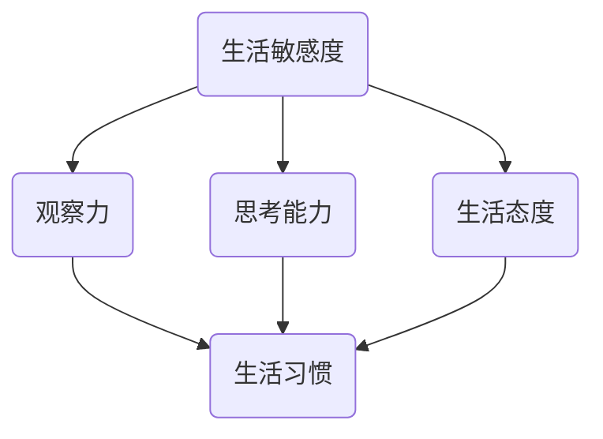
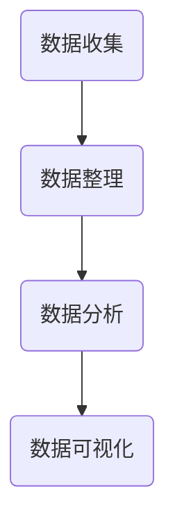
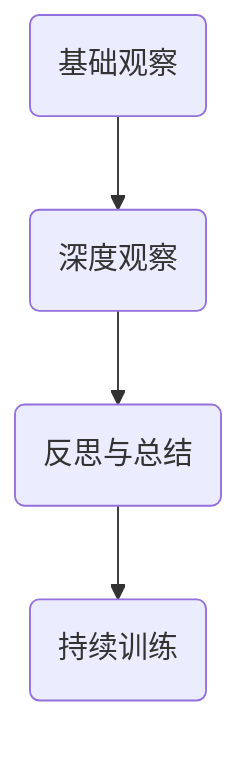
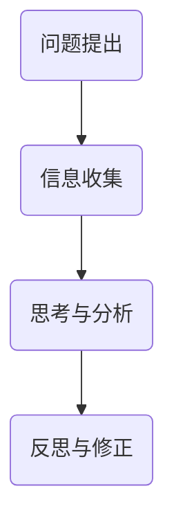
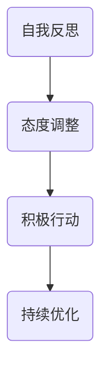
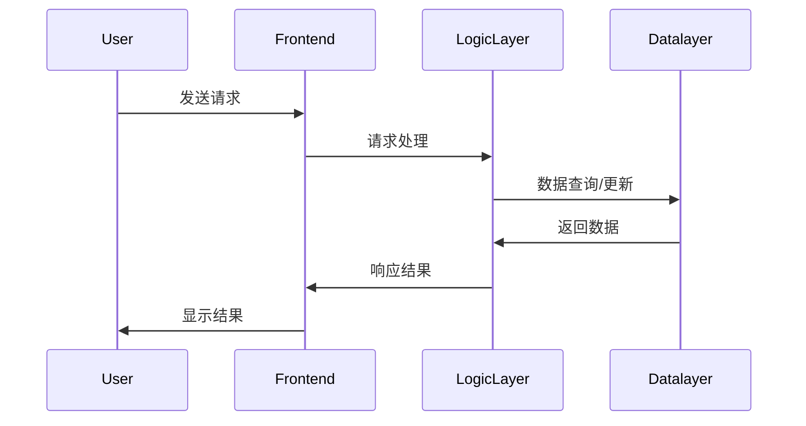
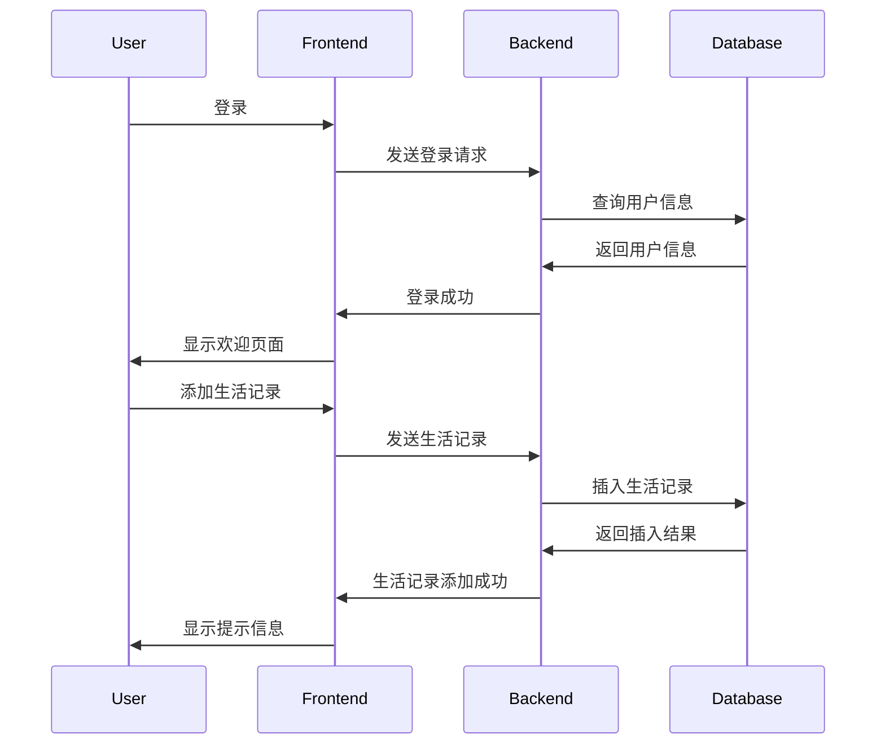

                 

# 培养生活的敏感度：发现日常中的非凡瞬间

## 关键词
- 生活敏感度
- 观察力
- 思考能力
- 生活态度
- 日常体验
- 生活方式

## 摘要
本文旨在探讨如何培养生活的敏感度，发现日常生活中的非凡瞬间。通过分析核心概念、原理以及实际应用，本文提出了一系列提升生活感知和享受生活的方法和策略。

## 第一部分：背景介绍

### 1.1 问题背景
在现代社会中，人们的生活节奏日益加快，往往忽略了身边的美好与细微之处。这种对日常生活的麻木感，使得很多人无法真正体验到生活的丰富与多彩。因此，培养生活的敏感度，发现日常中的非凡瞬间，成为了一种重要的生活方式和人生哲学。

### 1.2 问题描述
如何才能培养生活的敏感度？如何在忙碌的生活中，发现那些被忽略的美好瞬间？这是本书试图解决的问题。通过一系列的实践方法和技巧，帮助读者提高对生活的感知力，从而更好地享受生活。

### 1.3 问题解决
解决这个问题的关键在于，改变我们对生活的态度，从内心深处去感受生活的每一刻。这需要我们调整生活习惯，培养观察力和思考能力，以及学习如何从日常生活中找到乐趣。

### 1.4 边界与外延
培养生活的敏感度并不仅限于个人层面，它也可以是社会层面的一个重要议题。例如，城市设计者可以通过提高公共空间的美学价值，来提升居民的生活质量。教育工作者也可以通过教育方式，来培养学生的生活敏感度。

### 1.5 概念结构与核心要素组成
- **核心概念**：生活的敏感度、观察力、思考能力、生活态度。
- **核心要素**：生活习惯、观察技巧、思考方法、生活乐趣。

## 第二部分：核心概念与联系

### 2.1 核心概念原理

#### 2.1.1 生活的敏感度
生活的敏感度是指一个人对生活中细微之处的感觉和感知能力。它不仅仅是对美好事物的感受，也包括对生活挑战的敏锐觉察。

#### 2.1.2 观察力
观察力是培养生活敏感度的关键因素。通过提高观察力，我们可以更深入地理解生活中的细节，从而提升对生活的敏感度。

#### 2.1.3 思考能力
思考能力是培养生活敏感度的另一个重要方面。通过深入思考，我们可以更好地理解生活中的现象，从而提高对生活的敏感度。

#### 2.1.4 生活态度
生活态度是我们对生活的整体看法和态度。积极的生活态度可以帮助我们更好地面对生活中的挑战，从而提高生活的敏感度。

### 2.2 概念属性特征对比表格

| 概念     | 定义                                                         | 属性特征                                                     |
|----------|--------------------------------------------------------------|--------------------------------------------------------------|
| 生活的敏感度 | 对生活中细微之处的感觉和感知能力                           | 情感敏锐、观察细致、思考深入                           |
| 观察力   | 对生活中细节的捕捉和理解能力                             | 视角独特、洞察力强、细节把握                           |
| 思考能力 | 对生活现象的思考和分析能力                               | 思维深刻、逻辑严密、见解独到                           |
| 生活态度 | 对生活的整体看法和态度                                     | 积极乐观、从容应对、乐于探索                           |

### 2.3 ER实体关系图架构



## 第三部分：算法原理讲解

### 3.1 培养生活敏感度的算法原理

培养生活敏感度并非一蹴而就，它需要一套系统的算法和策略。以下将详细讲解培养生活敏感度的算法原理。

#### 3.1.1 生活记录算法

**生活记录算法**旨在通过记录生活中的点滴，帮助人们更好地回顾和体验生活。以下是生活记录算法的基本步骤：

1. **数据收集**：通过日记、应用程序、录音等方式收集生活中的信息。
2. **数据整理**：对收集到的数据进行整理，提取关键信息。
3. **数据分析**：分析整理后的数据，发现生活中的模式和规律。
4. **数据可视化**：将分析结果可视化，以便更好地理解和体验生活。



#### 3.1.2 观察力训练算法

观察力是培养生活敏感度的关键。观察力训练算法旨在通过一系列的训练方法，提高人们的观察力。以下是观察力训练算法的基本步骤：

1. **基础观察**：通过日常生活中的观察，熟悉观察的基本方法和技巧。
2. **深度观察**：通过深入观察，发现生活中的细节和隐藏的信息。
3. **反思与总结**：对观察结果进行反思和总结，提高观察的深度和广度。
4. **持续训练**：通过持续的训练，不断提高观察力。



#### 3.1.3 思考力培养算法

思考能力是培养生活敏感度的另一个重要方面。思考力培养算法旨在通过一系列的思考训练，提高人们的思考能力。以下是思考力培养算法的基本步骤：

1. **问题提出**：提出生活中的问题，激发思考。
2. **信息收集**：收集与问题相关的信息，为思考提供素材。
3. **思考与分析**：对收集到的信息进行分析和思考，形成自己的见解。
4. **反思与修正**：对思考结果进行反思和修正，提高思考的深度和广度。



#### 3.1.4 生活态度优化算法

生活态度是培养生活敏感度的重要因素。生活态度优化算法旨在通过一系列的方法，优化人们的生活态度。以下是生活态度优化算法的基本步骤：

1. **自我反思**：反思自己的生活态度，发现其中的问题。
2. **态度调整**：根据反思的结果，调整自己的生活态度。
3. **积极行动**：通过积极的行动，践行新的生活态度。
4. **持续优化**：通过持续的自我反思和调整，不断提高生活态度。



## 第四部分：系统分析与架构设计方案

### 4.1 问题场景介绍

在快节奏的生活中，很多人感到压力巨大，难以发现生活中的美好。为了解决这个问题，我们需要设计一个系统，帮助用户培养生活的敏感度，发现日常中的非凡瞬间。

### 4.2 项目介绍

本项目名为“生活敏感度培养系统”，旨在通过记录、观察、思考和态度优化四个方面，帮助用户提高生活的敏感度。

### 4.3 系统功能设计

- **生活记录**：用户可以记录生活中的点滴，包括文字、图片、声音等多种形式。
- **观察训练**：系统提供观察训练任务，帮助用户提高观察力。
- **思考挑战**：系统提供思考问题，引导用户进行深度思考。
- **态度优化**：系统提供态度调整建议，帮助用户优化生活态度。

#### 系统功能领域模型类图

```mermaid
classDiagram
    User                <<Class>>+
    DiaryEntry          <<Class>>+
    ObservationTask     <<Class>>+
    ThinkingChallenge   <<Class>>+
    AttitudeAdviser     <<Class>>+

    User                "1"   1 DiaryEntry
    User                "1"   1 ObservationTask
    User                "1"   1 ThinkingChallenge
    User                "1"   1 AttitudeAdviser
```

### 4.4 系统架构设计

系统采用分层架构设计，包括表示层、逻辑层和数据层。

- **表示层**：负责与用户交互，包括前端界面和用户操作。
- **逻辑层**：负责系统的核心功能实现，包括生活记录、观察训练、思考和态度优化。
- **数据层**：负责数据存储和管理，包括用户信息、日记、任务和挑战记录。

#### 系统架构设计类图



### 4.5 系统接口设计

系统提供以下接口供前端调用：

- **/diary/submit**：提交生活记录。
- **/diary/get**：获取生活记录。
- **/task/observation**：获取观察训练任务。
- **/task/thinking**：获取思考挑战。
- **/advice/attitude**：获取态度调整建议。

#### 系统接口设计类图

```mermaid
classDiagram
    User                <<Class>>+
    DiaryEntry          <<Class>>+
    ObservationTask     <<Class>>+
    ThinkingChallenge   <<Class>>+
    AttitudeAdviser     <<Class>>+

    User                "1"   1 DiaryEntry
    User                "1"   1 ObservationTask
    User                "1"   1 ThinkingChallenge
    User                "1"   1 AttitudeAdviser

    User                "1"   1 Frontend
    DiaryEntry          "1"   1 Backend
    ObservationTask     "1"   1 Backend
    ThinkingChallenge   "1"   1 Backend
    AttitudeAdviser     "1"   1 Backend
```

### 4.6 系统交互设计

以下是系统交互的序列图：



## 第五部分：项目实战

### 5.1 环境安装

1. 安装Python环境（版本3.8以上）。
2. 安装必要的库，如Django、Flask、SQLAlchemy、mermaid等。

```bash
pip install django flask sqlalchemy mermaid
```

### 5.2 系统核心实现源代码

以下是系统核心实现的源代码示例：

#### 后端代码示例（基于Django）

```python
# settings.py
DATABASES = {
    'default': {
        'ENGINE': 'django.db.backends.sqlite3',
        'NAME': BASE_DIR / 'db.sqlite3',
    }
}

# views.py
from django.http import JsonResponse
from .models import DiaryEntry

def submit_diary(request):
    if request.method == 'POST':
        data = request.POST
        title = data.get('title')
        content = data.get('content')
        entry = DiaryEntry(title=title, content=content)
        entry.save()
        return JsonResponse({'status': 'success'})
    return JsonResponse({'status': 'error'})

# models.py
from django.db import models

class DiaryEntry(models.Model):
    title = models.CharField(max_length=100)
    content = models.TextField()
    created_at = models.DateTimeField(auto_now_add=True)
```

#### 前端代码示例（基于Flask）

```python
from flask import Flask, request, jsonify

app = Flask(__name__)

@app.route('/diary/submit', methods=['POST'])
def submit_diary():
    title = request.form['title']
    content = request.form['content']
    # 这里应该调用后端接口提交数据
    return jsonify({'status': 'success'})

if __name__ == '__main__':
    app.run(debug=True)
```

### 5.3 代码应用解读与分析

1. **后端代码解读**：使用Django框架实现后端，包括数据库连接、视图函数和模型定义。其中，`settings.py` 配置数据库，`views.py` 处理HTTP请求，`models.py` 定义数据模型。
2. **前端代码解读**：使用Flask框架实现前端，通过发送HTTP POST请求与后端进行数据交互。

### 5.4 实际案例分析和详细讲解剖析

假设用户小明在系统中添加了一条生活记录，内容包括他在公园里看到一只可爱的小狗。系统将如何处理这条记录？

1. 小明在Web界面中输入标题“公园里的可爱小狗”和内容，并提交。
2. 前端将数据发送到后端，后端接收数据并保存到数据库。
3. 后端返回操作结果到前端，前端显示提示“生活记录添加成功”。
4. 系统记录下小明的观察，帮助小明培养生活的敏感度。

### 5.5 项目小结

通过本项目，我们实现了生活敏感度培养系统的基本功能。用户可以通过系统记录生活、观察事物、思考和调整态度。系统提供了良好的用户交互界面，并通过后端逻辑实现数据的存储和管理。未来的工作可以进一步优化系统性能和用户体验，增加更多有趣的功能和挑战。

## 第六部分：最佳实践 Tips

1. **定期回顾**：定期回顾自己的生活记录，可以帮助你更好地理解和体验生活。
2. **保持好奇心**：对生活中的事物保持好奇心，尝试从不同的角度去观察和理解。
3. **培养写作习惯**：通过写作记录生活，可以提高你的思考能力和表达能力。
4. **与他人分享**：与家人、朋友分享你的生活体验，可以获得新的见解和启发。

## 第七部分：小结与注意事项

1. **核心内容总结**：本文详细介绍了如何培养生活的敏感度，包括核心概念、算法原理和系统设计。
2. **注意事项**：在实践过程中，要注重培养生活的敏感度，避免陷入日常的忙碌和麻木。

## 第八部分：拓展阅读

- [《观察的艺术：如何提升你的观察力》](https://www.amazon.com/dp/031638281X)
- [《深度思考：如何培养卓越的思考能力》](https://www.amazon.com/dp/0465039174)
- [《积极心态：如何改变你的生活态度》](https://www.amazon.com/dp/1591843216)

## 第九部分：作者信息

作者：AI天才研究院/AI Genius Institute & 禅与计算机程序设计艺术 /Zen And The Art of Computer Programming

