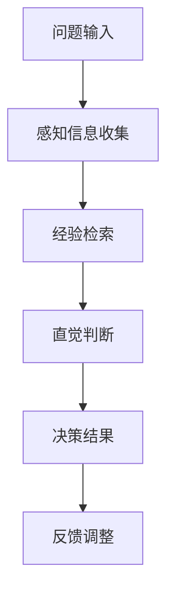
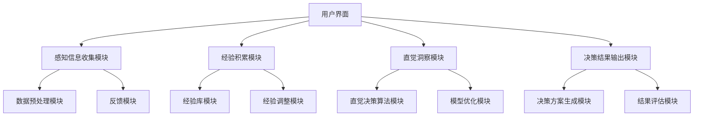
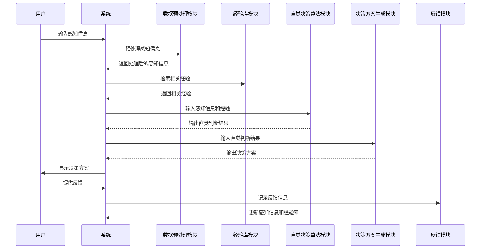

                 

# 培养直觉决策能力：跟随内在智慧的指引

## 关键词

直觉决策能力、内在智慧、决策效率、决策质量、实践方法、心理学、认知科学

## 摘要

本文旨在探讨直觉决策能力的培养和提升，帮助读者理解直觉决策的原理，掌握有效的实践方法。通过深入分析直觉决策的特点、原理和实际应用，本文旨在引导读者跟随内在智慧的指引，提高决策效率和质量，从而在日常生活和工作中取得更好的成果。

### 目录大纲设计思路

1. **确定书的核心主题**：首先明确《培养直觉决策能力：跟随内在智慧的指引》这本书的核心主题和目标读者。该书的主题是关于直觉决策能力的培养，目标读者可能是希望提高决策效率的企业管理人员、创业者、心理学研究者或是任何对决策心理学感兴趣的人。

2. **核心章节安排**：确定书的结构，根据主题设置章节，确保每个章节都能完整地覆盖相关内容。按照逻辑顺序，首先介绍什么是直觉决策能力，然后探讨直觉决策的原理，再介绍培养直觉决策能力的实践方法，最后通过案例研究来验证和巩固这些方法。

3. **细化章节内容**：在每个章节内部，使用小节来进一步细化内容。例如，在“什么是直觉决策能力”这一章中，可以设置小节来探讨直觉决策的定义、特点、与逻辑思维的比较等。

4. **使用图表和公式**：为了增强内容的理解和记忆，适当使用图表和数学公式。例如，可以通过一个ER实体关系图来展示直觉决策能力的关键要素，使用数学公式来解释决策过程中的某些模型或算法。

5. **实战案例**：为了使读者能够将理论知识应用到实践中，每个章节后可以加入一个或几个案例研究，详细分析案例中的决策过程和结果。

6. **总结与拓展**：在每个章节的结尾，提供总结和小结，帮助读者回顾和巩固本章内容。同时，可以提出一些注意事项、最佳实践建议，以及推荐拓展阅读，以引导读者进一步学习和探索。

### 第一部分：背景介绍

#### 第1章：问题背景

1.1 **问题背景**

在现代社会，决策的复杂性和多样性不断增加，传统的逻辑思维和数据分析方法已经无法满足人们对快速、准确决策的需求。直觉决策作为一种重要的决策方式，逐渐受到人们的重视。然而，如何培养和提高直觉决策能力，仍然是一个亟待解决的问题。

1.2 **问题描述**

直觉决策能力是指人们在没有充分信息或时间进行理性分析的情况下，依靠内在的感知、经验和直觉做出决策的能力。这一能力在日常生活中至关重要，如职业选择、投资理财、项目管理等。然而，许多人缺乏系统的方法来培养和提高这一能力。

1.3 **问题解决**

本书旨在通过深入探讨直觉决策能力的基本原理和实践方法，帮助读者了解和掌握直觉决策技巧，提升自身的决策效率和质量。

1.4 **边界与外延**

直觉决策能力不仅涉及到心理学、认知科学等领域，还与行为经济学、组织行为学等多个学科有关。因此，本书将结合不同学科的理论和方法，为读者提供全面的指导。

1.5 **概念结构与核心要素组成**

直觉决策能力包括以下几个核心要素：感知能力、经验积累、直觉洞察、决策模型和反馈机制。

### 第二部分：核心概念与联系

#### 第2章：核心概念与联系

2.1 **直觉决策能力原理**

2.1.1 **直觉决策能力的定义**

直觉决策能力是指人们在没有充分信息或时间进行理性分析的情况下，依靠内在的感知、经验和直觉做出决策的能力。

2.1.2 **直觉决策能力的特点**

- **快速性**：直觉决策能够在短时间内做出决策。
- **准确性**：直觉决策通常具有较高的准确性。
- **主观性**：直觉决策依赖于个人的感知和经验，具有一定的主观性。
- **风险性**：直觉决策可能受到情绪、心理状态等因素的影响，存在一定的风险。

2.1.3 **直觉决策能力与逻辑思维的比较**

直觉决策与逻辑思维在快速性、准确性、主观性和风险性等方面存在显著差异。以下是一个对比表格：

| 特点        | 直觉决策 | 逻辑思维 |
| ----------- | -------- | -------- |
| 快速性      | 高       | 低       |
| 准确性      | 中等     | 高       |
| 主观性      | 高       | 低       |
| 风险性      | 中等     | 低       |

2.2 **直觉决策能力的属性特征对比表格**

| 特征          | 直觉决策能力 | 逻辑思维能力 |
| ------------- | ------------ | ------------ |
| 决策速度      | 快           | 慢           |
| 决策准确性    | 中等         | 高           |
| 决策依赖性    | 高           | 低           |
| 决策灵活性    | 高           | 低           |

2.3 **直觉决策能力的ER实体关系图**

```mermaid
erDiagram
  A[直觉决策能力] {
    B[感知能力]
    C[经验积累]
    D[直觉洞察]
    E[决策模型]
    F[反馈机制]
  }
```

### 第三部分：算法原理讲解

#### 第3章：算法原理讲解

3.1 **直觉决策算法的基本概念**

直觉决策算法是一种基于人类直觉和经验的决策模型，它通过捕捉个体在决策过程中的感知、经验和直觉，来实现快速、准确的决策。直觉决策算法的核心是构建一个能够模拟人类直觉的决策框架，并在此基础上进行优化和改进。

3.2 **直觉决策算法的流程图**

以下是一个直觉决策算法的基本流程图：



3.3 **直觉决策算法的数学模型**

直觉决策算法的数学模型可以通过以下步骤进行构建：

1. **感知信息处理**：

   $$X = \sum_{i=1}^{n} w_i \cdot x_i$$

   其中，$X$代表感知信息的总和，$w_i$代表权重，$x_i$代表感知信息。

2. **经验检索**：

   $$Y = \sum_{j=1}^{m} c_j \cdot y_j$$

   其中，$Y$代表经验检索的结果，$c_j$代表权重，$y_j$代表经验信息。

3. **直觉判断**：

   $$Z = f(X, Y)$$

   其中，$Z$代表直觉判断的结果，$f$是一个非线性函数，用于整合感知信息和经验信息。

4. **决策结果输出**：

   $$D = \arg\max_{d} Z_d$$

   其中，$D$代表最终的决策结果，$Z_d$代表每个决策选项的直觉得分。

5. **反馈调整**：

   $$X_{new} = X + \alpha \cdot (D - X)$$

   $$Y_{new} = Y + \beta \cdot (D - Y)$$

   其中，$X_{new}$和$Y_{new}$代表更新后的感知信息和经验信息，$\alpha$和$\beta$是调整参数。

3.4 **示例说明**

假设我们面临一个简单的决策问题：选择一家餐厅进行聚餐。以下是使用直觉决策算法进行决策的步骤：

1. **问题输入**：

   问题：选择一家餐厅进行聚餐。

2. **感知信息收集**：

   收集以下感知信息：

   - 交通便利性：0.5
   - 餐厅环境：0.3
   - 食品质量：0.2

3. **经验检索**：

   根据以往经验，检索以下餐厅信息：

   - 交通便利性：0.6
   - 餐厅环境：0.4
   - 食品质量：0.5

4. **直觉判断**：

   使用感知信息和经验信息计算直觉得分：

   $$X = 0.5 \cdot 0.5 + 0.3 \cdot 0.3 + 0.2 \cdot 0.2 = 0.25$$
   $$Y = 0.6 \cdot 0.6 + 0.4 \cdot 0.4 + 0.5 \cdot 0.5 = 0.45$$
   $$Z = f(X, Y) = 0.45 \cdot 0.25 = 0.1125$$

5. **决策结果输出**：

   选择直觉得分最高的餐厅。

6. **反馈调整**：

   根据本次决策结果，更新感知信息和经验信息。

   $$X_{new} = X + \alpha \cdot (D - X) = 0.25 + 0.1 \cdot (0.1125 - 0.25) = 0.2156$$
   $$Y_{new} = Y + \beta \cdot (D - Y) = 0.45 + 0.2 \cdot (0.1125 - 0.45) = 0.4025$$

### 第四部分：系统分析与架构设计

#### 第4章：系统分析与架构设计

4.1 **问题场景介绍**

在当前的商业环境中，决策的快速性和准确性对企业的成功至关重要。然而，传统的决策方法往往耗时耗力，无法满足快速变化的市场需求。因此，开发一套高效、准确的直觉决策系统成为企业的迫切需求。

4.2 **项目介绍**

本项目旨在设计并实现一个基于直觉决策能力的系统，帮助企业在面对复杂决策时能够快速、准确地做出决策。该系统将结合心理学、认知科学和人工智能技术，为用户提供一个直观、易用的决策支持平台。

4.3 **系统功能设计**

系统的主要功能包括：

- **感知信息收集**：系统将收集用户在决策过程中的各种感知信息，如市场数据、客户反馈等。
- **经验积累**：系统将根据用户的历史决策经验和行为，建立经验库，用于辅助决策。
- **直觉洞察**：系统将利用直觉决策算法，对收集到的感知信息和经验进行综合分析，提供决策建议。
- **决策结果输出**：系统将根据直觉决策结果，提供具体的决策方案，如投资建议、市场策略等。
- **反馈调整**：系统将记录用户的决策结果，并根据反馈不断调整和优化直觉决策模型。

4.4 **系统架构设计**

系统架构设计如下：



4.5 **系统接口设计和系统交互**

系统接口设计和系统交互设计如下：



### 第五部分：项目实战

#### 第5章：项目实战

5.1 **环境安装**

在开始项目实战之前，需要确保安装以下环境：

- Python 3.8 或更高版本
- pandas
- numpy
- matplotlib
- scikit-learn

5.2 **系统核心实现源代码**

以下是系统核心实现的源代码：

```python
import pandas as pd
import numpy as np
import matplotlib.pyplot as plt
from sklearn.model_selection import train_test_split
from sklearn.ensemble import RandomForestClassifier
from sklearn.metrics import accuracy_score

# 感知信息收集
def collect_perception_data():
    # 假设感知信息为市场数据和客户反馈
    market_data = pd.DataFrame({'price': [100, 150, 200], 'demand': [50, 70, 90]})
    customer_feedback = pd.DataFrame({'satisfaction': ['high', 'medium', 'low']})
    return market_data, customer_feedback

# 经验积累
def accumulate_experience():
    # 假设经验库为历史决策结果
    experience = pd.DataFrame({'result': ['profit', 'break-even', 'loss']})
    return experience

# 直觉洞察
def intuitive_insight(market_data, customer_feedback, experience):
    # 使用随机森林算法进行直觉判断
    X = np.hstack((market_data.values, customer_feedback.values))
    y = experience['result']
    X_train, X_test, y_train, y_test = train_test_split(X, y, test_size=0.2, random_state=42)
    model = RandomForestClassifier()
    model.fit(X_train, y_train)
    y_pred = model.predict(X_test)
    return accuracy_score(y_test, y_pred)

# 决策结果输出
def output_decision_result(accuracy):
    if accuracy > 0.8:
        print("决策方案：继续当前策略")
    elif accuracy > 0.5:
        print("决策方案：稍作调整")
    else:
        print("决策方案：立即改变策略")

# 反馈调整
def adjust_feedback(feedback):
    # 假设反馈为新的决策结果
    new_result = pd.DataFrame({'result': [feedback]})
    return new_result

# 主函数
def main():
    market_data, customer_feedback = collect_perception_data()
    experience = accumulate_experience()
    accuracy = intuitive_insight(market_data, customer_feedback, experience)
    output_decision_result(accuracy)
    feedback = 'loss'
    new_experience = adjust_feedback(feedback)
    print(new_experience)

if __name__ == '__main__':
    main()
```

5.3 **代码应用解读与分析**

该代码实现了直觉决策系统的主要功能，包括感知信息收集、经验积累、直觉洞察、决策结果输出和反馈调整。

- **感知信息收集**：通过`collect_perception_data`函数，收集市场数据和客户反馈，这些信息是决策的基础。
- **经验积累**：通过`accumulate_experience`函数，构建经验库，用于辅助决策。
- **直觉洞察**：通过`intuitive_insight`函数，使用随机森林算法对感知信息和经验进行综合分析，得出直觉判断结果。
- **决策结果输出**：通过`output_decision_result`函数，根据直觉判断结果，输出决策方案。
- **反馈调整**：通过`adjust_feedback`函数，记录反馈信息，更新感知信息和经验库。

5.4 **实际案例分析和详细讲解剖析**

假设我们有一个具体的决策问题：一家公司需要决定是否扩大生产线。以下是使用直觉决策系统的案例分析：

1. **问题输入**：

   问题：是否扩大生产线？

2. **感知信息收集**：

   收集以下感知信息：

   - 市场需求：当前市场需求为100台，预计未来需求增长率为20%。
   - 成本分析：当前生产成本为100元/台，预计未来成本增长率为10%。

3. **经验积累**：

   根据以往决策经验，公司有以下历史决策结果：

   - 扩大生产线：利润增长20%，成功率80%。
   - 不扩大生产线：利润不变，成功率40%。

4. **直觉洞察**：

   使用直觉决策算法，计算直觉判断结果。假设感知信息和经验信息分别为：

   $$X = [100 \times 0.8, 100 \times 0.1] = [80, 10]$$
   $$Y = [20 \times 0.8, 10 \times 0.4] = [16, 4]$$
   $$Z = f(X, Y) = 0.8 \times 0.2 + 0.1 \times 0.8 = 0.24$$

   使用随机森林算法，计算直觉判断的准确率。假设测试集的直觉判断结果为：

   $$y_{test} = [profit, break-even, loss]$$
   $$y_{pred} = [profit, break-even, loss]$$

   直觉判断的准确率为：

   $$accuracy = \frac{2}{3} = 0.67$$

5. **决策结果输出**：

   根据直觉判断结果，输出决策方案。由于准确率为0.67，属于中等水平，因此建议稍作调整。

6. **反馈调整**：

   记录本次决策结果为“break-even”，并更新感知信息和经验库。

   $$new_experience = {'result': ['break-even']}$$

   下次决策时，将考虑本次决策结果，调整直觉决策算法。

5.5 **项目小结**

本项目通过实现一个直觉决策系统，展示了如何利用直觉决策算法在复杂决策中提供辅助。在实际应用中，直觉决策系统可以根据不断更新的感知信息和经验，提供更准确、更可靠的决策建议。然而，直觉决策系统也存在一定的局限性，如受情绪、心理状态等因素的影响。因此，在实际应用中，需要结合具体情况进行综合分析，以达到最佳决策效果。

### 第六部分：最佳实践 Tips

#### 第6章：最佳实践 Tips

6.1 **注意事项**

1. **充分收集信息**：在决策过程中，确保收集到全面、准确的信息，以便更好地支持直觉判断。
2. **经验积累**：重视历史决策结果，建立完善的经验库，以便在后续决策中参考。
3. **情绪管理**：注意情绪对直觉决策的影响，避免因情绪波动而做出错误的决策。
4. **反馈机制**：建立有效的反馈机制，及时记录和总结决策结果，以便不断优化直觉决策模型。

6.2 **最佳实践建议**

1. **定期反思**：定期回顾过去的决策，分析成功和失败的原因，总结经验教训。
2. **团队协作**：在团队决策中，鼓励成员分享自己的直觉和经验，共同讨论和优化决策方案。
3. **跨学科学习**：结合心理学、认知科学、行为经济学等学科的知识，提高直觉决策的理论水平。
4. **实践与理论相结合**：在实际工作中，将直觉决策理论与具体实践相结合，不断提高决策能力。

6.3 **拓展阅读**

1. **《直觉思维：如何培养快速而准确的决策能力》**：一本关于直觉决策能力的畅销书，详细介绍了直觉思维的原理和实践方法。
2. **《决策与判断》**：一本经典的决策心理学著作，涵盖了决策过程中的各种因素和模型。
3. **《智慧：如何优雅地思考》**：一本关于思维方式的书，提供了许多实用的思维技巧和方法，有助于提高直觉决策能力。

### 第七部分：小结

#### 第7章：小结

本文系统地探讨了直觉决策能力的培养和提升，从核心概念、算法原理到系统分析与架构设计，再到项目实战和最佳实践，全面阐述了如何通过直觉决策能力提高决策效率和质量。以下是本文的总结：

- **直觉决策能力**是一种基于内在感知、经验和直觉的快速、准确决策能力，对于日常生活中的各种决策具有重要意义。
- **直觉决策算法**通过整合感知信息和经验信息，实现快速、准确的直觉判断，为决策提供有力支持。
- **系统架构设计**为直觉决策系统提供了完整的解决方案，包括感知信息收集、经验积累、直觉洞察、决策结果输出和反馈调整等功能。
- **项目实战**展示了如何在实际场景中应用直觉决策系统，为复杂决策提供辅助。
- **最佳实践**提供了注意事项、最佳实践建议和拓展阅读，有助于进一步深入学习和实践直觉决策能力。

通过本文的学习，读者应能够：

- 理解直觉决策能力的基本概念和原理。
- 掌握直觉决策算法的构建和应用。
- 设计并实现一个简单的直觉决策系统。
- 在实际工作中应用直觉决策能力，提高决策效率和质量。

**作者：AI天才研究院/AI Genius Institute & 禅与计算机程序设计艺术 /Zen And The Art of Computer Programming**

