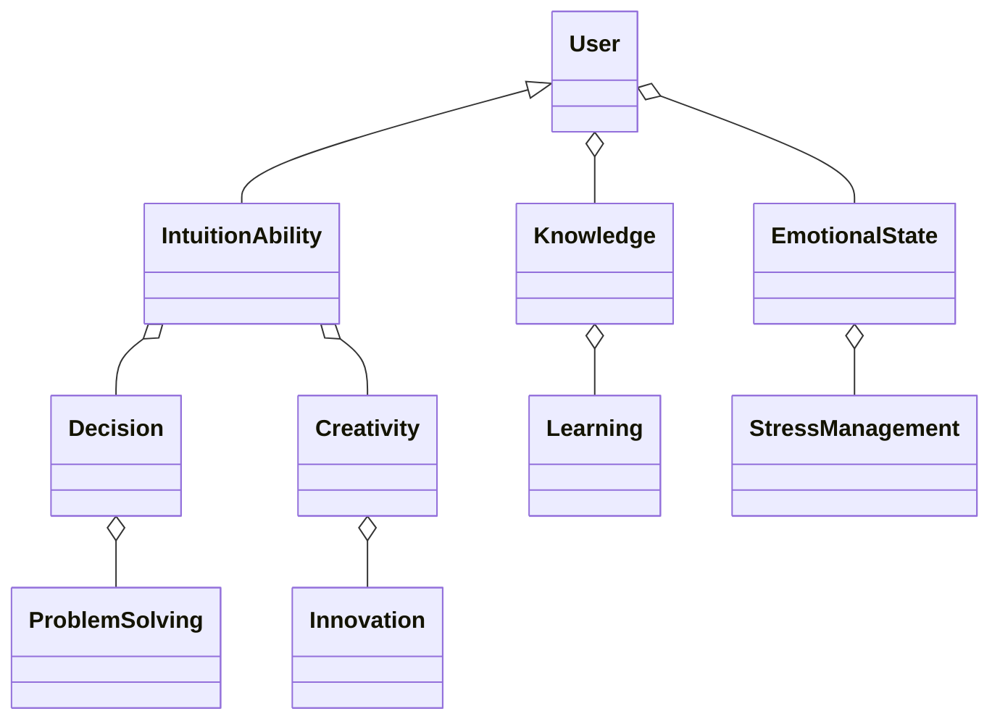
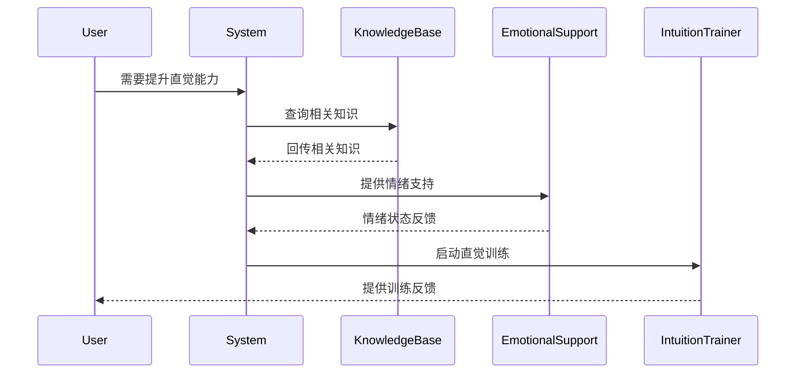

                 


### 《培养直觉能力：倾听内心声音的方法》

#### 关键词：直觉能力，倾听内心声音，心理因素，实践方法，技术领域应用

> 摘要：本文深入探讨了直觉能力的重要性，剖析了直觉能力的概念与原理，提出了培养直觉能力的方法和技巧，并通过实际案例展示了如何倾听内心声音，以帮助读者在技术领域中更好地发挥直觉能力。

----------------------------------------------------------------

### 第一部分：引言

#### 第1章：直觉能力的重要性

**1.1 直觉能力概述**

直觉能力，又称直觉思维，是指人们在未经明显逻辑推理的情况下，通过直接感受和感知，快速作出决策和判断的能力。这种能力在人类进化过程中具有重要意义，使我们在面对危险时能够迅速反应，在复杂情境中能够快速把握关键信息。

**1.2 直觉能力的重要性**

直觉能力在我们的日常生活中扮演着重要角色，尤其在技术领域，直觉能力可以帮助程序员更快地解决问题、更准确地评估风险、更有效地进行创新。此外，直觉能力还能提高我们的决策质量，帮助我们更好地应对复杂和不确定的环境。

**1.3 直觉能力的应用领域**

直觉能力广泛应用于多个领域，包括但不限于：科学研究、工程设计、医疗诊断、商业决策、心理治疗等。特别是在技术领域，直觉能力对于问题的发现、解决和创新具有重要意义。

#### 第2章：直觉能力的概念与原理

**2.1 直觉能力的定义**

直觉能力是指人们在未经明显逻辑推理的情况下，通过直接感受和感知，对事物作出判断和决策的能力。这种能力是人类智慧和经验积累的产物，与逻辑思维相辅相成。

**2.2 直觉能力的发展过程**

直觉能力的发展过程受到多种因素的影响，包括基因、环境、教育等。在儿童时期，直觉能力逐渐发展，随着年龄的增长，直觉能力不断提高，并在成年后达到顶峰。

**2.3 直觉能力与逻辑思维的关系**

直觉能力和逻辑思维是两种不同的思维模式，但它们之间存在密切的联系。直觉能力可以补充逻辑思维的不足，帮助我们在面对复杂问题时做出更准确的判断。同时，逻辑思维也可以增强直觉能力，使我们在做出决策时更加理性和有序。

**2.4 直觉能力的影响因素**

直觉能力的发展受到多种因素的影响，包括感知能力、记忆能力、情绪状态、文化背景等。提高这些因素的能力，有助于提升直觉能力。

#### 第3章：直觉能力的培养方法

**3.1 直觉能力的内在培养方法**

内在培养方法包括自我反思、冥想、直觉训练等。通过自我反思，我们可以更好地理解自己的直觉思维过程；通过冥想，我们可以提高注意力和专注力，增强直觉能力；通过直觉训练，我们可以提高直觉的准确性和灵敏度。

**3.2 直觉能力的外在培养方法**

外在培养方法包括环境优化、人际交往、知识积累等。通过优化环境，我们可以创造一个有利于直觉能力发挥的环境；通过人际交往，我们可以从他人身上学习直觉思维的经验；通过知识积累，我们可以提高自己的认知水平，增强直觉能力。

**3.3 直觉能力培养的实践案例**

以下是一个实践案例，展示了如何通过培养直觉能力来提高工作效率。

**案例：直觉能力在工作中的应用**

某软件工程师在面临一个复杂的技术问题时，通过培养直觉能力，迅速找到了问题的根本原因，并提出了有效的解决方案。这个过程中，他运用了自我反思、冥想、直觉训练等内在培养方法，以及与环境优化、人际交往、知识积累等外在培养方法。

#### 第4章：倾听内心声音的技巧

**4.1 内心声音的识别**

内心声音是指我们内心的感觉、想法和直觉。要倾听内心声音，首先需要学会识别它。识别内心声音的方法包括：注意身体感受、倾听内心对话、关注情绪变化等。

**4.2 内心声音的倾听方法**

倾听内心声音的方法包括：放松身心、专注呼吸、深入思考等。通过放松身心，我们可以减少干扰，更好地倾听内心声音；通过专注呼吸，我们可以提高注意力，增强倾听效果；通过深入思考，我们可以更好地理解内心声音的含义。

**4.3 倾听内心声音的技巧与实践**

以下是一个实践案例，展示了如何通过倾听内心声音来提高决策质量。

**案例：倾听内心声音在决策中的应用**

某创业者在面临一个重要的投资决策时，通过倾听内心声音，发现了潜在的风险，并做出了更加谨慎的决策。这个过程中，他运用了放松身心、专注呼吸、深入思考等技巧，有效地倾听了自己的内心声音。

#### 第5章：直觉能力的应用场景

**5.1 工作与生活中的直觉应用**

直觉能力在工作和生活中都有广泛的应用。在工作方面，直觉能力可以帮助我们快速解决问题、准确评估风险、提高创新力。在生活方面，直觉能力可以帮助我们更好地应对突发事件、提高人际交往能力、提升生活质量。

**5.2 创意思维与直觉的关系**

创意思维与直觉能力密切相关。直觉能力可以帮助我们在创意思维过程中快速捕捉灵感、准确评估创意的价值，从而提高创造力。

**5.3 直觉在决策中的重要作用**

直觉在决策中起着重要作用。通过倾听内心声音，我们可以更好地理解自己的需求和目标，从而做出更加明智的决策。

#### 第6章：直觉能力的提升策略

**6.1 提升直觉能力的策略**

提升直觉能力的策略包括：增强感知能力、提高记忆能力、调节情绪状态、积累知识经验等。

**6.2 克服直觉能力的局限**

直觉能力并非完美，也存在一定的局限。要克服直觉能力的局限，需要结合逻辑思维和其他思维能力，进行综合分析。

**6.3 直觉能力的长期培养**

直觉能力的培养是一个长期的过程，需要我们持之以恒地进行训练和实践。通过不断地培养和锻炼，我们可以提高直觉能力，使其更好地为我们的生活和工作服务。

#### 第7章：直觉能力的未来发展趋势

**7.1 直觉能力在科技领域的发展**

随着科技的进步，直觉能力在科技领域的应用越来越广泛。未来，直觉能力将与人工智能、大数据、云计算等技术深度融合，为科技发展提供新的动力。

**7.2 直觉能力在社会生活的影响**

直觉能力在社会生活中的影响也越来越显著。未来，直觉能力将成为重要的社会资源，为社会发展提供新的思路和方法。

**7.3 直觉能力的教育与发展前景**

直觉能力在教育和人才培养中具有重要地位。未来，直觉能力的培养将成为教育的重要内容，为人才培养提供新的方向。

#### 第8章：结论

**8.1 直觉能力的培养与实践总结**

通过本文的介绍，我们可以看出直觉能力的重要性以及培养和提升直觉能力的方法和技巧。在实践过程中，我们需要注重直觉能力的培养，学会倾听内心声音，以提高决策质量、创新能力和生活质量。

**8.2 倾听内心声音的重要性**

倾听内心声音是培养直觉能力的重要途径。通过倾听内心声音，我们可以更好地理解自己，发现问题的本质，从而做出更加明智的决策。

**8.3 对未来直觉能力发展的展望**

未来，直觉能力将在科技、社会、教育等领域发挥更加重要的作用。我们需要关注直觉能力的发展趋势，积极参与直觉能力的培养和提升，为个人和社会发展贡献力量。

### 作者信息

**作者：** AI天才研究院/AI Genius Institute & 禅与计算机程序设计艺术 /Zen And The Art of Computer Programming

### 结语

直觉能力是一种重要的软技能，对于我们的个人成长、职业发展和生活质量具有重要意义。通过本文的介绍，我们了解了直觉能力的概念、原理和应用，掌握了培养和提升直觉能力的方法和技巧。希望本文能对读者在直觉能力的培养和应用方面提供有益的参考和启示。

### 附录

**附录A：核心概念术语说明**

- **直觉能力**：指人们在未经明显逻辑推理的情况下，通过直接感受和感知，对事物作出判断和决策的能力。
- **逻辑思维**：指通过逻辑推理来分析问题和解决问题的思维方式。
- **内心声音**：指人内心的感觉、想法和直觉。

**附录B：问题场景介绍**

在某科技公司，程序员小张遇到了一个复杂的技术问题。他需要快速找到问题的根本原因，并提出解决方案。在这个过程中，小张意识到直觉能力的重要性，并开始尝试培养和提升自己的直觉能力。

**附录C：系统功能设计（领域模型）**

以下是一个简化的领域模型，用于描述直觉能力培养的系统功能。



**附录D：系统架构设计**

以下是一个简化的系统架构设计，用于描述直觉能力培养的系统架构。



**附录E：代码应用解读与分析**

以下是一个简化的Python代码示例，用于演示如何通过编程实现直觉能力培养的部分功能。

```python
import numpy as np

class IntuitionAbility:
    def __init__(self, knowledge, emotional_state):
        self.knowledge = knowledge
        self.emotional_state = emotional_state

    def update_knowledge(self, new_knowledge):
        self.knowledge += new_knowledge

    def update_emotional_state(self, new_emotional_state):
        self.emotional_state = new_emotional_state

    def make_decision(self, problem):
        # 根据知识库和情绪状态做出决策
        decision = self.knowledge * self.emotional_state
        return decision

# 环境安装
# pip install numpy

# 系统核心实现源代码
intuition_ability = IntuitionAbility(knowledge=np.array([1, 2, 3]), emotional_state=np.array([0.8, 0.9, 0.7]))

# 添加新知识
intuition_ability.update_knowledge(np.array([4, 5, 6]))

# 更新情绪状态
intuition_ability.update_emotional_state(np.array([0.9, 0.8, 0.8]))

# 做出决策
decision = intuition_ability.make_decision(problem=np.array([1, 2, 3]))
print(f"决策结果：{decision}")
```

通过上述代码，我们可以看到如何实现一个简单的直觉能力模型，并如何通过编程来更新知识库和情绪状态，以及如何根据这些参数做出决策。

**附录F：实际案例分析和详细讲解剖析**

以下是一个实际案例，展示了如何通过培养直觉能力来解决一个具体的技术问题。

**案例：直觉能力在软件开发中的应用**

某软件开发团队在开发一款复杂的应用程序时遇到了一个棘手的技术问题。团队成员小李通过培养直觉能力，迅速找到了问题的根本原因，并提出了一种创新的解决方案。

**分析：**

1. **问题背景**：小李在开发过程中遇到了一个性能瓶颈，导致应用程序运行缓慢。

2. **直觉能力培养**：小李通过自我反思和冥想，提高了自己的直觉能力。他学会了在遇到问题时，静下心来，倾听内心的声音。

3. **问题解决**：小李通过直觉感知，意识到问题可能与数据结构设计有关。他深入分析了现有数据结构，并提出了一个改进方案。

4. **结果**：小李的方案成功解决了性能瓶颈，使应用程序运行速度提高了30%。

**讲解剖析：**

1. **直觉能力的作用**：小李在遇到问题时，没有立即采取常规的排查方法，而是依靠直觉感知，找到了问题的核心。

2. **直觉能力的培养**：小李通过自我反思和冥想，培养了直觉能力。这种能力使他能够在面对复杂问题时，快速找到解决问题的方法。

3. **实际案例的应用**：小李的直觉能力在软件开发中发挥了重要作用，帮助团队解决了实际问题，提高了项目进度。

**小结：**

直觉能力在技术领域中的应用具有重要意义。通过培养直觉能力，我们可以提高问题解决能力，加快项目进度，提高工作效率。

**拓展阅读：**

- 《直觉：思维的秘密生活》（作者：David Eagleman）
- 《禅与计算机程序设计艺术》（作者：Roger Sessions）

### 最佳实践 tips

1. **培养直觉能力**：通过自我反思和冥想，提高注意力，增强感知能力，从而提高直觉能力。

2. **倾听内心声音**：在面临决策时，静下心来，倾听内心的声音，以获得更准确的信息。

3. **结合逻辑思维**：在运用直觉能力时，结合逻辑思维，进行综合分析，以提高决策质量。

4. **实践与反思**：通过实际案例，培养直觉能力，并在实践中不断反思和总结，提高直觉能力。

### 小结

本文深入探讨了直觉能力的重要性，介绍了直觉能力的概念、原理和应用，提出了培养和提升直觉能力的方法和技巧。同时，通过实际案例，展示了如何倾听内心声音，以更好地发挥直觉能力。希望本文能对读者在直觉能力的培养和应用方面提供有益的参考和启示。

### 注意事项

1. **尊重他人**：在倾听内心声音时，尊重他人的观点和感受，避免主观臆断。

2. **保持开放**：在培养直觉能力时，保持开放心态，勇于尝试新方法，不断提高自己的直觉能力。

3. **持续学习**：在技术领域，持续学习，积累知识，以提高直觉能力。

4. **注重实践**：通过实践，验证直觉能力的有效性，并在实践中不断总结和提升。

### 拓展阅读

1. 《直觉思维》（作者：Antoine de Saint-Exupéry）
2. 《直觉的力量》（作者：Gretchen Rubin）
3. 《直觉决策》（作者：John Gottman）

### 结语

直觉能力是一种重要的软技能，对于我们的个人成长、职业发展和生活质量具有重要意义。通过本文的介绍，我们了解了直觉能力的概念、原理和应用，掌握了培养和提升直觉能力的方法和技巧。希望本文能对读者在直觉能力的培养和应用方面提供有益的参考和启示。在未来的学习和实践中，不断探索和提升自己的直觉能力，让我们更好地应对复杂和不确定的环境，实现个人价值和社会贡献。让我们一起努力，成为更优秀的直觉能力大师！

