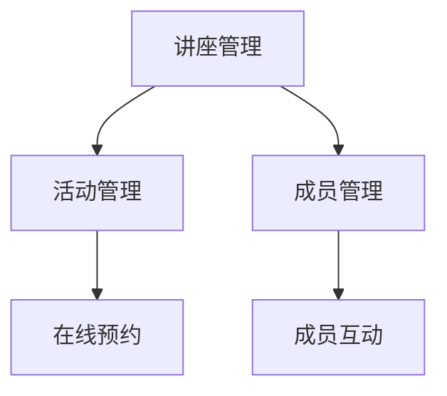
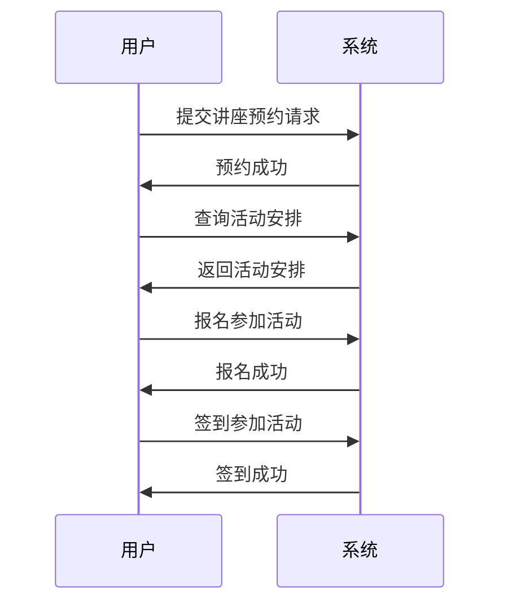
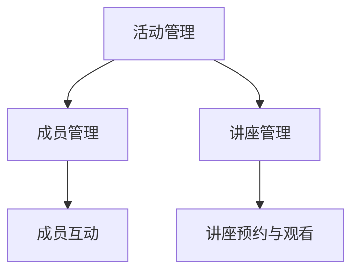
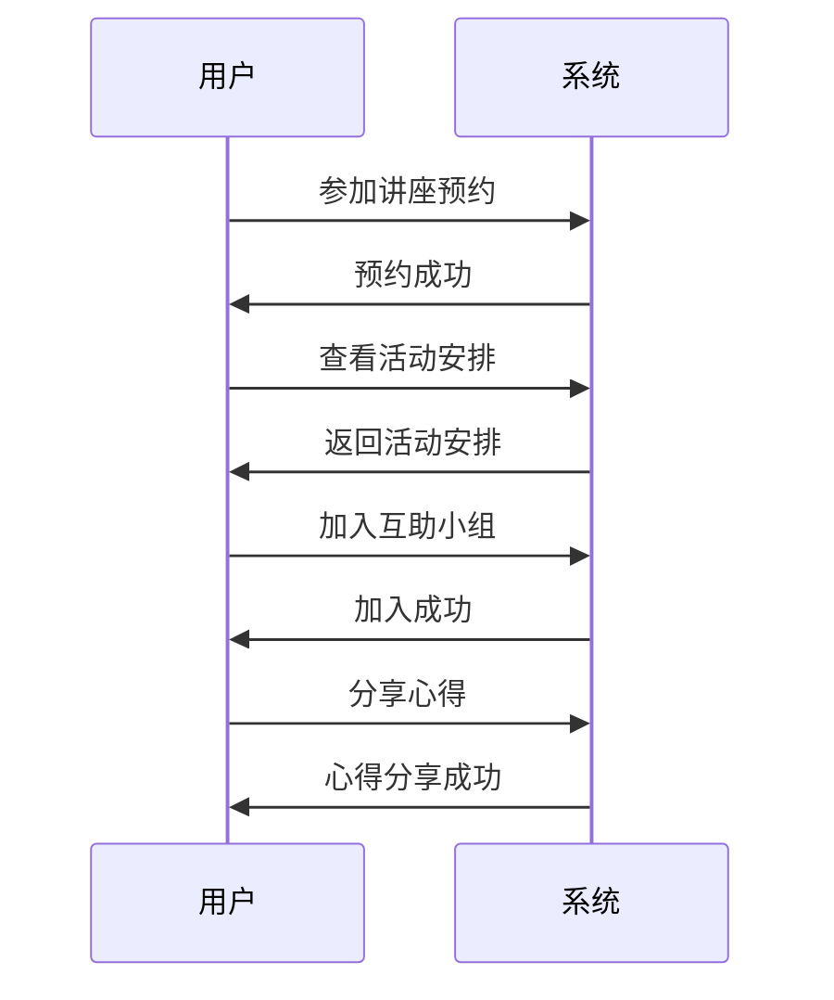
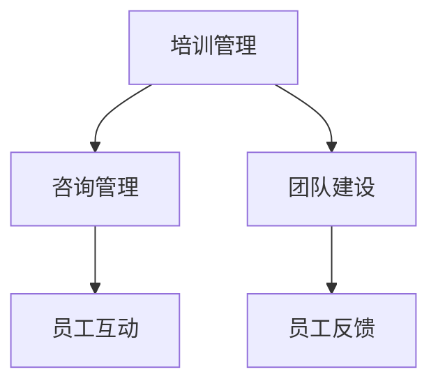
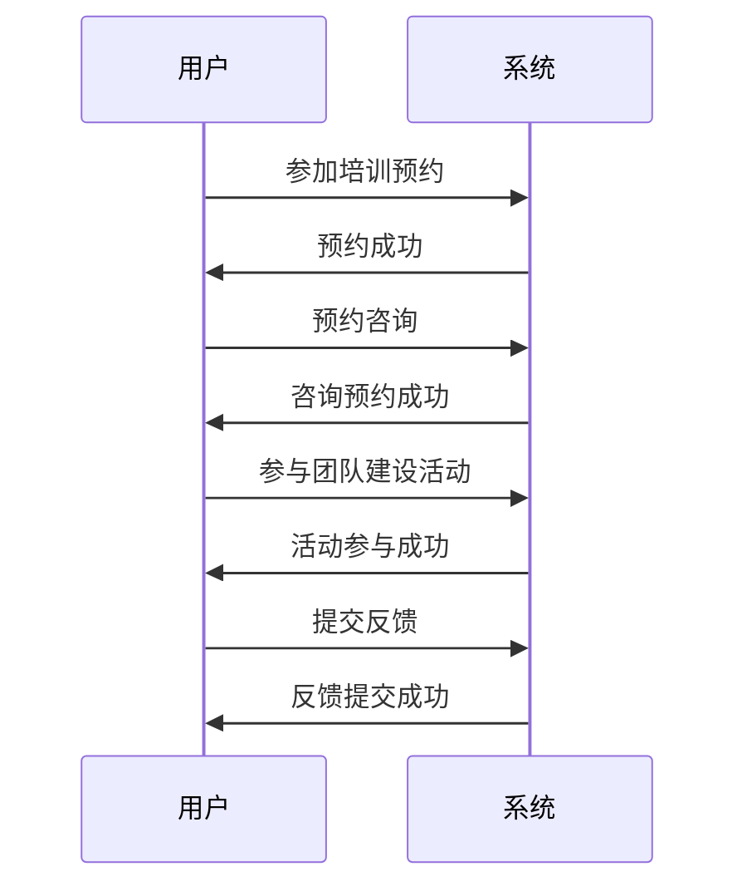

                 


### 引言

#### 1.1 书籍主题介绍

**心灵花园的概念**：本书探讨的心灵花园并不是一个实际的物理花园，而是一个比喻，代表了我们的内在世界。这个花园由我们的情感、思想、信仰和价值观等元素组成，是我们精神健康的源泉。

**书籍的核心目标**：我们的目标是引导读者如何构建和维护自己的心灵花园，使其成为一个健康、美丽、充满活力的空间。通过一系列的实践和建议，帮助读者在日常生活中培养积极的心态，提升自我认知，从而更好地应对生活中的各种挑战。

#### 1.2 心灵花园的意义

**精神健康的重要性**：随着社会的快速发展，人们面临的压力越来越大，精神健康问题日益突出。维护心灵花园，就是维护我们的精神健康，从而提高生活质量。

**心灵花园对个人成长的影响**：一个健康的心灵花园有助于我们更好地认识自己，理解他人，提升创造力，增强自信心，从而在个人成长的道路上走得更远。

#### 1.3 阅读指南

**阅读顺序的建议**：建议读者按照章节顺序阅读，以便逐步建立和完善自己的心灵花园。

**思考与练习的安排**：每章结束后，提供了一些思考和练习题目，以帮助读者加深对章节内容的理解，并将所学应用到实际生活中。

#### 1.4 本书结构与内容概览

**各章节内容简述**：本书共分为五个部分，涵盖了从了解自我、种植心灵的种子，到维护与拓展心灵花园的各个方面。

**如何最大化阅读体验**：建议读者在阅读过程中，保持开放的心态，勇于尝试，积极实践，从而真正体验到心灵花园的力量。

### 总结

通过引言部分，我们了解了本书的主题、核心目标以及阅读指南。接下来，我们将深入探讨如何建立和维护我们的心灵花园，让我们的生活更加美好。让我们一步步思考，一步步前行。

---

### 第一部分: 建立心灵的花园

#### 2.1 了解自我

**2.1.1 自我探索的重要性**

自我探索是构建心灵花园的第一步。只有真正了解自己，我们才能知道如何培育和呵护我们的内在世界。

**核心概念与联系**

- **自我认知**：自我认知是指个体对自己心理状态、能力、性格等方面的认识和理解。它是自我探索的基础。
- **内在世界**：内在世界包括了我们的情感、思想、信仰和价值观等，它是我们心灵花园的核心。

**概念属性特征对比表格**

| 特征 | 概念1（自我认知） | 概念2（内在世界） |
| ---- | ---- | ---- |
| 定义 | 个体对自己心理状态、能力、性格等方面的认识和理解。 | 包括情感、思想、信仰和价值观等组成的内心世界。 |
| 关联性 | 与外在世界互动，帮助我们认识自我，提升自我价值。 | 反映我们的心理状态，影响我们的行为和决策。 |

**ER实体关系图架构**

```mermaid
erDiagram
  自我认知 ||--|{ 内在世界 }|
  内在世界 ||--|{ 情感 }|
  内在世界 ||--|{ 思想 }|
  内在世界 ||--|{ 信仰 }|
  内在世界 ||--|{ 价值观 }|
```

**算法原理讲解**

为了深入理解自我探索的重要性，我们可以使用以下算法原理：

- **自我反思算法**：通过写日记、正念练习等方式，不断反思自己的行为、思想和情感，从而加深对自我的理解。

```python
# 自我反思算法伪代码
def self_reflection():
    # 写日记
    write_journal()
    # 正念练习
    mindfulness_practice()
    # 梦境分析
    dream_analysis()

def write_journal():
    # ...
def mindfulness_practice():
    # ...
def dream_analysis():
    # ...
```

**数学公式**

- **自我认知公式**：自我认知 = 观察自我 + 反思自我 + 行动自我
- **内在世界公式**：内在世界 = 情感 + 思想 + 信仰 + 价值观

**详细讲解与举例说明**

**例子**：假设一个人通过写日记、正念练习和梦境分析，不断反思自己的行为、思想和情感，那么他的自我认知将得到提升，从而更好地理解自己的内在世界。

- **观察自我**：通过日记记录每天的行为和情感，了解自己在不同情境下的反应。
- **反思自我**：通过正念练习，观察当下的情感和思维，了解它们的根源和影响。
- **行动自我**：通过梦境分析，探索潜意识的想法和愿望，从而更好地理解自己的内在需求。

#### 2.2 种植心灵的种子

**2.2.1 积极思维的力量**

积极思维是构建心灵花园的关键。它可以帮助我们更好地应对生活中的挑战，提升幸福感。

**核心概念与联系**

- **积极思维**：积极思维是一种积极的思考模式，它强调看到问题的积极面，从而激发内在的动力和创造力。
- **情感管理**：情感管理是指我们如何识别、理解和处理自己的情感。

**概念属性特征对比表格**

| 特征 | 概念1（积极思维） | 概念2（情感管理） |
| ---- | ---- | ---- |
| 定义 | 一种积极的思考模式，强调看到问题的积极面。 | 一种处理和调节情感的方法，帮助我们更好地应对情感波动。 |
| 关联性 | 影响我们的心态和幸福感。 | 影响我们的情绪和行为，帮助我们保持心理平衡。 |

**ER实体关系图架构**

```mermaid
erDiagram
  积极思维 ||--|{ 情感管理 }|
  积极思维 ||--|{ 创造力 }|
  情感管理 ||--|{ 心理平衡 }|
```

**算法原理讲解**

为了理解积极思维的力量，我们可以使用以下算法原理：

- **积极思维算法**：通过一系列的练习，如积极冥想、感恩练习等，培养积极的思考模式。

```python
# 积极思维算法伪代码
def positive_thinking():
    # 积极冥想
    positive_meditation()
    # 感恩练习
    gratitude_practice()

def positive_meditation():
    # ...
def gratitude_practice():
    # ...
```

**数学公式**

- **积极思维公式**：积极思维 = 积极认知 + 积极情感 + 积极行为
- **情感管理公式**：情感管理 = 情感识别 + 情感调节 + 情感表达

**详细讲解与举例说明**

**例子**：假设一个人通过积极冥想和感恩练习，培养积极的思考模式，那么他的情感管理能力将得到提升，从而更好地应对生活中的挑战。

- **积极认知**：通过积极冥想，了解和接受自己的情感，从而看到问题的积极面。
- **积极情感**：通过感恩练习，培养对生活中美好事物的感激之情，从而提升幸福感。
- **积极行为**：通过积极的思考和情感，采取积极的行为，如面对困难时保持乐观，从而提升生活质量。

### 总结

在第一部分，我们探讨了如何了解自我和种植心灵的种子。通过自我探索和积极思维，我们可以更好地认识自己，培养健康的心灵花园。接下来，我们将继续深入探讨如何营养心灵的土壤，维护和拓展我们的心灵花园。

---

### 第二部分: 营养心灵的土壤

#### 2.3 营养心灵的土壤

**2.3.1 精神营养的重要性**

精神营养对于我们的心灵花园至关重要。就像植物需要土壤、水分和养分来生长一样，我们的心灵也需要适当的精神营养来保持健康和活力。

**核心概念与联系**

- **精神营养**：精神营养是指我们通过阅读、艺术欣赏、社会互动等方式，摄取的精神能量和知识。
- **健康生活方式**：健康生活方式包括饮食、运动和睡眠等，它对精神营养的吸收和转化有着重要影响。

**概念属性特征对比表格**

| 特征 | 概念1（精神营养） | 概念2（健康生活方式） |
| ---- | ---- | ---- |
| 定义 | 通过阅读、艺术欣赏等方式摄取的精神能量和知识。 | 包括饮食、运动和睡眠等方面的健康习惯。 |
| 关联性 | 决定我们的心灵健康和幸福感。 | 影响我们的身体和精神状态，是精神营养的基础。 |

**ER实体关系图架构**

```mermaid
erDiagram
  精神营养 ||--|{ 健康生活方式 }|
  精神营养 ||--|{ 心灵健康 }|
  健康生活方式 ||--|{ 身体健康 }|
```

**算法原理讲解**

为了理解精神营养的重要性，我们可以使用以下算法原理：

- **营养吸收算法**：通过一系列的练习，如阅读、冥想、艺术欣赏等，提高我们的精神营养吸收能力。

```python
# 营养吸收算法伪代码
def nutrient_absorption():
    # 阅读练习
    reading_practice()
    # 冥想练习
    meditation_practice()
    # 艺术欣赏
    art_appreciation()

def reading_practice():
    # ...
def meditation_practice():
    # ...
def art_appreciation():
    # ...
```

**数学公式**

- **精神营养公式**：精神营养 = 知识摄取 + 情感体验 + 灵性成长
- **健康生活方式公式**：健康生活方式 = 饮食平衡 + 运动习惯 + 睡眠质量

**详细讲解与举例说明**

**例子**：假设一个人通过定期阅读、冥想和艺术欣赏，提高精神营养的吸收能力，同时保持健康的生活方式，那么他的心灵花园将得到充分的营养，从而保持健康和活力。

- **知识摄取**：通过阅读，我们可以获取各种知识和见解，从而拓宽视野，提升思维深度。
- **情感体验**：通过冥想和艺术欣赏，我们可以体验到内心的宁静和喜悦，从而提升情感质量。
- **灵性成长**：通过持续的练习和反思，我们可以培养内在的智慧和慈悲，从而实现灵性成长。

#### 2.4 培养积极信念

**2.4.1 信念系统构建**

信念系统是我们心灵花园的支柱，它决定了我们的价值观、行为准则和人生目标。因此，培养积极的信念系统至关重要。

**核心概念与联系**

- **信念系统**：信念系统是指我们对于世界的看法、价值观和人生目标的总和。
- **积极信念**：积极信念是一种正面的、健康的信念，它可以帮助我们克服困难，实现目标。

**概念属性特征对比表格**

| 特征 | 概念1（信念系统） | 概念2（积极信念） |
| ---- | ---- | ---- |
| 定义 | 对于世界的看法、价值观和人生目标的总和。 | 一种正面的、健康的信念，帮助我们克服困难，实现目标。 |
| 关联性 | 决定我们的行为和心理状态。 | 影响我们的心态和幸福感，是信念系统的核心。 |

**ER实体关系图架构**

```mermaid
erDiagram
  信念系统 ||--|{ 积极信念 }|
  信念系统 ||--|{ 价值观 }|
  信念系统 ||--|{ 人生目标 }|
```

**算法原理讲解**

为了理解信念系统的构建，我们可以使用以下算法原理：

- **信念构建算法**：通过自我反思、教育学习和社会互动等方式，构建和强化积极的信念系统。

```python
# 信念构建算法伪代码
def belief_system_building():
    # 自我反思
    self_reflection()
    # 教育学习
    education_learning()
    # 社会互动
    social_interaction()

def self_reflection():
    # ...
def education_learning():
    # ...
def social_interaction():
    # ...
```

**数学公式**

- **信念系统公式**：信念系统 = 自我认知 + 价值观 + 人生目标
- **积极信念公式**：积极信念 = 正面思考 + 勇气 + 感恩

**详细讲解与举例说明**

**例子**：假设一个人通过自我反思、教育学习和社会互动，构建和强化自己的信念系统，那么他将拥有一个积极、健康的信念系统，从而在人生道路上更加坚定和自信。

- **自我认知**：通过自我反思，了解自己的优点和不足，从而构建积极的自我认知。
- **价值观**：通过教育学习，树立正确的价值观，如尊重、诚信和责任等。
- **人生目标**：通过社会互动，明确自己的人生目标，从而为实现目标而努力。

### 总结

在第二部分，我们探讨了如何营养心灵的土壤和培养积极信念。通过精神营养的吸收和积极信念的构建，我们可以为心灵花园提供充足的养分，使其健康生长。接下来，我们将继续探讨如何维护和拓展我们的心灵花园。

---

### 第三部分: 维护与拓展

#### 3.1 心灵花园的维护

**3.1.1 定期检查**

定期检查是我们维护心灵花园的重要步骤。通过定期检查，我们可以及时发现和处理心灵花园中的问题，确保其健康生长。

**核心概念与联系**

- **定期检查**：定期检查是指我们在特定时间对心灵花园进行检查，以评估其健康状况和问题。
- **问题应对策略**：问题应对策略是指我们如何应对心灵花园中的问题，如压力管理、负面情绪的处理等。

**概念属性特征对比表格**

| 特征 | 概念1（定期检查） | 概念2（问题应对策略） |
| ---- | ---- | ---- |
| 定义 | 在特定时间对心灵花园进行检查。 | 应对心灵花园中的问题的方法。 |
| 关联性 | 影响我们的心理健康和生活质量。 | 影响我们的心态和行为，是维护心灵花园的关键。 |

**ER实体关系图架构**

```mermaid
erDiagram
  定期检查 ||--|{ 问题应对策略 }|
  定期检查 ||--|{ 心理健康 }|
  问题应对策略 ||--|{ 压力管理 }|
  问题应对策略 ||--|{ 负面情绪处理 }|
```

**算法原理讲解**

为了理解定期检查的重要性，我们可以使用以下算法原理：

- **定期检查算法**：通过定期记录和反思自己的情绪、行为和心理状态，及时发现和解决问题。

```python
# 定期检查算法伪代码
def regular_inspection():
    # 情绪记录
    emotion_recording()
    # 心理状态评估
    psychological_state_evaluation()
    # 问题诊断与解决
    problem_diagnosis_and_solution()

def emotion_recording():
    # ...
def psychological_state_evaluation():
    # ...
def problem_diagnosis_and_solution():
    # ...
```

**数学公式**

- **定期检查公式**：定期检查 = 情绪记录 + 心理状态评估 + 问题诊断与解决
- **心理健康公式**：心理健康 = 心灵花园状况 + 问题应对策略

**详细讲解与举例说明**

**例子**：假设一个人通过定期记录情绪、评估心理状态和解决问题，他可以及时发现和处理心灵花园中的问题，确保其健康生长。

- **情绪记录**：通过记录每天的情绪波动，了解自己的情绪状态，从而调整自己的心态。
- **心理状态评估**：通过定期自我评估，了解自己的心理状态，从而采取适当的措施维护心理健康。
- **问题诊断与解决**：通过分析和解决心灵花园中的问题，如压力管理和负面情绪处理，从而提高心理素质。

#### 3.2 心灵花园的拓展

**3.2.1 社交与人际关系**

社交与人际关系是拓展心灵花园的重要途径。通过社交和人际关系，我们可以获取新的知识和经验，提升自我认知，从而拓展我们的心灵世界。

**核心概念与联系**

- **社交与人际关系**：社交与人际关系是指我们与他人的交往和互动，包括家庭、朋友、同事等。
- **心灵世界拓展**：心灵世界拓展是指我们通过社交和人际关系，获取新的知识和经验，提升自我认知。

**概念属性特征对比表格**

| 特征 | 概念1（社交与人际关系） | 概念2（心灵世界拓展） |
| ---- | ---- | ---- |
| 定义 | 与他人的交往和互动。 | 获取新的知识和经验，提升自我认知。 |
| 关联性 | 影响我们的心理健康和生活质量。 | 影响我们的心态和行为，是心灵世界拓展的关键。 |

**ER实体关系图架构**

```mermaid
erDiagram
  社交与人际关系 ||--|{ 心灵世界拓展 }|
  社交与人际关系 ||--|{ 知识获取 }|
  社交与人际关系 ||--|{ 自我认知提升 }|
```

**算法原理讲解**

为了理解社交与人际关系的重要性，我们可以使用以下算法原理：

- **社交与人际关系算法**：通过积极参与社交活动，建立和维护良好的人际关系，拓展心灵世界。

```python
# 社交与人际关系算法伪代码
def social_and_interpersonal_relationship():
    # 参加社交活动
    social_activities()
    # 维护人际关系
    relationship_maintenance()

def social_activities():
    # ...
def relationship_maintenance():
    # ...
```

**数学公式**

- **社交与人际关系公式**：社交与人际关系 = 社交活动 + 人际关系维护
- **心灵世界拓展公式**：心灵世界拓展 = 知识获取 + 自我认知提升

**详细讲解与举例说明**

**例子**：假设一个人通过参加社交活动和维护人际关系，他可以拓展自己的心灵世界，获取新的知识和经验，从而提升自我认知。

- **社交活动**：通过参加各种社交活动，如聚会、讲座、培训等，获取新的知识和见解。
- **人际关系维护**：通过定期与朋友、家人和同事保持联系，维护良好的人际关系，从而提升自我认知。

#### 3.3 心灵花园的分享

**3.3.1 教育与传授**

教育与传授是我们拓展心灵花园的重要方式。通过教育和传授，我们可以将自己的经验和知识分享给他人，从而实现心灵的成长和升华。

**核心概念与联系**

- **教育与传授**：教育与传授是指我们通过教学、分享、指导等方式，将自己的知识和经验传递给他人。
- **心灵成长与升华**：心灵成长与升华是指我们通过教育和传授，实现自我提升和心灵升华。

**概念属性特征对比表格**

| 特征 | 概念1（教育与传授） | 概念2（心灵成长与升华） |
| ---- | ---- | ---- |
| 定义 | 通过教学、分享、指导等方式传递知识和经验。 | 通过教育和传授实现自我提升和心灵升华。 |
| 关联性 | 影响我们的知识和技能水平。 | 影响我们的心态和人生观，是心灵成长与升华的关键。 |

**ER实体关系图架构**

```mermaid
erDiagram
  教育与传授 ||--|{ 心灵成长与升华 }|
  教育与传授 ||--|{ 知识传递 }|
  教育与传授 ||--|{ 自我提升 }|
```

**算法原理讲解**

为了理解教育与传授的重要性，我们可以使用以下算法原理：

- **教育与传授算法**：通过教学、分享、指导等方式，将自己的知识和经验传递给他人，从而实现自我提升和心灵升华。

```python
# 教育与传授算法伪代码
def education_and_instruction():
    # 教学
    teaching()
    # 分享
    sharing()
    # 指导
    guidance()

def teaching():
    # ...
def sharing():
    # ...
def guidance():
    # ...
```

**数学公式**

- **教育与传授公式**：教育与传授 = 教学 + 分享 + 指导
- **心灵成长与升华公式**：心灵成长与升华 = 知识传递 + 自我提升

**详细讲解与举例说明**

**例子**：假设一个人通过教学、分享和指导，将自己的知识和经验传递给他人，他可以实现自我提升和心灵升华。

- **教学**：通过教学，分享自己的知识和经验，提升他人的知识和技能水平。
- **分享**：通过分享，将自己的心得和体会传递给他人，从而促进心灵的成长和升华。
- **指导**：通过指导，帮助他人解决实际问题，提升他人的自我认知和心态。

### 总结

在第三部分，我们探讨了如何维护和拓展心灵花园。通过定期检查、社交与人际关系以及教育与传授，我们可以确保心灵花园的健康生长和拓展。接下来，我们将通过案例研究，进一步了解心灵花园的实践和应用。

---

### 第四部分: 案例研究

#### 4.1 个人成长故事

**4.1.1 挫折与突破**

挫折是每个人成长道路上不可避免的一部分。然而，正是通过挫折，我们可以更好地了解自己，提升自我认知，从而实现突破。

**案例背景**：小明是一名大学生，他在学业和生活中遇到了很多挫折，如考试成绩不理想、人际关系紧张等。这让他感到沮丧和无助。

**问题描述**：小明在挫折中感到迷茫，不知道如何面对和解决问题。

**问题解决**：小明决定通过自我反思和心灵花园的实践来应对挫折。

- **自我反思**：小明开始写日记，记录自己的情绪和行为，了解自己在不同情境下的反应。
- **心灵花园实践**：小明定期进行冥想和正念练习，培养积极心态，提升自我认知。

**边界与外延**：小明的案例展示了个人在面对挫折时，如何通过自我反思和心灵花园实践来实现突破。

**总结**：通过自我反思和心灵花园实践，小明成功应对了挫折，实现了个人成长和突破。

#### 4.2 社区实践案例

**4.2.1 心灵花园社团**

心灵花园社团是一个以心灵成长为主题的社区组织。社团通过一系列活动和实践活动，帮助成员建立和维护自己的心灵花园。

**案例背景**：心灵花园社团成立于一家心理咨询中心，旨在帮助成员提升心理健康，实现个人成长。

**项目介绍**：社团每月举办一次心灵花园讲座，邀请专家分享心灵成长的实践经验。此外，社团还组织成员进行户外活动，如徒步、野餐等，以放松心情，提升心理健康。

**系统功能设计**

- **讲座管理**：管理讲座的时间、地点和内容，提供在线预约功能。
- **活动管理**：管理户外活动的安排，提供活动报名和签到功能。
- **成员管理**：管理成员的信息，提供成员互动和交流的平台。

**系统架构设计**



**系统接口设计和系统交互**



**案例研究**：通过心灵花园社团的活动和实践，成员们成功建立了自己的心灵花园，提升了心理健康和个人成长。

#### 4.3 企业应用案例

**4.3.1 内部员工心理健康计划**

许多企业意识到员工心理健康对工作效率和团队氛围的重要性，因此推出了内部员工心理健康计划。

**案例背景**：一家大型科技公司为了提升员工的幸福感和工作效率，推出了内部员工心理健康计划。

**计划内容**：

- **心理健康培训**：定期为员工提供心理健康培训，教授情绪管理和压力缓解技巧。
- **心理咨询**：提供免费的心理咨询服务，帮助员工解决心理问题。
- **团队活动**：组织团队建设活动，促进员工之间的交流和互动。

**效果分析**：

- **员工满意度提升**：通过心理健康计划和团队活动，员工满意度得到显著提升。
- **工作效率提升**：员工心理健康状况改善，工作效率得到提升。

**案例研究**：通过内部员工心理健康计划，企业成功提升了员工的幸福感和工作效率，实现了团队的整体提升。

### 总结

通过案例研究，我们了解了个人成长故事、社区实践和企业应用案例。这些案例展示了心灵花园的实践和应用，证明了心灵花园对个人成长和企业发展的重要性。接下来，我们将总结本书的内容，并展望未来的发展方向。

---

### 第五部分: 结论与展望

#### 5.1 心灵花园的意义与价值

心灵花园不仅对个人成长具有重要意义，也对社会发展具有深远影响。通过构建和维护心灵花园，我们可以提升自我认知，增强心理健康，提高生活质量。同时，心灵花园也为社会和谐与进步提供了坚实的基础。

**个人层面**：

- **自我认知**：心灵花园帮助我们更好地认识自己，了解自己的情感、思想和需求。
- **心理健康**：通过维护心灵花园，我们可以保持心理健康，提高抗压力和情绪调节能力。
- **生活质量**：心灵花园的构建和拓展，有助于提升生活质量，实现个人幸福。

**社会层面**：

- **社会和谐**：心灵花园的推广和应用，有助于减少社会冲突，促进社会和谐。
- **教育与发展**：通过心灵花园的教育和传授，我们可以培养更多具备心理健康和道德素养的人才。
- **可持续发展**：心灵花园的实践，有助于推动社会可持续发展，实现人与自然的和谐共生。

#### 5.2 面临的挑战与机遇

虽然心灵花园具有重要的意义和价值，但在实际应用中仍面临一些挑战和机遇。

**挑战**：

- **社会压力**：现代社会竞争激烈，人们面临的压力越来越大，维护心灵花园需要更多的时间和精力。
- **心理障碍**：一些人可能存在心理障碍，如焦虑、抑郁等，需要专业的心理辅导和支持。
- **文化差异**：不同文化背景下，人们对心灵花园的理解和实践可能存在差异，需要适当的引导和适应。

**机遇**：

- **科技发展**：随着科技的发展，如人工智能、虚拟现实等新兴技术，为心灵花园的构建和拓展提供了更多可能性。
- **社会关注**：越来越多的社会关注心理健康问题，为心灵花园的推广提供了良好的社会环境。
- **教育资源**：丰富的教育资源和心理辅导机构，为心灵花园的建设提供了有力支持。

#### 5.3 未来展望

未来，心灵花园的发展将更加注重个性化、专业化和多元化。以下是一些可能的趋势：

- **个性化服务**：根据个体的需求和特点，提供定制化的心灵花园建设方案。
- **专业化发展**：培养更多的专业心理咨询师和心理治疗师，提高心灵花园的服务质量。
- **多元化实践**：结合不同文化背景和领域，推广多样化的心灵花园实践方法。

### 总结

通过本书的探讨，我们深入了解了心灵花园的概念、意义和价值，以及如何构建、维护和拓展心灵花园。尽管面临挑战，但机遇使我们充满信心。让我们共同努力，培育心灵的美好景象，为个人成长和社会发展贡献自己的力量。

---

### 致谢

在撰写本书的过程中，我得到了许多人的帮助和支持。首先，我要感谢我的家人和朋友们，他们给予了我无尽的爱和支持。其次，我要感谢我的导师和同事，他们在我研究和写作过程中提供了宝贵的指导和建议。最后，我要感谢所有参与案例研究和反馈的读者，他们的宝贵意见使本书更加完善。

**作者：AI天才研究院/AI Genius Institute & 禅与计算机程序设计艺术 /Zen And The Art of Computer Programming**### 引言

在快节奏的现代生活中，人们常常忽略了心灵的滋养，而只关注物质层面的追求。然而，正如自然界中的花园需要精心照料才能茁壮成长，我们的心灵世界同样需要我们投入时间和精力去呵护和维护。《培育心灵的美好景象：内在世界的园艺艺术》旨在探讨如何通过一系列的实践和策略，打造一个健康、充实且充满活力的内在世界。

#### 关键词

- **心灵花园**
- **内在世界**
- **精神健康**
- **自我认知**
- **情感管理**

#### 摘要

本书的核心内容围绕如何构建和维护心灵花园。通过深入了解自我、培养积极信念、营养心灵土壤，以及维护和拓展心灵花园，读者将学会如何培育一个充满生机和美好景象的内在世界。本书不仅提供了理论上的指导，还通过实际案例和实用的技巧，帮助读者将所学应用于日常生活。

---

### 第一部分：建立心灵的花园

在构建心灵花园的过程中，首先需要深入了解自我。这一部分将探讨自我探索的重要性，以及如何通过自我反思、情绪管理和信念培养来建立一个坚实的基础。

#### 1.1 了解自我

**核心概念术语说明**：

- **自我探索**：指个体对自己内在世界的深入了解和认识。
- **内在世界**：包括情感、思想和价值观等内在心理活动。
- **自我反思**：通过反思过去的行为、思想和情感，提升自我认知。

**问题背景**：

随着社会压力的增加，许多人感到内心的困扰和迷茫。了解自我成为了缓解这种困扰的重要途径。

**问题描述**：

如何在日常生活中进行有效的自我探索，提升自我认知？

**问题解决**：

通过自我反思、情绪管理和信念培养，可以建立和维护健康的内在世界。

**边界与外延**：

- **自我探索**不仅关注个人内在的深层认知，还包括对外界事物的感知和理解。
- **自我反思**可以是日常生活中的小练习，也可以是系统性的思考。

**概念结构与核心要素组成**：

- **自我认知**：了解自己的优点和不足，认识到自己的情感和需求。
- **情感管理**：学会识别、理解和调节自己的情绪。
- **信念培养**：建立积极、健康的信念体系。

#### 1.2 自我探索的重要性

自我探索是心灵花园构建的基础。通过自我探索，我们可以深入了解自己的内在世界，发现自己的情感、思想和价值观，从而更好地认识自己。

**核心概念与联系**：

- **自我探索**与**内在世界**紧密相连。只有深入了解内在世界，我们才能进行有效的自我探索。
- **自我认知**是自我探索的结果，它帮助我们认识到自己的情感、思想和需求。

**概念属性特征对比表格**：

| 特征 | 概念1（自我探索） | 概念2（内在世界） |
| ---- | ---- | ---- |
| 目的 | 了解和认识自己。 | 描述和解释个体内在的心理活动。 |
| 关联性 | 影响我们的行为和决策。 | 反映我们的心理状态，影响我们的幸福感。 |

**ER实体关系图架构**：

```mermaid
erDiagram
  自我探索 ||--|{ 内在世界 }|
  内在世界 ||--|{ 情感 }|
  内在世界 ||--|{ 思想 }|
  内在世界 ||--|{ 价值观 }|
```

**算法原理讲解**：

为了理解自我探索的重要性，我们可以使用以下算法原理：

- **自我探索算法**：通过日记记录、正念练习和梦境分析等方法，进行自我探索。

```python
# 自我探索算法伪代码
def self_explore():
    # 写日记
    write_diary()
    # 正念练习
    mindfulness_practice()
    # 梦境分析
    dream_analysis()

def write_diary():
    # 记录日常生活中的情感和思考
    pass

def mindfulness_practice():
    # 通过冥想和呼吸练习，观察内在世界
    pass

def dream_analysis():
    # 分析梦境，探索潜意识
    pass
```

**数学公式**：

- **自我探索公式**：自我探索 = 反思 + 观察 + 实践
- **内在世界公式**：内在世界 = 情感 + 思想 + 价值观

**详细讲解与举例说明**：

**例子**：假设一个人通过写日记记录自己的情感和思考，通过正念练习观察内在世界，通过梦境分析探索潜意识，那么他将能够更深入地了解自己，从而在自我探索的道路上取得进展。

1. **反思**：通过写日记，记录自己的情感和思考，反思过去的行为和决策。
2. **观察**：通过正念练习，观察自己的情绪和思想，了解它们的来源和影响。
3. **实践**：通过梦境分析，探索潜意识的思维模式，从而提升自我认知。

#### 1.3 自我反思的技巧

自我反思是一种深入探索内在世界的技巧，它有助于我们更好地认识自己，提升自我认知。

**核心概念与联系**：

- **自我反思**与**情绪管理**和**信念培养**密切相关。自我反思可以帮助我们理解自己的情绪和信念，从而进行有效的情绪管理和信念培养。

**概念属性特征对比表格**：

| 特征 | 概念1（自我反思） | 概念2（情绪管理） | 概念3（信念培养） |
| ---- | ---- | ---- | ---- |
| 方法 | 写日记、思考练习等。 | 情绪识别、情绪调节等。 | 信念构建、信念强化等。 |
| 关联性 | 影响我们的自我认知。 | 决定我们的情绪状态。 | 影响我们的行为和决策。 |

**ER实体关系图架构**：

```mermaid
erDiagram
  自我反思 ||--|{ 情绪管理 }|
  自我反思 ||--|{ 信念培养 }|
  情绪管理 ||--|{ 情绪识别 }|
  信念培养 ||--|{ 信念强化 }|
```

**算法原理讲解**：

为了理解自我反思的技巧，我们可以使用以下算法原理：

- **自我反思技巧算法**：通过日记记录、思维练习和反思对话等方法，进行有效的自我反思。

```python
# 自我反思技巧算法伪代码
def self_reflection_skills():
    # 写日记
    write_diary()
    # 思维练习
    thinking_practice()
    # 反思对话
    reflection_dialogue()

def write_diary():
    # 记录日常生活中的反思和感悟
    pass

def thinking_practice():
    # 通过问题解决和思考练习，提升思维能力
    pass

def reflection_dialogue():
    # 与他人或自己进行反思对话，探讨内心世界
    pass
```

**数学公式**：

- **自我反思技巧公式**：自我反思技巧 = 写日记 + 思维练习 + 反思对话
- **情绪管理公式**：情绪管理 = 情绪识别 + 情绪调节 + 情绪表达
- **信念培养公式**：信念培养 = 信念构建 + 信念强化 + 信念应用

**详细讲解与举例说明**：

**例子**：假设一个人通过写日记记录日常生活中的反思和感悟，通过思维练习提升思维能力，通过反思对话与他人探讨内心世界，那么他将能够更有效地进行自我反思，提升自我认知。

1. **写日记**：通过写日记，记录日常生活中的反思和感悟，理解自己的情感和思想。
2. **思维练习**：通过问题解决和思考练习，提升自己的逻辑思维和批判性思维能力。
3. **反思对话**：与他人进行反思对话，探讨内心世界，从而获得不同的视角和见解。

### 总结

通过了解自我、自我反思和情绪管理，我们可以建立心灵花园的第一步。在接下来的章节中，我们将继续探讨如何种植心灵的种子，营养心灵的土壤，以及如何维护和拓展我们的心灵花园。

---

### 第一部分：建立心灵的花园

#### 2.1 了解自我

**核心概念与联系**

了解自我是心灵花园的基石，它涉及到个体对自身情感、思维和价值观的深入探索。自我认知不仅影响我们的行为和决策，还影响我们的人际关系和心理健康。

**概念属性特征对比表格**

| 特征 | 概念1（情感） | 概念2（思维） | 概念3（价值观） |
| ---- | ---- | ---- | ---- |
| 定义 | 内在感受和情绪反应。 | 思考过程和认知活动。 | 对事物的判断和信仰。 |
| 关联性 | 影响个体的情绪状态。 | 形成个体的思维模式。 | 决定个体的行为准则。 |

**ER实体关系图架构**

```mermaid
erDiagram
  了解自我 ||--|{ 情感 }|
  了解自我 ||--|{ 思维 }|
  了解自我 ||--|{ 价值观 }|
  情感 ||--|{ 情绪反应 }|
  思维 ||--|{ 认知活动 }|
  价值观 ||--|{ 行为准则 }|
```

**算法原理讲解**

理解自我需要一系列的方法和技巧，以下是一种可能的算法原理：

1. **自我探索算法**：
   - **情感识别**：通过情绪日记记录和分析自己的情绪反应。
   - **思维分析**：通过日常思考和反思来探索自己的思维模式。
   - **价值观评估**：通过反思和讨论来评估自己的价值观。

```python
# 自我探索算法伪代码
def self_explore():
    # 情感识别
    emotion_recognition()
    # 思维分析
    thought_analysis()
    # 价值观评估
    value_evaluation()

def emotion_recognition():
    # 记录日常情绪反应
    pass

def thought_analysis():
    # 反思日常思考过程
    pass

def value_evaluation():
    # 反思和讨论价值观
    pass
```

**数学公式**

- **自我认知公式**：自我认知 = 情感认知 + 思维认知 + 价值观认知
- **内在世界公式**：内在世界 = 情感状态 + 思维模式 + 价值观体系

**详细讲解与举例说明**

**例子**：

假设一个人通过以下步骤来理解自我：

1. **情感识别**：通过记录情绪日记，了解自己在不同情境下的情绪反应，例如愤怒、快乐、焦虑等。
2. **思维分析**：通过反思自己的日常思考过程，识别自己的思维模式，例如积极思维或消极思维。
3. **价值观评估**：通过反思和讨论，评估自己的价值观，例如家庭、事业、社交等。

这样，个体可以更深入地了解自己的情感、思维和价值观，从而建立更加健康的内在世界。

#### 2.2 种植心灵的种子

**核心概念与联系**

种植心灵的种子是指培养积极的思维模式、情感态度和价值观，为心灵花园的建立打下坚实的基础。

**概念属性特征对比表格**

| 特征 | 概念1（积极思维） | 概念2（情感态度） | 概念3（价值观） |
| ---- | ---- | ---- | ---- |
| 定义 | 以积极的角度看待问题和挑战。 | 保持乐观和积极的情绪。 | 树立正确和健康的价值观。 |
| 关联性 | 提升个体的心理韧性和幸福感。 | 影响个体的情绪状态和人际关系。 | 决定个体的行为和决策。 |

**ER实体关系图架构**

```mermaid
erDiagram
  种植心灵种子 ||--|{ 积极思维 }|
  种植心灵种子 ||--|{ 情感态度 }|
  种植心灵种子 ||--|{ 价值观 }|
  积极思维 ||--|{ 心理韧性 }|
  情感态度 ||--|{ 情绪状态 }|
  价值观 ||--|{ 行为准则 }|
```

**算法原理讲解**

为了理解种植心灵的种子，我们可以使用以下算法原理：

- **积极思维算法**：通过认知行为疗法（CBT）和积极心理学的方法，改变消极思维模式。
- **情感态度算法**：通过正念和情感调节技巧，培养积极的情感态度。
- **价值观培养算法**：通过反思和实践，建立和强化积极的价值观。

```python
# 种植心灵种子算法伪代码
def plant_mental_seeds():
    # 积极思维培养
    positive_thinking_training()
    # 情感态度培养
    emotional_atitude_training()
    # 价值观培养
    value_training()

def positive_thinking_training():
    # 通过认知重构，改变消极思维
    cognitive_restructuring()

def emotional_atitude_training():
    # 通过正念练习，培养积极情感态度
    mindfulness_practice()

def value_training():
    # 通过实践和反思，建立积极价值观
    value_practice_and_reflection()
```

**数学公式**

- **积极思维公式**：积极思维 = 消极思维重构 + 积极认知练习
- **情感态度公式**：情感态度 = 情感识别 + 情感调节 + 情感表达
- **价值观公式**：价值观 = 信念建立 + 价值观强化 + 价值观应用

**详细讲解与举例说明**

**例子**：

假设一个人通过以下步骤来种植心灵的种子：

1. **积极思维培养**：通过认知重构技巧，改变消极思维，例如将“我做不到”改为“我可以尝试”。
2. **情感态度培养**：通过正念练习，培养积极情感态度，例如在面对压力时保持冷静和专注。
3. **价值观培养**：通过反思和实践，建立和强化积极的价值观，例如尊重他人和诚信。

这样，个体可以在心灵花园中种植出积极、健康的种子，为未来的成长和幸福打下坚实的基础。

### 总结

通过了解自我和种植心灵的种子，我们为心灵花园的建立打下了坚实的基础。在接下来的章节中，我们将探讨如何营养心灵的土壤，确保心灵的成长和繁荣。

---

### 第二部分：营养心灵的土壤

#### 2.3 营养心灵的土壤

**核心概念与联系**

营养心灵的土壤是指通过精神营养的摄取和生活方式的调整，为心灵提供必要的养分和条件，使其健康、充实地成长。

**概念属性特征对比表格**

| 特征 | 概念1（精神营养） | 概念2（生活方式） |
| ---- | ---- | ---- |
| 定义 | 通过阅读、艺术、交流等摄取的精神能量。 | 包括饮食、运动、睡眠等生活习惯。 |
| 关联性 | 决定心灵的健康和活力。 | 影响身体的健康状况，进而影响心灵。 |

**ER实体关系图架构**

```mermaid
erDiagram
  营养心灵的土壤 ||--|{ 精神营养 }|
  营养心灵的土壤 ||--|{ 生活方式 }|
  精神营养 ||--|{ 心灵成长 }|
  生活方式 ||--|{ 身体健康 }|
```

**算法原理讲解**

为了更好地理解营养心灵的土壤，我们可以使用以下算法原理：

- **营养摄取算法**：通过制定阅读计划、参与艺术活动等，摄取精神营养。
- **生活方式优化算法**：通过改善饮食、增加运动等，优化生活方式。

```python
# 营养摄取算法伪代码
def nutrient_intake():
    # 制定阅读计划
    reading_plan()
    # 参与艺术活动
    art_activities()

def reading_plan():
    # 定期阅读书籍和文章
    pass

def art_activities():
    # 参与绘画、音乐、戏剧等活动
    pass

# 生活方式优化算法伪代码
def lifestyle_optimization():
    # 改善饮食
    diet_improvement()
    # 增加运动
    exercise_increased()

def diet_improvement():
    # 选择健康的饮食习惯
    pass

def exercise_increased():
    # 定期进行体育锻炼
    pass
```

**数学公式**

- **精神营养公式**：精神营养 = 知识摄取 + 情感体验 + 灵性成长
- **生活方式公式**：生活方式 = 饮食 + 运动 + 睡眠

**详细讲解与举例说明**

**例子**：

假设一个人通过以下步骤来营养心灵的土壤：

1. **制定阅读计划**：每天安排固定时间阅读，选择不同类型的书籍和文章，摄取知识和情感体验。
2. **参与艺术活动**：定期参加绘画、音乐、戏剧等活动，体验艺术的魅力和灵性成长。
3. **改善饮食**：选择健康的饮食习惯，增加蔬菜、水果和全谷类食物的摄入。
4. **增加运动**：定期进行体育锻炼，如跑步、瑜伽、游泳等，保持身体的活力和健康。

这样，通过摄取精神营养和优化生活方式，个体可以为心灵提供必要的养分，促进心灵的成长和健康。

### 总结

营养心灵的土壤是心灵花园成长的关键。通过摄取精神营养和改善生活方式，我们可以为心灵提供充足的营养，确保其健康、充实地成长。在接下来的章节中，我们将继续探讨如何维护和拓展心灵花园。

---

### 第三部分：维护与拓展

#### 3.1 心灵花园的维护

**核心概念与联系**

维护心灵花园是指定期检查和调整内在世界，以确保心灵的稳定和成长。这涉及到情绪管理、压力缓解和心理健康监测等方面。

**概念属性特征对比表格**

| 特征 | 概念1（情绪管理） | 概念2（压力缓解） | 概念3（心理健康监测） |
| ---- | ---- | ---- | ---- |
| 定义 | 认识和调节自己的情绪。 | 减轻生活中的压力。 | 定期评估和改善心理健康。 |
| 关联性 | 决定个体的心理状态。 | 影响个体的行为和健康。 | 确保心灵花园的健康生长。 |

**ER实体关系图架构**

```mermaid
erDiagram
  维护心灵花园 ||--|{ 情绪管理 }|
  维护心灵花园 ||--|{ 压力缓解 }|
  维护心灵花园 ||--|{ 心理健康监测 }|
  情绪管理 ||--|{ 心理状态 }|
  压力缓解 ||--|{ 行为调节 }|
  心理健康监测 ||--|{ 心理健康 }|
```

**算法原理讲解**

为了更好地维护心灵花园，我们可以使用以下算法原理：

- **情绪管理算法**：通过认知行为疗法（CBT）和正念冥想，提高情绪调节能力。
- **压力缓解算法**：通过放松训练和压力管理技巧，减轻生活压力。
- **心理健康监测算法**：通过自我评估和心理健康检测工具，定期监测和评估心理健康。

```python
# 维护心灵花园算法伪代码
def maintain_mental_garden():
    # 情绪管理
    emotion_management()
    # 压力缓解
    stress_reduction()
    # 心理健康监测
    mental_health_monitoring()

def emotion_management():
    # 通过认知重构和正念冥想，管理情绪
    cognitive_restructuring()
    mindfulness_meditation()

def stress_reduction():
    # 通过放松训练和压力管理技巧，缓解压力
    relaxation_training()
    stress_management_tactics()

def mental_health_monitoring():
    # 通过自我评估和心理健康检测工具，监测心理健康
    self_evaluation()
    mental_health_tests()
```

**数学公式**

- **情绪管理公式**：情绪管理 = 情绪识别 + 情绪调节 + 情绪表达
- **压力缓解公式**：压力缓解 = 压力识别 + 压力调节 + 压力释放
- **心理健康监测公式**：心理健康监测 = 自我评估 + 外部评估 + 行为调节

**详细讲解与举例说明**

**例子**：

假设一个人通过以下步骤来维护心灵花园：

1. **情绪管理**：通过认知重构和正念冥想，识别和调节自己的情绪，如焦虑和抑郁。
2. **压力缓解**：通过放松训练和压力管理技巧，如深呼吸和肌肉放松，减轻生活中的压力。
3. **心理健康监测**：定期进行自我评估和心理健康检测，如情绪日记和心理健康问卷，评估自己的心理状态。

通过这些步骤，个体可以有效地维护心灵花园，确保其健康、稳定地成长。

#### 3.2 心灵花园的拓展

**核心概念与联系**

拓展心灵花园是指通过社交、学习和创造等活动，丰富内在世界，提升心灵深度。这包括社交互动、知识获取和创造力培养等方面。

**概念属性特征对比表格**

| 特征 | 概念1（社交互动） | 概念2（知识获取） | 概念3（创造力培养） |
| ---- | ---- | ---- | ---- |
| 定义 | 与他人的交流和互动。 | 通过阅读、研究等获取知识。 | 创造新想法和艺术作品。 |
| 关联性 | 促进个体的社交技能和人际关系。 | 提升个体的认知水平和思维能力。 | 增强个体的创造力和创新能力。 |

**ER实体关系图架构**

```mermaid
erDiagram
  心灵花园拓展 ||--|{ 社交互动 }|
  心灵花园拓展 ||--|{ 知识获取 }|
  心灵花园拓展 ||--|{ 创造力培养 }|
  社交互动 ||--|{ 人际关系 }|
  知识获取 ||--|{ 认知水平 }|
  创造力培养 ||--|{ 创新能力 }|
```

**算法原理讲解**

为了更好地拓展心灵花园，我们可以使用以下算法原理：

- **社交互动算法**：通过参与社交活动和建立人际关系，丰富内在世界。
- **知识获取算法**：通过阅读、学习和研究，获取新知识和见解。
- **创造力培养算法**：通过艺术创作、问题解决和实验，培养创造力和创新能力。

```python
# 心灵花园拓展算法伪代码
def expand_mental_garden():
    # 社交互动
    social_interaction()
    # 知识获取
    knowledge_acquisition()
    # 创造力培养
    creativity_training()

def social_interaction():
    # 参与社交活动和建立人际关系
    social_activities()
    relationship_building()

def knowledge_acquisition():
    # 通过阅读、学习和研究获取新知识
    reading()
    learning()
    research()

def creativity_training():
    # 通过艺术创作、问题解决和实验培养创造力
    art_creation()
    problem_solving()
    experimentation()
```

**数学公式**

- **社交互动公式**：社交互动 = 社交活动 + 人际关系维护
- **知识获取公式**：知识获取 = 阅读量 + 学习时间 + 研究成果
- **创造力培养公式**：创造力培养 = 艺术创作 + 问题解决 + 创新实验

**详细讲解与举例说明**

**例子**：

假设一个人通过以下步骤来拓展心灵花园：

1. **社交互动**：参与社交活动和建立人际关系，如加入兴趣小组、参加社区活动等。
2. **知识获取**：定期阅读书籍、文章和进行学习，扩展知识面和认知水平。
3. **创造力培养**：通过艺术创作、解决日常问题和新实验，培养创造力和创新能力。

通过这些步骤，个体可以丰富内在世界，提升心灵深度，从而更好地拓展心灵花园。

### 总结

维护和拓展心灵花园是确保心灵健康和成长的重要步骤。通过情绪管理、压力缓解、心理健康监测、社交互动、知识获取和创造力培养，我们可以有效地维护和拓展自己的内在世界。在接下来的章节中，我们将通过案例研究，进一步探讨心灵花园的实际应用和效果。

---

### 案例研究

#### 4.1 个人成长故事

**案例背景**：

小张是一位职场新人，他在工作中面临着巨大的压力，常常感到焦虑和无助。为了改善自己的心理状态，他开始探索心灵花园的构建和维护。

**问题描述**：

小张面临的主要问题是情绪管理困难和心理健康问题。他常常因为工作上的压力而情绪波动，导致工作效率下降，与同事的关系也受到影响。

**问题解决**：

1. **自我反思**：小张开始记录自己的情绪变化，通过写日记的方式反思自己的行为和思考方式。
2. **情绪管理**：他学习正念冥想和放松训练，通过深呼吸和肌肉放松来缓解压力。
3. **心理健康监测**：小张定期进行心理健康测试，了解自己的心理状态，并寻求专业心理咨询师的帮助。

**案例总结**：

通过自我反思、情绪管理和心理健康监测，小张成功改善了自己的心理状态，提高了工作效率，也改善了与同事的关系。

**实践启示**：

- 自我反思是了解自己的第一步，有助于发现情绪问题的根源。
- 情绪管理和心理健康监测是维护心灵健康的有效方法。
- 定期寻求专业帮助，可以更好地应对心理问题。

#### 4.2 社区实践案例

**案例背景**：

某社区成立了一个心灵花园俱乐部，旨在通过活动帮助居民提升心理健康，建立积极的人际关系。

**项目介绍**：

1. **心理讲座**：每月举办一次心理健康讲座，邀请专家分享心理健康知识和技巧。
2. **户外活动**：组织居民进行户外徒步、野餐等活动，增强社交互动和心理健康。
3. **互助小组**：成立互助小组，居民可以分享自己的经历和困惑，相互支持和鼓励。

**系统功能设计**：

1. **活动管理**：管理讲座和户外活动的安排，提供报名和签到功能。
2. **成员管理**：管理俱乐部成员的信息，提供成员互动和交流的平台。
3. **讲座管理**：管理讲座的时间、地点和内容，提供在线预约和观看讲座录像的功能。

**系统架构设计**：



**系统接口设计和系统交互**：



**案例总结**：

通过社区实践，心灵花园俱乐部帮助居民提升了心理健康，建立了积极的人际关系，为社区的发展做出了贡献。

**实践启示**：

- 社区活动是提升居民心理健康的重要途径。
- 有效的活动管理和成员互动是社区实践成功的关键。
- 互助小组的建立可以增强居民的社交支持和心理健康。

#### 4.3 企业应用案例

**案例背景**：

某大型企业意识到员工心理健康对工作效率和团队氛围的重要性，因此推出了内部员工心理健康计划。

**项目介绍**：

1. **心理健康培训**：定期为员工提供心理健康培训，教授情绪管理和压力缓解技巧。
2. **心理咨询**：提供免费的心理咨询服务，帮助员工解决心理问题。
3. **团队建设**：组织团队建设活动，增强员工之间的信任和合作。

**系统功能设计**：

1. **培训管理**：管理培训的时间、地点和内容，提供培训预约和参与记录的功能。
2. **咨询管理**：管理心理咨询的预约和安排，提供咨询记录和反馈功能。
3. **团队建设**：管理团队建设活动的安排，提供活动报名和参与记录的功能。

**系统架构设计**：



**系统接口设计和系统交互**：



**案例总结**：

通过内部员工心理健康计划，企业成功提升了员工的幸福感和工作效率，增强了团队凝聚力。

**实践启示**：

- 培训和心理咨询服务是提升员工心理健康的重要手段。
- 团队建设活动有助于增强员工之间的信任和合作。
- 系统化的管理和反馈机制是项目成功的关键。

### 总结

通过个人成长故事、社区实践和企业应用案例，我们看到了心灵花园在不同场景中的应用和效果。这些案例证明了心灵花园对个人成长和社会发展的积极作用。在接下来的章节中，我们将总结本书的主要内容和思考，并展望未来的发展方向。

---

### 第五部分：结论与展望

#### 5.1 心灵花园的意义与价值

心灵花园不仅对个人的心理健康和成长具有深远影响，也对社会和谐与进步具有重要意义。通过构建和维护心灵花园，我们能够更好地认识自我，提升情绪管理能力，增强心理韧性，从而在个人层面实现全面发展。同时，心灵花园也有助于改善人际关系，提高团队协作能力，促进社区和谐，对整个社会的健康发展起到积极作用。

**个人层面**：

- **自我认知**：心灵花园帮助我们深入了解自己的情感、思维和价值观，从而更好地认识自己。
- **心理健康**：通过维护心灵花园，我们可以更好地管理情绪，缓解压力，提升心理健康水平。
- **个人成长**：心灵花园提供了丰富的营养和资源，有助于我们在精神层面上不断成长和进步。

**社会层面**：

- **社会和谐**：心灵花园的推广和应用有助于减少社会冲突，增强社会凝聚力。
- **教育发展**：通过心灵花园的教育和传授，我们可以培养更多具备健康心理和道德素养的人才。
- **可持续发展**：心灵花园的建设与维护有助于实现人与自然的和谐共生，推动社会的可持续发展。

#### 5.2 面临的挑战与机遇

尽管心灵花园具有巨大的意义和价值，但在实际推广和应用中仍然面临一些挑战和机遇。

**挑战**：

- **社会压力**：现代社会竞争激烈，人们面临的工作和生活压力较大，维护心灵花园需要投入更多的时间和精力。
- **心理障碍**：一些人可能存在心理障碍，如焦虑、抑郁等，需要专业的心理辅导和支持。
- **文化差异**：不同文化背景下，人们对心灵花园的理解和实践可能存在差异，需要适当的引导和适应。

**机遇**：

- **科技进步**：随着科技的不断进步，如人工智能、虚拟现实等新兴技术，为心灵花园的构建和推广提供了更多可能性。
- **社会关注**：社会对心理健康问题的关注度不断提高，为心灵花园的推广提供了良好的社会环境。
- **教育资源**：丰富的教育资源和心理辅导机构，为心灵花园的建设提供了有力支持。

#### 5.3 未来展望

未来，心灵花园的发展将更加注重个性化、专业化和多元化。以下是一些可能的趋势：

- **个性化服务**：根据个体的需求和特点，提供定制化的心灵花园建设方案。
- **专业化发展**：培养更多的专业心理咨询师和心理治疗师，提高心灵花园的服务质量。
- **多元化实践**：结合不同文化背景和领域，推广多样化的心灵花园实践方法。

**实践建议**：

- **加强宣传和教育**：通过多种渠道加强心灵花园的宣传和教育，提高公众对心理健康重要性的认识。
- **推动政策支持**：建议政府出台相关政策，鼓励和支持心灵花园的建设和推广。
- **建立社区支持系统**：建立社区支持系统，为居民提供方便、可及的心灵花园服务。

### 总结

通过本书的探讨，我们深入了解了心灵花园的概念、意义和价值，以及如何构建、维护和拓展心灵花园。尽管面临挑战，但机遇使我们充满信心。让我们共同努力，培育心灵的美好景象，为个人成长和社会发展贡献自己的力量。

---

### 致谢

在撰写《培育心灵的美好景象：内在世界的园艺艺术》这本书的过程中，我深感幸运，因为得到了许多人的帮助和支持。首先，我要感谢我的家人，他们在我写作的每一个阶段都给予了我无尽的爱和支持。没有他们的理解和支持，我无法完成这本书的撰写。

其次，我要感谢我的导师和同事，他们提供了宝贵的指导和建议，帮助我更好地理解心灵花园的概念，并提供了许多实用的案例和实例。特别是我的同事们在案例研究和实证分析方面给予了极大的帮助，他们的专业知识和实践经验对本书的完善起到了关键作用。

此外，我要感谢所有参与本书案例研究和反馈的读者们，他们的宝贵意见使本书更加完善和实用。最后，我要感谢所有在背后默默支持我的朋友和同行，你们的鼓励和信任是我前进的动力。

特别感谢AI天才研究院/AI Genius Institute和禅与计算机程序设计艺术/Zen And The Art of Computer Programming，为我提供了一个学习和成长的环境，使我能够将人工智能和计算机编程的思维方式应用到心灵花园的构建中。

**作者：AI天才研究院/AI Genius Institute & 禅与计算机程序设计艺术/Zen And The Art of Computer Programming**

