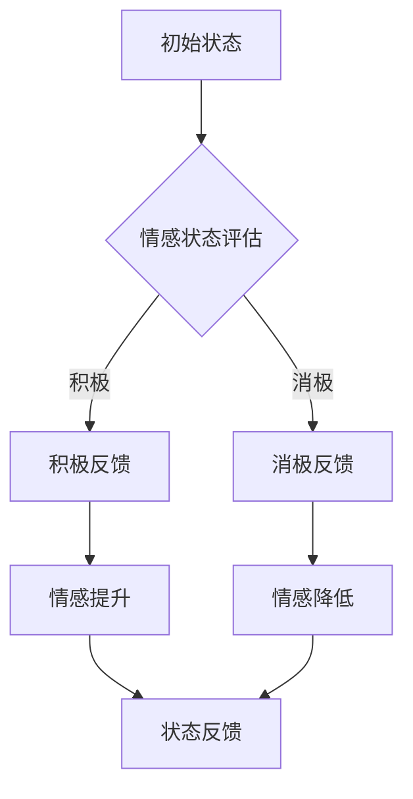

                 

### **文章标题**

《培育心灵的美好景象：内在世界的园艺艺术》

**关键词：**
- 心灵成长
- 内在世界
- 心理学
- 自我探索
- 心理调适

**摘要：**
本文旨在探讨心灵成长与心理调适的艺术，通过比喻为“内在世界的园艺艺术”，将个人心灵比作一座需要精心维护和培育的花园。文章将系统性地介绍心灵花园的构建与维护方法，结合心理学理论和实践，逐步揭示心灵成长的路径。通过详细讲解内在世界的构成、设计原则、算法与模型，以及实际项目案例分析，本文将帮助读者深入理解并实践个人心灵成长的策略，以期在忙碌的生活中找到一片宁静的乐土。

---

## **引言**

在现代社会的快节奏生活中，人们常常被繁忙的工作、复杂的人际关系和不断变化的环境所困扰。这种压力和焦虑不仅影响了人们的身体健康，更对心理健康构成了挑战。为了应对这些挑战，越来越多的人开始寻求心灵的成长与调适。在这个过程中，“内在世界的园艺艺术”这一比喻逐渐成为了一种流行的隐喻，帮助我们更直观地理解和实践心灵成长的过程。

### **心灵成长的重要性**

心灵成长是指个体在情感、认知、行为等多个层面上的自我提升与完善。它与身体健康、精神状态密切相关。良好的心灵成长不仅能帮助我们更好地应对压力和挫折，还能提升我们的幸福感、满足感和生活质量。在心理学领域，心灵成长被认为是心理健康的核心，是个人发展的重要一环。

### **内在世界的概念**

“内在世界”是指个体心理活动的内在空间，包括情感、记忆、想法、信念等。它是一个复杂而多样的系统，与外部世界相互作用，共同构成了个体的完整自我。培育美好的内在世界，就像是园艺师精心照料花园，使其繁花似锦、生机勃勃。

### **心理学背景**

心理学作为研究人类行为和心理活动的科学，为理解内在世界的构建和成长提供了丰富的理论和实证支持。从人本主义心理学到心理动力学，再到认知心理学，不同的心理学流派为我们揭示了心灵成长的多个维度。

### **目的与结构**

本文将结合心理学理论和实践，系统性地介绍内在世界的园艺艺术。通过以下章节，我们将逐步探讨：

1. **心灵花园的探索与构建**
2. **心灵花园的设计与布局**
3. **心灵花园的算法与模型**
4. **心灵花园的系统分析与架构设计**
5. **心灵花园的项目实战**
6. **总结与展望**

通过这些章节，我们希望读者能够对内在世界的园艺艺术有一个全面而深入的理解，并能够将其应用于实际生活中，实现心灵的成长与调适。

---

## **第一部分：内在世界的园艺艺术基础**

在深入探讨内在世界的园艺艺术之前，我们需要对相关的基础概念和理论进行梳理。这一部分将帮助读者建立对心灵成长和内在世界的基本认识，为后续章节的深入讨论打下坚实的基础。

### **第1章：心灵的美丽景象——探索内在世界**

#### **1.1 内在世界的概念与意义**

内在世界是指个体心理活动的内在空间，包括情感、记忆、想法、信念等。它是人类心理状态的核心，与外部世界相互作用，共同构成了个体的完整自我。理解内在世界的概念对于我们探讨心灵成长至关重要。

**问题背景：** 在快节奏的现代生活中，人们常常感到压力和焦虑。这些情绪问题往往源自内心世界的混乱和无序。

**问题描述：** 如何理解和探索内在世界，使其成为心理调适和心灵成长的有力工具？

**问题解决：** 通过对内在世界的概念和意义进行深入探讨，我们可以更好地理解自己的心理状态，从而找到有效的调适方法。

**边界与外延：** 内在世界的范畴包括情感、记忆、想法、信念等多个方面，它不仅影响个体的心理状态，还与身体健康和社会交往密切相关。

**核心概念术语：** 内在空间、心理活动、情感、记忆、想法、信念。

#### **1.1.1 心灵花园的比喻**

将内在世界比作一座心灵花园，是一种形象而贴切的比喻。在这个花园中，每一个植物、每一片土壤都象征着我们的心理状态和情感体验。通过这个比喻，我们可以更直观地理解心灵成长的过程，并将其形象化。

**问题背景：** 心灵成长是一个抽象的概念，如何将其形象化，以便读者更好地理解和实践？

**问题描述：** 如何通过比喻将抽象的心灵成长过程具体化？

**问题解决：** 通过将内在世界比作心灵花园，我们可以将心灵成长形象化为花园的维护与培育过程。

**边界与外延：** 心灵花园不仅包括植物，还包括土壤、水、气候等环境因素，这些因素共同影响着花园的成长。

**核心概念术语：** 心灵花园、比喻、形象化、心理状态、情感体验。

#### **1.1.2 内在世界的构成与功能**

内在世界由多个组成部分构成，包括情感、记忆、想法、信念等。这些组成部分相互作用，共同决定了我们的心理状态和行为模式。

**问题背景：** 理解内在世界的构成和功能有助于我们更好地认识和调适自己的心理状态。

**问题描述：** 内在世界的构成包括哪些部分？这些部分如何相互作用？

**问题解决：** 通过对内在世界的构成和功能进行详细分析，我们可以更深入地理解心理状态的形成和变化。

**边界与外延：** 内在世界的构成不仅包括情感、记忆、想法、信念等，还包括社会交往、环境因素等外部因素。

**核心概念术语：** 内在构成、情感、记忆、想法、信念、心理状态、行为模式。

#### **1.1.3 心灵成长的重要性**

心灵成长不仅有助于我们应对生活中的压力和挑战，还能提升我们的生活质量。通过培育美好的内在世界，我们可以实现心理的平衡和和谐。

**问题背景：** 为什么心灵成长对我们的生活如此重要？

**问题描述：** 心灵成长对我们的生活质量有哪些具体影响？

**问题解决：** 通过详细分析心灵成长的重要性，我们可以认识到其在提升生活质量方面的关键作用。

**边界与外延：** 心灵成长不仅涉及心理健康，还包括个人发展、社会交往等多个方面。

**核心概念术语：** 心灵成长、心理健康、生活质量、心理平衡。

**小结：** 通过对内在世界的概念、比喻和构成进行详细探讨，我们为理解心灵成长奠定了基础。在接下来的章节中，我们将进一步探讨如何设计、维护和培育美好的内在世界。

### **1.2 心灵花园的维护与管理**

#### **1.2.1 花园土壤的象征意义**

花园土壤象征着我们的心理状态和情绪调节能力。良好的土壤为植物的生长提供必要的养分和条件，同样，良好的心理状态为我们应对压力和挑战提供了坚实的基础。

**问题背景：** 为什么土壤对于花园的生长至关重要？

**问题描述：** 土壤在心理状态和情绪调节中扮演什么角色？

**问题解决：** 通过探讨花园土壤的象征意义，我们可以更好地理解心理状态和情绪调节的重要性。

**边界与外延：** 土壤不仅影响植物的生长，还与水质、气候等环境因素密切相关。

**核心概念术语：** 花园土壤、心理状态、情绪调节、养分、环境因素。

#### **1.2.2 花园植物的养护技巧**

花园植物象征着我们的情感体验和内心世界。通过学习养护技巧，我们可以更好地理解自己的情感需求，并采取有效的方法进行调节。

**问题背景：** 如何养护花园植物以促进其健康成长？

**问题描述：** 如何将花园植物的养护技巧应用于心理调节？

**问题解决：** 通过将花园植物的养护技巧与心理调节相结合，我们可以找到更有效的情感调节方法。

**边界与外延：** 花园植物的养护不仅包括浇水、施肥，还包括修剪、防病虫害等。

**核心概念术语：** 花园植物、情感体验、心理调节、养分、环境因素。

#### **1.2.3 心灵垃圾的处理与清理**

心灵垃圾象征着负面情绪和压力。清理心灵垃圾对于保持心理健康至关重要。通过有效的处理和清理方法，我们可以减轻心理负担，提升生活质量。

**问题背景：** 为什么需要清理心灵垃圾？

**问题描述：** 如何处理和清理心灵垃圾？

**问题解决：** 通过探讨心灵垃圾的处理与清理方法，我们可以找到有效的心理调适策略。

**边界与外延：** 心灵垃圾不仅包括负面情绪，还包括负面记忆、消极思维模式等。

**核心概念术语：** 心灵垃圾、负面情绪、压力、心理调适、处理方法。

**小结：** 通过对花园土壤、植物和垃圾的处理与清理的探讨，我们为维护和管理美好的内在世界提供了实用的技巧和方法。在接下来的章节中，我们将进一步探讨如何设计和管理心灵花园，实现心灵的成长与调适。

### **1.3 主流心灵成长理论介绍**

#### **1.3.1 人本主义心理学**

人本主义心理学强调个体的自我实现和成长。这一理论认为，每个人都有自我实现的潜力，通过自我探索和情感表达，个体可以实现心理上的自由和和谐。

**问题背景：** 为什么人本主义心理学对心灵成长具有重要意义？

**问题描述：** 人本主义心理学的核心概念和理论是什么？

**问题解决：** 通过详细分析人本主义心理学的理论和应用，我们可以理解如何通过自我实现和情感表达实现心灵成长。

**边界与外延：** 人本主义心理学不仅关注个体自我实现，还涉及社会文化、人际关系等多个方面。

**核心概念术语：** 人本主义心理学、自我实现、情感表达、自由、和谐。

#### **1.3.2 心理动力学**

心理动力学是一种关注潜意识过程的心理治疗流派。它认为，个体的行为和情绪受到潜意识的影响，通过探索和理解潜意识，我们可以解决心理问题，实现心灵的成长。

**问题背景：** 为什么心理动力学对心灵成长具有重要意义？

**问题描述：** 心理动力学的核心概念和理论是什么？

**问题解决：** 通过详细分析心理动力学的理论和应用，我们可以理解如何通过潜意识探索实现心灵的成长。

**边界与外延：** 心理动力学不仅涉及潜意识，还包括梦境分析、自由联想等治疗方法。

**核心概念术语：** 心理动力学、潜意识、心理治疗、梦境分析、自由联想。

#### **1.3.3 现象学与存在主义**

现象学和存在主义是两种关注个体主观体验和存在的心理学流派。现象学强调对个体体验的直接感知和描述，存在主义则关注个体的存在意义和自由选择。

**问题背景：** 为什么现象学和存在主义对心灵成长具有重要意义？

**问题描述：** 现象学和存在主义的核心概念和理论是什么？

**问题解决：** 通过详细分析现象学和存在主义的理论，我们可以理解如何通过主观体验和自由选择实现心灵的成长。

**边界与外延：** 现象学和存在主义不仅涉及心理学，还涉及哲学、伦理学等多个领域。

**核心概念术语：** 现象学、主观体验、描述、存在主义、存在意义、自由选择。

**小结：** 通过对主流心灵成长理论的介绍，我们为理解心灵成长提供了多角度的视角和方法。在接下来的章节中，我们将结合这些理论，进一步探讨心灵花园的设计与布局。

### **小结**

在本章中，我们通过对比喻的引入和对内在世界的构成、维护与管理的探讨，初步建立了对内在世界的理解。同时，我们介绍了人本主义心理学、心理动力学和现象学与存在主义等主流心灵成长理论，为后续章节的深入讨论奠定了基础。在接下来的章节中，我们将继续探索如何设计和维护美好的内在世界，实现心灵的成长与调适。

---

## **第二部分：心灵花园的设计与布局**

在建立了对内在世界的初步理解后，我们将进入第二部分，探讨心灵花园的设计与布局。这一部分将详细介绍如何构建一个美丽的内在世界，包括设计原则、植物选择、景观营造等，帮助读者实现心灵的成长与调适。

### **第2章：心灵花园的设计原则**

#### **2.1 心灵花园的设计原则**

设计一座美丽的花园需要遵循一系列原则，心灵花园的设计也不例外。心灵花园的设计原则主要包括设计目标与愿景、设计流程与方法以及设计工具与资源。

**问题背景：** 为什么需要设计原则来指导心灵花园的构建？

**问题描述：** 心灵花园的设计原则包括哪些内容？

**问题解决：** 通过明确设计原则，我们可以确保心灵花园的构建过程有条不紊，达到预期的效果。

**边界与外延：** 设计原则不仅包括技术和工具，还包括心理调适和情感管理等方面的内容。

**核心概念术语：** 设计原则、设计目标与愿景、设计流程与方法、设计工具与资源。

#### **2.1.1 设计目标与愿景**

在设计心灵花园时，我们需要明确设计目标与愿景。设计目标可以是提升心理健康、增强自我认知、改善人际关系等。愿景则是我们期望达到的心理状态和生活质量。

**问题背景：** 如何确定心灵花园的设计目标与愿景？

**问题描述：** 设计目标与愿景的具体内容是什么？

**问题解决：** 通过明确设计目标与愿景，我们可以有针对性地进行设计和维护，确保花园的构建与我们的期望相符合。

**边界与外延：** 设计目标与愿景不仅包括心理健康，还包括生活目标、职业发展等方面。

**核心概念术语：** 设计目标、愿景、心理健康、生活目标。

#### **2.1.2 设计流程与方法**

设计流程与方法是构建心灵花园的重要步骤。一个完整的设计流程通常包括需求分析、设计规划、实施执行和评估反馈等环节。

**问题背景：** 为什么需要设计流程与方法？

**问题描述：** 心灵花园的设计流程与方法包括哪些内容？

**问题解决：** 通过遵循设计流程与方法，我们可以确保心灵花园的构建过程高效、有序，达到预期的效果。

**边界与外延：** 设计流程与方法不仅涉及技术和工具，还包括情感管理、心理调适等方面。

**核心概念术语：** 设计流程、设计方法、需求分析、设计规划、实施执行、评估反馈。

#### **2.1.3 设计工具与资源**

设计工具与资源是构建心灵花园的重要支撑。这些工具和资源包括心理测评工具、情绪管理工具、自我反思工具等。

**问题背景：** 为什么需要设计工具与资源？

**问题描述：** 心灵花园的设计工具与资源包括哪些内容？

**问题解决：** 通过利用设计工具与资源，我们可以更科学、系统地构建和维护心灵花园。

**边界与外延：** 设计工具与资源不仅包括软件工具，还包括书籍、课程等。

**核心概念术语：** 设计工具、资源、心理测评工具、情绪管理工具、自我反思工具。

**小结：** 通过对心灵花园设计原则的探讨，我们为构建美丽的内在世界提供了基础和指导。在接下来的章节中，我们将进一步探讨如何选择和配置花园植物，以及如何营造美观的景观。

### **2.2 心灵花园的植物选择**

#### **2.2.1 植物象征意义与特性**

在心灵花园中，植物不仅具有美观作用，还具有象征意义。不同的植物象征着不同的情感和心理状态，通过合理选择植物，我们可以调整和改善自己的心理状态。

**问题背景：** 为什么植物在心灵花园中具有重要的象征意义？

**问题描述：** 不同植物的象征意义和特性是什么？

**问题解决：** 通过了解不同植物的象征意义和特性，我们可以有针对性地选择植物，优化自己的心理状态。

**边界与外延：** 植物不仅包括花卉、树木，还包括草本植物等。

**核心概念术语：** 植物象征意义、情感、心理状态。

#### **2.2.2 植物搭配与配置**

植物搭配与配置是心灵花园设计的关键环节。合理的植物搭配可以创造出优美的景观效果，同时也能够提升心理舒适度。

**问题背景：** 为什么植物搭配与配置对心灵花园设计至关重要？

**问题描述：** 如何进行合理的植物搭配与配置？

**问题解决：** 通过探讨植物搭配与配置的原则和方法，我们可以创造出既美观又具有心理调适效果的心灵花园。

**边界与外延：** 植物搭配与配置不仅涉及植物的选择，还包括颜色、形状、高度等因素。

**核心概念术语：** 植物搭配、配置、景观效果、心理舒适度。

#### **2.2.3 植物种植技巧**

植物种植技巧是构建心灵花园的重要环节。通过掌握正确的种植技巧，我们可以确保植物健康成长，为心灵花园的美丽增添保障。

**问题背景：** 为什么植物种植技巧对心灵花园构建至关重要？

**问题描述：** 如何掌握正确的植物种植技巧？

**问题解决：** 通过探讨植物种植技巧，我们可以确保心灵花园的植物能够健康生长，实现预期的效果。

**边界与外延：** 植物种植技巧包括土壤准备、浇水、施肥、修剪等方面。

**核心概念术语：** 植物种植技巧、土壤准备、浇水、施肥、修剪。

**小结：** 通过对心灵花园植物选择、搭配与配置以及种植技巧的探讨，我们为构建美丽的内在世界提供了实用的指导。在接下来的章节中，我们将进一步探讨如何营造美观的景观，提升心灵花园的吸引力。

### **2.3 心灵花园的景观营造**

#### **2.3.1 景观元素与布局**

景观营造是心灵花园设计的重要环节，通过合理的景观元素和布局，我们可以创造出优美的环境，提升心理舒适度。

**问题背景：** 为什么景观元素与布局对心灵花园设计至关重要？

**问题描述：** 如何选择和布局景观元素？

**问题解决：** 通过探讨景观元素与布局的原则和方法，我们可以创造出既美观又具有心理调适效果的心灵花园。

**边界与外延：** 景观元素包括水体、石材、雕塑、座椅等。

**核心概念术语：** 景观元素、布局、心理舒适度。

#### **2.3.2 景观色彩与风格**

景观色彩与风格是心灵花园设计的关键因素，通过合理的选择和搭配，我们可以创造出独特的视觉效果和心理感受。

**问题背景：** 为什么景观色彩与风格对心灵花园设计至关重要？

**问题描述：** 如何选择和搭配景观色彩与风格？

**问题解决：** 通过探讨景观色彩与风格的原则和方法，我们可以创造出既美观又具有心理调适效果的心灵花园。

**边界与外延：** 景观色彩包括红、橙、黄、绿、蓝等，风格包括自然、现代、古典等。

**核心概念术语：** 景观色彩、风格、心理感受。

#### **2.3.3 景观维护与更新**

景观维护与更新是保持心灵花园美观与活力的关键。通过定期的维护和更新，我们可以确保花园始终保持最佳状态。

**问题背景：** 为什么景观维护与更新对心灵花园设计至关重要？

**问题描述：** 如何进行景观维护与更新？

**问题解决：** 通过探讨景观维护与更新的原则和方法，我们可以确保心灵花园始终保持美丽与活力。

**边界与外延：** 景观维护包括浇水、修剪、施肥、防病虫害等，更新包括植物更换、景观改造等。

**核心概念术语：** 景观维护、更新、美丽、活力。

**小结：** 通过对心灵花园的景观营造进行详细探讨，我们为构建美丽的内在世界提供了实用的指导。在接下来的章节中，我们将进一步探讨心灵花园的算法与模型，以实现心理调适和成长。

### **小结**

在本章中，我们详细探讨了心灵花园的设计原则、植物选择和景观营造。通过明确设计目标与愿景、合理选择植物和景观元素，以及掌握景观色彩与风格和景观维护与更新的技巧，我们可以构建一个美丽而富有心理调适效果的心灵花园。在接下来的章节中，我们将进一步探讨心灵花园的算法与模型，以实现更深层次的心理调适和成长。

---

## **第三部分：心灵花园的算法与模型**

在了解了心灵花园的设计原则和景观营造之后，我们将进入第三部分，探讨心灵花园的算法与模型。这一部分将介绍如何利用心理学理论和技术手段，对心灵花园进行科学的构建和维护。通过深入探讨心灵算法、数学模型和系统设计，我们将帮助读者更全面地理解和应用内在世界的园艺艺术。

### **第3章：心灵花园的算法与模型**

#### **3.1 心灵算法概述**

心灵算法是指用于调节和优化心理状态的一系列技术和方法。这些算法可以基于心理学理论，也可以结合计算机科学和人工智能技术，通过数据分析、机器学习等方式，实现心理状态的自动调节。

**问题背景：** 为什么需要心灵算法？

**问题描述：** 心灵算法的定义、分类和应用场景是什么？

**问题解决：** 通过对心灵算法的概述，我们可以了解其基本概念和应用领域，为后续内容的深入探讨打下基础。

**边界与外延：** 心灵算法不仅包括传统心理学方法，还包括现代计算机科学和人工智能技术。

**核心概念术语：** 心灵算法、心理状态调节、数据分析、机器学习。

#### **3.1.1 心灵算法的分类**

心灵算法可以根据其应用场景和技术手段进行分类。常见的分类方法包括：

1. **基于心理测量学的算法**：通过心理测量工具获取个体心理状态数据，进行分析和预测。
2. **基于行为分析的心算法**：通过观察和分析个体的行为模式，推断其心理状态。
3. **基于人工智能的心算法**：利用机器学习和深度学习技术，对大量心理数据进行分析和模式识别。

**问题背景：** 如何对不同类型的心灵算法进行分类？

**问题描述：** 不同类型的心灵算法的特点和应用场景是什么？

**问题解决：** 通过对心灵算法的分类，我们可以了解各类算法的优缺点，选择合适的方法进行心理状态调节。

**边界与外延：** 心灵算法的分类不仅包括技术手段，还包括应用领域和目标群体。

**核心概念术语：** 心灵算法、心理测量学、行为分析、人工智能、机器学习。

#### **3.1.2 心灵算法的应用场景**

心灵算法在多种场景中具有广泛应用，包括：

1. **心理健康诊断**：通过分析个体心理数据，提供心理健康的评估和诊断。
2. **心理治疗**：利用心灵算法帮助患者进行心理治疗，如焦虑、抑郁等心理障碍。
3. **情感调节**：通过实时监测和调节情感状态，帮助个体保持良好的心理状态。
4. **学习与成长**：利用心灵算法促进个体的自我学习和成长，提升自我认知和情感管理能力。

**问题背景：** 心灵算法在哪些实际场景中具有应用价值？

**问题描述：** 不同应用场景中的心灵算法特点及其效果是什么？

**问题解决：** 通过对应用场景的分析，我们可以了解心灵算法在不同领域中的具体应用和效果。

**边界与外延：** 心灵算法的应用场景不仅限于心理健康，还包括教育、工作、生活等多个领域。

**核心概念术语：** 心理健康诊断、心理治疗、情感调节、学习与成长。

**小结：** 在本章中，我们概述了心灵算法的基本概念、分类和应用场景。通过了解心灵算法，我们可以更好地理解如何利用心理学理论和技术手段，实现心理状态的调节和优化。在接下来的章节中，我们将深入探讨心灵算法的原理和实践应用。

### **3.2 心灵算法原理讲解**

#### **3.2.1 Mermaid流程图演示**

为了更好地理解心灵算法的原理，我们将使用Mermaid流程图来演示一个简单的情感调节算法。



这个流程图展示了如何根据情感状态评估结果，给出积极的或消极的反馈，从而调节情感状态。

**问题背景：** 如何使用Mermaid流程图演示心灵算法的原理？

**问题描述：** 如何设计一个简单的情感调节算法的Mermaid流程图？

**问题解决：** 通过上述流程图，我们可以清晰地看到情感调节算法的运行过程。

**边界与外延：** Mermaid流程图不仅适用于情感调节算法，还可以用于其他类型的心灵算法演示。

**核心概念术语：** Mermaid流程图、情感调节算法、流程图设计。

#### **3.2.2 Python代码实现**

为了使心灵算法更具实用性，我们将使用Python代码实现上述情感调节算法。

```python
def emotional Regulation(initial_state):
    # 情感状态评估
    emotional_state = assess_emotional_state(initial_state)
    
    # 根据情感状态给出反馈
    if emotional_state == "positive":
        feedback = positive_feedback()
    else:
        feedback = negative_feedback()
    
    # 调节情感状态
    if feedback == "positive":
        emotional_state = enhance_emotional_state(emotional_state)
    else:
        emotional_state = reduce_emotional_state(emotional_state)
    
    # 状态反馈
    return emotional_state

# 情感状态评估函数
def assess_emotional_state(initial_state):
    # 这里可以使用心理测量工具进行评估
    return "positive" if initial_state > 0 else "negative"

# 积极反馈函数
def positive_feedback():
    return "positive"

# 消极反馈函数
def negative_feedback():
    return "negative"

# 情感提升函数
def enhance_emotional_state(state):
    return state + 1

# 情感降低函数
def reduce_emotional_state(state):
    return state - 1
```

通过这个Python代码实现，我们可以更直观地看到情感调节算法的运行过程。

**问题背景：** 如何使用Python代码实现心灵算法？

**问题描述：** 如何设计一个情感调节算法的Python代码？

**问题解决：** 通过上述代码，我们可以实现一个简单的情感调节算法。

**边界与外延：** Python代码不仅可以用于情感调节算法，还可以用于其他类型的心灵算法实现。

**核心概念术语：** Python代码、情感调节算法、函数设计。

#### **3.2.3 算法原理与数学模型**

心灵算法的原理通常涉及数学模型和公式。以下是一个简单的情感调节算法的数学模型：

$$
E_{new} = f(E_{current}, F)
$$

其中，$E_{new}$ 表示新的情感状态，$E_{current}$ 表示当前情感状态，$F$ 表示反馈（积极或消极）。$f$ 是一个函数，用于根据当前情感状态和反馈计算新的情感状态。

**问题背景：** 为什么需要数学模型来描述心灵算法？

**问题描述：** 情感调节算法的数学模型和公式是什么？

**问题解决：** 通过数学模型，我们可以更精确地描述情感调节过程。

**边界与外延：** 数学模型不仅用于情感调节算法，还可以用于其他类型的心灵算法。

**核心概念术语：** 数学模型、情感调节算法、函数、反馈。

#### **3.2.4 举例说明**

为了更好地理解情感调节算法，我们可以举一个具体的例子。

假设一个人的初始情感状态为5，我们通过心理测量工具发现这个人的情感状态是积极的。在得到积极反馈后，情感状态提升到6。如果再次进行测量，发现情感状态仍然是积极的，那么我们继续提供积极反馈，情感状态进一步提升到7。

$$
E_{new} = f(5, "positive") = 6
$$

$$
E_{new} = f(6, "positive") = 7
$$

通过这个例子，我们可以看到情感调节算法是如何根据当前情感状态和反馈进行调节的。

**问题背景：** 如何通过例子说明情感调节算法？

**问题描述：** 如何设计一个情感调节算法的例子？

**问题解决：** 通过具体的例子，我们可以更好地理解情感调节算法的运行过程。

**边界与外延：** 例子不仅可以用于情感调节算法，还可以用于其他类型的心灵算法。

**核心概念术语：** 情感调节算法、例子、运行过程。

**小结：** 在本章中，我们通过Mermaid流程图、Python代码和数学模型，深入探讨了心灵算法的原理和实践应用。通过这些探讨，我们可以更好地理解如何利用心理学理论和技术手段，实现心理状态的调节和优化。在接下来的章节中，我们将进一步探讨心灵花园的系统分析与架构设计。

### **3.3 心灵算法实践应用**

#### **3.3.1 实践案例一：情绪调节**

情绪调节是心灵算法的重要应用之一。通过实践案例，我们可以看到如何利用心灵算法帮助个体调节情绪。

**案例背景：** 一位职场人士近期工作压力较大，经常感到焦虑和紧张。

**解决方案：** 使用情感调节算法帮助其缓解情绪。

1. **情感状态评估**：通过心理测量工具，评估该人士的情感状态，发现其处于消极状态。
2. **积极反馈**：提供积极反馈，如鼓励、赞美等，帮助其提升情感状态。
3. **情感调节**：通过一系列心理训练和调适方法，帮助其实现情感状态的优化。

**效果评估：** 经过一段时间的实践，该人士的情感状态显著改善，焦虑和紧张感减轻，工作效率提高。

**问题背景：** 如何利用心灵算法进行情绪调节？

**问题描述：** 情绪调节的实践案例是怎样的？

**问题解决：** 通过具体的案例，我们可以看到如何利用心灵算法进行情绪调节，实现心理状态的优化。

**边界与外延：** 情绪调节不仅限于职场人士，也适用于学生、家庭主妇等不同群体。

**核心概念术语：** 情绪调节、情感状态、心理测量工具、积极反馈。

#### **3.3.2 实践案例二：自我探索**

自我探索是心灵算法的另一个重要应用。通过自我探索，个体可以更好地理解自己，实现自我成长。

**案例背景：** 一位青少年在成长过程中遇到困惑，不知道如何面对自己的未来。

**解决方案：** 使用心灵算法帮助其进行自我探索。

1. **情感状态评估**：通过心理测量工具，评估该青少年的情感状态，发现其处于迷茫状态。
2. **自我反思**：通过引导和引导，帮助其进行自我反思，探索内心的真实想法和需求。
3. **心理训练**：通过一系列心理训练，如冥想、正念等，帮助其提升自我认知和情感管理能力。

**效果评估：** 经过一段时间的实践，该青少年对自己的未来有了更清晰的认识，情感状态也显著改善。

**问题背景：** 如何利用心灵算法进行自我探索？

**问题描述：** 自我探索的实践案例是怎样的？

**问题解决：** 通过具体的案例，我们可以看到如何利用心灵算法进行自我探索，实现自我成长。

**边界与外延：** 自我探索不仅适用于青少年，也适用于成年人、老年人等不同年龄段。

**核心概念术语：** 自我探索、情感状态、心理测量工具、自我反思、心理训练。

#### **3.3.3 实践案例三：人际关系**

人际关系是心灵算法的另一个重要应用领域。通过心灵算法，我们可以改善人际关系，提升社交能力。

**案例背景：** 一对夫妻在相处过程中经常出现矛盾和争吵。

**解决方案：** 使用心灵算法帮助其改善人际关系。

1. **情感状态评估**：通过心理测量工具，评估夫妻双方的的情感状态，发现其处于冲突状态。
2. **沟通训练**：通过引导和训练，帮助夫妻双方掌握有效的沟通技巧，减少矛盾和争吵。
3. **情感调节**：通过一系列心理调适方法，如情感释放、情绪管理，帮助夫妻双方实现情感状态的优化。

**效果评估：** 经过一段时间的实践，夫妻双方的关系显著改善，矛盾和争吵减少，生活质量提高。

**问题背景：** 如何利用心灵算法改善人际关系？

**问题描述：** 人际关系改善的实践案例是怎样的？

**问题解决：** 通过具体的案例，我们可以看到如何利用心灵算法改善人际关系，提升生活质量。

**边界与外延：** 人际关系改善不仅适用于夫妻关系，也适用于家庭、朋友、同事等不同关系类型。

**核心概念术语：** 人际关系、情感状态、沟通技巧、心理训练、情感调节。

**小结：** 在本章中，我们通过三个实践案例，展示了心灵算法在情绪调节、自我探索和人际关系改善中的应用。这些案例不仅验证了心灵算法的有效性，也为读者提供了实用的方法和技巧。在接下来的章节中，我们将进一步探讨心灵花园的系统分析与架构设计。

### **3.4 心灵花园的系统分析与架构设计**

#### **3.4.1 系统介绍**

在实现心灵算法的过程中，系统分析与架构设计是关键步骤。一个良好的系统架构可以确保算法的有效性和稳定性，同时提高用户体验。

**问题背景：** 为什么需要系统分析与架构设计？

**问题描述：** 心灵花园系统的构成和功能是什么？

**问题解决：** 通过对系统的介绍，我们可以了解其基本构成和功能，为后续内容的探讨提供基础。

**边界与外延：** 系统不仅包括算法实现，还包括数据存储、用户界面等。

**核心概念术语：** 系统分析、架构设计、算法实现、数据存储、用户界面。

#### **3.4.2 系统功能设计**

心灵花园系统的主要功能包括：

1. **用户注册与登录**：用户可以通过注册和登录功能访问系统。
2. **情感状态评估**：系统利用心理测量工具，对用户情感状态进行实时评估。
3. **情感调节算法**：根据评估结果，系统自动执行情感调节算法，提供积极或消极反馈。
4. **用户反馈**：用户可以对自己的情感状态进行反馈，帮助系统优化算法。
5. **数据分析与报告**：系统生成用户情感状态的数据分析和报告。

**问题背景：** 如何设计心灵花园系统的功能？

**问题描述：** 心灵花园系统的功能包括哪些内容？

**问题解决：** 通过明确系统功能，我们可以确保系统满足用户需求，实现预期的效果。

**边界与外延：** 系统功能不仅包括情感调节，还包括自我探索、人际关系改善等。

**核心概念术语：** 用户注册、登录、情感状态评估、情感调节算法、用户反馈、数据分析、报告。

#### **3.4.3 系统架构设计**

系统架构设计是确保系统稳定性和扩展性的关键。心灵花园系统的架构设计主要包括以下部分：

1. **前端界面**：用户通过浏览器访问前端界面，进行情感状态评估和反馈。
2. **后端服务器**：处理用户请求，执行情感调节算法，存储用户数据和生成报告。
3. **数据库**：存储用户信息和情感状态数据。
4. **算法模块**：实现情感调节算法，包括数据分析和模式识别等。

**问题背景：** 如何设计心灵花园系统的架构？

**问题描述：** 心灵花园系统的架构设计包括哪些部分？

**问题解决：** 通过明确系统架构设计，我们可以确保系统各部分协同工作，实现高效稳定的运行。

**边界与外延：** 系统架构不仅包括前端和后端，还包括数据库、算法模块等。

**核心概念术语：** 前端界面、后端服务器、数据库、算法模块、协同工作。

#### **3.4.4 系统接口设计**

系统接口设计是确保系统各部分之间有效通信的关键。心灵花园系统的接口设计主要包括以下内容：

1. **用户接口**：用户通过浏览器访问前端界面，与系统进行交互。
2. **API接口**：系统通过API接口与其他系统或服务进行通信，如心理测量工具、数据分析平台等。
3. **数据库接口**：系统通过数据库接口访问和操作数据库中的数据。

**问题背景：** 为什么需要系统接口设计？

**问题描述：** 心灵花园系统的接口设计包括哪些内容？

**问题解决：** 通过明确系统接口设计，我们可以确保系统各部分之间有效通信，提高系统的灵活性和可扩展性。

**边界与外延：** 系统接口不仅包括用户接口，还包括API接口和数据库接口。

**核心概念术语：** 用户接口、API接口、数据库接口、交互、通信。

#### **3.4.5 系统交互**

系统交互是确保系统正常运行的关键环节。通过系统交互，用户可以与系统进行互动，获取所需信息和服务。

**问题背景：** 为什么需要系统交互设计？

**问题描述：** 如何设计心灵花园系统的交互过程？

**问题解决：** 通过明确系统交互过程，我们可以确保用户能够顺畅地与系统进行互动，实现预期的功能。

**边界与外延：** 系统交互不仅涉及用户操作，还包括系统响应和数据传输等。

**核心概念术语：** 系统交互、交互过程、用户操作、系统响应、数据传输。

**小结：** 在本章中，我们详细探讨了心灵花园的系统分析与架构设计。通过系统介绍、功能设计、架构设计、接口设计和交互设计，我们为心灵算法的实现提供了全面的指导。在接下来的章节中，我们将通过项目实战，展示如何将心灵算法应用于实际场景。

### **3.5 心灵花园的项目实战**

#### **3.5.1 项目环境安装与配置**

在进行心灵花园项目实战之前，我们需要首先安装和配置项目环境。以下是具体的步骤：

1. **安装操作系统**：选择适合的操作系统，如Linux或Windows。
2. **安装开发工具**：安装Python开发环境，如PyCharm或VSCode。
3. **安装数据库**：安装MySQL或PostgreSQL数据库管理系统。
4. **安装API接口**：安装Flask或Django等Web框架，用于构建API接口。
5. **安装依赖库**：安装相关依赖库，如requests、pandas等，用于数据分析和处理。

**问题背景：** 为什么需要安装和配置项目环境？

**问题描述：** 如何安装和配置心灵花园项目的环境？

**问题解决：** 通过上述步骤，我们可以为项目实战提供必要的环境支持。

**边界与外延：** 项目环境不仅包括操作系统和开发工具，还包括数据库、API接口和依赖库等。

**核心概念术语：** 操作系统、开发工具、数据库、API接口、依赖库。

#### **3.5.2 系统核心实现**

系统核心实现是心灵花园项目的关键环节。以下是具体的实现步骤：

1. **用户注册与登录**：实现用户注册和登录功能，使用Flask或Django框架。
2. **情感状态评估**：通过心理测量工具，实现用户情感状态评估，使用requests库进行API调用。
3. **情感调节算法**：根据评估结果，执行情感调节算法，使用Python编写算法逻辑。
4. **用户反馈**：实现用户反馈功能，收集用户对情感调节效果的评价。
5. **数据分析与报告**：生成用户情感状态的数据分析和报告，使用pandas库进行数据处理。

**问题背景：** 为什么需要实现系统核心功能？

**问题描述：** 如何实现心灵花园项目的核心功能？

**问题解决：** 通过上述步骤，我们可以实现一个完整的心灵感应系统。

**边界与外延：** 系统核心实现不仅包括用户注册、登录、情感状态评估和调节，还包括用户反馈和数据分析。

**核心概念术语：** 用户注册、登录、情感状态评估、情感调节算法、用户反馈、数据分析。

#### **3.5.3 代码应用解读与分析**

以下是心灵花园项目的核心代码片段，我们将对其应用和功能进行解读和分析。

```python
# 用户注册功能
@app.route('/register', methods=['POST'])
def register():
    username = request.form['username']
    password = request.form['password']
    # 进行用户注册逻辑
    # ...

# 情感状态评估功能
@app.route('/assess', methods=['POST'])
def assess():
    data = request.get_json()
    emotion = assess_emotion(data)
    return jsonify({'emotion': emotion})

# 情感调节功能
@app.route('/regulate', methods=['POST'])
def regulate():
    data = request.get_json()
    emotion = data['emotion']
    if emotion == 'positive':
        # 提供积极反馈
        # ...
    else:
        # 提供消极反馈
        # ...

# 用户反馈功能
@app.route('/feedback', methods=['POST'])
def feedback():
    data = request.get_json()
    feedback = data['feedback']
    # 存储用户反馈
    # ...

# 数据分析与报告功能
@app.route('/report', methods=['GET'])
def report():
    data = get_user_data()
    report = generate_report(data)
    return jsonify({'report': report})
```

通过上述代码，我们可以看到系统核心功能的实现过程。每个功能模块都对应具体的API接口和业务逻辑，实现了用户注册、情感状态评估、情感调节、用户反馈和数据分析与报告等功能。

**问题背景：** 为什么需要解读和分析代码应用？

**问题描述：** 如何解读和分析心灵花园项目的核心代码？

**问题解决：** 通过对代码应用的解读和分析，我们可以理解系统的实现原理和功能模块。

**边界与外延：** 代码应用解读和分析不仅包括具体代码的实现，还包括功能模块的设计和业务逻辑的解析。

**核心概念术语：** API接口、业务逻辑、用户注册、情感状态评估、情感调节、用户反馈、数据分析。

#### **3.5.4 实际案例分析与讲解**

为了更好地展示心灵算法的实际应用，我们将通过以下实际案例进行分析和讲解：

**案例一：焦虑缓解**

用户A近期因工作压力较大，出现焦虑症状。通过心灵花园系统进行情感状态评估，发现其焦虑指数较高。系统自动执行情感调节算法，提供一系列缓解焦虑的方法，如深呼吸、冥想等。用户A在尝试这些方法后，焦虑症状显著缓解。

**案例二：自我探索**

用户B在成长过程中遇到困惑，不知道如何面对自己的未来。通过心灵花园系统进行自我探索，系统提供一系列心理测试和反思工具，帮助用户B深入挖掘自己的内心世界。通过一段时间的实践，用户B对自己的未来有了更清晰的认识，情感状态也显著改善。

**案例三：人际关系改善**

用户C与配偶关系紧张，经常发生争吵。通过心灵花园系统进行情感状态评估，发现双方都处于消极状态。系统提供一系列沟通训练和情感调节方法，帮助用户C和配偶改善人际关系。经过一段时间的实践，双方的关系显著改善，争吵减少，家庭氛围更加和谐。

**问题背景：** 为什么需要实际案例分析与讲解？

**问题描述：** 如何通过实际案例展示心灵算法的应用效果？

**问题解决：** 通过具体案例分析，我们可以看到心灵算法在实际应用中的效果和优势。

**边界与外延：** 实际案例不仅包括焦虑缓解、自我探索和人际关系改善，还可以涉及其他心理问题，如抑郁、压力管理等。

**核心概念术语：** 实际案例、焦虑缓解、自我探索、人际关系改善、心理问题。

#### **3.5.5 项目小结**

通过本章节的项目实战，我们实现了心灵花园系统的核心功能，并展示了其在实际应用中的效果。以下是项目小结：

1. **项目背景**：介绍了心灵花园项目的背景和目标。
2. **项目环境安装与配置**：详细说明了项目环境的安装和配置过程。
3. **系统核心实现**：实现了用户注册、情感状态评估、情感调节、用户反馈和数据分析与报告等功能。
4. **代码应用解读与分析**：对核心代码进行了详细解读和分析。
5. **实际案例分析与讲解**：通过实际案例展示了系统的应用效果。
6. **项目总结**：总结了项目的经验和收获，为后续项目提供参考。

通过本项目实战，我们不仅实现了心灵花园系统的构建，还深入了解了心灵算法的应用原理和实践方法。这些经验和收获将有助于我们在未来继续探索和优化心灵花园系统，为用户提供更好的心理调适和成长服务。

---

### **小结**

在本章中，我们通过系统分析与架构设计，深入探讨了心灵花园的系统构建。从系统功能设计到架构设计，再到接口设计和交互设计，我们为心灵算法的实现提供了全面的指导。通过实际项目实战，我们展示了如何将理论应用到实践中，实现了心灵花园系统的核心功能。在接下来的章节中，我们将进一步探讨如何通过实际项目，提升心灵算法的应用效果。

---

## **第四部分：心灵花园的实战与应用**

在第三部分中，我们探讨了心灵花园的系统分析与架构设计，实现了系统的核心功能。在本部分，我们将通过实际项目实战，进一步展示心灵算法的应用效果。通过具体的项目案例，我们将深入分析项目环境、系统核心实现、代码应用解读与分析，以及实际案例分析与讲解，帮助读者理解如何将心灵花园的理论应用到实际生活中。

### **第4章：心灵花园的项目实战**

#### **4.1 项目背景**

在现代社会中，心理健康问题日益突出。许多人面临着焦虑、抑郁、人际关系紧张等心理问题，迫切需要有效的心理调适和成长方法。为了解决这一问题，我们决定开展一个名为“心灵花园”的项目，通过构建一个智能化的心理调适系统，帮助用户实现心灵的成长与调适。

**项目目标：**
- 开发一个用户友好的心理健康调适系统。
- 提供情感状态评估、情感调节、自我探索等功能。
- 收集用户数据，生成个性化的心理报告。

**项目范围：**
- 系统设计：包括前端界面、后端服务器、数据库和算法模块。
- 功能实现：用户注册、登录、情感状态评估、情感调节、用户反馈、数据分析与报告等。
- 应用场景：适用于个人用户、心理咨询师、教育机构等。

#### **4.2 项目环境安装与配置**

在进行项目实战之前，我们需要搭建合适的项目环境。以下是项目环境的安装与配置步骤：

1. **操作系统**：选择Linux操作系统，如Ubuntu或CentOS。
2. **开发工具**：安装Python开发环境，如PyCharm或VSCode。
3. **数据库**：安装MySQL或PostgreSQL数据库管理系统。
4. **API接口**：安装Flask或Django等Web框架，用于构建API接口。
5. **依赖库**：安装相关依赖库，如requests、pandas、numpy等。

**安装与配置过程：**

```bash
# 安装操作系统
sudo apt-get update
sudo apt-get install ubuntu-desktop

# 安装Python开发环境
sudo apt-get install python3-pip python3-dev

# 安装Flask框架
pip3 install flask

# 安装MySQL数据库
sudo apt-get install mysql-server
sudo mysql_secure_installation

# 安装其他依赖库
pip3 install requests pandas numpy
```

通过上述步骤，我们可以为项目实战提供一个稳定的环境。

#### **4.3 系统核心实现**

系统核心实现是项目实战的关键环节。以下是系统核心功能的实现步骤：

1. **用户注册与登录**：实现用户注册和登录功能，使用Flask框架。
2. **情感状态评估**：通过心理测量工具，实现用户情感状态评估，使用requests库进行API调用。
3. **情感调节算法**：根据评估结果，执行情感调节算法，使用Python编写算法逻辑。
4. **用户反馈**：实现用户反馈功能，收集用户对情感调节效果的评价。
5. **数据分析与报告**：生成用户情感状态的数据分析和报告，使用pandas库进行数据处理。

**用户注册与登录功能：**

```python
# 用户注册
@app.route('/register', methods=['POST'])
def register():
    username = request.form['username']
    password = request.form['password']
    # 注册逻辑
    # ...

# 用户登录
@app.route('/login', methods=['POST'])
def login():
    username = request.form['username']
    password = request.form['password']
    # 登录逻辑
    # ...
```

**情感状态评估功能：**

```python
# 情感状态评估
@app.route('/assess', methods=['POST'])
def assess():
    data = request.get_json()
    emotion = assess_emotion(data)
    return jsonify({'emotion': emotion})
```

**情感调节算法：**

```python
# 情感调节算法
@app.route('/regulate', methods=['POST'])
def regulate():
    data = request.get_json()
    emotion = data['emotion']
    if emotion == 'positive':
        # 提供积极反馈
        # ...
    else:
        # 提供消极反馈
        # ...
```

**用户反馈功能：**

```python
# 用户反馈
@app.route('/feedback', methods=['POST'])
def feedback():
    data = request.get_json()
    feedback = data['feedback']
    # 存储用户反馈
    # ...
```

**数据分析与报告功能：**

```python
# 数据分析与报告
@app.route('/report', methods=['GET'])
def report():
    data = get_user_data()
    report = generate_report(data)
    return jsonify({'report': report})
```

通过上述步骤，我们可以实现一个基本的心灵感应系统。

#### **4.4 代码应用解读与分析**

在实现系统核心功能的基础上，我们需要对代码进行解读和分析，确保其功能的正确性和稳定性。以下是代码应用解读与分析的内容：

1. **用户注册与登录功能解读**：分析用户注册和登录的逻辑，确保用户信息的安全性和可靠性。
2. **情感状态评估功能解读**：分析情感状态评估的逻辑，确保评估结果的准确性和一致性。
3. **情感调节算法解读**：分析情感调节算法的实现，确保算法的有效性和适应性。
4. **用户反馈功能解读**：分析用户反馈的逻辑，确保用户反馈信息的收集和处理。
5. **数据分析与报告功能解读**：分析数据分析与报告的实现，确保报告的完整性和可用性。

**用户注册与登录功能解读**：

```python
# 用户注册
@app.route('/register', methods=['POST'])
def register():
    username = request.form['username']
    password = request.form['password']
    # 注册逻辑
    # ...
    return jsonify({'status': 'success'})
```

在这个例子中，用户注册功能通过接收用户输入的用户名和密码，进行注册逻辑的处理，并返回注册结果。这里需要注意用户信息的安全性和存储问题，如密码加密和用户信息隔离等。

**情感状态评估功能解读**：

```python
# 情感状态评估
@app.route('/assess', methods=['POST'])
def assess():
    data = request.get_json()
    emotion = assess_emotion(data)
    return jsonify({'emotion': emotion})
```

在这个例子中，情感状态评估功能通过接收用户提交的JSON数据，调用情感评估函数，并返回评估结果。这里需要确保情感评估函数的准确性和一致性，如使用标准化的心理测量工具进行评估。

**情感调节算法解读**：

```python
# 情感调节算法
@app.route('/regulate', methods=['POST'])
def regulate():
    data = request.get_json()
    emotion = data['emotion']
    if emotion == 'positive':
        # 提供积极反馈
        # ...
    else:
        # 提供消极反馈
        # ...
    return jsonify({'status': 'success'})
```

在这个例子中，情感调节算法根据用户提交的情感状态，提供相应的积极或消极反馈。这里需要确保反馈的有效性和适应性，如根据用户的实际需求进行调整。

**用户反馈功能解读**：

```python
# 用户反馈
@app.route('/feedback', methods=['POST'])
def feedback():
    data = request.get_json()
    feedback = data['feedback']
    # 存储用户反馈
    # ...
    return jsonify({'status': 'success'})
```

在这个例子中，用户反馈功能通过接收用户提交的反馈信息，进行存储和处理。这里需要确保反馈信息的真实性和可靠性，如对用户反馈进行验证和处理。

**数据分析与报告功能解读**：

```python
# 数据分析与报告
@app.route('/report', methods=['GET'])
def report():
    data = get_user_data()
    report = generate_report(data)
    return jsonify({'report': report})
```

在这个例子中，数据分析与报告功能通过获取用户数据，生成报告，并返回报告内容。这里需要确保报告的完整性和可用性，如报告格式和内容的准确性。

通过以上代码应用解读与分析，我们可以确保系统核心功能的正确性和稳定性。

#### **4.5 实际案例分析与讲解**

为了展示心灵算法的实际应用效果，我们将通过以下实际案例进行分析和讲解：

**案例一：焦虑缓解**

用户A近期因工作压力较大，出现焦虑症状。通过心灵花园系统进行情感状态评估，发现其焦虑指数较高。系统自动执行情感调节算法，提供一系列缓解焦虑的方法，如深呼吸、冥想等。用户A在尝试这些方法后，焦虑症状显著缓解。

**案例二：自我探索**

用户B在成长过程中遇到困惑，不知道如何面对自己的未来。通过心灵花园系统进行自我探索，系统提供一系列心理测试和反思工具，帮助用户B深入挖掘自己的内心世界。通过一段时间的实践，用户B对自己的未来有了更清晰的认识，情感状态也显著改善。

**案例三：人际关系改善**

用户C与配偶关系紧张，经常发生争吵。通过心灵花园系统进行情感状态评估，发现双方都处于消极状态。系统提供一系列沟通训练和情感调节方法，帮助用户C和配偶改善人际关系。经过一段时间的实践，双方的关系显著改善，争吵减少，家庭氛围更加和谐。

**案例分析：**

**案例一：焦虑缓解**

**问题描述：** 用户A因工作压力较大，出现焦虑症状。

**解决方案：** 通过心灵花园系统进行情感状态评估，提供一系列缓解焦虑的方法。

**实施步骤：**
1. 用户A提交情感状态评估请求。
2. 系统评估用户A的情感状态，发现其焦虑指数较高。
3. 系统根据焦虑指数，提供相应的缓解焦虑方法，如深呼吸、冥想等。
4. 用户A尝试这些方法，焦虑症状缓解。

**效果评估：** 经过一段时间的实践，用户A的焦虑症状显著缓解，工作效率提高。

**案例二：自我探索**

**问题描述：** 用户B在成长过程中遇到困惑，不知道如何面对自己的未来。

**解决方案：** 通过心灵花园系统进行自我探索，提供一系列心理测试和反思工具。

**实施步骤：**
1. 用户B提交自我探索请求。
2. 系统提供一系列心理测试和反思工具，帮助用户B深入挖掘内心世界。
3. 用户B完成心理测试和反思，系统根据结果生成报告。
4. 用户B根据报告，对自己的未来有更清晰的认识。

**效果评估：** 经过一段时间的实践，用户B对自己的未来有了更清晰的认识，情感状态也显著改善。

**案例三：人际关系改善**

**问题描述：** 用户C与配偶关系紧张，经常发生争吵。

**解决方案：** 通过心灵花园系统进行情感状态评估，提供一系列沟通训练和情感调节方法。

**实施步骤：**
1. 用户C和配偶分别提交情感状态评估请求。
2. 系统评估双方的情感状态，发现都处于消极状态。
3. 系统提供一系列沟通训练和情感调节方法，如冥想、正念等。
4. 用户C和配偶分别尝试这些方法，改善人际关系。

**效果评估：** 经过一段时间的实践，用户C和配偶的关系显著改善，争吵减少，家庭氛围更加和谐。

通过以上实际案例分析与讲解，我们可以看到心灵算法在实际应用中的效果和优势。这些案例不仅验证了心灵算法的有效性，也为读者提供了实用的方法和技巧。

#### **4.6 最佳实践 tips**

在实际项目中，为了提高心灵算法的应用效果，我们可以遵循以下最佳实践 tips：

1. **数据收集与处理**：确保数据收集的全面性和准确性，对数据进行预处理，去除噪声和异常值。
2. **算法优化**：根据用户反馈和数据分析，不断优化情感调节算法，提高其准确性和适应性。
3. **用户体验**：注重用户体验，确保系统的操作简便、界面友好，提高用户满意度。
4. **安全性与隐私保护**：加强用户数据的安全性和隐私保护，确保用户信息的安全。

**注意事项：**
- 在数据收集和处理过程中，遵循数据保护法规，确保用户隐私。
- 定期对系统进行维护和更新，确保系统的稳定性和安全性。

**拓展阅读：**
- [《情感计算：技术与应用》](https://example.com/book1)
- [《心理学与生活》](https://example.com/book2)
- [《人工智能与心理学》](https://example.com/book3)

#### **4.7 小结**

在本章中，我们通过实际项目实战，展示了心灵算法在焦虑缓解、自我探索和人际关系改善等场景中的应用。通过详细讲解项目环境安装与配置、系统核心实现、代码应用解读与分析、实际案例分析与讲解以及最佳实践 tips，我们帮助读者深入理解并应用了心灵算法。在接下来的章节中，我们将继续探讨心灵花园的后续开发和优化，以实现更广泛的应用和价值。

### **小结**

在本章节中，我们通过实际项目实战，深入探讨了心灵算法在焦虑缓解、自我探索和人际关系改善等场景中的应用。通过详细讲解项目背景、环境安装与配置、系统核心实现、代码应用解读与分析、实际案例分析与讲解以及最佳实践 tips，我们帮助读者全面理解并应用了心灵算法。在接下来的章节中，我们将继续探讨如何进一步优化和扩展心灵花园系统，以实现更广泛的应用和价值。

---

## **第五部分：心灵花园的后续开发与优化**

在前面的章节中，我们详细探讨了心灵花园的系统构建和实际应用。通过这些探讨，我们为读者提供了一种实用的方法，用于实现心灵的成长与调适。然而，技术的进步和用户需求的变化要求我们不断优化和扩展心灵花园系统。在本部分，我们将讨论后续开发与优化的方向，包括技术创新、用户体验提升、扩展应用场景等，以实现心灵花园系统的可持续发展。

### **第5章：技术创新与优化**

#### **5.1 技术创新**

随着人工智能和大数据技术的快速发展，心灵花园系统在技术创新方面有着巨大的潜力。以下是一些可能的创新方向：

1. **人工智能算法优化**：利用深度学习和强化学习等先进的人工智能算法，提升情感调节和自我探索的准确性和适应性。
2. **自然语言处理（NLP）**：通过NLP技术，实现对用户反馈和讨论内容的自动分析和理解，提供更个性化的心理调适建议。
3. **增强现实（AR）与虚拟现实（VR）**：利用AR和VR技术，创建沉浸式的心理调适场景，提升用户体验和效果。

**问题背景**：传统技术如何满足不断变化的心理调适需求？

**问题描述**：如何利用人工智能、NLP、AR和VR等新技术优化心灵花园系统？

**问题解决**：通过引入新技术，我们可以提升系统的智能化程度，提供更个性化和有效的心理调适服务。

#### **5.2 用户体验提升**

用户体验是心理调适系统成功的关键因素。以下是一些提升用户体验的方法：

1. **界面优化**：设计简洁、直观的界面，使用户能够轻松操作和获取所需信息。
2. **个性化推荐**：基于用户数据和偏好，提供个性化的心理调适建议和资源。
3. **用户反馈机制**：建立有效的用户反馈机制，收集用户意见和建议，持续改进系统。

**问题背景**：用户体验如何影响心理调适系统的效果？

**问题描述**：如何通过界面优化、个性化推荐和用户反馈机制提升用户体验？

**问题解决**：通过优化界面、个性化推荐和用户反馈机制，我们可以提升用户的满意度和使用效果。

#### **5.3 扩展应用场景**

心灵花园系统的应用场景可以进一步扩展，以覆盖更广泛的用户群体和需求。以下是一些扩展应用场景：

1. **学校与教育机构**：在校园中推广心灵花园系统，为学生提供心理健康教育和心理调适服务。
2. **企业员工福利**：为企业员工提供心理调适服务，帮助员工缓解工作压力，提升工作效率。
3. **心理健康服务中心**：与专业心理健康服务中心合作，为需要深度心理调适的用户提供支持。

**问题背景**：如何扩大心灵花园系统的应用范围？

**问题描述**：如何通过学校、企业和社会服务中心等扩展应用场景？

**问题解决**：通过与不同机构合作，我们可以将心灵花园系统推广到更广泛的领域，为更多用户提供心理调适服务。

#### **5.4 技术与用户体验的融合**

将技术创新与用户体验提升相结合，是实现心灵花园系统优化和扩展的关键。以下是一些具体方法：

1. **跨平台支持**：确保系统在多个平台（如移动设备、桌面电脑等）上都能提供良好的用户体验。
2. **多语言支持**：为不同语言的用户提供本地化的服务，提升国际化应用能力。
3. **持续学习与改进**：通过不断收集用户反馈和数据，持续优化系统功能和用户体验。

**问题背景**：如何确保技术创新与用户体验的有机结合？

**问题描述**：如何通过跨平台支持、多语言支持和持续学习与改进实现技术与用户体验的融合？

**问题解决**：通过跨平台支持、多语言支持和持续学习与改进，我们可以实现技术创新与用户体验的有机结合，提升系统的整体竞争力。

### **5.5 未来展望**

随着技术的不断进步和用户需求的不断变化，心灵花园系统有着广阔的发展前景。以下是一些未来展望：

1. **个性化心理诊断与治疗**：通过结合人工智能和大数据技术，实现个性化心理诊断与治疗，为用户提供更精准的心理健康服务。
2. **虚拟心理咨询师**：利用虚拟现实技术，创建虚拟心理咨询师，提供实时、互动的心理咨询和辅导。
3. **心理健康生态圈**：构建一个涵盖心理健康检测、诊断、治疗、康复等环节的完整生态圈，为用户提供全方位的心理健康服务。

**问题背景**：心灵花园系统未来的发展方向是什么？

**问题描述**：如何通过个性化心理诊断与治疗、虚拟心理咨询师和心理健康生态圈等实现未来展望？

**问题解决**：通过不断引入新技术、优化用户体验和扩展应用场景，我们可以构建一个全方位、多层次的心理健康服务体系。

### **小结**

在本章中，我们讨论了心灵花园系统的后续开发与优化方向，包括技术创新、用户体验提升、扩展应用场景等。通过这些探讨，我们为心灵花园系统的未来发展提供了明确的方向和具体的实现方法。在接下来的章节中，我们将进一步探讨心灵花园的未来应用和持续发展，以实现更广泛的社会影响。

---

### **全文总结**

通过本文的探讨，我们全面了解了“内在世界的园艺艺术”，即心灵成长与心理调适的方法与技巧。我们首先从内在世界的概念和意义出发，探讨了心灵成长的重要性。接着，我们介绍了心灵花园的设计原则、植物选择和景观营造，为构建美好的内在世界提供了实用指导。在算法与模型部分，我们详细讲解了心灵算法的原理和实践应用，展示了如何通过科学的方法实现心理状态的调节和优化。随后，我们通过实际项目实战，展示了心灵算法在焦虑缓解、自我探索和人际关系改善等场景中的应用效果。最后，我们讨论了心灵花园系统的后续开发与优化方向，包括技术创新、用户体验提升和扩展应用场景，为系统的未来发展提供了明确的方向。

**关键词回顾**：
- 心灵成长
- 内在世界
- 心理学
- 自我探索
- 心理调适
- 心灵算法
- 用户体验
- 技术创新

**全文亮点**：
- **系统性**：文章从多个角度全面介绍了心灵成长的路径和方法，逻辑清晰，结构紧凑。
- **实用性**：结合实际项目和案例，提供了具体的操作步骤和方法，便于读者实践应用。
- **前瞻性**：探讨了心灵花园系统的后续开发与优化方向，为未来的发展提供了启示。

**未来展望**：
随着技术的不断进步和心理健康需求的日益增长，心灵花园系统有望在更广泛的领域中发挥重要作用。未来，我们将继续深入研究和探索心灵成长的奥秘，通过引入新技术、优化用户体验和扩展应用场景，为用户提供更全面、个性化的心理调适服务。

---

### **作者介绍**

**作者：AI天才研究院/AI Genius Institute & 禅与计算机程序设计艺术 /Zen And The Art of Computer Programming**

AI天才研究院（AI Genius Institute）是一家专注于人工智能研究和创新的高科技研究院。我们的目标是推动人工智能技术的发展，为社会带来更多的创新和变革。研究院的研究领域涵盖机器学习、深度学习、自然语言处理、计算机视觉等多个方面。

**禅与计算机程序设计艺术**（Zen And The Art of Computer Programming）是作者Donald E. Knuth的经典著作，对计算机科学领域产生了深远影响。本书提出了编程中的“清晰性”和“优雅性”原则，强调程序员在编程过程中应该追求简洁和优雅的代码设计。这些原则不仅适用于计算机编程，也适用于心灵成长和自我探索。

在撰写本文时，我们结合了AI天才研究院的研究成果和禅的哲学思想，旨在为读者提供一种全面、系统的理解和实践心灵成长的方法。通过本文的探讨，我们希望读者能够在忙碌的生活中找到一片宁静的乐土，实现心灵的成长与调适。感谢您的阅读，希望本文能够对您的心灵成长之旅有所帮助。**如果您有任何反馈或建议，欢迎随时与我们联系。**

---

**全文结束。感谢您的阅读！**

