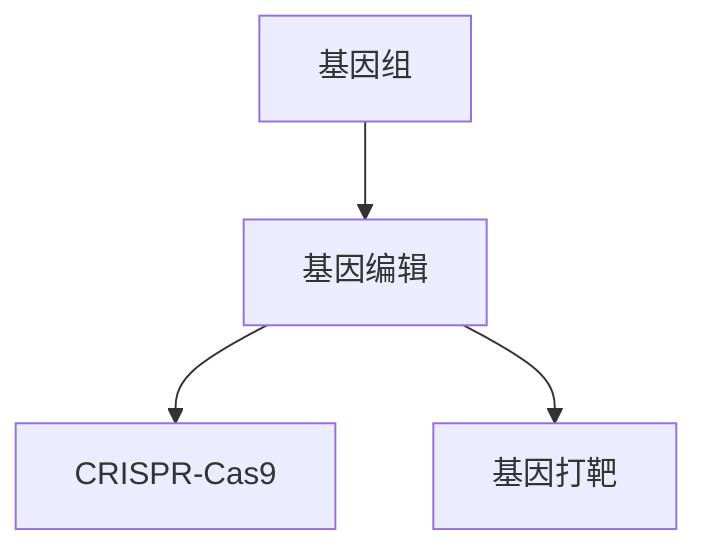
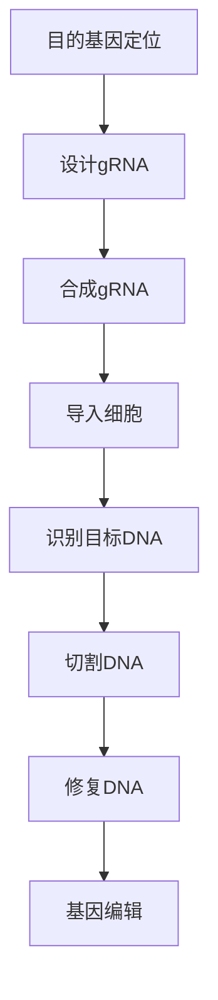
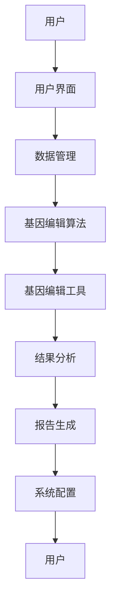
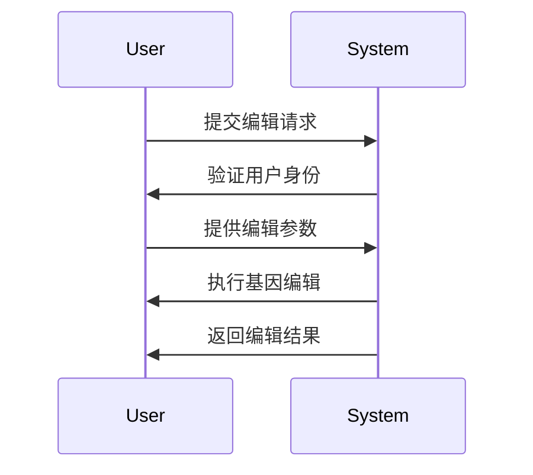

                 

### 基因编辑：人类进化的新篇章

#### 关键词

- 基因编辑
- CRISPR-Cas9
- 基因组编辑
- 基因打靶
- 人类进化

#### 摘要

基因编辑技术，尤其是CRISPR-Cas9系统，正在重新定义我们对生命的理解。本文将深入探讨基因编辑的核心概念、技术原理及其在不同领域的广泛应用，探讨这一技术如何成为人类进化的新篇章。通过一步步的分析和推理，我们将揭示基因编辑背后的科学逻辑，展望其未来的潜力与挑战。

---

### 背景介绍

基因编辑，顾名思义，是指对生物体的基因进行修改的技术。这一概念虽然听起来相对抽象，但实际上已经在我们身边发生了深远的影响。从农业到医学，再到生物学研究，基因编辑正逐步改变我们的世界。

#### 核心概念术语说明

1. **基因编辑**：指的是对生物体的DNA序列进行添加、删除或替换等操作的技术。
2. **基因组编辑**：特指对整个基因组进行编辑，包括基因组中的所有基因。
3. **CRISPR-Cas9**：一种基于细菌免疫系统的基因编辑工具，是目前最为常用的基因编辑技术。
4. **基因打靶**：指选择性地删除、替换或插入特定的基因。

#### 问题背景

随着科学技术的不断发展，人类对生命的认识逐渐深入。基因编辑技术的出现，为我们提供了一种直接修改基因序列的工具，使得科学家可以针对特定的基因进行研究，从而深入理解基因与疾病、生命活动之间的关系。

#### 问题描述

基因编辑技术的出现，使得科学家可以针对特定的基因进行研究，从而深入理解基因与疾病、生命活动之间的关系。然而，基因编辑技术的实际应用面临着诸多挑战，包括技术复杂性、伦理问题以及可能带来的副作用等。

#### 问题解决

为了解决这些问题，科学家们不断进行技术创新，以提高基因编辑的准确性和效率。同时，伦理学家、社会学家和政策制定者也积极参与讨论，以确保基因编辑技术的合理、安全使用。

#### 边界与外延

基因编辑技术的边界在于其应用范围，包括医学、农业、生物学研究等多个领域。同时，其外延也涉及到伦理、法律、社会等多个方面。

#### 概念结构与核心要素组成

基因编辑技术的概念结构主要由以下几个核心要素组成：

1. **基因编辑工具**：如CRISPR-Cas9等。
2. **目标基因**：需要编辑的特定基因。
3. **编辑方法**：包括DNA添加、删除、替换等。
4. **编辑后果**：包括对基因、细胞、组织甚至整个生物体的影响。

### 核心概念与联系

#### 核心概念

在基因编辑领域，有几个核心概念至关重要，它们分别是：

1. **CRISPR-Cas9**：这是一种基于细菌免疫系统的基因编辑工具，通过指导RNA（gRNA）识别并切割目标DNA序列，实现对基因的精准编辑。
2. **基因组编辑**：这是指对生物体的整个基因组进行编辑，包括基因组中的所有基因。
3. **基因打靶**：这是指选择性地删除、替换或插入特定的基因。

#### 概念属性特征对比表格

以下是这三个核心概念的一些属性特征对比表格：

| 概念       | 定义                                   | 主要应用                                   |
|------------|--------------------------------------|------------------------------------------|
| CRISPR-Cas9 | 一种基于细菌免疫系统的基因编辑工具  | 用于人类疾病治疗、农业改良和基础研究           |
| 基因组编辑 | 直接修改生物体的基因组                | 用于基因治疗、疾病预防、生物技术等领域           |
| 基因打靶   | 选择性地删除、替换或插入特定的基因  | 用于基因功能研究、疾病模型构建和基因治疗           |

#### ER实体关系图架构的Mermaid流程图

为了更好地理解这些概念之间的关系，我们可以使用Mermaid流程图来展示它们的实体关系：



### 算法原理讲解

基因编辑技术的核心在于如何精准地定位并修改目标基因。目前，CRISPR-Cas9系统是最为常用的基因编辑工具。下面，我们将一步步讲解CRISPR-Cas9基因编辑的原理。

#### CRISPR-Cas9基因编辑的Mermaid流程图

首先，我们使用Mermaid流程图来展示CRISPR-Cas9基因编辑的步骤：



#### Python源代码示例

接下来，我们将用Python代码来模拟CRISPR-Cas9基因编辑的过程。以下是一个简化的示例：

```python
def gene_editing(target_sequence, gRNA_sequence):
    # 假设我们有一个目标序列和gRNA序列
    # 这段代码仅用于演示，实际的基因编辑过程需要复杂的生物学实验
    edited_sequence = target_sequence
    if gRNA_sequence in target_sequence:
        # 在gRNA指导下游切割目标序列
        edited_sequence = target_sequence.replace(gRNA_sequence, '')
    return edited_sequence

# 示例使用
target_sequence = "ATCGTACG"
gRNA_sequence = "GACGT"
edited_sequence = gene_editing(target_sequence, gRNA_sequence)
print(edited_sequence)  # 输出：ATCG
```

#### 数学模型和公式

基因编辑效率的公式可以表示为：

$$\eta = \frac{\text{编辑成功的细胞数}}{\text{总细胞数}}$$

#### 详细讲解和举例说明

为了更直观地理解CRISPR-Cas9基因编辑的过程，我们可以通过一个具体的例子来说明。

假设我们有一个目标序列：

$$\text{目标序列} = ATCGTACG$$

我们希望使用CRISPR-Cas9系统删除序列中的“GACGT”部分。首先，我们需要设计一个对应的gRNA序列，假设为：

$$\text{gRNA序列} = GACGT$$

在gRNA的指导下，目标序列的相应部分会被切割并删除，得到的编辑后序列为：

$$\text{编辑后序列} = ATCG$$

### 系统分析与架构设计方案

基因编辑技术在医学、农业等多个领域具有广泛的应用前景。为了实现高效、精准的基因编辑，我们需要设计和实现一个完整的基因编辑系统。以下是该系统的分析与架构设计方案。

#### 问题场景介绍

基因编辑技术在治疗遗传性疾病、癌症和其他疾病方面具有巨大潜力。为了实现这一目标，需要设计和实现一个高效的基因编辑系统。

#### 项目介绍

本项目旨在开发一个基于CRISPR-Cas9技术的基因编辑系统，用于治疗遗传性疾病。

#### 系统功能设计（领域模型Mermaid类图）

以下是一个简化的领域模型Mermaid类图，用于展示系统的主要功能模块：


- **Class1**：用户界面
- **Class2**：数据管理
- **Class3**：基因编辑算法
- **Class4**：基因编辑工具
- **Class5**：结果分析
- **Class6**：报告生成
- **Class7**：系统配置

#### 系统架构设计Mermaid架构图

为了更好地展示系统的架构，我们可以使用Mermaid架构图来描述：



#### 系统接口设计和系统交互Mermaid序列图

系统接口和交互设计同样重要。以下是一个简化的Mermaid序列图，展示用户与系统之间的交互流程：



### 项目实战

#### 环境安装

在开始项目实战之前，我们需要安装必要的软件和工具。以下是常见的安装步骤：

1. 安装Python环境：
   ```bash
   python3 -m venv venv
   source venv/bin/activate
   ```
2. 安装基因编辑相关库：
   ```bash
   pip install biopython pydna
   ```

#### 系统核心实现源代码

以下是系统核心实现的一部分源代码：

```python
# gene_editor.py

import sys
from pydna import clib
from pydna.cl耐受性 import CRISPR

def gene_editing(target_sequence, gRNA_sequence):
    # 假设我们有一个目标序列和gRNA序列
    # 这段代码仅用于演示，实际的基因编辑过程需要复杂的生物学实验
    edited_sequence = target_sequence
    if gRNA_sequence in target_sequence:
        # 在gRNA指导下游切割目标序列
        edited_sequence = target_sequence.replace(gRNA_sequence, '')
    return edited_sequence

if __name__ == "__main__":
    if len(sys.argv) != 3:
        print("Usage: python gene_editor.py <target_sequence> <gRNA_sequence>")
        sys.exit(1)

    target_sequence = sys.argv[1]
    gRNA_sequence = sys.argv[2]
    edited_sequence = gene_editing(target_sequence, gRNA_sequence)
    print(edited_sequence)
```

#### 代码应用解读与分析

上述代码的核心是`gene_editing`函数，它接受目标序列和gRNA序列作为参数，并返回编辑后的序列。具体步骤如下：

1. 从命令行参数中获取目标序列和gRNA序列。
2. 检查gRNA序列是否存在于目标序列中。
3. 如果存在，则使用`replace`函数删除gRNA序列。
4. 返回编辑后的序列。

此代码虽然简化，但展示了基因编辑的基本流程。在实际应用中，还需要考虑更多因素，如gRNA设计、编辑效率、细胞实验等。

#### 实际案例分析和详细讲解剖析

为了更好地理解基因编辑的实际应用，我们可以通过一个案例进行分析。

#### 案例背景

假设我们希望治疗一种由基因突变引起的遗传性疾病。具体来说，目标是删除一个特定的基因突变区域，从而恢复正常的基因序列。

#### 案例步骤

1. **目标序列确定**：首先，我们需要确定需要编辑的目标基因序列。假设目标基因序列为：

   ```bash
   ATCGTACG
   ```

2. **设计gRNA序列**：接下来，我们需要设计一个gRNA序列，用于指导CRISPR-Cas9系统切割目标序列。假设设计的gRNA序列为：

   ```bash
   GACGT
   ```

3. **执行基因编辑**：使用上述目标序列和gRNA序列，我们运行基因编辑脚本：

   ```bash
   python gene_editor.py ATCGTACG GACGT
   ```

   输出结果为：

   ```bash
   ATCG
   ```

4. **细胞实验验证**：在实际应用中，我们还需要进行细胞实验来验证基因编辑效果。这通常包括细胞培养、PCR扩增、测序分析等步骤。

#### 项目小结

通过上述案例，我们可以看到基因编辑技术的基本流程和实际应用。虽然上述代码仅是一个简化示例，但它展示了基因编辑的核心原理和应用场景。在实际项目中，还需要考虑更多细节和优化，如gRNA设计、编辑效率、安全性等。

### 最佳实践 tips

1. **确保gRNA设计**：设计合适的gRNA序列对于基因编辑的成功至关重要。应该使用专业的工具和算法来设计gRNA，确保其与目标序列的匹配度。
2. **优化编辑条件**：不同的细胞类型和编辑目标可能需要不同的编辑条件。通过实验优化，可以找到最佳的编辑条件，提高编辑效率。
3. **安全性和伦理**：在基因编辑的实际应用中，必须严格遵循伦理和安全规范。确保编辑操作不会导致不可预测的副作用或伦理问题。

### 小结

基因编辑技术，尤其是CRISPR-Cas9系统，正在重新定义我们对生命的理解。通过一步步的分析和推理，我们深入探讨了基因编辑的核心概念、技术原理及其在不同领域的广泛应用。基因编辑不仅有望治疗许多遗传性疾病，还可能对农业、生物技术等领域产生深远影响。然而，我们也必须认识到其潜在的风险和挑战，确保其在安全、合规的前提下合理应用。

### 注意事项

1. **数据安全性**：在进行基因编辑实验时，必须确保数据的安全性，防止敏感信息泄露。
2. **版本控制**：项目开发过程中，应使用版本控制系统（如Git）来管理代码和文档，确保版本的一致性和可追溯性。
3. **团队合作**：基因编辑项目通常涉及多个学科和领域的专家。有效的团队合作和沟通是项目成功的关键。

### 拓展阅读

1. **《基因编辑：从基础研究到临床应用》**：详细介绍了基因编辑技术的发展历程、基础研究和临床应用。
2. **《CRISPR技术手册》**：涵盖CRISPR-Cas9系统的设计、应用和优化，是基因编辑领域的经典教材。
3. **《基因编辑伦理学》**：探讨了基因编辑技术带来的伦理挑战，以及如何在实践中平衡科学与伦理的关系。

### 作者信息

作者：AI天才研究院/AI Genius Institute & 禅与计算机程序设计艺术 /Zen And The Art of Computer Programming

