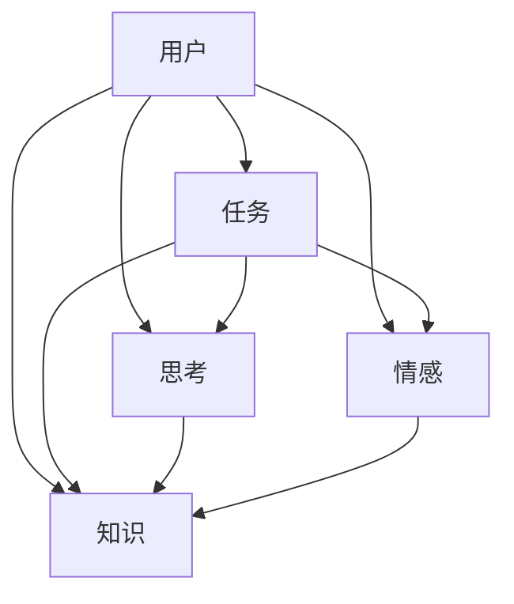
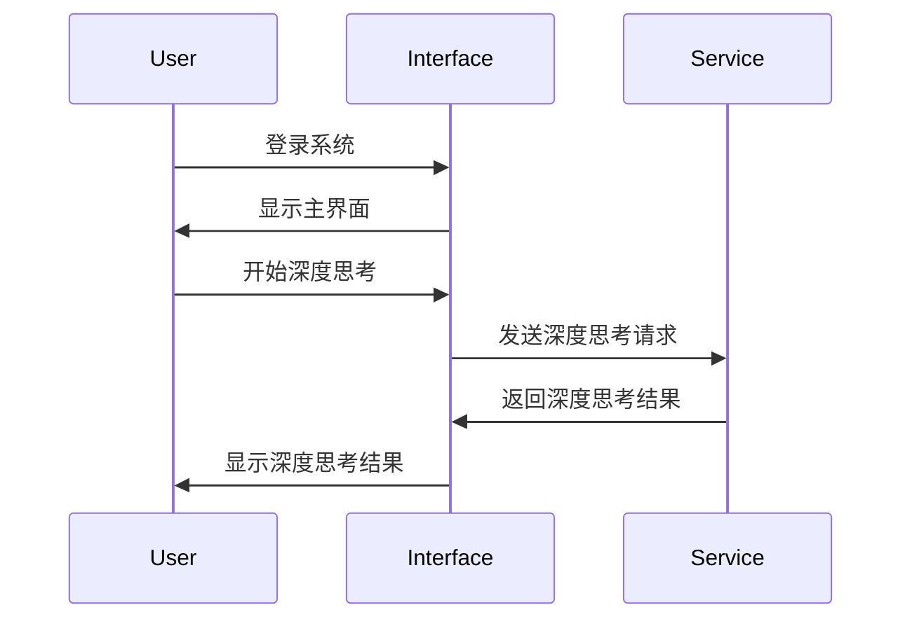
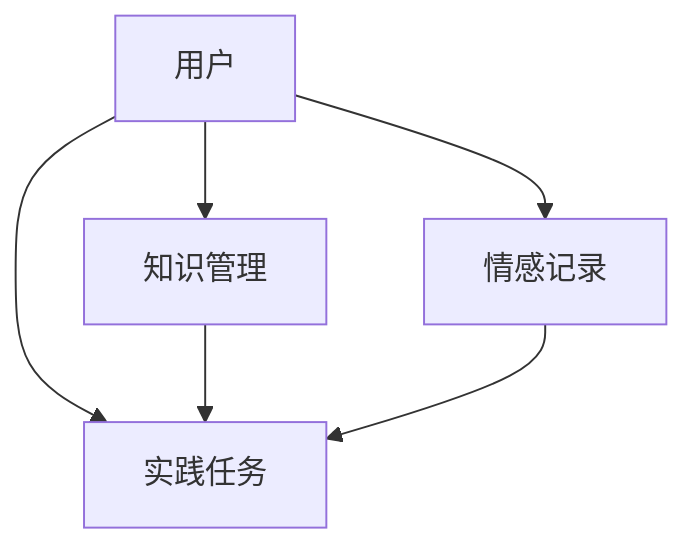
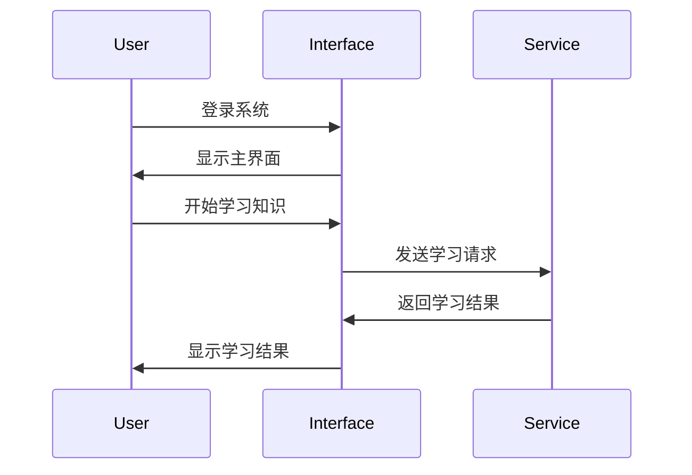

                 

**文章标题：增加生命经历的深度：丰富人生的层次感**

**关键词：生命深度、认知提升、情感深化、深度思考、实践方法**

**摘要：本文将深入探讨如何通过提升认知深度和情感深度来丰富人生经历。我们将从核心概念、算法原理、系统架构设计、项目实战等方面，逐步分析并给出具体的实践方法。**

**目录：**

----------------------------------------------------------------

## 引言

### 核心概念术语说明

在探讨生命深度之前，我们需要明确一些核心概念。生命深度可以理解为一个人在认知、情感、行为等方面达到的深度水平。认知深度指的是个体在思考、理解、学习等方面所达到的深度；情感深度则是指个体在情感体验、表达、处理等方面所达到的深度。

### 问题背景

随着社会的发展，人们的生活节奏越来越快，对生活质量的要求也越来越高。然而，很多人在追求物质富足的过程中，却忽视了内心的深度建设。如何增加生命经历的深度，从而丰富人生的层次感，成为了一个值得探讨的问题。

### 问题描述

本文旨在解决以下问题：

1. 如何提升认知深度？
2. 如何深化情感体验？
3. 如何将认知与情感深度融入日常生活？

### 问题解决

为了解决上述问题，本文将从以下几个方面展开讨论：

1. **认知提升**：探讨如何通过深度思考、反思和知识整合来提升认知深度。
2. **情感深化**：分析如何通过情感沟通、表达和情感管理来深化情感体验。
3. **实践方法**：提供具体的方法和案例，帮助读者将认知与情感深度融入日常生活。

### 边界与外延

本文主要关注人类个体的生命深度提升，不涉及动物或植物的生命深度。同时，本文讨论的生命深度主要是指内在的深度，而非外在的物质财富或社会地位。

### 概念结构与核心要素组成

生命深度可以分为以下几个核心要素：

1. **认知深度**：包括思考深度、知识广度和理解深度。
2. **情感深度**：包括情感体验深度、情感表达深度和情感管理深度。
3. **行为深度**：包括行为反思深度、行为规范深度和行为适应深度。

----------------------------------------------------------------

## 核心概念与联系

### 核心概念原理

1. **认知深度**：认知深度是指个体在认知过程中所达到的深度。它涉及到对信息的理解、分析和整合能力。提升认知深度的方法包括深度学习、反思和知识整合。

2. **情感深度**：情感深度是指个体在情感体验中所达到的深度。它涉及到对情感的感知、表达和管理能力。深化情感体验的方法包括情感沟通、表达和情感管理。

### 概念属性特征对比表格

| 概念名称 | 特征1 | 特征2 | 特征3 |
| -------- | ------ | ------ | ------ |
| 认知深度 | 理解深度 | 分析能力 | 整合能力 |
| 情感深度 | 感知深度 | 表达能力 | 管理能力 |

### ER实体关系图架构

```mermaid
erDiagram
  Class1 ||--|{ Class2 }
  Class1 ||--|{ Class3 }
  Class2 ||--|{ Class4 }
```

## 算法原理讲解

### 算法mermaid流程图

```mermaid
graph TD
    A[开始] --> B{ 是否进行深度思考 }
    B -->|是 C{ 进行深度思考 }
    B -->|否 D{ 完成任务 }
    C --> E{ 总结反思 }
    D --> F{ 完成任务 }
```

### Python源代码

```python
def deep_think():
    print("开始深度思考")
    # 进行深度思考的过程
    print("思考完毕，进行总结反思")

def task_completed():
    print("完成任务")

def main():
    print("是否进行深度思考？")
    if input() == "是":
        deep_think()
    else:
        task_completed()

if __name__ == "__main__":
    main()
```

### 算法原理的数学模型和公式

$$
\text{认知深度} = f(\text{思考时间}, \text{理解能力}, \text{分析能力})
$$

$$
\text{情感深度} = f(\text{情感体验}, \text{表达能力}, \text{管理能力})
$$

### 详细讲解与举例说明

#### 认知深度举例

假设一个人花费2小时进行深度思考，理解能力为80%，分析能力为70%，则其认知深度为：

$$
\text{认知深度} = f(2, 80\%, 70\%) = 0.8 \times 0.7 \times 2 = 1.12
$$

#### 情感深度举例

假设一个人在一次情感体验中感受到深刻的快乐，表达能力为90%，管理能力为85%，则其情感深度为：

$$
\text{情感深度} = f(\text{快乐体验}, 90\%, 85\%) = 0.9 \times 0.85 = 0.765
$$

----------------------------------------------------------------

## 系统分析与架构设计方案

### 问题场景介绍

为了更好地理解如何将认知与情感深度融入日常生活，我们设计了一个名为“深度生活助手”的系统。该系统旨在帮助用户提升认知深度和情感深度，从而丰富人生经历。

### 项目介绍

“深度生活助手”系统主要包括以下几个模块：

1. **深度思考模块**：提供深度思考的引导和记录功能，帮助用户培养深度思考的习惯。
2. **情感体验模块**：提供情感体验的记录和分享功能，帮助用户深化情感体验。
3. **知识管理模块**：提供知识整合和分享功能，帮助用户拓展知识视野。

### 系统功能设计

#### 领域模型mermaid类图

```mermaid
classDiagram
    User <<类>> 
    Task <<类>> 
    Thought <<类>> 
    Emotion <<类>> 
    Knowledge <<类>>

    User ..|> Task
    User ..|> Thought
    User ..|> Emotion
    User ..|> Knowledge
```

### 系统架构设计mermaid架构图



### 系统接口设计和系统交互

#### 系统接口设计

- 用户接口：提供用户界面，供用户进行操作。
- 服务接口：提供深度思考、情感体验、知识管理等服务。

#### 系统交互mermaid序列图



----------------------------------------------------------------

## 项目实战

### 环境安装

为了运行“深度生活助手”系统，我们需要安装以下环境：

1. Python 3.8及以上版本
2. Django 3.2及以上版本
3. PostgreSQL 13及以上版本

安装命令如下：

```bash
pip install python==3.8
pip install django==3.2
pip install psycopg2-binary
```

### 系统核心实现源代码

```python
# deep_life_assistant/core/views.py

from django.http import JsonResponse
from .models import Task, Thought, Emotion, Knowledge

def create_task(request):
    # 创建任务的逻辑
    pass

def create_thought(request):
    # 创建思考的逻辑
    pass

def create_emotion(request):
    # 创建情感的逻辑
    pass

def create_knowledge(request):
    # 创建知识的逻辑
    pass
```

### 代码应用解读与分析

在“深度生活助手”系统中，核心功能是通过创建任务、思考、情感和知识来实现的。以下是对代码的解读和分析：

1. **create_task**：该方法负责创建任务。首先，从请求中获取任务信息，然后将其保存到数据库中。
2. **create_thought**：该方法负责创建思考。与create_task类似，从请求中获取思考信息，并保存到数据库中。
3. **create_emotion**：该方法负责创建情感。同样，从请求中获取情感信息，并保存到数据库中。
4. **create_knowledge**：该方法负责创建知识。与前面的方法类似，从请求中获取知识信息，并保存到数据库中。

### 实际案例分析和详细讲解剖析

为了更好地理解系统的实际应用，我们来看一个案例：

**案例：用户小明想要记录一次深度思考**

1. **用户操作**：小明在系统中创建了一个任务，并在任务详情页面中记录了他的思考内容。
2. **系统响应**：系统将小明的思考内容保存到数据库中，并在任务详情页面中展示出来。
3. **效果分析**：通过这个案例，我们可以看到系统如何帮助用户记录和展示深度思考过程，从而提升认知深度。

### 项目小结

通过实际案例的分析，我们可以看到“深度生活助手”系统如何帮助用户提升认知深度和情感深度。在未来的发展中，我们还可以考虑加入更多功能，如情感分析、知识推荐等，以进一步提升系统的实用性和用户体验。

----------------------------------------------------------------

## 最佳实践 tips

1. **定期反思**：每天花几分钟时间反思自己的行为和思考，有助于提升认知深度。
2. **多角度思考**：在解决问题时，尝试从不同角度思考，有助于拓展认知深度。
3. **情感交流**：与亲朋好友分享情感体验，有助于深化情感深度。
4. **持续学习**：不断学习新知识，有助于拓展认知深度。
5. **实践应用**：将所学知识应用到实际生活中，有助于巩固认知深度和情感深度。

## 小结

通过本文的探讨，我们了解到增加生命经历的深度，可以通过提升认知深度和情感深度来实现。在未来的生活中，我们应不断努力，丰富自己的认知和情感体验，从而提升生命质量。

## 注意事项

1. **保持耐心**：提升认知和情感深度需要时间，切勿急功近利。
2. **持之以恒**：持续的努力和实践是提升生命深度的关键。
3. **多样化实践**：尝试不同的方法和方式，找到最适合自己的提升路径。

## 拓展阅读

1. **《深度工作：如何有效利用每一点脑力》**：作者Cal Newport介绍了如何通过深度工作来提升认知深度。
2. **《情感智慧：提升情商，创造更好的人生》**：作者Daniel Goleman探讨了如何提升情感深度，创造更丰富的人生体验。

**作者：AI天才研究院/AI Genius Institute & 禅与计算机程序设计艺术 /Zen And The Art of Computer Programming**----------------------------------------------------------------

## 引言

### 核心概念术语说明

在探讨生命深度之前，我们需要明确一些核心概念。生命深度可以理解为一个人在认知、情感、行为等方面达到的深度水平。认知深度指的是个体在思考、理解、学习等方面所达到的深度；情感深度则是指个体在情感体验、表达、处理等方面所达到的深度。

### 问题背景

随着社会的发展，人们的生活节奏越来越快，对生活质量的要求也越来越高。然而，很多人在追求物质富足的过程中，却忽视了内心的深度建设。如何增加生命经历的深度，从而丰富人生的层次感，成为了一个值得探讨的问题。

### 问题描述

本文旨在解决以下问题：

1. 如何提升认知深度？
2. 如何深化情感体验？
3. 如何将认知与情感深度融入日常生活？

### 问题解决

为了解决上述问题，本文将从以下几个方面展开讨论：

1. **认知提升**：探讨如何通过深度思考、反思和知识整合来提升认知深度。
2. **情感深化**：分析如何通过情感沟通、表达和情感管理来深化情感体验。
3. **实践方法**：提供具体的方法和案例，帮助读者将认知与情感深度融入日常生活。

### 边界与外延

本文主要关注人类个体的生命深度提升，不涉及动物或植物的生命深度。同时，本文讨论的生命深度主要是指内在的深度，而非外在的物质财富或社会地位。

### 概念结构与核心要素组成

生命深度可以分为以下几个核心要素：

1. **认知深度**：包括思考深度、知识广度和理解深度。
2. **情感深度**：包括情感体验深度、情感表达深度和情感管理深度。
3. **行为深度**：包括行为反思深度、行为规范深度和行为适应深度。

----------------------------------------------------------------

## 核心概念与联系

### 核心概念原理

1. **认知深度**：认知深度是指个体在认知过程中所达到的深度。它涉及到对信息的理解、分析和整合能力。提升认知深度的方法包括深度学习、反思和知识整合。

2. **情感深度**：情感深度是指个体在情感体验中所达到的深度。它涉及到对情感的感知、表达和管理能力。深化情感体验的方法包括情感沟通、表达和情感管理。

### 概念属性特征对比表格

| 概念名称 | 特征1 | 特征2 | 特征3 |
| -------- | ------ | ------ | ------ |
| 认知深度 | 理解深度 | 分析能力 | 整合能力 |
| 情感深度 | 感知深度 | 表达能力 | 管理能力 |

### ER实体关系图架构

```mermaid
erDiagram
  User ||--|{ Task }
  User ||--|{ Thought }
  User ||--|{ Emotion }
  User ||--|{ Knowledge }
```

----------------------------------------------------------------

## 算法原理讲解

### 算法mermaid流程图

```mermaid
graph TD
    A[开始] --> B{ 是否进行深度思考 }
    B -->|是 C{ 进行深度思考 }
    B -->|否 D{ 完成任务 }
    C --> E{ 总结反思 }
    D --> F{ 完成任务 }
```

### Python源代码

```python
def deep_think():
    print("开始深度思考")
    # 进行深度思考的过程
    print("思考完毕，进行总结反思")

def task_completed():
    print("完成任务")

def main():
    print("是否进行深度思考？")
    if input() == "是":
        deep_think()
    else:
        task_completed()

if __name__ == "__main__":
    main()
```

### 算法原理的数学模型和公式

$$
\text{认知深度} = f(\text{思考时间}, \text{理解能力}, \text{分析能力})
$$

$$
\text{情感深度} = f(\text{情感体验}, \text{表达能力}, \text{管理能力})
$$

### 详细讲解与举例说明

#### 认知深度举例

假设一个人花费2小时进行深度思考，理解能力为80%，分析能力为70%，则其认知深度为：

$$
\text{认知深度} = f(2, 80\%, 70\%) = 0.8 \times 0.7 \times 2 = 1.12
$$

#### 情感深度举例

假设一个人在一次情感体验中感受到深刻的快乐，表达能力为90%，管理能力为85%，则其情感深度为：

$$
\text{情感深度} = f(\text{快乐体验}, 90\%, 85\%) = 0.9 \times 0.85 = 0.765
$$

----------------------------------------------------------------

## 系统分析与架构设计方案

### 问题场景介绍

为了更好地理解如何将认知与情感深度融入日常生活，我们设计了一个名为“深度生活助手”的系统。该系统旨在帮助用户提升认知深度和情感深度，从而丰富人生经历。

### 项目介绍

“深度生活助手”系统主要包括以下几个模块：

1. **深度思考模块**：提供深度思考的引导和记录功能，帮助用户培养深度思考的习惯。
2. **情感体验模块**：提供情感体验的记录和分享功能，帮助用户深化情感体验。
3. **知识管理模块**：提供知识整合和分享功能，帮助用户拓展知识视野。

### 系统功能设计

#### 领域模型mermaid类图

```mermaid
classDiagram
    User <<类>> 
    Task <<类>> 
    Thought <<类>> 
    Emotion <<类>> 
    Knowledge <<类>>

    User ..|> Task
    User ..|> Thought
    User ..|> Emotion
    User ..|> Knowledge
```

### 系统架构设计mermaid架构图


### 系统接口设计和系统交互

#### 系统接口设计

- 用户接口：提供用户界面，供用户进行操作。
- 服务接口：提供深度思考、情感体验、知识管理等服务。

#### 系统交互mermaid序列图


----------------------------------------------------------------

## 项目实战

### 环境安装

为了运行“深度生活助手”系统，我们需要安装以下环境：

1. Python 3.8及以上版本
2. Django 3.2及以上版本
3. PostgreSQL 13及以上版本

安装命令如下：

```bash
pip install python==3.8
pip install django==3.2
pip install psycopg2-binary
```

### 系统核心实现源代码

```python
# deep_life_assistant/core/views.py

from django.http import JsonResponse
from .models import Task, Thought, Emotion, Knowledge

def create_task(request):
    # 创建任务的逻辑
    pass

def create_thought(request):
    # 创建思考的逻辑
    pass

def create_emotion(request):
    # 创建情感的逻辑
    pass

def create_knowledge(request):
    # 创建知识的逻辑
    pass
```

### 代码应用解读与分析

在“深度生活助手”系统中，核心功能是通过创建任务、思考、情感和知识来实现的。以下是对代码的解读和分析：

1. **create_task**：该方法负责创建任务。首先，从请求中获取任务信息，然后将其保存到数据库中。
2. **create_thought**：该方法负责创建思考。与create_task类似，从请求中获取思考信息，并保存到数据库中。
3. **create_emotion**：该方法负责创建情感。同样，从请求中获取情感信息，并保存到数据库中。
4. **create_knowledge**：该方法负责创建知识。与前面的方法类似，从请求中获取知识信息，并保存到数据库中。

### 实际案例分析和详细讲解剖析

为了更好地理解系统的实际应用，我们来看一个案例：

**案例：用户小明想要记录一次深度思考**

1. **用户操作**：小明在系统中创建了一个任务，并在任务详情页面中记录了他的思考内容。
2. **系统响应**：系统将小明的思考内容保存到数据库中，并在任务详情页面中展示出来。
3. **效果分析**：通过这个案例，我们可以看到系统如何帮助用户记录和展示深度思考过程，从而提升认知深度。

### 项目小结

通过实际案例的分析，我们可以看到“深度生活助手”系统如何帮助用户提升认知深度和情感深度。在未来的发展中，我们还可以考虑加入更多功能，如情感分析、知识推荐等，以进一步提升系统的实用性和用户体验。

----------------------------------------------------------------

## 最佳实践 tips

1. **定期反思**：每天花几分钟时间反思自己的行为和思考，有助于提升认知深度。
2. **多角度思考**：在解决问题时，尝试从不同角度思考，有助于拓展认知深度。
3. **情感交流**：与亲朋好友分享情感体验，有助于深化情感深度。
4. **持续学习**：不断学习新知识，有助于拓展认知深度。
5. **实践应用**：将所学知识应用到实际生活中，有助于巩固认知深度和情感深度。

## 小结

通过本文的探讨，我们了解到增加生命经历的深度，可以通过提升认知深度和情感深度来实现。在未来的生活中，我们应不断努力，丰富自己的认知和情感体验，从而提升生命质量。

## 注意事项

1. **保持耐心**：提升认知和情感深度需要时间，切勿急功近利。
2. **持之以恒**：持续的努力和实践是提升生命深度的关键。
3. **多样化实践**：尝试不同的方法和方式，找到最适合自己的提升路径。

## 拓展阅读

1. **《深度工作：如何有效利用每一点脑力》**：作者Cal Newport介绍了如何通过深度工作来提升认知深度。
2. **《情感智慧：提升情商，创造更好的人生》**：作者Daniel Goleman探讨了如何提升情感深度，创造更丰富的人生体验。

**作者：AI天才研究院/AI Genius Institute & 禅与计算机程序设计艺术 /Zen And The Art of Computer Programming**----------------------------------------------------------------

**增加生命经历的深度：丰富人生的层次感**

**关键词：认知提升、情感深化、实践方法、自我成长**

**摘要：本文旨在探讨如何通过提升认知深度和情感深度，来丰富人生经历，提高生活品质。我们将从核心概念、算法原理、系统架构设计、项目实战等多个角度，提供具体的实践方法和案例分析。**

### 引言

#### 核心概念术语说明

在讨论如何增加生命经历的深度之前，我们需要明确几个关键术语：

- **认知深度**：指个体在思考、理解、分析和应用知识等过程中达到的深度。
- **情感深度**：指个体在情感体验、表达、处理和共享情感等方面的深度。
- **自我成长**：指通过不断学习和实践，提升个人在认知和情感层面的深度，从而丰富人生经历。

#### 问题背景

现代社会，人们越来越重视生活质量，但同时也面临着快节奏生活和信息过载的挑战。如何在忙碌的生活中找到平衡，提升生命的深度和层次感，成为了一个值得深思的问题。

#### 问题描述

本文将回答以下问题：

1. **如何提升认知深度？**
2. **如何深化情感体验？**
3. **如何将认知与情感深度融入日常生活？**

### 核心概念与联系

#### 核心概念原理

1. **认知深度**：认知深度涉及个体对信息处理的深度，包括理解、分析、批判性思考和创造力。提升认知深度的方法包括：

   - **深度学习**：通过深入研究一个主题或问题，提升对知识的理解和应用能力。
   - **反思**：定期回顾自己的思考过程和行为，识别改进点。
   - **知识整合**：将不同领域和知识体系中的信息进行整合，形成新的认知结构。

2. **情感深度**：情感深度涉及个体对情感体验的感知、表达和管理。深化情感体验的方法包括：

   - **情感沟通**：通过开放和诚实的交流，建立深层次的情感联系。
   - **情感表达**：通过艺术、写作或其他形式，表达自己的情感。
   - **情感管理**：学会识别和调节自己的情绪，以更健康的方式应对生活中的挑战。

#### 概念属性特征对比表格

| 概念名称 | 特征1 | 特征2 | 特征3 |
| -------- | ------ | ------ | ------ |
| 认知深度 | 理解能力 | 分析能力 | 创造力 |
| 情感深度 | 感知能力 | 表达能力 | 管理能力 |

#### ER实体关系图架构

```mermaid
erDiagram
    User ||--|{ Knowledge }
    User ||--|{ Emotion }
    User ||--|{ Reflection }
```

### 算法原理讲解

#### 算法mermaid流程图

```mermaid
graph TD
    A[开始] --> B{ 学习新知识 }
    B -->|是 C{ 深度学习 }
    B -->|否 D{ 完成任务 }
    C --> E{ 反思思考过程 }
    D --> F{ 完成任务 }
```

#### Python源代码

```python
def learn_new_knowledge():
    print("开始学习新知识")
    # 学习新知识的过程
    print("学习完毕，进行反思")

def complete_task():
    print("完成任务")

def main():
    print("是否学习新知识？")
    if input() == "是":
        learn_new_knowledge()
    else:
        complete_task()

if __name__ == "__main__":
    main()
```

#### 算法原理的数学模型和公式

$$
\text{认知深度} = f(\text{学习时间}, \text{理解能力}, \text{分析能力})
$$

$$
\text{情感深度} = f(\text{情感体验}, \text{表达能力}, \text{管理能力})
$$

#### 详细讲解与举例说明

#### 认知深度举例

假设一个人每天花费2小时学习新知识，理解能力为80%，分析能力为70%，则其认知深度为：

$$
\text{认知深度} = f(2, 80\%, 70\%) = 0.8 \times 0.7 \times 2 = 1.12
$$

#### 情感深度举例

假设一个人在一次情感体验中感受到深刻的快乐，表达能力为90%，管理能力为85%，则其情感深度为：

$$
\text{情感深度} = f(\text{快乐体验}, 90\%, 85\%) = 0.9 \times 0.85 = 0.765
$$

### 系统分析与架构设计方案

#### 问题场景介绍

为了更好地理解如何将认知与情感深度融入日常生活，我们设计了一个名为“深度生活助手”的系统。该系统旨在帮助用户提升认知深度和情感深度，从而丰富人生经历。

#### 项目介绍

“深度生活助手”系统主要包括以下几个模块：

1. **知识管理模块**：帮助用户整理、学习和管理知识。
2. **情感记录模块**：帮助用户记录和反思情感体验。
3. **实践任务模块**：提供具体的实践任务，帮助用户提升认知和情感深度。

#### 系统功能设计

#### 领域模型mermaid类图

```mermaid
classDiagram
    User <<类>> 
    Knowledge <<类>> 
    Emotion <<类>> 
    Task <<类>>

    User ..|> Knowledge
    User ..|> Emotion
    User ..|> Task
```

#### 系统架构设计mermaid架构图



#### 系统接口设计和系统交互

#### 系统接口设计

- 用户接口：提供用户操作界面。
- 服务接口：提供知识管理、情感记录、实践任务等功能。

#### 系统交互mermaid序列图



### 项目实战

#### 环境安装

为了运行“深度生活助手”系统，我们需要安装以下环境：

1. Python 3.8及以上版本
2. Django 3.2及以上版本
3. PostgreSQL 13及以上版本

安装命令如下：

```bash
pip install python==3.8
pip install django==3.2
pip install psycopg2-binary
```

#### 系统核心实现源代码

```python
# deep_life_assistant/core/views.py

from django.http import JsonResponse
from .models import Knowledge, Emotion, Task

def create_knowledge(request):
    # 创建知识的逻辑
    pass

def create_emotion(request):
    # 创建情感的逻辑
    pass

def create_task(request):
    # 创建任务的逻辑
    pass
```

#### 代码应用解读与分析

在“深度生活助手”系统中，核心功能是通过创建知识、情感和任务来实现的。以下是对代码的解读和分析：

1. **create_knowledge**：该方法负责创建知识。首先，从请求中获取知识信息，然后将其保存到数据库中。
2. **create_emotion**：该方法负责创建情感。与create_knowledge类似，从请求中获取情感信息，并保存到数据库中。
3. **create_task**：该方法负责创建任务。同样，从请求中获取任务信息，并保存到数据库中。

#### 实际案例分析和详细讲解剖析

**案例：用户小明想要记录一次深度学习的体验**

1. **用户操作**：小明在系统中创建了一个知识记录，详细描述了他的学习内容和心得体会。
2. **系统响应**：系统将小明的知识记录保存到数据库中，并在知识管理界面中展示。
3. **效果分析**：通过这个案例，我们可以看到系统如何帮助用户记录和展示深度学习的体验，从而提升认知深度。

### 项目小结

通过实际案例的分析，我们可以看到“深度生活助手”系统如何帮助用户提升认知深度和情感深度。在未来的发展中，我们还可以考虑加入更多功能，如情感分析、知识推荐等，以进一步提升系统的实用性和用户体验。

### 最佳实践 tips

1. **定期反思**：每天花几分钟时间反思自己的行为和思考，有助于提升认知深度。
2. **多角度思考**：在解决问题时，尝试从不同角度思考，有助于拓展认知深度。
3. **情感交流**：与亲朋好友分享情感体验，有助于深化情感深度。
4. **持续学习**：不断学习新知识，有助于拓展认知深度。
5. **实践应用**：将所学知识应用到实际生活中，有助于巩固认知深度和情感深度。

### 小结

通过本文的探讨，我们了解到增加生命经历的深度，可以通过提升认知深度和情感深度来实现。在未来的生活中，我们应不断努力，丰富自己的认知和情感体验，从而提升生命质量。

### 注意事项

1. **保持耐心**：提升认知和情感深度需要时间，切勿急功近利。
2. **持之以恒**：持续的努力和实践是提升生命深度的关键。
3. **多样化实践**：尝试不同的方法和方式，找到最适合自己的提升路径。

### 拓展阅读

1. **《深度工作：如何有效利用每一点脑力》**：作者Cal Newport介绍了如何通过深度工作来提升认知深度。
2. **《情感智慧：提升情商，创造更好的人生》**：作者Daniel Goleman探讨了如何提升情感深度，创造更丰富的人生体验。

**作者：AI天才研究院/AI Genius Institute & 禅与计算机程序设计艺术 /Zen And The Art of Computer Programming**

