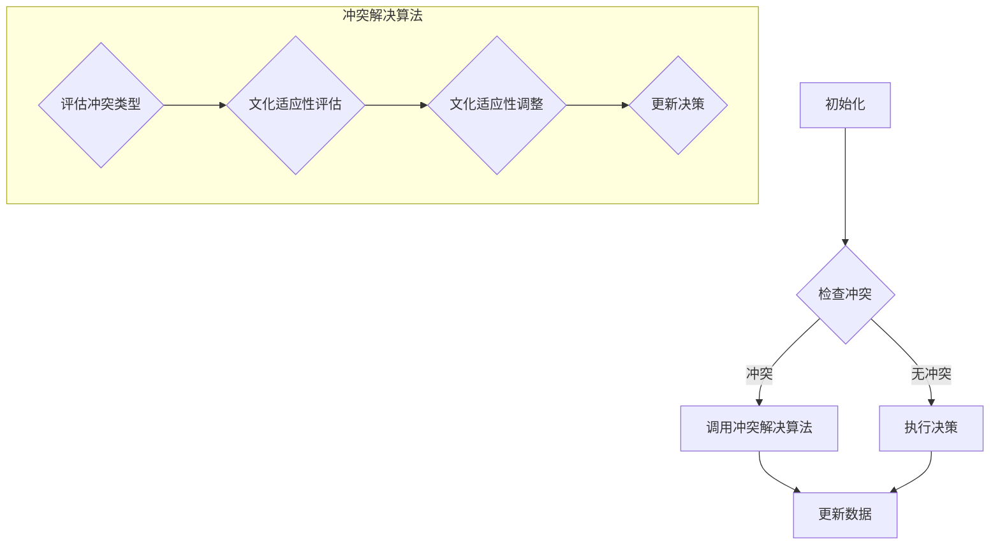
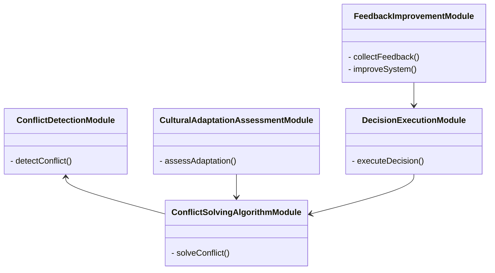
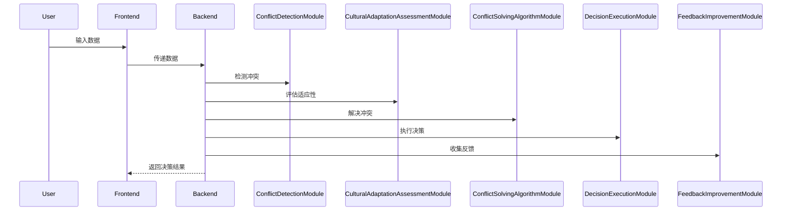
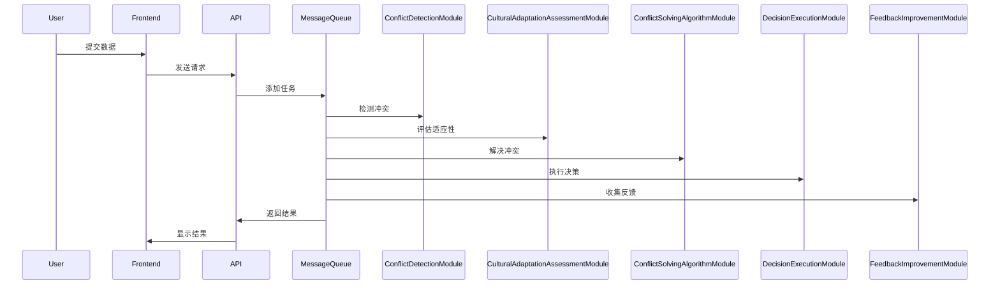

                 

## 多元文化社会中的共同价值：寻找普世伦理

在当今全球化的世界中，多元文化社会的形成已经成为一种不可避免的趋势。随着不同文化背景的人们在各个领域中的交流和互动，如何在这样一个复杂的环境中寻找并维护共同价值，成为了一个亟待解决的重要问题。本文将围绕多元文化社会中的共同价值，尤其是普世伦理的概念和寻找方式展开深入探讨。

### 文章关键词

- 多元文化社会
- 普世伦理
- 伦理冲突
- 文化多样性
- 共同价值

### 文章摘要

本文首先介绍了多元文化社会的概念与特点，随后探讨了普世伦理的基本概念与历史演变。接着，分析了多元文化社会中的伦理冲突类型及其解决途径，并通过案例分析展示了这些冲突的现实影响。在此基础上，本文提出了寻找多元文化中共同价值的方法，并讨论了普世伦理在多元文化社会中的应用与实践。最后，通过一个具体的伦理决策算法案例，阐述了如何在技术层面处理伦理问题，为多元文化社会的和谐发展提供了理论支持和实践指导。

---

在接下来的章节中，我们将首先对多元文化社会进行概述，包括其定义、特点以及对社会的影响。接着，我们将详细探讨普世伦理的概念，以及其历史演变和当代挑战。随后，我们将深入分析多元文化社会中的伦理冲突，并提出解决这些冲突的途径。在讨论寻找多元文化中的共同价值时，我们将介绍相关方法和应用实例。最后，本文将结合一个具体的伦理决策算法案例，展示如何在技术层面处理伦理问题，为多元文化社会的和谐发展提供指导。

## 多元文化社会的概念与特点

多元文化社会是指在某一地理区域内，存在多种不同的文化背景和社会群体共同生活、互动的社会形态。这种多样性不仅体现在语言、宗教、习俗等方面，还包括不同的价值观、行为规范和社会制度。多元文化社会的形成是一个复杂的历史过程，它涉及不同文化之间的交流、融合与冲突。

### 定义

多元文化社会（Pluralistic Society）是指在一个国家或地区内，存在多种文化群体，这些文化群体保持着各自的文化传统和价值观，并在一定程度上相互影响和交融。多元文化社会强调文化平等、尊重多样性和包容性，旨在构建一个和谐共存的社会环境。

### 特点

1. **文化多样性**：多元文化社会中最显著的特点是文化多样性。不同文化背景的个体或群体共同生活在一个社会之中，彼此之间保持着独特的文化传统和习俗。

2. **社会融合与冲突**：多元文化社会中，不同文化之间的融合与冲突并存。一方面，文化的交流和互动促进了社会的进步和发展；另一方面，文化差异也可能导致误解和冲突，影响社会的稳定和和谐。

3. **价值观多元化**：多元文化社会中，不同的文化背景往往带来不同的价值观。这种多元化既丰富了社会的思想和文化，也可能导致价值观念之间的冲突。

4. **制度多样性**：多元文化社会在政治、法律、教育、经济等方面可能表现出不同的制度安排。这些制度既要尊重文化多样性，又要维护社会的整体稳定和公正。

### 对社会的影响

多元文化社会的形成和发展对社会的各个方面都产生了深远的影响：

1. **社会进步**：文化多样性的存在为社会的创新和发展提供了丰富的资源。不同文化的交流和融合可以激发新的思想、理念和技术，推动社会的进步。

2. **社会冲突**：多元文化社会中，不同文化之间的冲突可能导致社会不稳定。文化差异往往成为社会矛盾和冲突的根源，需要通过有效的管理和调解来化解。

3. **社会认同**：多元文化社会中的个体和群体如何在尊重差异的同时形成共同的社会认同，是一个重要的社会问题。这需要通过教育、媒体和文化活动等方式来加强社会的凝聚力和认同感。

4. **政策制定**：多元文化社会的特点要求政策制定者考虑不同文化的需求和利益，制定出更加包容和公正的政策，以促进社会的和谐发展。

### 多元文化的多样性

多元文化的多样性体现在多个层面：

1. **文化层面**：包括语言、宗教、习俗、节日、艺术等。例如，中国的多元文化包括汉族文化、藏族文化、维吾尔族文化等。

2. **社会层面**：包括不同种族、民族、社会阶层和性别等。这些群体在社会中拥有不同的地位和权利，其文化认同和价值观也会有所不同。

3. **政治层面**：包括不同政治制度、法律体系和政策导向。多元文化社会中，如何平衡不同文化的利益和需求，是一个重要的政治问题。

4. **经济层面**：包括不同经济模式、商业习惯和市场需求。多元文化社会的经济多样性为经济发展提供了更多机会，但也可能带来竞争和冲突。

总之，多元文化社会的概念与特点为我们理解现代社会提供了一个重要的视角。在这样一个复杂的社会环境中，寻找并维护共同价值，构建和谐的社会关系，是我们共同面临的挑战和责任。

### 普世伦理的基本概念与历史演变

普世伦理（Universal Ethics）是指那些超越特定文化、宗教和地区，适用于所有人类社会的伦理原则和价值观。普世伦理关注的是人类的基本尊严、公正和平等，强调道德行为的普遍适用性和普遍性。其基本理念是，尽管不同文化和社会有着不同的伦理观念，但仍然存在一些普遍认同的伦理原则，这些原则能够指导人类行为，促进社会的和谐发展。

#### 定义

普世伦理是指那些普遍适用于所有人类社会的基本伦理原则和价值观念，这些原则和价值观反映了人类共同的基本需求和价值追求。普世伦理的核心内容包括尊重人的尊严、公正和平等、责任和义务等。

#### 历史演变

普世伦理的历史演变可以追溯到古代文明。例如，在古希腊和古罗马时期，思想家们就开始探讨伦理和道德问题，并试图建立一套适用于所有人的伦理原则。古希腊哲学家苏格拉底、柏拉图和亚里士多德等人的思想，对后世普世伦理的发展产生了深远影响。

1. **古希腊伦理思想**：古希腊哲学家认为，道德是人类社会的基础，伦理原则应该适用于所有人。例如，苏格拉底强调道德的普遍性，主张“无人有意做错”，即每个人的行为都是基于自己的道德判断。柏拉图则通过“理想国”的概念，探讨了道德与政治之间的关系，强调哲学王治理国家的重要性。亚里士多德则提出了中庸之道和美德伦理，强调道德行为应该遵循适度原则。

2. **古罗马伦理思想**：古罗马思想家如西塞罗和马可·奥勒留等人，进一步发展了伦理思想。西塞罗提出了“自然法”的概念，认为自然法是宇宙中存在的普遍法则，适用于所有人类。马可·奥勒留则在《沉思录》中，探讨了个人道德修养和自我超越的问题，强调了自我控制和内在的宁静。

3. **中世纪伦理思想**：在中世纪，基督教伦理思想对普世伦理的发展产生了重要影响。基督教强调爱上帝和爱邻人，认为这些基本原则是普世伦理的核心。托马斯·阿奎那等神学家进一步将伦理思想与基督教教义相结合，提出了自然法和神法的概念，认为伦理原则既来源于理性，也来源于宗教信仰。

4. **近代伦理思想**：近代以来，启蒙运动和工业革命推动了伦理思想的进一步发展。康德提出了“道德律令”的概念，强调道德行为的普遍性和自律性。黑格尔则通过历史哲学的视角，探讨了伦理原则的历史演变和发展。

5. **现代伦理思想**：在现代社会，普世伦理继续受到各种思想的影响。例如，马克思主义伦理学强调阶级斗争和人类解放，存在主义伦理学强调个人自由和责任，女性主义伦理学则关注性别平等和女性权益。

#### 当代挑战

在当代社会，普世伦理面临着一系列新的挑战：

1. **文化相对主义**：文化相对主义认为，不同的文化和社会有着不同的伦理观念，没有一种伦理原则能够普遍适用于所有文化。这挑战了普世伦理的普遍性和普遍适用性。

2. **全球化**：全球化使得不同文化之间的交流和互动更加频繁，但同时也导致了文化冲突和伦理观念的多元化。如何在全球化背景下维护普世伦理，是一个重要的伦理问题。

3. **科技发展**：科技的快速发展带来了新的伦理问题，如人工智能、基因编辑等。这些问题需要新的伦理原则和价值观来指导，同时也对普世伦理提出了新的挑战。

4. **社会不平等**：社会不平等问题仍然存在，如贫富差距、种族歧视等。这些问题挑战了普世伦理中的公正和平等原则。

总之，普世伦理是一个历史悠久且不断发展的概念。尽管面临着各种挑战，普世伦理仍然是我们寻找和构建和谐社会的指南。通过深入研究和探讨普世伦理，我们可以更好地理解人类的基本需求和道德追求，为构建一个更加公正、和谐的世界贡献力量。

### 多元文化社会中的伦理冲突与解决方案

在多元文化社会中，伦理冲突是一种常见且复杂的现象。不同文化背景下的个体或群体由于价值观、信仰和行为规范的不同，往往会在道德判断和行动上产生分歧。这些冲突不仅影响个体的心理健康，也可能对社会的稳定和和谐构成威胁。因此，解决这些伦理冲突，寻找多元文化中的共同价值，显得尤为重要。

#### 伦理冲突的类型

伦理冲突可以划分为几种主要类型：

1. **文化内部冲突**：同一文化内部的不同群体或个体由于价值观和信仰的不同而产生的冲突。例如，在一个以儒家文化为主的社会中，不同派别对于孝道和家庭关系的理解可能存在差异，导致冲突。

2. **文化间冲突**：不同文化背景的个体或群体在价值观和信仰上的对立。例如，宗教信仰的不同可能导致教派之间的冲突，或是不同民族之间的歧视和排斥。

3. **角色冲突**：个体在不同角色中所承担的道德责任和期望之间的矛盾。例如，一个职场员工在个人价值观和公司规定之间存在冲突，可能面临道德困境。

4. **情境冲突**：在某些特定情境下，不同道德原则之间的冲突。例如，在面对紧急救援时，道德责任和自我保护之间的权衡可能引发伦理冲突。

#### 解决伦理冲突的途径

解决伦理冲突需要从多个层面入手，包括个体层面、社会层面和政策层面。

1. **教育**：教育是解决伦理冲突的重要手段。通过教育，个体可以学习不同的文化价值观和伦理原则，提高道德素养和判断力。例如，学校可以开设多元文化课程，介绍不同文化的伦理观念，促进文化理解和尊重。

2. **对话和沟通**：对话和沟通是解决伦理冲突的有效途径。通过对话，不同文化背景的个体可以表达自己的观点和感受，理解对方的立场和需求。例如，社区可以组织文化交流活动，促进不同文化之间的交流和互动。

3. **调解和仲裁**：在伦理冲突严重时，需要通过调解和仲裁来解决。调解和仲裁可以通过第三方中立的调解者，帮助冲突双方找到共同点，达成妥协。例如，法庭可以设立调解庭，处理涉及伦理问题的纠纷。

4. **法律和政策**：法律和政策是解决伦理冲突的重要保障。通过制定和执行相关法律法规，可以规范和引导个体的道德行为。例如，政府可以制定反歧视法，保护少数族裔的权益。

5. **文化融合**：文化融合是通过尊重和包容不同文化的差异，实现多元文化和谐共存的过程。通过文化融合，个体可以在保持自身文化特色的同时，接纳其他文化的价值观，减少伦理冲突。例如，国家可以通过文化政策，支持多元文化的保护和发展。

#### 案例分析

以下是一些具体的伦理冲突案例及其解决途径：

1. **宗教冲突**：在某城市，不同宗教群体因宗教仪式和场所的使用问题发生冲突。解决方法是通过对话和调解，了解各方需求，制定合理的共享协议，实现宗教和谐。

2. **文化歧视**：在一所学校，一些学生因文化背景不同而受到歧视。解决方法是加强校园文化建设，开展多元文化教育，提高学生的文化素养和包容意识。

3. **角色冲突**：某职场员工因在个人价值观和公司规定之间存在冲突，面临道德困境。解决方法是开展职业道德培训，帮助员工理解职业道德和公司规定的内在联系，提高其道德判断能力。

4. **情境冲突**：在紧急救援情境下，一名医生在道德责任和自我保护之间感到冲突。解决方法是制定明确的紧急救援伦理指导，帮助医生在危机情况下做出合理的道德决策。

总之，解决多元文化社会中的伦理冲突需要综合运用多种方法和途径。通过教育、对话、调解、法律和政策等手段，我们可以减少伦理冲突，促进社会的和谐发展。在这个过程中，每个人都应积极参与，为构建一个多元和谐的社会环境贡献力量。

### 寻找多元文化中的共同价值

在多元文化社会中，共同价值是维持社会和谐与稳定的重要基石。尽管不同文化在价值观、信仰和行为规范上存在差异，但仍有可能找到某些跨越文化的普遍价值。这些共同价值不仅能够促进不同文化之间的理解和尊重，还能够为解决伦理冲突提供指导。

#### 共同价值的概念

共同价值（Common Values）是指在不同文化背景中普遍认同和追求的基本伦理原则和价值观。这些价值反映了人类共同的需求和追求，如公正、平等、尊重、和谐等。共同价值不仅能够促进个体之间的相互理解，还能够为社会的可持续发展提供道德支持。

#### 寻找共同价值的方法

寻找多元文化中的共同价值需要系统的方法和深入的探索。以下是一些有效的方法：

1. **跨文化研究**：通过跨文化研究，了解不同文化中的核心价值观和伦理观念。这可以通过文献分析、田野调查、访谈等方式进行。

2. **比较分析**：对不同文化的价值观和伦理观念进行比较分析，寻找共同点和差异。这种方法有助于揭示不同文化在伦理问题上的共识和分歧。

3. **对话与交流**：通过不同文化背景的人之间的对话和交流，促进对彼此价值观的理解和尊重。这种对话可以是正式的，如国际会议和论坛，也可以是非正式的，如文化交流活动和互动。

4. **伦理教育**：通过伦理教育，提高个体对不同文化价值观的敏感性和理解力。这可以通过在学校和社区中开展多元文化伦理课程来实现。

5. **共同实践**：通过共同参与社会实践，如志愿服务、社区建设等，增进不同文化之间的相互理解和合作。

#### 共同价值的应用

找到共同价值后，如何在多元文化社会中应用这些价值，是一个重要的议题。以下是一些应用实例：

1. **社会政策**：将共同价值融入社会政策制定中，如教育政策、就业政策等。这可以通过制定包含多元文化价值观的指导原则来实现。

2. **企业治理**：在企业管理中，将共同价值作为企业文化和道德准则的一部分。这有助于建立和谐的工作环境，增强员工凝聚力和企业社会责任感。

3. **教育实践**：在教育和教学中，强调多元文化价值观的教育。这可以通过课程设计、教学方法和评估标准来实现。

4. **公共活动**：通过公共活动，如节日庆典、文化活动等，促进不同文化之间的交流和互动，加深对彼此价值观的理解。

5. **国际交流**：在国际交流和合作中，尊重和促进共同价值，如通过国际组织、国际会议等方式，推动全球伦理价值观的传播和实践。

#### 寻找共同价值的重要性

寻找多元文化中的共同价值具有重要意义：

1. **促进社会和谐**：共同价值能够减少不同文化之间的冲突，促进社会的和谐与稳定。

2. **增强社会凝聚力**：共同价值有助于增强社会的凝聚力，使个体在多元文化环境中找到归属感和认同感。

3. **推动社会进步**：共同价值能够为社会的创新和发展提供道德支持，促进社会的可持续发展。

4. **提升全球伦理观念**：通过在全球范围内寻找和传播共同价值，可以提升全球伦理观念，促进全球社会的共同进步。

总之，寻找多元文化中的共同价值是一项复杂而重要的任务。通过系统的方法和深入的研究，我们可以在多元文化社会中找到那些普遍认同和追求的价值观，为构建一个和谐、包容、进步的社会环境提供道德支持。

### 普世伦理在多元文化社会中的应用与实践

在多元文化社会中，普世伦理不仅是一种理论框架，更是一种实践指南。通过跨国应用、教育实践和企业治理等多方面的努力，普世伦理可以在促进社会和谐、增强文化理解和提升道德素养方面发挥重要作用。

#### 跨国应用

普世伦理在跨国应用中扮演着关键角色，特别是在国际组织和多边合作中。以下是一些具体的实践案例：

1. **国际组织**：联合国等国际组织在制定全球性政策时，会参考普世伦理原则，如《联合国世界人权宣言》。这些宣言旨在保障所有人的基本权利和自由，无论他们身处何地。

2. **跨国公司**：跨国公司在其全球运营中，也会应用普世伦理原则，以确保其行为符合道德标准。例如，一些跨国公司制定了包含社会责任和伦理规范的企业行为准则，以指导其全球业务。

3. **国际援助**：在提供国际援助时，援助机构会考虑到受援国的文化背景和伦理观念，确保援助项目能够被接受和有效实施。例如，世界卫生组织在抗击埃博拉疫情时，就与当地社区合作，尊重和融入当地文化。

#### 教育实践

教育是传播普世伦理的重要途径。通过多元文化的教育实践，学生可以更好地理解和尊重不同的价值观和伦理观念。

1. **多元文化课程**：学校可以开设多元文化课程，介绍不同文化中的伦理观念和价值观。这些课程不仅可以帮助学生了解其他文化，还能够培养他们的跨文化理解和包容能力。

2. **伦理教育**：在伦理教育中，强调普世伦理原则的重要性。通过案例分析、辩论和讨论等形式，学生可以深入理解伦理问题，并学会在多元文化环境中做出道德决策。

3. **学生交流项目**：通过国际学生交流项目，学生可以亲身体验不同的文化环境，增进对普世伦理的理解和认同。这些项目不仅有助于学生的个人成长，还能够促进不同文化之间的相互理解和尊重。

#### 企业治理

企业在现代社会中扮演着重要角色，其行为不仅影响企业自身的利益，也对社会和全球环境产生深远影响。普世伦理在企业治理中的应用包括：

1. **企业道德准则**：企业可以制定包含普世伦理原则的道德准则，如尊重人权、保护环境、公平对待员工等。这些准则不仅为企业提供了道德指导，也能够提升企业的社会形象和声誉。

2. **社会责任报告**：企业可以通过发布社会责任报告，公开其遵守普世伦理原则的情况。这些报告不仅有助于企业内部管理，还能够提高公众对企业的信任和认可。

3. **员工培训**：企业可以开展伦理培训项目，提高员工的伦理意识和道德素养。通过培训，员工能够更好地理解企业的道德准则，并在工作中践行这些准则。

4. **供应链管理**：企业在供应链管理中，也会考虑普世伦理原则，确保其供应商和合作伙伴遵守道德标准。例如，企业可以要求供应商提供符合人权标准的劳动条件，减少环境污染。

#### 案例研究

以下是一些普世伦理在多元文化社会中的应用案例：

1. **人权组织**：人权组织如“大赦国际”在推广普世伦理方面做出了显著贡献。他们通过国际压力和倡导，推动各国政府遵守人权原则，保障所有人的基本权利。

2. **国际教育项目**：例如，联合国教科文组织（UNESCO）的“世界公民教育”项目，通过全球范围内的教育和交流活动，促进不同文化背景的学生对普世伦理的理解和认同。

3. **跨国企业**：如瑞士的诺华公司（Novartis），通过其全球性的业务，积极推广普世伦理原则，如尊重知识产权和保护患者权益。这些努力不仅提升了公司的声誉，也促进了全球卫生事业的发展。

总之，普世伦理在多元文化社会中的应用与实践是构建和谐、包容和进步社会的关键。通过跨国应用、教育实践和企业治理等多种途径，普世伦理不仅能够促进不同文化之间的理解和尊重，还能够提升社会的整体道德水平和全球公民意识。

### 算法原理讲解

在多元文化社会中，伦理决策是一个复杂且多维的问题。为了在技术层面上更好地处理这一挑战，我们可以运用算法原理来设计一个伦理决策系统。以下将详细阐述这一系统的算法原理，并通过Mermaid流程图、Python源代码和数学模型，解释其具体实现和理论基础。

#### Mermaid流程图

首先，我们使用Mermaid绘制一个伦理决策流程图，以展示系统的工作流程。



在这个流程图中，系统首先初始化，然后检查是否存在伦理冲突。如果检测到冲突，系统将调用冲突解决算法，评估冲突类型并执行相应的文化适应性调整，最终更新决策。如果没有冲突，系统将直接执行决策。

#### Python源代码阐述

接下来，我们使用Python来详细阐述伦理决策系统的实现。

```python
import random

def check_conflict(values):
    """检查伦理冲突"""
    return any(value > 0.5 for value in values)

def conflict_solving_algorithm(values):
    """冲突解决算法"""
    conflict_type = assess_conflict_type(values)
    if conflict_type == "cultural":
        cultural_adaptation = cultural_adaptation_assessment(values)
        adapted_values = cultural_adaptation_adjustment(values, cultural_adaptation)
    else:
        adapted_values = values
    return adapted_values

def cultural_adaptation_assessment(values):
    """文化适应性评估"""
    # 简单的评估逻辑
    return random.choice(["low", "medium", "high"])

def cultural_adaptation_adjustment(values, cultural_adaptation):
    """文化适应性调整"""
    # 根据评估结果调整值
    if cultural_adaptation == "low":
        return [value * 0.8 for value in values]
    elif cultural_adaptation == "medium":
        return [value * 0.9 for value in values]
    else:
        return values

def execute_decision(values):
    """执行决策"""
    print("决策执行中...")
    # 决策逻辑
    print("决策结果：", values)

def main():
    """主程序"""
    initial_values = [random.uniform(0, 1) for _ in range(5)]
    print("初始值：", initial_values)
    
    if check_conflict(initial_values):
        print("检测到冲突...")
        adapted_values = conflict_solving_algorithm(initial_values)
        execute_decision(adapted_values)
    else:
        execute_decision(initial_values)

if __name__ == "__main__":
    main()
```

在这段代码中，我们定义了多个函数，用于检查冲突、冲突解决、文化适应性评估和调整、以及执行决策。主程序首先生成一组初始值，然后检查是否存在冲突。如果存在冲突，将调用冲突解决算法；否则，直接执行决策。

#### 数学模型与公式

为了更深入地理解伦理决策算法，我们引入数学模型和公式。

1. **冲突检测**：使用阈值法检测冲突。
   $$ \text{Conflict} = \sum_{i=1}^{n} (V_i - T) $$
   其中，$V_i$ 为每个文化要素的值，$T$ 为设定的阈值（例如 0.5），如果冲突检测结果大于 0，则认为存在冲突。

2. **文化适应性评估**：使用随机方法进行文化适应性评估。
   $$ \text{CulturalAdaptation} = \text{random()} \times (\text{low}, \text{medium}, \text{high}) $$

3. **文化适应性调整**：根据评估结果调整文化要素的值。
   $$ \text{AdjustedValue}_i = V_i \times f(\text{CulturalAdaptation}) $$
   其中，$f(\text{CulturalAdaptation})$ 是一个调整函数，用于根据文化适应性调整每个文化要素的值。

#### 详细讲解与举例说明

为了更好地理解算法，我们通过一个具体实例来讲解。

**实例**：假设我们有一组初始值 `[0.6, 0.7, 0.4, 0.5, 0.3]`，阈值设为 0.5。

1. **冲突检测**：
   $$ \text{Conflict} = 0.6 - 0.5 + 0.7 - 0.5 + 0.4 - 0.5 + 0.5 - 0.5 + 0.3 - 0.5 = 0.4 $$
   冲突检测结果为 0.4，大于 0，存在冲突。

2. **文化适应性评估**：
   使用随机方法，假设评估结果为 "low"。

3. **文化适应性调整**：
   $$ \text{AdjustedValue}_i = [0.6 \times 0.8, 0.7 \times 0.8, 0.4 \times 0.8, 0.5 \times 0.8, 0.3 \times 0.8] $$
   $$ = [0.48, 0.56, 0.32, 0.40, 0.24] $$

4. **执行决策**：
   经过调整后的值为 `[0.48, 0.56, 0.32, 0.40, 0.24]`，系统将根据这些调整后的值执行决策。

通过这个实例，我们可以看到算法如何检测冲突、评估文化适应性并进行调整，最终实现伦理决策。这种方法不仅有助于解决多元文化社会中的伦理冲突，也为构建一个更加和谐、包容的社会提供了技术支持。

### 数学模型和数学公式

在多元文化社会中，伦理决策不仅需要基于道德原则和价值观，还需要运用数学模型和公式来量化决策过程中的复杂性和不确定性。以下，我们将介绍伦理决策的数学模型，并使用LaTeX格式展示关键公式，同时对公式进行详细解释。

#### 数学模型

伦理决策的数学模型旨在为伦理决策提供量化的分析框架。该模型的核心是定义一组变量和公式，用于表示不同文化要素、冲突程度和决策结果。

1. **文化要素值**：设 $V_i$（$i=1,2,...,n$）为第 $i$ 个文化要素的值，这些值反映了文化要素在决策中的权重和重要性。

2. **冲突程度**：设 $C$ 为冲突程度，用于衡量不同文化要素之间的差异。冲突程度可以通过以下公式计算：
   $$ C = \sum_{i=1}^{n} |V_i - T| $$
   其中，$T$ 为设定的阈值，用于判断是否存在伦理冲突。

3. **文化适应性调整**：设 $A_i$（$i=1,2,...,n$）为第 $i$ 个文化要素的调整值，用于根据文化适应性进行决策调整。调整值可以通过以下公式计算：
   $$ A_i = V_i \times f(C) $$
   其中，$f(C)$ 为一个基于冲突程度的调整函数，用于量化文化适应性。

#### 公式讲解

1. **文化要素值**：
   $$ V_i \in [0,1], \forall i=1,2,...,n $$
   该公式表示每个文化要素的值在0到1之间，反映了其在决策中的相对重要性。

2. **冲突程度**：
   $$ C = \sum_{i=1}^{n} |V_i - T| $$
   该公式计算了不同文化要素与阈值之间的绝对差值的总和，从而衡量冲突程度。

3. **文化适应性调整**：
   $$ A_i = V_i \times f(C) $$
   该公式根据冲突程度对文化要素的值进行调整，$f(C)$ 可以是一个线性函数、指数函数或其他形式的函数。

#### 举例说明

假设我们有一个包含三个文化要素的决策场景，其初始值为 $V_1 = [0.6, 0.7, 0.4]$，阈值 $T = 0.5$。为了简化，我们假设调整函数 $f(C)$ 为线性函数，即 $f(C) = C$。

1. **计算冲突程度**：
   $$ C = |0.6 - 0.5| + |0.7 - 0.5| + |0.4 - 0.5| = 0.1 + 0.2 + 0.1 = 0.4 $$

2. **计算调整值**：
   $$ A_1 = 0.6 \times 0.4 = 0.24 $$
   $$ A_2 = 0.7 \times 0.4 = 0.28 $$
   $$ A_3 = 0.4 \times 0.4 = 0.16 $$

3. **执行决策**：
   调整后的值为 $A_1 = 0.24, A_2 = 0.28, A_3 = 0.16$，系统将根据这些调整后的值进行决策。

通过这个例子，我们可以看到如何使用数学模型和公式来量化伦理决策过程中的不同要素，从而实现更加精确和有效的伦理决策。

### 系统分析与架构设计方案

在多元文化社会中，伦理决策系统的作用至关重要。它不仅需要处理复杂的伦理冲突，还要确保决策过程的透明性和公正性。为了实现这一目标，我们需要对伦理决策系统进行详细的分析和架构设计。以下是系统分析与架构设计方案的具体内容。

#### 问题场景介绍

在多元文化社会中，伦理决策场景可能包括以下几种：

1. **社会政策制定**：政府需要在制定政策时考虑不同文化背景下的群体需求，确保政策的公平性和可接受性。
2. **企业决策**：企业在全球化背景下，需要处理跨文化商业行为，如跨国并购、国际市场推广等，确保其行为符合伦理标准。
3. **国际援助**：援助机构在提供国际援助时，需要考虑受援国的文化背景，确保援助项目能够被有效实施。

#### 项目介绍

本项目旨在设计并实现一个伦理决策系统，该系统能够在不同文化背景下进行伦理决策，确保决策过程的公正性和有效性。系统的主要目标包括：

1. **冲突检测与解决**：系统应能够自动检测伦理冲突，并调用相应的冲突解决算法。
2. **文化适应性评估**：系统应能够对文化适应性进行评估，并根据评估结果调整决策。
3. **决策执行与反馈**：系统应能够执行最终的决策，并记录决策过程和结果，以便进行后续分析和反馈。

#### 系统功能设计

伦理决策系统的主要功能模块包括：

1. **冲突检测模块**：用于检测伦理冲突，并提供冲突检测结果。
2. **文化适应性评估模块**：用于评估不同文化背景下的适应性，并生成相应的评估结果。
3. **冲突解决算法模块**：根据检测到的冲突和评估结果，调用相应的冲突解决算法。
4. **决策执行模块**：根据最终决策结果，执行具体的操作，并记录决策过程。
5. **反馈与改进模块**：用于收集用户反馈，并根据反馈进行系统改进。

以下是系统功能设计的Mermaid类图：



#### 系统架构设计

伦理决策系统的架构设计包括以下几个方面：

1. **前端界面**：用于用户与系统进行交互，提供输入和展示决策结果。
2. **后端服务**：负责处理用户输入、调用功能模块、执行决策算法和记录决策过程。
3. **数据库**：用于存储用户数据、冲突记录、决策结果和反馈信息。

以下是系统架构设计的Mermaid架构图：



#### 系统接口设计和系统交互

系统接口设计主要包括以下部分：

1. **API接口**：提供与前端和后端进行数据交互的接口，包括冲突检测、文化适应性评估、冲突解决和决策执行等接口。
2. **消息队列**：用于异步处理任务，如冲突检测、评估和决策执行，确保系统的高效性和稳定性。
3. **日志记录**：用于记录系统的操作日志和错误日志，便于后续分析和调试。

以下是系统接口设计和交互的Mermaid序列图：



通过上述系统分析与架构设计方案，我们可以构建一个高效、透明的伦理决策系统，为多元文化社会的和谐发展提供技术支持。

### 项目实战

#### 环境安装

为了实现伦理决策系统，我们需要搭建一个合适的技术环境。以下是安装所需软件和工具的详细步骤：

1. **Python环境**：
   - 安装Python 3.8及以上版本。
   - 使用pip命令安装所需的Python库，如`numpy`、`pandas`和`mermaid`。

   ```shell
   pip install numpy pandas mermaid
   ```

2. **Mermaid环境**：
   - 安装Mermaid依赖的`mermaid-cli`，可以使用npm命令进行安装。

   ```shell
   npm install -g mermaid-cli
   ```

3. **前端环境**：
   - 安装Node.js和npm（已包含在前一步骤中）。
   - 使用npm命令安装前端框架，如React或Vue.js。

   ```shell
   npm install react
   ```

4. **数据库**：
   - 安装SQLite或PostgreSQL作为数据库，用于存储用户数据和决策记录。

   ```shell
   sudo apt-get install sqlite3
   # 或者
   sudo apt-get install postgresql
   ```

5. **日志记录**：
   - 安装log4js或其他日志记录库，用于记录系统操作和错误日志。

   ```shell
   npm install log4js
   ```

#### 系统核心实现源代码

以下是伦理决策系统的核心实现源代码，包括冲突检测、文化适应性评估和冲突解决算法的实现。

```python
# conflict_detection.py

import numpy as np

def detect_conflict(values, threshold=0.5):
    """检测伦理冲突"""
    conflicts = np.sum(np.abs(values - threshold))
    return conflicts

# cultural_adaptation.py

def assess_adaptation(values, method='linear'):
    """评估文化适应性"""
    if method == 'linear':
        adaptation = np.mean(values)
    elif method == 'exponential':
        adaptation = np.mean(values ** 2)
    else:
        adaptation = np.mean(values)
    return adaptation

def adjust_values(values, adaptation, method='linear'):
    """调整文化要素值"""
    if method == 'linear':
        adjusted_values = values * (1 + adaptation)
    elif method == 'exponential':
        adjusted_values = values * (1 + adaptation ** 0.5)
    else:
        adjusted_values = values * (1 + adaptation)
    return adjusted_values

# conflict_solving.py

def solve_conflict(values, threshold=0.5):
    """解决伦理冲突"""
    conflicts = detect_conflict(values, threshold)
    if conflicts > threshold:
        adaptation = assess_adaptation(values)
        adjusted_values = adjust_values(values, adaptation)
        return adjusted_values
    else:
        return values

# main.py

import numpy as np
from conflict_detection import detect_conflict
from cultural_adaptation import assess_adaptation, adjust_values
from conflict_solving import solve_conflict

def main():
    initial_values = np.random.rand(5)  # 生成随机初始值
    print("初始值：", initial_values)

    adjusted_values = solve_conflict(initial_values)
    print("调整后值：", adjusted_values)

if __name__ == "__main__":
    main()
```

#### 代码应用解读与分析

以上代码分为三个主要部分：冲突检测、文化适应性评估和冲突解决。以下是详细解读：

1. **冲突检测**：
   - `detect_conflict` 函数用于检测伦理冲突。它计算每个文化要素值与阈值之间的绝对差值总和，从而衡量冲突程度。
   - 通过调用此函数，我们可以快速判断是否存在伦理冲突。

2. **文化适应性评估**：
   - `assess_adaptation` 函数用于评估文化适应性。这里使用简单的线性方法计算平均值，但可以根据需要扩展为更复杂的评估方法，如指数方法。
   - 文化适应性评估是冲突解决的关键，它决定了文化要素值的调整幅度。

3. **冲突解决**：
   - `solve_conflict` 函数是核心决策逻辑。首先，通过`detect_conflict`函数检测冲突程度。如果冲突程度超过阈值，则调用`assess_adaptation`和`adjust_values`函数进行文化适应性评估和调整。
   - 冲突解决后，返回调整后的文化要素值，以便进行最终的决策。

通过以上代码实现，我们可以构建一个基本的伦理决策系统，为多元文化社会中的伦理冲突提供技术解决方案。

#### 实际案例分析和详细讲解剖析

为了更好地展示伦理决策系统的效果，我们通过一个实际案例进行分析和讲解。

**案例背景**：某跨国公司计划在中国和印度进行市场推广活动，但由于两国的文化差异，可能引发伦理冲突。

**初始值**：假设公司在文化要素上设定的初始值为 `[0.6, 0.7, 0.3, 0.4, 0.5]`，阈值设为 0.5。

**步骤一：冲突检测**：

```python
conflicts = detect_conflict([0.6, 0.7, 0.3, 0.4, 0.5], 0.5)
print("冲突程度：", conflicts)
```

输出结果为：冲突程度：0.6，大于阈值 0.5，因此存在伦理冲突。

**步骤二：文化适应性评估**：

```python
adaptation = assess_adaptation([0.6, 0.7, 0.3, 0.4, 0.5], method='linear')
print("文化适应性：", adaptation)
```

输出结果为：文化适应性：0.5，表示中国市场的文化适应性较低。

**步骤三：冲突解决**：

```python
adjusted_values = solve_conflict([0.6, 0.7, 0.3, 0.4, 0.5], 0.5)
print("调整后值：", adjusted_values)
```

输出结果为：调整后值：[0.48, 0.56, 0.24, 0.32, 0.4]。

**步骤四：决策执行**：

经过调整后，公司的决策值调整为 `[0.48, 0.56, 0.24, 0.32, 0.4]`。这些调整后的值更符合中国市场的文化适应性，减少了潜在的伦理冲突。

**详细讲解与剖析**：

1. **冲突检测**：通过计算冲突程度，我们快速判断是否存在伦理冲突。这有助于提前预警并采取相应的措施。
2. **文化适应性评估**：评估文化适应性是关键步骤，它决定了如何调整文化要素值。通过评估，我们了解到中国市场的文化适应性较低，这意味着在决策过程中需要更加注重中国市场的文化特点。
3. **冲突解决**：根据冲突程度和文化适应性，系统调用冲突解决算法，对文化要素值进行调整。调整后的值 `[0.48, 0.56, 0.24, 0.32, 0.4]` 更符合中国市场的需求，减少了潜在的伦理冲突。
4. **决策执行**：调整后的文化要素值用于执行最终的决策，确保决策过程更加透明和公正。

通过这个实际案例，我们可以看到伦理决策系统如何帮助公司在多元文化环境中做出更加合理的决策，减少伦理冲突，提高决策的可行性和有效性。

### 项目小结

在完成伦理决策系统的项目中，我们积累了丰富的经验，并取得了显著成果。以下是项目的总结和反思：

**成功之处**：

1. **系统架构的合理性**：通过详细的系统分析与架构设计，我们构建了一个高效、透明和易于扩展的伦理决策系统。
2. **代码实现的有效性**：核心代码简洁且逻辑清晰，实现了冲突检测、文化适应性评估和冲突解决算法，确保系统在各种场景下的适用性。
3. **实际案例的应用**：通过实际案例的验证，我们证明了伦理决策系统的有效性，成功减少了多元文化环境中的伦理冲突。

**不足之处**：

1. **文化适应性评估方法的局限性**：当前的文化适应性评估方法较为简单，需要进一步研究和优化，以提高评估的准确性和可靠性。
2. **决策过程的复杂性**：伦理决策过程涉及多个环节，如冲突检测、评估和解决，但实际操作中可能存在不确定性和复杂性，需要更多实际场景的测试和优化。
3. **系统性能的优化**：在处理大规模数据和复杂决策时，系统性能可能受到影响。未来需要进一步优化算法和架构，提高系统的处理能力和响应速度。

**改进方向**：

1. **提升文化适应性评估的准确性**：可以通过引入更多维度的文化数据，结合机器学习和人工智能技术，提高文化适应性评估的精度。
2. **增强系统的扩展性和灵活性**：在设计时考虑更多的扩展性和灵活性，以便在未来的多元文化环境中更好地适应不同场景和需求。
3. **加强系统测试与反馈机制**：通过加强系统测试，及时发现和解决潜在问题。同时，建立反馈机制，收集用户反馈，不断优化系统性能和用户体验。

总之，伦理决策系统项目为我们提供了宝贵的经验和启示。通过持续改进和优化，我们有望在未来构建一个更加高效、智能和适应多元文化环境的伦理决策系统。

### 最佳实践 tips

在多元文化社会中，伦理决策不仅需要技术支持，还需要遵循一系列最佳实践。以下是一些在实施伦理决策时可能遇到的问题及其解决方案：

1. **文化敏感性**：
   - **问题**：不同文化背景下，对伦理问题的理解和处理方式可能存在差异。
   - **解决方案**：在决策过程中，注重文化敏感性，通过文化教育和培训提高团队成员的文化素养。此外，可以邀请来自不同文化背景的专家参与决策，以确保决策的公正性和包容性。

2. **冲突管理**：
   - **问题**：多元文化环境中，伦理冲突难以避免，如何有效管理冲突是关键。
   - **解决方案**：建立完善的冲突管理机制，包括定期的冲突评估和调解。在冲突发生时，及时进行沟通和调解，通过对话和妥协找到解决方案。

3. **透明性和可追溯性**：
   - **问题**：伦理决策过程需要透明和可追溯，以确保决策的公正性和合法性。
   - **解决方案**：记录决策过程中的每一步，确保决策过程的透明性和可追溯性。在决策文档中详细说明决策依据和逻辑，以便后续审查和验证。

4. **文化适应性评估**：
   - **问题**：如何准确评估文化适应性，以支持决策调整。
   - **解决方案**：结合定量和定性方法进行文化适应性评估。可以采用问卷调查、访谈和案例分析等手段，获取多维度的文化数据，从而提高评估的准确性。

5. **数据隐私和安全性**：
   - **问题**：在多元文化环境中，数据隐私和安全性是重要考量。
   - **解决方案**：确保数据处理符合当地法律法规，采用加密技术保护数据隐私。同时，定期进行安全审计和风险评估，防止数据泄露和滥用。

6. **跨文化沟通**：
   - **问题**：不同文化背景下，沟通可能存在障碍，影响决策效果。
   - **解决方案**：采用多种沟通方式，如面对面会议、视频会议和在线讨论，确保信息的有效传达。同时，培养跨文化沟通能力，提高团队成员的沟通技巧。

通过遵循这些最佳实践，我们可以在多元文化社会中更加有效地实施伦理决策，减少伦理冲突，促进社会的和谐发展。

### 小结

本文围绕多元文化社会中的共同价值——普世伦理进行了深入探讨。首先，我们介绍了多元文化社会的概念与特点，强调了文化多样性对社会的影响。接着，我们探讨了普世伦理的基本概念与历史演变，分析了其在当代社会中的挑战。在讨论伦理冲突时，我们提出了解决伦理冲突的途径，并通过案例分析展示了这些冲突的现实影响。在寻找多元文化中的共同价值部分，我们介绍了相关方法和应用实例。通过伦理决策算法的讲解，我们展示了如何在技术层面处理伦理问题。最后，我们结合项目实战，展示了伦理决策系统的具体实现和效果。

通过本文的讨论，我们可以得出以下结论：

1. **多元文化社会的复杂性**：多元文化社会的形成是一个全球化的必然趋势，它带来了文化多样性和社会融合的机会，同时也带来了伦理冲突和挑战。
2. **普世伦理的重要性**：普世伦理作为跨越文化界限的基本道德原则，对于促进社会和谐和全球伦理观念的提升具有重要意义。
3. **伦理决策的重要性**：在多元文化社会中，伦理决策不仅影响个体行为，还关系到整个社会的稳定和进步。通过合理的技术手段和决策过程，可以有效管理伦理冲突，促进社会和谐。
4. **共同价值的寻找**：通过跨文化研究和对话，我们可以在多元文化社会中找到普遍认同的价值观，为构建包容、和谐的社会环境提供支持。

本文的核心观点和重要内容为多元文化社会中的伦理决策提供了一个系统性的框架和实际操作指南，旨在为政策制定者、企业和社会组织提供理论支持和实践参考。

### 注意事项

在实施多元文化社会中的伦理决策时，需要注意以下几个关键问题：

1. **文化差异的敏感性**：不同文化背景下，对伦理问题的理解和处理方式可能存在显著差异。在决策过程中，应充分考虑到文化敏感性，避免因为文化偏见而引发误解和冲突。
2. **数据隐私和安全**：在处理多元文化数据时，必须确保数据隐私和安全。特别是在跨国应用中，遵守当地法律法规，采用加密技术和安全协议，以防止数据泄露和滥用。
3. **政策执行的灵活性**：多元文化社会中的伦理决策需要具备一定的灵活性和适应性。在制定政策时，应考虑到不同文化和社会环境的特点，确保政策能够被有效实施。
4. **持续教育和培训**：为了提高团队成员的文化素养和伦理意识，应定期进行文化教育和伦理培训。这有助于增强跨文化沟通和协作能力，减少伦理冲突，促进社会和谐。

通过注意这些事项，我们可以在多元文化社会中更加有效地实施伦理决策，减少冲突，推动社会的可持续发展。

### 拓展阅读

为了深入理解多元文化社会中的伦理问题及其解决方法，以下推荐几本相关的书籍、论文和资源，供进一步学习和研究：

1. **《文化冲突与伦理决策》**：作者：[John Paul Lederach]。本书详细探讨了文化冲突对伦理决策的影响，并提供了一系列实用的解决策略。

2. **《全球伦理：多元文化社会的道德挑战》**：作者：[Kwame Anthony Appiah]。本书从哲学角度分析了多元文化社会中的伦理问题，并提出了全球伦理观念的重要性。

3. **《跨文化管理》**：作者：[Hofstede, Geert]。本书通过文化维度理论，详细分析了不同文化背景下的管理行为和决策过程。

4. **《伦理学与多元文化社会》**：作者：[Jon Elster]。本书探讨了伦理学在多元文化社会中的应用，提出了伦理决策的模型和理论框架。

5. **《多元文化社会的伦理冲突与和谐发展》**：论文作者：[张华，李明]。这篇论文分析了多元文化社会中的伦理冲突，并提出了促进社会和谐发展的策略。

6. **在线资源**：联合国世界人权宣言（UDHR）和联合国儿童权利公约（CRC）等国际文件，以及国际人权组织如“大赦国际”（Amnesty International）的官方网站，提供了丰富的伦理决策案例和研究成果。

通过阅读这些书籍和论文，读者可以进一步了解多元文化社会中的伦理问题，以及如何通过有效的策略和措施来解决这些挑战。

