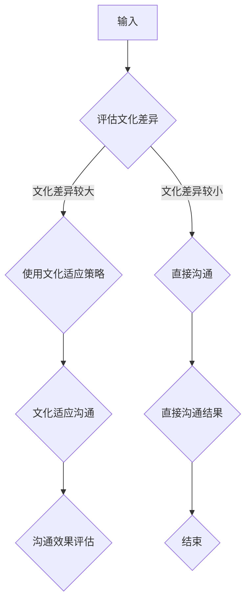
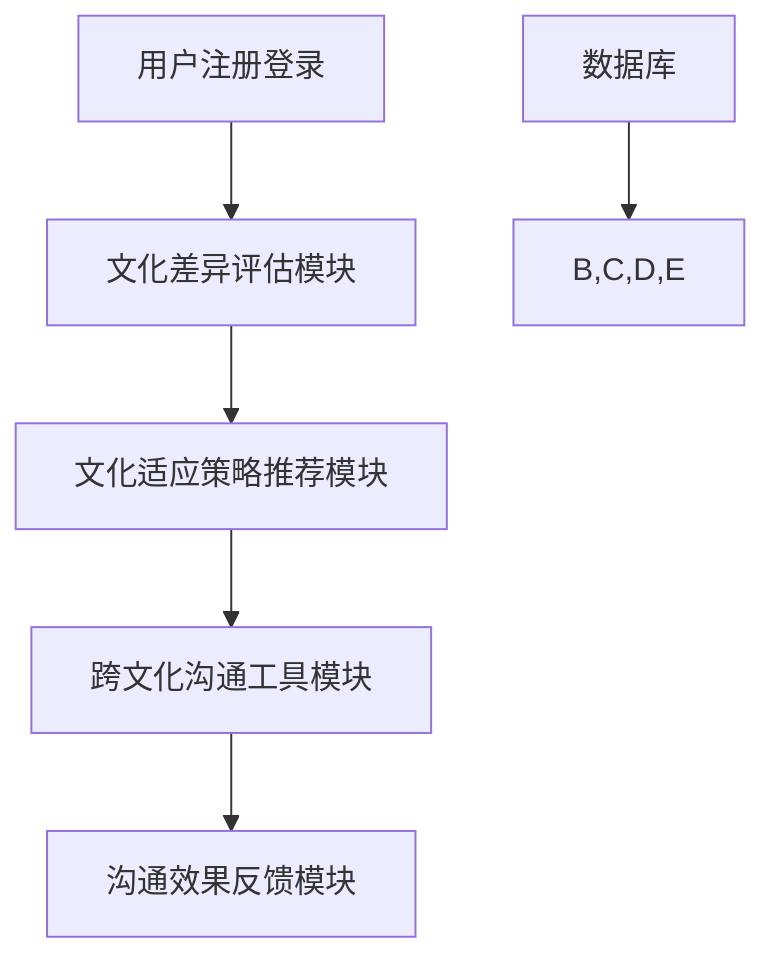

                 

### 《多元文化背景下的身份认同》

> 关键词：多元文化、身份认同、全球化、心理学、社会学、教育、工作场所、政策与法律

> 摘要：本文从多元文化的背景出发，深入探讨了身份认同的概念、理论、挑战及其在教育、工作场所和政策与法律中的重要作用。通过逻辑清晰的分析和举例说明，本文旨在帮助读者理解多元文化背景下身份认同的复杂性和多样性，以及如何在各个领域应对和促进身份认同的发展。

### 第一部分：引言

#### 第1章：问题背景与核心概念

##### 1.1 问题背景

多元文化的概念与历史发展

全球化对文化多样性的影响

身份认同的重要性与现状

##### 1.2 核心概念

身份认同的定义与分类

多元文化背景下的身份认同

身份认同的心理学与社会学意义

#### 第2章：多元文化背景下的身份认同理论

##### 2.1 理论框架

多元文化主义的定义与发展

身份认同理论的多样化观点

多元文化与身份认同之间的关系

##### 2.2 文化相对主义

文化相对主义的基本概念

文化相对主义的观点与影响

文化相对主义在身份认同中的应用

##### 2.3 多元文化认同理论

多元文化认同的定义与内涵

多元文化认同的类型与特点

多元文化认同的心理学与社会学作用

#### 第3章：多元文化背景下的身份认同挑战

##### 3.1 文化冲突与融合

文化冲突的起源与表现

文化冲突对身份认同的影响

文化融合的策略与实践

##### 3.2 颠覆与重建

颠覆性事件的背景与影响

身份认同的重建过程

重构身份认同的方法与挑战

##### 3.3 社会认同的压力与应对

社会认同的概念与作用

社会认同对身份认同的挑战

应对策略与自我调适

#### 第4章：教育领域的多元文化身份认同

##### 4.1 学校教育中的多元文化身份认同

学校教育对身份认同的影响

多元文化教育的实践与效果

学校教育中的身份认同问题与解决方案

##### 4.2 家庭教育的多元文化影响

家庭背景与身份认同的关系

家庭教育对身份认同的塑造

家庭教育中的多元文化冲突与融合

##### 4.3 社区教育在身份认同中的作用

社区教育的多元文化视角

社区教育对身份认同的促进

社区教育中的身份认同困境与解决路径

#### 第5章：工作场所的多元文化身份认同

##### 5.1 组织文化与身份认同

组织文化的多元性

组织文化对身份认同的影响

组织文化中的身份认同问题与解决策略

##### 5.2 跨文化沟通与协作

跨文化沟通的障碍与挑战

跨文化协作的技巧与策略

跨文化沟通中的身份认同问题与解决方法

##### 5.3 工作场所中的身份认同危机

身份认同危机的识别与应对

工作场所中的身份认同冲突与解决

身份认同危机对职业发展的作用

#### 第6章：政策与法律在多元文化身份认同中的作用

##### 6.1 政策背景与法律框架

全球多元文化政策的发展

我国多元文化政策的现状与挑战

法律在维护多元文化身份认同中的作用

##### 6.2 公共服务与多元文化认同

公共服务的多元文化需求

公共服务中的身份认同问题

公共服务中的多元文化解决方案

##### 6.3 社会政策与身份认同

社会政策对多元文化认同的引导

社会政策中的身份认同挑战

社会政策对身份认同的促进作用

#### 第7章：多元文化背景下的身份认同：未来展望

##### 7.1 全球化背景下的身份认同趋势

全球化对身份认同的影响

身份认同的未来发展预测

全球化与身份认同的平衡策略

##### 7.2 技术变革与身份认同

技术进步对多元文化认同的影响

虚拟世界中的身份认同现象

技术变革对身份认同的未来影响

##### 7.3 多元文化身份认同的教育与培训

身份认同教育与培训的重要性

教育与培训中的多元文化视角

身份认同教育与培训的实践与成效

### 附录：核心概念与联系

#### 多元文化主义

**定义：**
多元文化主义是指在一个社会中，不同民族、种族、宗教和文化群体在相互尊重的基础上共存，共同构建社会文化的多样性和丰富性。

**属性特征**

#### 文化相对主义

**定义：**
文化相对主义认为，每个文化都有其独特的价值和意义，不应以自身的标准来评价其他文化。

**属性特征**

| 特征 | 说明 |
| --- | --- |
| 相对性 | 强调不同文化的相对性和差异性 |
| 尊重多样性 | 尊重每个文化的独特性和多样性 |
| 反对文化霸权 | 反对将一种文化视为“标准”或“优越”的倾向 |

#### 多元文化认同理论

**定义：**
多元文化认同理论关注个体如何在多元文化环境中构建自我认同，以及不同文化身份之间的相互影响。

**属性特征**

| 特征 | 说明 |
| --- | --- |
| 个体主观性 | 认同的构建受到个体主观意识和价值观的影响 |
| 社会结构影响 | 社会结构和政策对多元文化认同的形成有重要影响 |
| 文化互动性 | 多元文化之间的互动和融合对认同的形成有重要作用 |

### 附录：算法原理讲解

#### 跨文化沟通算法

**算法流程图：**



**Python 源代码：**

```python
def cross-cultural_communication(culture_difference):
    if culture_difference > threshold:
        result = cultural_adaptation_strategy()
    else:
        result = direct_communication()
    return result

def cultural_adaptation_strategy():
    # 文化适应策略实现
    pass

def direct_communication():
    # 直接沟通实现
    pass

# 测试代码
culture_difference = 5
result = cross-cultural_communication(culture_difference)
print("沟通结果：", result)
```

**算法原理解释：**

本算法用于跨文化沟通，首先评估文化差异，如果差异较大，则采用文化适应策略，否则直接进行沟通。文化适应策略包括了解对方文化特点、调整沟通方式等，以提高沟通效果。直接沟通则依赖于双方的直接互动和沟通技巧。

### 附录：系统分析与架构设计方案

#### 问题场景介绍

在一个全球化公司中，由于员工来自不同文化背景，跨文化沟通成为日常工作中的挑战。为提高沟通效率，公司需要设计一套跨文化沟通系统。

#### 项目介绍

项目名称：全球通跨文化沟通系统

项目目标：提高公司内部跨文化沟通效率，促进团队合作。

#### 系统功能设计

1. 用户注册与登录
2. 文化差异评估
3. 文化适应策略推荐
4. 跨文化沟通工具
5. 沟通效果反馈

#### 系统架构设计

**架构图：**



**系统架构说明：**

系统采用B/S架构，包括前端用户界面、后端功能模块和数据存储。用户注册登录模块提供用户身份认证功能；文化差异评估模块用于评估用户之间的文化差异；文化适应策略推荐模块根据评估结果推荐合适的沟通策略；跨文化沟通工具模块提供实际的沟通工具；沟通效果反馈模块用于收集用户反馈，优化系统。

#### 系统接口设计和系统交互

**接口设计：**

1. 用户注册与登录接口
2. 文化差异评估接口
3. 文化适应策略推荐接口
4. 跨文化沟通工具接口
5. 沟通效果反馈接口

**系统交互序列图：**

```mermaid
sequenceDiagram
 participant 用户
 participant 系统A
 participant 系统B
 participant 系统C
 participant 系统D
 participant 系统E

 用户->>系统A: 用户注册/登录请求
 系统

