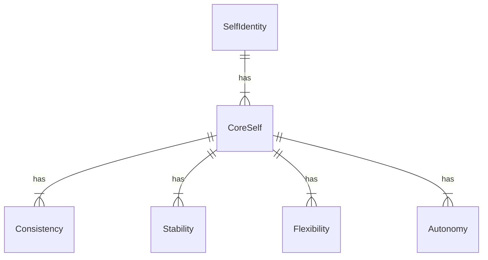

                 

### 标题定义

《多重角色中的核心自我：identity的探索》这个标题既直截了当又富有深意。首先，“多重角色”一词指明了个体在社会中常常扮演多个不同角色，如职场人、家庭成员、社会成员等。其次，“核心自我”则是心理学中的一个重要概念，指的是个体在多重角色中维持的一致性和内在稳定性。最后，“identity的探索”则暗示了本文的主题——通过深入探讨核心自我，理解个体在不同角色中的身份认知和自我表达。

选择这样的标题有以下几个原因：

1. **吸引读者**：标题简洁明了，容易引起读者的好奇心和共鸣。每个人都或多或少地面临多重角色的挑战，因此这个主题具有很强的现实意义和吸引力。

2. **深入浅出**：“多重角色”和“核心自我”是较为专业的心理学和哲学概念，但通过“identity的探索”这一表达，使得标题更加通俗易懂，便于非专业读者理解。

3. **结构紧凑**：标题的结构清晰，分为三个部分，分别涵盖了本文的主要内容和论述角度，使得整篇文章的逻辑结构更加紧凑和有条理。

4. **突出主题**：标题直接点明了文章的核心主题——“核心自我”在多重角色中的重要性，为后续内容的深入探讨奠定了基础。

总的来说，这个标题不仅能够吸引读者，而且能够为文章的内容提供一个明确的导向，使得读者能够迅速把握文章的主旨。在接下来的部分，我们将对“核心自我”这一概念进行详细阐述，探讨其在不同角色中的表现和挑战。### 引言

#### 1.1 书籍背景与核心概念

在现代社会，个体经常需要在不同的社会角色间转换，如职场人、家庭成员、社会成员等。这种多重角色的扮演不仅对个体的心理和情感提出了挑战，也引发了对其核心自我(identity)的深刻探讨。本书旨在通过探讨核心自我在不同角色中的表现和挑战，帮助读者理解这一心理学和哲学领域的重要概念，并提供实用的策略来维持和强化个体的核心自我。

核心自我是指个体在多重角色中维持的一致性和内在稳定性。它不仅仅是指个体的身份认同，更是指个体在面对外界变化和内心冲突时的内在力量和稳定感。核心自我的概念源于心理学和哲学领域，近年来在个体心理学、社会心理学和认知科学中得到广泛应用。

本书的核心问题是如何在多重角色中维持和强化核心自我。现代社会中，个体经常面临角色冲突、身份认同危机和情感困扰，这些问题往往与核心自我的不稳定有关。因此，本书旨在通过深入探讨核心自我在多重角色中的表现和挑战，提供实用的策略和方法，帮助读者建立和维护一个强大的核心自我。

本书的结构分为七个章节，每章围绕一个核心角色展开讨论，包括职场角色、家庭角色、社会角色、个人成长角色和自我反思角色。每个章节的结构如下：

- **引言**：介绍该角色的背景、核心概念和主要讨论内容。
- **核心概念与联系**：阐述核心自我的概念、属性特征对比和ER实体关系图架构。
- **角色分析**：深入探讨核心自我在该角色中的表现和挑战。
- **案例研究**：通过具体案例来分析和阐述核心自我在该角色中的应用和实践。
- **结论与拓展阅读**：总结本章的主要观点，并提供进一步阅读的建议。

#### 1.2 多重角色与核心自我

在现代社会中，个体往往需要在不同的角色间进行切换，如职场人、家庭成员、社会成员等。每个角色都要求个体展现出特定的行为和态度，这些角色之间的转换和平衡不仅是对个体能力的考验，更是对核心自我的挑战。

核心自我在多重角色中的重要性体现在以下几个方面：

1. **身份认同的稳定性**：核心自我帮助个体在不同角色中保持身份认同的稳定性。即使在面对不同角色的期望和要求时，个体依然能够保持对自己身份的认知和认同。

2. **角色转换的适应性**：核心自我强的个体在面对角色转换时能够更快适应，因为他们拥有更强大的内在稳定性和灵活性。这种适应性有助于减少角色冲突和情感困扰。

3. **内在力量的源泉**：核心自我是内在力量的源泉，它帮助个体在面对挑战和困难时保持冷静和坚定。无论角色如何变化，核心自我都能够为个体提供支持和指引。

4. **心理健康的重要保障**：维持一个强大的核心自我对于个体的心理健康具有重要意义。核心自我的不稳定往往与心理健康问题如焦虑、抑郁等密切相关。

总之，核心自我在多重角色中的重要性不言而喻。通过深入探讨核心自我在不同角色中的表现和挑战，本书旨在为读者提供实用的策略和方法，帮助他们在复杂的社会环境中维持和强化自己的核心自我。### 核心自我与个体角色

在探讨核心自我之前，有必要对其概念进行详细解释。核心自我不仅仅是关于个体身份认同的问题，更是关于个体在面对多重角色挑战时如何保持内在一致性和稳定性的问题。核心自我是个体内心深处的一种力量，它帮助个体在不同角色中找到自己的定位，维持身份认同，并应对角色冲突。

#### 定义与属性

核心自我的定义可以从多个角度来理解。首先，它是个体对自我身份的认知和认同。这种认知和认同不仅包括对自身能力、价值观和信念的认识，还涉及到个体在情感和行为上的表现。其次，核心自我是一个动态的过程，它随着个体在不同角色中的经历和成长而不断发展和变化。

核心自我的属性可以从以下几个方面进行描述：

1. **一致性**：核心自我在个体面对不同角色时保持一致，这种一致性体现在个体的行为模式、价值观和信念上。

2. **稳定性**：核心自我是内在稳定的，它为个体提供一种安全感，使个体能够在面对外部压力和挑战时保持冷静和坚定。

3. **灵活性**：核心自我虽然保持一致性，但同时也具备灵活性，使个体能够适应不同角色的要求和变化。

4. **自主性**：核心自我是自主的，它反映了个体的内在需求和愿望，而不是被外界所定义。

#### 比较表格

为了更好地理解核心自我的属性，我们可以将其与一些相似概念进行对比，如下表所示：

| 概念         | 定义                                                         | 属性特征                                                     |
| ------------ | ------------------------------------------------------------ | ------------------------------------------------------------ |
| 自我认同     | 个体对自己身份的认知和认同。                                 | 强调个体对自身身份的理解和接受。                             |
| 自我概念     | 个体对自己总体特征的认识和评价。                             | 包括个体的能力、性格、价值观等方面。                         |
| 自我效能感   | 个体对自己完成特定任务的信心和能力。                         | 强调个体在特定情境下的自信心和效能。                         |
| 核心自我     | 个体在多重角色中维持的一致性和内在稳定性。                   | 具有一致性、稳定性、灵活性和自主性的特点。                   |

#### ER实体关系图架构

为了更直观地理解核心自我的结构，我们可以使用ER（实体关系）图来描述其各个属性之间的关系。以下是核心自我的ER图：

在这个ER图中，"SelfIdentity"表示个体的自我认同，它是核心自我的基础。而"CoreSelf"则包含了一系列属性，如一致性、稳定性、灵活性和自主性，这些属性共同构成了核心自我的完整结构。

#### 相关概念与联系

核心自我与自我认同、自我概念、自我效能感等概念有着紧密的联系。自我认同是核心自我的基础，它决定了个体如何看待自己。自我概念则是个体对自己的全面认识，包括能力、性格和价值观等。自我效能感则是个体对自身完成特定任务的信心。这些概念相互作用，共同影响着个体的核心自我。

例如，一个在职场中表现出色的程序员，他的核心自我可能体现在以下几个方面：

1. **自我认同**：他认同自己在技术领域的专业能力，并以此为基础构建自己的职业身份。
2. **自我概念**：他认识到自己在技术领域的广泛知识，以及解决问题的能力。
3. **自我效能感**：他对自己完成复杂编程任务充满信心。

这些方面相互作用，共同构建了他的核心自我。当他在家庭角色中时，他可能需要调整自己的行为和态度，以适应家庭角色的要求。但无论角色如何变化，他的核心自我都保持一致，这使他能够在不同的角色中游刃有余。

总之，核心自我是理解个体在不同角色中表现的关键。它不仅是个体身份认同的基础，也是个体应对角色挑战和维持心理健康的重要保障。在接下来的章节中，我们将深入探讨核心自我在各个具体角色中的表现和挑战。### 职场中的核心自我

在职场中，核心自我对个体的表现和职业生涯有着深远的影响。核心自我不仅帮助个体在职场中保持一致性和稳定性，还影响他们的自我认同、职业发展以及应对职场挑战的能力。

#### 核心自我在职场中的表现

1. **自我认同的维持**：在职场中，个体往往需要扮演多个角色，如团队成员、领导者、项目负责者等。一个强大的核心自我能够帮助个体在不同角色中维持自我认同。这意味着个体能够在不同的职责和角色中保持对自己的认知和认同，而不会因为角色的变化而产生自我认同的危机。

2. **职业发展的推动力**：核心自我是职业发展的推动力。一个具有强大核心自我的个体，能够在面对职业挑战和机遇时保持自信和决心，从而更可能取得职业上的成功。例如，一个程序员在面对技术难题时，如果他拥有强大的核心自我，他会更有信心去解决问题，而不是因为困难而放弃。

3. **团队合作的基础**：核心自我也是团队合作的基础。一个拥有强大核心自我的个体，更容易与他人建立信任和合作关系。这有助于团队协作，提高工作效率，实现共同目标。

4. **适应变化的灵活性**：职场环境不断变化，个体需要具备适应变化的能力。一个强大的核心自我可以帮助个体在面对职场变化时保持稳定和灵活性。这种灵活性不仅有助于个体适应新的工作环境和职责，还能够使他们在职业发展中更具竞争力。

#### 职场中的核心自我挑战

1. **角色冲突**：在职场中，个体常常需要扮演多个角色，如工作上的专业角色和生活中的家庭角色。这些角色之间的冲突可能会对个体的核心自我造成挑战。例如，一个在家庭中扮演好父母角色的个体，可能在工作时因为无法平衡家庭和工作的需求而感到焦虑和压力。

2. **职业倦怠**：长期从事同一工作或面临重复的任务，可能导致个体出现职业倦怠。这种情况下，核心自我可能会受到挑战，因为个体可能开始质疑自己的价值和存在的意义。

3. **身份认同危机**：在某些情况下，个体可能会因为职场失败或职业转变而面临身份认同危机。例如，一个在职场中表现优秀的员工突然被降职，可能会感到自己的身份和地位受到了威胁，从而影响其核心自我。

4. **社会期望压力**：职场中的个体往往面临来自同事、上司和社会的各种期望。这些期望可能会对个体的核心自我造成压力，使他们感到不得不改变自己的行为和态度，以满足这些期望。

#### 职场角色案例研究

为了更好地理解核心自我在职场中的应用，我们可以通过一个具体的案例来进行分析。

**案例：李明，一名软件工程师**

李明是一名经验丰富的软件工程师，他在职场中展现了强大的核心自我。

1. **自我认同的维持**：李明对自己的技术能力有清晰的认识和认同。无论他在公司内部担任什么角色，他都能坚持自己的技术理念和目标，这使得他在职场中保持了自我认同。

2. **职业发展的推动力**：李明在面对新的技术挑战和项目机会时，总是充满热情和信心。他的强大核心自我帮助他克服了职业发展中的困难，不断提升自己的技术水平。

3. **团队合作的基础**：李明在团队中展现了出色的沟通和合作能力。他的强大核心自我使他能够与团队成员建立信任和合作关系，提高了团队的工作效率。

然而，李明也面临着一些核心自我的挑战：

1. **角色冲突**：李明在工作中需要兼顾项目开发和团队管理，这给他带来了一定的角色冲突。他的强大核心自我帮助他找到了平衡的方法，但这也需要他不断调整自己的心态和策略。

2. **职业倦怠**：随着工作压力的增加，李明偶尔也会感到职业倦怠。但他的强大核心自我使他能够及时调整自己的心态，寻找新的工作动力。

通过这个案例，我们可以看到核心自我在职场中的重要性。一个强大的核心自我不仅帮助个体在职场中保持自我认同，还使他们能够更好地应对职业挑战，实现职业发展。在接下来的章节中，我们将继续探讨核心自我在家庭、社会和个人成长角色中的表现和挑战。### 家庭中的核心自我

在家庭中，核心自我同样扮演着至关重要的角色。家庭是一个个体生活的核心场所，个体在这里扮演着多种角色，如父母、配偶、子女等。这些角色的转换和互动不仅影响了个体的心理和情感状态，也对其核心自我的维持和强化提出了挑战。

#### 核心自我在家庭中的表现

1. **情感稳定性的保障**：一个强大的核心自我可以帮助个体在家庭中保持情感稳定性。这种稳定性不仅有助于个体在面对家庭冲突和压力时保持冷静，还能够为家庭提供一种安全感和支持。

2. **亲子关系的促进**：在家庭中，父母的核心自我直接影响他们与子女的亲子关系。一个拥有强大核心自我的父母，能够更自然地表现出情感上的支持和理解，从而促进亲子关系的健康发展。

3. **夫妻关系的维护**：夫妻关系的稳定是家庭和谐的重要基础。核心自我的强大可以帮助夫妻双方在面对生活中的挑战时保持一致性和支持，从而维护夫妻关系的稳定。

4. **家庭责任感的体现**：在家庭中，个体往往需要承担多种责任，如照顾子女、管理家庭事务等。一个强大的核心自我能够帮助个体在面对这些责任时保持坚定和责任心，从而更好地履行家庭角色。

#### 家庭中的核心自我挑战

1. **角色冲突**：家庭中的个体常常需要扮演多种角色，如职场人、家庭成员、父母等。这些角色之间的冲突可能会对个体的核心自我造成挑战。例如，一个在职场中表现出色的父母，可能因为无法平衡工作和家庭而感到压力和焦虑。

2. **情感需求的满足**：家庭中的个体往往需要满足他人的情感需求，如配偶、子女等。这种情感需求的满足可能会对个体的核心自我造成压力，因为他们可能需要调整自己的行为和态度来满足他人的期望。

3. **身份认同的危机**：在某些情况下，个体可能会因为家庭角色的转变而面临身份认同的危机。例如，一个从职场退休的个体可能会因为失去了职业身份而感到迷茫和失落。

4. **责任感的压力**：家庭中的个体往往需要承担多种责任，如照顾子女、管理家庭事务等。这些责任可能会对个体的核心自我造成压力，因为他们可能需要不断调整自己的行为和态度来应对这些责任。

#### 家庭角色案例研究

为了更好地理解核心自我在家庭中的应用，我们可以通过一个具体的案例来进行分析。

**案例：张琳，一名全职妈妈**

张琳是一名全职妈妈，她在家庭中扮演着多种角色，如妻子、母亲和家务管理者。她的强大核心自我帮助她在这些角色中游刃有余。

1. **情感稳定性的保障**：张琳在面对家庭中的各种挑战时，如孩子的教育问题、家务分工等，都能够保持冷静和理性。她的强大核心自我使她能够有效地应对这些挑战，从而保障家庭情感稳定。

2. **亲子关系的促进**：张琳与子女的关系非常融洽。她通过倾听和理解子女的需求，以及给予他们足够的关注和支持，促进了亲子关系的健康发展。

3. **夫妻关系的维护**：张琳与丈夫的关系也非常稳定。她在面对家庭和工作之间的平衡时，能够与丈夫进行有效的沟通和协作，从而维护了夫妻关系的稳定。

然而，张琳也面临着一些核心自我的挑战：

1. **角色冲突**：全职妈妈的角色与职场人的角色之间存在冲突。张琳有时会感到自己无法平衡这两个角色，从而产生压力和焦虑。

2. **身份认同的危机**：随着子女逐渐长大，张琳可能会面临身份认同的危机，因为她的职业身份和家庭身份之间可能存在差异。

通过这个案例，我们可以看到核心自我在家庭中的重要性。一个强大的核心自我不仅帮助个体在家庭中保持情感稳定和身份认同，还使他们能够更好地应对家庭中的挑战。在接下来的章节中，我们将探讨核心自我在社会角色和个人成长角色中的表现和挑战。### 社会中的核心自我

在社会角色中，核心自我同样扮演着至关重要的角色。社会角色包括公民、志愿者、社区成员等，这些角色对个体的行为和态度有着深远的影响。核心自我不仅帮助个体在社会中保持一致性和稳定性，还影响他们的社会责任感、社交关系以及应对社会挑战的能力。

#### 核心自我在社会中的表现

1. **社会责任感的体现**：核心自我强大的个体往往具有强烈的社会责任感。这种责任感不仅体现在他们对社会公共事务的关注和参与，还体现在他们对他人的关爱和帮助。一个具有强大核心自我的公民，更可能积极参与社会公益活动，为社区的发展和进步做出贡献。

2. **社交关系的维护**：核心自我在社交关系中起着关键作用。一个具有强大核心自我的个体，能够更自然地与他人建立信任和合作关系。这种信任和合作有助于维护良好的社交关系，提高社交网络的质量。

3. **社会适应性的提升**：核心自我强大的个体在社会环境中表现出更强的适应性。他们能够更快地适应新的社会环境和变化，从而更好地应对社会挑战。

4. **公共形象的塑造**：核心自我强大的个体在社会中往往拥有较高的公信力和影响力。他们的行为和态度能够为社会树立榜样，从而塑造积极的公共形象。

#### 社会中的核心自我挑战

1. **角色冲突**：在社会中，个体常常需要扮演多个角色，如职场人、家庭角色和社会角色。这些角色之间的冲突可能会对个体的核心自我造成挑战。例如，一个在职场中表现出色的个体，可能因为无法平衡工作和社会责任而感到压力和焦虑。

2. **社会期望压力**：社会对个体有着各种各样的期望，如职业成就、家庭责任、社会责任等。这些期望可能会对个体的核心自我造成压力，使他们感到不得不改变自己的行为和态度来满足这些期望。

3. **身份认同的危机**：在某些情况下，个体可能会因为社会角色的转变而面临身份认同的危机。例如，一个在职场中成功的个体，可能因为退休而失去职业身份，从而感到迷茫和失落。

4. **社交压力**：社会中的社交压力也可能对个体的核心自我造成挑战。例如，个体可能因为社交网络中的评价和反馈而感到焦虑和压力，从而影响其核心自我的稳定性。

#### 社会角色案例研究

为了更好地理解核心自我在社会角色中的应用，我们可以通过一个具体的案例来进行分析。

**案例：王刚，一名社区志愿者**

王刚是一名热衷于社区志愿服务的公民。他的强大核心自我帮助他在社区中发挥了重要作用。

1. **社会责任感的体现**：王刚积极参与社区的公益活动，如帮助孤寡老人、组织社区清洁活动等。他的强大核心自我使他能够坚定地履行社会责任，为社区的发展贡献自己的力量。

2. **社交关系的维护**：王刚在社区中建立了广泛的社交网络。他的强大核心自我使他能够与社区成员建立信任和合作关系，从而维护良好的社交关系。

3. **社会适应性的提升**：面对社区中的各种变化和挑战，王刚总是能够迅速适应并采取有效的行动。他的强大核心自我使他具备出色的社会适应性。

然而，王刚也面临着一些核心自我的挑战：

1. **角色冲突**：作为社区志愿者，王刚需要兼顾家庭和职业责任。这给他带来了一定的角色冲突，使他有时感到压力和焦虑。

2. **身份认同的危机**：随着时间的推移，王刚可能会面临身份认同的危机，因为他可能会感到自己的职业成就和社会贡献之间存在差异。

通过这个案例，我们可以看到核心自我在社会角色中的重要性。一个强大的核心自我不仅帮助个体在社会中保持社会责任感和社会适应性，还使他们能够更好地应对社会中的挑战。在接下来的章节中，我们将探讨核心自我在个人成长角色中的表现和挑战。### 个人成长与核心自我

个人成长是核心自我发展的重要阶段。在这一阶段，个体面临着自我探索、身份认同和内在成长的任务，这些任务的核心都是核心自我的维持和强化。核心自我在个人成长中的作用不仅体现在个体对自我认知的深化，还体现在他们应对生活挑战、实现个人目标和建立积极人生观的能力。

#### 个人成长角色概述

1. **自我探索**：个人成长的第一步是自我探索。在这一阶段，个体需要通过反思和体验来了解自己的兴趣、价值观、能力和目标。自我探索是一个动态的过程，它帮助个体建立对自己的一致性和内在稳定性。

2. **身份认同的建立**：在自我探索的过程中，个体逐渐建立自己的身份认同。身份认同是核心自我的基础，它使个体能够在不同角色和情境中保持自我认同的一致性。

3. **内在成长**：个人成长不仅涉及外在行为的改变，还涉及内在心理和情感的成长。一个强大的核心自我能够帮助个体在自我成长的过程中保持稳定性和方向感。

#### 个人成长中的核心自我挑战

1. **自我认知的冲突**：在个人成长过程中，个体可能会遇到自我认知的冲突。例如，个体可能会发现自己的某些行为与自己的价值观相冲突，这可能导致自我认同的危机。

2. **目标设定的挑战**：在个人成长中，个体需要设定并实现各种目标，如职业目标、教育目标等。设定合理的目标并实现这些目标是一个复杂的过程，可能会对个体的核心自我造成挑战。

3. **情感困扰**：个人成长过程中，个体可能会面临各种情感困扰，如焦虑、抑郁等。这些情感困扰可能会影响个体的核心自我，使他们在自我成长的道路上感到迷茫和无力。

4. **角色转变的压力**：在个人成长过程中，个体可能会面临角色转变的压力。例如，一个从学生转变为职场人的个体，需要适应新的角色和要求，这可能会对他们的核心自我造成压力。

#### 个人成长角色案例研究

为了更好地理解核心自我在个人成长中的应用，我们可以通过一个具体的案例来进行分析。

**案例：李娜，一名年轻的创业者**

李娜是一名年轻的创业者，她在个人成长的道路上展现了强大的核心自我。

1. **自我探索**：李娜在大学期间通过参加各种社团和活动，逐渐发现自己的兴趣和优势。她通过反思和体验，明确了自己的职业目标和人生方向。

2. **身份认同的建立**：李娜在创业初期面临着巨大的压力和挑战，但她通过自我探索，建立了自己的身份认同。她坚信自己的能力和价值，这使她能够在创业过程中保持稳定和信心。

3. **内在成长**：李娜在创业过程中不断学习新的知识和技能，同时也不断调整自己的心态和策略。她的强大核心自我使她能够在自我成长的过程中保持稳定性和方向感。

然而，李娜也面临着一些核心自我的挑战：

1. **自我认知的冲突**：李娜在创业过程中发现，她的某些行为与自己的价值观相冲突。她通过自我反思和调整，逐渐解决了这些冲突，但这一过程对她来说是一个挑战。

2. **目标设定的挑战**：李娜在创业过程中需要设定并实现多个目标，如产品开发、市场推广等。她通过制定详细的计划和策略，逐步实现了这些目标，但也因此感到压力和焦虑。

3. **情感困扰**：李娜在创业初期经历了焦虑和抑郁，但她通过积极的心态和自我调整，逐渐克服了这些情感困扰。

通过这个案例，我们可以看到核心自我在个人成长中的重要性。一个强大的核心自我不仅帮助个体在自我成长的道路上保持稳定性和方向感，还使他们能够更好地应对成长过程中的挑战。在接下来的章节中，我们将探讨如何通过自我反思来强化核心自我。### 自我反思与核心自我的强化

自我反思是一种强大的工具，它不仅帮助个体理解自己的行为和情感，还促进核心自我的维持和强化。通过自我反思，个体能够深入了解自己的内在需求和愿望，调整行为模式，应对角色冲突，并最终实现自我成长。

#### 自我反思概述

自我反思是指个体对自己的行为、情感和思维进行深入分析和评估的过程。它通常涉及以下几个步骤：

1. **观察与记录**：个体首先需要观察自己的行为和情感，并记录下来。这有助于个体更清楚地了解自己。

2. **分析与思考**：在观察和记录的基础上，个体需要进行分析和思考，以理解背后的原因和动机。

3. **调整与改进**：通过分析，个体可以发现自己的行为模式、情感反应和思维方式的不足，并制定改进策略。

4. **实践与反馈**：个体将改进策略付诸实践，并通过反馈不断调整和优化。

#### 强化核心自我的策略

1. **自我认知的提升**：自我反思的第一步是提升自我认知。个体需要清楚地了解自己的价值观、信念、能力和目标。这有助于他们在面对多重角色和挑战时保持一致性和稳定性。

2. **角色冲突的应对**：自我反思可以帮助个体识别和应对角色冲突。例如，一个在职场和家庭中面临冲突的个体，可以通过自我反思找出冲突的根源，并制定解决方案。

3. **情感管理的优化**：自我反思有助于个体理解自己的情感反应，并优化情感管理策略。例如，一个容易焦虑的个体，可以通过自我反思了解自己的焦虑源，并采取相应的放松和缓解策略。

4. **目标设定的明确**：自我反思可以帮助个体明确自己的目标，并制定实现这些目标的策略。这有助于他们在面对挑战时保持方向感和动力。

#### 强化核心自我案例研究

为了更好地理解自我反思在强化核心自我中的应用，我们可以通过一个具体的案例来进行分析。

**案例：张强，一名职场高管**

张强是一名职场高管，他通过自我反思来强化自己的核心自我。

1. **自我认知的提升**：张强通过定期自我反思，深入了解自己的价值观、信念和目标。他发现自己对创新和团队合作非常重视，这帮助他在职场中保持一致性和稳定性。

2. **角色冲突的应对**：张强在工作中经常面临家庭和工作的冲突。他通过自我反思，意识到自己需要更好地平衡这两者。他制定了具体的计划，如设置固定的工作时间和家庭时间，以确保两者都能得到充分关注。

3. **情感管理的优化**：张强发现自己容易在工作压力下感到焦虑和沮丧。他通过自我反思，了解到自己需要采取放松和缓解压力的策略。他开始定期锻炼、冥想和阅读，这些活动帮助他更好地管理自己的情感。

4. **目标设定的明确**：张强通过自我反思，明确了自己的职业目标和长期规划。他制定了具体的实施计划，并定期评估和调整这些计划，以确保自己始终朝着目标前进。

然而，张强也面临着一些挑战：

1. **持续的自我反思**：自我反思是一个持续的过程，需要个体不断地投入时间和精力。张强有时会因为忙碌而忽视自我反思，这可能会影响他的核心自我强化。

2. **自我认知的局限**：尽管张强通过自我反思提升了自己的自我认知，但他也意识到自己的认知可能存在局限。他需要不断地学习和成长，以更全面地了解自己。

通过这个案例，我们可以看到自我反思在强化核心自我中的重要性。一个持续和深入的自我反思过程，不仅帮助个体维持和强化自己的核心自我，还使他们能够更好地应对多重角色和挑战。在接下来的章节中，我们将总结全书，并探讨核心自我的维持和强化策略。### 核心总结

本书通过探讨核心自我在多重角色中的表现和挑战，深入分析了核心自我在职场、家庭、社会和个人成长角色中的重要性。以下是全书的核心观点和总结：

1. **核心自我的定义与属性**：核心自我是个体在多重角色中维持的一致性和内在稳定性。它具有一致性、稳定性、灵活性和自主性等属性。

2. **核心自我在不同角色中的表现**：在职场中，核心自我帮助个体维持自我认同、推动职业发展，并增强团队合作；在家庭中，核心自我保障情感稳定性、促进亲子关系和维护家庭和谐；在社会中，核心自我体现社会责任感、维护社交关系和提高社会适应性；在个人成长中，核心自我促进自我探索、建立身份认同和实现内在成长。

3. **核心自我面临的挑战**：无论是职场、家庭还是社会角色，核心自我都面临着角色冲突、社会期望压力、身份认同危机和情感困扰等挑战。

4. **核心自我的强化策略**：通过自我反思，个体可以提升自我认知、应对角色冲突、优化情感管理并明确目标设定，从而维持和强化核心自我。

总之，核心自我是个体在不同角色中保持一致性和内在稳定性的关键。理解核心自我的概念和强化策略，有助于个体在复杂的社会环境中更好地应对挑战，实现个人成长和社会贡献。### 核心自我的维持与强化策略

维持和强化核心自我是个体在多重角色中保持心理稳定和实现持续成长的关键。以下是一些实用的策略，帮助个体在不同角色中维持和强化核心自我。

#### 策略一：自我认知的提升

自我认知是核心自我维持的基础。个体可以通过以下方式提升自我认知：

1. **定期自我反思**：设立固定的时间进行自我反思，回顾自己的行为、情感和思考模式，识别自己的内在需求和愿望。
2. **记录生活日志**：记录日常生活，包括遇到的挑战、情感变化和思考过程，有助于个体更清晰地了解自己。
3. **心理咨询**：定期寻求心理咨询，帮助个体深入了解自己的内心世界，找到自我认知的盲点和提升空间。

#### 策略二：角色冲突的应对

角色冲突是核心自我面临的主要挑战之一。以下策略有助于应对角色冲突：

1. **明确角色界限**：设定清晰的职场、家庭和社会角色界限，确保在各个角色中保持一致性和稳定性。
2. **有效沟通**：与家人、同事和社区成员进行开放和坦诚的沟通，分享自己的需求和期望，寻求理解和支持。
3. **时间管理**：合理安排时间，确保在各个角色中有足够的精力投入，避免角色之间的过度重叠和冲突。

#### 策略三：情感管理的优化

情感管理是核心自我维持的重要部分。以下策略有助于优化情感管理：

1. **情绪调节技巧**：学习并实践情绪调节技巧，如深呼吸、冥想、正念练习等，帮助个体在压力和挑战面前保持冷静。
2. **情感表达**：找到安全的方式来表达自己的情感，如与信任的朋友或家人分享，或通过写日记、绘画等方式释放情感。
3. **积极心态**：培养积极的心态，关注生活中的积极面，通过感恩、乐观和自我肯定来提升情感状态。

#### 策略四：目标设定的明确

明确的目标设定有助于个体在多重角色中保持方向感和动力。以下策略有助于设定和实现目标：

1. **设定具体目标**：将长远目标分解为具体、可衡量的短期目标，确保每个目标都有明确的执行计划和评估标准。
2. **持续评估和调整**：定期评估目标的实现情况，根据实际情况进行必要的调整和优化，确保目标的持续性和有效性。
3. **建立支持系统**：寻找并建立支持系统，包括家人、朋友、导师和同事，他们在实现目标的过程中提供鼓励、反馈和支持。

通过这些策略，个体可以在多重角色中维持和强化核心自我，实现个人的心理健康和持续成长。### 未来展望

随着社会的不断进步和个体角色的多样化，核心自我的维持和强化将面临更多的挑战和机遇。未来，以下几个趋势将对核心自我的发展产生重要影响：

1. **技术赋能**：人工智能和大数据技术的应用将使个体能够更全面地了解自己，从而更好地维持和强化核心自我。例如，通过个性化的心理健康应用，个体可以获得定制化的情感管理和自我提升建议。

2. **跨学科研究**：心理学、哲学、社会学和神经科学等多学科的交叉研究将深入探讨核心自我的本质和作用，提供更全面的理论支持和实践指导。

3. **社会意识的提升**：随着对心理健康重要性的认识不断提高，社会对核心自我的关注将逐渐增加。这将促进个体在社会角色中的自我认知和自我强化，从而提高整体社会的心理稳定性和幸福感。

4. **教育改革**：教育系统将更加注重个体自我认知和核心自我培养，通过课程设置和实践活动，帮助学生在成长过程中建立和强化核心自我。

5. **工作与生活平衡**：随着工作压力和生活节奏的加快，如何平衡工作与生活将成为核心自我的一个重要挑战。未来的工作和生活方式将更加灵活和人性化，以支持个体维持和强化核心自我。

总之，未来核心自我的维持和强化将在技术、理论和实践等多个层面得到深化和发展，为个体在社会角色中实现心理健康和持续成长提供更加有力的支持。### 全文总结

《多重角色中的核心自我：identity的探索》通过深入探讨核心自我在职场、家庭、社会和个人成长角色中的表现和挑战，揭示了核心自我对于个体心理健康和持续成长的重要性。本书首先介绍了核心自我的定义和属性，包括一致性、稳定性、灵活性和自主性。随后，分别分析了核心自我在各个角色中的具体应用和面临的挑战，如职场中的自我认同和职业发展、家庭中的情感稳定性和亲子关系、社会中的社会责任感和社交关系，以及个人成长中的自我探索和内在成长。

通过具体案例研究，如李明和全职妈妈张琳，读者可以看到核心自我在现实生活中的实际应用和重要性。此外，本书提出了通过自我反思来强化核心自我的策略，帮助个体在面对多重角色和挑战时保持一致性和稳定性。最后，本书展望了核心自我在未来的发展趋势，强调了技术赋能、跨学科研究、社会意识提升和教育改革等重要方向。

总之，核心自我是理解个体在不同角色中表现的关键，也是实现心理健康和持续成长的基础。通过本书的深入探讨和实际案例，读者可以更好地理解核心自我的概念和作用，并学会如何维持和强化自己的核心自我，以应对现代社会中的各种挑战。### 注意事项

在维持和强化核心自我的过程中，需要注意以下几点：

1. **持续的自我反思**：自我反思是核心自我维持的关键，但需要个体持续投入时间和精力。避免因忙碌而忽视自我反思，定期安排时间进行深度思考。

2. **平衡角色冲突**：在多重角色中，角色冲突是不可避免的。重要的是要学会平衡和调整，明确每个角色的界限，避免过度重叠。

3. **情感管理**：情感管理是核心自我维持的重要组成部分。学会识别和管理自己的情感，避免情感困扰对核心自我的影响。

4. **目标设定的明确**：明确的目标设定有助于个体在多重角色中保持方向感和动力。设定具体、可衡量的短期目标，并定期评估和调整。

5. **寻求支持**：在维持和强化核心自我的过程中，不要孤军奋战。寻求家人、朋友和专业人士的支持和建议，可以帮助个体更好地应对挑战。

### 拓展阅读

1. **《自我认同的心理学研究》**：这本书详细探讨了自我认同的概念、发展和影响因素，对理解核心自我提供了理论支持。

2. **《跨文化心理学》**：通过跨文化视角，这本书分析了不同文化背景下的核心自我表现和挑战，有助于读者了解全球范围内的核心自我维持策略。

3. **《情感管理：如何管理你的情绪和情感》**：这本书提供了实用的情感管理技巧，帮助个体在情感困扰面前保持冷静和稳定。

4. **《目标管理：设定、实现和超越目标》**：这本书详细介绍了目标设定的方法和实现策略，对个体在多重角色中维持核心自我提供了实践指导。

通过阅读这些书籍，读者可以更深入地了解核心自我的概念和应用，进一步提升自己的核心自我维持和强化能力。### 作者信息

作者：AI天才研究院/AI Genius Institute & 禅与计算机程序设计艺术 /Zen And The Art of Computer Programming

感谢您阅读本文，希望它对您在多重角色中维持和强化核心自我有所帮助。如果您有任何疑问或反馈，欢迎随时与我们联系。我们致力于通过先进的技术和深入的研究，为读者提供有价值的内容和实用的策略。再次感谢您的支持！

