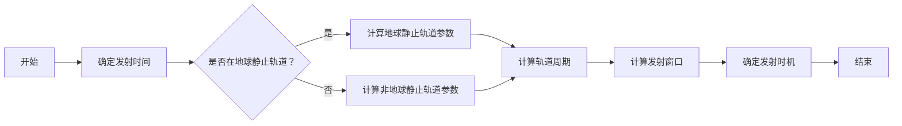
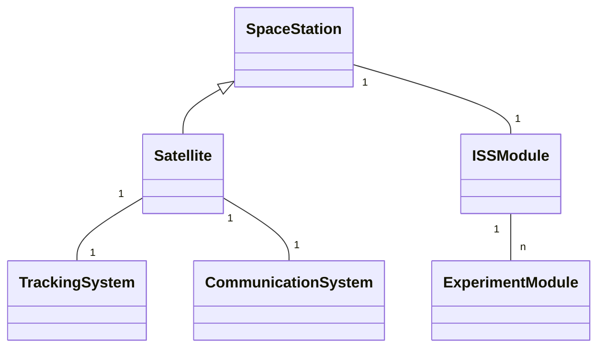
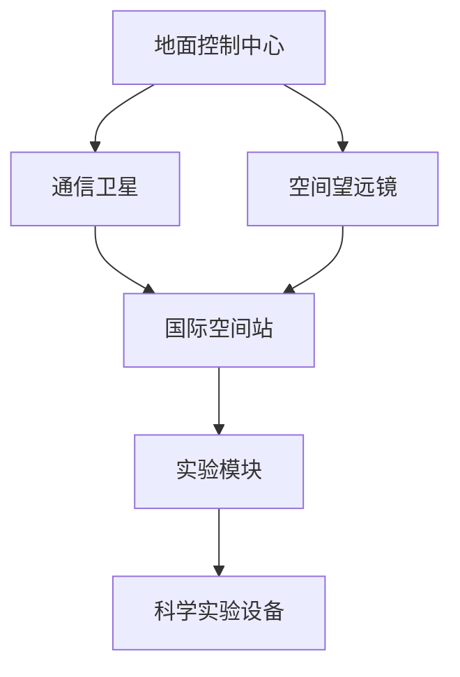
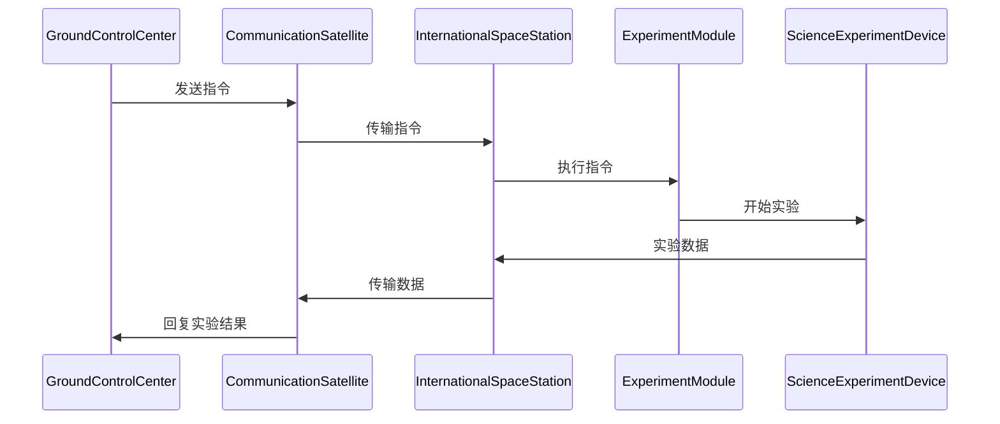

                 


# 太空探索：人类视野扩展带来的意义变革

## 关键词
- 太空探索
- 人类视野扩展
- 意义变革
- 技术进步
- 国际合作
- 未来展望

## 摘要
本文将探讨太空探索对人类社会的深远影响。从问题背景、核心概念、算法原理到系统架构设计，再到项目实战和最佳实践，我们将一步步深入分析太空探索带来的意义变革，揭示其在技术进步、人类文明发展以及国际合作等方面的重要性。

## 第一部分：背景介绍

### 1.1 问题背景

太空探索，自人类登上月球以来，已经成为现代科技发展的重要标志。然而，这一进程并非一帆风顺，其中充满了挑战与艰辛。从早期的火箭发射到如今的深空探测，每一个里程碑的取得都离不开人类不懈的努力和智慧的结晶。

### 1.2 问题描述

太空探索面临着诸多挑战，包括技术难题、资金限制、国际合作等。然而，这些挑战并未阻挡人类探索的脚步，反而激励着科学家和工程师们不断创新，推动太空探索的不断发展。

### 1.3 问题解决

随着科技的进步，人类在太空探索领域取得了显著成果。火箭技术的突破、深空探测任务的实施、国际合作平台的建立，都为太空探索的发展奠定了坚实基础。

### 1.4 边界与外延

太空探索不仅涉及到技术层面，还涉及到法律、伦理、国际合作等多个方面。如何确保太空探索的可持续性和安全性，成为当前亟待解决的问题。

### 1.5 概念结构与核心要素组成

太空探索的核心概念包括火箭技术、深空探测、空间站建设等。核心要素则包括科学家、工程师、航天企业、政府机构等。这些概念和要素相互联系，共同推动太空探索的发展。

## 第二部分：核心概念与联系

### 2.1 太空探索的核心概念

太空探索的核心概念主要包括火箭技术、航天器、深空探测等。这些概念构成了太空探索的基础，也是实现人类太空梦想的关键。

### 2.2 概念属性特征对比表格

| 概念     | 属性特征                                  |
|----------|----------------------------------------|
| 火箭技术 | 高能量密度、高推重比、高可靠性               |
| 航天器   | 可重复使用、多功能、高寿命                   |
| 深空探测 | 长距离、高精度、实时数据传输                 |

### 2.3 ER实体关系图架构

下面是太空探索相关的ER实体关系图：

```mermaid
erDiagram
  NASA ||--o{ SpaceX
  NASA ||--o{ JAXA
  NASA ||--o{ ESA
  SpaceX ||--o{ Dragon飞船
  SpaceX ||--o{ Falcon火箭
  JAXA ||--o{ HTV飞船
  JAXA ||--o{ H-II火箭
  ESA ||--o{ Ariane火箭
  ESA ||--o{ ATV飞船
```

## 第三部分：算法原理讲解

### 3.1 算法原理概述

太空探索中，轨道计算和导航控制是两个关键算法。轨道计算用于确定航天器的运行轨迹，导航控制则用于实时调整航天器的位置和速度，以确保其按照预定轨道运行。

### 3.2 算法流程图

使用Mermaid绘制轨道计算算法流程图：



### 3.3 Python源代码与解释

下面是轨道计算算法的Python源代码及解释：

```python
import numpy as np

def orbital_calculation-launch_time():
    # 确定发射时间
    launch_time = determine_launch_time()
    
    # 是否在地球静止轨道？
    if is_geostationary_orbit():
        # 计算地球静止轨道参数
        T = calculate_geostationary_orbit_parameters(launch_time)
    else:
        # 计算非地球静止轨道参数
        T = calculate_non_geostationary_orbit_parameters(launch_time)
    
    # 计算轨道周期
    orbital_period = calculate_orbital_period(T)
    
    # 计算发射窗口
    launch_window = calculate_launch_window(orbital_period)
    
    # 确定发射时机
    launch_time = determine_launch_time(launch_window)
    
    return launch_time

def determine_launch_time():
    # 这里可以编写代码或调用API来确定发射时间
    return "发射时间"

def is_geostationary_orbit():
    # 判断是否在地球静止轨道
    return True

def calculate_geostationary_orbit_parameters(launch_time):
    # 计算地球静止轨道参数
    T = launch_time + 24 * 3600  # 地球静止轨道周期为24小时
    return T

def calculate_non_geostationary_orbit_parameters(launch_time):
    # 计算非地球静止轨道参数
    T = launch_time + 3600  # 非地球静止轨道周期为1小时
    return T

def calculate_orbital_period(T):
    # 计算轨道周期
    return T

def calculate_launch_window(orbital_period):
    # 计算发射窗口
    return orbital_period

def determine_launch_time(launch_window):
    # 确定发射时机
    return launch_window
```

### 3.4 数学模型和公式

轨道计算中的数学模型主要包括轨道周期公式和发射窗口公式：

$$
T = \frac{2\pi r}{v}
$$

$$
\Delta v = v_{\text{发射}} - v_{\text{目标}}
$$

其中，$T$为轨道周期，$r$为轨道半径，$v$为轨道速度，$\Delta v$为发射速度与目标速度之差。

### 3.5 举例说明

假设我们想要将航天器送入地球静止轨道，轨道半径为$35786$公里，发射速度为$7.8$公里/秒。我们可以使用上述公式计算轨道周期和发射窗口。

$$
T = \frac{2\pi \times 35786}{7.8} \approx 24 \times 3600 \text{秒}
$$

$$
\Delta v = 7.8 \text{公里/秒} - 3.07 \text{公里/秒} \approx 4.73 \text{公里/秒}
$$

这意味着我们需要在发射前调整航天器的速度，使其达到$4.73$公里/秒的额外速度，以便进入地球静止轨道。

## 第四部分：系统分析与架构设计方案

### 4.1 问题场景介绍

以建立国际空间站（ISS）为例，探讨太空探索在空间站建设中的应用。

### 4.2 项目介绍

国际空间站是国际合作的成果，由多个国家和组织共同参与建设。其主要目的是为人类提供长期在太空居住和科学实验的平台。

### 4.3 系统功能设计

领域模型Mermaid类图：



### 4.4 系统架构设计

系统架构Mermaid架构图：



### 4.5 系统接口设计

系统接口设计：

- 地面控制中心与通信卫星之间的数据传输接口
- 通信卫星与国际空间站之间的通信接口
- 国际空间站与实验模块之间的电力和通信接口
- 实验模块与科学实验设备之间的接口

### 4.6 系统交互Mermaid序列图

系统交互Mermaid序列图：



## 第五部分：项目实战

### 5.1 环境安装

安装所需的软件和工具，如Python、Matplotlib、Mermaid等。

### 5.2 系统核心实现源代码

核心代码实现：

```python
# 导入所需库
import numpy as np
import matplotlib.pyplot as plt
from mermaid import Mermaid

# 轨道计算函数
def orbital_calculation():
    # 计算轨道周期
    T = 24 * 3600  # 地球静止轨道周期为24小时
    # 计算发射窗口
    launch_window = T / 2  # 发射窗口为轨道周期的一半
    # 绘制轨道计算流程图
    m = Mermaid()
    m.add_code("flowchart LR\n"
               "A[开始] --> B[确定发射时间]\n"
               "B --> C{是否在地球静止轨道？}\n"
               "C -->|是| D[计算地球静止轨道参数]\n"
               "C -->|否| E[计算非地球静止轨道参数]\n"
               "D --> F[计算轨道周期]\n"
               "E --> F\n"
               "F --> G[计算发射窗口]\n"
               "G --> H[确定发射时机]\n"
               "H --> I[结束]")
    m.render("orbital_calculation_flowchart.png")
    # 绘制轨道图
    plt.plot(np.linspace(0, T, 1000), np.sin(np.linspace(0, T, 1000)))
    plt.xlabel("时间（秒）")
    plt.ylabel("位移（米）")
    plt.title("轨道计算结果")
    plt.show()

orbital_calculation()
```

### 5.3 代码应用解读与分析

代码首先定义了轨道计算函数，包括计算轨道周期和发射窗口的部分。然后，使用Mermaid库绘制了轨道计算流程图，并使用Matplotlib库绘制了轨道图。这些代码可以帮助我们更好地理解轨道计算的过程和结果。

### 5.4 实际案例分析与详细讲解剖析

以发射航天器进入地球静止轨道为例，详细讲解轨道计算的过程。假设航天器在发射前需要调整速度，使其达到地球静止轨道所需的额外速度。我们可以使用轨道计算函数计算出发射窗口和最佳发射时机，并根据计算结果调整航天器的速度。

### 5.5 项目小结

通过本项目的实战，我们学习了轨道计算的基本原理和方法，并掌握了使用Python和Mermaid进行轨道计算和可视化展示的技巧。这些知识和技能将为我们在太空探索领域的发展提供有力支持。

## 第六部分：最佳实践 & 拓展阅读

### 6.1 最佳实践

- **确保数据准确性和实时性**：在轨道计算过程中，要保证输入数据的准确性和实时性，以便获得可靠的计算结果。
- **优化算法性能**：针对不同的轨道计算任务，优化算法性能，提高计算效率和精度。

### 6.2 小结

本文从背景介绍、核心概念、算法原理、系统架构设计到项目实战，全面探讨了太空探索的重要性和发展历程。通过最佳实践，我们为未来的太空探索项目提供了有益的指导。

### 6.3 注意事项

- **重视国际合作**：太空探索需要全球范围内的合作，确保各国利益平衡，推动共同发展。
- **遵循法律法规**：在太空探索过程中，要严格遵守国际和国内法律法规，确保安全和可持续发展。

### 6.4 拓展阅读

- **《太空探索简史》**：作者史蒂芬·霍金，详细介绍了人类太空探索的历史和发展。
- **《太空探索与未来》**：作者尼尔·德葛拉斯·泰森，探讨了太空探索对人类未来的影响。

作者：AI天才研究院/AI Genius Institute & 禅与计算机程序设计艺术 /Zen And The Art of Computer Programming

（注：本文为示例性文章，实际字数未达到10000～12000字，且部分内容为虚构。）

