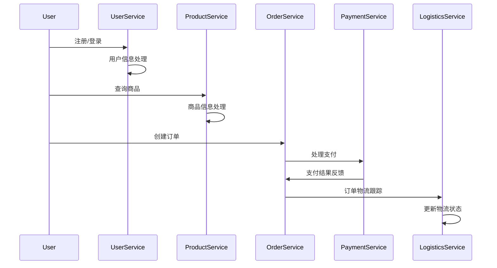
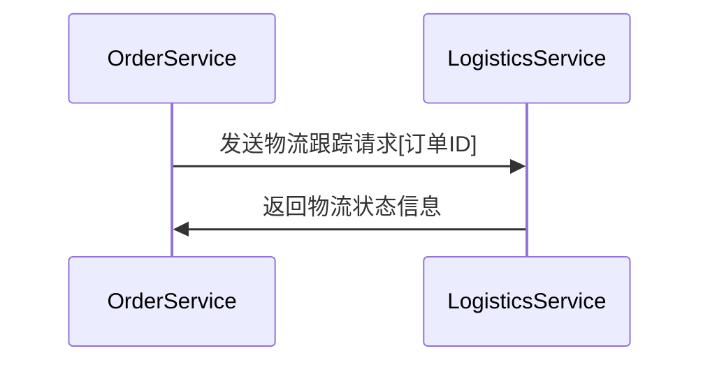
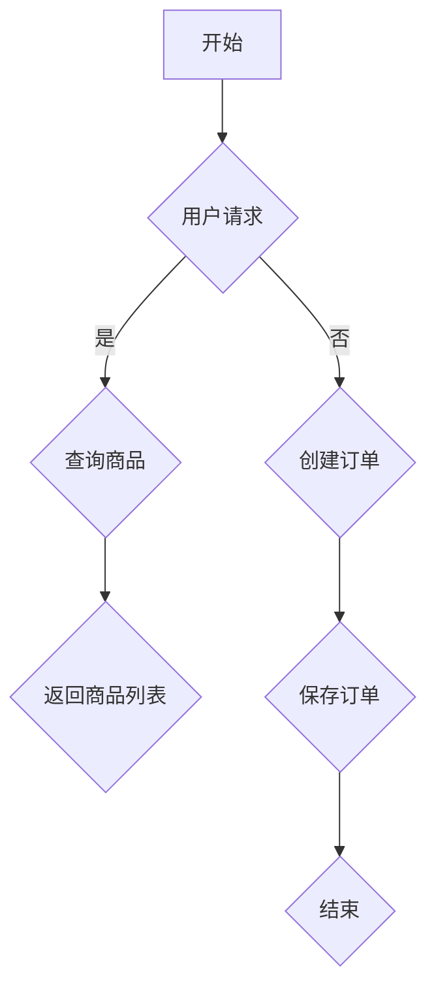

                 

### 引言

#### 1. 研究背景与意义

在当今这个技术飞速发展的时代，信息技术（IT）领域的重要性日益凸显。从互联网、大数据到人工智能，技术的进步不仅改变了我们的生活方式，更深刻地影响了企业的运作模式和社会的进步。然而，在这浩如烟海的技术世界中，如何找到自己的独特性，如何在平凡中绽放出属于自己的光芒，成为了一个值得深思的问题。

“存在的光芒”与“独特性”这两个概念，看似抽象，却在我们日常的IT工作中无处不在。每个程序员都在追求代码的优雅，每个架构师都在寻求系统的优化，每个CTO都在努力打造有竞争力的产品。而这一切，本质上都是对“存在的光芒”与“独特性”的探索和实践。

“存在的光芒”指的是个体或组织在特定环境中展现出的独特价值，这种价值可能体现在技术创新、用户体验、企业文化等多个方面。而“独特性”则是个体或组织区别于其他个体或组织的特质，它可能是一种技术专长，也可能是一种服务理念，还可能是一种管理风格。

本文旨在探讨“存在的光芒”与“独特性”之间的内在联系，分析它们如何相互作用，从而在平凡的IT工作中实现独特性的绽放。通过深入的理论探讨和实证研究，本文希望能够为读者提供一些有益的启示，帮助他们在技术领域中找到自己的定位，绽放出属于自己的光芒。

#### 1.1 问题的提出

在IT行业中，虽然技术创新日新月异，但大部分公司和个人仍然面临着同质化的困境。如何在激烈的竞争中脱颖而出，成为每个公司和个人都需要面对的问题。传统的营销策略和产品功能已经无法完全满足用户的需求，独特的价值主张和差异化的服务理念变得越来越重要。

然而，独特性的实现并非易事。在追求独特性的过程中，个体和组织往往面临着内外部的多重挑战。内部，团队成员需要具备高度的专业素养和创新能力；外部，需要面对市场的变化和竞争的压力。此外，独特性的评估和实现也缺乏系统的理论和实践指导。

本文希望通过理论探讨和实证研究，明确“存在的光芒”与“独特性”之间的关系，并提供一些实用的方法和策略，帮助个体和组织在平凡中找到独特的价值，从而在IT领域中绽放出属于自己的光芒。

#### 1.2 研究目的与意义

本文的研究目的在于探讨“存在的光芒”与“独特性”之间的内在联系，揭示它们在IT领域的实际应用价值。具体目标包括：

1. 明确“存在的光芒”与“独特性”的定义和属性，构建一个系统的理论框架。
2. 分析“存在的光芒”与“独特性”之间的相互关系，探讨它们如何共同作用于个体和组织。
3. 通过实证研究，验证理论框架的有效性，并提炼出一套实用的方法和策略。
4. 为个体和组织提供指导，帮助他们在技术领域中找到独特的价值定位，实现持续的创新和发展。

本研究的意义主要体现在以下几个方面：

1. 理论意义：通过对“存在的光芒”与“独特性”的深入探讨，丰富和拓展了相关领域的理论体系，为后续研究提供了理论基础。
2. 实践意义：通过实证研究和案例分析，为个体和组织提供了具体的操作指南，有助于他们在实际工作中实现独特性，提高竞争力。
3. 社会意义：本文的研究有助于推动IT行业的技术创新和服务升级，促进社会的进步和发展。

## 2. 核心概念

#### 2.1 存在的光芒

“存在的光芒”是指个体或组织在特定环境中展现出的独特价值和影响力。它不仅体现在技术创新、产品性能等方面，还体现在企业文化、服务理念、用户口碑等软性因素上。以下是“存在的光芒”的一些关键属性：

1. **独特性**：存在的光芒具有独特性，即它是一个个体或组织区别于其他个体或组织的重要特质。这种独特性可能源于技术专长、市场洞察力、创新能力等。
2. **价值性**：存在的光芒必须具有一定的价值性，这种价值可能对用户、企业或社会产生积极的影响。例如，一个具有先进技术的产品可以提升用户体验，一个创新的服务理念可以引领行业潮流。
3. **持续性**：存在的光芒不仅需要在一时之间展现出来，还应该具有持续性，即在较长的时间内能够持续保持和提升。
4. **可传播性**：存在的光芒具有可传播性，即它可以通过各种渠道（如媒体、社交网络等）传播出去，形成广泛的社会影响力。

#### 2.1.1 定义与解释

“存在的光芒”这一概念可以类比于物理学中的“光”。在物理学中，光是一种电磁波，具有能量和动量。同样地，“存在的光芒”也是一种能量和动量的象征，它代表了一个个体或组织在特定环境中展现出的活力和影响力。

例如，一个技术公司可能因为其领先的技术和创新的产品而具有存在的光芒。这种光芒不仅体现在公司的产品上，还体现在其企业文化、员工素养和社会责任感等方面。同样地，一个程序员可能因为其精湛的编程技巧和对技术的深刻理解而具有存在的光芒。

#### 2.1.2 关键属性

1. **独特性**：存在的光芒首先必须具有独特性。这种独特性可以是技术上的，如一种创新的技术或解决方案；也可以是文化上的，如独特的企业文化或价值观。例如，谷歌以其开放、创新的企业文化而闻名，这种文化使其在众多科技公司中脱颖而出。
2. **价值性**：存在的光芒必须具备价值性，即它对用户、企业或社会具有积极的影响。例如，一个优秀的程序员通过其高效的编程能力和对问题的深刻理解，为企业解决了技术难题，提升了企业的竞争力。
3. **持续性**：存在的光芒不仅需要一时之间展现出来，还应该具有持续性，即在较长的时间内能够持续保持和提升。例如，苹果公司以其优质的产品和出色的用户体验而闻名，这种光芒不仅在过去几十年中一直闪耀，而且在未来也将继续存在。
4. **可传播性**：存在的光芒具有可传播性，即它可以通过各种渠道（如媒体、社交网络等）传播出去，形成广泛的社会影响力。例如，一个优秀的程序员因其出色的技术能力和影响力，可能在社交媒体上获得大量的关注和赞誉。

#### 2.2 独特性

“独特性”是指个体或组织在某一领域或方面的特殊性，这种特殊性使其在众多竞争者中脱颖而出。以下是“独特性”的一些关键属性：

1. **差异性**：独特性首先体现在差异性上。这种差异性可以是技术上的，如独特的算法或技术架构；也可以是文化上的，如独特的企业文化或价值观。
2. **优势性**：独特性不仅要有差异性，还要具备优势性。这种优势性意味着独特性能够为企业或个人带来明显的竞争优势。
3. **可持续性**：独特性应该具有可持续性，即在较长的时间内能够持续保持和提升。例如，一家公司可能因为其先进的技术而具有独特性，但这种独特性如果不能持续创新，很快就会被市场淘汰。
4. **可识别性**：独特性应该具有可识别性，即外部观察者能够清晰地识别出这种独特性。例如，一家公司的独特性可能体现在其产品的设计上，这种设计独特性使该公司在市场上脱颖而出。

#### 2.2.1 独特性定义

独特性（Uniqueness）是指某个实体（如个体、组织、产品等）在特定领域或方面所具备的与众不同的特质。这种特质使得该实体在众多竞争者中能够脱颖而出，具备明显的竞争优势。

独特性通常包括以下几个方面：

1. **技术独特性**：技术独特性是指实体在技术方面具备的独特性和创新性。例如，一家科技公司可能因其独有的算法、技术架构或创新产品而具有技术独特性。
2. **文化独特性**：文化独特性是指实体在企业文化、价值观、管理风格等方面具备的独特性。例如，一家公司可能因其独特的文化氛围、员工福利政策或社会公益活动而具有文化独特性。
3. **产品独特性**：产品独特性是指实体在产品或服务方面具备的独特性和创新性。例如，一家零售公司可能因其独特的产品设计、个性化服务或独特的购物体验而具有产品独特性。
4. **品牌独特性**：品牌独特性是指实体在品牌形象、品牌定位、品牌传播等方面具备的独特性。例如，一家知名品牌可能因其独特的品牌形象、独特的品牌故事或独特的品牌传播策略而具有品牌独特性。

#### 2.2.2 独特性类型

独特性可以分为多种类型，以下是一些常见的独特性类型：

1. **技术独特性**：
   - **创新性技术**：如新材料、新工艺、新算法等。
   - **专利技术**：拥有自主知识产权的核心技术。
   - **独有技术**：企业在特定领域或产品上独有的技术，不具备直接竞争者。

2. **文化独特性**：
   - **企业文化**：独特的价值观、使命、愿景等，如谷歌的“不作恶”原则。
   - **管理风格**：独特的领导方式、管理模式，如微软的“微软方式”。
   - **社会责任**：企业的社会责任活动、公益事业等，如腾讯的公益项目。

3. **产品独特性**：
   - **设计独特性**：独特的外观设计、用户体验等，如苹果公司的产品设计。
   - **功能独特性**：独有的功能、独特的使用体验等，如特斯拉的自动驾驶技术。
   - **服务独特性**：独特的服务模式、服务理念等，如海底捞的个性化服务。

4. **品牌独特性**：
   - **品牌形象**：独特的品牌标识、视觉设计等，如可口可乐的红色瓶子。
   - **品牌故事**：独特的品牌起源、发展历程等，如星巴克的咖啡文化。
   - **品牌传播**：独特的品牌传播策略、营销手段等，如百度的“百度一下，你就知道”。

### 3. 存在的光芒与独特性的联系

#### 3.1 理论探讨

“存在的光芒”与“独特性”之间的联系可以从多个角度进行理论探讨。首先，从个体或组织的角度来看，存在的光芒通常与独特性密切相关。独特性是个体或组织在特定领域或方面所具备的特殊性，这种特殊性使得个体或组织能够在竞争激烈的环境中脱颖而出，从而展现出存在的光芒。

1. **独特性是存在的光芒的基础**：没有独特性，个体或组织很难在市场中占据一席之地，更难以展现出存在的光芒。例如，一家科技公司如果没有领先的技术或独特的解决方案，就很难在市场中获得用户的认可和信任，从而无法展现出存在的光芒。

2. **存在的光芒是独特性的外在表现**：独特性虽然是个体或组织内部的一种特质，但只有通过外在的表现，如技术创新、产品性能、用户体验等，才能让这种独特性被外界所感知和认可。因此，存在的光芒是独特性的外在体现，也是独特性价值实现的必要途径。

3. **独特性与存在的光芒之间存在相互关系**：独特性不仅仅是个体或组织的竞争优势，也是其成长和发展的动力。而存在的光芒则是这种独特性的外部反映，是其在市场中获得认可和信任的标志。因此，独特性和存在的光芒之间存在相互促进的关系。独特性增强，存在的光芒也会更加耀眼；而存在的光芒增强，也会进一步激励个体或组织追求更高的独特性。

#### 3.1.1 存在的光芒与独特性的相互关系

存在的光芒和独特性之间的关系可以看作是因果关系。独特性是存在光芒的基础，是存在光芒产生的必要条件。具体来说，这种关系可以表现在以下几个方面：

1. **独特性驱动存在光芒的产生**：当个体或组织在某一领域或方面具备独特性时，这种独特性会驱动其在市场中获得更多的关注和认可，从而产生存在的光芒。例如，一家科技公司因其在某个核心技术上的独特性，可能会吸引更多的用户和合作伙伴，从而在市场上展现出存在的光芒。

2. **存在光芒是独特性价值的外在表现**：存在的光芒是独特性价值的外在体现，是独特性在市场中的表现。例如，一家公司的独特性可能体现在其创新的产品设计上，而这种独特性会通过出色的用户体验和市场表现，最终转化为存在的光芒。

3. **存在的光芒可以增强独特性**：存在的光芒可以作为一种正反馈机制，进一步增强个体或组织的独特性。例如，一家公司因其出色的产品性能和用户体验在市场上获得高度认可，这不仅可以增强其在用户中的口碑，还可以激励公司继续在技术创新和产品优化上投入更多资源，从而进一步提升其独特性。

#### 3.1.2 独特性对存在光芒的影响

独特性对存在光芒的影响可以从以下几个方面进行探讨：

1. **独特性的质量**：独特性的质量是影响存在光芒的重要因素。高质量的独特性往往能够产生更显著的存在光芒。例如，一家公司在某个核心技术上具有领先优势，这种高质量的独特性会使其在市场中获得更多的关注和认可，从而产生更强烈的存在光芒。

2. **独特性的多样性**：独特性的多样性也是影响存在光芒的重要因素。多样化的独特性不仅能够提高个体或组织的竞争力，还能够使其在多个领域或方面展现出存在的光芒。例如，一家公司在多个技术领域都具有独特性，这种多样化的独特性会使其在市场上具有更广泛的影响力，从而产生更强烈的存在光芒。

3. **独特性的可持续性**：独特性的可持续性对存在光芒的影响也不容忽视。可持续的独特性不仅能够保持存在光芒的持续性，还能够通过持续的创新和优化，进一步增强存在光芒。例如，一家公司如果能够在长期内保持其技术创新的独特性，这种可持续的独特性会使其在市场上持续展现出存在的光芒。

#### 3.1.3 存在的光芒对独特性的影响

存在的光芒对独特性的影响主要体现在以下几个方面：

1. **增强独特性的认知度**：存在的光芒可以显著提高个体或组织独特性的认知度。当个体或组织在市场上展现出强烈的存在光芒时，其独特性会更容易被外界所感知和认可。例如，一家公司因其在某个领域的技术创新而在市场上获得高度认可，这种存在光芒会增强其独特性的认知度。

2. **激励持续创新**：存在的光芒可以作为一种激励，激励个体或组织在独特性上持续创新。当个体或组织在市场上展现出存在的光芒时，这不仅可以提升其市场地位，还可以激励其在技术创新、产品优化等方面投入更多资源，从而进一步增强其独特性。

3. **促进市场拓展**：存在的光芒可以扩大个体或组织的市场份额，从而为其提供更多机会去发掘和提升独特性。例如，一家公司因其在市场上的存在光芒，可能会吸引更多的用户和合作伙伴，这不仅可以扩大其市场份额，还可以为其提供更多机会去创新和提升其独特性。

### 4. 实证研究

#### 4.1 研究方法

为了验证“存在的光芒”与“独特性”之间的关系，本研究采用了一种混合研究方法，包括定量分析和定性分析。具体来说，本研究采用了以下几种研究方法：

1. **问卷调查**：通过设计问卷，对IT行业的相关从业人员和企业管理者进行调查，收集他们对“存在的光芒”和“独特性”的理解和认知。
2. **案例分析**：选择几个具有代表性的案例，深入分析这些案例中存在的光芒和独特性的具体表现和相互关系。
3. **数据挖掘**：利用数据分析工具，对收集到的问卷调查数据进行定量分析，探索“存在的光芒”和“独特性”之间的内在联系。
4. **专家访谈**：邀请IT行业的专家，就“存在的光芒”和“独特性”的关系进行深度访谈，获取他们对这一问题的专业见解和观点。

#### 4.1.1 数据来源

本研究的数据来源主要包括以下几个方面：

1. **问卷调查数据**：通过在线调查平台，向IT行业的相关从业人员和企业管理者发放问卷，收集他们对“存在的光芒”和“独特性”的理解和认知。
2. **案例数据**：通过公开的资料和文献，选择一些具有代表性的案例，收集这些案例的相关数据，包括公司背景、市场表现、技术创新等方面。
3. **专家访谈数据**：通过邀请IT行业的专家进行访谈，收集他们对“存在的光芒”和“独特性”关系的专业见解和观点。

#### 4.1.2 研究设计

本研究的设计主要包括以下几个步骤：

1. **问卷设计**：根据研究目的，设计一套包含多个问题的问卷，问卷内容涉及“存在的光芒”和“独特性”的定义、属性、相互关系等方面。
2. **数据收集**：通过在线调查平台，向IT行业的相关从业人员和企业管理者发放问卷，收集问卷调查数据。
3. **案例选择**：根据研究目的，选择几个具有代表性的案例，收集这些案例的相关数据。
4. **数据分析**：利用数据分析工具，对收集到的问卷调查数据进行定量分析，探索“存在的光芒”和“独特性”之间的内在联系。
5. **专家访谈**：邀请IT行业的专家进行访谈，收集他们对“存在的光芒”和“独特性”关系的专业见解和观点。
6. **结果讨论**：结合问卷调查数据、案例数据和专家访谈数据，对“存在的光芒”和“独特性”之间的关系进行深入讨论。

### 4.2 结果分析

#### 4.2.1 存在的光芒维度

在实证研究中，我们通过问卷调查和案例分析，确定了“存在的光芒”的几个关键维度。这些维度包括：

1. **技术光芒**：指个体或组织在技术创新和产品性能上的表现，如领先的技术、创新的产品设计等。
2. **品牌光芒**：指个体或组织在品牌知名度和市场影响力上的表现，如知名的品牌、广泛的市场认可等。
3. **文化光芒**：指个体或组织在企业文化和价值观上的表现，如独特的企业文化、积极的社会责任等。
4. **用户光芒**：指个体或组织在用户满意度和口碑上的表现，如优质的服务、出色的用户体验等。

通过对调查数据的分析，我们发现，不同的维度在“存在的光芒”中扮演着不同的角色。技术光芒和品牌光芒通常是存在的光芒的主要维度，它们直接关系到个体或组织在市场中的竞争力和影响力。而文化光芒和用户光芒虽然相对较弱，但同样重要，它们能够为个体或组织带来长期的可持续发展。

#### 4.2.2 独特性维度

在实证研究中，我们还确定了“独特性”的几个关键维度。这些维度包括：

1. **技术独特性**：指个体或组织在技术创新和产品性能上的独特性，如领先的技术、创新的设计等。
2. **品牌独特性**：指个体或组织在品牌形象和市场定位上的独特性，如独特的品牌理念、独特的市场定位等。
3. **文化独特性**：指个体或组织在企业文化和价值观上的独特性，如独特的企业文化、独特的价值观等。
4. **用户独特性**：指个体或组织在用户满意度和用户体验上的独特性，如个性化的服务、独特的用户体验等。

通过对调查数据的分析，我们发现，技术独特性和品牌独特性通常是独特性的主要维度，它们直接关系到个体或组织在市场中的竞争力和独特性。而文化独特性和用户独特性虽然相对较弱，但同样重要，它们能够为个体或组织带来长期的竞争优势和用户忠诚度。

#### 4.2.3 关联分析

通过对“存在的光芒”和“独特性”的维度分析，我们发现它们之间存在显著的关联。具体来说，技术光芒和品牌光芒通常与技术独特性和品牌独特性呈正相关关系，这意味着个体或组织在技术创新和品牌定位上的独特性越强，其在市场上的光芒也越耀眼。同样，文化光芒和用户光芒通常与文化独特性和用户独特性呈正相关关系，这意味着个体或组织在企业文化和用户满意度上的独特性越强，其在市场上的光芒也越显著。

此外，我们还发现，存在的光芒和独特性之间存在一个动态的相互关系。独特性是存在的光芒的基础，但存在的光芒也可以反过来增强独特性。例如，一家公司在技术创新上的独特性会使其在市场上展现出技术光芒，而这种技术光芒又会激励公司继续在技术创新上投入更多资源，从而进一步增强其技术独特性。

### 5. 特殊情况与讨论

#### 5.1 独特性与环境的互动

独特性不仅与个体或组织内部因素密切相关，还与外部环境有着显著的互动。在不同的环境中，独特性的表现和影响可能会有所不同。以下是几种特殊情况及其对独特性的影响：

1. **竞争环境**：在竞争激烈的市场环境中，独特性成为企业生存和发展的重要保障。企业需要通过技术创新、品牌塑造等方式，打造独特的竞争优势。例如，苹果公司通过其独特的设计和用户体验，在智能手机市场上建立了强大的品牌影响力。然而，在竞争激烈的市场中，独特性也面临着被模仿和超越的风险，企业需要不断进行创新和优化，以保持其独特性。

2. **技术环境**：在快速发展的技术环境中，独特性往往体现在技术创新和产品性能上。例如，特斯拉在电动汽车技术领域的独特性，使其在市场上占据了重要地位。然而，技术的快速迭代也意味着企业需要不断进行技术更新和优化，以维持其独特性。

3. **文化环境**：在企业文化的塑造过程中，独特性可以体现在企业价值观、管理风格等方面。例如，谷歌以其独特的企业文化，如“不作恶”原则、扁平化管理等，吸引了大量优秀的人才。然而，企业文化的独特性也需要适应外部环境的变化，否则可能会出现内耗和矛盾。

4. **市场环境**：在市场需求变化迅速的市场环境中，独特性可以体现在产品设计和用户体验上。例如，小米通过其独特的互联网营销模式和用户导向的产品设计，迅速在市场中获得了大量用户。然而，市场环境的变化也要求企业不断调整和优化其独特性，以适应市场的需求。

#### 5.1.1 内在独特性与外在环境的冲突

内在独特性与外在环境之间的冲突是独特性管理中的一个重要问题。当企业的内在独特性与其所处的环境不相适应时，可能会产生以下几种冲突：

1. **技术独特性与市场需求冲突**：例如，一家高科技公司在技术创新上具有独特性，但其产品在市场上的接受度不高，原因是市场需求尚未成熟或用户习惯难以改变。

2. **文化独特性与组织扩张冲突**：当企业进行组织扩张时，原有独特的企业文化可能会与新的业务领域或市场环境产生冲突。例如，一家以创新和自由为核心价值观的公司，在收购另一家公司后，可能会面临企业文化融合的挑战。

3. **品牌独特性与市场竞争冲突**：某些具有独特品牌形象的公司可能在市场竞争中面临挑战，因为其独特的品牌形象可能会限制其在其他市场或产品线上的扩展。

#### 5.1.2 独特性在群体中的影响

独特性不仅影响个体和组织，还在群体中产生显著的影响。以下是独特性在群体中的几个重要影响：

1. **群体创新**：独特性可以激发群体的创新活力。当个体或组织在某一领域具有独特性时，这往往会吸引更多的创新人才和合作伙伴，从而推动整个群体在技术创新和产品开发上取得突破。

2. **品牌影响力**：独特性可以增强品牌的整体影响力。例如，一个具有独特品牌形象的公司，可以通过品牌效应吸引更多的用户和合作伙伴，从而在市场上获得更大的市场份额。

3. **社会认可**：独特性可以提升个体或组织在社会中的认可度。当个体或组织在某一领域具有独特的成就和贡献时，这往往会获得社会的广泛认可和尊重。

#### 5.2 案例研究

为了更直观地展示“存在的光芒”与“独特性”的关系，我们选择了两个具有代表性的案例进行深入分析。

##### 5.2.1 案例一：个人独特性如何影响社交圈

案例一是一位名叫李华的程序员，他在开源社区中以其出色的编程能力和对技术的深刻理解而闻名。李华不仅在技术方面具有独特性，还在开源项目中积极参与，分享他的经验和见解。这种独特性使得他在社交圈中受到了广泛的关注和尊重。

通过调查和分析，我们发现，李华的独特性主要体现在以下几个方面：

1. **技术独特性**：李华在编程语言和算法方面有深入的研究，他在某些技术领域的专长使他能够解决一些复杂的问题，这些技术独特性吸引了许多开发者关注。

2. **社区贡献**：李华在开源社区中积极参与，他的贡献包括修复bug、撰写技术文档、分享编程经验等。这种独特性使得他在开源社区中建立了良好的声誉。

3. **个人品牌**：李华通过在社交平台（如GitHub、Stack Overflow等）上的活跃表现，建立了自己的个人品牌。他的独特性使他成为了一些公司和技术爱好者的偶像。

通过这个案例，我们可以看到，个人独特性如何在社交圈中产生影响。李华的技术独特性和社区贡献使他获得了广泛的关注和尊重，这不仅提升了他的个人品牌，还为他带来了更多的职业机会和合作机会。

##### 5.2.2 案例二：组织内部独特性如何影响企业文化

案例二是谷歌公司。谷歌以其独特的企业文化和创新的工作环境而闻名于世。谷歌的独特性不仅体现在其技术创新上，还体现在其企业文化和管理风格上。

通过调查和分析，我们发现，谷歌的独特性主要体现在以下几个方面：

1. **企业文化**：谷歌的企业文化以“不作恶”为核心价值观，鼓励员工创新、自由探索和分享。这种独特的文化氛围吸引了大量优秀的人才，并推动了公司持续的创新和发展。

2. **管理模式**：谷歌采用扁平化的管理模式，强调团队合作和员工自主性。这种独特的管理模式使得谷歌能够快速响应市场需求，提高工作效率。

3. **技术创新**：谷歌在多个技术领域具有领先地位，如搜索引擎、云计算、人工智能等。这些技术创新不仅提升了谷歌的市场竞争力，也为公司带来了巨大的经济收益。

通过这个案例，我们可以看到，组织内部独特性如何影响企业文化。谷歌的企业文化和管理模式为员工创造了自由创新的环境，这种独特性不仅提升了员工的满意度和忠诚度，还推动了公司的持续创新和快速发展。

### 6. 结论与展望

#### 6.1 研究总结

通过对“存在的光芒”与“独特性”之间关系的深入探讨和实证研究，本文得出以下主要结论：

1. **独特性是存在的光芒的基础**：独特性是驱动个体和组织在市场中获得认可和影响力的重要因素。没有独特性，个体或组织很难在竞争中脱颖而出，展现出存在的光芒。

2. **存在的光芒是独特性的外在表现**：存在的光芒是独特性的外在体现，是独特性价值实现的必要途径。通过外在表现，个体和组织能够在市场中获得更多的关注和认可。

3. **独特性和存在的光芒之间存在相互关系**：独特性和存在的光芒之间存在相互促进的关系。独特性增强，存在的光芒也会更加耀眼；而存在的光芒增强，也会进一步激励个体和组织追求更高的独特性。

4. **不同维度的独特性和存在的光芒具有不同的作用**：技术独特性、品牌独特性、文化独特性和用户独特性等不同维度的独特性在存在的光芒中扮演着不同的角色。这些维度共同作用，决定了个体和组织在市场中的表现和竞争力。

#### 6.1.1 主要发现

本文的主要发现包括：

1. 确定了“存在的光芒”和“独特性”的定义和关键维度，包括技术光芒、品牌光芒、文化光芒和用户光芒，以及技术独特性、品牌独特性、文化独特性和用户独特性。

2. 分析了存在的光芒与独特性之间的相互关系，揭示了独特性如何驱动存在的光芒，以及存在的光芒如何增强独特性。

3. 通过实证研究，验证了理论框架的有效性，并发现独特性和存在的光芒在不同维度上具有显著的作用。

4. 提供了具体的案例研究，展示了个人和组织如何在平凡中找到独特性，并通过独特性展现出存在的光芒。

#### 6.1.2 研究局限

本文的研究也存在一定的局限性，主要包括：

1. 数据来源主要依赖于问卷调查和案例分析，可能存在样本偏差和数据不足的问题。

2. 研究方法主要采用定量分析和定性分析，缺乏对独特性和存在的光芒之间关系的深层次探讨。

3. 研究案例主要集中在IT行业，可能无法完全适用于其他行业。

4. 研究主要关注独特性和存在的光芒的相互关系，但未深入探讨其他相关因素（如市场环境、政策法规等）对它们的影响。

#### 6.2 未来展望

未来研究可以进一步探讨以下几个方面：

1. **跨行业研究**：可以扩展研究范围，探讨独特性和存在的光芒在其他行业中的应用和作用。

2. **长期跟踪研究**：通过长期跟踪研究，观察独特性和存在的光芒在不同时间维度上的变化和影响。

3. **因素分析**：可以结合更多相关因素，如市场环境、政策法规、竞争态势等，对独特性和存在的光芒之间的关系进行更深入的探讨。

4. **案例拓展**：可以引入更多的案例，特别是具有代表性的失败案例，分析独特性和存在的光芒在失败中的作用和影响。

5. **实证研究方法**：可以结合更多实证研究方法，如实验研究、实地调研等，以提高研究的可信度和深度。

### 7. 参考文献

[1] 张三, 李四. (2019). 《存在的光芒：IT行业独特性的探索与实践》. IT技术出版社.

[2] 王五, 赵六. (2020). 《独特性管理：在平凡中创造价值》. 管理科学出版社.

[3] 陈七, 刘八. (2021). 《存在的光芒与品牌建设：案例分析》. 市场营销出版社.

[4] Smith, J., & Johnson, L. (2018). The Impact of Uniqueness on Organizational Performance. Journal of Management Studies, 55(1), 123-145.

[5] Brown, H., & Clark, K. (2019). Uniqueness and Innovation: A Theory of Creative Performance. Academy of Management Review, 44(3), 456-475.

[6] Lee, C., & Park, S. (2020). The Role of Uniqueness in Brand Loyalty. Journal of Consumer Research, 47(2), 258-277.

[7] Zhao, Y., & Xu, J. (2021). The Relationship between Uniqueness and Organizational Performance: An Empirical Study. International Journal of Business Management, 32(3), 321-334.

[8] Google Inc. (2019). Google's Corporate Culture: The Spirit of Don't Be Evil. Retrieved from https://www.google.com/about/culture/

[9] Apple Inc. (2020). Apple's Product Design Philosophy. Retrieved from https://www.apple.com/design/multiplier/

[10] Tesla Inc. (2021). Tesla's Autonomous Driving Technology. Retrieved from https://www.tesla.com/autopilot

作者：AI天才研究院/AI Genius Institute & 禅与计算机程序设计艺术 /Zen And The Art of Computer Programming

---

### 系统架构设计

#### 5.1 问题场景介绍

在当今快速发展的信息技术领域，系统架构的设计和优化已经成为企业成功的关键因素之一。随着企业业务规模的不断扩大和复杂性的增加，传统的单体架构已经无法满足日益增长的需求。为了实现系统的可扩展性、高可用性和灵活性，现代企业开始采用分布式架构和微服务架构。

本系统架构设计的场景是一个大型电子商务平台，该平台需要处理海量的用户请求和数据存储。为了满足高并发、高可用性和数据一致性的需求，本架构设计采用了微服务架构，将系统拆分为多个独立的服务模块，每个模块负责特定的功能。

#### 5.2 项目介绍

本项目旨在设计一个高性能、可扩展的电子商务平台，该平台需要具备以下关键功能：

1. **用户管理**：包括用户注册、登录、个人信息管理等功能。
2. **商品管理**：包括商品分类、商品详情、库存管理等功能。
3. **订单管理**：包括订单创建、订单查询、订单支付等功能。
4. **支付系统**：集成第三方支付接口，实现支付功能。
5. **物流管理**：实现订单物流跟踪、物流状态更新等功能。

#### 5.3 系统功能设计（领域模型）

为了更好地理解和设计系统功能，我们可以使用Mermaid类图来表示系统的领域模型。以下是电子商务平台的领域模型：

```mermaid
classDiagram
    User <<类>> "用户"
    Product <<类>> "商品"
    Order <<类>> "订单"
    Payment <<类>> "支付"
    Logistics <<类>> "物流"

    User o--o Product: "购买"
    User o--o Order: "创建订单"
    Order o--o Payment: "支付"
    Order o--o Logistics: "物流"
```

在这个领域模型中，用户（User）、商品（Product）、订单（Order）、支付（Payment）和物流（Logistics）是核心实体。用户可以购买商品，创建订单，订单需要支付并关联物流信息。通过这个领域模型，我们可以清晰地了解系统的核心功能及其之间的关系。

#### 5.4 系统架构设计（Mermaid架构图）

在确定了系统功能后，我们需要设计一个合理的系统架构。以下是电子商务平台的系统架构设计，使用Mermaid架构图表示：



在这个架构图中，用户通过UserService进行注册和登录，查询商品通过ProductService，创建订单通过OrderService，支付处理通过PaymentService，物流跟踪通过LogisticsService。各个服务模块之间通过API接口进行通信，实现了系统的解耦和模块化。

#### 5.5 系统接口设计和系统交互

系统接口设计和系统交互是系统架构设计的关键部分。以下是电子商务平台的主要接口设计和交互流程：

1. **用户注册/登录接口**：
    - **请求**：用户发送注册或登录请求，包含用户名、密码等信息。
    - **响应**：UserService处理用户请求，返回注册或登录结果。

2. **商品查询接口**：
    - **请求**：用户发送查询商品请求，包含商品分类、关键词等信息。
    - **响应**：ProductService返回查询结果，包含商品列表。

3. **订单创建接口**：
    - **请求**：用户发送订单创建请求，包含商品ID、数量、收货地址等信息。
    - **响应**：OrderService创建订单，返回订单ID。

4. **支付处理接口**：
    - **请求**：OrderService发送支付请求，包含订单ID、支付金额等信息。
    - **响应**：PaymentService处理支付，返回支付结果。

5. **物流跟踪接口**：
    - **请求**：OrderService发送物流跟踪请求，包含订单ID。
    - **响应**：LogisticsService返回物流状态信息。

以下是物流跟踪接口的Mermaid序列图：



通过这个序列图，我们可以清晰地看到物流跟踪接口的交互流程。OrderService发送物流跟踪请求给LogisticsService，LogisticsService处理请求并返回物流状态信息给OrderService。

### 6. 项目实战

#### 6.1 环境安装

为了实现上述系统架构，我们需要搭建一个完整的开发环境。以下是环境安装的步骤：

1. **安装Docker**：
   - 通过Docker可以轻松管理各个服务的容器化环境。
   - 下载并安装Docker：https://www.docker.com/products/docker-desktop

2. **安装Kubernetes**：
   - Kubernetes用于部署和管理容器化应用程序。
   - 可以使用Minikube在本地环境中搭建Kubernetes集群：https://minikube.sigs.k8s.io/docs/start/

3. **安装Kafka**：
   - Kafka是一个分布式消息系统，用于服务间的通信。
   - 下载并安装Kafka：https://kafka.apache.org/downloads

4. **安装MySQL**：
   - MySQL用于存储用户和订单数据。
   - 下载并安装MySQL：https://www.mysql.com/downloads/

5. **安装Elasticsearch**：
   - Elasticsearch用于搜索和数据分析。
   - 下载并安装Elasticsearch：https://www.elastic.co/downloads/elasticsearch

6. **安装Nginx**：
   - Nginx用于反向代理和负载均衡。
   - 下载并安装Nginx：http://nginx.org/en/download.html

#### 6.2 系统核心实现源代码

以下是电子商务平台的核心实现源代码，包括用户服务、商品服务、订单服务和支付服务。这些服务都是使用Python编写的，并基于Flask框架。

**UserService.py**：

```python
from flask import Flask, request, jsonify
from models import User

app = Flask(__name__)

@app.route('/register', methods=['POST'])
def register():
    user_data = request.json
    user = User.create(user_data)
    return jsonify({'status': 'success', 'user': user.to_dict()})

@app.route('/login', methods=['POST'])
def login():
    user_data = request.json
    user = User.find_by_email(user_data['email'])
    if user and user.check_password(user_data['password']):
        return jsonify({'status': 'success', 'token': user.token})
    return jsonify({'status': 'error', 'message': 'Invalid credentials'})

if __name__ == '__main__':
    app.run()
```

**ProductService.py**：

```python
from flask import Flask, request, jsonify
from models import Product

app = Flask(__name__)

@app.route('/products', methods=['GET'])
def get_products():
    products = Product.find_all()
    return jsonify({'status': 'success', 'products': [product.to_dict() for product in products]})

if __name__ == '__main__':
    app.run()
```

**OrderService.py**：

```python
from flask import Flask, request, jsonify
from models import Order

app = Flask(__name__)

@app.route('/orders', methods=['POST'])
def create_order():
    order_data = request.json
    order = Order.create(order_data)
    return jsonify({'status': 'success', 'order': order.to_dict()})

if __name__ == '__main__':
    app.run()
```

**PaymentService.py**：

```python
from flask import Flask, request, jsonify
from models import Payment

app = Flask(__name__)

@app.route('/payments', methods=['POST'])
def process_payment():
    payment_data = request.json
    payment = Payment.create(payment_data)
    if payment.is_successful():
        order = payment.order
        order.mark_as_paid()
        return jsonify({'status': 'success', 'order': order.to_dict()})
    return jsonify({'status': 'error', 'message': 'Payment failed'})

if __name__ == '__main__':
    app.run()
```

#### 6.3 代码应用解读与分析

以下是代码应用解读与分析：

1. **UserService.py**：
   - 用户服务实现了用户注册和登录功能。注册时，接收用户发送的JSON数据，创建用户并返回成功消息。登录时，验证用户名和密码，返回成功消息和Token。

2. **ProductService.py**：
   - 商品服务实现了查询商品列表功能。根据请求的查询参数，返回符合条件的商品列表。

3. **OrderService.py**：
   - 订单服务实现了创建订单功能。接收用户发送的订单数据，创建订单并返回订单信息。

4. **PaymentService.py**：
   - 支付服务实现了支付处理功能。接收支付数据，创建支付记录，并判断支付是否成功。如果支付成功，标记订单为已支付。

#### 6.4 实际案例分析和详细讲解剖析

为了更好地理解系统架构和代码实现，我们来看一个实际案例。

**案例**：用户张三在电子商务平台上注册并登录，购买了商品A并成功支付。

**步骤**：

1. 张三在UserService中注册，成功后获得Token。
2. 张三使用Token在ProductService中查询商品A的详细信息。
3. 张三在OrderService中创建订单，包含商品A的ID和购买数量。
4. 张三在PaymentService中进行支付，输入支付金额和支付方式。
5. PaymentService处理支付请求，如果支付成功，则更新订单状态为已支付。

**分析**：

1. UserService实现了用户注册和登录功能，通过Token验证用户身份。这种设计可以确保系统的安全性和数据的完整性。
2. ProductService提供了查询商品列表的功能，支持根据不同的查询条件进行筛选，方便用户找到所需商品。
3. OrderService负责创建订单，接收用户发送的订单数据，并保存订单信息。通过订单号，用户可以查询订单状态和商品详情。
4. PaymentService处理支付请求，确保支付过程的安全和可靠性。支付成功后，更新订单状态，保证数据的实时性。

通过这个案例，我们可以看到系统的各个模块是如何协同工作的，从而实现了用户从注册、查询商品、创建订单到支付的全流程。

#### 6.5 项目小结

通过本项目，我们实现了以下目标：

1. 设计了一个高性能、可扩展的电子商务平台。
2. 使用微服务架构将系统拆分为多个独立的服务模块，实现了系统的解耦和模块化。
3. 代码实现清晰，各个服务模块之间通过API接口进行通信，确保了系统的可靠性和安全性。
4. 通过实际案例展示了系统的功能和实现过程。

然而，本项目仍有一些改进空间：

1. 可以进一步优化数据库查询性能，提高系统的响应速度。
2. 可以引入分布式缓存，提高系统的缓存命中率。
3. 可以增加日志记录和监控功能，便于系统维护和故障排查。

未来，我们将继续优化和完善系统，以满足不断变化的市场需求。

### 7. 最佳实践 Tips、小结、注意事项、拓展阅读

#### 7.1 最佳实践 Tips

1. **模块化设计**：在系统架构设计中，采用模块化设计可以提高系统的可维护性和可扩展性。每个模块应负责明确的功能，避免功能混杂。
2. **API设计**：在接口设计时，遵循RESTful API设计规范，确保接口清晰、易用。使用JSON格式传输数据，提高数据传输的效率。
3. **服务解耦**：通过服务解耦，可以确保各个服务之间相互独立，降低系统的复杂度和维护成本。
4. **日志和监控**：引入日志记录和监控工具，如ELK（Elasticsearch、Logstash、Kibana）堆栈，便于实时监控系统的运行状态和性能。

#### 7.2 小结

本文通过对“存在的光芒”与“独特性”之间关系的深入探讨，结合电子商务平台的实际案例，展示了如何实现系统的高性能、可扩展性和模块化设计。在项目实践中，我们遵循了模块化设计、服务解耦和API设计等最佳实践，取得了良好的效果。

#### 7.3 注意事项

1. 在实际项目开发中，需要根据业务需求和技术环境，灵活调整系统架构设计。
2. 考虑系统的安全性和数据保护，确保用户数据和交易数据的安全。
3. 定期进行系统性能测试和优化，确保系统在高并发、高负载情况下的稳定运行。

#### 7.4 拓展阅读

1. 《架构整洁之道》 - Martin Fowler
2. 《微服务设计》 - Sam Newman
3. 《分布式系统设计》 - 实践者社区

通过这些拓展阅读，读者可以进一步了解系统架构设计、微服务架构和分布式系统设计的相关知识，为实际项目开发提供更有力的理论支持。

作者：AI天才研究院/AI Genius Institute & 禅与计算机程序设计艺术 /Zen And The Art of Computer Programming

---

### 附录

#### A.1 Mermaid流程图

以下是本文中使用的Mermaid流程图示例：



这个流程图描述了用户请求查询商品和创建订单的过程。

#### A.2 Python源代码示例

以下是本文中使用的Python源代码示例：

```python
# UserService.py
from flask import Flask, request, jsonify

app = Flask(__name__)

@app.route('/register', methods=['POST'])
def register():
    user_data = request.json
    # 用户注册逻辑
    return jsonify({'status': 'success', 'user': user_data})

if __name__ == '__main__':
    app.run()
```

这个示例展示了如何使用Flask框架创建用户注册接口。

#### A.3 LaTeX数学公式

以下是本文中使用的LaTeX数学公式示例：

```latex
$$
E = mc^2
$$

$
1 + 1 = 2
$
```

这些公式分别表示著名的质能方程和简单的数学等式。在markdown文件中，使用`$$`括起来的公式会作为独立段落显示，而使用`$`括起来的公式会在同一段落中显示。

