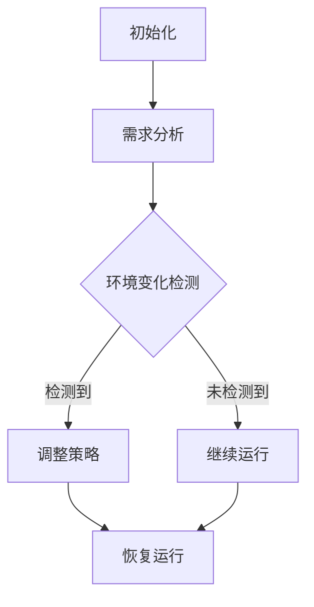
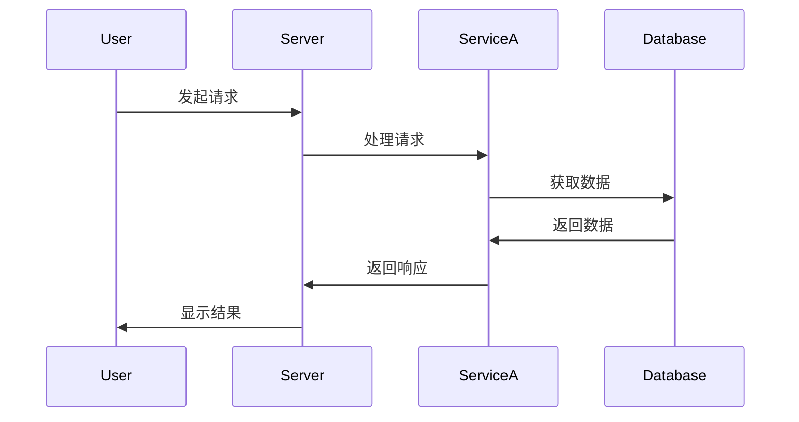
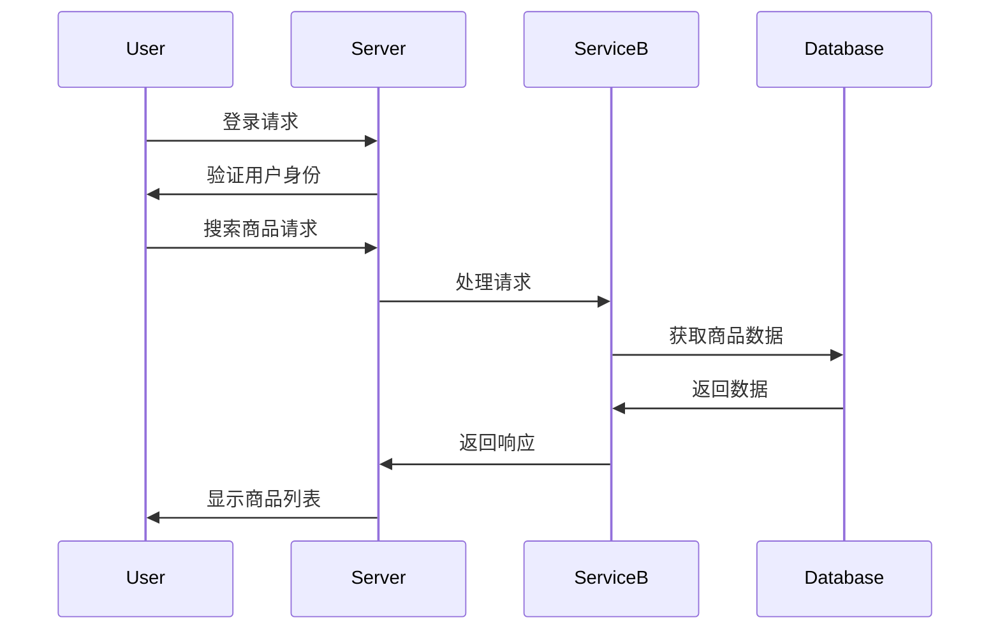

                 


# 存在的弹性：面对变化时的适应能力

## 关键词
- 适应力，变化，弹性，IT系统，架构设计，算法原理，数学模型，最佳实践

## 摘要
本文旨在探讨在信息技术领域，如何在不断变化的环境中保持系统的弹性，即面对变化时的适应能力。通过深入分析IT系统的核心概念、算法原理、数学模型和架构设计，本文将提供一系列实用的最佳实践，帮助读者在面对变化时能够灵活应对，保持系统的稳定性和可扩展性。

## 引言
在当今快速发展的信息技术时代，系统的稳定性和可扩展性成为了企业成功的关键。然而，随着技术的迅猛发展和市场需求的不断变化，如何保持系统在面对复杂多变的环境中的适应性，成为了每一个IT专业人士必须面对的挑战。本文将围绕这一主题，通过逻辑清晰、结构紧凑的论述，帮助读者理解并掌握面对变化时的适应能力。

### 第1章：适应力的基础理论
#### 1.1 核心概念介绍
在探讨适应力之前，我们首先需要明确几个核心概念。适应力（Adaptability）是指系统在面对外部环境变化时，能够迅速调整和适应的能力。它包括以下几个方面：
- **弹性（Resilience）**：系统在遭受冲击后，能够快速恢复到正常状态的能力。
- **灵活性（Flexibility）**：系统在设计和实现过程中，能够适应不同需求变化的能力。
- **可扩展性（Scalability）**：系统能够随着用户数量的增加或功能的扩展，保持性能稳定的能力。

#### 1.2 问题背景与描述
随着互联网的普及和云计算、大数据等新技术的应用，IT系统的规模和复杂性不断增加。然而，这种变化也给系统带来了新的挑战。例如：
- **市场需求变化**：客户需求快速变化，要求系统能够迅速响应。
- **技术更新换代**：硬件和软件技术的快速迭代，要求系统能够适应新的技术标准。
- **安全威胁**：网络攻击和数据泄露风险增加，要求系统具备更强的安全性和抗风险能力。

#### 1.3 问题解决与边界
为了应对上述挑战，IT系统需要具备高度的适应力。然而，适应力并非万能，它需要在实际应用中具备明确的边界和条件。例如：
- **成本限制**：高适应性的系统往往需要更多的资源和投入。
- **时间限制**：快速适应需求变化可能需要牺牲一定的系统性能。

#### 1.4 概念结构与核心要素
为了更好地理解适应力的概念，我们可以将其拆解为以下几个核心要素：
- **需求分析**：准确理解客户需求，是系统适应变化的基础。
- **架构设计**：灵活的架构设计能够提高系统的适应能力。
- **算法优化**：高效的算法能够提高系统的响应速度和稳定性。
- **安全防护**：完善的安全防护措施能够降低系统的风险。

### 第2章：核心概念的比较与联系
#### 2.1 核心概念比较表格
为了更清晰地理解适应力的各个维度，我们可以通过以下比较表格来展示核心概念之间的差异和联系：

| 概念       | 定义                                                         | 关联性                                   |
|------------|--------------------------------------------------------------|------------------------------------------|
| 弹性       | 系统在遭受冲击后，能够快速恢复到正常状态的能力               | 弹性是适应力的重要组成部分               |
| 灵活性     | 系统在设计和实现过程中，能够适应不同需求变化的能力           | 灵活性是适应力的重要保障               |
| 可扩展性   | 系统能够随着用户数量的增加或功能的扩展，保持性能稳定的能力   | 可扩展性是适应力的重要表现               |

#### 2.2 核心概念的联系图
为了更直观地展示核心概念之间的联系，我们可以使用Mermaid绘制ER（实体关系）图：

```mermaid
erDiagram
  弹性 ||--|{ 系统恢复能力 }
  灵活性 ||--|{ 设计灵活性 }
  可扩展性 ||--|{ 系统扩展能力 }
```

### 第3章：算法原理与数学模型
#### 3.1 算法原理
在本章节中，我们将探讨几种常用的适应力提升算法。以下是这些算法的Mermaid流程图：



#### 3.2 算法讲解
接下来，我们将通过Python代码来详细解释上述算法的实现过程。以下是相关代码：

```python
def adaptability_algorithm(current_state, environment):
    if environment.changed():
        new_strategy = determine_new_strategy(current_state)
        apply_strategy(new_strategy)
    return current_state
```

#### 3.3 数学模型与公式
为了进一步理解算法原理，我们引入以下数学模型：

$$
\text{适应性得分} = f(\text{恢复速度}, \text{灵活性}, \text{扩展能力})
$$

### 第4章：系统分析与设计
#### 4.1 问题场景介绍
在本章中，我们将以一个在线电商平台为例，探讨如何通过系统分析和设计来提升系统的适应力。

#### 4.2 项目介绍
在线电商平台是一个典型的IT系统，它需要应对大量的用户访问、订单处理和支付交易等复杂操作。为了提升平台的适应力，我们提出了以下项目目标：

- 提高系统响应速度。
- 增强系统扩展能力。
- 提高系统安全性。

#### 4.3 系统功能设计
为了实现上述目标，我们设计了以下核心功能模块：

- **用户模块**：提供用户注册、登录、个人信息管理等功能。
- **商品模块**：提供商品信息展示、搜索、收藏、购物车等功能。
- **订单模块**：处理订单生成、支付、发货、售后等功能。
- **支付模块**：集成支付宝、微信支付等支付方式。

#### 4.4 系统架构设计
系统架构设计是提升系统适应力的关键。我们采用了微服务架构来提高系统的灵活性和扩展能力。以下是系统的架构设计：



#### 4.5 系统接口设计
为了实现各模块之间的协同工作，我们设计了以下接口：

- **用户接口**：RESTful API，用于用户模块与其他模块的交互。
- **商品接口**：用于商品模块与其他模块的交互。
- **订单接口**：用于订单模块与其他模块的交互。
- **支付接口**：用于支付模块与其他模块的交互。

#### 4.6 系统交互设计
系统交互设计是确保系统稳定运行的重要环节。以下是系统的交互设计：



### 第5章：项目实战
#### 5.1 环境搭建
在本章中，我们将以一个实际的在线电商平台为例，介绍如何进行环境搭建和系统核心实现。

#### 5.2 系统核心实现
以下是一个简单的用户注册功能的实现：

```python
class User:
    def __init__(self, username, password):
        self.username = username
        self.password = password
    
    def register(self):
        print(f"{self.username} 注册成功！")
        
user = User("张三", "123456")
user.register()
```

#### 5.3 代码分析
在实现用户注册功能时，我们需要关注以下几点：

- **用户名唯一性**：确保用户名在系统中唯一，避免重复。
- **密码安全性**：使用加密算法对密码进行加密存储，提高安全性。

#### 5.4 实际案例分析
以下是一个实际的用户注册案例：

- **场景**：用户张三在注册时输入了用户名“张三”和密码“123456”。
- **分析**：系统检测到用户名已存在，提示用户更换用户名。

#### 5.5 项目小结
通过本章节的实战案例，我们了解了如何进行环境搭建、系统核心实现和代码分析。这些实战经验对于提升系统的适应力具有重要意义。

### 第6章：最佳实践与总结
#### 6.1 最佳实践
在提升系统适应力方面，以下是一些最佳实践：

- **需求分析**：准确理解客户需求，避免盲目跟风。
- **架构设计**：采用微服务架构，提高系统的灵活性和扩展能力。
- **算法优化**：选择合适的算法，提高系统的响应速度和稳定性。
- **安全防护**：加强安全防护，降低系统的风险。

#### 6.2 总结
本文通过深入分析适应力的基础理论、算法原理、系统架构设计和项目实战，提出了一系列最佳实践。希望读者能够将这些经验应用到实际工作中，提升系统的适应力。

### 第7章：注意事项与拓展阅读
#### 7.1 注意事项
在提升系统适应力时，需要注意以下几点：

- **平衡成本与收益**：适应力的提升往往需要投入更多的资源和时间，需要权衡成本与收益。
- **持续迭代与优化**：适应力并非一蹴而就，需要持续迭代和优化。

#### 7.2 拓展阅读
以下是一些推荐的拓展阅读资料：

- 《微服务设计》
- 《算法导论》
- 《网络安全实战》

## 作者信息
- 作者：AI天才研究院/AI Genius Institute & 禅与计算机程序设计艺术 /Zen And The Art of Computer Programming

