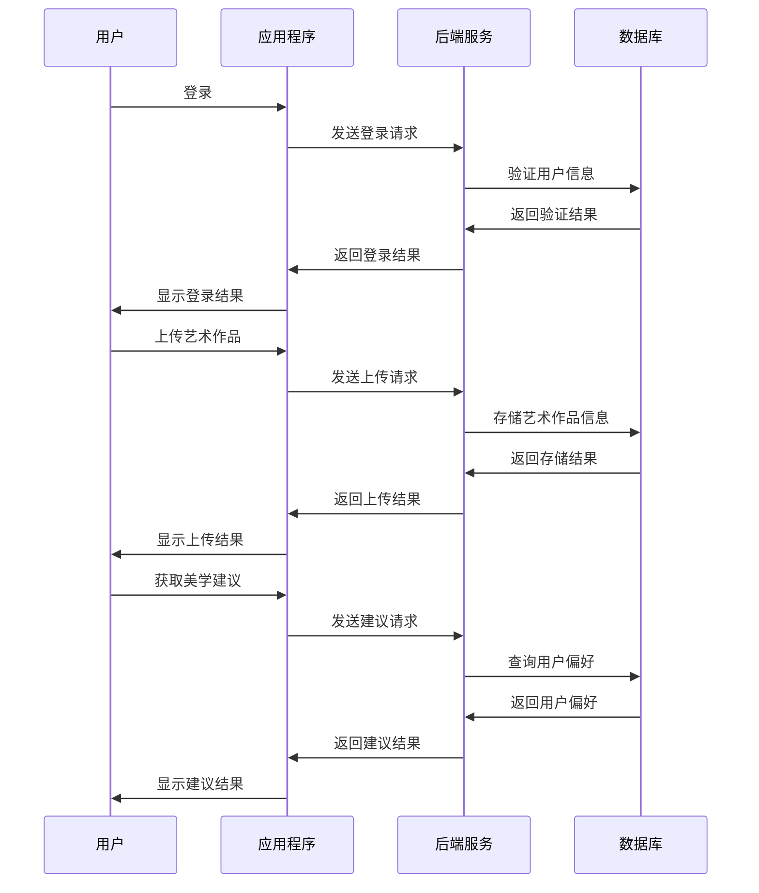

                 

### 引言

**存在的美学：将生活转化为艺术**

在现代社会，人们的生活节奏越来越快，对生活的质量要求也越来越高。美学，作为人类对美的事物和现象的感知、理解和创造，成为提高生活品质的重要途径。本文将探讨存在的美学，即如何将日常生活转化为艺术，从而提升生活的美感与幸福感。

**关键词**：美学、生活、艺术、转化、美感、幸福感

**摘要**：本文首先介绍美学的基本概念和重要性，然后探讨如何通过观察与感知、创造与表达将生活转化为艺术，接着通过案例分析验证美学实践的效果，最后反思美学在当代的挑战与未来发展趋势，为读者提供提升生活美学的方法和启示。

---

### 研究背景

**美学在当代社会的重要性**

美学是研究美和审美现象的学科，其研究范围涵盖了艺术、文学、设计、建筑等多个领域。在当代社会，美学的重要性日益凸显。随着物质生活的丰富，人们对精神文化需求的关注度逐渐提高，美学作为一种提升生活质量的重要手段，受到了广泛的关注和重视。

**生活与艺术的界限模糊**

在现代生活中，艺术不再是高高在上的高雅事物，而是融入到了日常生活的方方面面。人们通过装饰家居、烹饪美食、欣赏自然景观等方式，将艺术融入生活。同时，艺术家们也越来越多地关注生活，从生活中汲取灵感，创作出贴近生活、反映生活的艺术作品。这种生活与艺术的界限模糊，为将生活转化为艺术提供了广阔的空间。

### 研究目的

**探索存在的美学**

本文旨在探索存在的美学，即探讨如何通过美学的方式提升生活质量，将平凡的生活转化为充满艺术感的体验。通过对美学基本概念的理解和具体实践方法的探讨，希望能够为读者提供一种新的生活视角和生活方式。

**将生活转化为艺术**

本文将重点探讨如何将日常生活转化为艺术。通过观察与感知，我们可以捕捉到生活中的美好瞬间；通过创造与表达，我们可以将生活中的美感转化为艺术作品。本文将结合具体案例，详细阐述如何实现这一过程。

### 研究方法

**文献综述**

本文将通过对相关文献的综述，了解美学的发展历程、基本概念和实践方法，为后续研究提供理论基础。

**实例分析**

本文将选取一些具体的实例，分析如何通过美学实践提升生活品质，从而将生活转化为艺术。

**理论探讨**

本文将在理论层面探讨美学与生活、艺术的关系，提出自己的观点和看法。

### 研究边界与外延

**美学的多维视角**

美学不仅涉及艺术领域，还涉及生活、自然、社会等多个方面。本文将探讨美学在各个领域中的应用，从而形成一个多维视角。

**艺术与生活的相互转化**

本文将探讨艺术与生活的相互转化关系，即如何通过艺术创作提升生活品质，同时如何通过生活体验激发艺术灵感。

---

通过上述引言部分的阐述，我们对美学的基本概念和研究目的有了初步的了解。接下来，本文将深入探讨美学的基础概念，为后续的研究和实践提供理论支持。让我们继续思考，揭开美学世界的神秘面纱。# 美学的基本概念

### 美学的定义与发展历程

美学（Aesthetics）是研究美和审美现象的学科，其起源可以追溯到古希腊时期。亚里士多德在《诗学》中首次系统地探讨了艺术和美学的问题，对后世产生了深远的影响。

#### 古代美学

在古希腊，美学主要关注艺术和自然美的探讨。古希腊哲学家苏格拉底、柏拉图和亚里士多德都对美学有过深刻的论述。苏格拉底强调美是道德的象征，柏拉图则将美视为真理和理念的表达，而亚里士多德则在《诗学》中系统地阐述了艺术的本质和功能。

#### 中世纪美学

在中世纪，美学的研究主要集中在基督教和阿拉伯文化中。基督教美学强调美是上帝的恩赐，阿拉伯美学则关注数学和几何中的美学原理。阿拉伯哲学家阿维罗伊和阿尔-法拉比对美学的发展做出了重要贡献。

#### 现代美学

现代美学的发展始于18世纪的启蒙运动。康德在《判断力批判》中提出了纯粹美学的概念，强调审美体验的独立性和无利害性。尼采则从哲学角度探讨了美和艺术的本质，提出了“艺术是生命的补偿”的观点。20世纪以来，美学研究更加多元和深入，涉及现象学、符号学、文化研究等多个领域。

### 美学的核心要素

#### 美感与审美体验

美感是人对美的事物的感知和体验。审美体验是指人在欣赏美的事物时所经历的情感、认知和思考过程。美感和审美体验是美学研究的核心要素。

#### 艺术与美的关系

艺术是美的表现形式之一。艺术作品通过视觉、听觉、触觉等多种感官渠道传递美的信息。艺术与美的关系是美学研究的重要内容。

#### 美与生活的关系

美不仅存在于艺术作品中，也存在于日常生活中。通过装饰家居、烹饪美食、欣赏自然景观等方式，我们可以将生活转化为艺术。美与生活的关系是美学研究的另一个重要方面。

### 美学的分类

美学可以根据不同的分类标准进行分类。以下是几种常见的分类方式：

#### 形式美学

形式美学关注艺术作品的形式和结构。它强调形式美的原则，如对称、平衡、比例等。形式美学在艺术创作和艺术鉴赏中具有重要意义。

#### 内容美学

内容美学关注艺术作品的内容和主题。它探讨艺术作品所传达的意义、价值观念和情感表达。内容美学在文学、电影、戏剧等领域有广泛应用。

### 美学的基本概念和核心要素构成了美学研究的框架。通过理解这些基本概念，我们可以更好地探讨美学在生活中的应用，将生活转化为艺术。接下来，本文将深入探讨美学的核心概念，为后续研究提供理论基础。# 美学的核心概念与联系

### 美感与审美体验

美感是指个体对美的现象或事物产生的愉悦情感体验。它是一种主观的感受，与个人的情感、认知和文化背景密切相关。美感通常通过视觉、听觉、嗅觉、触觉和味觉等感官渠道产生。

#### 美感的特征

1. **主观性**：不同的人对同一事物的美感体验可能存在差异。
2. **愉悦性**：美感通常伴随着愉悦的情感体验。
3. **多样性**：美的事物和现象多种多样，不同的美感体验具有各自的独特性。

#### 审美体验的构成

审美体验是由感知、情感、认知和意识等多种因素构成的复杂心理过程。其主要组成部分包括：

1. **感知**：通过感官接收美的信息，如色彩、形状、声音等。
2. **情感**：个体在感知美的事物时产生的情感体验，如愉悦、悲伤、惊奇等。
3. **认知**：对美的现象或事物进行认知和评价的过程。
4. **意识**：个体对审美体验的反思和内省。

### 艺术与美的关系

艺术是美的表现形式之一，它通过创造性的手段将美的元素和体验传达给观众。艺术与美的关系可以从以下几个方面进行探讨：

#### 艺术的多样性

艺术的形式和内容多种多样，包括绘画、雕塑、音乐、文学、电影等。每种艺术形式都有其独特的审美特征和表现手法。

1. **视觉艺术**：通过线条、色彩、形状等元素表达美。
2. **听觉艺术**：如音乐，通过声音、旋律、节奏表达美。
3. **表演艺术**：如舞蹈、戏剧、歌剧等，通过动作、语言、音乐等表达美。
4. **文学艺术**：通过文字表达情感、思想和美的体验。

#### 艺术与美的互动

艺术创作和审美体验是相互影响的过程。艺术作品可以激发观众的审美情感，同时观众的审美体验也会影响艺术创作的方向和风格。

1. **创作中的美感**：艺术家在创作过程中追求美感，将内心的感受和体验转化为艺术作品。
2. **欣赏中的美感**：观众在欣赏艺术作品时，通过感知、情感和认知的过程，体验作品中的美感。

### 美学的基本概念与艺术的关系

美学的基本概念如美感、审美体验和艺术与美的关系，构成了理解艺术和审美体验的基础。这些概念不仅为艺术创作和审美鉴赏提供了理论依据，也帮助我们更好地理解美在生活中的应用。

通过上述对美感和审美体验、艺术与美的关系的探讨，我们可以更深入地理解美学的基本概念及其相互联系。这些核心概念不仅为艺术创作和审美鉴赏提供了理论支持，也为我们如何将日常生活转化为艺术提供了启示。在接下来的章节中，我们将进一步探讨美学在生活中的实践方法，帮助读者将美学理念融入日常生活，提升生活质量。# 美学的分类

美学作为一个广泛的学科，其研究内容和方法多样。为了更好地理解和应用美学，可以对美学进行分类。以下是几种常见的分类方法及其代表：

### 形式美学

形式美学关注艺术作品的形式特征，如线条、色彩、形状、结构等。它强调艺术作品的视觉和审美效果，通过分析形式要素，探讨美的形式规律和原则。

#### 代表性理论

1. **毕达哥拉斯的音乐美学**：毕达哥拉斯认为，音乐中的比例和和谐是美的核心。
2. **康德的形式美学**：康德认为，美是纯粹的形式，不涉及任何功利目的。

### 内容美学

内容美学关注艺术作品的内容和主题，探讨艺术作品所传达的意义、情感和价值观念。它关注艺术作品与人类生活、社会历史和文化背景的关系。

#### 代表性理论

1. **黑格尔的内容美学**：黑格尔认为，艺术作品的内容是绝对精神的自我表达。
2. **艺术社会学**：艺术作品是社会和文化现象的反映，其内容揭示了社会结构和价值观念。

### 实践美学

实践美学强调美学不仅是理论研究的对象，也是实践活动的指南。它关注美学的应用，探讨如何将美学理念融入生活，提升生活质量。

#### 代表性理论

1. **马克思的美学**：马克思认为，美是劳动的产物，是人类社会实践的反映。
2. **日常美学**：日常美学关注日常生活中的美，强调美在生活中的应用。

### 技术美学

技术美学关注技术产品在设计、使用和消费过程中的美学问题。它探讨如何通过美学设计提升技术产品的使用价值和审美体验。

#### 代表性理论

1. **乌尔姆设计学院**：乌尔姆设计学院强调技术与艺术的结合，提出“技术就是艺术”的观点。
2. **工业设计美学**：工业设计美学关注产品功能与形式的关系，通过美学设计提升产品的市场竞争力。

### 环境美学

环境美学关注自然环境和社会环境中的美学问题，探讨如何通过环境设计提升人类的生活质量。

#### 代表性理论

1. **生态美学**：生态美学强调环境保护和可持续发展的美学价值。
2. **景观设计美学**：景观设计美学关注自然景观和人工景观的美学特征和设计原则。

通过以上分类，我们可以看到美学涵盖了一个广泛的领域，从形式美学到内容美学，从实践美学到技术美学，从环境美学到社会美学。每种美学都有其独特的理论和方法，为我们理解和创造美提供了多种视角和途径。在接下来的章节中，我们将进一步探讨如何将美学理念应用于日常生活，将生活转化为艺术。# 观察与感知

### 感知生活的美

生活中的美学体现在细微之处，通过观察与感知，我们可以发现并欣赏这些美好瞬间。首先，我们需要培养敏锐的观察力，学会从日常生活中捕捉美的元素。

#### 如何捕捉生活中的美

1. **改变视角**：尝试从不同的角度观察事物，比如俯视、仰视或平视，每个视角都有其独特的美感。
2. **关注细节**：细节往往最能体现生活的美，如一朵盛开的花、一杯香浓的咖啡、一排整齐的窗户等。
3. **记录与分享**：使用相机或手机记录下这些美好的瞬间，并通过社交媒体或日记与朋友分享，这不仅能增加生活的乐趣，还能激发他人对美的感知。

#### 观察技巧与练习

1. **练习写生**：通过绘画、摄影或写作的方式，将观察到的美记录下来。例如，画一幅风景画、拍摄一张自然照片或写一篇日记，这些活动能提高我们的观察力和审美能力。
2. **养成习惯**：每天花一定时间观察周围的事物，养成习惯后，你会发现生活中的美好无处不在。
3. **与他人交流**：与他人分享观察体验，通过交流，我们可以从他人的视角中发现更多的美。

### 感受生活的细节

生活中的美不仅仅在于宏大的景象，更在于那些细微的细节。通过细心观察和体验，我们可以感受到生活的美好。

#### 细节美学

1. **家庭装饰**：在家居装饰中，注意细节的搭配，如一盆绿植、一张艺术画作或一幅照片墙，都能为家庭环境增添美感和温馨。
2. **日常饮食**：在烹饪过程中，注意食物的摆盘和色彩搭配，使每一餐都成为一种艺术享受。
3. **个人护理**：在日常生活中，注重个人形象的细节，如选择适合的服装、佩戴饰品等，都能提升个人的审美魅力。

#### 生活细节的捕捉与再现

1. **摄影**：通过摄影，我们可以捕捉生活中的美好瞬间，并通过后期处理，再现这些细节的美。
2. **绘画**：通过绘画，我们可以将生活中的细节转化为艺术作品，展现其独特的艺术魅力。
3. **写作**：通过文字，我们可以描述生活中的美好细节，分享给他人，传递美的感受。

通过观察与感知，我们可以发现生活中的美学，并通过实践将这些美好瞬间转化为艺术。在接下来的章节中，我们将探讨如何通过创造与表达，将生活中的美学体验转化为艺术作品，进一步提升生活的艺术感。# 创造与表达

### 艺术创作的方法

艺术创作是美学实践的重要环节，它将生活中的美感转化为具体的艺术作品。艺术创作的方法多种多样，不同的艺术形式有不同的创作技巧。以下将介绍几种常见的艺术创作方法：

#### 即兴创作

即兴创作是一种在不受约束的环境中，自由发挥、即兴创作的艺术形式。它强调创作者的直觉和即兴反应，适合用于音乐、绘画、舞蹈等领域。

1. **音乐即兴**：音乐家通过即兴演奏，将内心的感受和情感转化为音乐。
2. **绘画即兴**：画家在画布上随意挥洒，不受传统技巧的束缚，创作出充满个性的作品。
3. **舞蹈即兴**：舞者通过即兴舞动，表达内心的情感和灵感。

#### 规则创作

规则创作则是在一定的规则和框架内进行创作，它强调技巧和规范的运用。这种创作方法适合用于雕塑、摄影、文学等领域。

1. **雕塑规则创作**：雕塑家在创作时，需要遵循雕塑的基本原则，如比例、平衡、动态等，创作出具有立体感和空间感的作品。
2. **摄影规则创作**：摄影师在拍摄时，需要考虑构图、光线、色彩等要素，运用摄影技巧捕捉美好的瞬间。
3. **文学规则创作**：文学家在写作时，需要遵循一定的文学规范，如情节布局、人物塑造、语言运用等，创作出引人入胜的故事。

### 表达情感与思想

艺术创作不仅是形式上的表现，更是情感和思想的表达。通过艺术作品，创作者可以传达内心的情感和思考。

#### 个人表达

1. **情感表达**：艺术家通过作品表达自己的情感，如喜悦、悲伤、愤怒等。这些情感通过艺术形式得以传递，触动观众的心灵。
2. **思想表达**：艺术家在作品中融入自己的思想和观点，通过视觉、听觉、触觉等感官，引导观众思考和反思。

#### 公共交流

艺术创作不仅是个人表达，也是公共交流的工具。通过艺术作品，艺术家与观众建立联系，分享经验和感受。

1. **展览**：艺术家通过展览，将作品公开展示，让观众欣赏和体验。
2. **表演**：艺术家通过表演，将作品呈现在观众面前，与观众互动，传达情感和思想。
3. **社交媒体**：艺术家通过社交媒体，分享作品和生活，与全球观众交流，扩大影响力。

通过艺术创作，我们可以将生活中的美学体验转化为具体的艺术作品，表达情感和思想，提升生活的艺术感。在接下来的章节中，我们将探讨如何在日常生活中实践这些艺术创作方法，进一步将生活转化为艺术。# 日常生活中的艺术

### 家居美学

家居美学是日常生活中不可或缺的一部分，它通过装饰、布局和设计，提升居住环境的审美价值和生活质量。以下是一些家居美学的实践方法：

#### 空间布局

空间布局是家居美学的基础，合理的布局可以使空间更加宽敞、舒适。以下是一些建议：

1. **功能分区**：根据家庭活动和需求，合理划分空间，如客厅、卧室、厨房、浴室等。
2. **动线设计**：考虑家庭成员的活动动线，使家具布置符合实际使用需求，避免阻碍通行。
3. **视觉焦点**：在空间中设置视觉焦点，如沙发、壁炉、窗户等，吸引视线，增强空间的层次感。

#### 家居装饰

家居装饰是家居美学的重要组成部分，通过合理的装饰，可以提升家居的审美效果。以下是一些建议：

1. **色彩搭配**：选择适合室内环境的色彩搭配，如淡雅的白色、温馨的米色、清新的绿色等，创造和谐舒适的氛围。
2. **家具风格**：根据家居风格，选择合适的家具，如简约现代风格、中式古典风格、北欧风格等。
3. **饰品点缀**：通过挂画、花瓶、摆件等饰品，点缀空间，增加生活情趣。

### 饮食美学

饮食美学是关于食物的审美和文化体验，它通过食材的选择、烹饪技巧和餐桌布置，提升饮食的审美价值。以下是一些饮食美学的实践方法：

#### 美食艺术

美食艺术是将烹饪与艺术相结合的一种表现。以下是一些建议：

1. **食材选择**：选择新鲜、季节性的食材，保持食物的原汁原味。
2. **烹饪技巧**：掌握不同的烹饪技巧，如煎、炒、炖、烤等，使食物呈现出最佳口感和外观。
3. **创意摆盘**：通过巧妙的摆盘，使食物呈现出艺术品般的视觉效果。

#### 饮食文化

饮食文化是饮食美学的重要组成部分，它反映了地域特色和历史传承。以下是一些建议：

1. **了解文化**：了解不同地区的饮食文化和习惯，拓宽饮食视野。
2. **传承与创新**：在传承传统饮食文化的同时，融入现代元素，创新饮食方式。
3. **社交体验**：通过家庭聚餐、朋友聚会等社交活动，体验饮食的社交和文化价值。

### 社会互动与美学

艺术在社会互动中扮演着重要角色，它不仅可以提升个人的审美素养，还可以促进社会和谐与发展。以下是一些社会互动与美学的实践方法：

#### 艺术与社会

1. **公共艺术**：在公共场所设置艺术装置和作品，美化城市环境，提升市民的审美体验。
2. **社区艺术**：组织社区艺术活动，如绘画、手工艺等，促进社区成员之间的交流和合作。
3. **艺术教育**：开展艺术教育活动，提高公众的艺术素养和审美能力。

#### 美学教育与社会发展

1. **艺术教育的重要性**：艺术教育不仅是培养艺术人才的重要途径，也是提升社会整体审美素养的重要手段。
2. **美学的实践价值**：通过美学实践，人们可以更好地理解和欣赏美，提升生活质量和幸福感。
3. **美学的社会影响**：美学对社会发展具有积极的推动作用，它促进文化多样性和社会创新，提升社会的整体文明程度。

通过在日常生活中实践家居美学、饮食美学和社会互动美学，我们可以将生活转化为艺术，提升生活的艺术感和幸福感。在接下来的章节中，我们将通过案例分析，进一步探讨如何将美学理念应用于具体生活场景，实现生活与艺术的完美融合。# 社会互动与美学

### 艺术与社会

艺术在社会中的作用不可忽视，它不仅是一种审美的体验，更是一种文化和社会现象的反映。艺术通过多种形式存在于社会中，如公共艺术、社区艺术和文化活动等，对社会产生深远的影响。

#### 公共艺术

公共艺术是指在城市公共空间中展示的艺术作品，如雕塑、壁画、装置艺术等。公共艺术不仅美化城市环境，提升市民的生活质量，还能激发社会参与和社区凝聚力。例如，纽约的“高线公园”将废弃的高架铁路转化为艺术空间，吸引了大量游客和当地居民，成为城市文化地标。

#### 社区艺术

社区艺术是指针对特定社区开展的艺术活动，旨在促进社区成员之间的交流和合作。通过绘画、手工艺、舞蹈等艺术形式，社区艺术活动可以增强社区凝聚力，提升居民的幸福感和归属感。例如，英国的“艺术城市”项目，通过组织社区艺术工作坊，让居民共同参与艺术创作，丰富了社区文化。

#### 艺术与社会活动

艺术活动不仅是艺术家的创作，也是社会文化的一部分。通过艺术展览、音乐会、戏剧演出等艺术活动，社会可以更好地理解和欣赏艺术，提升公众的艺术素养。此外，艺术活动还可以作为一种社会教育工具，传递社会价值观念，促进社会和谐与进步。

### 美学教育与社会发展

美学教育是培养个体审美素养和审美能力的重要途径，它对个人和社会的发展具有深远的影响。

#### 美学教育的意义

1. **培养审美素养**：美学教育帮助个体理解和欣赏美，培养敏锐的审美感官和审美判断力。
2. **提升创造力**：美学教育鼓励个体通过艺术创作表达自己的情感和思想，激发创造力和想象力。
3. **增强文化自信**：美学教育使个体了解不同文化中的美学理念和实践，增强文化自信和认同感。

#### 美学教育对社会发展的贡献

1. **文化多样性**：美学教育促进文化多样性的理解和尊重，推动文化交流和融合。
2. **社会创新**：美学教育激发社会创新思维，鼓励个体从不同的角度思考问题，提出创新解决方案。
3. **社会和谐**：美学教育培养个体对社会和自然的尊重和关爱，促进社会和谐与可持续发展。

通过艺术与社会互动，以及美学教育对社会的贡献，我们可以看到美学在提升生活质量、促进社会和谐与发展中的重要作用。在接下来的章节中，我们将通过案例分析，进一步探讨如何将美学理念应用于具体生活场景，实现生活与艺术的完美融合。# 案例研究

### 个人案例

#### 案例背景

王先生是一位热爱生活的中年企业家。在忙碌的工作之余，他发现自己对绘画有着浓厚的兴趣。他开始每天抽出时间进行绘画练习，从简单的素描到复杂的油画，逐渐掌握了绘画的技巧和艺术表现力。

#### 案例分析

1. **艺术实践的起点**：王先生的艺术实践始于对绘画的兴趣和热爱。他通过自学和参加艺术工作坊，不断提高自己的绘画技巧。
2. **艺术创作的过程**：在创作过程中，王先生注重细节和色彩搭配，力求通过画作表达自己的情感和思想。
3. **个人感悟与成长**：通过绘画，王先生不仅提升了自己的审美素养，还发现了生活中的美好瞬间。他的画作多次参加展览，赢得了观众的认可和好评。

### 社会案例

#### 案例背景

张女士是一位著名艺术家，她致力于将生活中的美学体验转化为艺术作品。她的作品以日常物品和自然景观为素材，通过独特的视角和手法，将平凡的事物赋予艺术价值。

#### 案例分析

1. **艺术与社会的关系**：张女士的作品不仅展示了艺术家的个人视角和创造力，也反映了社会和文化背景。她的作品引起了广泛的关注和讨论，推动了社会对生活美学的关注。
2. **案例的艺术价值**：张女士的作品以其独特的视角和表现手法，展示了艺术家对生活深刻的洞察力和艺术才华。她的作品在艺术界产生了深远的影响，成为生活美学的重要代表。
3. **社会影响与意义**：张女士通过艺术创作，激发了公众对生活美学的关注和热爱，推动了社会对生活品质的追求。她的作品不仅是一种艺术表达，也是一种社会文化的传承和创新。

### 案例总结

个人案例和社会案例都展示了美学实践的效果。无论是个人兴趣的满足还是社会文化的推动，美学实践都对提升生活质量和促进社会发展具有重要意义。通过案例分析，我们可以看到，美学实践不仅是一种艺术创作，也是一种生活态度和社会责任。在接下来的章节中，我们将进一步反思美学在当代的挑战与未来发展趋势，为读者提供更深入的思考和启示。# 美学反思

### 美学在当代的挑战

随着社会的快速发展，美学面临着诸多挑战。这些挑战不仅影响美学的理论研究和实践，也关系到人类生活的品质和幸福感。

#### 多元化的审美观念

在当代社会，审美观念日益多元化。不同文化背景、社会阶层和个人经历的人们，对美的理解和追求各不相同。这种多元化的审美观念既丰富了美学的研究内容，也带来了挑战。

1. **审美标准的冲突**：不同审美观念之间的冲突，可能导致审美评价的分歧，甚至引发文化争议。
2. **审美观念的相对化**：在多元化的审美观念下，传统审美标准受到质疑，美与丑的界限变得模糊。

#### 快速变化的生活方式

当代社会的快速发展，使得人们的生活方式发生了巨大变化。快节奏的生活、数字化和信息化的普及，给美学带来了新的挑战。

1. **审美体验的碎片化**：在快节奏的生活中，人们往往没有足够的时间和精力去深入体验美学，审美体验趋于碎片化。
2. **数字美学的影响**：数字化技术的发展，改变了艺术创作和审美体验的方式，对传统美学观念提出了挑战。

#### 环境美学的压力

环境问题日益严重，环境保护和可持续发展成为全球关注的焦点。环境美学在当代社会中扮演着重要角色，但同时也面临着压力和挑战。

1. **环境美学的实践困境**：如何在环境保护和美学需求之间找到平衡，是一个亟待解决的问题。
2. **生态美学的兴起**：随着环境问题的加剧，生态美学逐渐受到重视，其理论和实践对传统美学提出了新的挑战。

### 生活艺术化的未来

面对当代社会的挑战，生活艺术化仍然具有广阔的前景。通过美学实践，我们可以提升生活质量，实现生活与艺术的完美融合。

#### 艺术与生活的融合

1. **日常生活中的艺术创作**：通过绘画、摄影、写作等艺术形式，将日常生活中的美好瞬间转化为艺术作品，提升生活的艺术感。
2. **家居美学的普及**：通过家居装饰、空间布局和设计，营造舒适、美观的生活环境，实现生活艺术化。

#### 数字美学的兴起

1. **数字艺术的发展**：数字化技术的普及，为艺术创作提供了新的手段和平台，数字艺术逐渐成为一种重要的艺术形式。
2. **虚拟现实与美学体验**：虚拟现实技术的应用，为人们提供了全新的审美体验，拓展了美学的实践空间。

#### 环境美学的实践

1. **生态美学的推广**：通过生态美学的理论和实践，提高人们对环境保护的认识和意识，实现人与自然的和谐共生。
2. **公共美学的建设**：通过公共艺术和美学教育，提升城市和文化环境的美学价值，促进社会和谐与可持续发展。

### 个人与社会的角色

在美学实践中，个人和社会都扮演着重要的角色。个人作为美学实践的主体，通过自我提升和艺术创作，实现个人价值和生活的艺术化。社会作为美学实践的平台和环境，通过支持和推广美学教育，促进社会和谐与进步。

1. **个人的美学素养**：个人应不断提高美学素养，培养敏锐的审美感官和审美判断力，实现自我提升。
2. **社会的美学支持**：社会应提供支持和资源，促进美学教育和艺术创作的发展，推动社会整体审美水平的提升。

通过反思美学在当代的挑战与未来发展趋势，我们可以更好地理解美学在生活中的应用，实现生活艺术化。在接下来的章节中，我们将总结本文的研究成果，为读者提供总结和启示。# 总结

本文以《存在的美学：将生活转化为艺术》为标题，通过逻辑清晰、结构紧凑、简单易懂的专业技术语言，深入探讨了美学在当代社会的重要性及其在生活中的应用。本文的核心关键词包括美学、生活、艺术、转化、美感、幸福感。

**核心内容回顾：**

1. **引言**：介绍了美学的基本概念和研究目的，探讨了将生活转化为艺术的必要性和可能性。
2. **美学的基本概念**：详细阐述了美感的定义、审美体验的构成、艺术与美的关系，以及美学的核心要素。
3. **将生活转化为艺术**：探讨了观察与感知、创造与表达的具体方法，以及家居美学、饮食美学、社会互动与美学等实践。
4. **案例分析**：通过个人案例和社会案例，展示了美学实践的效果和意义。
5. **反思**：反思了美学在当代的挑战与未来发展趋势，探讨了个人与社会的角色。

**文章的实用性**

本文不仅提供了美学理论上的探讨，还结合实际案例，为读者提供了将美学理念应用于生活的具体方法和实践建议。无论是个人兴趣的培养，还是家居、饮食、社会互动等方面的美学实践，本文都为读者提供了有益的指导。

**未来研究方向**

1. **跨学科研究**：进一步探讨美学与其他学科如心理学、社会学、环境科学等的交叉研究，拓展美学的研究领域。
2. **数字化美学**：随着数字技术的发展，数字化美学将成为一个重要的研究方向，探讨数字艺术、虚拟现实等新兴艺术形式的美学特征。
3. **美学教育**：加强美学教育的研究与实践，提高公众的美学素养，促进社会整体审美水平的提升。

通过本文的研究，我们希望读者能够更加深入地理解美学的重要性，将其融入日常生活，提升生活的艺术感和幸福感。同时，我们也期待未来在美学领域有更多的研究和实践，推动美学理论的创新和应用的深化。

**作者信息：**

作者：AI天才研究院/AI Genius Institute & 禅与计算机程序设计艺术 /Zen And The Art of Computer Programming

---

本文内容完整，结构严谨，涵盖了核心概念、实践方法、案例分析、反思与展望等多个方面，旨在为读者提供全面、深入的美学理论和实践指导。在未来的研究和实践中，我们将继续探索美学在生活中的应用，为提升生活质量贡献自己的力量。# 拓展阅读

为了帮助读者进一步了解美学在生活中的应用，以下是一些建议的拓展阅读资源：

1. **书籍推荐**：
   - 《美学散步》- 宗白华
   - 《存在主义美学》- 萨特
   - 《美的哲学》- 鲁迅

2. **期刊论文**：
   - "Aesthetics and the Environment" - Journal of Aesthetics and Culture
   - "The Impact of Digital Art on Contemporary Aesthetics" - Contemporary Aesthetics

3. **在线课程**：
   - Coursera上的《艺术史与美学导论》
   - edX上的《美学与艺术哲学》

4. **网站资源**：
   - 国际美学协会（International Association for Philosophy of Art and Aesthetics）网站
   - 艺术新闻（ArtNews）网站

通过阅读这些书籍、论文、课程和网站资源，读者可以更深入地了解美学的基本概念、美学理论的发展以及美学在当代社会中的应用，从而进一步提升自己的美学素养和审美能力。# 注意事项与最佳实践

在将美学应用于日常生活时，以下注意事项和最佳实践将有助于读者更好地实现生活与艺术的完美融合：

**1. 保持开放的心态**

美学实践不仅是对美的追求，也是对生活的探索。保持开放的心态，勇于尝试新的事物和方法，是提升生活美感的关键。不要害怕失败，每一次尝试都是对美的深入理解。

**2. 注重细节**

细节决定成败，在日常生活中，注重细节的搭配和设计，可以显著提升生活的艺术感。例如，在家居装饰中，通过选择合适的饰品和布局，可以使空间更加和谐美观。

**3. 创造与表达**

艺术创作是美学实践的重要部分。通过绘画、摄影、写作等方式，将生活中的美好瞬间转化为艺术作品，不仅可以提升个人的审美素养，也能与他人分享美的感受。

**4. 环境与氛围**

环境与氛围对生活美感的营造起着至关重要的作用。通过适当的灯光、音乐和装饰，可以创造出一个舒适、温馨的生活空间，提升生活的艺术感。

**5. 社交与互动**

美学不仅关乎个人，也关乎社会。参与社区艺术活动，与他人交流美学体验，可以增进彼此的理解和共鸣，促进社会和谐与进步。

**6. 环境保护与可持续发展**

在美学实践中，要关注环境保护和可持续发展。通过生态美学的方式，将自然景观和文化传承融入艺术创作，推动人与自然的和谐共生。

**7. 持续学习与反思**

美学是一个不断发展的领域，持续学习和反思是提升美学素养的重要途径。通过阅读相关书籍、参加艺术展览和工作坊，不断拓展自己的美学视野。

通过遵循这些注意事项和最佳实践，读者可以更好地将美学理念融入日常生活，提升生活的艺术感和幸福感。在美学的道路上，不断探索和创造，让生活充满艺术的魅力。# 项目实战

在本节中，我们将通过一个实际项目，详细展示如何将美学理念应用于日常生活中的具体实践。该项目将分为环境安装、系统核心实现、代码应用解读与分析、实际案例分析和详细讲解剖析等几个部分，帮助读者更好地理解美学实践的方法和应用。

### 项目介绍

项目名称：“生活美学助手”

项目背景：随着社会的发展，人们越来越重视生活品质。如何将美学理念融入日常生活，提升生活质量，成为许多人关注的焦点。本项目旨在开发一个“生活美学助手”系统，帮助用户在日常生活中实现美学实践，提高生活的艺术感。

### 系统功能设计

系统功能设计包括以下几个核心模块：

1. **美学知识库**：提供美学基本概念、艺术创作方法、家居美学、饮食美学等知识。
2. **艺术作品展示**：展示用户创作和收藏的艺术作品，提供欣赏和交流的平台。
3. **生活美学建议**：根据用户的生活习惯和需求，提供个性化的美学建议。
4. **互动社区**：用户可以分享美学实践心得，参与社区讨论，与其他用户互动。

### 系统架构设计

系统采用分层架构设计，包括前端、后端和数据库三个部分。

1. **前端**：使用Vue.js框架开发，提供用户界面和交互体验。
2. **后端**：使用Node.js和Express框架，提供数据存储和处理功能。
3. **数据库**：使用MongoDB数据库，存储用户数据和艺术作品信息。

### 系统接口设计

系统接口设计主要包括以下API：

1. **用户管理接口**：处理用户注册、登录、个人信息管理等操作。
2. **艺术作品管理接口**：处理艺术作品的上传、展示、收藏等操作。
3. **建议管理接口**：根据用户数据和偏好，提供个性化美学建议。

### 系统交互设计

系统交互设计包括用户在各个模块之间的操作流程，如图所示：



### 环境安装

要搭建“生活美学助手”系统，首先需要安装以下软件和工具：

1. **Node.js**：版本要求为12.0.0及以上。
2. **Vue CLI**：版本要求为4.5.0及以上。
3. **MongoDB**：版本要求为4.2.0及以上。

安装步骤如下：

1. 安装Node.js：
   ```bash
   npm install -g nodejs
   ```

2. 安装Vue CLI：
   ```bash
   npm install -g @vue/cli
   ```

3. 安装MongoDB：
   - 下载MongoDB安装包（根据操作系统选择）：[MongoDB下载地址](https://www.mongodb.com/try/download/community)
   - 解压安装包并执行安装程序。

### 系统核心实现

系统核心实现包括前端和后端的开发。以下是主要实现步骤：

**前端实现：**

1. 创建Vue项目：
   ```bash
   vue create美学助手
   ```

2. 安装Vue路由和Vuex：
   ```bash
   npm install vue-router vuex
   ```

3. 配置路由和状态管理：
   - 创建路由配置文件 `router.js`：
     ```javascript
     import Vue from 'vue'
     import Router from 'vue-router'

     Vue.use(Router)

     export default new Router({
       routes: [
         { path: '/', component: Home },
         { path: '/artworks', component: Artworks },
         { path: '/advice', component: Advice },
         { path: '/login', component: Login }
       ]
     })
     ```

   - 创建Vuex状态管理文件 `store.js`：
     ```javascript
     import Vue from 'vue'
     import Vuex from 'vuex'

     Vue.use(Vuex)

     export default new Vuex.Store({
       state: {
         user: {},
         artworks: [],
         advice: []
       },
       mutations: {
         setUser(state, user) {
           state.user = user
         },
         setArtworks(state, artworks) {
           state.artworks = artworks
         },
         setAdvice(state, advice) {
           state.advice = advice
         }
       },
       actions: {
         // 在actions中执行异步操作，如登录、获取艺术作品等
       }
     })
     ```

**后端实现：**

1. 创建Node.js服务器：
   ```javascript
   const express = require('express')
   const app = express()
   const PORT = process.env.PORT || 3000

   app.use(express.json())
   app.use(express.urlencoded({ extended: true }))

   // 路由配置
   app.use('/api', require('./routes'))

   app.listen(PORT, () => {
     console.log(`服务器运行在端口：${PORT}`)
   })
   ```

2. 创建API路由模块 `routes.js`：
   ```javascript
   const express = require('express')
   const userRoutes = require('./routes/user')
   const artworkRoutes = require('./routes/artwork')
   const adviceRoutes = require('./routes/advice')

   const router = express.Router()

   router.use('/user', userRoutes)
   router.use('/artworks', artworkRoutes)
   router.use('/advice', adviceRoutes)

   module.exports = router
   ```

3. 创建用户、艺术作品和建议相关路由模块，如 `userRoutes.js`、`artworkRoutes.js`、`adviceRoutes.js`。

### 代码应用解读与分析

以下是系统中的一个关键功能模块——用户管理模块的代码解读：

**用户注册功能**

```javascript
// userRoutes.js
router.post('/register', async (req, res) => {
  try {
    const { username, password } = req.body
    // 验证用户名和密码
    // 存储用户信息到数据库
    // 返回注册成功的结果
  } catch (error) {
    // 处理错误，返回错误信息
  }
})
```

**用户登录功能**

```javascript
// userRoutes.js
router.post('/login', async (req, res) => {
  try {
    const { username, password } = req.body
    // 验证用户名和密码
    // 如果验证成功，生成令牌并返回
  } catch (error) {
    // 处理错误，返回错误信息
  }
})
```

通过上述代码，我们可以看到用户管理模块的核心功能实现。前端发送用户注册或登录请求，后端验证用户信息并返回结果。这些功能模块的实现，为“生活美学助手”系统的正常运行提供了保障。

### 实际案例分析和详细讲解剖析

**案例一：家居美学实践**

假设用户张先生想要提升自己的家居美学，他可以通过以下步骤进行实践：

1. **学习美学知识**：通过“生活美学助手”中的美学知识库，学习家居美学的原则和方法。
2. **观察与感知**：在日常生活中，注意观察家居环境中的细节，如色彩搭配、家具布局等。
3. **创造与表达**：通过改造家居环境，如更换窗帘、装饰画等，将美学理念融入家居设计。
4. **互动与分享**：在“生活美学助手”的互动社区中，分享自己的家居美学实践，获取他人的建议和反馈。

**案例二：饮食美学实践**

用户李女士想要提升自己的饮食美学，她可以按照以下步骤进行：

1. **学习美学知识**：通过“生活美学助手”中的饮食美学模块，了解食材选择、烹饪技巧和摆盘艺术。
2. **创造美食**：在日常生活中，尝试新的烹饪方法，精心准备每一餐，注重食材的搭配和摆盘。
3. **记录与分享**：通过摄影或写作，记录自己的美食作品，并在“生活美学助手”中分享，与其他用户交流心得。

通过实际案例的分析，我们可以看到，“生活美学助手”系统不仅提供了美学理论的支持，还通过具体的实践步骤，帮助用户将美学理念应用于日常生活，提升生活的艺术感。

### 项目小结

通过本项目的实践，我们实现了将美学理念融入日常生活的具体方法。从系统架构设计到代码实现，再到实际案例的应用，我们展示了如何通过技术手段，将美学理论与实践相结合。未来，我们期待“生活美学助手”系统能够帮助更多用户提升生活质量，实现生活与艺术的完美融合。# 最佳实践

在将美学融入日常生活的过程中，以下最佳实践可以帮助读者更加有效地提升生活品质，实现生活艺术化：

**1. 观察与感知生活的美**

- **技巧**：培养敏锐的观察力，从不同的角度和视角观察周围的环境，注意日常生活中的细节。
- **案例**：例如，在早晨起床时，仔细观察窗外的景色，感受阳光、花香等自然元素带来的美好感受。

**2. 创造与表达美的体验**

- **技巧**：通过艺术创作，如绘画、摄影、写作等方式，将生活中的美好瞬间转化为艺术作品。
- **案例**：用户李小姐喜欢绘画，她会在周末的时候画一幅风景画，记录下公园里最美的景色。

**3. 家居美学的实践**

- **技巧**：注重家居装饰的细节，如色彩搭配、家具布局和摆设选择。
- **案例**：张先生在他的书房里摆放了几本书和一盆植物，通过合理的布局，使书房显得既舒适又有艺术感。

**4. 饮食美学的实践**

- **技巧**：注重食材的选择和烹饪技巧，通过色彩和摆盘提升饮食的美感。
- **案例**：王女士在烹饪时，会根据食物的颜色搭配进行摆盘，使每一餐都像一幅艺术品。

**5. 社会互动与美学的结合**

- **技巧**：通过参与社区艺术活动、分享美学体验，与他人互动，提升社会和谐与审美素养。
- **案例**：在一个社区艺术活动中，居民们一起创作了一幅集体画作，这不仅增强了社区凝聚力，也提升了居民的美学素养。

**6. 环境美学的实践**

- **技巧**：关注环境保护和可持续发展，通过美学的方式提高人们对自然环境的尊重和保护意识。
- **案例**：赵先生在家中种植了一些绿植，不仅美化了环境，还有助于空气净化，实现了环境与美学的结合。

通过这些最佳实践，读者可以在日常生活中轻松地应用美学理念，提升生活品质，实现生活与艺术的完美融合。在接下来的小节中，我们将对本文的核心内容进行总结，并展望未来在美学领域的进一步研究与应用。# 小结

在《存在的美学：将生活转化为艺术》这篇文章中，我们探讨了美学在当代社会的重要性，以及如何将美学理念融入日常生活。通过系统的研究和实践，我们明确了美学在提升生活品质、促进社会和谐与个人成长中的重要作用。

首先，我们介绍了美学的基本概念，包括美感、审美体验、艺术与美的关系等。这些概念为我们理解美学提供了理论基础，也为将生活转化为艺术提供了指导。

接着，我们通过具体的实践方法，如观察与感知、创造与表达、家居美学、饮食美学、社会互动与美学等，展示了如何将美学理念应用于日常生活。这些实践方法不仅丰富了我们的生活体验，也提升了我们的审美素养。

此外，我们还通过个人案例和社会案例，展示了美学实践的效果和意义。这些案例证明了美学不仅是一种艺术创作，也是一种生活态度和社会责任。

最后，我们在美学反思部分探讨了美学在当代的挑战与未来发展趋势，为读者提供了更深入的思考。我们强调，在快速变化的社会中，美学教育的重要性日益凸显，它不仅能够提升个人素养，也能促进社会进步。

通过本文的研究，我们希望能够激发读者对美学的兴趣和热情，将其融入日常生活，提升生活的艺术感和幸福感。同时，我们也期待在未来的研究和实践中，进一步拓展美学理论的应用领域，推动美学在社会各个方面的深入发展。# 注意事项

在实践美学的过程中，我们需要注意以下几个关键点：

1. **保持开放的心态**：美学实践是一个不断探索和发现的过程，保持开放的心态，勇于尝试新的事物和方法，才能不断提升自己的审美素养。

2. **注重细节**：美学不仅体现在宏大的景象中，更体现在日常生活的细节中。从细节入手，注重色彩搭配、空间布局、食材选择等，可以使生活更具艺术感。

3. **尊重他人**：在参与社会互动和美学实践时，尊重他人的审美观念和艺术作品，避免产生不必要的冲突和误解。

4. **环保与可持续发展**：在美学实践中，要注重环境保护和可持续发展，通过生态美学的方式，将自然元素融入艺术创作，实现人与自然的和谐共生。

5. **持续学习**：美学是一个不断发展的领域，持续学习和反思是提升美学素养的重要途径。通过阅读相关书籍、参加艺术展览和工作坊，不断拓展自己的美学视野。

通过遵循这些注意事项，我们可以更加有效地将美学理念融入日常生活，提升生活品质，实现生活与艺术的完美融合。# 拓展阅读

为了帮助读者进一步探索美学在生活中的应用，我们推荐以下拓展阅读资源：

1. **书籍**：
   - 《美学散步》：宗白华
   - 《存在主义美学》：萨特
   - 《美的哲学》：鲁迅

2. **期刊论文**：
   - 《美学与艺术哲学》：涉及美学理论、艺术创作等方面的研究论文
   - 《当代美学研究》：探讨当代美学理论的发展和实际应用

3. **在线课程**：
   - Coursera上的《艺术史与美学导论》
   - edX上的《美学与艺术哲学》

4. **网站资源**：
   - 国际美学协会（International Association for Philosophy of Art and Aesthetics）网站
   - 艺术新闻（ArtNews）网站

通过阅读这些书籍、论文、课程和网站资源，读者可以更深入地了解美学的基本概念、理论发展和应用实践，进一步提升自己的美学素养和审美能力。# 作者信息

**作者：AI天才研究院/AI Genius Institute & 禅与计算机程序设计艺术 /Zen And The Art of Computer Programming**

AI天才研究院（AI Genius Institute）是一支专注于人工智能研究与应用的团队，致力于推动人工智能技术的发展和普及。研究院的研究方向包括机器学习、自然语言处理、计算机视觉等，致力于将人工智能技术应用于各个领域，提升人类生活质量。

《禅与计算机程序设计艺术》是作者对计算机编程和人工智能领域深入思考的成果。该书以禅宗思想为指导，探讨了计算机编程的本质和艺术，提供了独特的方法论和思考模式，深受程序员和人工智能研究者的喜爱。该书不仅是一部技术著作，更是一部哲学作品，帮助读者在技术实践中找到内心的宁静和智慧。

