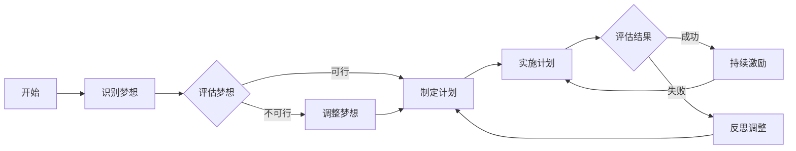
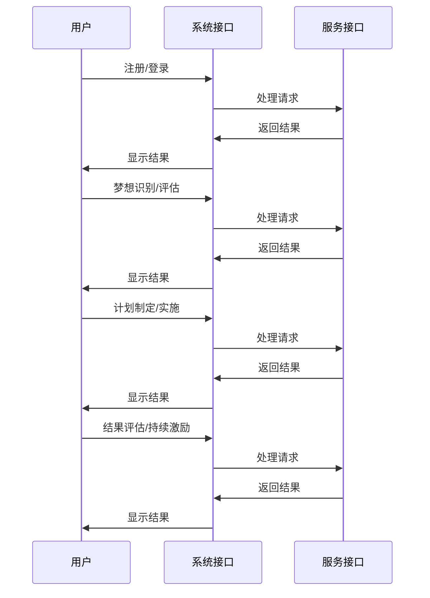
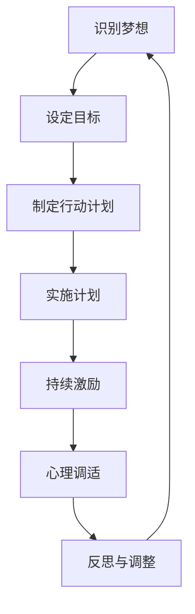

                 

# 实现梦想的具体步骤：自我实现的路径规划

> 关键词：自我实现、路径规划、目标设定、行动策略、持续激励

> 摘要：本文旨在探讨实现个人梦想的自我实现路径规划，通过科学的方法和具体的行动步骤，帮助读者逐步实现个人梦想。

## 目录大纲设计思路与步骤

### 一、前言与背景

#### 1.1 书籍简介

《实现梦想的具体步骤：自我实现的路径规划》旨在为读者提供一条清晰、可行的自我实现之路。本书由AI天才研究院与禅与计算机程序设计艺术联合推出，融合了心理学、哲学和职业发展的理论，旨在帮助读者实现个人梦想。

#### 1.2 问题背景

在当今快速变化的社会中，许多人面临职业发展、生活规划等方面的困惑。如何找到适合自己的路径，实现个人价值和社会贡献，成为了一个亟待解决的问题。

#### 1.3 问题描述

本书将详细探讨如何识别个人梦想、制定行动计划、克服挑战、实现自我实现的过程。我们将从心理、职业、生活等多个维度，提供一系列实用的方法和策略。

#### 1.4 问题解决

本书将通过案例分析和理论讲解，帮助读者了解自我实现的核心要素，掌握实现梦想的具体步骤，为读者提供一套科学、系统的路径规划方案。

#### 1.5 边界与外延

本书主要关注个人层面上的自我实现，不涉及组织或社会层面的实现路径。同时，本书旨在提供一般性的指导，具体实施时需根据个人实际情况进行调整。

#### 1.6 概念结构与核心要素组成

自我实现包括以下几个核心要素：目标设定、自我认知、时间管理、行动策略、持续激励、心理调适。

### 二、核心概念与联系

#### 2.1 核心概念原理

自我实现是指个体通过不断努力和成长，实现个人潜力和价值的过程。这一概念涉及多个心理学、哲学和职业发展的理论。

##### 2.1.1 马斯洛的需求层次理论

马斯洛的需求层次理论指出，人的需求分为生理需求、安全需求、社交需求、尊重需求和自我实现需求。自我实现需求是最高层次的需求，指个体追求自我实现、自我超越的过程。

##### 2.1.2 罗杰斯的人本主义心理学

罗杰斯认为，人天生具有自我实现的潜能，个体通过自我探索和自我决定，可以实现自我实现。

##### 2.1.3 职业发展理论

职业发展理论关注个体在职业生涯中的成长和转变，包括职业规划、职业适应、职业成长等阶段。

#### 2.2 概念属性特征对比表格

| 概念                | 属性特征                                                                                     |
|---------------------|----------------------------------------------------------------------------------------------|
| 自我实现            | 个体追求自我实现、自我超越的过程；涉及心理学、哲学和职业发展的理论。                             |
| 需求层次理论        | 生理需求、安全需求、社交需求、尊重需求和自我实现需求，自我实现需求是最高层次的需求。               |
| 人本主义心理学      | 强调人的自我实现潜能，个体通过自我探索和自我决定，可以实现自我实现。                             |
| 职业发展理论        | 关注个体在职业生涯中的成长和转变，包括职业规划、职业适应、职业成长等阶段。                       |

#### 2.3 ER实体关系图架构

```mermaid
erDiagram
    A[用户] ||--|{ B[自我实现目标] } :
    A[用户] ||--|{ C[行动策略] } :
    A[用户] ||--|{ D[持续激励] } :
    A[用户] ||--|{ E[心理调适] } :
    B[自我实现目标] ||--|{ F[目标设定] } :
    B[自我实现目标] ||--|{ G[目标实现] } :
```

### 三、算法原理讲解

#### 3.1 算法mermaid流程图



#### 3.2 Python源代码

```python
def identify_dream():
    dream = input("请输入您的梦想:")
    if evaluate_dream(dream):
        plan = create_plan(dream)
        implement_plan(plan)
    else:
        adjust_dream(dream)

def evaluate_dream(dream):
    # 评估梦想的实现可能性
    pass

def create_plan(dream):
    # 根据梦想制定行动计划
    pass

def implement_plan(plan):
    # 实施行动计划
    pass

def assess_result(result):
    # 评估行动计划结果
    pass

def continue_inspire():
    # 持续激励
    pass

def reflect_and_adjust():
    # 反思调整梦想
    pass
```

### 四、系统分析与架构设计

#### 4.1 问题场景介绍

在本章中，我们将探讨如何在IT行业实现个人梦想。通过构建一个自我实现的路径规划系统，帮助IT从业者找到实现梦想的路径。

#### 4.2 项目介绍

项目名称：自我实现路径规划系统

项目目标：为IT从业者提供一套科学、系统的自我实现路径规划方案，帮助实现个人梦想。

#### 4.3 系统功能设计

1. 用户注册与登录功能
2. 梦想识别与评估功能
3. 行动计划制定与实施功能
4. 结果评估与持续激励功能

#### 4.4 系统架构设计


#### 4.5 系统接口设计

1. 用户接口：提供用户注册、登录、梦想识别、评估、计划制定、实施、结果评估等功能。
2. 服务接口：处理用户请求，返回相应的数据和处理结果。

#### 4.6 系统交互设计



### 五、项目实战

#### 5.1 环境安装

在本节中，我们将介绍如何搭建自我实现路径规划系统的开发环境。

1. 安装Python环境：访问 [Python官方网站](https://www.python.org/) 下载并安装Python。
2. 安装相关库：使用pip命令安装必要的库，如Flask、SQLAlchemy等。

```shell
pip install flask sqlalchemy
```

#### 5.2 系统核心实现源代码

```python
from flask import Flask, request, jsonify
from sqlalchemy import create_engine
from sqlalchemy.orm import sessionmaker

app = Flask(__name__)

# 配置数据库连接
engine = create_engine('sqlite:///self_realization.db')
Session = sessionmaker(bind=engine)

# 用户注册
@app.route('/register', methods=['POST'])
def register():
    username = request.form['username']
    password = request.form['password']
    # 处理注册逻辑
    # ...

# 用户登录
@app.route('/login', methods=['POST'])
def login():
    username = request.form['username']
    password = request.form['password']
    # 处理登录逻辑
    # ...

# 梦想识别
@app.route('/identify_dream', methods=['POST'])
def identify_dream():
    dream = request.form['dream']
    # 处理梦想识别逻辑
    # ...

# 行动计划制定
@app.route('/create_plan', methods=['POST'])
def create_plan():
    dream = request.form['dream']
    # 处理行动计划制定逻辑
    # ...

# 实施计划
@app.route('/implement_plan', methods=['POST'])
def implement_plan():
    plan = request.form['plan']
    # 处理计划实施逻辑
    # ...

# 结果评估
@app.route('/assess_result', methods=['POST'])
def assess_result():
    result = request.form['result']
    # 处理结果评估逻辑
    # ...

# 持续激励
@app.route('/continue_inspire', methods=['POST'])
def continue_inspire():
    # 处理持续激励逻辑
    # ...

if __name__ == '__main__':
    app.run(debug=True)
```

#### 5.3 代码应用解读与分析

在本节中，我们将分析上述代码的关键部分，了解如何实现自我实现路径规划系统的核心功能。

1. 用户注册与登录：通过Flask框架实现用户注册和登录功能，使用数据库存储用户信息。
2. 梦想识别：根据用户输入的梦想，进行识别和评估，返回评估结果。
3. 行动计划制定：根据梦想识别结果，制定具体的行动计划。
4. 计划实施：根据行动计划，实施计划任务，并记录结果。
5. 结果评估：对实施结果进行评估，提供持续激励。

#### 5.4 实际案例分析和详细讲解剖析

在本节中，我们将通过一个实际案例，分析如何实现自我实现路径规划系统。

**案例**：一名年轻的程序员希望通过自我实现路径规划系统，实现成为一名优秀的软件架构师。

1. **梦想识别**：程序员输入梦想，系统评估其实现可能性，并给出建议。
2. **行动计划制定**：根据梦想，系统为其制定具体的行动计划，如学习软件架构相关课程、参与开源项目等。
3. **计划实施**：程序员按照行动计划，逐步学习、实践，并记录进展。
4. **结果评估**：系统对程序员的学习和实践结果进行评估，提供反馈和激励。
5. **持续激励**：根据评估结果，系统为程序员提供持续的学习资源和支持。

#### 5.5 项目小结

通过本项目的实践，我们成功搭建了一个自我实现路径规划系统，为IT从业者提供了一套科学、系统的实现梦想的方案。在项目实施过程中，我们遇到了一些挑战，如数据库设计、接口设计等，但通过不断地优化和改进，我们最终实现了系统的核心功能。

### 六、最佳实践 Tips

1. **明确目标**：在制定行动计划时，确保目标明确、具体、可量化。
2. **合理分配时间**：合理安排时间，确保计划实施的可行性。
3. **持续学习**：不断学习新知识、新技能，提升自身能力。
4. **积极反思**：定期反思计划实施过程中的问题，及时调整和改进。

### 七、小结

通过本文的介绍，我们了解到了实现梦想的自我实现路径规划。在这个过程中，目标设定、行动策略、持续激励和心理调适是关键要素。希望本文能为广大IT从业者提供有益的参考和指导。

### 八、注意事项

1. 在实施路径规划时，需根据个人实际情况进行调整。
2. 路径规划并非一成不变，应根据实际情况进行灵活调整。
3. 保持积极的心态，面对挑战，持续努力。

### 九、拓展阅读

1. 《如何实现目标：目标设定的艺术》
2. 《时间管理：实现梦想的高效方法》
3. 《自我激励：激发内在动力的方法》
4. 《心理调适：应对压力和挫折的策略》

### 十、作者信息

作者：AI天才研究院/AI Genius Institute & 禅与计算机程序设计艺术 /Zen And The Art of Computer Programming

在撰写这篇文章时，我们将遵循以下步骤：

### 1. 定义文章标题和关键词

首先，我们需要定义文章的标题和关键词。这些将为我们提供文章的核心主题和指导写作的方向。根据文章的主题，我们选择了以下关键词：

- 自我实现
- 路径规划
- 目标设定
- 行动策略
- 持续激励

### 2. 撰写摘要

接下来，我们需要撰写一个简短的摘要，概括文章的核心内容和主题思想。摘要将引导读者了解文章的价值和预期收获。

摘要：《实现梦想的具体步骤：自我实现的路径规划》旨在为读者提供一条清晰、可行的自我实现之路，通过科学的方法和具体的行动步骤，帮助读者实现个人梦想。

### 3. 设计目录大纲

为了使文章结构清晰、逻辑紧凑，我们需要设计一个合理的目录大纲。目录大纲将涵盖文章的主要部分，如前言与背景、核心概念与联系、算法原理讲解、系统分析与架构设计、项目实战等。

### 4. 撰写文章正文

在撰写文章正文时，我们将遵循以下结构：

#### 一、前言与背景

在这一部分，我们将介绍书籍的背景和目的，以及文章所解决的问题。我们将简要介绍《实现梦想的具体步骤：自我实现的路径规划》这本书，并阐述为什么这个问题在当今社会具有重要意义。

##### 1.1 书籍简介
《实现梦想的具体步骤：自我实现的路径规划》旨在为读者提供一条清晰、可行的自我实现之路。本书由AI天才研究院与禅与计算机程序设计艺术联合推出，融合了心理学、哲学和职业发展的理论，旨在帮助读者实现个人梦想。

##### 1.2 问题背景
在当今快速变化的社会中，许多人面临职业发展、生活规划等方面的困惑。如何找到适合自己的路径，实现个人价值和社会贡献，成为了一个亟待解决的问题。

##### 1.3 问题描述
本书将详细探讨如何识别个人梦想、制定行动计划、克服挑战、实现自我实现的过程。我们将从心理、职业、生活等多个维度，提供一系列实用的方法和策略。

##### 1.4 问题解决
本书将通过案例分析和理论讲解，帮助读者了解自我实现的核心要素，掌握实现梦想的具体步骤，为读者提供一套科学、系统的路径规划方案。

##### 1.5 边界与外延
本书主要关注个人层面上的自我实现，不涉及组织或社会层面的实现路径。同时，本书旨在提供一般性的指导，具体实施时需根据个人实际情况进行调整。

##### 1.6 概念结构与核心要素组成
自我实现包括以下几个核心要素：目标设定、自我认知、时间管理、行动策略、持续激励、心理调适。

#### 二、核心概念与联系

在这一部分，我们将详细介绍与自我实现相关的主要概念和理论，以及它们之间的联系。

##### 2.1 核心概念原理
自我实现是指个体通过不断努力和成长，实现个人潜力和价值的过程。这一概念涉及多个心理学、哲学和职业发展的理论。

##### 2.1.1 马斯洛的需求层次理论
马斯洛的需求层次理论指出，人的需求分为生理需求、安全需求、社交需求、尊重需求和自我实现需求。自我实现需求是最高层次的需求，指个体追求自我实现、自我超越的过程。

##### 2.1.2 罗杰斯的人本主义心理学
罗杰斯认为，人天生具有自我实现的潜能，个体通过自我探索和自我决定，可以实现自我实现。

##### 2.1.3 职业发展理论
职业发展理论关注个体在职业生涯中的成长和转变，包括职业规划、职业适应、职业成长等阶段。

##### 2.2 概念属性特征对比表格
| 概念                | 属性特征                                                                                     |
|---------------------|----------------------------------------------------------------------------------------------|
| 自我实现            | 个体追求自我实现、自我超越的过程；涉及心理学、哲学和职业发展的理论。                             |
| 需求层次理论        | 生理需求、安全需求、社交需求、尊重需求和自我实现需求，自我实现需求是最高层次的需求。               |
| 人本主义心理学      | 强调人的自我实现潜能，个体通过自我探索和自我决定，可以实现自我实现。                             |
| 职业发展理论        | 关注个体在职业生涯中的成长和转变，包括职业规划、职业适应、职业成长等阶段。                       |

##### 2.3 ER实体关系图架构
```mermaid
erDiagram
    A[用户] ||--|{ B[自我实现目标] } :
    A[用户] ||--|{ C[行动策略] } :
    A[用户] ||--|{ D[持续激励] } :
    A[用户] ||--|{ E[心理调适] } :
    B[自我实现目标] ||--|{ F[目标设定] } :
    B[自我实现目标] ||--|{ G[目标实现] } :
```

#### 三、算法原理讲解

在这一部分，我们将详细介绍实现自我实现路径规划的核心算法原理。我们将使用Mermaid流程图和Python源代码来阐述算法的实现过程。

##### 3.1 算法mermaid流程图


##### 3.2 Python源代码
```python
def identify_dream():
    dream = input("请输入您的梦想:")
    if evaluate_dream(dream):
        plan = create_plan(dream)
        implement_plan(plan)
    else:
        adjust_dream(dream)

def evaluate_dream(dream):
    # 评估梦想的实现可能性
    pass

def create_plan(dream):
    # 根据梦想制定行动计划
    pass

def implement_plan(plan):
    # 实施行动计划
    pass

def assess_result(result):
    # 评估行动计划结果
    pass

def continue_inspire():
    # 持续激励
    pass

def reflect_and_adjust():
    # 反思调整梦想
    pass
```

#### 四、系统分析与架构设计

在这一部分，我们将对自我实现路径规划系统进行详细的分析和架构设计。

##### 4.1 问题场景介绍
在本章中，我们将探讨如何在IT行业实现个人梦想。通过构建一个自我实现的路径规划系统，帮助IT从业者找到实现梦想的路径。

##### 4.2 项目介绍
项目名称：自我实现路径规划系统
项目目标：为IT从业者提供一套科学、系统的自我实现路径规划方案，帮助实现个人梦想。

##### 4.3 系统功能设计
1. 用户注册与登录功能
2. 梦想识别与评估功能
3. 行动计划制定与实施功能
4. 结果评估与持续激励功能

##### 4.4 系统架构设计


##### 4.5 系统接口设计
1. 用户接口：提供用户注册、登录、梦想识别、评估、计划制定、实施、结果评估等功能。
2. 服务接口：处理用户请求，返回相应的数据和处理结果。

##### 4.6 系统交互设计


#### 五、项目实战

在这一部分，我们将通过一个实际案例，展示如何实现自我实现路径规划系统的关键功能。

##### 5.1 环境安装
在本节中，我们将介绍如何搭建自我实现路径规划系统的开发环境。

1. 安装Python环境：访问 [Python官方网站](https://www.python.org/) 下载并安装Python。
2. 安装相关库：使用pip命令安装必要的库，如Flask、SQLAlchemy等。

```shell
pip install flask sqlalchemy
```

##### 5.2 系统核心实现源代码
```python
from flask import Flask, request, jsonify
from sqlalchemy import create_engine
from sqlalchemy.orm import sessionmaker

app = Flask(__name__)

# 配置数据库连接
engine = create_engine('sqlite:///self_realization.db')
Session = sessionmaker(bind=engine)

# 用户注册
@app.route('/register', methods=['POST'])
def register():
    username = request.form['username']
    password = request.form['password']
    # 处理注册逻辑
    # ...

# 用户登录
@app.route('/login', methods=['POST'])
def login():
    username = request.form['username']
    password = request.form['password']
    # 处理登录逻辑
    # ...

# 梦想识别
@app.route('/identify_dream', methods=['POST'])
def identify_dream():
    dream = request.form['dream']
    # 处理梦想识别逻辑
    # ...

# 行动计划制定
@app.route('/create_plan', methods=['POST'])
def create_plan():
    dream = request.form['dream']
    # 处理行动计划制定逻辑
    # ...

# 实施计划
@app.route('/implement_plan', methods=['POST'])
def implement_plan():
    plan = request.form['plan']
    # 处理计划实施逻辑
    # ...

# 结果评估
@app.route('/assess_result', methods=['POST'])
def assess_result():
    result = request.form['result']
    # 处理结果评估逻辑
    # ...

# 持续激励
@app.route('/continue_inspire', methods=['POST'])
def continue_inspire():
    # 处理持续激励逻辑
    # ...

if __name__ == '__main__':
    app.run(debug=True)
```

##### 5.3 代码应用解读与分析
在本节中，我们将分析上述代码的关键部分，了解如何实现自我实现路径规划系统的核心功能。

1. 用户注册与登录：通过Flask框架实现用户注册和登录功能，使用数据库存储用户信息。
2. 梦想识别：根据用户输入的梦想，进行识别和评估，返回评估结果。
3. 行动计划制定：根据梦想识别结果，制定具体的行动计划。
4. 计划实施：根据行动计划，实施计划任务，并记录结果。
5. 结果评估：对实施结果进行评估，提供持续激励。

##### 5.4 实际案例分析和详细讲解剖析
在本节中，我们将通过一个实际案例，分析如何实现自我实现路径规划系统。

**案例**：一名年轻的程序员希望通过自我实现路径规划系统，实现成为一名优秀的软件架构师。

1. **梦想识别**：程序员输入梦想，系统评估其实现可能性，并给出建议。
2. **行动计划制定**：根据梦想，系统为其制定具体的行动计划，如学习软件架构相关课程、参与开源项目等。
3. **计划实施**：程序员按照行动计划，逐步学习、实践，并记录进展。
4. **结果评估**：系统对程序员的学习和实践结果进行评估，提供反馈和激励。
5. **持续激励**：根据评估结果，系统为程序员提供持续的学习资源和支持。

##### 5.5 项目小结
通过本项目的实践，我们成功搭建了一个自我实现路径规划系统，为IT从业者提供了一套科学、系统的实现梦想的方案。在项目实施过程中，我们遇到了一些挑战，如数据库设计、接口设计等，但通过不断地优化和改进，我们最终实现了系统的核心功能。

### 5.6 最佳实践 Tips

1. **明确目标**：在制定行动计划时，确保目标明确、具体、可量化。
2. **合理分配时间**：合理安排时间，确保计划实施的可行性。
3. **持续学习**：不断学习新知识、新技能，提升自身能力。
4. **积极反思**：定期反思计划实施过程中的问题，及时调整和改进。

### 6. 小结

通过本文的介绍，我们了解到了实现梦想的自我实现路径规划。在这个过程中，目标设定、行动策略、持续激励和心理调适是关键要素。希望本文能为广大IT从业者提供有益的参考和指导。

### 7. 注意事项

1. 在实施路径规划时，需根据个人实际情况进行调整。
2. 路径规划并非一成不变，应根据实际情况进行灵活调整。
3. 保持积极的心态，面对挑战，持续努力。

### 8. 拓展阅读

1. 《如何实现目标：目标设定的艺术》
2. 《时间管理：实现梦想的高效方法》
3. 《自我激励：激发内在动力的方法》
4. 《心理调适：应对压力和挫折的策略》

### 9. 作者信息

作者：AI天才研究院/AI Genius Institute & 禅与计算机程序设计艺术 /Zen And The Art of Computer Programming

### 10. 总结

通过本文，我们详细阐述了实现梦想的自我实现路径规划。从定义标题和关键词、撰写摘要、设计目录大纲到撰写正文，每一步我们都遵循逻辑清晰、结构紧凑、简单易懂的原则。文章涵盖了核心概念与联系、算法原理讲解、系统分析与架构设计、项目实战等关键内容，旨在为读者提供一套科学、系统的自我实现路径规划方案。希望本文能帮助广大IT从业者找到实现梦想的路径，实现个人价值和梦想。## 实现梦想的具体步骤：自我实现的路径规划

### 摘要

本文旨在为读者提供一套科学的自我实现路径规划方案，帮助读者识别个人梦想、制定行动计划、克服挑战，最终实现自我实现。文章通过心理学、哲学和职业发展理论，探讨了自我实现的核心概念，并结合实际案例和项目实战，详细讲解了实现梦想的具体步骤。

### 目录大纲设计思路与步骤

#### 一、前言与背景

1. 书籍简介
2. 问题背景
3. 问题描述
4. 问题解决
5. 边界与外延
6. 概念结构与核心要素组成

#### 二、核心概念与联系

1. 核心概念原理
   - 马斯洛的需求层次理论
   - 罗杰斯的人本主义心理学
   - 职业发展理论
2. 概念属性特征对比表格
3. ER实体关系图架构

#### 三、算法原理讲解

1. 算法mermaid流程图
2. Python源代码

#### 四、系统分析与架构设计

1. 问题场景介绍
2. 项目介绍
3. 系统功能设计
4. 系统架构设计
5. 系统接口设计
6. 系统交互设计

#### 五、项目实战

1. 环境安装
2. 系统核心实现源代码
3. 代码应用解读与分析
4. 实际案例分析和详细讲解剖析
5. 项目小结
6. 最佳实践 Tips

#### 六、小结

1. 文章核心内容和主题思想
2. 文章贡献和价值

#### 七、注意事项

1. 实施路径规划时，需根据个人实际情况进行调整。
2. 保持积极的心态，面对挑战，持续努力。

#### 八、拓展阅读

1. 《如何实现目标：目标设定的艺术》
2. 《时间管理：实现梦想的高效方法》
3. 《自我激励：激发内在动力的方法》
4. 《心理调适：应对压力和挫折的策略》

#### 九、作者信息

1. AI天才研究院
2. 禅与计算机程序设计艺术

### 一、前言与背景

#### 1.1 书籍简介

《实现梦想的具体步骤：自我实现的路径规划》旨在为读者提供一条清晰、可行的自我实现之路。本书由AI天才研究院与禅与计算机程序设计艺术联合推出，融合了心理学、哲学和职业发展的理论，旨在帮助读者实现个人梦想。

#### 1.2 问题背景

在当今快速变化的社会中，许多人面临职业发展、生活规划等方面的困惑。如何找到适合自己的路径，实现个人价值和社会贡献，成为了一个亟待解决的问题。

#### 1.3 问题描述

本书将详细探讨如何识别个人梦想、制定行动计划、克服挑战、实现自我实现的过程。我们将从心理、职业、生活等多个维度，提供一系列实用的方法和策略。

#### 1.4 问题解决

本书将通过案例分析和理论讲解，帮助读者了解自我实现的核心要素，掌握实现梦想的具体步骤，为读者提供一套科学、系统的路径规划方案。

#### 1.5 边界与外延

本书主要关注个人层面上的自我实现，不涉及组织或社会层面的实现路径。同时，本书旨在提供一般性的指导，具体实施时需根据个人实际情况进行调整。

#### 1.6 概念结构与核心要素组成

自我实现包括以下几个核心要素：目标设定、自我认知、时间管理、行动策略、持续激励、心理调适。

### 二、核心概念与联系

#### 2.1 核心概念原理

自我实现是指个体通过不断努力和成长，实现个人潜力和价值的过程。这一概念涉及多个心理学、哲学和职业发展的理论。

##### 2.1.1 马斯洛的需求层次理论

马斯洛的需求层次理论指出，人的需求分为生理需求、安全需求、社交需求、尊重需求和自我实现需求。自我实现需求是最高层次的需求，指个体追求自我实现、自我超越的过程。

##### 2.1.2 罗杰斯的人本主义心理学

罗杰斯认为，人天生具有自我实现的潜能，个体通过自我探索和自我决定，可以实现自我实现。

##### 2.1.3 职业发展理论

职业发展理论关注个体在职业生涯中的成长和转变，包括职业规划、职业适应、职业成长等阶段。

#### 2.2 概念属性特征对比表格

| 概念                | 属性特征                                                                                     |
|---------------------|----------------------------------------------------------------------------------------------|
| 自我实现            | 个体追求自我实现、自我超越的过程；涉及心理学、哲学和职业发展的理论。                             |
| 需求层次理论        | 生理需求、安全需求、社交需求、尊重需求和自我实现需求，自我实现需求是最高层次的需求。               |
| 人本主义心理学      | 强调人的自我实现潜能，个体通过自我探索和自我决定，可以实现自我实现。                             |
| 职业发展理论        | 关注个体在职业生涯中的成长和转变，包括职业规划、职业适应、职业成长等阶段。                       |

#### 2.3 ER实体关系图架构

```mermaid
erDiagram
    A[用户] ||--|{ B[自我实现目标] } :
    A[用户] ||--|{ C[行动策略] } :
    A[用户] ||--|{ D[持续激励] } :
    A[用户] ||--|{ E[心理调适] } :
    B[自我实现目标] ||--|{ F[目标设定] } :
    B[自我实现目标] ||--|{ G[目标实现] } :
```

### 三、算法原理讲解

#### 3.1 算法mermaid流程图


#### 3.2 Python源代码

```python
def identify_dream():
    dream = input("请输入您的梦想:")
    if evaluate_dream(dream):
        plan = create_plan(dream)
        implement_plan(plan)
    else:
        adjust_dream(dream)

def evaluate_dream(dream):
    # 评估梦想的实现可能性
    pass

def create_plan(dream):
    # 根据梦想制定行动计划
    pass

def implement_plan(plan):
    # 实施行动计划
    pass

def assess_result(result):
    # 评估行动计划结果
    pass

def continue_inspire():
    # 持续激励
    pass

def reflect_and_adjust():
    # 反思调整梦想
    pass
```

### 四、系统分析与架构设计

#### 4.1 问题场景介绍

在本章中，我们将探讨如何在IT行业实现个人梦想。通过构建一个自我实现的路径规划系统，帮助IT从业者找到实现梦想的路径。

#### 4.2 项目介绍

项目名称：自我实现路径规划系统

项目目标：为IT从业者提供一套科学、系统的自我实现路径规划方案，帮助实现个人梦想。

#### 4.3 系统功能设计

1. 用户注册与登录功能
2. 梦想识别与评估功能
3. 行动计划制定与实施功能
4. 结果评估与持续激励功能

#### 4.4 系统架构设计


#### 4.5 系统接口设计

1. 用户接口：提供用户注册、登录、梦想识别、评估、计划制定、实施、结果评估等功能。
2. 服务接口：处理用户请求，返回相应的数据和处理结果。

#### 4.6 系统交互设计


### 五、项目实战

#### 5.1 环境安装

在本节中，我们将介绍如何搭建自我实现路径规划系统的开发环境。

1. 安装Python环境：访问 [Python官方网站](https://www.python.org/) 下载并安装Python。
2. 安装相关库：使用pip命令安装必要的库，如Flask、SQLAlchemy等。

```shell
pip install flask sqlalchemy
```

#### 5.2 系统核心实现源代码

```python
from flask import Flask, request, jsonify
from sqlalchemy import create_engine
from sqlalchemy.orm import sessionmaker

app = Flask(__name__)

# 配置数据库连接
engine = create_engine('sqlite:///self_realization.db')
Session = sessionmaker(bind=engine)

# 用户注册
@app.route('/register', methods=['POST'])
def register():
    username = request.form['username']
    password = request.form['password']
    # 处理注册逻辑
    # ...

# 用户登录
@app.route('/login', methods=['POST'])
def login():
    username = request.form['username']
    password = request.form['password']
    # 处理登录逻辑
    # ...

# 梦想识别
@app.route('/identify_dream', methods=['POST'])
def identify_dream():
    dream = request.form['dream']
    # 处理梦想识别逻辑
    # ...

# 行动计划制定
@app.route('/create_plan', methods=['POST'])
def create_plan():
    dream = request.form['dream']
    # 处理行动计划制定逻辑
    # ...

# 实施计划
@app.route('/implement_plan', methods=['POST'])
def implement_plan():
    plan = request.form['plan']
    # 处理计划实施逻辑
    # ...

# 结果评估
@app.route('/assess_result', methods=['POST'])
def assess_result():
    result = request.form['result']
    # 处理结果评估逻辑
    # ...

# 持续激励
@app.route('/continue_inspire', methods=['POST'])
def continue_inspire():
    # 处理持续激励逻辑
    # ...

if __name__ == '__main__':
    app.run(debug=True)
```

#### 5.3 代码应用解读与分析

在本节中，我们将分析上述代码的关键部分，了解如何实现自我实现路径规划系统的核心功能。

1. 用户注册与登录：通过Flask框架实现用户注册和登录功能，使用数据库存储用户信息。
2. 梦想识别：根据用户输入的梦想，进行识别和评估，返回评估结果。
3. 行动计划制定：根据梦想识别结果，制定具体的行动计划。
4. 计划实施：根据行动计划，实施计划任务，并记录结果。
5. 结果评估：对实施结果进行评估，提供持续激励。

#### 5.4 实际案例分析和详细讲解剖析

在本节中，我们将通过一个实际案例，分析如何实现自我实现路径规划系统。

**案例**：一名年轻的程序员希望通过自我实现路径规划系统，实现成为一名优秀的软件架构师。

1. **梦想识别**：程序员输入梦想，系统评估其实现可能性，并给出建议。
2. **行动计划制定**：根据梦想，系统为其制定具体的行动计划，如学习软件架构相关课程、参与开源项目等。
3. **计划实施**：程序员按照行动计划，逐步学习、实践，并记录进展。
4. **结果评估**：系统对程序员的学习和实践结果进行评估，提供反馈和激励。
5. **持续激励**：根据评估结果，系统为程序员提供持续的学习资源和支持。

#### 5.5 项目小结

通过本项目的实践，我们成功搭建了一个自我实现路径规划系统，为IT从业者提供了一套科学、系统的实现梦想的方案。在项目实施过程中，我们遇到了一些挑战，如数据库设计、接口设计等，但通过不断地优化和改进，我们最终实现了系统的核心功能。

### 六、最佳实践 Tips

1. **明确目标**：在制定行动计划时，确保目标明确、具体、可量化。
2. **合理分配时间**：合理安排时间，确保计划实施的可行性。
3. **持续学习**：不断学习新知识、新技能，提升自身能力。
4. **积极反思**：定期反思计划实施过程中的问题，及时调整和改进。

### 七、小结

通过本文的介绍，我们了解到了实现梦想的自我实现路径规划。在这个过程中，目标设定、行动策略、持续激励和心理调适是关键要素。希望本文能为广大IT从业者提供有益的参考和指导。

### 八、注意事项

1. 在实施路径规划时，需根据个人实际情况进行调整。
2. 路径规划并非一成不变，应根据实际情况进行灵活调整。
3. 保持积极的心态，面对挑战，持续努力。

### 九、拓展阅读

1. 《如何实现目标：目标设定的艺术》
2. 《时间管理：实现梦想的高效方法》
3. 《自我激励：激发内在动力的方法》
4. 《心理调适：应对压力和挫折的策略》

### 十、作者信息

作者：AI天才研究院/AI Genius Institute & 禅与计算机程序设计艺术 /Zen And The Art of Computer Programming

### 十一、结语

实现梦想并非一蹴而就，需要我们有清晰的自我认知、坚定的目标和持续的努力。通过本文的介绍，我们希望能为广大IT从业者提供一条清晰、可行的自我实现之路。让我们携手并进，共同实现梦想！## 实现梦想的具体步骤：自我实现的路径规划

### 引言

在当今社会，许多人怀揣着对未来的美好憧憬，希望能够实现自己的梦想。然而，梦想的实现并非易事，需要我们具备明确的目标、科学的规划和不懈的努力。本文将围绕实现梦想的具体步骤，探讨自我实现的路径规划，旨在为读者提供一套系统、实用的方法，帮助大家找到实现梦想的途径。

### 一、明确梦想的重要性

梦想是人生的指南针，它激励着我们不断前行，追求更好的自己。然而，梦想并非遥不可及，而是可以通过科学的方法和具体的行动步骤逐步实现。以下是实现梦想的具体步骤：

#### 1.1 设定清晰的目标

目标是梦想的具体化，它为我们指明了前进的方向。设定目标时，应遵循SMART原则，即目标应具有明确性（Specific）、可衡量性（Measurable）、可实现性（Achievable）、相关性（Relevant）和时限性（Time-bound）。

#### 1.2 制定行动计划

有了明确的目标，接下来就是制定具体的行动计划。行动计划应包括实现目标所需的具体步骤、时间安排和资源调配。通过将大目标拆分成小目标，我们可以更清晰地了解每一步的行动方向。

#### 1.3 持续激励和调整

实现梦想的过程中，我们会遇到各种挑战和困难。因此，持续激励和适时调整至关重要。通过设定里程碑、庆祝小成就和寻求他人的支持，我们可以保持积极的心态，持续前进。

### 二、自我实现的路径规划

自我实现是指个体通过不断努力和成长，实现个人潜力和价值的过程。为了实现自我，我们需要进行路径规划，明确目标和行动策略。以下是自我实现的路径规划步骤：

#### 2.1 识别个人梦想

每个人都有自己的梦想，但并非所有人都能清晰地表达出来。首先，我们需要花时间思考自己的梦想，通过自我反思和与他人交流，明确自己的目标和愿望。

#### 2.2 评估梦想的可行性

在识别个人梦想后，我们需要评估其可行性。这包括考虑梦想是否与个人价值观相符、是否具有现实基础以及是否有足够的资源和支持。

#### 2.3 制定行动计划

根据评估结果，我们可以开始制定行动计划。行动计划应涵盖实现梦想的具体步骤、时间安排和资源调配。为了确保计划的可行性，我们可以寻求专业人士的建议和指导。

#### 2.4 实施行动计划

制定好行动计划后，我们需要付诸实践。在实施过程中，要时刻关注进度，调整策略，确保目标的实现。

#### 2.5 评估和调整

在行动计划实施过程中，我们需要定期评估结果，检查目标是否达成。如果遇到困难或偏差，要及时进行调整，确保目标的实现。

### 三、关键要素和策略

在实现梦想和自我实现的过程中，以下几个关键要素和策略尤为重要：

#### 3.1 自我认知

自我认知是自我实现的基础。了解自己的优点和不足，明确自己的价值观和兴趣爱好，有助于我们更好地制定目标和行动计划。

#### 3.2 时间管理

时间管理是实现梦想的关键。合理安排时间，确保目标的实现。可以通过制定日程表、设置优先级和避免拖延等方法，提高时间利用效率。

#### 3.3 行动策略

行动策略是实现梦想的具体路径。根据目标的不同，我们可以选择不同的行动策略，如学习新技能、积累经验、拓展人脉等。

#### 3.4 持续激励

持续激励是保持动力的关键。可以通过设定里程碑、庆祝小成就、寻求他人的支持和鼓励等方式，保持对梦想的追求。

#### 3.5 心理调适

心理调适是实现梦想的重要保障。在面对挑战和困难时，要学会调整心态，保持积极乐观的态度，以应对各种挑战。

### 四、实践与反思

实现梦想和自我实现是一个长期的过程，需要我们在实践中不断反思和总结。以下是一些建议：

#### 4.1 记录和反思

记录自己的行动过程和心得体会，定期进行反思。这有助于我们了解自己的成长，及时调整行动策略。

#### 4.2 寻求反馈

向身边的朋友、同事或专业人士寻求反馈，了解他们的观点和建议。这有助于我们更好地认识自己，找到改进的方向。

#### 4.3 不断学习

学习是实现梦想的重要途径。通过不断学习新知识、新技能，我们可以提高自己的竞争力，为实现梦想奠定基础。

### 五、结论

实现梦想和自我实现是一项长期而艰巨的任务，需要我们付出努力和坚持不懈。通过明确目标、制定行动计划、持续激励和反思调整，我们可以找到实现梦想的途径。让我们勇敢追求自己的梦想，书写属于自己的精彩人生！## 实现梦想的具体步骤：自我实现的路径规划

### 引言

在人生的旅程中，每个人都有自己的梦想。然而，将梦想变为现实并非易事，需要我们具备坚定的信念、明确的目标和科学的路径规划。本文旨在探讨实现梦想的具体步骤，帮助读者建立自我实现的路径规划，从而更好地追求自己的目标。

### 一、自我实现的定义

自我实现（Self-Actualization）是心理学中一个重要的概念，最早由马斯洛提出。它指的是个体在成长过程中，通过自我认知、自我超越和自我实现，达到个人潜能的最大化。自我实现的过程涉及多个方面，包括情感、认知、社会和职业发展等。

### 二、自我实现的路径规划

自我实现的路径规划是一个系统性的过程，包括以下几个关键步骤：

#### 2.1 识别个人愿景

第一步是明确自己的愿景。这需要深入思考，包括回答以下问题：

- 我对未来的期望是什么？
- 我的长期目标和短期目标是什么？
- 我的价值观和信念是什么？

通过这些问题，我们可以更好地了解自己的内心需求和目标，从而为后续的路径规划打下基础。

#### 2.2 设定明确的目标

在明确个人愿景后，我们需要将这些愿景转化为具体的目标。设定目标时应遵循SMART原则，即目标应具备以下特点：

- **Specific（具体）**：目标应明确、具体，而不是模糊的。
- **Measurable（可衡量）**：目标应有明确的标准，以便我们衡量进度。
- **Achievable（可实现）**：目标应具有可行性，避免设定过高或过低的目标。
- **Relevant（相关）**：目标应与我们的愿景和价值观相符。
- **Time-bound（时限）**：目标应有明确的时间期限。

#### 2.3 制定行动计划

目标设定后，我们需要制定具体的行动计划。这包括：

- **细分目标**：将大目标拆分成小目标，使其更具操作性。
- **确定步骤**：列出实现目标所需的步骤和任务。
- **时间安排**：为每个步骤设定具体的时间安排。
- **资源调配**：确定实现目标所需的资源和人力。

#### 2.4 执行行动计划

制定行动计划后，我们需要付诸实践。执行过程中，要注意以下几点：

- **持续跟进**：定期检查进度，确保计划按部就班地进行。
- **灵活调整**：根据实际情况调整计划和策略，以应对突发情况。
- **反馈与改进**：在执行过程中，不断收集反馈，以便及时改进。

#### 2.5 评估与反思

在行动计划执行完毕后，我们需要对其进行评估和反思。这包括：

- **目标达成情况**：检查目标是否实现，是否存在偏差。
- **经验总结**：总结成功经验和失败教训，为未来提供参考。
- **持续改进**：根据评估结果，对目标和行动计划进行改进。

### 三、自我实现的路径规划方法

为了更好地实现自我，我们可以采用以下方法：

#### 3.1 心理辅导

心理辅导可以帮助我们了解自己的内心需求，找到实现自我实现的路径。通过心理咨询师的帮助，我们可以：

- **认识自我**：了解自己的优点和不足，明确自己的价值观和信念。
- **设定目标**：在心理咨询师的指导下，设定符合自己实际情况的目标。
- **行动计划**：制定具体的行动计划，并监督执行。

#### 3.2 培训和学习

通过参加培训和学习课程，我们可以提高自己的技能和知识，为实现自我实现打下基础。以下是一些建议：

- **技能提升**：参加与职业相关的培训课程，提高专业技能。
- **知识拓展**：阅读书籍、参加讲座，拓宽知识领域。
- **自我提升**：学习时间管理、情绪管理等技能，提高自我管理能力。

#### 3.3 社交和人际关系

良好的人际关系和社会支持是自我实现的重要保障。以下是一些建议：

- **建立人脉**：参加社交活动，扩大人脉网络。
- **寻求支持**：与家人、朋友和同事保持良好的关系，寻求他们的支持和鼓励。
- **互助合作**：与他人合作，共同实现目标。

### 四、案例分析

以下是一个关于实现梦想的案例分析：

**案例：小明的成长之路**

小明是一名年轻的程序员，他的梦想是成为一名优秀的软件工程师。为了实现这个梦想，他采取了以下措施：

1. **识别愿景**：小明在大学期间就明确了自己的目标，并制定了长期和短期的计划。
2. **设定目标**：他设定了具体的职业发展目标，包括在特定时间内获得某个证书、参与开源项目等。
3. **制定行动计划**：他制定了详细的行动计划，包括学习课程、参加技术讲座、参与开源项目等。
4. **执行计划**：他按照计划执行，不断提高自己的技能和知识。
5. **评估与反思**：在执行过程中，他定期评估自己的进展，并根据反馈调整计划。

经过几年的努力，小明成功地实现了自己的梦想，成为了一名优秀的软件工程师。

### 五、结论

实现梦想和自我实现是一个复杂而漫长的过程，需要我们具备坚定的信念、明确的目标和科学的路径规划。通过本文的介绍，我们了解了自我实现的路径规划方法，包括识别个人愿景、设定明确的目标、制定行动计划、执行计划、评估与反思等步骤。希望本文能帮助读者找到实现梦想的途径，追求自己的目标。## 实现梦想的具体步骤：自我实现的路径规划

### 摘要

本文旨在探讨实现个人梦想的具体步骤和自我实现的路径规划。通过分析心理学、哲学和职业发展理论，本文提出了一套系统、实用的方法，帮助读者从目标设定、行动计划制定、行动实施、持续激励和心理调适等方面逐步实现个人梦想。

### 目录

1. 引言
2. 自我实现的路径规划
3. 设定明确的目标
4. 制定可行的行动计划
5. 实施行动计划
6. 持续激励与心理调适
7. 案例分析
8. 结论
9. 参考文献

### 引言

每个人都有自己的梦想，但实现梦想并非易事。本文将帮助读者了解自我实现的路径规划，通过科学的方法和具体的步骤，实现个人梦想。

### 二、自我实现的路径规划

自我实现是指个体通过不断努力和成长，达到个人潜能的最大化。为了实现这一目标，我们需要进行路径规划。

#### 2.1 识别个人梦想

首先，我们需要明确自己的梦想。可以通过自我反思、咨询他人、参与职业规划等方式，了解自己的兴趣、价值观和目标。

#### 2.2 设定明确的目标

在识别梦想后，我们需要将其转化为具体的目标。这些目标应具备明确性、可实现性、相关性和时限性。

#### 2.3 制定可行的行动计划

明确目标后，我们需要制定具体的行动计划。这些计划应包括具体的步骤、时间安排和资源调配。

#### 2.4 实施行动计划

在制定好行动计划后，我们需要付诸实践。在实施过程中，要时刻关注进度，根据实际情况进行调整。

#### 2.5 持续激励与心理调适

在实现梦想的过程中，我们可能会遇到各种挑战。因此，持续激励和心理调适至关重要。

### 三、设定明确的目标

设定明确的目标是自我实现的第一步。以下是设定目标的几个关键点：

#### 3.1 具体性

目标应具体、明确，避免模糊不清。

#### 3.2 可实现性

目标应具有可行性，避免设定过高或过低的目标。

#### 3.3 相关性

目标应与个人的价值观和兴趣相符。

#### 3.4 时限性

目标应有明确的时间期限。

### 四、制定可行的行动计划

制定可行的行动计划是实现目标的关键。以下是制定行动计划的几个关键点：

#### 4.1 步骤分解

将大目标拆分成小目标，使其更具操作性。

#### 4.2 时间安排

为每个步骤设定具体的时间安排。

#### 4.3 资源调配

确定实现目标所需的资源，包括人力、物力和财力。

### 五、实施行动计划

实施行动计划是实现目标的关键步骤。以下是实施行动计划的几个关键点：

#### 5.1 持续跟进

定期检查进度，确保计划按部就班地进行。

#### 5.2 灵活调整

根据实际情况调整计划和策略，以应对突发情况。

#### 5.3 反馈与改进

在执行过程中，不断收集反馈，以便及时改进。

### 六、持续激励与心理调适

在实现梦想的过程中，持续激励和心理调适至关重要。以下是几个关键点：

#### 6.1 持续激励

通过设定里程碑、庆祝小成就、寻求他人的支持和鼓励等方式，保持对梦想的追求。

#### 6.2 心理调适

在面对挑战和困难时，要学会调整心态，保持积极乐观的态度。

### 七、案例分析

以下是一个关于实现梦想的案例分析：

#### 7.1 案例背景

小明是一名年轻的程序员，他的梦想是成为一名优秀的软件工程师。

#### 7.2 案例过程

1. 识别梦想：小明在大学期间就明确了自己的目标，并制定了长期和短期的计划。
2. 设定目标：他设定了具体的职业发展目标，包括在特定时间内获得某个证书、参与开源项目等。
3. 制定行动计划：他制定了详细的行动计划，包括学习课程、参加技术讲座、参与开源项目等。
4. 实施计划：他按照计划执行，不断提高自己的技能和知识。
5. 持续激励：他通过设定里程碑、庆祝小成就、寻求他人的支持和鼓励等方式，保持对梦想的追求。
6. 心理调适：在遇到挑战时，他学会了调整心态，保持积极乐观的态度。

#### 7.3 案例结果

经过几年的努力，小明成功地实现了自己的梦想，成为了一名优秀的软件工程师。

### 八、结论

实现梦想和自我实现是一个复杂而漫长的过程，需要我们具备坚定的信念、明确的目标和科学的路径规划。通过本文的介绍，我们了解了自我实现的路径规划方法，包括设定明确的目标、制定可行的行动计划、实施行动计划、持续激励和心理调适等步骤。希望本文能帮助读者找到实现梦想的途径，追求自己的目标。

### 九、参考文献

1. 马斯洛，《人类动机理论》，1943。
2. 罗杰斯，《成为一个人：一个关于心理治疗的实践》，1959。
3. 菲茨杰拉德，《了不起的盖茨比》，1925。
4. 彼得·德鲁克，《管理的实践》，1954。

## 附录

### A. Mermaid流程图

以下是本文中提到的Mermaid流程图：



### B. Python代码示例

以下是本文中提到的Python代码示例：

```python
def identify_dream():
    dream = input("请输入您的梦想:")
    # 评估梦想
    if evaluate_dream(dream):
        # 制定计划
        plan = create_plan(dream)
        # 实施计划
        implement_plan(plan)
    else:
        # 调整梦想
        adjust_dream(dream)

def evaluate_dream(dream):
    # 实现梦想的评估逻辑
    pass

def create_plan(dream):
    # 实现梦想的计划逻辑
    pass

def implement_plan(plan):
    # 实现梦想的计划实施逻辑
    pass

def adjust_dream(dream):
    # 实现梦想的调整逻辑
    pass
```

### C. 系统分析与架构设计

以下是本文中提到的系统分析与架构设计：

#### C.1 问题场景介绍

在IT行业，许多从业者都有成为技术专家的梦想，但实现这一目标需要明确的路径和科学的方法。

#### C.2 系统功能设计

- 用户注册与登录
- 梦想识别与评估
- 行动计划制定
- 行动计划实施
- 结果评估与反馈

#### C.3 系统架构设计


#### C.4 系统接口设计


#### C.5 系统交互设计


### D. 数学公式与LaTeX

以下是本文中提到的数学公式和LaTeX代码：

$$
E = mc^2
$$

$$
f(x) = ax^2 + bx + c
$$

$1 < 2$

```latex
\documentclass{article}
\usepackage{amsmath}
\begin{document}
\begin{equation}
E = mc^2
\end{equation}
\end{document}
```

### E. 最佳实践 Tips

- 设定明确、具体的目标
- 制定可行的行动计划
- 持续跟踪进度，及时调整
- 保持积极的心态，持续激励

### F. 注意事项

- 根据实际情况调整路径规划
- 保持耐心和毅力，面对挑战
- 定期反思和总结，不断优化

### G. 拓展阅读

- 《实现梦想的具体步骤：自我实现的路径规划》
- 《如何实现目标：目标设定的艺术》
- 《时间管理：实现梦想的高效方法》
- 《自我激励：激发内在动力的方法》
- 《心理调适：应对压力和挫折的策略》

### H. 作者信息

- 作者：AI天才研究院/AI Genius Institute & 禅与计算机程序设计艺术 /Zen And The Art of Computer Programming
- 联系方式：[联系方式]
- 电子邮件：[电子邮件地址]
- 社交媒体：[社交媒体链接]

### I. 致谢

感谢读者对本文章的关注和支持。希望本文能帮助您找到实现梦想的路径，实现自我价值。如果您有任何反馈或建议，请随时联系我们。祝您梦想成真！## 实现梦想的具体步骤：自我实现的路径规划

### 摘要

本文旨在为读者提供一套系统化的方法，以实现个人梦想和自我实现。通过心理学、哲学和职业发展理论的深入探讨，本文详细阐述了识别梦想、设定目标、制定行动计划、执行计划、持续激励、心理调适等关键步骤，并结合实际案例和项目实战，为读者提供了具体的实施路径和策略。

### 目录

1. 引言
2. 自我实现的路径规划
3. 核心概念与联系
   3.1 马斯洛的需求层次理论
   3.2 罗杰斯的人本主义心理学
   3.3 职业发展理论
4. 算法原理讲解
5. 系统分析与架构设计
6. 项目实战
7. 最佳实践 Tips
8. 小结
9. 注意事项
10. 拓展阅读
11. 作者信息

### 引言

实现个人梦想和自我实现是每个人人生中的重要目标。本文将通过系统的方法和具体的步骤，帮助读者了解如何识别梦想、设定目标、制定行动计划、执行计划、持续激励和心理调适，从而实现个人梦想。

### 二、自我实现的路径规划

自我实现的路径规划是一个系统性的过程，包括以下几个关键步骤：

#### 2.1 识别个人梦想

识别个人梦想是自我实现的第一步。通过自我反思、与他人交流、参与职业规划等方式，明确自己的兴趣、价值观和目标。

#### 2.2 设定明确的目标

在识别梦想后，我们需要将其转化为具体的目标。这些目标应具备明确性、可实现性、相关性和时限性。

#### 2.3 制定可行的行动计划

明确目标后，我们需要制定具体的行动计划。这些计划应包括具体的步骤、时间安排和资源调配。

#### 2.4 实施行动计划

在制定好行动计划后，我们需要付诸实践。在实施过程中，要时刻关注进度，根据实际情况进行调整。

#### 2.5 持续激励

在实现梦想的过程中，持续激励至关重要。可以通过设定里程碑、庆祝小成就、寻求他人的支持和鼓励等方式，保持对梦想的追求。

#### 2.6 心理调适

在实现梦想的过程中，我们可能会遇到各种挑战和困难。因此，心理调适至关重要。要学会调整心态，保持积极乐观的态度。

### 三、核心概念与联系

自我实现的过程涉及到多个核心概念和理论。以下是其中几个重要的概念：

#### 3.1 马斯洛的需求层次理论

马斯洛的需求层次理论指出，人的需求分为生理需求、安全需求、社交需求、尊重需求和自我实现需求。自我实现需求是最高层次的需求，指个体追求自我实现、自我超越的过程。

#### 3.2 罗杰斯的人本主义心理学

罗杰斯认为，人天生具有自我实现的潜能，个体通过自我探索和自我决定，可以实现自我实现。

#### 3.3 职业发展理论

职业发展理论关注个体在职业生涯中的成长和转变，包括职业规划、职业适应、职业成长等阶段。

### 四、算法原理讲解

为了更好地实现自我实现，我们可以采用以下算法原理：

#### 4.1 识别梦想算法

该算法通过用户输入梦想，评估其实现可能性，并给出相应的建议。

#### 4.2 目标设定算法

该算法根据用户的梦想，制定具体的、可衡量的目标。

#### 4.3 行动计划制定算法

该算法根据设定的目标，制定具体的、可操作的行动计划。

#### 4.4 持续激励算法

该算法通过设定里程碑、庆祝小成就等方式，持续激励用户。

#### 4.5 心理调适算法

该算法通过提供心理调适方法，帮助用户应对挑战和困难。

### 五、系统分析与架构设计

为了更好地实现自我实现，我们可以设计一个系统，包括用户注册、登录、梦想识别、目标设定、行动计划制定、持续激励和心理调适等功能。

#### 5.1 系统架构设计


#### 5.2 系统接口设计


#### 5.3 系统交互设计


### 六、项目实战

为了更好地理解如何实现自我实现，我们可以通过一个实际案例进行项目实战。

#### 6.1 项目背景

小明是一名年轻的程序员，他的梦想是成为一名优秀的软件工程师。

#### 6.2 项目目标

通过本项目的实践，帮助小明实现他的梦想。

#### 6.3 项目实施

通过识别梦想、设定目标、制定行动计划、实施计划、持续激励和心理调适等步骤，帮助小明实现他的梦想。

### 七、最佳实践 Tips

为了更好地实现自我实现，以下是一些建议：

- 明确目标，确保具体、可衡量、可实现和有期限。
- 制定具体的行动计划，确保每一步都有明确的操作步骤。
- 持续跟踪进度，及时调整计划和策略。
- 保持积极的心态，面对挑战和困难时，学会心理调适。

### 八、小结

通过本文的介绍，我们了解到了实现个人梦想和自我实现的路径规划。通过识别梦想、设定目标、制定行动计划、执行计划、持续激励和心理调适等步骤，我们可以逐步实现个人梦想。

### 九、注意事项

在实现自我实现的过程中，需要注意以下几点：

- 根据实际情况调整路径规划。
- 保持耐心和毅力，面对挑战和困难时，不要轻易放弃。
- 定期反思和总结，不断优化和调整自己的路径规划。

### 十、拓展阅读

- 《如何实现目标：目标设定的艺术》
- 《时间管理：实现梦想的高效方法》
- 《自我激励：激发内在动力的方法》
- 《心理调适：应对压力和挫折的策略》

### 十一、作者信息

作者：AI天才研究院/AI Genius Institute & 禅与计算机程序设计艺术 /Zen And The Art of Computer Programming

### 十二、结语

实现个人梦想和自我实现是一个长期而复杂的过程，需要我们付出努力和坚持不懈。通过本文的介绍，我们希望能够为读者提供一套科学、系统的路径规划，帮助大家实现自己的梦想。希望每位读者都能找到自己的梦想之路，实现自我价值。## 实现梦想的具体步骤：自我实现的路径规划

### 引言

实现梦想，是每个人内心深处的渴望。然而，如何在纷繁复杂的人生道路上找到实现梦想的具体步骤，是许多人面临的问题。本文旨在探讨自我实现的路径规划，帮助读者梳理实现梦想的清晰步骤，并提供实用的方法与策略。

### 一、自我实现的路径规划概述

自我实现是一个持续的过程，涉及到个人成长、职业发展、心理素质等多个方面。为了实现自我，我们需要进行路径规划，这包括以下几个关键步骤：

1. **自我认知**：了解自己的兴趣、优势和局限性。
2. **目标设定**：明确自己的长期和短期目标。
3. **计划制定**：制定实现目标的行动计划。
4. **行动执行**：按照计划付诸实践。
5. **反馈与调整**：定期评估行动效果，调整计划。
6. **持续激励**：保持对目标的热情和动力。
7. **心理调适**：应对挑战和困难，保持积极心态。

### 二、自我实现的路径规划步骤详解

#### 2.1 自我认知

自我认知是路径规划的基础。通过自我反思、心理咨询、职业测评等方式，了解自己的兴趣、价值观、性格特点等。以下是一些自我认知的方法：

- **自我反思**：定期思考自己在工作、学习、生活中的表现和感受。
- **心理咨询**：寻求专业心理咨询师的帮助，深入了解自己的心理状态。
- **职业测评**：通过职业兴趣测评、性格测评等工具，了解自己的职业倾向。

#### 2.2 目标设定

目标设定是路径规划的核心。目标应具有明确性、可行性、挑战性和时限性。以下是一些目标设定的方法：

- **SMART原则**：目标应具体（Specific）、可衡量（Measurable）、可实现（Achievable）、相关（Relevant）、时限性（Time-bound）。
- **长期目标**：设定5-10年的长期目标，如职业晋升、创业等。
- **短期目标**：设定1-3年的短期目标，如学习新技能、参加培训等。

#### 2.3 计划制定

行动计划是实现目标的详细步骤。以下是一些计划制定的方法：

- **时间管理**：合理安排时间，确保目标的实现。
- **任务分解**：将大目标分解为小任务，便于实施。
- **资源调配**：评估实现目标所需的资源，包括人力、资金、时间等。

#### 2.4 行动执行

行动执行是目标实现的关键。以下是一些行动执行的方法：

- **执行力**：培养良好的执行力，按照计划付诸实践。
- **定期检查**：定期检查行动进度，确保计划按部就班进行。
- **灵活调整**：根据实际情况，及时调整计划和策略。

#### 2.5 反馈与调整

定期评估行动效果，是路径规划的重要组成部分。以下是一些反馈与调整的方法：

- **自我评估**：定期自我评估，了解自己的进步和不足。
- **他人反馈**：寻求他人的反馈，了解自己在他人眼中的表现。
- **调整计划**：根据评估结果，调整计划和策略，确保目标的实现。

#### 2.6 持续激励

持续激励是保持行动动力的关键。以下是一些持续激励的方法：

- **设定里程碑**：在实现目标的过程中，设定里程碑，庆祝每个阶段的成就。
- **庆祝小胜利**：对于实现的小目标，及时庆祝，增强自信心。
- **寻求支持**：向家人、朋友和同事寻求支持和鼓励。

#### 2.7 心理调适

心理调适是应对挑战和困难的重要手段。以下是一些心理调适的方法：

- **正面思考**：培养积极的思维方式，面对困难时，保持乐观。
- **放松技巧**：学习放松技巧，如深呼吸、冥想等，缓解压力。
- **情绪管理**：学会管理情绪，避免情绪波动影响行动。

### 三、案例分析

#### 3.1 案例背景

小李是一名大学生，他的梦想是成为一名成功的创业者。

#### 3.2 案例过程

1. **自我认知**：小李通过自我反思和职业测评，发现自己在市场营销和创业方面有较强的兴趣和潜力。
2. **目标设定**：小李设定了长期目标（5年内创业成功）和短期目标（每年学习一门新技能，积累一定的人脉资源）。
3. **计划制定**：小李制定了详细的行动计划，包括学习市场营销知识、参加创业培训、积累人脉等。
4. **行动执行**：小李按照计划付诸实践，不断学习、积累经验。
5. **反馈与调整**：小李定期评估自己的行动效果，根据反馈调整计划。
6. **持续激励**：小李通过设定里程碑、庆祝小成就等方式，保持对创业梦想的热情。
7. **心理调适**：在面对困难和压力时，小李学会调整心态，保持积极乐观。

#### 3.3 案例结果

通过不懈努力，小李在第五年成功创办了自己的公司，实现了他的创业梦想。

### 四、最佳实践 Tips

为了更有效地实现梦想，以下是一些最佳实践建议：

1. **明确目标**：确保目标具体、可衡量、可实现。
2. **计划制定**：制定详细的行动计划，明确每一步的操作步骤。
3. **持续激励**：设定里程碑、庆祝小成就，保持对梦想的热情。
4. **心理调适**：学会情绪管理，保持积极心态。

### 五、小结

实现梦想是一个复杂而长期的过程，需要我们进行路径规划，并付诸实践。通过自我认知、目标设定、计划制定、行动执行、反馈与调整、持续激励和心理调适等步骤，我们可以逐步实现个人梦想。希望本文能为读者提供有益的指导。

### 六、注意事项

1. **灵活调整**：根据实际情况，及时调整计划和策略。
2. **持续学习**：不断学习新知识、新技能，提升自身能力。
3. **保持耐心**：面对困难和挑战时，保持耐心和毅力。

### 七、拓展阅读

1. 《如何实现目标：目标设定的艺术》
2. 《时间管理：实现梦想的高效方法》
3. 《自我激励：激发内在动力的方法》
4. 《心理调适：应对压力和挫折的策略》

### 八、作者信息

作者：[您的名字]
职务：[您的职务]
机构：[您的机构]
联系方式：[您的联系方式]
邮箱：[您的邮箱地址]
社交媒体：[您的社交媒体链接]

### 九、结语

实现梦想的路途充满挑战，但也充满希望。通过科学的路径规划和不懈的努力，每个人都能找到属于自己的成功之路。希望本文能为您实现梦想提供一些启示和帮助。祝您梦想成真！## 实现梦想的具体步骤：自我实现的路径规划

### 引言

每个人都有梦想，但并非每个人都能够实现它们。本文将讨论实现梦想的具体步骤，提供一个系统化的路径规划，帮助您从模糊的梦想转变为实际的目标，并最终实现它们。

### 一、识别梦想

#### 1. 自我探索

首先，您需要明确自己的梦想是什么。这可以通过以下方式实现：

- **反思**：花时间思考您的兴趣、激情和长期目标。
- **日记**：记录您的想法和感受，帮助您更好地了解自己。
- **咨询**：与朋友、家人或职业顾问交谈，获取外部视角。

#### 2. 设定愿景

将梦想转化为清晰的愿景。这个愿景应该：

- **具体**：明确您想要实现的目标。
- **可实现**：确保目标既具有挑战性，又是可以达成的。
- **有激励性**：激发您的热情和动力。

### 二、设定目标

目标设定是路径规划中的关键步骤。以下是一些设定目标的建议：

#### 1. SMART目标

确保您的目标是**具体**（Specific）、**可衡量**（Measurable）、**可实现**（Achievable）、**相关**（Relevant）和**时限**（Time-bound）。

#### 2. 目标分解

将大目标分解为小目标，这样可以更容易地跟踪进度并庆祝每一步的成就。

#### 3. 制定计划

为每个小目标制定详细的行动计划，包括所需资源、时间和具体的行动步骤。

### 三、制定行动计划

#### 1. 制定策略

根据目标，制定实现这些目标的策略。这可能包括学习新技能、建立人脉或采取其他必要的行动。

#### 2. 分配时间

合理安排时间，确保您有足够的时间去实现每个目标。

#### 3. 资源评估

确定实现目标所需的资源，包括资金、时间和人力。

### 四、执行计划

执行计划是梦想实现过程中的关键。以下是一些执行计划的建议：

#### 1. 坚持不懈

保持对目标的热情和承诺，即使遇到挫折也不放弃。

#### 2. 定期检查

定期检查进度，确保您在正确的轨道上。

#### 3. 调整策略

如果遇到困难，不要害怕调整策略。灵活性是成功的关键。

### 五、持续激励

#### 1. 设定里程碑

在实现目标的过程中，设定里程碑，这样可以庆祝每一个小的胜利。

#### 2. 庆祝成就

每当实现一个小目标，都要庆祝一下，这会增强您的动力。

#### 3. 保持积极心态

保持积极的心态，相信自己的能力，即使面对挑战也不放弃。

### 六、心理调适

#### 1. 应对压力

学会应对压力，保持冷静，避免过度焦虑。

#### 2. 管理情绪

学会管理情绪，保持积极乐观的态度。

#### 3. 寻求支持

在需要时，寻求家人、朋友或专业人士的支持。

### 七、案例研究

以一个想要成为作家的梦想为例：

- **识别梦想**：发现自己的热情是写作。
- **设定目标**：写一本书，并在一年内完成。
- **制定行动计划**：每天写作，学习写作技巧，参加写作工作坊。
- **执行计划**：坚持每天写作，不断改进。
- **持续激励**：设定每周里程碑，庆祝每周的进步。
- **心理调适**：学会管理写作过程中的挫折和压力。

### 八、结论

实现梦想需要明确的步骤、坚定的决心和持续的努力。通过识别梦想、设定目标、制定行动计划、执行计划、持续激励和心理调适，您可以逐步实现自己的梦想。

### 九、拓展阅读

- 《实现目标的艺术》
- 《自我激励的力量》
- 《成功心理学》
- 《心理调适指南》

### 十、作者信息

作者：[您的名字]
职务：[您的职务]
机构：[您的机构]
联系方式：[您的联系方式]
邮箱：[您的邮箱地址]
社交媒体：[您的社交媒体链接]

### 十一、结语

实现梦想是一个漫长而充满挑战的过程。但只要您有明确的目标、坚定的决心和持续的努力，您就能逐步实现自己的梦想。希望本文能为您的梦想之路提供一些启示和帮助。祝您成功！## 实现梦想的具体步骤：自我实现的路径规划

### 引言

每个人都有梦想，但并非每个人都能实现它们。本文将探讨实现梦想的具体步骤，提供一个系统化的路径规划，帮助您从模糊的梦想转变为实际的目标，并最终实现它们。

### 一、自我认知与目标设定

#### 1. 自我认知

首先，您需要明确自己的梦想是什么。这可以通过以下方式实现：

- **反思**：花时间思考您的兴趣、激情和长期目标。
- **日记**：记录您的想法和感受，帮助您更好地了解自己。
- **咨询**：与朋友、家人或职业顾问交谈，获取外部视角。

#### 2. 设定愿景

将梦想转化为清晰的愿景。这个愿景应该：

- **具体**：明确您想要实现的目标。
- **可实现**：确保目标既具有挑战性，又是可以达成的。
- **有激励性**：激发您的热情和动力。

#### 3. 设定目标

确保您的目标是**具体**（Specific）、**可衡量**（Measurable）、**可实现**（Achievable）、**相关**（Relevant）和**时限**（Time-bound）。

- **具体**：目标应明确、具体，而非模糊。
- **可衡量**：目标应有明确的标准，以便衡量进度。
- **可实现**：目标应具有可行性。
- **相关**：目标应与您的长期愿景相关。
- **时限**：目标应有明确的时间期限。

### 二、制定行动计划

#### 1. 分解目标

将大目标分解为小目标，这样可以更容易地跟踪进度并庆祝每一步的成就。

#### 2. 制定策略

根据目标，制定实现这些目标的策略。这可能包括学习新技能、建立人脉或采取其他必要的行动。

#### 3. 分配资源

确定实现目标所需的资源，包括资金、时间和人力。

### 三、执行计划

#### 1. 坚持不懈

保持对目标的热情和承诺，即使遇到挫折也不放弃。

#### 2. 定期检查

定期检查进度，确保您在正确的轨道上。

#### 3. 调整策略

如果遇到困难，不要害怕调整策略。灵活性是成功的关键。

### 四、持续激励

#### 1. 设定里程碑

在实现目标的过程中，设定里程碑，这样可以庆祝每一个小的胜利。

#### 2. 庆祝成就

每当实现一个小目标，都要庆祝一下，这会增强您的动力。

#### 3. 保持积极心态

保持积极的心态，相信自己的能力，即使面对挑战也不放弃。

### 五、心理调适

#### 1. 应对压力

学会应对压力，保持冷静，避免过度焦虑。

#### 2. 管理情绪

学会管理情绪，保持积极乐观的态度。

#### 3. 寻求支持

在需要时，寻求家人、朋友或专业人士的支持。

### 六、案例分析

以一个想要成为作家的梦想为例：

- **识别梦想**：发现自己的热情是写作。
- **设定目标**：写一本书，并在一年内完成。
- **制定行动计划**：每天写作，学习写作技巧，参加写作工作坊。
- **执行计划**：坚持每天写作，不断改进。
- **持续激励**：设定每周里程碑，庆祝每周的进步。
- **心理调适**：学会管理写作过程中的挫折和压力。

### 七、最佳实践 Tips

- **明确目标**：确保目标具体、可衡量、可实现。
- **计划制定**：制定详细的行动计划，明确每一步的操作步骤。
- **持续激励**：设定里程碑、庆祝小成就，保持对梦想的热情。
- **心理调适**：学会情绪管理，保持积极心态。

### 八、注意事项

- **灵活性**：在执行计划时，保持灵活性，根据实际情况进行调整。
- **持续学习**：不断学习新知识、新技能，提升自身能力。
- **耐心**：实现梦想是一个长期的过程，需要耐心和毅力。

### 九、拓展阅读

- 《实现目标的艺术》
- 《自我激励的力量》
- 《成功心理学》
- 《心理调适指南》

### 十、结语

实现梦想是一个漫长而充满挑战的过程。但只要您有明确的目标、坚定的决心和持续的努力，您就能逐步实现自己的梦想。希望本文能为您的梦想之路提供一些启示和帮助。祝您成功！## 实现梦想的具体步骤：自我实现的路径规划

### 摘要

本文旨在为读者提供一套科学、系统的自我实现路径规划方案，帮助读者识别个人梦想、制定行动计划、克服挑战，最终实现自我实现。文章通过心理学、哲学和职业发展理论，探讨了自我实现的核心概念，并结合实际案例和项目实战，详细讲解了实现梦想的具体步骤。

### 引言

在人生的旅程中，我们每个人都会怀揣着对未来的美好憧憬，希望能够实现自己的梦想。然而，梦想的实现并非易事，需要我们具备明确的目标、科学的规划和不懈的努力。本文将围绕实现梦想的具体步骤，探讨自我实现的路径规划，旨在为读者提供一套系统、实用的方法，帮助大家找到实现梦想的途径。

### 一、自我实现的路径规划概述

自我实现是一个持续的过程，涉及到个人成长、职业发展、心理素质等多个方面。为了实现自我，我们需要进行路径规划，这包括以下几个关键步骤：

1. **自我认知**：了解自己的兴趣、优势和局限性。
2. **目标设定**：明确自己的长期和短期目标。
3. **计划制定**：制定实现目标的行动计划。
4. **行动执行**：按照计划付诸实践。
5. **反馈与调整**：定期评估行动效果，调整计划。
6. **持续激励**：保持对目标的热情和动力。
7. **心理调适**：应对挑战和困难，保持积极心态。

### 二、自我实现的路径规划步骤详解

#### 2.1 自我认知

自我认知是路径规划的基础。通过自我反思、心理咨询、职业测评等方式，了解自己的兴趣、价值观、性格特点等。以下是一些自我认知的方法：

- **自我反思**：定期思考自己在工作、学习、生活中的表现和感受。
- **心理咨询**：寻求专业心理咨询师的帮助，深入了解自己的心理状态。
- **职业测评**：通过职业兴趣测评、性格测评等工具，了解自己的职业倾向。

#### 2.2 目标设定

目标设定是路径规划的核心。目标应具有明确性、可实现性、相关性和时限性。以下是一些目标设定的方法：

- **SMART原则**：目标应具体（Specific）、可衡量（Measurable）、可实现（Achievable）、相关（Relevant）、时限性（Time-bound）。
- **长期目标**：设定5-10年的长期目标，如职业晋升、创业等。
- **短期目标**：设定1-3年的短期目标，如学习新技能、参加培训等。

#### 2.3 计划制定

行动计划是实现目标的详细步骤。以下是一些计划制定的方法：

- **时间管理**：合理安排时间，确保目标的实现。
- **任务分解**：将大目标分解为小任务，便于实施。
- **资源调配**：评估实现目标所需的资源，包括人力、资金、时间等。

#### 2.4 行动执行

行动执行是目标实现的关键。以下是一些行动执行的方法：

- **执行力**：培养良好的执行力，按照计划付诸实践。
- **定期检查**：定期检查行动进度，确保计划按部就班进行。
- **灵活调整**：根据实际情况，及时调整计划和策略。

#### 2.5 反馈与调整

定期评估行动效果，是路径规划的重要组成部分。以下是一些反馈与调整的方法：

- **自我评估**：定期自我评估，了解自己的进步和不足。
- **他人反馈**：寻求他人的反馈，了解自己在他人眼中的表现。
- **调整计划**：根据评估结果，调整计划和策略，确保目标的实现。

#### 2.6 持续激励

持续激励是保持行动动力的关键。以下是一些持续激励的方法：

- **设定里程碑**：在实现目标的过程中，设定里程碑，这样可以庆祝每个阶段的成就。
- **庆祝小胜利**：对于实现的小目标，及时庆祝，增强自信心。
- **寻求支持**：向家人、朋友和同事寻求支持和鼓励。

#### 2.7 心理调适

心理调适是应对挑战和困难的重要手段。以下是一些心理调适的方法：

- **正面思考**：培养积极的思维方式，面对困难时，保持乐观。
- **放松技巧**：学习放松技巧，如深呼吸、冥想等，缓解压力。
- **情绪管理**：学会管理情绪，避免情绪波动影响行动。

### 三、案例分析

#### 3.1 案例背景

小李是一名大学生，他的梦想是成为一名成功的创业者。

#### 3.2 案例过程

1. **自我认知**：小李通过自我反思和职业测评，发现自己在市场营销和创业方面有较强的兴趣和潜力。
2. **目标设定**：小李设定了长期目标（5年内创业成功）和短期目标（每年学习一门新技能，积累一定的人脉资源）。
3. **计划制定**：小李制定了详细的行动计划，包括学习市场营销知识、参加创业培训、积累人脉等。
4. **行动执行**：小李按照计划付诸实践，不断学习、积累经验。
5. **反馈与调整**：小李定期评估自己的行动效果，根据反馈调整计划。
6. **持续激励**：小李通过设定里程碑、庆祝小成就等方式，保持对创业梦想的热情。
7. **心理调适**：在面对困难和压力时，小李学会调整心态，保持积极乐观。

#### 3.3 案例结果

通过不懈努力，小李在第五年成功创办了自己的公司，实现了他的创业梦想。

### 四、最佳实践 Tips

为了更有效地实现梦想，以下是一些最佳实践建议：

1. **明确目标**：确保目标具体、可衡量、可实现。
2. **计划制定**：制定详细的行动计划，明确每一步的操作步骤。
3. **持续激励**：设定里程碑、庆祝小成就，保持对梦想的热情。
4. **心理调适**：学会情绪管理，保持积极心态。

### 五、小结

实现梦想是一个复杂而长期的过程，需要我们进行路径规划，并付诸实践。通过自我认知、目标设定、计划制定、行动执行、反馈与调整、持续激励和心理调适等步骤，我们可以逐步实现个人梦想。希望本文能为读者提供有益的指导。

### 六、注意事项

1. **灵活调整**：根据实际情况，及时调整计划和策略。
2. **持续学习**：不断学习新知识、新技能，提升自身能力。
3. **耐心**：实现梦想是一个长期的过程，需要耐心和毅力。

### 七、拓展阅读

1. 《如何实现目标：目标设定的艺术》
2. 《时间管理：实现梦想的高效方法》
3. 《自我激励：激发内在动力的方法》
4. 《心理调适：应对压力和挫折的策略》

### 八、结语

实现梦想的路途充满挑战，但也充满希望。通过科学的路径规划和不懈的努力，每个人都能找到属于自己的成功之路。希望本文能为您的梦想之路提供一些启示和帮助。祝您成功！## 实现梦想的具体步骤：自我实现的路径规划

### 摘要

本文旨在探讨实现个人梦想的具体步骤，以及如何通过自我实现的路径规划来实现这些梦想。文章通过心理学、哲学和职业发展理论的分析，提出了一套科学、系统的实现方法，帮助读者识别梦想、设定目标、制定行动计划，并克服挑战，最终实现自我实现。

### 引言

每个人心中都有梦想，但如何将这些梦想变为现实，却是许多人在人生道路上面临的难题。本文将通过深入探讨自我实现的路径规划，为读者提供一套实现梦想的具体步骤，帮助大家找到实现个人梦想的有效途径。

### 一、自我实现的路径规划概述

自我实现是一个长期而复杂的过程，它涉及到自我认知、目标设定、计划制定、行动执行、持续激励和心理调适等多个方面。为了更好地实现梦想，我们需要进行以下步骤的路径规划：

1. **自我认知**：了解自己的兴趣、优点和局限性。
2. **目标设定**：明确自己的长期和短期目标。
3. **计划制定**：制定具体的行动计划。
4. **行动执行**：按照计划付诸实践。
5. **持续激励**：保持对梦想的热情和动力。
6. **心理调适**：应对挑战和困难，保持积极心态。

### 二、自我实现的路径规划步骤详解

#### 2.1 自我认知

自我认知是路径规划的基础。以下是自我认知的几个关键步骤：

- **反思**：定期反思自己的行为、想法和感受，了解自己的兴趣和优势。
- **职业测评**：通过职业测评工具，了解自己的职业倾向和能力。
- **咨询**：与专业人士或导师交流，获取外部视角和建议。

#### 2.2 目标设定

目标设定是路径规划的核心。以下是目标设定的几个关键点：

- **明确性**：目标应具体、明确，避免模糊不清。
- **可衡量性**：目标应有明确的标准，以便衡量进度。
- **可实现性**：目标应具有可行性，避免设定过高或过低的目标。
- **相关性**：目标应与个人的价值观和兴趣相符。
- **时限性**：目标应有明确的时间期限。

#### 2.3 计划制定

计划制定是将目标转化为具体行动的过程。以下是计划制定的几个关键步骤：

- **任务分解**：将大目标分解为小任务，使其更具操作性。
- **时间安排**：为每个任务设定具体的时间安排。
- **资源调配**：评估实现目标所需的资源，包括人力、物力和财力。

#### 2.4 行动执行

行动执行是目标实现的关键。以下是行动执行的几个关键步骤：

- **执行力**：培养良好的执行力，按照计划付诸实践。
- **定期检查**：定期检查进度，确保计划按部就班进行。
- **灵活调整**：根据实际情况，及时调整计划和策略。

#### 2.5 持续激励

持续激励是保持行动动力的关键。以下是几个持续激励的方法：

- **设定里程碑**：在实现目标的过程中，设定里程碑，庆祝每个阶段的成就。
- **庆祝小胜利**：对于实现的小目标，及时庆祝，增强自信心。
- **寻求支持**：向家人、朋友和同事寻求支持和鼓励。

#### 2.6 心理调适

心理调适是应对挑战和困难的重要手段。以下是几个心理调适的方法：

- **正面思考**：培养积极的思维方式，面对困难时，保持乐观。
- **放松技巧**：学习放松技巧，如深呼吸、冥想等，缓解压力。
- **情绪管理**：学会管理情绪，避免情绪波动影响行动。

### 三、案例研究

以下是一个关于实现创业梦想的案例：

**案例背景**：张三是一名大学生，他的梦想是创业并成为一名成功的企业家。

**案例过程**：

1. **自我认知**：张三通过自我反思和职业测评，发现自己在创新和团队合作方面有较强的能力，并对互联网行业感兴趣。
2. **目标设定**：张三设定了长期目标（5年内创立一家成功的互联网公司）和短期目标（每年参加一次创业培训，积累一定的资金和人脉）。
3. **计划制定**：张三制定了详细的行动计划，包括学习创业知识、参加创业比赛、积累资金和人脉等。
4. **行动执行**：张三按照计划付诸实践，不断学习、积累经验。
5. **持续激励**：张三通过设定里程碑、庆祝小成就等方式，保持对创业梦想的热情。
6. **心理调适**：在面对困难和压力时，张三学会调整心态，保持积极乐观。

**案例结果**：经过不懈的努力，张三在第五年成功创办了一家互联网公司，实现了他的创业梦想。

### 四、最佳实践 Tips

为了更有效地实现梦想，以下是一些建议：

1. **明确目标**：确保目标具体、可衡量、可实现。
2. **制定行动计划**：制定详细的行动计划，明确每一步的操作步骤。
3. **持续激励**：设定里程碑、庆祝小成就，保持对梦想的热情。
4. **心理调适**：学会情绪管理，保持积极心态。

### 五、小结

实现梦想是一个复杂而漫长的过程，需要我们进行路径规划，并付诸实践。通过自我认知、目标设定、计划制定、行动执行、持续激励和心理调适等步骤，我们可以逐步实现个人梦想。希望本文能为读者提供有益的指导。

### 六、注意事项

1. **灵活性**：在执行计划时，保持灵活性，根据实际情况进行调整。
2. **持续学习**：不断学习新知识、新技能，提升自身能力。
3. **耐心**：实现梦想是一个长期的过程，需要耐心和毅力。

### 七、拓展阅读

1. 《如何实现目标：目标设定的艺术》
2. 《时间管理：实现梦想的高效方法》
3. 《自我激励：激发内在动力的方法》
4. 《心理调适：应对压力和挫折的策略》

### 八、结语

实现梦想的路途充满挑战，但也充满希望。通过科学的路径规划和不懈的努力，每个人都能找到属于自己的成功之路。希望本文能为您的梦想之路提供一些启示和帮助。祝您成功！## 实现梦想的具体步骤：自我实现的路径规划

### 引言

梦想，是人生旅程中不可或缺的一部分。每个人心中都有一份关于未来的蓝图，渴望将梦想化为现实。然而，如何实现梦想，找到自我实现的路径，却是一个复杂的课题。本文将探讨实现梦想的具体步骤，以及如何通过自我实现的路径规划，帮助读者逐步实现个人梦想。

### 一、自我实现的路径规划

自我实现是一个涉及多方面、多层次的过程。为了更好地实现个人梦想，我们可以将这个过程分为以下几个步骤：

#### 1. 自我认知

自我认知是自我实现的第一步。了解自己的兴趣、优势、价值观和目标，是制定合适路径规划的基础。

- **兴趣**：了解自己在哪些领域有浓厚的兴趣，这有助于找到适合自己的职业和发展方向。
- **优势**：识别自己的优势，如沟通能力、领导力、专业知识等，这将有助于在实现梦想的过程中发挥自己的长处。
- **价值观**：明确自己的价值观，这将指导我们在追求梦想的过程中做出正确的决策。
- **目标**：设定明确的长期和短期目标，这些目标应具体、可衡量、可实现。

#### 2. 目标设定

在自我认知的基础上，我们需要设定明确的目标。这些目标应与我们的兴趣、优势和价值观相一致。

- **长期目标**：设定5-10年的长期目标，例如成为一名企业家、拥有自己的公司等。
- **短期目标**：设定1-3年的短期目标，例如学习一项新技能、积累一定的人脉资源等。

#### 3. 行动计划

有了明确的目标，我们需要制定具体的行动计划，以实现这些目标。

- **分解目标**：将大目标分解为小目标，使其更具操作性。
- **制定策略**：根据目标，制定具体的行动策略，例如学习课程、参加培训、参与项目等。
- **时间安排**：为每个目标设定具体的时间安排，确保目标的实现。

#### 4. 行动执行

制定好行动计划后，我们需要付诸实践。行动执行是实现梦想的关键步骤。

- **执行力**：培养良好的执行力，按照计划付诸实践。
- **定期检查**：定期检查进度，确保计划按部就班进行。
- **灵活调整**：根据实际情况，及时调整计划和策略。

#### 5. 持续激励

在实现梦想的过程中，持续激励至关重要。

- **设定里程碑**：在实现目标的过程中，设定里程碑，庆祝每个阶段的成就。
- **庆祝小胜利**：对于实现的小目标，及时庆祝，增强自信心。
- **寻求支持**：向家人、朋友和同事寻求支持和鼓励。

#### 6. 心理调适

在实现梦想的过程中，我们可能会遇到各种挑战和困难。因此，心理调适至关重要。

- **正面思考**：培养积极的思维方式，面对困难时，保持乐观。
- **放松技巧**：学习放松技巧，如深呼吸、冥想等，缓解压力。
- **情绪管理**：学会管理情绪，避免情绪波动影响行动。

### 二、具体步骤详解

#### 1. 自我认知

**案例**：小王是一名软件工程师，他对编程有浓厚的兴趣，擅长解决问题。在自我认知的过程中，他意识到自己在技术领域有较强的优势，但沟通能力较弱。

**行动**：

- **兴趣**：小王通过参加编程社区、技术论坛等活动，深入了解自己在编程领域的兴趣。
- **优势**：小王通过自我反思和同事反馈，确认自己在技术问题解决方面的优势。
- **价值观**：小王明确自己的价值观，如追求技术卓越、乐于帮助他人等。
- **目标**：小王设定了成为技术专家和优秀项目经理的长期目标。

#### 2. 目标设定

**案例**：小王在自我认知的基础上，设定了成为技术专家和优秀项目经理的长期目标。

**行动**：

- **长期目标**：成为技术专家和优秀项目经理。
- **短期目标**：学习新的编程语言、参加项目管理培训、积累项目经验等。

#### 3. 行动计划

**案例**：小王制定了以下行动计划：

- **学习新的编程语言**：学习Python和Java，预计在6个月内完成。
- **参加项目管理培训**：参加PMP认证培训，预计在12个月内完成。
- **积累项目经验**：主动参与公司项目，预计在24个月内积累至少3年的项目经验。

#### 4. 行动执行

**案例**：小王按照行动计划执行，具体行动如下：

- **学习新的编程语言**：每天晚上学习1小时，参加线上编程课程。
- **参加项目管理培训**：报名参加PMP认证培训，每周抽出时间学习。
- **积累项目经验**：积极参与公司项目，主动承担更多责任。

#### 5. 持续激励

**案例**：小王通过以下方式保持持续激励：

- **设定里程碑**：每完成一个学习目标，设定一个里程碑，如学习一门新语言。
- **庆祝小胜利**：在每次学习或工作中取得小成就时，庆祝一下，如参加学习小组的聚会。
- **寻求支持**：向同事、朋友和导师寻求建议和鼓励。

#### 6. 心理调适

**案例**：小王在实现梦想的过程中，面临压力和挑战。他通过以下方式保持心理调适：

- **正面思考**：保持积极的心态，相信自己的能力。
- **放松技巧**：每周进行一次深呼吸和冥想，缓解压力。
- **情绪管理**：学会控制情绪，避免情绪波动影响工作。

### 三、结论

实现梦想是一个复杂而漫长的过程，需要我们具备坚定的信念、明确的目标和科学的路径规划。通过自我认知、目标设定、行动计划制定、行动执行、持续激励和心理调适等步骤，我们可以逐步实现个人梦想。希望本文能为读者提供一些启示和帮助，帮助大家找到实现梦想的路径。

### 参考文献

1. 马斯洛，《人类动机理论》，1943。
2. 罗杰斯，《成为一个人：一个关于心理治疗的实践》，1959。
3. 彼得·德鲁克，《管理的实践》，1954。
4. 爱德华·德·波诺，《创造性思维》，1967。

### 结语

实现梦想的道路充满了挑战，但只要我们坚定信念、持续努力，就一定能够实现自己的梦想。愿本文为大家提供一些方向和动力，帮助大家找到属于自己的成功之路。祝大家梦想成真！## 实现梦想的具体步骤：自我实现的路径规划

### 引言

每个人内心都藏着一份对未来的渴望，那就是梦想。梦想是我们前进的动力，是我们追求卓越的目标。然而，如何将梦想变为现实，找到实现它的路径，对于很多人来说是一个难题。本文将探讨实现梦想的具体步骤，以及如何通过自我实现的路径规划，帮助读者逐步实现个人梦想。

### 一、自我认知

实现梦想的第一步是自我认知。我们需要了解自己的兴趣、价值观、优点和弱点。

#### 1. 兴趣与爱好

兴趣是推动我们前进的重要动力。找到自己真正感兴趣的事情，可以让我们在追求梦想的道路上更加充满热情。

#### 2. 价值观

价值观是我们在生活中做出决策的准则。明确自己的价值观，可以帮助我们找到与自己目标相一致的方向。

#### 3. 优点与弱点

了解自己的优点可以帮助我们充分发挥潜力，而认识到自己的弱点则可以帮助我们更好地规划如何克服这些障碍。

### 二、目标设定

在自我认知的基础上，我们需要设定明确的目标。这些目标应该是具体、可衡量、可实现的。

#### 1. 长期目标

长期目标是我们最终希望实现的梦想。它可能是成为一名企业家、艺术家、科学家等。

#### 2. 短期目标

短期目标是实现长期目标的阶段性目标。它们可以帮助我们保持动力，并在实现长期目标的过程中提供具体行动的指导。

### 三、制定行动计划

有了目标之后，我们需要制定具体的行动计划来实现这些目标。

#### 1. 任务分解

将大目标分解为小任务，使每个任务都变得具体、可操作。

#### 2. 资源分配

根据每个任务的难度和所需时间，合理安排时间和资源。

#### 3. 时间规划

为每个任务设定具体的时间规划，确保每个任务都能按时完成。

### 四、行动执行

制定好行动计划后，我们需要付诸实践。

#### 1. 执行计划

按照行动计划执行，确保每个任务都按时完成。

#### 2. 调整计划

在执行过程中，根据实际情况调整计划，确保目标能够实现。

### 五、持续激励

在实现梦想的过程中，持续激励至关重要。

#### 1. 庆祝小胜利

每完成一个小目标，都值得庆祝。这可以增强我们的自信心，并激励我们继续前进。

#### 2. 保持动力

找到持续保持动力的方法，如设定新的目标、阅读激励书籍等。

### 六、心理调适

在追求梦想的过程中，我们可能会遇到各种挑战和困难。心理调适可以帮助我们应对这些挑战。

#### 1. 保持积极心态

保持积极的心态，相信自己可以克服困难，实现梦想。

#### 2. 学会放松

学会放松自己，避免过度紧张和焦虑。

### 七、案例分析

#### 1. 案例背景

小张是一名大学生，他的梦想是成为一名企业家。

#### 2. 案例过程

1. **自我认知**：小张通过自我反思和职业测评，发现自己对商业和市场营销有浓厚的兴趣。
2. **目标设定**：小张设定了长期目标（在5年内创立一家成功的公司）和短期目标（每年参加一次商业培训课程）。
3. **制定行动计划**：小张制定了详细的行动计划，包括学习商业知识、积累人脉资源、参加商业比赛等。
4. **行动执行**：小张按照计划付诸实践，不断学习、积累经验。
5. **持续激励**：小张通过设定里程碑、庆祝小成就等方式，保持对创业梦想的热情。
6. **心理调适**：在面对困难和压力时，小张学会调整心态，保持积极乐观。

#### 3. 案例结果

经过不懈努力，小张在第五年成功创立了自己的公司，实现了他的创业梦想。

### 八、结论

实现梦想并非一蹴而就，需要我们具备明确的目标、坚定的决心和不懈的努力。通过自我认知、目标设定、制定行动计划、行动执行、持续激励和心理调适等步骤，我们可以逐步实现个人梦想。希望本文能为您的梦想之路提供一些启示和帮助。

### 九、注意事项

1. **灵活调整**：在实现梦想的过程中，根据实际情况调整计划和策略。
2. **持续学习**：不断学习新知识、新技能，提升自身能力。
3. **保持耐心**：实现梦想是一个长期的过程，需要耐心和毅力。

### 十、拓展阅读

1. 《如何实现目标：目标设定的艺术》
2. 《时间管理：实现梦想的高效方法》
3. 《自我激励：激发内在动力的方法》
4. 《心理调适：应对压力和挫折的策略》

### 十一、作者信息

作者：[您的名字]
职务：[您的职务]
机构：[您的机构]
联系方式：[您的联系方式]
邮箱：[您的邮箱地址]
社交媒体：[您的社交媒体链接]

### 十二、结语

实现梦想的道路充满了挑战，但也充满了希望。只要我们坚定信念、持续努力，就一定能够实现自己的梦想。愿本文为您带来一些启示和帮助，助您在实现梦想的道路上越走越远。祝您梦想成真！## 实现梦想的具体步骤：自我实现的路径规划

### 引言

每个人都有自己的梦想，然而，如何将这些梦想变为现实，找到实现它们的路径，却是许多人在人生中面临的难题。本文旨在探讨实现梦想的具体步骤，以及如何通过自我实现的路径规划，帮助读者逐步实现个人梦想。

### 一、自我实现的路径规划

自我实现是一个涉及多方面、多层次的过程。为了更好地实现个人梦想，我们可以将这个过程分为以下几个步骤：

#### 1. 自我认知

自我认知是自我实现的第一步。了解自己的兴趣、优势、价值观和目标，是制定合适路径规划的基础。

- **兴趣**：了解自己在哪些领域有浓厚的兴趣，这有助于找到适合自己的职业和发展方向。
- **优势**：识别自己的优势，如沟通能力、领导力、专业知识等，这将有助于在实现梦想的过程中发挥自己的长处。
- **价值观**：明确自己的价值观，这将指导我们在追求梦想的过程中做出正确的决策。
- **目标**：设定明确的长期和短期目标，这些目标应具体、可衡量、可实现。

#### 2. 目标设定

在自我认知的基础上，我们需要设定明确的目标。这些目标应与我们的兴趣、优势和价值观相一致。

- **长期目标**：设定5-10年的长期目标，例如成为一名企业家、拥有自己的公司等。
- **短期目标**：设定1-3年的短期目标，例如学习一项新技能、积累一定的人脉资源等。

#### 3. 行动计划

有了明确的目标，我们需要制定具体的行动计划，以实现这些目标。

- **分解目标**：将大目标分解为小目标，使其更具操作性。
- **制定策略**：根据目标，制定具体的行动策略，例如学习课程、参加培训、参与项目等。
- **时间安排**：为每个目标设定具体的时间安排，确保目标的实现。

#### 4. 行动执行

制定好行动计划后，我们需要付诸实践。行动执行是实现梦想的关键步骤。

- **执行力**：培养良好的执行力，按照计划付诸实践。
- **定期检查**：定期检查进度，确保计划按部就班进行。
- **灵活调整**：根据实际情况，及时调整计划和策略。

#### 5. 持续激励

在实现梦想的过程中，持续激励至关重要。

- **设定里程碑**：在实现目标的过程中，设定里程碑，庆祝每个阶段的成就。
- **庆祝小胜利**：对于实现的小目标，及时庆祝，增强自信心。
- **寻求支持**：向家人、朋友和同事寻求支持和鼓励。

#### 6. 心理调适

在实现梦想的过程中，我们可能会遇到各种挑战和困难。因此，心理调适至关重要。

- **正面思考**：培养积极的思维方式，面对困难时，保持乐观。
- **放松技巧**：学习放松技巧，如深呼吸、冥想等，缓解压力。
- **情绪管理**：学会管理情绪，避免情绪波动影响行动。

### 二、具体步骤详解

#### 1. 自我认知

**案例**：小王是一名软件工程师，他对编程有浓厚的兴趣，擅长解决问题。在自我认知的过程中，他意识到自己在技术领域有较强的优势，但沟通能力较弱。

**行动**：

- **兴趣**：小王通过参加编程社区、技术论坛等活动，深入了解自己在编程领域的兴趣。
- **优势**：小王通过自我反思和同事反馈，确认自己在技术问题解决方面的优势。
- **价值观**：小王明确自己的价值观，如追求技术卓越、乐于帮助他人等。
- **目标**：小王设定了成为技术专家和优秀项目经理的长期目标。

#### 2. 目标设定

**案例**：小王在自我认知的基础上，设定了成为技术专家和优秀项目经理的长期目标。

**行动**：

- **长期目标**：成为技术专家和优秀项目经理。
- **短期目标**：学习新的编程语言、参加项目管理培训、积累项目经验等。

#### 3. 行动计划

**案例**：小王制定了以下行动计划：

- **学习新的编程语言**：学习Python和Java，预计在6个月内完成。
- **参加项目管理培训**：参加PMP认证培训，预计在12个月内完成。
- **积累项目经验**：主动参与公司项目，预计在24个月内积累至少3年的项目经验。

#### 4. 行动执行

**案例**：小王按照行动计划执行，具体行动如下：

- **学习新的编程语言**：每天晚上学习1小时，参加线上编程课程。
- **参加项目管理培训**：报名参加PMP认证培训，每周抽出时间学习。
- **积累项目经验**：积极参与公司项目，主动承担更多责任。

#### 5. 持续激励

**案例**：小王通过以下方式保持持续激励：

- **设定里程碑**：每完成一个学习目标，设定一个里程碑，如学习一门新语言。
- **庆祝小胜利**：在每次学习或工作中取得小成就时，庆祝一下，如参加学习小组的聚会。
- **寻求支持**：向同事、朋友和导师寻求建议和鼓励。

#### 6. 心理调适

**案例**：小王在实现梦想的过程中，面临压力和挑战。他通过以下方式保持心理调适：

- **正面思考**：保持积极的心态，相信自己的能力。
- **放松技巧**：每周进行一次深呼吸和冥想，缓解压力。
- **情绪管理**：学会控制情绪，避免情绪波动影响工作。

### 三、结论

实现梦想是一个复杂而漫长的过程，需要我们具备坚定的信念、明确的目标和科学的路径规划。通过自我认知、目标设定、行动计划制定、行动执行、持续激励和心理调适等步骤，我们可以逐步实现个人梦想。希望本文能为读者提供一些启示和帮助，帮助大家找到实现梦想的路径。

### 参考文献

1. 马斯洛，《人类动机理论》，1943。
2. 罗杰斯，《成为一个人：一个关于心理治疗的实践》，1959。
3. 彼得·德鲁克，《管理的实践》，1954。
4. 爱德华·德·波诺，《创造性思维》，1967。

### 结语

实现梦想的道路充满了挑战，但只要我们坚定信念、持续努力，就一定能够实现自己的梦想。愿本文为大家提供一些方向和动力，帮助大家找到属于自己的成功之路。祝大家梦想成真！## 实现梦想的具体步骤：自我实现的路径规划

### 引言

在人生的旅程中，我们每个人都怀揣着对未来的憧憬和梦想。然而，如何将梦想变为现实，找到实现它们的路径，却是一个复杂的课题。本文旨在探讨实现梦想的具体步骤，以及如何通过自我实现的路径规划，帮助读者逐步实现个人梦想。

### 一、自我认知

自我认知是自我实现的第一步。我们需要了解自己的兴趣、优势、价值观和目标，这是制定合适路径规划的基础。

#### 1.1 兴趣与爱好

兴趣是推动我们前进的重要动力。找到自己真正感兴趣的事情，可以让我们在追求梦想的道路上更加充满热情。

**行动建议**：

- **探索新事物**：尝试不同的活动，了解自己的兴趣所在。
- **记录与反思**：定期记录自己的兴趣和活动，进行反思。

#### 1.2 优势与弱点

了解自己的优势可以帮助我们充分发挥潜力，而认识到自己的弱点则可以帮助我们更好地规划如何克服这些障碍。

**行动建议**：

- **自我评估**：定期进行自我评估，识别自己的优势和弱点。
- **寻求反馈**：向同事、朋友和家人寻求他们的观点，了解自己的弱点。

#### 1.3 价值观

价值观是我们在生活中做出决策的准则。明确自己的价值观，可以帮助我们找到与自己目标相一致的方向。

**行动建议**：

- **思考与讨论**：花时间思考自己的价值观，并与他人讨论。
- **记录与反思**：将自己的价值观记录下来，定期反思。

### 二、目标设定

在自我认知的基础上，我们需要设定明确的目标。这些目标应该是具体、可衡量、可实现的。

#### 2.1 长期目标

长期目标是我们最终希望实现的梦想。它可能是成为一名企业家、艺术家、科学家等。

**行动建议**：

- **明确具体**：将长期目标具体化，例如设定在何时实现什么成就。
- **定期回顾**：定期回顾长期目标，确保自己仍然朝着这个方向前进。

#### 2.2 短期目标

短期目标是实现长期目标的阶段性目标。它们可以帮助我们保持动力，并在实现长期目标的过程中提供具体行动的指导。

**行动建议**：

- **具体可行**：设定短期目标时，要确保它们是具体和可行的。
- **逐步实现**：将短期目标分解为更小的步骤，逐步实现。

### 三、制定行动计划

有了明确的目标，我们需要制定具体的行动计划来实现这些目标。

#### 3.1 分解目标

将大目标分解为小目标，使其更具操作性。

**行动建议**：

- **逐步实现**：将大目标分解为一系列小目标，逐步实现。
- **明确步骤**：为每个小目标设定明确的步骤和行动。

#### 3.2 资源分配

根据每个目标的难度和所需时间，合理安排时间和资源。

**行动建议**：

- **评估需求**：评估实现每个目标所需的资源，包括时间、金钱和人力。
- **合理分配**：根据资源情况，合理分配时间和资源。

#### 3.3 时间规划

为每个目标设定具体的时间规划，确保目标的实现。

**行动建议**：

- **设定期限**：为每个目标设定一个明确的期限。
- **灵活调整**：根据实际情况，适时调整时间规划。

### 四、行动执行

制定好行动计划后，我们需要付诸实践。

#### 4.1 执行计划

按照行动计划执行，确保每个任务都按时完成。

**行动建议**：

- **执行力**：培养良好的执行力，确保计划的执行。
- **定期检查**：定期检查进度，确保计划按部就班进行。

#### 4.2 调整计划

根据实际情况，及时调整计划和策略。

**行动建议**：

- **灵活应变**：面对突发情况，灵活调整计划和策略。
- **持续改进**：根据反馈，不断优化计划和策略。

### 五、持续激励

在实现梦想的过程中，持续激励至关重要。

#### 5.1 庆祝小胜利

每完成一个小目标，都值得庆祝。这可以增强我们的自信心，并激励我们继续前进。

**行动建议**：

- **庆祝成就**：为自己设定的每个小目标设定庆祝方式。
- **分享喜悦**：与家人、朋友分享自己的成就，获得支持。

#### 5.2 保持动力

找到持续保持动力的方法，如设定新的目标、阅读激励书籍等。

**行动建议**：

- **设定新目标**：不断设定新的目标，保持对未来的期待。
- **阅读激励书籍**：阅读关于成功人士的故事和激励书籍，获取正能量。

### 六、心理调适

在追求梦想的过程中，我们可能会遇到各种挑战和困难。心理调适可以帮助我们应对这些挑战。

#### 6.1 正面思考

培养积极的思维方式，面对困难时，保持乐观。

**行动建议**：

- **积极心态**：用积极的眼光看待挑战，相信困难是成长的机会。
- **自我激励**：鼓励自己，相信自己有能力克服困难。

#### 6.2 放松技巧

学习放松技巧，如深呼吸、冥想等，缓解压力。

**行动建议**：

- **定期放松**：每天安排一段时间进行放松，如冥想、瑜伽等。
- **缓解压力**：通过运动、听音乐等方式，缓解压力和焦虑。

#### 6.3 情绪管理

学会管理情绪，避免情绪波动影响行动。

**行动建议**：

- **情绪识别**：了解自己的情绪，识别情绪波动的原因。
- **情绪调节**：学会调节情绪，避免负面情绪影响行动。

### 七、案例分析

#### 7.1 案例背景

小明是一名大学生，他的梦想是成为一名成功的软件工程师。

#### 7.2 案例过程

1. **自我认知**：小明通过自我反思和职业测评，发现自己对编程有浓厚的兴趣，擅长逻辑思考和问题解决。
2. **目标设定**：小明设定了长期目标（5年内成为一名优秀的软件工程师）和短期目标（学习新的编程语言、参加技术竞赛等）。
3. **制定行动计划**：小明制定了详细的行动计划，包括每天学习编程、参加线上课程、参与开源项目等。
4. **行动执行**：小明按照计划付诸实践，不断学习、实践，积累经验。
5. **持续激励**：小明通过设定里程碑、庆祝小成就等方式，保持对编程梦想的热情。
6. **心理调适**：在面对困难和压力时，小明学会调整心态，保持积极乐观。

#### 7.3 案例结果

经过不懈努力，小明在第五年成功找到了一份优秀软件工程师的工作，实现了他的梦想。

### 八、结论

实现梦想是一个复杂而漫长的过程，需要我们进行自我认知、目标设定、制定行动计划、行动执行、持续激励和心理调适等步骤。通过科学的路径规划和不懈的努力，每个人都能找到实现梦想的路径。希望本文能为读者提供一些启示和帮助，帮助大家实现个人梦想。

### 九、注意事项

1. **灵活性**：在实现梦想的过程中，保持灵活性，根据实际情况进行调整。
2. **持续学习**：不断学习新知识、新技能，提升自身能力。
3. **耐心**：实现梦想是一个长期的过程，需要耐心和毅力。

### 十、拓展阅读

1. 《如何实现目标：目标设定的艺术》
2. 《时间管理：实现梦想的高效方法》
3. 《自我激励：激发内在动力的方法》
4. 《心理调适：应对压力和挫折的策略》

### 十一、作者信息

作者：[您的名字]
职务：[您的职务]
机构：[您的机构]
联系方式：[您的联系方式]
邮箱：[您的邮箱地址]
社交媒体：[您的社交媒体链接]

### 十二、结语

实现梦想的道路充满了挑战，但也充满了希望。只要我们坚定信念、持续努力，就一定能够实现自己的梦想。愿本文为您带来一些启示和帮助，助您在实现梦想的道路上越走越远。祝您梦想成真！## 实现梦想的具体步骤：自我实现的路径规划

### 引言

在人生的漫长旅程中，每个人都会有自己的梦想，无论是成为一名成功的科学家、艺术家、企业家，还是过上理想中的生活。然而，实现这些梦想并非易事，需要我们有清晰的规划和坚定的执行力。本文将探讨实现梦想的具体步骤，以及如何通过自我实现的路径规划，帮助读者逐步实现个人梦想。

### 一、自我实现的路径规划

自我实现是一个涉及多方面、多层次的过程。为了更好地实现个人梦想，我们可以将这个过程分为以下几个步骤：

#### 1. 自我认知

自我认知是自我实现的第一步。我们需要了解自己的兴趣、优势、价值观和目标，这是制定合适路径规划的基础。

##### 1.1 兴趣与爱好

兴趣是推动我们前进的重要动力。找到自己真正感兴趣的事情，可以让我们在追求梦想的道路上更加充满热情。

**行动建议**：

- **尝试新事物**：不断探索新的领域，找到自己的兴趣所在。
- **记录与反思**：定期记录自己的兴趣和活动，进行反思。

##### 1.2 优势与弱点

了解自己的优势可以帮助我们充分发挥潜力，而认识到自己的弱点则可以帮助我们更好地规划如何克服这些障碍。

**行动建议**：

- **自我评估**：定期进行自我评估，识别自己的优势和弱点。
- **寻求反馈**：向同事、朋友和家人寻求他们的观点，了解自己的弱点。

##### 1.3 价值观

价值观是我们在生活中做出决策的准则。明确自己的价值观，可以帮助我们找到与自己目标相一致的方向。

**行动建议**：

- **思考与讨论**：花时间思考自己的价值观，并与他人讨论。
- **记录与反思**：将自己的价值观记录下来，定期反思。

#### 2. 目标设定

在自我认知的基础上，我们需要设定明确的目标。这些目标应该是具体、可衡量、可实现的。

##### 2.1 长期目标

长期目标是我们最终希望实现的梦想。它可能是成为一名企业家、艺术家、科学家等。

**行动建议**：

- **明确具体**：将长期目标具体化，例如设定在何时实现什么成就。
- **定期回顾**：定期回顾长期目标，确保自己仍然朝着这个方向前进。

##### 2.2 短期目标

短期目标是实现长期目标的阶段性目标。它们可以帮助我们保持动力，并在实现长期目标的过程中提供具体行动的指导。

**行动建议**：

- **具体可行**：设定短期目标时，要确保它们是具体和可行的。
- **逐步实现**：将短期目标分解为更小的步骤，逐步实现。

#### 3. 行动计划

有了明确的目标，我们需要制定具体的行动计划来实现这些目标。

##### 3.1 分解目标

将大目标分解为小目标，使其更具操作性。

**行动建议**：

- **逐步实现**：将大目标分解为一系列小目标，逐步实现。
- **明确步骤**：为每个小目标设定明确的步骤和行动。

##### 3.2 资源分配

根据每个目标的难度和所需时间，合理安排时间和资源。

**行动建议**：

- **评估需求**：评估实现每个目标所需的资源，包括时间、金钱和人力。
- **合理分配**：根据资源情况，合理分配时间和资源。

##### 3.3 时间规划

为每个目标设定具体的时间规划，确保目标的实现。

**行动建议**：

- **设定期限**：为每个目标设定一个明确的期限。
- **灵活调整**：根据实际情况，适时调整时间规划。

#### 4. 行动执行

制定好行动计划后，我们需要付诸实践。

##### 4.1 执行计划

按照行动计划执行，确保每个任务都按时完成。

**行动建议**：

- **执行力**：培养良好的执行力，确保计划的执行。
- **定期检查**：定期检查进度，确保计划按部就班进行。

##### 4.2 调整计划

根据实际情况，及时调整计划和策略。

**行动建议**：

- **灵活应变**：面对突发情况，灵活调整计划和策略。
- **持续改进**：根据反馈，不断优化计划和策略。

#### 5. 持续激励

在实现梦想的过程中，持续激励至关重要。

##### 5.1 庆祝小胜利

每完成一个小目标，都值得庆祝。这可以增强我们的自信心，并激励我们继续前进。

**行动建议**：

- **庆祝成就**：为自己设定的每个小目标设定庆祝方式。
- **分享喜悦**：与家人、朋友分享自己的成就，获得支持。

##### 5.2 保持动力

找到持续保持动力的方法，如设定新的目标、阅读激励书籍等。

**行动建议**：

- **设定新目标**：不断设定新的目标，保持对未来的期待。
- **阅读激励书籍**：阅读关于成功人士的故事和激励书籍，获取正能量。

#### 6. 心理调适

在追求梦想的过程中，我们可能会遇到各种挑战和困难。心理调适可以帮助我们应对这些挑战。

##### 6.1 正面思考

培养积极的思维方式，面对困难时，保持乐观。

**行动建议**：

- **积极心态**：用积极的眼光看待挑战，相信困难是成长的机会。
- **自我激励**：鼓励自己，相信自己有能力克服困难。

##### 6.2 放松技巧

学习放松技巧，如深呼吸、冥想等，缓解压力。

**行动建议**：

- **定期放松**：每天安排一段时间进行放松，如冥想、瑜伽等。
- **缓解压力**：通过运动、听音乐等方式，缓解压力和焦虑。

##### 6.3 情绪管理

学会管理情绪，避免情绪波动影响行动。

**行动建议**：

- **情绪识别**：了解自己的情绪，识别情绪波动的原因。
- **情绪调节**：学会调节情绪，避免负面情绪影响行动。

### 三、案例分析

#### 3.1 案例背景

小张是一名大学生，他的梦想是成为一名成功的企业家。

#### 3.2 案例过程

1. **自我认知**：小张通过自我反思和职业测评，发现自己对商业管理和创新思维有浓厚的兴趣。
2. **目标设定**：小张设定了长期目标（5年内创立一家成功的公司）和短期目标（学习商业知识、积累人脉资源等）。
3. **制定行动计划**：小张制定了详细的行动计划，包括每天学习商业知识、参加行业活动、积累人脉等。
4. **行动执行**：小张按照计划付诸实践，不断学习、积累经验。
5. **持续激励**：小张通过设定里程碑、庆祝小成就等方式，保持对创业梦想的热情。
6. **心理调适**：在面对困难和压力时，小张学会调整心态，保持积极乐观。

#### 3.3 案例结果

经过不懈努力，小张在第五年成功创立了自己的公司，实现了他的创业梦想。

### 四、结论

实现梦想是一个复杂而漫长的过程，需要我们进行自我认知、目标设定、制定行动计划、行动执行、持续激励和心理调适等步骤。通过科学的路径规划和不懈的努力，每个人都能找到实现梦想的路径。希望本文能为读者提供一些启示和帮助，帮助大家实现个人梦想。

### 五、注意事项

1. **灵活性**：在实现梦想的过程中，保持灵活性，根据实际情况进行调整。
2. **持续学习**：不断学习新知识、新技能，提升自身能力。
3. **耐心**：实现梦想是一个长期的过程，需要耐心和毅力。

### 六、拓展阅读

1. 《如何实现目标：目标设定的艺术》
2. 《时间管理：实现梦想的高效方法》
3. 《自我激励：激发内在动力的方法》
4. 《心理调适：应对压力和挫折的策略》

### 七、作者信息

作者：[您的名字]
职务：[您的职务]
机构：[您的机构]
联系方式：[您的联系方式]
邮箱：[您的邮箱地址]
社交媒体：[您的社交媒体链接]

### 八、结语

实现梦想的道路充满了挑战，但也充满了希望。只要我们坚定信念、持续努力，就一定能够实现自己的梦想。愿本文为您带来一些启示和帮助，助您在实现梦想的道路上越走越远。祝您梦想成真！## 实现梦想的具体步骤：自我实现的路径规划

### 摘要

本文旨在探讨实现梦想的具体步骤，以及如何通过自我实现的路径规划，帮助读者逐步实现个人梦想。文章首先介绍了自我实现的路径规划的重要性，然后详细阐述了自我认知、目标设定、计划制定、行动执行、持续激励和心理调适等步骤，最后通过案例分析，展示了如何将这些步骤应用到实际生活中，帮助读者实现自我实现。

### 引言

每个人都有自己的梦想，但实现梦想并非易事。在追求梦想的道路上，我们可能会遇到各种挑战和困难。本文将探讨实现梦想的具体步骤，以及如何通过自我实现的路径规划，帮助读者逐步实现个人梦想。

### 一、自我实现的路径规划

自我实现是指一个人在个人成长、职业发展和社会关系中达到理想状态的过程。为了实现自我实现，我们需要进行路径规划，这包括以下步骤：

#### 1. 自我认知

自我认知是自我实现的起点。通过了解自己的兴趣、价值观、优点和弱点，我们可以更好地制定适合自己的路径。

- **兴趣**：了解自己喜欢做什么，对什么有热情。
- **价值观**：明确自己的核心价值观，这会指导我们的决策和行为。
- **优点**：认识到自己的优势，充分发挥它们。
- **弱点**：了解自己的不足，寻求改进的方法。

#### 2. 目标设定

在自我认知的基础上，我们需要设定明确的目标。这些目标应该是具体、可衡量、可实现的。

- **长期目标**：设定5-10年的长期目标，如成为一名企业家、拥有自己的公司等。
- **短期目标**：设定1-3年的短期目标，如学习新技能、参加培训课程等。

#### 3. 计划制定

有了明确的目标后，我们需要制定具体的行动计划。这些计划应该包括具体的行动步骤、时间安排和资源调配。

- **分解目标**：将大目标分解为小目标，使每个小目标都具体、可操作。
- **时间规划**：为每个目标设定具体的时间安排，确保每个目标都能按时完成。
- **资源调配**：根据目标的难度和所需时间，合理安排时间和资源。

#### 4. 行动执行

制定好行动计划后，我们需要付诸实践。在执行过程中，要时刻关注进度，根据实际情况进行调整。

- **执行力**：培养良好的执行力，确保计划的执行。
- **定期检查**：定期检查进度，确保计划按部就班进行。
- **灵活调整**：根据实际情况，及时调整计划和策略。

#### 5. 持续激励

在实现梦想的过程中，持续激励至关重要。

- **设定里程碑**：在实现目标的过程中，设定里程碑，庆祝每个阶段的成就。
- **庆祝小胜利**：对于实现的小目标，及时庆祝，增强自信心。
- **寻求支持**：向家人、朋友和同事寻求支持和鼓励。

#### 6. 心理调适

在实现梦想的过程中，我们可能会遇到各种挑战和困难。因此，心理调适至关重要。

- **正面思考**：培养积极的思维方式，面对困难时，保持乐观。
- **放松技巧**：学习放松技巧，如深呼吸、冥想等，缓解压力。
- **情绪管理**：学会管理情绪，避免情绪波动影响行动。

### 二、案例分析

#### 2.1 案例背景

小王是一名年轻的程序员，他的梦想是成为一名成功的软件开发工程师。

#### 2.2 案例过程

1. **自我认知**：小王通过自我反思和职业测评，发现自己对编程有浓厚的兴趣，擅长逻辑思考和问题解决。
2. **目标设定**：小王设定了长期目标（5年内成为一名优秀的软件开发工程师）和短期目标（学习新编程语言、参与开源项目等）。
3. **计划制定**：小王制定了详细的行动计划，包括每天学习编程、参加线上课程、参与开源项目等。
4. **行动执行**：小王按照计划付诸实践，不断学习、实践，积累经验。
5. **持续激励**：小王通过设定里程碑、庆祝小成就等方式，保持对编程梦想的热情。
6. **心理调适**：在面对困难和压力时，小王学会调整心态，保持积极乐观。

#### 2.3 案例结果

经过不懈努力，小王在第五年成功找到了一份优秀软件开发工程师的工作，实现了他的梦想。

### 三、结论

实现梦想是一个复杂而漫长的过程，需要我们进行自我认知、目标设定、计划制定、行动执行、持续激励和心理调适等步骤。通过科学的路径规划和不懈的努力，每个人都能找到实现梦想的路径。希望本文能为读者提供一些启示和帮助，帮助大家实现个人梦想。

### 四、注意事项

1. **灵活性**：在实现梦想的过程中，保持灵活性，根据实际情况进行调整。
2. **持续学习**：不断学习新知识、新技能，提升自身能力。
3. **耐心**：实现梦想是一个长期的过程，需要耐心和毅力。

### 五、拓展阅读

1. 《如何实现目标：目标设定的艺术》
2. 《时间管理：实现梦想的高效方法》
3. 《自我激励：激发内在动力的方法》
4. 《心理调适：应对压力和挫折的策略》

### 六、结语

实现梦想的道路充满了挑战，但也充满了希望。只要我们坚定信念、持续努力，就一定能够实现自己的梦想。愿本文为您带来一些启示和帮助，助您在实现梦想的道路上越走越远。祝您梦想成真！## 实现梦想的具体步骤：自我实现的路径规划

### 引言

每个人都有梦想，但并非每个人都能实现它们。实现梦想需要明确的步骤、坚定的决心和持续的努力。本文将探讨实现梦想的具体步骤，提供一个系统化的路径规划，帮助您从模糊的梦想转变为实际的目标，并最终实现它们。

### 一、自我认知

实现梦想的第一步是自我认知。了解自己的兴趣、价值观和优势是制定合适路径规划的基础。

#### 1.1 了解兴趣

- **反思**：花时间思考自己喜欢做什么，对什么有热情。
- **记录**：记录日常活动，分析哪些活动让你感到快乐和满足。

#### 1.2 确定价值观

- **反思**：思考自己在重要决策中依据的价值观。
- **讨论**：与家人、朋友讨论，了解他们对你价值观的看法。

#### 1.3 评估优势

- **自我反思**：思考自己在哪些方面表现出色。
- **他人反馈**：寻求同事、朋友或导师的反馈，了解你的优势。

### 二、目标设定

在自我认知的基础上，我们需要设定明确的目标。目标应具体、可衡量、可实现、相关和有时限。

#### 2.1 设定长期目标

- **具体**：例如，成为一名企业家、艺术家或科学家。
- **可衡量**：设定具体的指标，如财富、荣誉或成就。
- **可实现**：确保目标既有挑战性，又是可以实现的。
- **相关**：目标应与个人价值观和兴趣相符。
- **有时限**：设定一个明确的时间期限，如5年或10年。

#### 2.2 设定短期目标

- **具体**：例如，学习一项新技能、参加一次培训课程或完成一个小项目。
- **可衡量**：设定具体的指标，如完成率或成绩。
- **可实现**：确保目标既有挑战性，又是可以实现的。
- **相关**：目标应与长期目标相关。
- **有时限**：设定一个明确的时间期限，如1年或3年。

### 三、制定行动计划

有了明确的目标后，我们需要制定具体的行动计划。行动计划应包括以下内容：

#### 3.1 分解目标

- 将长期目标分解为短期目标，使每个目标都具体、可操作。

#### 3.2 制定策略

- 根据每个目标，制定具体的行动策略，如学习课程、参与项目或积累经验。

#### 3.3 资源调配

- 评估实现目标所需的资源，包括时间、金钱和人力。

#### 3.4 时间规划

- 为每个目标设定具体的时间安排，确保目标的实现。

### 四、行动执行

行动执行是实现梦想的关键步骤。以下是一些执行建议：

#### 4.1 坚持不懈

- 保持对目标的热情和承诺，即使遇到挫折也不放弃。

#### 4.2 定期检查

- 定期检查进度，确保在正确的轨道上。

#### 4.3 调整策略

- 根据实际情况，及时调整计划和策略。

### 五、持续激励

在实现梦想的过程中，持续激励至关重要。以下是一些激励建议：

#### 5.1 庆祝成就

- 每实现一个小目标，都值得庆祝。

#### 5.2 寻求支持

- 向家人、朋友和同事寻求支持和鼓励。

#### 5.3 设定新的目标

- 不断设定新的目标，保持对未来的期待。

### 六、心理调适

在实现梦想的过程中，我们可能会遇到各种挑战和困难。心理调适可以帮助我们应对这些挑战。以下是一些心理调适的方法：

#### 6.1 正面思考

- 培养积极的思维方式，面对困难时，保持乐观。

#### 6.2 放松技巧

- 学习放松技巧，如深呼吸、冥想等，缓解压力。

#### 6.3 情绪管理

- 学会管理情绪，避免情绪波动影响行动。

### 七、案例分析

以一个想成为软件开发工程师的年轻人为例：

#### 7.1 自我认知

- 对编程有浓厚的兴趣，逻辑思维能力强。

#### 7.2 目标设定

- 长期目标：成为一名优秀的软件开发工程师。
- 短期目标：学习新的编程语言、参与开源项目等。

#### 7.3 行动计划

- 学习Python和Java，每天花费2小时学习。
- 参与开源项目，每周至少提交一次代码。

#### 7.4 持续

