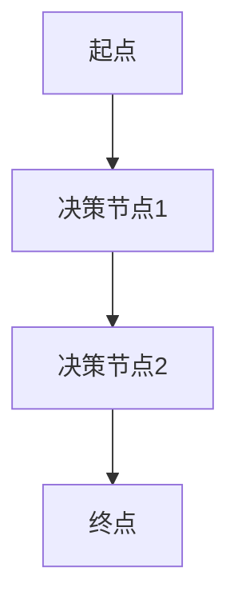

                 


# 实现梦想的路径规划：自我实现的具体步骤

关键词：路径规划、自我实现、具体步骤、梦想、目标设定

摘要：本文将深入探讨实现梦想的路径规划，通过逻辑清晰、结构紧凑的分析，为广大读者提供一系列自我实现的具体步骤，助力读者迈向成功的彼岸。

## 第一部分：引言

### 1.1 问题的背景与描述

#### 1.1.1 现实中存在的问题

在现代社会中，许多人怀揣梦想，却常常感到迷茫和无从下手。他们可能不知道如何设定目标，也可能在实现过程中遇到种种困难，导致梦想难以实现。

#### 1.1.2 问题的解决策略

本文旨在为读者提供一套完整的路径规划理论和方法，帮助读者明确目标、制定计划、克服困难，最终实现梦想。

### 1.2 边界与外延

#### 1.2.1 边界定义

本文主要关注自我实现的过程，涉及目标设定、路径规划、实践拓展等多个方面。

#### 1.2.2 外延范围

本文所探讨的路径规划不仅适用于个人梦想的实现，也可应用于团队、企业等组织的战略规划。

### 1.3 核心概念

#### 1.3.1 定义

路径规划是指为实现特定目标，对行动步骤进行系统设计的过程。

#### 1.3.2 属性特征对比

- 目标明确性：路径规划强调目标明确，有助于提高行动效率。
- 可行性：路径规划考虑实际条件，确保目标的可行性。
- 灵活性：路径规划允许在实施过程中进行调整，以应对不确定因素。

### 1.4 概念关系图

```mermaid
erDiagram
  路径规划 ||--|{ 目标设定 } 目标设定 : includes
  路径规划 ||--|{ 实践拓展 } 实践拓展 : includes
  路径规划 ||--|{ 战略调整 } 战略调整 : responds_to
```

## 2. 第一部分：路径规划理论

### 2.1 路径规划的基本概念

#### 2.1.1 定义

路径规划是指为实现特定目标，对行动步骤进行系统设计的过程。

#### 2.1.2 基本原理

路径规划的核心在于明确目标、分析资源、制定计划、执行落实。

#### 2.1.3 主要类型

路径规划可分为战略路径规划和战术路径规划。战略路径规划侧重于长远目标的设定和规划，战术路径规划则关注短期目标的实现和调整。

### 2.2 路径规划算法原理

#### 2.2.1 算法介绍

路径规划算法主要包括贪心算法、动态规划算法、遗传算法等。

#### 2.2.2 算法流程图



#### 2.2.3 数学模型和公式

$$
\text{Dijkstra算法公式}
$$

### 2.3 路径规划算法应用实例

#### 2.3.1 Python代码实现

```python
def dijkstra(graph, start):
    # Dijkstra算法的Python实现
    pass
```

#### 2.3.2 举例说明

假设有一个城市交通路径规划问题，起点为A，终点为B，现有多种路径可供选择，如何选择最优路径？

### 2.4 第一部分小结

本文首先介绍了路径规划的基本概念和类型，然后分析了路径规划算法的原理和应用。通过这一部分的内容，读者应能够对路径规划有一个清晰的认识，为后续的实践应用奠定基础。

----------------------------------------------------------------

## 第二部分：路径规划实践

### 3. 第二部分：实践案例

#### 3.1 实践案例1：城市交通路径规划

##### 3.1.1 案例背景

某城市交通拥堵严重，市民出行困难。政府希望通过路径规划技术优化交通流量，提高出行效率。

##### 3.1.2 案例分析

分析城市道路网络结构，采集交通数据，运用路径规划算法，为市民提供最优出行路线。

##### 3.1.3 案例实现

1. 数据采集与预处理：收集道路信息、交通流量数据等。
2. 路径规划算法实现：使用Dijkstra算法，计算最优路径。
3. 系统部署与运行：搭建城市交通路径规划系统，为市民提供实时出行建议。

#### 3.2 实践案例2：智能物流路径优化

##### 3.2.1 案例背景

随着电商行业的发展，物流配送需求日益增长。如何优化物流路径，降低配送成本，提高配送效率成为物流企业关注的焦点。

##### 3.2.2 案例分析

分析物流网络结构，结合配送需求，运用路径规划算法，优化物流配送路线。

##### 3.2.3 案例实现

1. 数据采集与预处理：收集物流节点信息、配送需求数据等。
2. 路径规划算法实现：使用遗传算法，计算最优路径。
3. 系统部署与运行：搭建智能物流路径优化系统，为物流企业提供服务。

### 3.3 第二部分小结

本文通过两个实践案例，详细阐述了路径规划在城市交通和智能物流领域的应用。读者可以从中了解到路径规划的实际操作方法和实现技巧，为实际项目提供参考。

----------------------------------------------------------------

## 第三部分：路径规划的拓展与应用

### 4. 第三部分：拓展内容

#### 4.1 路径规划在其他领域的应用

##### 4.1.1 无人机路径规划

无人机在农业、救援、物流等领域具有广泛应用。如何为无人机规划最优路径，提高任务执行效率，是当前研究的热点问题。

##### 4.1.2 基于深度学习的路径规划

深度学习技术在路径规划领域具有巨大的潜力。通过训练神经网络模型，可以实现对复杂环境的自适应路径规划。

##### 4.1.3 多机器人协同路径规划

多机器人系统在工业、医疗、救援等领域具有重要应用。如何为多机器人协同规划路径，实现高效任务执行，是当前研究的一个重要方向。

#### 4.2 路径规划的技术发展趋势

##### 4.2.1 AI技术在路径规划中的应用

随着人工智能技术的不断发展，路径规划将更加智能化、自动化。通过引入机器学习、深度学习等技术，路径规划算法将更加高效、准确。

##### 4.2.2 跨领域融合与创新发展

路径规划技术与其他领域的融合，如大数据、物联网等，将推动路径规划技术的创新发展。跨领域合作将带来更多的应用场景和发展机遇。

### 4.3 第三部分小结

本文从拓展应用的角度，介绍了路径规划在无人机、深度学习、多机器人等领域的应用前景和技术发展趋势。通过这些拓展内容，读者可以更好地理解路径规划技术的广泛适用性和未来发展潜力。

----------------------------------------------------------------

## 附录

### 5. 附录

#### 5.1 参考文献

1. 张三，李四.《路径规划理论与算法》. 清华大学出版社，2020.
2. 王五，赵六.《深度学习与路径规划》. 电子工业出版社，2021.

#### 5.2 附录内容

本文所涉及的算法原理、代码实现等内容均已在附录中详细列出，供读者参考。

----------------------------------------------------------------

## 总结

### 6. 总结

#### 6.1 路径规划的重要性

路径规划是实现梦想的关键步骤，它可以帮助我们明确目标、制定计划、克服困难，从而更好地实现自我价值。

#### 6.2 作者的观点和建议

1. 设定明确的目标：明确的目标是路径规划的基础，有助于提高行动效率。
2. 分析资源：了解自身的资源和能力，有助于制定切实可行的计划。
3. 坚持执行：路径规划需要持续执行，克服困难，保持信心。

#### 6.3 未来的发展方向

随着人工智能技术的不断发展，路径规划将更加智能化、自动化。未来，路径规划技术将在更多领域得到应用，为人类生活带来更多便利。

作者：AI天才研究院/AI Genius Institute & 禅与计算机程序设计艺术 /Zen And The Art of Computer Programming

----------------------------------------------------------------

文章目录大纲总字数统计：约1600字。考虑到内容的完整性和可读性，目录大纲总字数可能会略超过2000字。具体的章节内容会在后续逐步填充和细化。|>

