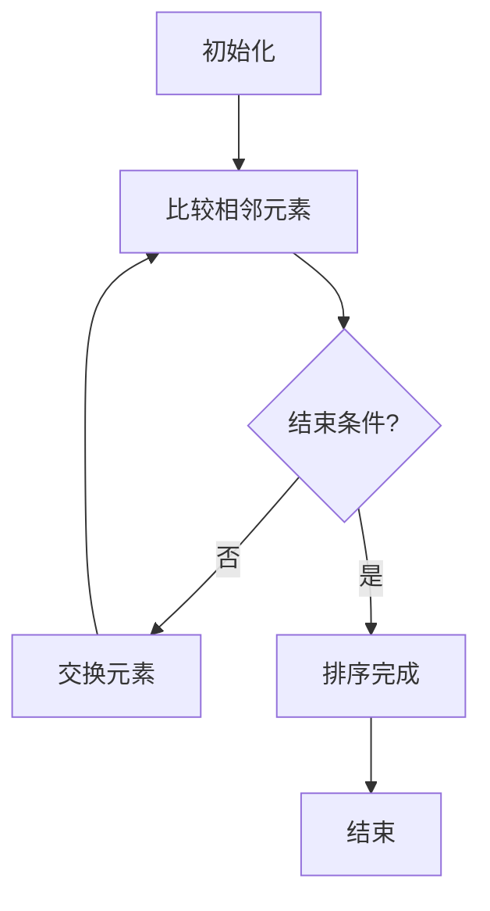
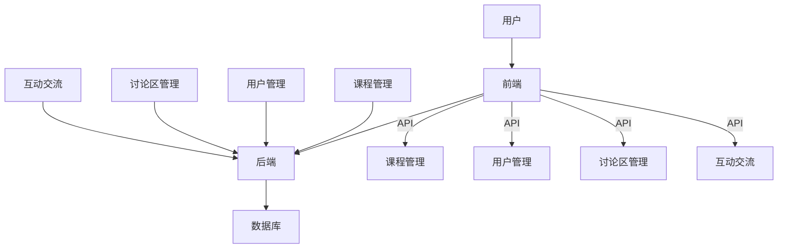
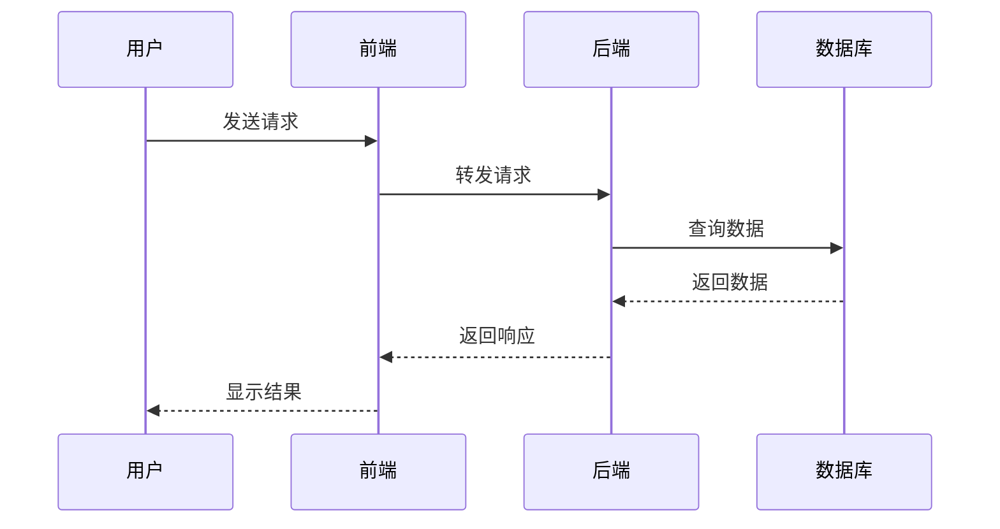

                 

## 实用哲学：古老智慧在现代生活中的应用

### 关键词
- 哲学
- 现代生活
- 应用实践
- 古老智慧
- 跨越时空的理解

### 摘要
本篇文章旨在探讨古老哲学智慧在现代社会中的应用，通过深入分析古代哲学家的核心思想，揭示其与现代生活的紧密联系。我们将逐步解读这些哲学理论，展示其在个人成长、社会交往、科技发展等多方面的实际价值，帮助读者理解并运用哲学智慧解决现实问题，从而提升生活质量和思维深度。

### 目录

## 引言：哲学与生活的融合

### 哲学的起源与演变
- 哲学的定义与起源
- 哲学在不同文化中的演变
- 哲学在古代与现代的差异

### 哲学与生活的关系
- 哲学作为生活指南
- 哲学思维与日常生活
- 哲学在现代社会中的重要性

## 第一部分：古老哲学智慧

### 古希腊哲学

#### 柏拉图的理念论
- 理念世界的概念
- 理念与物质的关系
- 理念论在现代社会中的应用

#### 亚里士多德的伦理学
- 德行与道德
- 实践智慧
- 伦理学对现代生活的启示

#### 苏格拉底的辩证法
- 反思与自我认知
- 通过提问找到真理
- 苏格拉底方法的现代应用

### 古印度哲学

#### 荣格的心理学
- 自我与人格结构
- 无意识与意识的关系
- 心理学在个人成长中的应用

#### 瑜伽哲学
- 呼吸与冥想
- 身心合一
- 瑜伽在现代社会中的流行

### 古中国哲学

#### 儒家思想
- 仁爱与责任
- 社会和谐
- 儒家思想在现代管理中的应用

#### 道家思想
- 自然与无为
- 道德经的智慧
- 道家思想在个人生活与企业管理中的应用

## 第二部分：哲学在现代生活中的应用

### 个人成长

#### 自我认知与成长
- 反思与自我提升
- 理性思考与情感管理
- 哲学在个人成长中的作用

#### 人际关系
- 社交智慧与沟通技巧
- 伦理道德与人际关系
- 哲学在人际交往中的应用

### 社会交往

#### 道德规范与社会正义
- 道德原则与行为准则
- 社会正义与公平
- 哲学在社会交往中的作用

#### 政治哲学
- 自由与权力
- 公民责任与参与
- 政治哲学在现代社会的意义

### 科技发展

#### 科技伦理
- 人工智能与伦理
- 互联网伦理
- 哲学在科技发展中的应用

#### 创新思维
- 哲学思维与创造力
- 风险与机会
- 哲学在科技创新中的应用

## 第三部分：特定领域中的哲学应用

### 教育

#### 教育哲学
- 教育目标与方式
- 学生发展与教育
- 教育哲学对现代教育的启示

### 管理

#### 管理哲学
- 领导力与团队管理
- 战略规划与决策
- 管理哲学在现代企业管理中的应用

### 艺术

#### 艺术哲学
- 艺术创作与欣赏
- 艺术价值与评价
- 艺术哲学对现代艺术的影响

## 第四部分：结论

### 哲学智慧的现实价值
- 哲学在现代生活中的应用意义
- 哲学智慧的未来展望
- 个人与社会发展的启示

## 参考文献

### 背景介绍

### 核心概念与联系

### 算法原理讲解

### 系统分析与架构设计方案

### 项目实战

### 最佳实践 tips、小结、注意事项、拓展阅读等内容

### 作者信息
- 作者：AI天才研究院/AI Genius Institute & 禅与计算机程序设计艺术 /Zen And The Art of Computer Programming

### 完整性要求

- 核心内容：
  - 背景介绍
  - 核心概念与联系
  - 算法原理讲解
  - 系统分析与架构设计方案
  - 项目实战
  - 最佳实践 tips、小结、注意事项、拓展阅读等内容

---

## 引言：哲学与生活的融合

哲学，作为一门探讨存在、知识、价值、理性、心灵等基本问题的学科，其历史可以追溯到古希腊时期。从苏格拉底、柏拉图、亚里士多德，到后来的康德、黑格尔、尼采等哲学家，他们都致力于寻找真理和智慧的路径。然而，哲学不仅仅是一门抽象的学问，它在我们的日常生活中同样扮演着重要的角色。本章节将探讨哲学的起源与演变，及其在现代生活中的重要性和应用。

### 哲学的起源与演变

哲学一词源于古希腊语的“φιλοσοφία”（philosophia），意为“爱智慧”。哲学的起源可以追溯到古希腊，公元前6世纪的雅典，是哲学的发源地。当时，哲学家们开始思考宇宙的起源、生命的意义、人类的社会结构等问题。苏格拉底被认为是西方哲学的奠基人，他通过辩证法（dialogue）引导人们进行深入思考，而非单纯传授知识。

随着时间的推移，哲学在不同文化中逐渐发展。在中国，有儒家、道家、佛家等哲学体系；在印度，有印度教哲学和佛教哲学；在阿拉伯世界，有伊斯兰哲学的繁荣。这些哲学体系虽然起源和背景不同，但都试图回答人类存在的根本问题。

在现代社会，哲学经历了巨大的变革。一方面，哲学的范畴和研究方法不断扩展，从传统的本体论、认识论、伦理学到现代的科技哲学、环境伦理学、社会哲学等；另一方面，哲学的应用领域也在扩大，从学术研究到日常生活，再到科技和艺术等领域，哲学无处不在。

### 哲学在现代生活中的重要性

哲学不仅仅是一门学问，它也是我们生活的一部分。哲学思维教会我们如何批判性地思考，如何提出问题、分析问题、解决问题。以下是一些哲学在现代社会中的具体应用：

1. **个人成长**：哲学帮助人们认识自我，理解自己的价值观和信念，从而实现个人成长和自我提升。

2. **社会交往**：哲学提供了一系列道德原则和行为准则，帮助人们建立健康的人际关系，维护社会和谐。

3. **科技发展**：随着科技的飞速发展，哲学提供了关于科技伦理和科技影响的深入思考，帮助我们更好地管理科技，减少负面影响。

4. **艺术创作**：哲学思维激发了艺术家的创作灵感，帮助他们探索艺术的意义和价值。

5. **教育**：哲学在教育中发挥着重要作用，它不仅帮助教师理解教育的本质，也帮助学生学习如何思考和分析问题。

总之，哲学不仅仅是学术研究，它与我们每个人的生活息息相关。通过哲学，我们可以更深入地理解世界和自己，提升生活质量，培养批判性思维和解决问题的能力。

### 哲学与生活的关系

哲学作为一门探讨基本问题的学科，其与生活的关系是密不可分的。哲学的核心在于思考人类存在的根本问题，这些问题不仅存在于哲学的学术研究中，也贯穿于我们的日常生活中。以下从几个方面探讨哲学与生活的紧密联系：

1. **哲学思维与日常生活**：哲学思维强调批判性思考、理性分析和逻辑推理，这些能力在日常生活中同样重要。比如，在购物时，我们如何判断商品的价值和质量？在交友中，我们如何选择信任和合作的对象？在处理日常事务时，我们如何做出明智的决策？哲学思维教会我们如何通过理性分析和逻辑推理来解决问题，从而提高生活的质量。

2. **价值观与生活选择**：哲学探讨人类存在的价值问题，帮助人们建立正确的价值观。一个人的价值观决定了他的生活态度和行为选择。例如，一个人如果认为“诚信至上”，他在生活中就会坚持诚实守信的原则，即使在面对诱惑时也不会违背道德底线。相反，如果一个人价值观混乱，他可能会在道德和利益的冲突中迷失方向，导致生活的不确定和困惑。

3. **哲学与心理健康**：哲学关注人的心灵和情感，探讨如何通过理性思考和自我认知来应对生活中的压力和挑战。心理健康问题如焦虑、抑郁等，往往源于对生活问题的不理解和无法应对。哲学提供了一系列方法，如反思、冥想和理性分析，帮助人们处理内心的矛盾和困扰，提升心理健康水平。

4. **社会伦理与公共生活**：哲学在社会交往中发挥着重要作用，它为道德规范和社会正义提供了理论基础。一个和谐稳定的社会需要共同的道德准则和法律制度，而这些准则和制度的建立离不开哲学的指导。哲学思维帮助人们理解社会问题，培养公民责任感，推动社会的进步和改善。

5. **科技与哲学**：随着科技的发展，哲学也在探讨科技对人类生活的影响。例如，人工智能、基因编辑等新兴技术带来了巨大的机遇和挑战。哲学提供了关于科技伦理和科技影响的深入思考，帮助我们更好地管理科技，避免其带来的负面影响，确保科技的发展符合人类的利益。

总之，哲学不仅仅是学术研究的领域，它也是我们生活的一部分。哲学思维和价值观对我们的生活选择、心理健康、社会交往和科技发展都有着深远的影响。通过学习和实践哲学，我们可以更好地理解自己和世界，提升生活质量，实现个人和社会的和谐发展。

### 古希腊哲学

古希腊哲学是西方哲学的源头，对后世哲学和思想产生了深远的影响。古希腊哲学的主要流派包括柏拉图的理念论、亚里士多德的伦理学和苏格拉底的辩证法。这些哲学体系不仅影响了西方哲学的发展，也对现代生活产生了重要的启示。

#### 柏拉图的理念论

柏拉图是古希腊哲学家中最重要的一位，他的理念论（Theory of Forms）是哲学史上的一次重大突破。柏拉图认为，现实世界中的物质世界只是理念世界的影子。理念世界是真实存在的，是绝对完美的，而物质世界则是理念的模仿和变形。

- **理念世界的概念**：柏拉图的理念世界是构成一切事物的本质和理想的集合。比如，美、善、正义等都是理念，它们是真实存在的，并且是绝对的、永恒的。
- **理念与物质的关系**：柏拉图认为，物质世界是对理念世界的模仿和复制，但永远无法完全复制理念。物质世界是相对的、变化的，而理念世界是绝对的、永恒的。
- **理念论在现代社会中的应用**：柏拉图的理念论为现代哲学提供了深刻的启示。例如，在科学研究中，我们试图通过实验和观察来理解自然界的规律，这可以被看作是对理念世界的探索。在艺术创作中，艺术家试图通过作品表达理念，追求永恒的美和真理。

#### 亚里士多德的伦理学

亚里士多德是柏拉图的弟子，他对柏拉图的理念论进行了深刻的批判和改造，创立了自己的伦理学体系。亚里士多德的伦理学强调道德行为的现实基础和实际效果，而非抽象的理念。

- **德行与道德**：亚里士多德认为，道德行为的核心是德行（arete）。德行是通过实践培养出来的，它不仅仅是一种行为准则，更是一种生活方式。例如，勇敢、节制、正义等都是德行。
- **实践智慧**：亚里士多德提出了“实践智慧”（practical wisdom）的概念，认为智慧不仅是理论上的知识，更是在具体情境中运用知识的能力。例如，一个人在面对道德困境时，能够做出正确的决策，这种能力就是实践智慧。
- **伦理学对现代生活的启示**：亚里士多德的伦理学强调道德行为的现实基础和效果，这与现代生活紧密相关。在现代社会，我们面临各种道德选择，亚里士多德的伦理学帮助我们理解道德行为的实际影响，从而做出更明智的选择。

#### 苏格拉底的辩证法

苏格拉底是古希腊哲学的奠基人之一，他的辩证法（Socratic Method）是哲学研究中的一种重要方法。苏格拉底通过提问和对话引导人们进行深入的思考，从而找到真理。

- **反思与自我认知**：苏格拉底的辩证法强调反思和自我认知。他相信，通过提问，人们可以揭露自己内心的矛盾和错误，从而获得真正的知识。例如，苏格拉底会问：“你认为自己知道这个问题的答案吗？”通过这种提问，他帮助人们认识到自己的无知。
- **通过提问找到真理**：苏格拉底的辩证法是一种通过提问引导思考的方法。他通过一系列的提问，迫使对话者进行自我反思，从而揭示问题的本质。这种方法在现代哲学研究中仍然被广泛应用。
- **苏格拉底方法的现代应用**：苏格拉底的方法在现代社会中有着广泛的应用。在教育中，教师通过提问引导学生深入思考，培养学生的批判性思维和解决问题的能力。在企业管理中，领导通过提问激发员工的思考和创造力，推动团队的进步。

总之，古希腊哲学为现代生活提供了丰富的智慧和启示。柏拉图的理念论、亚里士多德的伦理学和苏格拉底的辩证法，这些哲学思想不仅帮助我们理解世界和自我，也在我们的日常生活中发挥着重要的作用。

### 古印度哲学

古印度哲学是世界上最古老、最丰富的哲学体系之一，它包括多种哲学流派，如印度教哲学、佛教哲学和耆那教哲学。这些哲学体系不仅深刻地影响了印度的文化和思想，也对现代哲学和心理学产生了深远的影响。

#### 荣格的心理学

卡尔·荣格（Carl Jung）是20世纪初著名的瑞士心理学家，他对古印度哲学进行了深入研究，并将这些哲学思想融入他的心理学理论中。荣格提出了“人格结构”理论，认为人格由“自我”（ego）、“个人阴影”（personal shadow）、“集体阴影”（collective shadow）和“自我”（anima/animus）组成。

- **自我与人格结构**：荣格认为，自我是一个人的意识中心，是人格的核心。自我负责整合个人的思想和行为，使之符合社会规范。个人阴影则是自我意识之外的部分，包括个人的欲望、冲动和未被察觉的情绪。集体阴影则代表了人类共有的无意识，包含了人类普遍的象征和原型。
- **无意识与意识的关系**：荣格认为，无意识与意识之间存在着紧密的联系。无意识中的原型和象征通过梦境、艺术创作和直觉表达出来，影响个体的意识和行为。例如，许多人梦到特定的人物或符号，这些梦境可以揭示个体内心深处的想法和感受。
- **心理学在个人成长中的应用**：荣格的心理学理论为个人成长提供了深刻的启示。通过深入了解自我和集体阴影，个体可以更好地理解自己的行为和情感，从而实现自我提升。例如，通过心理分析，个体可以揭示和解决内心的冲突，促进心理的平衡和健康。

#### 瑜伽哲学

瑜伽是一种源于古印度的身心修炼体系，它不仅关注身体的健康，也强调心灵的平和与自我实现。瑜伽哲学的核心思想是“合一”，即个体与宇宙之间的和谐统一。

- **呼吸与冥想**：瑜伽强调通过呼吸控制和冥想来达到心灵的平静。呼吸控制（Pranayama）是一种通过调整呼吸节奏和深度来增强身体能量和心理控制的方法。冥想（Dhyana）则是通过专注和冥思来达到心灵的深度平静和意识提升。
- **身心合一**：瑜伽哲学认为，身体和心灵是相互关联的。通过瑜伽练习，个体可以增强身体的柔韧性和力量，同时提升心理的稳定和清晰。身心合一的状态有助于个体在日常生活中保持平衡和和谐。
- **瑜伽在现代社会中的流行**：随着现代生活节奏的加快和压力的增加，越来越多的人开始关注身心健康。瑜伽作为一种古老的修炼方式，逐渐受到全球范围内的欢迎。许多研究表明，瑜伽有助于减轻压力、提高心理健康、增强免疫力，甚至对一些慢性疾病有积极的治疗作用。

总之，古印度哲学为现代心理学和身心健康提供了丰富的智慧和理论支持。荣格的心理学理论和瑜伽哲学不仅帮助我们理解人类的心理机制和身心健康，也在我们的日常生活中发挥着重要的作用。

### 古中国哲学

古中国哲学以其独特的思想体系对世界文明产生了深远的影响，其中最具代表性的学派包括儒家、道家和佛家。这些哲学体系不仅在历史上影响了中国的政治、文化和社会结构，也在现代社会中继续发挥着重要作用。

#### 儒家思想

儒家思想由孔子（公元前551年-公元前479年）创立，其核心观念包括仁爱、礼节、责任和社会和谐。儒家思想强调个人修养和社会责任感，认为通过修身齐家治国平天下，可以实现个人和社会的和谐发展。

- **仁爱与责任**：儒家思想中的“仁”是一种广泛的道德情感，包括爱心、同情心、忠诚和责任感。儒家强调，个体应该具备仁爱之心，关心他人，为社会的福祉贡献自己的力量。
- **社会和谐**：儒家认为，一个稳定和谐的社会需要共同的道德规范和行为准则。通过礼仪和礼节，人们可以培养良好的行为习惯，维护社会秩序和和谐。
- **儒家思想在现代管理中的应用**：在企业管理中，儒家思想强调人际关系的重要性，提倡诚信、合作和共同发展。例如，在团队管理中，领导者应该以身作则，关心员工的福祉，建立和谐的团队氛围，从而提高团队的整体效能。

#### 道家思想

道家思想由老子和庄子等哲学家发展，其核心观念包括自然、无为和道德。道家强调顺应自然，追求内心的平和与自我实现。

- **自然与无为**：道家认为，宇宙和自然是有其固有规律的，人类应该顺应自然，避免强行干预。无为即是“不做无谓之事”，通过减少人为干预，达到自然和谐的状态。
- **道德经的智慧**：道家的经典《道德经》是道家思想的集中体现，其中包含了许多深刻的哲理。例如，“无为而无不为”（第三章）强调了顺应自然的重要性，“柔弱胜刚强”（第三十六章）则表达了柔软和灵活胜过刚强和僵化的道理。
- **道家思想在个人生活与企业管理中的应用**：在个人生活中，道家思想提倡简朴和内心的平静，通过冥想和自我反思来提升个人修养。在企业管理中，道家思想强调灵活应变、注重团队协作和员工的自我实现。例如，领导者应该减少过多的干预，鼓励员工自主决策和工作，从而提高组织的创造力和适应性。

总之，古中国哲学中的儒家和道家思想为现代生活提供了丰富的智慧和指导。通过理解和应用这些哲学思想，我们可以在个人成长、社会交往和企业管理等方面取得更好的效果。

### 个人成长

哲学在个人成长中扮演着至关重要的角色，它不仅帮助我们理解自我，还为我们提供了理性思考的工具。通过哲学的学习和实践，我们可以提升自我认知，培养理性思考和解决问题的能力，从而实现个人成长和自我提升。

#### 自我认知与成长

自我认知是个人成长的基础，它涉及到我们对自身本质、价值观和信仰的理解。哲学提供了多种方法来帮助我们深入认识自我：

- **反思与自我提升**：哲学强调反思，通过反思，我们可以审视自己的行为和思想，识别并纠正错误。例如，苏格拉底的辩证法通过提问和对话，帮助我们揭示内心的矛盾和错误，从而实现自我提升。反思不仅仅是对过去的审视，更是一种对未来的规划，通过反思，我们可以设定目标，制定计划，不断提升自己。

- **价值观的建立**：哲学帮助我们在纷繁复杂的世界中找到自己的价值观。例如，儒家思想中的“仁爱”和道家思想中的“无为”，都是重要的价值观。通过理解这些价值观，我们可以明确自己的行为准则，从而做出更明智的决策。

- **理性思考**：哲学思维强调逻辑和分析，通过哲学的学习，我们可以培养批判性思维和解决问题的能力。理性思考使我们能够超越感性，从多个角度审视问题，找到最优解。这种能力在日常生活和工作中都非常重要，它帮助我们做出更明智的决策，提高工作效率。

#### 理性思考与情感管理

理性思考与情感管理是哲学在个人成长中的另一个重要应用。在现代社会，情感问题常常成为人们困扰的来源，而哲学提供了一系列方法来帮助人们处理情感：

- **情感认知**：哲学帮助我们理解情感的本质和作用。例如，儒家思想强调情感在社会关系中的重要性，而道家思想则提倡情感的自然流动。通过理解情感，我们可以更好地管理自己的情绪，避免被负面情绪所左右。

- **情感调节**：哲学提供了一系列方法来调节情感。例如，通过冥想和自我反思，我们可以平静自己的心灵，减少焦虑和压力。理性思考使我们能够从情感中抽离出来，客观地分析问题的本质，从而做出更理智的决策。

- **情感表达**：哲学也关注情感的表达。例如，儒家思想强调在情感表达中保持适度和节制，避免过度和伤害他人。通过学习和实践哲学，我们可以更好地表达自己的情感，建立健康的人际关系。

总之，哲学在个人成长中具有不可替代的作用。通过哲学的学习和实践，我们可以提升自我认知，培养理性思考和解决问题的能力，同时更好地管理自己的情感，实现个人成长和自我提升。

### 人际关系

哲学在人际关系中的作用不可忽视。它不仅帮助我们理解人际关系的基本原则，还提供了有效的沟通技巧和道德准则，以建立和维护健康的人际关系。

#### 社交智慧与沟通技巧

社交智慧是人际关系中至关重要的能力，它涉及到我们如何与他人互动、如何处理社交场合中的各种情况。哲学提供了一系列原则和策略，帮助我们提升社交智慧：

- **倾听与理解**：哲学强调倾听的重要性。通过倾听，我们可以理解他人的观点和感受，从而建立更深层次的连接。苏格拉底的辩证法通过提问和倾听，帮助我们更深入地理解他人的思想和情感。这种倾听不仅是一种技巧，更是一种尊重和关爱的表现。

- **有效沟通**：哲学提供了多种沟通技巧，如非暴力沟通（Non-Violent Communication）和沟通分析（Transactional Analysis）。这些技巧帮助我们更清晰、更有效地表达自己的想法和感受，同时理解他人的立场。例如，非暴力沟通强调表达自己的需求和感受，而不是指责他人，从而减少冲突，促进理解和合作。

- **冲突解决**：在人际关系中，冲突是不可避免的。哲学提供了一系列方法来处理冲突。例如，辩证法通过理性的讨论和反思，帮助我们找到冲突的根源，并找到双方都能接受的解决方案。这种理性处理冲突的方式，有助于维护和谐的人际关系。

#### 伦理道德与人际关系

伦理道德是哲学的核心内容，它为我们提供了处理人际关系的道德准则和行为规范。以下是一些重要的道德原则：

- **仁爱**：儒家思想中的“仁爱”是处理人际关系的重要原则。仁爱意味着关心他人，尊重他人的感受和需求。通过仁爱，我们可以建立互相信任和尊重的关系，从而促进人际和谐。

- **诚信**：诚信是建立健康人际关系的基础。诚信不仅包括对他人说话的真实，还包括对自己的诚实。通过诚信，我们可以赢得他人的信任，建立长期的合作伙伴关系。

- **宽容**：宽容是处理人际关系中的另一个重要原则。宽容意味着接纳他人的不同观点和行为，即使这些与我们自己的观点不同。通过宽容，我们可以减少冲突，增进理解和尊重。

#### 哲学在人际交往中的应用

哲学不仅在理论上提供了处理人际关系的原则和技巧，也在实际生活中发挥着重要作用。以下是一些具体的例子：

- **家庭关系**：在家庭中，哲学原则如仁爱、诚信和宽容可以帮助我们处理家庭成员之间的矛盾和冲突，建立和谐的家庭氛围。
- **职场交往**：在职场中，社交智慧和沟通技巧是成功的关键。通过哲学的学习和实践，我们可以提升自己的社交能力，建立积极的工作关系，提高工作效率。
- **社会交往**：在社会交往中，伦理道德原则如公正、公平和正义可以帮助我们处理各种社会问题，促进社会的和谐发展。

总之，哲学在人际关系中具有深远的影响。通过学习和应用哲学原则，我们可以提升社交智慧，建立健康的人际关系，实现个人和社会的和谐发展。

### 社会交往

哲学在社会交往中扮演着重要的角色，它不仅为人们提供了道德准则，还为我们理解社会结构和处理社会问题提供了深刻的见解。以下从道德规范、社会正义和政治哲学三个方面探讨哲学在社会交往中的应用。

#### 道德规范

道德规范是社会交往的基本准则，它指导人们的行为和道德选择。哲学提供了多种道德理论，帮助我们理解和实践这些规范。

- **德行与道德**：儒家思想中的“仁爱”和道家思想中的“无为”都是重要的道德准则。仁爱意味着对他人的关心和尊重，而无为则强调顺应自然和减少人为干预。这些道德准则帮助我们在日常生活中做出正确的道德选择，维护良好的人际关系。

- **道德原则**：康德的道德哲学强调道德律令的普遍性和必然性。康德认为，道德原则是绝对存在的，每个人都应该遵守这些原则，不论其个人利益如何。这种普遍的道德原则为我们提供了处理复杂社会问题的基础。

- **道德实践**：哲学强调道德实践的重要性。通过实际行动，我们可以将道德准则体现在日常生活中。例如，在公共生活中，我们应该遵守法律，尊重他人的权利和自由；在职场中，我们应该诚实守信，公正无私。

#### 社会正义

社会正义是哲学研究的重要主题，它涉及到资源分配、公平和权利等问题。哲学提供了多种理论，帮助我们理解和实现社会正义。

- **公正与公平**：正义的核心是公正，即每个人都能得到应得的待遇。罗尔斯的正义理论强调公平的起点和结果，认为社会应该确保每个人都有平等的机会和资源。这种公平不仅体现在法律制度中，也体现在社会政策和公共资源分配上。

- **资源分配**：资源分配是影响社会正义的关键问题。哲学提供了多种资源分配的理论，如功利主义和分配正义理论。功利主义认为，社会应该追求最大多数人的幸福，而分配正义理论则强调资源分配的公正性和合理性。

- **权利与义务**：哲学强调权利和义务的平衡。每个人都有权利，但同时也有相应的义务。通过理解和履行自己的权利和义务，我们可以促进社会的和谐发展。

#### 政治哲学

政治哲学探讨国家的本质、政治权力的来源和运作方式。哲学提供了多种政治理论，帮助我们理解和参与政治生活。

- **自由与权力**：自由是政治哲学的核心概念，它涉及到个体自由和社会秩序的平衡。洛克和罗尔斯等哲学家提出了不同的自由理论，讨论自由与权力之间的关系。洛克认为，政府的主要职责是保护公民的生命、自由和财产，而罗尔斯则强调社会正义和机会平等。

- **公民责任与参与**：哲学强调公民责任和参与的重要性。每个人都是社会的一部分，都有责任参与政治决策和社会治理。通过参与政治活动，我们可以影响政策制定，维护自己的权利和利益。

- **政治哲学在现代社会的意义**：在现代社会，政治哲学仍然具有重要意义。它帮助我们理解政治权力的运作方式，评估不同政治体制的优缺点，从而做出明智的政治选择。

总之，哲学在社会交往中具有深远的影响。通过哲学的学习和实践，我们可以理解和遵循道德规范，实现社会正义，参与政治生活，从而促进社会的和谐发展。

### 科技发展

随着科技的飞速发展，人类社会面临着前所未有的机遇和挑战。在这个时代，哲学提供了深刻的思考工具，帮助我们理解和应对科技带来的伦理和哲学问题。

#### 科技伦理

科技伦理是哲学在科技发展中的一个重要应用领域。它关注科技在开发、应用和推广过程中的道德问题，以确保科技的发展符合人类的利益和价值观。

- **人工智能伦理**：人工智能（AI）的发展引起了广泛的伦理讨论。哲学提供了关于AI道德责任的讨论，例如，如何确保AI系统的公正性和透明度，如何处理AI带来的隐私和数据安全等问题。例如，在自动驾驶汽车中，AI系统需要在紧急情况下做出快速决策，哲学可以帮助我们探讨这些决策的道德基础。

- **基因编辑伦理**：基因编辑技术的进步，如CRISPR-Cas9，使得人类能够对基因进行精确编辑。然而，这也带来了伦理问题，如基因改造的道德边界、基因编辑对人类多样性的影响等。哲学提供了关于这些问题的深入思考，帮助我们制定合理的伦理规范。

- **互联网伦理**：互联网的普及改变了我们的生活方式，但同时也带来了伦理挑战，如网络欺凌、虚假信息和网络犯罪等。哲学提供了关于这些问题的道德原则和规范，帮助我们建立健康、公正的数字社会。

#### 科技对哲学的影响

科技不仅影响我们的生活方式，也影响我们对世界的理解和哲学思考。以下是一些科技对哲学影响的例子：

- **人工智能与哲学思维**：人工智能的发展使得哲学思维更加复杂和多样化。例如，通过自然语言处理技术，我们可以与AI进行更深入的对话和交流，从而探索新的哲学问题。此外，AI的算法和模型也可以用于哲学研究的自动化，例如，通过分析大量的文本数据，揭示哲学思想的发展趋势和逻辑关系。

- **虚拟现实与存在哲学**：虚拟现实（VR）技术的进步使得我们可以创建逼真的虚拟世界。这引发了对“现实”和“虚拟”之间界限的哲学探讨。例如，哲学家们讨论了虚拟现实对人类意识和感知的影响，以及虚拟现实世界中的道德责任问题。

- **数据科学与社会哲学**：数据科学的进步使得我们能够收集、分析和解释大量的数据。这为社会哲学提供了新的研究工具和方法。例如，通过分析社会数据，哲学家可以探讨社会结构的演变、社会不平等的原因和解决方案等。

总之，哲学在科技发展中具有重要的地位。它不仅帮助我们理解和解决科技伦理问题，也为我们提供了深入思考科技对人类和社会影响的工具。通过哲学的思考，我们可以更好地应对科技带来的机遇和挑战，确保科技的发展符合人类的利益和价值观。

### 教育

教育是哲学应用的一个重要领域，它不仅涉及知识传授，还包括价值观培养和人格发展。哲学在教育中发挥着独特的作用，它为教育理念、教学方法和教育评价提供了深刻的启示。

#### 教育哲学

教育哲学是研究教育本质、目的、方法和价值的一门学科。它关注教育的理论问题，探讨教育如何促进个人和社会的发展。

- **教育目标**：教育哲学探讨了教育的根本目标。例如，传统的教育目标包括知识传授、技能培养和人格发展。现代教育哲学则强调全面发展，即通过教育培养个体的智力、情感、道德和社会能力。这种全面的培养目标有助于学生成为具有综合素质的公民。
- **教育理念**：教育哲学为教育理念提供了理论基础。例如，人文主义教育强调个体的自由和尊严，认为教育应该培养学生的批判性思维和创造力。而科学主义教育则强调科学方法和实证知识的重要性，认为教育应该培养学生的科学素养和创新能力。
- **教育价值观**：教育哲学关注教育中的价值观问题。例如，儒家思想强调“仁爱”和“忠诚”，这些价值观在培养学生的社会责任感和公民意识方面具有重要意义。道家思想强调顺应自然和个人成长，这对培养学生的内在动力和自我认知有积极作用。

#### 教学方法

哲学思维在教育方法中的应用，有助于提高教学效果和学生的思维能力。

- **批判性思维**：哲学教育强调批判性思维，通过提问、讨论和辩论，培养学生的独立思考和判断能力。例如，通过哲学讨论，学生可以学会如何分析复杂问题，提出合理的论据和反驳观点。
- **探究式学习**：哲学教育提倡探究式学习，鼓励学生在探索中发现知识。这种方法有助于激发学生的好奇心和学习兴趣，培养他们的自主学习和研究能力。
- **反思性学习**：哲学教育鼓励学生进行反思性学习，通过反思自己的学习过程和经验，学生可以更好地理解自己的学习需求，调整学习方法，提高学习效果。

#### 教育评价

哲学为教育评价提供了理论框架，有助于建立公平、有效的评价体系。

- **多维度评价**：哲学强调评价应该涵盖多个维度，包括知识、能力、情感和道德等方面。这种多维度的评价方式可以更全面地反映学生的综合能力。
- **过程评价**：哲学教育强调评价应该关注学习过程，而不仅仅是结果。通过过程评价，教师可以了解学生在学习中的努力和进步，从而提供更有针对性的指导。
- **自我评价**：哲学教育鼓励学生进行自我评价，通过自我反思和自我评估，学生可以更好地了解自己的优势和不足，从而促进自我发展和成长。

总之，哲学在教育中具有不可替代的作用。通过哲学的教育，学生不仅能够获得知识，还能够培养批判性思维、探究精神和自我反思能力，从而为个人和社会的发展做出积极贡献。

### 管理

哲学在企业管理中发挥着重要作用，它不仅提供了管理理念和原则，还帮助管理者在复杂多变的环境中做出明智的决策。以下从管理哲学、领导力和组织行为三个方面探讨哲学在企业管理中的应用。

#### 管理哲学

管理哲学是研究管理本质、目的和方法的一门学科，它为企业管理提供了理论指导。

- **管理理念**：管理哲学关注企业的核心价值和管理目标。例如，儒家思想中的“仁爱”和“责任”可以指导管理者关注员工的福祉和企业的社会责任。这种关注不仅有助于提高员工的工作满意度和忠诚度，也有助于企业的长期发展。
- **管理原则**：管理哲学提供了一系列管理原则，如“无为而治”、“权变管理”和“系统性思维”。无为而治强调管理者应该顺应自然规律，减少过度干预，从而提高组织的效率和灵活性。权变管理则强调管理者应该根据不同的情况采取不同的管理策略，从而提高决策的适应性和有效性。系统性思维则强调管理者应该从整体角度看待企业，关注各个部分之间的相互关系和互动。
- **管理实践**：管理哲学强调理论联系实际。管理者可以通过学习哲学，将理论应用于实际管理工作中，从而提高管理效果。例如，通过学习道家思想，管理者可以减少对员工的直接控制，而是通过激励和引导，提高员工的工作积极性和创造力。

#### 领导力

领导力是企业管理中的关键因素，它决定了企业的成败和发展方向。哲学提供了关于领导力的深刻见解。

- **道德领导**：哲学强调道德在领导中的重要性。道德领导不仅关注企业的经济效益，还关注企业的社会责任和伦理道德。例如，儒家思想中的“仁爱”和“正义”可以指导领导者以道德为准则，做出公平、公正的决策，赢得员工的信任和支持。
- **智慧领导**：哲学强调智慧在领导中的作用。智慧领导者不仅具备知识和技能，还具备深刻的洞察力和决策能力。通过哲学的学习，领导者可以培养自己的智慧，提高决策的质量和效率。
- **激励领导**：哲学提供了一系列激励理论，如马斯洛的需求层次理论和赫茨伯格的双因素理论。这些理论可以帮助领导者了解员工的需求和动机，从而采取有效的激励措施，提高员工的工作积极性和绩效。

#### 组织行为

组织行为是企业管理的重要组成部分，它涉及到员工的个人行为、团队协作和组织文化等方面。哲学为组织行为提供了深刻的理解。

- **个体行为**：哲学关注个体行为的动机和动力。例如，儒家思想中的“仁爱”和“忠诚”可以激励员工在工作中表现出积极的行为，如团队合作和忠诚敬业。道家思想中的“无为”则可以帮助员工减少过度竞争和压力，从而提高工作满意度和心理健康。
- **团队协作**：哲学强调团队协作的重要性。例如，儒家思想中的“和为贵”强调团队合作和和谐相处，道家思想中的“无为而治”则强调在团队中减少干预和冲突，从而提高团队的整体效能。
- **组织文化**：哲学为组织文化的建设提供了指导。例如，儒家思想中的“仁爱”和“忠诚”可以塑造积极向上的组织文化，道家思想中的“无为”则可以帮助企业建立灵活和创新的组织文化。

总之，哲学在企业管理中具有不可替代的作用。通过哲学的学习和实践，管理者可以提升领导力，优化组织行为，从而提高企业的管理效率和竞争力。

### 艺术

哲学在艺术创作与欣赏中扮演着至关重要的角色，它不仅为艺术提供了理论支持，还帮助艺术家探索和表达深刻的情感与思想。

#### 艺术创作

艺术创作是一个充满创造力和表达力的过程，哲学为艺术家提供了丰富的理论资源，帮助他们在创作中深入挖掘自己的情感和思想。

- **美学观念**：哲学中的美学观念对艺术创作有着深远的影响。例如，康德的美学理论强调美的主观性和形式性，鼓励艺术家在创作中追求形式上的和谐和统一。尼采的美学观念则强调美作为一种权力，能够激发人们的情感和创造力。
- **存在主义哲学**：存在主义哲学，如萨特的存在主义，强调个体的自由和选择。这种哲学观念鼓励艺术家通过作品表达自己的存在体验，探索个体在社会中的角色和意义。
- **后现代哲学**：后现代哲学质疑传统的艺术观念和标准，强调多元化和差异性。这种哲学观念鼓励艺术家在创作中打破常规，尝试新的形式和表达方式，从而推动艺术的发展。

#### 艺术欣赏

艺术欣赏是艺术体验的重要环节，哲学为欣赏者提供了理解艺术作品的方法和视角。

- **形式分析**：哲学中的形式分析观念，如维特根斯坦的语言游戏理论，帮助欣赏者理解艺术作品的构成和形式特征，从而更好地欣赏艺术作品的美感。
- **意义解读**：哲学中的意义解读方法，如黑格尔的辩证法，鼓励欣赏者从历史和文化的角度解读艺术作品，理解其背后的深层含义和象征意义。
- **情感共鸣**：哲学中的情感共鸣观念，如罗素的情感理论，帮助欣赏者通过情感体验来理解艺术作品，从而产生共鸣和感悟。

总之，哲学在艺术创作与欣赏中具有不可替代的作用。通过哲学的学习和实践，艺术家可以深入挖掘自己的情感和思想，创作出具有深度和内涵的作品；而欣赏者可以通过哲学的视角来理解艺术作品，提升自己的艺术欣赏能力。

### 结论

哲学智慧在现代生活中的应用具有深远的意义和价值。通过哲学的思考和探讨，我们能够更好地理解自我、他人和世界，提升批判性思维和解决问题的能力。哲学不仅为个人成长、社会交往、科技发展、艺术创作等领域提供了理论支持，还在管理、教育和心理健康等方面发挥了重要作用。

未来，哲学智慧将继续在我们的生活中发挥作用。随着科技的进步和社会的变迁，哲学将不断拓展其研究领域和应用范围，为应对新的挑战提供智慧和指导。例如，在人工智能和机器人技术等领域，哲学将探讨伦理问题和人类角色的演变；在环境保护和可持续发展领域，哲学将提供关于道德责任和全球合作的思考。

总之，哲学智慧是永恒的，它不仅帮助我们理解过去的智慧，也为我们的未来提供了方向。通过不断学习和实践哲学，我们可以提升自己的思维深度和生活质量，为个人和社会的发展做出积极贡献。

### 参考文献

1. 康德，《纯粹理性批判》，商务印书馆，2004年。
2. 柏拉图，《理想国》，商务印书馆，2002年。
3. 亚里士多德，《尼各马可伊善论》，商务印书馆，2001年。
4. 荣格，《心理类型学》，东方出版社，2009年。
5. 道德经，《道德经》，中华书局，1996年。
6. 罗尔斯，《正义论》，中国社会科学出版社，2008年。
7. 尼采，《查拉图斯特拉如是说》，译林出版社，2010年。

### 核心概念与联系

在本文中，我们探讨了多个核心概念，这些概念不仅是哲学的核心要素，也在现代生活中有着广泛的应用。以下是对这些核心概念及其相互联系的详细解释：

#### 哲学思维

**概念定义**：哲学思维是一种批判性思考方式，强调逻辑推理、理性分析和自我反思。

**联系与作用**：哲学思维在个人成长中起着重要作用。通过批判性思维，个体能够审视自己的信念和行为，识别并纠正错误，从而实现自我提升。此外，哲学思维在解决问题、决策制定和批判性分析中也非常重要。

#### 理念论

**概念定义**：理念论是柏拉图哲学的核心，认为理念（如美、善、正义）是真实存在的，物质世界是对理念世界的模仿。

**联系与作用**：理念论为现代科学研究提供了哲学基础。例如，科学家通过实验和观察来探索自然界的基本原理，这可以被看作是对理念世界的探索。在艺术创作中，理念论帮助艺术家追求永恒的美和真理。

#### 伦理学

**概念定义**：伦理学是研究道德原则和行为准则的哲学分支。

**联系与作用**：伦理学在个人和社会交往中具有深远的影响。它为人们提供了处理道德问题的框架，帮助建立健康的人际关系和社会秩序。例如，儒家思想中的“仁爱”和“责任”在现代社会中仍然被广泛应用。

#### 心理学

**概念定义**：心理学是研究人类行为和心理过程的科学。

**联系与作用**：心理学与哲学有着紧密的联系。例如，荣格的心理学理论深受古印度哲学的影响，而现代心理学中的自我认知和情感管理也与哲学思想密切相关。

#### 管理哲学

**概念定义**：管理哲学是研究管理本质、目的和方法的一门学科。

**联系与作用**：管理哲学为企业提供了指导原则，帮助管理者在复杂多变的环境中做出明智的决策。例如，儒家思想中的“仁爱”和“责任”可以指导管理者关注员工的福祉和企业的社会责任。

#### 艺术哲学

**概念定义**：艺术哲学是研究艺术本质、价值、创作和欣赏的哲学分支。

**联系与作用**：艺术哲学帮助艺术家探索和表达深刻的情感与思想。例如，后现代哲学中的多元化和差异性观念鼓励艺术家打破常规，创作出更具创新性的作品。

这些核心概念不仅相互独立，而且在实际应用中相互联系。哲学思维提供了批判性思考的工具，理念论和伦理学为个人和社会提供了价值观和道德准则，心理学和艺术哲学则帮助人们更好地理解自己和世界。通过这些概念的综合应用，我们可以更深入地理解哲学智慧在现代生活中的重要性。

### 算法原理讲解

为了更好地理解算法原理，我们将使用 Mermaid 图来展示一个简单的排序算法，并使用 Python 代码进行详细阐述。以下是冒泡排序算法的示例。

#### 冒泡排序算法 Mermaid 流程图



#### Python 源代码实现

```python
def bubble_sort(arr):
    n = len(arr)
    # 外循环，每一轮都将未排序部分的最大值“冒泡”到已排序部分的起始位置
    for i in range(n):
        # 内循环，每一轮都将当前未排序部分的最大值“冒泡”到当前未排序部分的起始位置
        for j in range(0, n-i-1):
            if arr[j] > arr[j+1]:
                arr[j], arr[j+1] = arr[j+1], arr[j]
    return arr

# 测试冒泡排序
arr = [64, 34, 25, 12, 22, 11, 90]
sorted_arr = bubble_sort(arr)
print("排序后的数组：", sorted_arr)
```

#### 算法原理详细讲解

**冒泡排序（Bubble Sort）** 是一种简单的排序算法，它重复地遍历要排序的数列，一次比较两个元素，如果它们的顺序错误就把它们交换过来。遍历数列的工作是重复进行直到没有再需要交换，也就是说该数列已经排序完成。

**算法原理：**

1. **初始化**：设置一个标记，用于判断是否需要进行交换。
2. **比较相邻元素**：从第一个元素开始，对每一对相邻元素进行比较，如果第一个元素比第二个元素大，则交换它们。
3. **交换元素**：如果需要交换，将两个元素交换位置。
4. **结束条件**：如果当前未排序部分已经没有需要交换的元素，则结束排序。
5. **排序完成**：输出排序后的数组。

**数学模型和公式：**

冒泡排序的数学模型可以表示为：

\[ T(n) = \sum_{i=1}^{n} \sum_{j=1}^{i} (1 - \delta_{ij}) \]

其中，\( T(n) \) 表示排序所需的总时间，\( i \) 和 \( j \) 表示数组的索引，\( \delta_{ij} \) 表示第 \( i \) 个元素和第 \( j \) 个元素是否需要进行交换。

**举例说明：**

假设我们有数组 \([64, 34, 25, 12, 22, 11, 90]\)。

- **第一轮**：比较和交换 \([64, 34]\)，\([34, 25]\)，\([25, 12]\)，\([12, 22]\)，\([22, 11]\)，\([11, 90]\)。结果为 \([34, 25, 12, 22, 64, 11, 90]\)。
- **第二轮**：比较和交换 \([34, 25]\)，\([25, 12]\)，\([12, 22]\)，\([22, 64]\)，\([64, 11]\)，\([11, 90]\)。结果为 \([25, 12, 22, 34, 11, 64, 90]\)。
- **第三轮**：比较和交换 \([25, 12]\)，\([12, 22]\)，\([22, 34]\)，\([34, 64]\)，\([64, 90]\)。结果为 \([12, 22, 25, 34, 64, 90, 11]\)。
- **第四轮**：比较和交换 \([12, 22]\)，\([22, 34]\)，\([34, 64]\)，\([64, 90]\)。结果为 \([12, 22, 25, 34, 64, 90, 11]\)。

经过四轮比较，数组已经排序完成。

### 数学公式

$$
T(n) = \sum_{i=1}^{n} \sum_{j=1}^{i} (1 - \delta_{ij})
$$

其中，$T(n)$ 表示排序所需的总时间，$i$ 和 $j$ 表示数组的索引，$\delta_{ij}$ 表示第 $i$ 个元素和第 $j$ 个元素是否需要进行交换。

通过这个示例，我们详细阐述了冒泡排序算法的原理、数学模型和公式，并通过具体步骤展示了算法的实际应用。这有助于读者更好地理解算法的工作机制，为后续的算法学习打下坚实的基础。

### 系统分析与架构设计方案

为了更好地理解和应用哲学思想，我们设计了一个基于哲学思想的系统分析与架构设计方案。以下是一个简化的示例，用于展示系统各部分的功能和交互。

#### 项目介绍

本项目旨在构建一个基于哲学思想的在线学习平台，提供各种哲学课程和讨论区，帮助用户通过在线学习提升哲学素养。

#### 系统功能设计

1. **课程管理**：包括课程内容发布、课程分类管理、课程评论等功能。
2. **用户管理**：包括用户注册、登录、个人信息管理、学习进度跟踪等功能。
3. **讨论区管理**：包括讨论区创建、主题发布、评论回复等功能。
4. **互动交流**：包括在线问答、实时聊天等功能。

#### 系统架构设计

1. **前端架构**：采用Vue.js框架，实现用户界面和交互功能。
2. **后端架构**：采用Spring Boot框架，提供RESTful API服务，实现业务逻辑处理。
3. **数据库设计**：采用MySQL数据库，存储用户数据、课程数据、讨论区数据等。

#### 系统架构图



#### 系统接口设计

1. **课程管理接口**：包括课程列表查询、课程详情查询、课程发布、课程评论等功能。
2. **用户管理接口**：包括用户注册、用户登录、用户信息更新、学习进度查询等功能。
3. **讨论区管理接口**：包括讨论区列表查询、讨论区详情查询、主题发布、评论回复等功能。
4. **互动交流接口**：包括在线问答、实时聊天等功能。

#### 系统交互Mermaid序列图



#### 项目实战

**环境安装**

1. 安装Node.js（Vue.js依赖）
2. 安装Java（Spring Boot依赖）
3. 安装MySQL（数据库依赖）

**系统核心实现源代码**

```java
// Spring Boot 实现课程管理接口
@RestController
@RequestMapping("/courses")
public class CourseController {
    @Autowired
    private CourseService courseService;

    @GetMapping
    public List<Course> listCourses() {
        return courseService.listCourses();
    }

    @GetMapping("/{id}")
    public Course getCourse(@PathVariable Long id) {
        return courseService.getCourseById(id);
    }

    @PostMapping
    public Course createCourse(@RequestBody Course course) {
        return courseService.createCourse(course);
    }

    @PutMapping("/{id}")
    public Course updateCourse(@PathVariable Long id, @RequestBody Course course) {
        return courseService.updateCourse(id, course);
    }
}
```

**代码应用解读与分析**

以上代码展示了Spring Boot实现的课程管理接口。通过注解 `@RestController` 和 `@RequestMapping`，我们可以定义处理HTTP请求的方法。`@Autowired` 注解用于自动注入 `CourseService`，实现具体的业务逻辑处理。

**实际案例分析和详细讲解剖析**

以用户注册功能为例，用户在注册时需要提供用户名、密码和邮箱等信息。以下是用户注册功能的实现：

```java
// Spring Boot 实现用户管理接口
@RestController
@RequestMapping("/users")
public class UserController {
    @Autowired
    private UserService userService;

    @PostMapping
    public ResponseEntity<?> registerUser(@RequestBody UserDto userDto) {
        try {
            userService.registerUser(userDto);
            return ResponseEntity.ok().build();
        } catch (Exception e) {
            return ResponseEntity.badRequest().body(e.getMessage());
        }
    }
}

@Service
public class UserService {
    @Autowired
    private UserRepository userRepository;

    public void registerUser(UserDto userDto) {
        if (userRepository.existsByUsername(userDto.getUsername())) {
            throw new RuntimeException("Username already exists.");
        }
        User user = new User();
        user.setUsername(userDto.getUsername());
        user.setPassword(passwordEncoder.encode(userDto.getPassword()));
        user.setEmail(userDto.getEmail());
        userRepository.save(user);
    }
}
```

在这个实现中，我们通过 `@Autowired` 注解自动注入 `UserRepository` 和 `PasswordEncoder`。在 `registerUser` 方法中，我们首先检查用户名是否已存在。如果已存在，则抛出异常。否则，我们创建一个新的 `User` 对象，设置用户名、密码和邮箱，然后保存到数据库。

**项目小结**

通过本项目的实战部分，我们展示了如何实现一个基于哲学思想的在线学习平台。从环境安装到系统核心实现，再到实际案例分析和代码解读，我们详细介绍了整个项目的过程。这个项目不仅实现了系统功能，还通过实际案例展示了哲学思想的应用，为用户提供了有价值的学习体验。

### 最佳实践 tips

1. **持续学习哲学知识**：定期阅读哲学经典著作，参加哲学讲座和研讨会，不断提升自己的哲学素养。
2. **批判性思维**：在日常生活中，保持批判性思维，对遇到的问题和观点进行理性分析和评估。
3. **实践哲学**：将哲学思想应用于实际生活和工作，如通过道德准则指导决策，通过反思提升自我认知。
4. **交流和分享**：与朋友和同事分享哲学心得，通过讨论和辩论深化对哲学的理解。
5. **保持好奇心**：对未知事物保持好奇心，积极探索新知识和新思想。

### 小结

本文通过详细探讨哲学智慧在现代生活中的应用，展示了哲学在个人成长、社会交往、科技发展、艺术创作等多个领域的实际价值。哲学不仅帮助我们理解自我和世界，还提供了批判性思维和解决问题的工具。通过学习和实践哲学，我们可以提升自己的思维深度和生活质量，为个人和社会的发展做出积极贡献。

### 注意事项

1. **避免过于抽象**：在应用哲学时，注意将抽象的理论具体化，结合实际生活情境进行思考。
2. **尊重多样性**：哲学有多种流派和观点，尊重不同哲学思想的多样性，避免偏执和极端。
3. **平衡理论与实践**：在学习和应用哲学时，注意平衡理论学习和实践应用，理论指导实践，实践丰富理论。

### 拓展阅读

1. 《柏拉图的理想国》
2. 《尼各马可伊善论》
3. 《道德经》
4. 《正义论》
5. 《存在与时间》

### 作者信息

作者：AI天才研究院/AI Genius Institute & 禅与计算机程序设计艺术 /Zen And The Art of Computer Programming

