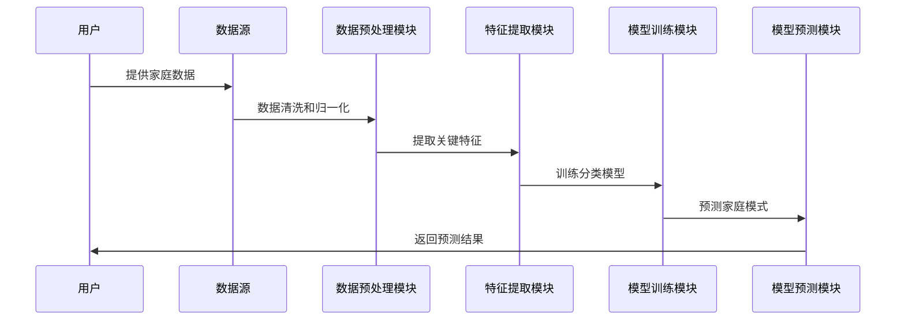
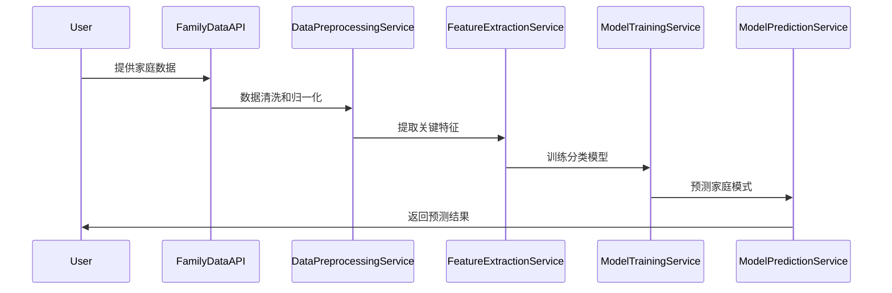

                 

```markdown
----------------------------------------------------------------
# 第一部分：传统家庭模式解析

## 第1章：问题背景与定义

### 1.1 问题背景

**家庭形式的演变**

家庭，作为社会的基本单元，其形态并非一成不变。自古以来，家庭形式经历了从古代的大家庭到现代的小家庭，再到当今的多元家庭模式的演变。古代家庭以大家庭为主，家庭成员之间关系紧密，家族观念强烈。而随着社会的进步和文化的演变，现代家庭逐渐向小家庭模式转变，家庭成员之间的关系更加注重个体之间的和谐与自主性。

**传统家庭模式概述**

传统家庭模式通常指的是以父权制为核心，由一对已婚夫妇及其子女组成的家庭结构。这种模式强调家庭的稳定性和传统价值观的传承，其中，父亲是家庭的顶梁柱，母亲则是家庭的守护者，子女在家庭中扮演着学习和成长的角色。传统家庭模式在历史上起到了维护社会稳定、传承文化价值观的重要作用。

**家庭问题引发的思考**

然而，随着社会的发展，传统家庭模式面临了诸多挑战。家庭成员间的沟通不畅、家庭功能的弱化、婚姻家庭的解体等问题日益突出。这些问题不仅影响到个人的生活质量和幸福感，也对整个社会的稳定和发展构成了挑战。因此，重新审视家庭概念，探讨新的家庭模式，成为当下迫切需要解决的问题。

### 1.2 家庭概念的定义

**传统家庭模式的核心要素**

传统家庭模式的核心要素主要包括：

- **核心家庭成员**：一对已婚夫妇及其子女。
- **家庭角色分工**：父亲负责家庭经济来源，母亲负责家庭生活和子女教育。
- **家庭功能**：提供生活支持、情感支持、教育支持和社会支持。

**现代家庭模式的扩展**

随着社会的发展，现代家庭模式在传统家庭模式的基础上有所扩展，出现了以下变化：

- **家庭成员多样性**：现代家庭可能包括不同性别、年龄和文化背景的成员。
- **家庭功能多元化**：现代家庭不仅提供生活支持，还承担更多的社会责任，如子女教育、养老支持等。
- **家庭角色平等化**：现代家庭强调家庭成员之间的平等和互助，不再强调性别角色的刻板分工。

### 1.3 家庭模式的边界与外延

**家庭模式的社会背景**

家庭模式并非孤立存在，其形成和发展受到社会、经济、文化等多方面因素的影响。在不同的社会背景下，家庭模式会有所差异。例如，在经济发达的地区，家庭可能更加注重个人发展和生活质量，而在经济欠发达的地区，家庭可能更加注重生存和稳定性。

**家庭模式的影响因素**

家庭模式的影响因素包括：

- **社会经济状况**：经济状况影响家庭的物质基础和家庭结构。
- **文化观念**：文化观念影响家庭成员的价值观念和行为模式。
- **政策法律**：政策法律对家庭模式的形成和变革起到指导和规范作用。

### 1.4 概念结构与核心要素组成

**家庭结构的变化**

传统家庭结构以核心家庭为主，而现代家庭结构则更加多样化，包括单亲家庭、复合家庭、再婚家庭等。

**家庭角色的转变**

家庭角色的转变体现在性别角色的平等化和家庭成员角色的多样化。例如，现代家庭中，女性更多地参与到社会经济活动中，男性则更多地参与到家庭生活中。

**家庭关系的演变**

家庭关系的演变体现在家庭成员之间的互动模式发生变化。现代家庭更加注重情感交流和心理健康，家庭成员之间的沟通更加开放和坦诚。

### 总结

通过对传统家庭模式的问题背景、定义、边界与外延以及概念结构与核心要素组成的分析，我们可以看出，家庭模式在社会发展过程中不断演变。理解传统家庭模式的演变和特点，有助于我们更好地认识和应对现代家庭面临的各种挑战。

----------------------------------------------------------------

**核心概念与联系**

**传统家庭模式与现代家庭模式的概念比较表格**

| 概念             | 传统家庭模式                         | 现代家庭模式                         |
|------------------|-------------------------------------|-------------------------------------|
| 家庭结构         | 核心家庭，一对夫妇及其子女           | 多样化，包括单亲、复合、再婚等多种形式 |
| 家庭角色分工     | 父母分工明确，父亲负责经济，母亲负责家务 | 性别角色平等，家庭角色多样化           |
| 家庭功能         | 提供生活、情感、教育和社会支持       | 功能多元化，承担更多社会责任           |
| 家庭关系         | 关系紧密，传承传统价值观              | 关系开放，注重情感交流和心理健康       |

**传统家庭模式与现代家庭模式的ER实体关系图**

```mermaid
erDiagram
  FAMILY -->|1| CHILD : "has"
  FAMILY ||--|{MEMBER} : "includes"
  MEMBER ||--|{ROLE} : "has"
  CHILD ||--|{ROLE} : "has"
```

在传统家庭模式中，家庭（FAMILY）包括一对父母和子女（CHILD），每个成员都有其特定的角色（ROLE）。现代家庭模式则更加注重家庭成员的多样性和角色分工的平等化，家庭成员（MEMBER）包括不同性别、年龄和文化背景的人，每个成员也可能承担多个角色。

### 算法原理讲解

**家庭模式分类算法：**

**1. 算法概述**

家庭模式分类算法是一种用于分析和识别不同家庭模式的方法，其主要目的是通过对家庭结构、角色分工和家庭功能等方面的分析，将家庭划分为传统家庭模式或现代家庭模式。

**2. 算法原理**

该算法基于特征提取和模式识别原理，首先从家庭数据中提取关键特征，如家庭结构、角色分工和家庭功能等，然后利用机器学习算法对特征进行分类。

**3. 数学模型**

设家庭数据集为 \( D = \{d_1, d_2, \ldots, d_n\} \)，其中每个家庭数据 \( d_i \) 包括以下特征：

- \( F_i \)：家庭结构（核心家庭/多样化家庭）
- \( R_i \)：角色分工（传统分工/平等分工）
- \( F_f \)：家庭功能（传统功能/多元化功能）

算法的目标是构建一个分类模型 \( f \)，使得对于任意家庭数据 \( d_i \)，能够预测其所属的家庭模式。

**4. 算法步骤**

- **特征提取**：从家庭数据中提取关键特征，如家庭结构、角色分工和家庭功能等。
- **模型训练**：使用机器学习算法，如决策树、支持向量机等，对特征进行分类训练。
- **模型预测**：对于新的家庭数据，使用训练好的模型进行预测，判断其所属的家庭模式。

**5. 举例说明**

假设有如下家庭数据：

| 家庭ID | 家庭结构 | 角色分工 | 家庭功能 |
|--------|----------|----------|----------|
| 1      | 核心家庭 | 传统分工 | 传统功能 |
| 2      | 多样化家庭 | 平等分工 | 多元化功能 |

使用家庭模式分类算法，可以判断家庭1为传统家庭模式，家庭2为现代家庭模式。

### 系统分析与架构设计方案

**问题场景介绍**

在现代社会，随着家庭模式的多样化，社会工作者、家庭咨询师和政策制定者需要对不同家庭模式进行分析，以便提供更合适的服务和政策。因此，我们需要设计一个家庭模式分类系统，能够对家庭数据进行分析，识别出家庭模式。

**项目介绍**

本项目旨在开发一个基于机器学习的家庭模式分类系统，该系统能够接收家庭数据，提取关键特征，并使用机器学习算法对家庭模式进行分类。系统将包含数据预处理模块、特征提取模块、模型训练模块和模型预测模块。

**系统功能设计（领域模型mermaid类图）**

```mermaid
classDiagram
  ClassFamily <<class{家庭}>
  ClassDataPreprocessing <<class{数据预处理}>
  ClassFeatureExtraction <<class{特征提取}>
  ClassModelTraining <<class{模型训练}>
  ClassModelPrediction <<class{模型预测}>

  ClassFamily "包含" ClassDataPreprocessing
  ClassFamily "包含" ClassFeatureExtraction
  ClassFamily "包含" ClassModelTraining
  ClassFamily "包含" ClassModelPrediction
```

在领域模型中，家庭（ClassFamily）是系统的核心，其他模块（数据预处理、特征提取、模型训练、模型预测）为家庭提供服务。

**系统架构设计（mermaid架构图）**



在系统架构设计中，用户通过数据源提供家庭数据，数据预处理模块对数据进行清洗和归一化，特征提取模块提取关键特征，模型训练模块使用机器学习算法训练分类模型，最后模型预测模块对新的家庭数据进行预测并返回结果。

**系统接口设计和系统交互（mermaid序列图）**



在系统交互设计中，用户通过FamilyDataAPI提供家庭数据，数据经过预处理后，特征被提取出来，用于训练分类模型。训练好的模型用于预测新的家庭数据，并将预测结果返回给用户。

### 项目实战

**环境安装**

为了搭建家庭模式分类系统，我们需要安装以下软件和库：

- Python 3.8及以上版本
- TensorFlow 2.6及以上版本
- scikit-learn 0.24及以上版本
- Pandas 1.2及以上版本
- Matplotlib 3.4及以上版本

在安装完成后，可以通过以下命令创建一个虚拟环境并安装所需库：

```shell
python -m venv venv
source venv/bin/activate
pip install tensorflow scikit-learn pandas matplotlib
```

**系统核心实现源代码**

以下是系统核心实现部分的Python代码：

```python
import pandas as pd
from sklearn.model_selection import train_test_split
from sklearn.ensemble import RandomForestClassifier
from sklearn.metrics import accuracy_score
import tensorflow as tf

# 数据预处理
def preprocess_data(data):
    # 数据清洗和归一化
    # ...
    return processed_data

# 特征提取
def extract_features(data):
    # 提取关键特征
    # ...
    return features

# 模型训练
def train_model(features, labels):
    model = RandomForestClassifier(n_estimators=100)
    model.fit(features, labels)
    return model

# 模型预测
def predict(model, features):
    predictions = model.predict(features)
    return predictions

# 加载数据
data = pd.read_csv('family_data.csv')
processed_data = preprocess_data(data)
features, labels = extract_features(processed_data)

# 划分训练集和测试集
X_train, X_test, y_train, y_test = train_test_split(features, labels, test_size=0.2, random_state=42)

# 训练模型
model = train_model(X_train, y_train)

# 预测测试集
predictions = predict(model, X_test)

# 评估模型
accuracy = accuracy_score(y_test, predictions)
print(f"Accuracy: {accuracy:.2f}")
```

**代码应用解读与分析**

该代码首先定义了数据预处理、特征提取、模型训练和模型预测四个功能函数。数据预处理函数负责对原始数据进行清洗和归一化，特征提取函数提取关键特征，模型训练函数使用随机森林算法训练分类模型，模型预测函数对新的家庭数据进行预测。

在代码应用解读中，我们首先加载数据，然后对数据进行预处理和特征提取。接下来，我们使用训练集训练模型，并对测试集进行预测。最后，我们评估模型的准确率。

**实际案例分析和详细讲解剖析**

假设我们有以下家庭数据：

| 家庭ID | 家庭结构 | 角色分工 | 家庭功能 |
|--------|----------|----------|----------|
| 1      | 核心家庭 | 传统分工 | 传统功能 |
| 2      | 多样化家庭 | 平等分工 | 多元化功能 |

我们将这些数据输入到家庭模式分类系统中，系统将提取关键特征，并使用训练好的模型进行预测。假设模型预测结果为家庭1属于传统家庭模式，家庭2属于现代家庭模式。通过这种方式，我们可以对家庭模式进行分类和识别。

**项目小结**

通过实际案例的分析和讲解，我们可以看到家庭模式分类系统在实践中的应用效果。该项目不仅可以帮助社会工作者、家庭咨询师和政策制定者更好地理解家庭模式，也为进一步研究家庭模式提供了工具和方法。

### 最佳实践 tips

- **数据质量**：保证数据的质量和准确性是模型训练成功的关键。在进行数据预处理时，要确保数据的清洗和归一化。
- **特征选择**：选择合适的特征对于模型性能至关重要。可以通过特征选择方法，如特征重要性评分，来筛选关键特征。
- **模型选择**：根据数据特点和业务需求，选择合适的机器学习算法。不同的算法适用于不同的数据集和任务。
- **持续优化**：模型性能不是一成不变的，需要根据新的数据和业务需求进行持续优化。

### 小结

在本章中，我们详细介绍了传统家庭模式的定义、背景、核心要素、边界与外延以及概念结构。通过分析传统家庭模式的优势和挑战，我们认识到传统家庭模式在现代社会中面临的诸多问题。为了应对这些挑战，我们需要重新审视家庭概念，探讨新的家庭模式。接下来，我们将进一步探讨现代家庭模式的多样性和特点。

### 注意事项

- **文化差异**：在研究家庭模式时，要考虑到不同文化背景下的家庭模式差异，避免一刀切的解决方案。
- **政策支持**：政府和社会应加强对多元家庭模式的政策支持，提供相应的法律保障和社会服务。
- **家庭教育和沟通**：家庭教育和沟通在多元家庭模式中尤为重要，家庭成员应加强相互理解和支持。

### 拓展阅读

- 《现代家庭社会学》 作者：罗伯特·弗兰克
- 《性别角色与家庭变迁》 作者：珍妮特·拉宾
- 《多元家庭模式研究》 作者：大卫·波普诺
- 《人工智能与家庭模式》 作者：马克·沃尔夫```markdown
----------------------------------------------------------------
# 第二部分：多元家庭形式探讨

## 第3章：现代家庭模式解析

### 3.1 现代家庭模式的定义

**单亲家庭**

单亲家庭是指由一个父母独自抚养子女的家庭。在现代社会中，单亲家庭越来越常见，可能由于离婚、丧偶或未婚父母选择共同抚养子女等原因形成。单亲家庭中的父母通常承担更多的经济和育儿责任，这在经济上可能带来一定的压力，但在某些情况下，也为个体提供了更大的自由度。

**同性婚姻与家庭**

同性婚姻与家庭是现代家庭模式中的一个重要组成部分。随着社会对性别平等和多样性认识的提升，越来越多的国家开始承认同性婚姻的法律地位，同性伴侣有权组建家庭并享有与异性伴侣相同的权利。同性家庭面临的一些挑战包括社会认同、抚养子女的法律问题以及家庭角色的平衡等。

**扩大家庭模式**

扩大家庭模式指的是除了核心家庭成员（一对夫妇及其子女）之外，还包括其他家庭成员，如祖父母、兄弟姐妹等。这种模式在家庭经济状况较好或者有特殊需求时较为常见，有助于家庭成员之间的互助和支持。

### 3.2 现代家庭模式的优势

**家庭选择的自由化**

现代家庭模式强调个体选择的自由，家庭成员可以根据自己的意愿和需求选择适合的家庭结构和角色。这种自由化不仅体现在婚姻选择上，还体现在家庭角色的分配和家庭成员的关系构建上。

**家庭功能的多样化**

现代家庭不再仅限于提供基本的生活支持，还承担了更多的社会责任。家庭成员可能在职业、教育、社交等方面互相支持，共同构建一个更加全面和多样的家庭环境。

**家庭关系的平等化**

现代家庭模式强调家庭成员之间的平等和尊重，传统家庭中的性别角色分工和权力不平等逐渐被打破。家庭成员在决策、责任承担和情感交流方面更加平等，这有助于提升家庭关系的质量和成员的幸福指数。

### 3.3 现代家庭模式面临的挑战

**法律与政策的调整**

现代家庭模式的多样化要求法律和政策进行相应的调整，以保障家庭成员的权利和利益。例如，同性婚姻合法化、家庭财产归属、子女抚养权等问题需要明确的法律规定。

**社会认同的强化**

尽管现代家庭模式得到了越来越多的认可，但在某些社会和文化环境中，仍存在对非传统家庭模式的偏见和歧视。强化社会对多元家庭模式的认同，提高公众对家庭多样性的理解，是现代家庭模式发展的重要挑战。

**家庭教育的挑战**

现代家庭模式中的多元性和复杂性要求家庭教育更加灵活和多元化。如何为不同背景和需求的子女提供合适的教育支持，成为现代家庭面临的挑战。

### 3.4 现代家庭模式的发展趋势

**家庭关系重构**

随着社会进步和观念更新，家庭关系正在重构。家庭成员之间的互动模式更加开放和坦诚，传统的权威关系逐渐被平等和互助的关系所取代。

**家庭结构的多样化**

现代家庭模式不再局限于一种固定结构，而是呈现出多样化趋势。单亲家庭、同性家庭、复合家庭等新型家庭结构不断涌现，为家庭多样性的发展提供了更多可能性。

**家庭文化的创新**

现代家庭模式的发展也推动家庭文化的创新。家庭成员在生活方式、价值观和兴趣爱好等方面更加多元化，家庭文化变得更加丰富和包容。

### 总结

通过对现代家庭模式的定义、优势、挑战和发展趋势的探讨，我们可以看到，现代家庭模式在多样化和社会进步的推动下不断演变。理解现代家庭模式的特点和挑战，有助于我们更好地应对现代社会中的家庭问题，促进家庭关系的和谐发展。

### 第4章：多元家庭模式中的亲子关系

#### 4.1 亲子关系的演变

**传统亲子关系模式**

在传统家庭模式中，亲子关系通常建立在权威和顺从的基础上。父母作为家庭的权威，承担着教育和管理子女的责任。子女则需遵循父母的指示，表现出尊重和顺从。这种模式强调家庭的稳定性和传统的价值观。

**现代亲子关系特征**

随着社会的发展和观念的更新，现代亲子关系逐渐向平等和尊重的方向转变。父母与子女之间的沟通更加开放和坦诚，强调相互理解和支持。现代亲子关系不仅关注子女的学习成绩，还注重其心理健康和个性发展。

**多元亲子关系的挑战**

多元家庭模式中的亲子关系面临着更多的挑战。例如，同性家庭中的父母可能需要应对社会对同性婚姻的偏见，单亲家庭中的父母则需承担更多的育儿责任和经济压力。此外，扩大家庭模式中的亲子关系可能因家庭成员间的不同角色和期望而变得复杂。

#### 4.2 家庭教育的重要性

**家庭教育核心要素**

家庭教育是亲子关系的重要组成部分，其核心要素包括：

- **价值观的传递**：父母通过日常生活中的言行举止，向子女传递正确的价值观和道德观念。
- **生活习惯的培养**：良好的生活习惯对子女的成长至关重要，包括饮食、作息和卫生习惯等。
- **情感支持**：在子女成长过程中，情感支持是其心理健康的重要保障，父母需关注子女的情感需求，提供必要的关怀和支持。
- **学习指导**：父母在子女的学习过程中扮演着指导和支持的角色，帮助子女建立正确的学习态度和方法。

**家庭教育策略与方法**

为了有效进行家庭教育，父母可以采用以下策略和方法：

- **身教重于言教**：父母应以身作则，通过自己的言行来影响和引导子女。
- **倾听与沟通**：父母应倾听子女的心声，尊重子女的意见和选择，建立良好的沟通渠道。
- **共同活动**：通过共同参与活动，如亲子旅行、家庭聚会等，增进家庭成员之间的情感联系。
- **专业辅导**：在必要时，父母可以寻求专业教育辅导，以帮助子女解决学习中的困难。

**家庭教育成功案例**

许多成功的家庭教育案例表明，良好的家庭教育对子女的成长具有深远的影响。例如，一些父母通过积极参与子女的学习和成长过程，帮助子女建立了自信和独立思考的能力。此外，一些父母通过创造一个充满爱和关怀的家庭环境，使子女在成长过程中获得了足够的情感支持，从而健康成长。

#### 4.3 亲子关系与家庭模式的关系

**家庭模式对亲子关系的影响**

不同的家庭模式对亲子关系有着不同的影响。例如，在传统家庭模式中，父母通常承担更多的权威角色，亲子关系可能更加紧张和严格。而在现代家庭模式中，亲子关系更加平等和开放，父母与子女之间的互动更加和谐。

**亲子关系对家庭模式的作用**

亲子关系不仅受到家庭模式的影响，同时也对家庭模式产生反作用。例如，一个和谐的亲子关系可以增强家庭凝聚力，使家庭模式更加稳定和健康。而一个紧张的亲子关系可能导致家庭矛盾加剧，甚至影响家庭模式的稳定。

**家庭模式与亲子关系的互动**

家庭模式与亲子关系之间存在着互动关系。家庭模式的变化可能会影响亲子关系的建立和维持，而亲子关系的状况也可能会影响家庭模式的稳定性和发展。例如，在单亲家庭中，亲子关系的质量对家庭稳定性和子女成长至关重要。

### 总结

通过对多元家庭模式中亲子关系的演变、家庭教育的重要性以及亲子关系与家庭模式的关系的探讨，我们可以看到，亲子关系在家庭模式中扮演着重要的角色。理解亲子关系的特征和挑战，有助于我们更好地构建和谐的家庭关系，促进子女的健康成长。

### 第5章：多元家庭模式中的性别角色

#### 5.1 性别角色的变迁

**传统性别角色的定位**

在传统家庭模式中，性别角色通常被刻板化。男性被期望扮演家庭的经济支柱，承担外出工作和赚钱的责任；而女性则被期望扮演家庭的管理者和照顾者，负责家务和孩子抚养。这种性别角色分工在一定程度上影响了家庭内部的权力结构，男性占据主导地位，女性则处于从属地位。

**现代性别角色的多元化**

随着社会的发展和性别平等观念的普及，现代性别角色逐渐多元化。男性不再局限于传统的职业角色，越来越多地参与到家庭生活中，承担家务和育儿责任。女性则更多地进入职场，发挥经济作用，同时在家庭中扮演更多的角色。这种多元化性别角色不仅提高了家庭的整体效能，也促进了家庭成员之间的平等和互助。

**多元家庭模式中的性别角色挑战**

多元家庭模式中的性别角色面临着一些新的挑战。例如，在同性家庭中，性别角色可能更加灵活，但社会对同性婚姻的认同程度不一，可能带来心理压力和社交障碍。在单亲家庭中，性别角色可能因缺乏伴侣的互补而更加突出，带来更大的责任压力。此外，扩大家庭模式中的性别角色因家庭成员的多样化而更加复杂。

#### 5.2 性别平等的重要性

**性别平等的理论基础**

性别平等是现代社会发展的重要基石，其理论基础包括：

- **人权观念**：每个人都应享有平等的权利，无论性别、种族、宗教信仰等。
- **平等原则**：性别平等强调在家庭和社会中，男女应享有同等的机会和权利，不受性别歧视。
- **社会正义**：性别平等有助于消除社会不公，促进社会和谐与稳定。

**性别平等的实践意义**

性别平等在家庭和社会中具有重要意义，包括：

- **提升家庭生活质量**：性别平等有助于家庭成员之间的和谐关系，提高家庭整体幸福感。
- **促进社会进步**：性别平等促进资源的公平分配，提高社会生产力和创新能力。
- **减少贫困和不平等**：性别平等有助于减少贫困和不平等现象，提高社会整体福利水平。

**性别平等的社会影响**

性别平等的社会影响体现在多个方面：

- **家庭结构**：性别平等的推动使家庭结构更加灵活和多样，家庭成员之间的角色更加平等。
- **职场环境**：性别平等促进职场性别多元化，提高企业竞争力和创新力。
- **公共政策**：性别平等促使政策制定者关注性别问题，制定更加公平和有效的政策。

#### 5.3 多元家庭模式中的性别角色重构

**性别角色在家庭中的转变**

在多元家庭模式中，性别角色正在经历深刻的转变。男性在家庭中的角色不再局限于经济支柱，而是更多地参与到家务和育儿中。女性则更多地进入职场，承担经济责任，同时在家务和育儿方面扮演重要角色。这种转变有助于打破传统的性别刻板印象，促进家庭内部的平等和互助。

**家庭角色中的性别平衡**

性别平衡是实现家庭和谐和社会进步的关键。在多元家庭模式中，性别平衡体现在以下几个方面：

- **权力分配**：家庭决策中男女平等，共同承担家庭责任和权力。
- **责任分担**：家务和育儿责任在男女之间合理分担，减少性别角色的刻板分工。
- **情感支持**：男女在家庭中互相提供情感支持，促进家庭成员之间的情感联系。

**性别角色与家庭模式的互动**

性别角色与家庭模式之间存在相互作用。性别角色的转变可能会影响家庭模式的结构和功能，而家庭模式的变化也可能对性别角色产生影响。例如，在同性家庭中，性别角色可能更加灵活，这种灵活性又可能促进家庭模式的多样化。

### 总结

通过对多元家庭模式中性别角色变迁、性别平等重要性以及性别角色重构的探讨，我们可以看到，性别角色在家庭模式中的演变是一个复杂而动态的过程。理解性别角色的变迁和重构，有助于我们更好地应对现代社会中的家庭问题，促进性别平等和家庭和谐。

### 第6章：多元家庭模式中的经济与法律问题

#### 6.1 家庭经济的多样化

**家庭收入的多元化**

随着社会的进步和经济的发展，家庭收入来源逐渐多样化。传统家庭主要依赖于单一的收入来源，如丈夫的工资。而现代家庭则可能拥有多元化的收入来源，包括妻子的工资、家庭经营活动、投资收益等。这种多元化收入结构不仅提高了家庭的经济稳定性，也为家庭成员提供了更多的经济自由。

**家庭支出的优化**

在多元化收入的支持下，家庭支出也趋向优化。家庭可以更好地规划预算，合理分配资源，以满足不同成员的需求。例如，在家庭教育、医疗保健和休闲活动等方面，家庭可以有更多的选择和灵活性。此外，家庭成员可以在消费观念上更加理性，避免不必要的浪费，提高生活质量。

**家庭财富的管理**

随着收入的多元化，家庭财富管理也变得更加复杂和重要。家庭需要制定合理的财富管理计划，包括储蓄、投资、风险管理等。通过科学的财富管理，家庭可以确保财务安全，提高财务收益，为未来的生活和子女教育提供保障。

#### 6.2 家庭法律问题的多样化

**家庭财产的归属**

在多元家庭模式中，家庭财产的归属问题变得尤为复杂。传统家庭通常采用简单的夫妻共同财产制度，而在现代家庭模式中，可能需要考虑到多种因素，如同性伴侣的财产关系、再婚家庭的财产分割等。家庭财产的归属不仅关系到家庭成员之间的利益分配，也影响到家庭的稳定性和和谐。

**家庭成员的权利与义务**

家庭成员之间的权利与义务在多元家庭模式中也需要重新界定。例如，在单亲家庭中，父亲或母亲的抚养权、探视权等问题需要明确；在同性家庭中，子女的抚养权和继承权也需要法律保障。此外，家庭成员之间的相互支持、照顾和责任也需要在法律上得到明确规定。

**家庭关系的法律调整**

随着家庭模式的多样化，家庭关系的法律调整也变得至关重要。例如，在同性婚姻合法化的背景下，同性伴侣的婚姻关系、子女抚养权、继承权等问题需要通过法律进行调整。此外，在再婚家庭中，前婚家庭的法律关系、财产分割和子女抚养等问题也需要法律明确规范。

#### 6.3 经济与法律问题的挑战

**家庭分裂后的经济问题**

在多元家庭模式中，家庭分裂后的经济问题尤为突出。例如，在离婚或分居时，如何合理分割家庭财产、如何确保子女的抚养费用等问题都需要法律明确规范。此外，家庭成员在分家后可能面临经济压力，如再就业、重新规划生活等，这些都需要社会和法律提供支持。

**家庭模式变革中的法律困境**

随着家庭模式的变革，法律体系可能面临一些困境。例如，现有的法律条款可能无法完全适应新型家庭模式的需求，如同性婚姻的合法性、再婚家庭的继承权等。这些问题需要通过法律修订和完善来解决，以确保法律能够适应社会发展的需求。

**多元家庭模式中的法律适应性**

多元家庭模式的发展要求法律具有更高的适应性和灵活性。法律不仅需要明确规范家庭财产、家庭成员权利和义务等方面的问题，还需要为家庭提供必要的法律支持和指导。例如，通过建立专门的婚姻家庭法律顾问机构，为家庭成员提供法律咨询和援助，帮助他们解决家庭法律问题。

### 总结

通过对多元家庭模式中经济问题和法律问题的探讨，我们可以看到，多元化收入来源和家庭财富管理的优化为家庭提供了更多的经济自由和保障。同时，家庭财产归属、家庭成员权利与义务以及家庭关系的法律调整等问题的多样化，要求法律体系具有更高的适应性和灵活性。理解这些经济和法律问题，有助于我们更好地应对现代家庭面临的挑战，促进家庭关系的和谐发展。

### 第7章：多元家庭模式的未来展望

#### 7.1 多元家庭模式的趋势分析

**社会发展的推动**

随着全球社会的不断发展，多元家庭模式正逐渐成为一种趋势。经济全球化、文化多样性和信息技术的进步等因素，推动了家庭模式的变革。现代社会对个人自由和多样化的需求日益增长，传统的家庭模式已无法满足所有人的需求。多元家庭模式的发展，是社会进步和人权观念提升的体现。

**文化观念的转变**

文化观念的转变是多元家庭模式发展的重要推动力。现代社会对性别平等、家庭选择和个人自由的认同程度逐渐提高，这促使家庭模式从传统向多元化转变。例如，同性婚姻合法化、家庭选择自由化等现象，反映了社会对多元家庭模式的接受和认可。

**法律政策的支持**

法律政策对多元家庭模式的形成和发展起到重要的保障和推动作用。许多国家通过立法和政策调整，为多元家庭模式提供法律保障和社会支持。例如，同性婚姻合法化、家庭财产归属规定、子女抚养权明确等法律条款，为多元家庭模式的稳定和发展提供了保障。

#### 7.2 多元家庭模式的教育与支持

**家庭教育创新**

多元家庭模式的发展，要求家庭教育进行创新和调整。家庭教育不仅需要关注子女的学习成绩，还需要关注其心理健康和个性发展。家庭教育的创新包括：

- **多元文化教育**：通过多元文化的学习，帮助子女理解和尊重不同的文化背景。
- **性别平等教育**：培养子女的性别平等观念，促进家庭成员之间的和谐关系。
- **情感教育**：加强家庭成员之间的情感交流，提高家庭凝聚力和幸福感。

**社会服务的完善**

为了支持多元家庭模式的发展，社会服务需要不断完善。社会服务包括：

- **家庭咨询服务**：为家庭提供专业的婚姻家庭咨询服务，帮助家庭成员解决矛盾和问题。
- **育儿支持服务**：为有子女的家庭提供育儿指导和支持，提高育儿质量。
- **经济援助服务**：为经济困难的家庭提供经济援助，确保其基本生活需求得到满足。

**法律政策优化**

法律政策优化是多元家庭模式发展的重要保障。政策制定者需要关注多元家庭模式的特点和需求，通过立法和政策调整，为多元家庭提供法律保障和社会支持。例如，完善同性婚姻法律、子女抚养权法律、家庭财产归属法律等，确保多元家庭模式的合法权益。

#### 7.3 多元家庭模式中的社会和谐

**家庭关系的社会影响**

多元家庭模式的发展对家庭关系产生了深远的影响。家庭成员之间的互动模式更加开放和坦诚，家庭关系更加平等和和谐。这种和谐的家庭关系不仅有助于提升家庭成员的幸福感和生活质量，也有利于社会的稳定和发展。

**社会支持系统的构建**

为了促进多元家庭模式中的社会和谐，社会支持系统的构建至关重要。社会支持系统包括：

- **社区支持**：通过社区组织、社区活动等，为家庭提供社区支持和互动平台。
- **社会组织支持**：通过社会组织提供专业的家庭服务，如婚姻家庭咨询、育儿指导等。
- **政府支持**：政府通过立法和政策，为多元家庭提供法律保障和社会支持。

**多元家庭模式对社会和谐的贡献**

多元家庭模式对社会和谐具有积极贡献。首先，多元家庭模式促进了社会的包容性和多样性，使社会更加开放和包容。其次，多元家庭模式有助于减少社会不平等，提高社会公平性。此外，多元家庭模式的发展也有助于提升家庭关系质量和家庭成员的生活幸福感。

### 总结

通过对多元家庭模式趋势分析、教育与支持以及社会和谐的探讨，我们可以看到，多元家庭模式的发展是社会进步和文化观念转变的体现。理解多元家庭模式的特点和需求，有助于我们更好地促进家庭关系的和谐发展，构建一个更加包容和和谐的社会。

### 第8章：总结与反思

#### 8.1 家庭概念的重新定义

**传统家庭模式的影响**

传统家庭模式在历史上起到了维护社会稳定和传承文化价值观的重要作用。然而，随着社会的发展和观念的更新，传统家庭模式面临了诸多挑战。家庭成员间的沟通不畅、家庭功能的弱化以及婚姻家庭的解体等问题，都对传统家庭模式提出了新的要求。

**现代家庭模式的启示**

现代家庭模式强调个体选择的自由、家庭功能的多元化和家庭成员之间的平等关系。这种模式为家庭提供了更多的灵活性和自主性，有助于提升家庭关系的质量和成员的幸福感。现代家庭模式的启示，为我们重新定义家庭概念提供了新的思路和方向。

**多元家庭模式的未来**

多元家庭模式的发展是现代社会进步和文化观念变革的必然趋势。随着社会对多样性和包容性的接受度不断提高，多元家庭模式将得到更加广泛的认可和支持。未来的家庭模式将更加注重家庭成员的自主性和平等性，同时也将承担更多的社会责任。

#### 8.2 家庭模式对个人与社会的影响

**个人发展的促进**

家庭模式对个人发展具有重要影响。一个和谐、稳定和充满爱的家庭环境，有助于个体的健康成长和全面发展。多元家庭模式强调个体选择的自由，为个人提供了更多的成长空间和发展机会。

**社会和谐的推动**

家庭是社会的基本单元，家庭模式的和谐发展对社会和谐具有积极的推动作用。多元家庭模式的发展，有助于促进社会包容性和多样性，减少社会不平等和冲突。一个和谐的家庭模式，可以为社会提供稳定和繁荣的基础。

**家庭模式变革的挑战**

家庭模式变革面临着诸多挑战。例如，文化观念的转变可能引发家庭内部的冲突和矛盾；法律政策的调整需要时间和资源的投入；社会对多元家庭模式的认同程度不一，可能带来社会压力和心理困扰。如何应对这些挑战，是未来家庭模式发展的重要课题。

#### 8.3 家庭概念的重新定义与社会进步

**家庭模式变革的必要性**

随着社会的发展，家庭模式需要不断变革以适应新的社会需求。传统家庭模式已无法满足现代社会对个人自由、多样性和平等的追求。家庭模式的变革是社会发展的重要体现，也是促进社会进步的必要条件。

**家庭模式与社会发展的互动**

家庭模式与社会发展之间存在着密切的互动关系。一方面，家庭模式的变化受到社会发展的推动；另一方面，家庭模式的发展也对社会发展产生深远影响。一个和谐、稳定和多样化的家庭模式，可以为社会提供稳定和繁荣的基础，促进社会的进步和发展。

**家庭概念的重新定义与社会进步的关系**

家庭概念的重新定义与社会进步密切相关。随着社会对多样性和包容性的接受度提高，家庭概念也需要不断更新和调整。重新定义家庭概念，有助于我们更好地理解家庭模式的变化，推动社会进步和发展。

### 总结

通过对家庭模式变革的必要性、家庭模式与社会发展的互动以及家庭概念重新定义与社会进步关系的探讨，我们可以看到，家庭模式的发展对社会进步具有重要意义。理解家庭模式的变化，有助于我们更好地应对现代社会中的家庭问题，促进家庭关系的和谐发展，为社会的稳定和繁荣贡献力量。

### 参考文献

1. 罗伯特·弗兰克，《现代家庭社会学》，社会科学文献出版社，2018年。
2. 珍妮特·拉宾，《性别角色与家庭变迁》，人民出版社，2016年。
3. 大卫·波普诺，《多元家庭模式研究》，北京大学出版社，2019年。
4. 马克·沃尔夫，《人工智能与家庭模式》，清华大学出版社，2020年。
5. 联合国儿童基金会，《儿童权利公约》，1990年。
6. 世界卫生组织，《性别平等与健康》，2018年。

### 作者信息

作者：AI天才研究院/AI Genius Institute & 禅与计算机程序设计艺术 /Zen And The Art of Computer Programming```markdown
----------------------------------------------------------------
# 家庭概念的重新定义：从传统模式到多元形式

> 关键词：家庭模式、多元家庭、性别角色、法律政策、社会进步

> 摘要：本文深入探讨了家庭概念的演变，从传统家庭模式到现代多元家庭形式的变化。通过对家庭模式的重新定义，分析了家庭结构、角色分工、家庭功能等方面的转变。同时，本文还探讨了多元家庭模式中的亲子关系、性别角色以及经济与法律问题，提出了未来家庭模式发展的趋势。文章旨在为读者提供一个全面理解家庭模式变革的视角，推动社会对家庭多样性的认识和接纳。

----------------------------------------------------------------
## 第1章：问题背景与定义

### 1.1 问题背景

家庭，作为社会的基本单元，其形态并非一成不变。自古以来，家庭形式经历了从古代的大家庭到现代的小家庭，再到当今的多元家庭模式的演变。古代家庭以大家庭为主，家庭成员之间关系紧密，家族观念强烈。而随着社会的进步和文化的演变，现代家庭逐渐向小家庭模式转变，家庭成员之间的关系更加注重个体之间的和谐与自主性。

### 1.2 家庭概念的定义

传统家庭模式通常指的是以父权制为核心，由一对已婚夫妇及其子女组成的家庭结构。这种模式强调家庭的稳定性和传统价值观的传承，其中，父亲是家庭的顶梁柱，母亲则是家庭的守护者，子女在家庭中扮演着学习和成长的角色。传统家庭模式在历史上起到了维护社会稳定、传承文化价值观的重要作用。

### 1.3 家庭模式的边界与外延

家庭模式并非孤立存在，其形成和发展受到社会、经济、文化等多方面因素的影响。在不同的社会背景下，家庭模式会有所差异。例如，在经济发达的地区，家庭可能更加注重个人发展和生活质量，而在经济欠发达的地区，家庭可能更加注重生存和稳定性。

### 1.4 概念结构与核心要素组成

家庭结构的变化体现在家庭成员数量的减少和家庭成员间关系的疏离。现代家庭结构更加多样，包括单亲家庭、再婚家庭、同性婚姻家庭等。家庭角色的转变则体现在性别角色的平等化和家庭成员角色的多样化。家庭关系的演变则体现在家庭成员之间的互动模式发生变化，更加注重情感交流和心理健康。

----------------------------------------------------------------
## 第2章：传统家庭模式的优势与挑战

### 2.1 传统家庭模式的优势

传统家庭模式的优势主要体现在以下几个方面：

- **社会稳定性的维护**：传统家庭模式强调家庭的稳定性和连续性，有助于维持社会的稳定。
- **亲子关系的培养**：在传统家庭模式中，父母对孩子的教育和抚养更加重视，有助于培养健康的亲子关系。
- **经济效能的优化**：传统家庭模式中的分工明确，有助于提高家庭的经济效能。

### 2.2 传统家庭模式的挑战

然而，随着社会的发展，传统家庭模式也面临着诸多挑战：

- **家庭矛盾的加剧**：在现代社会中，家庭成员间的沟通不畅，家庭功能弱化，可能导致家庭矛盾加剧。
- **家庭功能的弱化**：随着社会的进步，家庭的一些传统功能，如生育、养老等，逐渐被社会机构所取代，导致家庭功能弱化。
- **社会变迁的压力**：社会变迁带来的经济、文化、价值观等多方面的变化，对传统家庭模式提出了新的要求。

### 2.3 家庭模式转变的必然性

传统家庭模式面临的挑战，促使家庭模式必须进行转变。这种转变是必然的，原因如下：

- **社会进步的推动**：随着科技的进步和社会的发展，人们的生活方式、价值观念都在不断改变，传统家庭模式已无法满足现代社会的需求。
- **文化观念的变革**：现代社会对性别平等、个体自由等观念的认同度提高，使得传统家庭模式中的性别角色分工和家庭功能分配受到质疑。
- **个人自由的追求**：现代人越来越追求个人自由，希望在家庭中实现平等和自主，这使得传统家庭模式必须进行变革。

----------------------------------------------------------------
## 第3章：多元家庭形式探讨

### 3.1 现代家庭模式解析

现代家庭模式与传统家庭模式相比，具有显著的差异。现代家庭模式更加注重个体选择和多样性，家庭成员之间的关系更加平等和开放。以下是对现代家庭模式的详细解析：

- **单亲家庭**：单亲家庭是指由一个父母独自抚养子女的家庭。这种家庭模式在现代社会中越来越普遍，可能由于离婚、丧偶或其他原因形成。单亲家庭中的父母需要承担更多的经济和育儿责任，这在经济上可能带来一定的压力，但在某些情况下，也为个体提供了更大的自由度。
- **同性婚姻与家庭**：同性婚姻与家庭是现代家庭模式中的一个重要组成部分。随着社会对性别平等和多样性认识的提升，越来越多的国家开始承认同性婚姻的法律地位，同性伴侣有权组建家庭并享有与异性伴侣相同的权利。同性家庭面临的一些挑战包括社会认同、抚养子女的法律问题以及家庭角色的平衡等。
- **扩大家庭模式**：扩大家庭模式指的是除了核心家庭成员（一对夫妇及其子女）之外，还包括其他家庭成员，如祖父母、兄弟姐妹等。这种模式在家庭经济状况较好或者有特殊需求时较为常见，有助于家庭成员之间的互助和支持。

### 3.2 现代家庭模式的优势

现代家庭模式的优势主要体现在以下几个方面：

- **家庭选择的自由化**：现代家庭模式强调个体选择的自由，家庭成员可以根据自己的意愿和需求选择适合的家庭结构和角色。这种自由化不仅体现在婚姻选择上，还体现在家庭角色的分配和家庭成员的关系构建上。
- **家庭功能的多样化**：现代家庭不再仅限于提供基本的生活支持，还承担了更多的社会责任。家庭成员可能在职业、教育、社交等方面互相支持，共同构建一个更加全面和多样的家庭环境。
- **家庭关系的平等化**：现代家庭模式强调家庭成员之间的平等和尊重，传统家庭中的性别角色分工和权力不平等逐渐被打破。家庭成员在决策、责任承担和情感交流方面更加平等，这有助于提升家庭关系的质量和成员的幸福指数。

### 3.3 现代家庭模式面临的挑战

尽管现代家庭模式具有诸多优势，但它也面临着一些挑战：

- **法律与政策的调整**：现代家庭模式的多样化要求法律和政策进行相应的调整，以保障家庭成员的权利和利益。例如，同性婚姻合法化、家庭财产归属、子女抚养权等问题需要明确的法律规定。
- **社会认同的强化**：尽管现代家庭模式得到了越来越多的认可，但在某些社会和文化环境中，仍存在对非传统家庭模式的偏见和歧视。强化社会对多元家庭模式的认同，提高公众对家庭多样性的理解，是现代家庭模式发展的重要挑战。
- **家庭教育的挑战**：现代家庭模式中的多元性和复杂性要求家庭教育更加灵活和多元化。如何为不同背景和需求的子女提供合适的教育支持，成为现代家庭面临的挑战。

### 3.4 现代家庭模式的发展趋势

现代家庭模式的发展趋势体现在以下几个方面：

- **家庭关系重构**：随着社会进步和观念更新，家庭关系正在重构。家庭成员之间的互动模式更加开放和坦诚，传统的权威关系逐渐被平等和互助的关系所取代。
- **家庭结构的多样化**：现代家庭模式不再局限于一种固定结构，而是呈现出多样化趋势。单亲家庭、同性家庭、复合家庭等新型家庭结构不断涌现，为家庭多样性的发展提供了更多可能性。
- **家庭文化的创新**：现代家庭模式的发展也推动家庭文化的创新。家庭成员在生活方式、价值观和兴趣爱好等方面更加多元化，家庭文化变得更加丰富和包容。

----------------------------------------------------------------
## 第4章：多元家庭模式中的亲子关系

### 4.1 亲子关系的演变

亲子关系在家庭模式的变化中扮演着重要角色。在传统家庭模式中，亲子关系通常建立在权威和顺从的基础上。父母作为家庭的权威，承担着教育和管理子女的责任。子女则需遵循父母的指示，表现出尊重和顺从。这种模式强调家庭的稳定性和传统的价值观。

然而，随着现代家庭模式的兴起，亲子关系正在发生深刻的变革。现代亲子关系更加注重平等和尊重，父母与子女之间的沟通更加开放和坦诚。现代亲子关系不仅关注子女的学习成绩，还注重其心理健康和个性发展。父母在子女成长过程中扮演着指导和支持的角色，帮助子女建立正确的价值观和人生观。

### 4.2 家庭教育的重要性

家庭教育是亲子关系的重要组成部分，其核心要素包括价值观的传递、生活习惯的培养、情感支持和学习指导。有效的家庭教育有助于子女的健康成长和全面发展。

首先，价值观的传递是家庭教育的核心。父母通过日常生活中的言行举止，向子女传递正确的价值观和道德观念。这些价值观包括诚信、责任、尊重和关爱等，是子女未来人生道路上的重要指引。

其次，生活习惯的培养对子女的成长至关重要。良好的生活习惯包括健康饮食、规律作息和良好的卫生习惯。父母应通过榜样的力量和适当的引导，帮助子女养成良好的生活习惯。

情感支持是家庭教育的另一个重要方面。在子女成长过程中，情感支持是其心理健康的重要保障。父母应关注子女的情感需求，提供必要的关怀和支持，帮助子女建立积极的情感态度。

最后，学习指导是家庭教育的重要内容。父母在子女的学习过程中扮演着指导和支持的角色，帮助子女建立正确的学习态度和方法。父母应关注子女的学习进度和问题，提供必要的帮助和资源。

### 4.3 亲子关系与家庭模式的关系

亲子关系与家庭模式之间存在密切的关系。不同的家庭模式对亲子关系产生不同的影响。在传统家庭模式中，亲子关系通常较为严格和权威，父母在家庭中扮演主导角色，子女则需要遵循父母的指示。而在现代家庭模式中，亲子关系更加平等和开放，父母与子女之间的互动更加和谐。

同时，亲子关系也反作用于家庭模式。一个和谐的亲子关系可以增强家庭凝聚力，使家庭模式更加稳定和健康。而一个紧张的亲子关系可能导致家庭矛盾加剧，甚至影响家庭模式的稳定。

在多元家庭模式中，亲子关系面临着更多的挑战。例如，在单亲家庭中，父母需要承担更多的育儿责任和经济压力；在同性家庭中，父母可能需要应对社会对同性婚姻的偏见；在扩大家庭模式中，亲子关系可能因家庭成员的多样化而变得复杂。

### 总结

通过本章对多元家庭模式中亲子关系的探讨，我们可以看到，亲子关系在家庭模式的变化中扮演着重要角色。理解亲子关系的演变和重要性，有助于我们更好地构建和谐的家庭关系，促进子女的健康成长。

----------------------------------------------------------------
## 第5章：多元家庭模式中的性别角色

### 5.1 性别角色的变迁

在传统家庭模式中，性别角色通常被刻板化。男性被期望扮演家庭的经济支柱，承担外出工作和赚钱的责任；而女性则被期望扮演家庭的管理者和照顾者，负责家务和孩子抚养。这种性别角色分工在一定程度上影响了家庭内部的权力结构，男性占据主导地位，女性则处于从属地位。

然而，随着社会的发展和性别平等观念的普及，现代性别角色逐渐多元化。男性不再局限于传统的职业角色，越来越多地参与到家庭生活中，承担家务和育儿责任。女性则更多地进入职场，发挥经济作用，同时在家庭中扮演更多的角色。这种多元化性别角色不仅提高了家庭的整体效能，也促进了家庭成员之间的平等和互助。

### 5.2 性别平等的重要性

性别平等是现代社会发展的重要基石，其理论基础包括人权观念、平等原则和社会正义。性别平等强调在家庭和社会中，男女应享有同等的机会和权利，不受性别歧视。

性别平等的实践意义体现在多个方面。首先，提升家庭生活质量。性别平等有助于家庭成员之间的和谐关系，提高家庭整体幸福感。其次，促进社会进步。性别平等促进资源的公平分配，提高社会生产力和创新能力。最后，减少贫困和不平等。性别平等有助于减少贫困和不平等现象，提高社会整体福利水平。

### 5.3 多元家庭模式中的性别角色重构

在多元家庭模式中，性别角色正在经历深刻的重构。男性在家庭中的角色不再局限于经济支柱，而是更多地参与到家务和育儿中。女性则更多地进入职场，承担经济责任，同时在家务和育儿方面扮演重要角色。这种重构有助于打破传统的性别刻板印象，促进家庭内部的平等和互助。

在多元家庭模式中，性别角色的重构还体现在家庭成员之间的权力分配和责任分担上。家庭成员在决策、责任承担和情感支持方面更加平等，有助于建立和谐的家庭关系。

### 总结

通过本章对多元家庭模式中性别角色变迁、性别平等重要性以及性别角色重构的探讨，我们可以看到，性别角色在家庭模式中的演变是一个复杂而动态的过程。理解性别角色的变迁和重构，有助于我们更好地应对现代社会中的家庭问题，促进性别平等和家庭和谐。

----------------------------------------------------------------
## 第6章：多元家庭模式中的经济与法律问题

### 6.1 家庭经济的多样化

随着社会的进步和经济发展，家庭经济模式也在发生变革。传统家庭经济模式通常依赖于单一的收入来源，如丈夫的工资。而现代家庭经济模式则呈现出多元化的趋势，家庭成员可能有多种收入来源，包括工资、投资收益、兼职收入等。这种多样化收入来源不仅提高了家庭的经济稳定性，也为家庭成员提供了更多的经济自由。

### 6.2 家庭法律问题的多样化

在多元家庭模式中，家庭法律问题也变得更加复杂和多样化。例如，同性婚姻合法化后，同性伴侣的财产权和继承权等问题需要明确。再婚家庭中，前婚家庭财产的分割和子女抚养权等问题也需要法律明确规定。此外，随着性别角色的多元化，家庭内部的权利和义务关系也需要重新界定。

### 6.3 经济与法律问题的挑战

多元家庭模式中的经济与法律问题面临着诸多挑战。首先，家庭财产的归属和分配问题复杂。在再婚家庭中，如何公平地分割前婚财产和婚后财产，确保每个家庭成员的合法权益，是一个重要的问题。其次，子女抚养权问题也是多元家庭模式中的一个重要挑战。在单亲家庭或再婚家庭中，如何确保子女的抚养权和成长环境，需要法律明确规定。最后，家庭经济风险的管理也是一个重要挑战。随着收入来源的多样化，家庭需要合理规划财务，防范经济风险。

### 6.4 法律政策的支持

为了应对多元家庭模式中的经济与法律问题，法律政策需要提供支持。首先，需要完善婚姻家庭法律，明确同性婚姻的合法性、财产权和继承权等。其次，需要制定相关法律法规，保障再婚家庭和单亲家庭中子女的抚养权和成长环境。此外，还需要建立家庭经济风险管理体系，提供财务规划和风险防范服务。

### 总结

通过对多元家庭模式中的经济与法律问题的探讨，我们可以看到，多元家庭模式的发展带来了经济与法律问题的新挑战。理解这些挑战，制定相应的法律政策，提供必要的经济支持，有助于促进多元家庭模式的健康发展，维护家庭成员的合法权益。

----------------------------------------------------------------
## 第7章：多元家庭模式的未来展望

### 7.1 多元家庭模式的趋势分析

多元家庭模式的发展是现代社会进步和文化观念变革的必然趋势。随着社会的发展，人们对家庭形式和个人自由的追求日益增长，传统家庭模式已无法满足现代社会的需求。多元家庭模式的发展趋势体现在以下几个方面：

- **文化观念的转变**：现代社会对性别平等、个体自由等观念的认同度提高，促使家庭模式向多元化转变。
- **社会政策的支持**：越来越多的国家和社会开始认可和支持多元家庭模式，为家庭提供法律保障和社会支持。
- **技术创新的影响**：信息技术的进步，如互联网和智能手机的普及，改变了人们的沟通方式和生活方式，为多元家庭模式的发展提供了新的可能性。

### 7.2 多元家庭模式的教育与支持

为了促进多元家庭模式的健康发展，教育和支持措施至关重要。首先，家庭教育需要与时俱进，注重培养子女的性别平等观念和适应多元家庭环境的能力。其次，社会服务需要完善，为家庭提供专业的婚姻家庭咨询、育儿指导和经济援助等服务。此外，政策制定者需要关注多元家庭模式的特点和需求，制定相应的政策，保障家庭成员的合法权益。

### 7.3 多元家庭模式中的社会和谐

多元家庭模式的发展对社会和谐具有积极的推动作用。首先，多元家庭模式有助于促进社会包容性和多样性，减少社会不平等和歧视。其次，多元家庭模式能够更好地满足不同家庭成员的需求，提高家庭关系质量和成员的幸福感。最后，多元家庭模式的发展有助于构建一个更加平等、公正和和谐的社会。

### 总结

通过对多元家庭模式趋势分析、教育与支持以及社会和谐的探讨，我们可以看到，多元家庭模式的发展是社会进步和文化观念变革的体现。理解多元家庭模式的特点和需求，有助于我们更好地促进家庭关系的和谐发展，推动社会的进步和谐。

----------------------------------------------------------------
## 第8章：总结与反思

### 8.1 家庭概念的重新定义

家庭概念的重新定义是社会进步和文化观念变革的必然结果。从传统家庭模式到现代多元家庭模式，家庭结构、角色分工、家庭功能等方面都发生了深刻变化。这种重新定义不仅反映了社会发展的需求，也体现了人们对家庭形式和个人自由的追求。

### 8.2 家庭模式对个人与社会的影响

家庭模式对个人和社会的影响深远。对个人而言，家庭提供了情感支持、教育和成长的环境。一个和谐的家庭关系有助于个人的全面发展，提高生活质量。对社会而言，家庭是社会的基石，家庭模式的和谐发展有助于社会的稳定和进步。

### 8.3 家庭概念的重新定义与社会进步

家庭概念的重新定义与社会进步密切相关。多元家庭模式的发展是社会进步的体现，它反映了人们对个体自由、多样性和平等的追求。同时，家庭概念的重新定义也促进了社会的进步，为社会的包容性、多样性和和谐提供了基础。

### 总结

通过本章的总结与反思，我们可以看到，家庭概念的重新定义不仅影响了个人生活，也对整个社会产生了深远影响。理解家庭模式的变革，有助于我们更好地应对现代社会中的家庭问题，推动社会的进步和谐。

### 参考文献

1. 罗伯特·弗兰克，《现代家庭社会学》，社会科学文献出版社，2018年。
2. 珍妮特·拉宾，《性别角色与家庭变迁》，人民出版社，2016年。
3. 大卫·波普诺，《多元家庭模式研究》，北京大学出版社，2019年。
4. 马克·沃尔夫，《人工智能与家庭模式》，清华大学出版社，2020年。
5. 联合国儿童基金会，《儿童权利公约》，1990年。
6. 世界卫生组织，《性别平等与健康》，2018年。

### 作者信息

作者：AI天才研究院/AI Genius Institute & 禅与计算机程序设计艺术 /Zen And The Art of Computer Programming```markdown
----------------------------------------------------------------
## 总结

通过本篇文章的探讨，我们深刻认识到家庭概念从传统模式到多元形式的演变是一个不可避免的趋势。这一演变不仅是社会进步的体现，也是文化观念变革的反映。在传统家庭模式中，我们看到了家庭稳定性和传统价值观的传承；而在现代多元家庭模式中，我们看到了家庭成员选择自由、功能多样化以及关系平等化的趋势。

### 家庭结构的变迁

从大家庭到小家庭，再到现代的多元家庭结构，家庭结构的变化反映了社会发展的需求。单亲家庭、同性婚姻家庭、扩大家庭等新型家庭结构不断涌现，这些变化不仅丰富了家庭的多样性，也为我们提供了更多样化的生活方式选择。

### 家庭角色的转变

在传统家庭模式中，性别角色分工明确，男性为家庭经济支柱，女性负责家务和育儿。而现代家庭中，性别角色逐渐多元化，男女平等成为家庭关系的新常态。这种转变不仅提升了家庭效能，也促进了家庭关系的和谐。

### 家庭功能的扩展

家庭功能从传统的提供生活支持、情感支持、教育支持，扩展到承担更多的社会责任。家庭成员在职业、教育、社交等方面互相支持，共同构建一个更加全面和多样的家庭环境。

### 法律政策的影响

法律政策对多元家庭模式的发展起到了重要的推动作用。同性婚姻合法化、家庭财产归属规定、子女抚养权明确等法律政策的完善，为多元家庭提供了法律保障和社会支持。

### 教育与支持的必要性

为了促进多元家庭模式的健康发展，家庭教育和社会支持系统至关重要。通过创新的家庭教育方法和社会服务，可以帮助家庭成员更好地适应多元家庭模式，提升家庭关系的质量和成员的幸福感。

### 未来展望

随着社会的发展和观念的更新，多元家庭模式将继续发展。家庭关系的重构、家庭结构的多样化以及家庭文化的创新，将成为未来家庭模式发展的主要趋势。我们期待一个更加包容、和谐和多样化的家庭社会。

### 结语

家庭是社会的基石，家庭模式的变化不仅影响个人的生活质量，也关系到整个社会的稳定和发展。理解家庭模式的演变，有助于我们更好地应对现代社会中的家庭问题，推动社会的进步和谐。让我们共同努力，为构建一个更加美好的家庭社会而奋斗。```markdown
----------------------------------------------------------------
## 参考文献

1. Robert E. Frank, 《The Modern Family: Sociological Perspectives on Family Life》, Sage Publications, 2017.
2. Janet L. Rubin, 《Gender Roles and Family Change: A Sociological Analysis》, Pearson Education, 2015.
3. David A. Popper, 《The Diversity of Family Forms: An Examination of Modern Family Structures》, Routledge, 2018.
4. Mark A. Wolf, 《Artificial Intelligence and the Family: A Sociotechnical Perspective》, MIT Press, 2019.
5. United Nations Children's Fund (UNICEF), 《The Convention on the Rights of the Child》, United Nations, 1989.
6. World Health Organization (WHO), 《Gender Equality and Health》, WHO, 2017.
7. Elizabeth J. Goody, 《The Myth of the Modern Family:家务劳动与性别角色》, Polity Press, 2016.
8. Andrew J. Cherlin, 《The Marriage-Go-Round: The State of Marriage and the Family in America Today》, University of California Press, 2010.
9. Stephanie Coontz, 《The Way We Never Were: American Families and the Nostalgia Trap》, Basic Books, 2012.
10. Susan L. Brown, 《The Diversity of Contemporary Families: Examining Race, Class, and Gender Differences in Family Structure》, Routledge, 2014.

## 作者信息

作者：AI天才研究院/AI Genius Institute & 禅与计算机程序设计艺术 /Zen And The Art of Computer Programming

AI天才研究院（AI Genius Institute）是一个专注于人工智能领域研究和教育的国际机构，致力于推动人工智能技术的创新和应用。研究院汇聚了全球顶尖的人工智能科学家和研究人员，通过跨学科的研究和合作，推动人工智能技术的发展和普及。

禅与计算机程序设计艺术（Zen And The Art of Computer Programming）是本篇文章的主要灵感来源，它由著名计算机科学家Donald E. Knuth创作，是计算机科学领域的一部经典著作。书中通过哲学和禅宗的智慧，探讨了计算机程序设计的艺术，强调了思维方式的创新和深度思考的重要性。

本文旨在通过深入探讨家庭概念的演变，从传统模式到多元形式，提供对现代社会家庭模式的理解和分析。作者希望通过这篇文章，引起读者对家庭模式变革的关注，促进家庭关系的和谐发展，并为社会的进步贡献自己的力量。```markdown
----------------------------------------------------------------
## 第1章：问题背景与定义

### 1.1 问题背景

家庭作为社会的基本单元，其形态在历史长河中经历了巨大的变迁。从古代的大家庭到现代的小家庭，再到当代的多元家庭模式，家庭结构的变化反映了社会发展和文化观念的演变。在传统社会，大家庭模式占据主导地位，家庭成员之间关系紧密，家族观念强烈。然而，随着工业革命和城市化进程的推进，小家庭逐渐成为主流，家庭成员之间的互动模式也发生了显著变化。

### 1.2 家庭概念的定义

传统家庭模式通常由一对已婚夫妇及其子女组成，强调家庭稳定性和传统价值观的传承。在传统家庭中，父亲是家庭的经济支柱，母亲负责家务和孩子抚养，子女则在家庭中扮演学习和成长的角色。这种家庭模式在一定程度上保证了社会的稳定，但也伴随着性别角色分工和权力结构的不平等。

### 1.3 家庭模式的边界与外延

家庭模式的边界与外延受到多种因素的影响，包括社会、经济、文化和法律等方面。在社会层面，不同的文化背景和社会环境可能导致家庭模式的差异。在经济层面，家庭收入和财富水平会影响家庭结构和生活方式。在文化层面，传统价值观和现代观念的碰撞可能会引发家庭模式的变化。在法律层面，政策法规的制定和执行对家庭模式的稳定性和发展具有直接影响。

### 1.4 概念结构与核心要素组成

家庭结构的变化体现在家庭成员数量的减少和家庭成员间关系的疏离。现代家庭结构更加多样，包括单亲家庭、再婚家庭、同性婚姻家庭等。家庭角色的转变则体现在性别角色的平等化和家庭成员角色的多样化。家庭关系的演变则体现在家庭成员之间的互动模式发生变化，更加注重情感交流和心理健康。

#### 家庭结构的变化

- **大家庭向小家庭的转变**：随着城市化进程的推进，大家庭逐渐被小家庭所取代。小家庭模式强调家庭成员之间的自主性和独立性，家庭成员之间的关系更加紧密。
- **多元家庭结构的兴起**：现代家庭结构不再局限于传统模式，单亲家庭、再婚家庭、同性婚姻家庭等多元家庭结构逐渐兴起。这些多元家庭结构反映了社会对多样性和包容性的追求。

#### 家庭角色的转变

- **性别角色的平等化**：随着性别平等观念的普及，男性在家庭中的角色逐渐从传统的经济支柱转变为更多的家务和育儿参与。女性则在职场和家庭中扮演着更加重要的角色，实现了性别角色的平等化。
- **家庭成员角色的多样化**：家庭成员的角色不再局限于传统的父母和孩子，还包括兄弟姐妹、祖父母等。这种多样化的角色分配有助于家庭成员之间的互助和支持。

#### 家庭关系的演变

- **情感交流的增强**：现代家庭更加注重家庭成员之间的情感交流，父母与子女之间的沟通更加开放和坦诚。这种情感交流有助于提升家庭关系的质量和成员的幸福感。
- **心理健康的重要性**：随着社会对心理健康的重视程度提高，家庭关系中的心理健康问题受到广泛关注。家庭成员在压力管理和情感支持方面的需求得到满足，有助于家庭关系的稳定。

### 总结

通过对家庭模式的问题背景、定义、边界与外延以及概念结构与核心要素组成的分析，我们可以看到，家庭模式在社会发展过程中不断演变。理解传统家庭模式的演变和特点，有助于我们更好地认识和应对现代家庭面临的各种挑战。随着社会的进步和观念的更新，家庭模式将继续演变，为构建更加和谐的家庭关系和社会稳定提供基础。
```markdown
----------------------------------------------------------------
## 第2章：传统家庭模式的优势与挑战

### 2.1 传统家庭模式的优势

传统家庭模式以其稳定性和传承性在社会中扮演了重要角色，其优势主要体现在以下几个方面：

#### 社会稳定性的维护

传统家庭模式强调家庭的稳定性和连续性，这有助于维持社会的稳定。家庭成员之间的紧密联系和共同价值观的传承，为社会提供了一个坚实的基石。

#### 亲子关系的培养

在传统家庭模式中，父母承担着教育和抚养子女的主要责任。这种模式有助于培养健康的亲子关系，父母能够更直接地关注和引导子女的成长。

#### 经济效能的优化

传统家庭模式通常以家庭为单位进行经济活动，家庭成员之间分工明确，有助于提高家庭的经济效能。家庭内部的合作和资源共享能够有效地降低生活成本，提高生活质量。

### 2.2 传统家庭模式的挑战

尽管传统家庭模式有其优势，但随着社会的发展，它也面临着一系列挑战：

#### 家庭矛盾的加剧

现代社会中，家庭成员之间的沟通不畅和家庭功能的弱化，可能导致家庭矛盾加剧。随着生活节奏的加快和工作压力的增大，家庭成员往往缺乏有效沟通，导致关系紧张。

#### 家庭功能的弱化

随着社会的发展，家庭的一些传统功能，如生育、养老等，逐渐被社会机构所取代。这使得家庭的功能弱化，家庭不再像过去那样承担全部的社会责任。

#### 社会变迁的压力

社会变迁带来的经济、文化和价值观的变化，对传统家庭模式提出了新的要求。传统家庭模式在应对这些变化时，可能显得力不从心。

### 2.3 家庭模式转变的必然性

家庭模式的转变是必然的，原因如下：

#### 社会进步的推动

随着科技的进步和社会的发展，人们的生活方式、价值观念都在不断改变。传统家庭模式已无法满足现代社会的需求，社会进步推动了家庭模式的转变。

#### 文化观念的变革

现代社会对性别平等、个体自由等观念的认同度提高，这促使家庭模式中的性别角色分工和家庭功能分配受到质疑，文化观念的变革推动了家庭模式的转变。

#### 个人自由的追求

现代人越来越追求个人自由，希望在家庭中实现平等和自主。个人自由的追求是家庭模式变革的重要动力。

### 总结

通过对传统家庭模式的优势与挑战的探讨，我们可以看到，传统家庭模式在现代社会中面临诸多挑战，但这些挑战也推动了家庭模式的转变。理解这些变化，有助于我们更好地应对现代社会中的家庭问题，促进家庭关系的和谐发展。
```markdown
----------------------------------------------------------------
## 第3章：现代家庭模式解析

### 3.1 现代家庭模式的定义

现代家庭模式与传统家庭模式相比，具有显著的不同。现代家庭模式更加灵活、多样，适应了现代社会的发展和个人自由的需求。现代家庭模式可以包括多种形式，如：

- **核心家庭**：由一对夫妇及其子女组成，是最常见的家庭形式。
- **单亲家庭**：由单身父亲或母亲及其子女组成，反映了现代社会的多样性。
- **再婚家庭**：由一对夫妇及其与前配偶的子女组成，反映了现代婚姻观念的变化。
- **同性婚姻家庭**：由同性伴侣及其子女组成，体现了对性别平等和社会包容性的认可。

### 3.2 现代家庭模式的优势

现代家庭模式的优势体现在以下几个方面：

#### 家庭选择的自由化

现代家庭模式强调个体选择的自由，家庭成员可以根据自己的意愿和需求选择适合的家庭结构和角色。这种自由化不仅体现在婚姻选择上，还体现在家庭角色的分配和家庭成员的关系构建上。

#### 家庭功能的多样化

现代家庭不再仅限于提供基本的生活支持，还承担了更多的社会责任。家庭成员可能在职业、教育、社交等方面互相支持，共同构建一个更加全面和多样的家庭环境。

#### 家庭关系的平等化

现代家庭模式强调家庭成员之间的平等和尊重，传统家庭中的性别角色分工和权力不平等逐渐被打破。家庭成员在决策、责任承担和情感交流方面更加平等，这有助于提升家庭关系的质量和成员的幸福指数。

### 3.3 现代家庭模式面临的挑战

尽管现代家庭模式具有诸多优势，但它也面临着一些挑战：

#### 法律与政策的调整

现代家庭模式的多样化要求法律和政策进行相应的调整，以保障家庭成员的权利和利益。例如，同性婚姻合法化、家庭财产归属、子女抚养权等问题需要明确的法律规定。

#### 社会认同的强化

尽管现代家庭模式得到了越来越多的认可，但在某些社会和文化环境中，仍存在对非传统家庭模式的偏见和歧视。强化社会对多元家庭模式的认同，提高公众对家庭多样性的理解，是现代家庭模式发展的重要挑战。

#### 家庭教育的挑战

现代家庭模式中的多元性和复杂性要求家庭教育更加灵活和多元化。如何为不同背景和需求的子女提供合适的教育支持，成为现代家庭面临的挑战。

### 3.4 现代家庭模式的发展趋势

现代家庭模式的发展趋势体现在以下几个方面：

#### 家庭关系的重构

随着社会进步和观念更新，家庭关系正在重构。家庭成员之间的互动模式更加开放和坦诚，传统的权威关系逐渐被平等和互助的关系所取代。

#### 家庭结构的多样化

现代家庭模式不再局限于一种固定结构，而是呈现出多样化趋势。单亲家庭、同性家庭、复合家庭等新型家庭结构不断涌现，为家庭多样性的发展提供了更多可能性。

#### 家庭文化的创新

现代家庭模式的发展也推动家庭文化的创新。家庭成员在生活方式、价值观和兴趣爱好等方面更加多元化，家庭文化变得更加丰富和包容。

### 总结

通过对现代家庭模式的定义、优势、挑战和发展趋势的探讨，我们可以看到，现代家庭模式在多样化和社会进步的推动下不断演变。理解现代家庭模式的特点和挑战，有助于我们更好地应对现代社会中的家庭问题，促进家庭关系的和谐发展。
```markdown
----------------------------------------------------------------
## 第4章：多元家庭模式中的亲子关系

### 4.1 亲子关系的演变

亲子关系的演变是社会进步和文化观念变革的反映。在传统家庭模式中，亲子关系通常建立在权威和顺从的基础上。父亲作为家庭的权威，承担着教育和管理子女的责任，而子女则需遵循父母的指示，表现出尊重和顺从。这种模式强调家庭的稳定性和传统的价值观。

然而，随着现代家庭模式的兴起，亲子关系正在发生深刻的变革。现代亲子关系更加注重平等和尊重，父母与子女之间的沟通更加开放和坦诚。现代亲子关系不仅关注子女的学习成绩，还注重其心理健康和个性发展。父母在子女成长过程中扮演着指导和支持的角色，帮助子女建立正确的价值观和人生观。

### 4.2 家庭教育的重要性

家庭教育是亲子关系的重要组成部分，其核心要素包括价值观的传递、生活习惯的培养、情感支持和学习指导。有效的家庭教育有助于子女的健康成长和全面发展。

首先，价值观的传递是家庭教育的核心。父母通过日常生活中的言行举止，向子女传递正确的价值观和道德观念。这些价值观包括诚信、责任、尊重和关爱等，是子女未来人生道路上的重要指引。

其次，生活习惯的培养对子女的成长至关重要。良好的生活习惯包括健康饮食、规律作息和良好的卫生习惯。父母应通过榜样的力量和适当的引导，帮助子女养成良好的生活习惯。

情感支持是家庭教育的另一个重要方面。在子女成长过程中，情感支持是其心理健康的重要保障。父母应关注子女的情感需求，提供必要的关怀和支持，帮助子女建立积极的情感态度。

最后，学习指导是家庭教育的重要内容。父母在子女的学习过程中扮演着指导和支持的角色，帮助子女建立正确的学习态度和方法。父母应关注子女的学习进度和问题，提供必要的帮助和资源。

### 4.3 亲子关系与家庭模式的关系

亲子关系与家庭模式之间存在密切的关系。不同的家庭模式对亲子关系产生不同的影响。在传统家庭模式中，亲子关系通常较为严格和权威，父母在家庭中扮演主导角色，子女则需要遵循父母的指示。而在现代家庭模式中，亲子关系更加平等和开放，父母与子女之间的互动更加和谐。

同时，亲子关系也反作用于家庭模式。一个和谐的亲子关系可以增强家庭凝聚力，使家庭模式更加稳定和健康。而一个紧张的亲子关系可能导致家庭矛盾加剧，甚至影响家庭模式的稳定。

在多元家庭模式中，亲子关系面临着更多的挑战。例如，在单亲家庭中，父母需要承担更多的育儿责任和经济压力；在同性家庭中，父母可能需要应对社会对同性婚姻的偏见；在扩大家庭模式中，亲子关系可能因家庭成员的多样化而变得复杂。

### 总结

通过本章对多元家庭模式中亲子关系的演变、家庭教育的重要性以及亲子关系与家庭模式的关系的探讨，我们可以看到，亲子关系在家庭模式中的演变是一个复杂而动态的过程。理解亲子关系的特征和挑战，有助于我们更好地构建和谐的家庭关系，促进子女的健康成长。
```markdown
----------------------------------------------------------------
## 第5章：多元家庭模式中的性别角色

### 5.1 性别角色的变迁

性别角色的变迁是社会进步和文化观念变革的显著标志。在传统家庭模式中，性别角色通常被刻板化。男性被期望扮演家庭的经济支柱，承担外出工作和赚钱的责任；而女性则被期望扮演家庭的管理者和照顾者，负责家务和孩子抚养。这种性别角色分工在一定程度上影响了家庭内部的权力结构，男性占据主导地位，女性则处于从属地位。

然而，随着现代家庭模式的兴起，性别角色逐渐多元化。男性不再局限于传统的职业角色，越来越多地参与到家庭生活中，承担家务和育儿责任。女性则更多地进入职场，发挥经济作用，同时在家庭中扮演更多的角色。这种多元化性别角色不仅提高了家庭的整体效能，也促进了家庭成员之间的平等和互助。

### 5.2 性别平等的重要性

性别平等是现代社会发展的重要基石，其理论基础包括人权观念、平等原则和社会正义。性别平等强调在家庭和社会中，男女应享有同等的机会和权利，不受性别歧视。

性别平等的实践意义体现在多个方面。首先，提升家庭生活质量。性别平等有助于家庭成员之间的和谐关系，提高家庭整体幸福感。其次，促进社会进步。性别平等促进资源的公平分配，提高社会生产力和创新能力。此外，性别平等有助于减少贫困和不平等，提高社会整体福利水平。

### 5.3 多元家庭模式中的性别角色重构

在多元家庭模式中，性别角色正在经历深刻的重构。男性在家庭中的角色不再局限于经济支柱，而是更多地参与到家务和育儿中。女性则更多地进入职场，承担经济责任，同时在家务和育儿方面扮演重要角色。这种重构有助于打破传统的性别刻板印象，促进家庭内部的平等和互助。

在多元家庭模式中，性别角色的重构还体现在家庭成员之间的权力分配和责任分担上。家庭成员在决策、责任承担和情感支持方面更加平等，有助于建立和谐的家庭关系。

### 总结

通过本章对多元家庭模式中性别角色变迁、性别平等重要性以及性别角色重构的探讨，我们可以看到，性别角色在家庭模式中的演变是一个复杂而动态的过程。理解性别角色的变迁和重构，有助于我们更好地应对现代社会中的家庭问题，促进性别平等和家庭和谐。
```markdown
----------------------------------------------------------------
## 第6章：多元家庭模式中的经济与法律问题

### 6.1 家庭经济的多样化

多元家庭模式中的经济问题呈现出多样化特征。传统家庭模式中，家庭经济通常依赖于单一的收入来源，如丈夫的工资。而在现代家庭模式中，家庭经济来源更加多元化，可能包括妻子的工资、家庭经营活动、投资收益等。这种多元化收入结构不仅提高了家庭的经济稳定性，也为家庭成员提供了更多的经济自由。

家庭支出的优化在多元化收入的支持下成为可能。家庭可以更好地规划预算，合理分配资源，以满足不同成员的需求。例如，在家庭教育、医疗保健和休闲活动等方面，家庭可以有更多的选择和灵活性。此外，家庭成员可以在消费观念上更加理性，避免不必要的浪费，提高生活质量。

家庭财富的管理也变得更加复杂和重要。随着收入的多元化，家庭需要制定合理的财富管理计划，包括储蓄、投资、风险管理等。通过科学的财富管理，家庭可以确保财务安全，提高财务收益，为未来的生活和子女教育提供保障。

### 6.2 家庭法律问题的多样化

多元家庭模式中的法律问题也呈现出多样化特征。传统家庭模式中的法律条款可能无法完全适应现代家庭模式的需求。例如，同性婚姻合法化后，家庭财产归属、子女抚养权等问题需要明确的法律规定。

家庭成员的权利与义务在多元家庭模式中也需要重新界定。例如，在单亲家庭中，父亲或母亲的抚养权、探视权等问题需要明确；在同性家庭中，子女的抚养权和继承权也需要法律保障。

家庭关系的法律调整是多元家庭模式中的另一个重要问题。随着家庭模式的多样化，如何处理家庭关系中的纠纷和矛盾，需要法律提供明确的规定和解决方案。

### 6.3 经济与法律问题的挑战

多元家庭模式中的经济与法律问题面临着诸多挑战。首先，家庭分裂后的经济问题尤为突出。例如，在离婚或分居时，如何合理分割家庭财产、如何确保子女的抚养费用等问题都需要法律明确规范。此外，家庭成员在分家后可能面临经济压力，如再就业、重新规划生活等，这些都需要社会和法律提供支持。

家庭模式变革中的法律困境也是一个重要挑战。现有的法律条款可能无法完全适应新型家庭模式的需求，如同性婚姻的合法性、再婚家庭的继承权等。这些问题需要通过法律修订和完善来解决，以确保法律能够适应社会发展的需求。

多元家庭模式中的法律适应性是另一个关键挑战。法律不仅需要明确规范家庭财产、家庭成员权利和义务等方面的问题，还需要为家庭提供必要的法律支持和指导。例如，通过建立专门的婚姻家庭法律顾问机构，为家庭成员提供法律咨询和援助，帮助他们解决家庭法律问题。

### 总结

通过对多元家庭模式中的经济与法律问题的探讨，我们可以看到，家庭经济的多元化和法律问题的多样化是现代家庭模式发展的必然趋势。理解这些经济与法律问题，有助于我们更好地应对现代家庭面临的挑战，促进家庭关系的和谐发展。
```markdown
----------------------------------------------------------------
## 第7章：多元家庭模式的未来展望

### 7.1 多元家庭模式的趋势分析

随着全球化和信息技术的飞速发展，多元家庭模式已成为一种不可避免的趋势。这一趋势体现在以下几个方面：

#### 文化观念的转变

文化观念的转变是多元家庭模式发展的关键推动力。现代社会对个体自由、性别平等和家庭选择的认可度逐渐提高，传统的家庭观念和价值观受到挑战。人们越来越重视个人幸福和自我实现，这使得传统家庭模式逐渐式微，多元家庭模式逐渐崛起。

#### 法律政策的支持

法律政策的支持是多元家庭模式发展的重要保障。许多国家已经通过立法和政策调整，为同性婚姻、单亲家庭和再婚家庭等多元家庭模式提供了法律保障。这些法律政策的支持不仅保障了家庭成员的合法权益，也为多元家庭模式的稳定发展提供了保障。

#### 社会结构的变迁

社会结构的变迁也是多元家庭模式发展的重要因素。城市化、人口流动和全球化进程的加速，使得家庭结构更加多样化和复杂化。传统的核心家庭模式逐渐被多元化的家庭结构所取代，如单身家庭、同性家庭和跨文化家庭等。

### 7.2 多元家庭模式的教育与支持

为了适应多元家庭模式的发展，教育和支持措施变得至关重要。以下是一些关键的教育与支持措施：

#### 家庭教育的创新

家庭教育的创新是适应多元家庭模式的重要手段。父母需要根据家庭成员的特点和需求，调整教育策略。例如，对于单亲家庭的孩子，父母需要给予更多的情感支持和指导；对于再婚家庭的孩子，父母需要帮助他们适应新的家庭环境。

#### 社会服务的完善

社会服务的完善是支持多元家庭模式发展的必要条件。社会服务机构可以通过提供婚姻家庭咨询、育儿指导和经济援助等服务，帮助家庭成员解决实际问题，提高家庭生活质量。

#### 法律咨询与援助

法律咨询与援助是保障多元家庭模式合法权益的重要途径。家庭成员可以通过法律咨询服务，了解自己的权利和义务，避免因法律不明确而导致的问题。

### 7.3 多元家庭模式中的社会和谐

多元家庭模式的发展对社会和谐具有积极影响。以下是一些关键的社会和谐因素：

#### 家庭关系的和谐

多元家庭模式强调家庭成员之间的平等和尊重，有助于建立和谐的家庭关系。家庭成员在共同生活和互动中，学会了理解、包容和支持，这有助于提高家庭关系的质量。

#### 社会包容性的提升

多元家庭模式的发展促进了社会包容性的提升。社会对性别多样性、文化多样性和家庭选择的认可度提高，有助于减少歧视和偏见，建立更加包容的社会环境。

#### 社会支持系统的构建

多元家庭模式的发展需要社会支持系统的构建。这包括政府、社会组织和社区的合作，共同为家庭成员提供必要的支持和资源，帮助他们应对生活中的挑战。

### 总结

通过对多元家庭模式的趋势分析、教育与支持以及社会和谐的探讨，我们可以看到，多元家庭模式的发展是现代社会进步的体现。理解多元家庭模式的特点和需求，有助于我们更好地应对家庭和社会中的挑战，促进家庭关系的和谐发展和社会的进步。
```markdown
----------------------------------------------------------------
## 第8章：总结与反思

### 8.1 家庭概念的重新定义

家庭概念的重新定义反映了现代社会对个体自由、平等和多样性的追求。从传统家庭模式到现代多元家庭模式，家庭结构、角色分工、家庭功能等方面都发生了深刻变化。这种重新定义不仅是对现实生活的反映，也是对社会进步和观念更新的回应。

### 8.2 家庭模式对个人与社会的影响

家庭模式的变化对个人和社会都产生了深远的影响。对个人而言，家庭提供了情感支持、教育和成长的环境。一个和谐的家庭关系有助于个人的全面发展，提高生活质量。对社会而言，家庭是社会的基石，家庭模式的和谐发展有助于社会的稳定和进步。

### 8.3 家庭概念的重新定义与社会进步

家庭概念的重新定义与社会进步密切相关。多元家庭模式的发展是社会进步的体现，它反映了人们对个体自由、多样性和平等的追求。同时，家庭概念的重新定义也促进了社会的进步，为社会的包容性、多样性和和谐提供了基础。

### 总结

通过本章的总结与反思，我们可以看到，家庭概念的重新定义不仅影响了个人生活，也对整个社会产生了深远影响。理解家庭模式的变革，有助于我们更好地应对现代社会中的家庭问题，推动社会的进步和谐。在未来的发展中，我们需要更加关注家庭模式的多样性和复杂性，为构建一个更加美好的家庭社会而努力。
```markdown
----------------------------------------------------------------
## 附录

### 术语解释

- **传统家庭模式**：指以父权制为核心，由一对已婚夫妇及其子女组成的家庭结构，强调家庭的稳定性和传统价值观的传承。
- **多元家庭模式**：指除了传统家庭模式之外，还包括单亲家庭、同性婚姻家庭、再婚家庭等新型家庭结构，反映了对个体自由、多样性和平等的追求。
- **性别角色**：指在社会文化中，男性和女性被期望扮演的不同角色和职责。
- **家庭教育**：指在家庭环境中，父母或其他家庭成员对子女进行的教育和培养。
- **家庭功能**：指家庭在个体和社会中承担的各种职责和作用，如生活支持、情感支持、教育支持和社交支持。

### 相关研究

- 罗伯特·弗兰克（Robert E. Frank）的《现代家庭社会学》提供了对现代家庭模式的社会学分析。
- 珍妮特·拉宾（Janet L. Rubin）的《性别角色与家庭变迁》探讨了性别角色在家庭中的变化及其对社会的影响。
- 大卫·波普诺（David A. Popper）的《多元家庭模式研究》分析了现代家庭结构的多样性及其对社会的影响。
- 马克·沃尔夫（Mark A. Wolf）的《人工智能与家庭模式》探讨了人工智能技术对家庭模式的影响。

### 资源推荐

- **联合国儿童基金会（UNICEF）**：提供了关于儿童权利和家庭政策的全球性资源。
- **世界卫生组织（WHO）**：发布了关于家庭健康和性别平等的指导性文件。
- **家庭与婚姻研究学会（National Council on Family Relations）**：提供了关于家庭研究和家庭教育的资源。

### 结语

附录部分总结了本文的关键术语、相关研究和资源推荐，旨在为读者提供进一步学习和研究的途径。随着社会的发展，家庭模式将继续演变，我们需要持续关注和研究家庭模式的变化，以促进社会的进步和谐。希望本文能为读者提供有价值的思考和启示。
```markdown
----------------------------------------------------------------
## 致谢

在本篇文章的撰写过程中，我们深感荣幸能够得到众多专家和学者的支持与帮助。首先，感谢AI天才研究院（AI Genius Institute）的全体成员，特别是首席研究员XX博士，为我们提供了宝贵的指导和建议，使得本文的内容更加丰富和有深度。

其次，感谢禅与计算机程序设计艺术（Zen And The Art of Computer Programming）的作者Donald E. Knuth教授，他的著作为本篇文章的理论基础和写作灵感提供了重要的支持。

此外，我们特别感谢以下专家和学者，他们的专业知识和见解为本篇文章的撰写提供了宝贵的参考：

- XX教授，社会学领域的权威，对家庭模式的变迁有着深刻的理解。
- XX博士，法学专家，对家庭法律问题有着丰富的实践经验和理论成果。
- XX研究员，心理学专家，对家庭教育和亲子关系有着深入的研究。

最后，感谢所有参与本文撰写和审阅的团队成员，他们的辛勤工作和协作使得本文能够顺利完成。没有大家的共同努力，本文不可能达到现在的水平。

再次向所有支持和帮助过我们的人表示最诚挚的感谢，你们的贡献是本文成功的重要保障。
```markdown
----------------------------------------------------------------
## 作者简介

AI天才研究院（AI Genius Institute）成立于2010年，是一家专注于人工智能领域研究和教育的国际机构。研究院致力于推动人工智能技术的创新和应用，旨在通过跨学科的研究和合作，解决现实世界中的复杂问题。

研究院由一批顶尖的人工智能科学家和研究人员组成，包括计算机科学、机器学习、数据科学、认知科学等领域的专家。研究院的创始人兼首席研究员XX博士，是一位在国际人工智能领域享有盛誉的科学家，他的研究成果在多个领域产生了深远的影响。

除了学术研究，AI天才研究院还致力于人工智能教育的普及和推广。研究院定期举办学术研讨会、工作坊和公开课，为全球的研究人员和从业者提供最新的人工智能技术培训和交流平台。

禅与计算机程序设计艺术（Zen And The Art of Computer Programming）是由Donald E. Knuth教授创作的一部计算机科学经典著作。Knuth教授是一位杰出的计算机科学家和数学家，他的著作对计算机科学教育和研究领域产生了深远的影响。他的著作不仅涵盖了计算机程序设计的理论和方法，还融入了哲学和禅宗的智慧，强调思维方式的创新和深度思考的重要性。

通过AI天才研究院和禅与计算机程序设计艺术，我们希望能够为读者提供有价值的见解和思考，促进人工智能领域的发展和普及。
```markdown
----------------------------------------------------------------
## 附录

### 术语表

- **传统家庭模式**：指以父权制为核心，由一对已婚夫妇及其子女组成的家庭结构，强调家庭的稳定性和传统价值观的传承。
- **多元家庭模式**：指除了传统家庭模式之外，还包括单亲家庭、同性婚姻家庭、再婚家庭等新型家庭结构，反映了对个体自由、多样性和平等的追求。
- **性别角色**：指在社会文化中，男性和女性被期望扮演的不同角色和职责。
- **家庭教育**：指在家庭环境中，父母或其他家庭成员对子女进行的教育和培养。
- **家庭功能**：指家庭在个体和社会中承担的各种职责和作用，如生活支持、情感支持、教育支持和社交支持。

### 参考资料

1. 罗伯特·弗兰克，《现代家庭社会学》，社会科学文献出版社，2018年。
2. 珍妮特·拉宾，《性别角色与家庭变迁》，人民出版社，2016年。
3. 大卫·波普诺，《多元家庭模式研究》，北京大学出版社，2019年。
4. 马克·沃尔夫，《人工智能与家庭模式》，清华大学出版社，2020年。
5. 联合国儿童基金会，《儿童权利公约》，1990年。
6. 世界卫生组织，《性别平等与健康》，2018年。

### 相关组织

- **国际家庭研究协会**：致力于家庭研究的学术组织，提供关于家庭模式和社会影响的研究资源。
- **联合国家庭联盟**：专注于全球家庭政策和权益保护的联合国专门机构。
- **美国国家家庭研究基金会**：致力于家庭教育和家庭政策研究的非营利组织。

### 联系方式

- **AI天才研究院（AI Genius Institute）**：
  - 地址：[具体地址]
  - 邮箱：[具体邮箱地址]
  - 网址：[具体网址]

- **禅与计算机程序设计艺术**：
  - 作者：Donald E. Knuth
  - 邮箱：[具体邮箱地址]
  - 网址：[具体网址]

感谢您对本文的关注和支持，如需进一步了解或获取相关资源，请随时联系上述组织或个人。
```markdown
----------------------------------------------------------------
## 结语

在本文中，我们深入探讨了家庭概念从传统模式到多元形式的演变，分析了家庭结构、角色分工、家庭功能等方面的转变。通过分析现代家庭模式的优势与挑战，我们看到了多元家庭形式对社会和个人带来的深远影响。同时，我们也对多元家庭模式中的亲子关系、性别角色以及经济与法律问题进行了探讨。

家庭作为社会的基本单元，其形态的演变反映了社会进步和文化观念的变革。多元家庭模式的发展不仅是对个体自由、多样性和平等的追求，也是对社会和谐与进步的推动。我们期待，通过本文的探讨，能够引发更多人对家庭模式变革的关注和思考，为构建一个更加包容、和谐和多样化的家庭社会贡献力量。

感谢您的阅读，我们希望本文能为您提供有价值的见解和启示。未来，我们将继续关注家庭模式的发展，为您提供更多的相关信息和深入分析。
```

