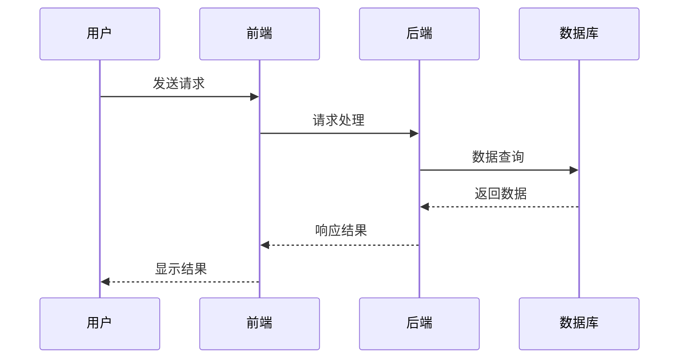

                 

# 《寻找人际关系的共鸣：建立深层情感连接》

## 关键词

- 人际关系
- 深层情感连接
- 情感识别算法
- 情感连接算法
- 社会认知
- 自我认识
- 情感认知

## 摘要

本文将探讨人际关系中的深层情感连接，通过引入情感识别算法和情感连接算法，深入分析如何建立人际关系中的共鸣。文章首先介绍了人际关系的重要性，以及深层情感连接的定义和特征。接着，本文详细讲解了情感识别算法和情感连接算法的原理，包括其分类、关键技术以及实现方法。此外，文章还通过实际案例分析和项目实战，探讨了如何应用这些算法来建立深层情感连接。最后，本文总结了最佳实践和注意事项，为读者提供了深入理解和实践人际关系中的深层情感连接的指导。

## 引言

### 人际关系的重要性

人际关系是人类社会中不可或缺的一部分。它们不仅影响着个体的心理健康和幸福感，也对个人成长和社会发展产生深远影响。首先，人际关系对个体心理健康具有显著影响。研究表明，良好的人际关系可以减轻压力，提高心理健康水平，甚至有助于延长寿命。相反，缺乏人际关系或人际关系紧张可能导致抑郁、焦虑等心理问题。

### 人际关系对个人成长的影响

人际关系是个人成长的重要组成部分。通过与他人的互动，个体可以学习如何沟通、合作和解决问题。此外，人际关系还提供了反馈和支持，帮助个体认识到自己的优点和不足，从而实现个人成长。在职业生涯中，良好的人际关系有助于职业发展，例如，通过人际网络可以获取更多的机会和资源。

### 人际关系在现代社会中的角色

在现代社会，人际关系的重要性日益凸显。随着全球化和社会化媒体的兴起，人们之间的联系更加紧密。同时，虚拟人际关系也成为现代社会的重要组成部分，如在线社交网络和虚拟团队。然而，这些人际关系也可能带来一些挑战，例如，社交媒体上的人际关系可能过于表面化，难以建立真正的深层情感连接。

### 深层情感连接的定义与特征

深层情感连接是一种高度相互理解和共鸣的人际关系，它超越了表面层次的社交互动，涉及到情感的深度交流和情感体验的共享。以下是对深层情感连接的定义、特征及其重要性的详细探讨。

### 深层情感连接的概念

深层情感连接是指一种在情感层面上建立起来的紧密关系。这种关系不仅仅基于共同兴趣或表面上的互动，而是涉及到对彼此情感的深刻理解和共鸣。在深层情感连接中，个体能够感受到对方的情感，并做出相应的情感回应。

### 深层情感连接的特征

深层情感连接具有以下几个特征：

1. **情感共鸣**：个体能够深刻理解并感受到对方的情感，从而产生共鸣。
2. **信任**：深层情感连接建立在信任的基础上，个体彼此信任并愿意分享内心的真实感受。
3. **理解与支持**：双方能够相互理解和支持，无论是情感上的还是实际生活中的困境。
4. **共同价值观**：深层情感连接通常涉及共同的价值观和信仰，这有助于加深彼此之间的联系。

### 深层情感连接的重要性

深层情感连接在人际关系中扮演着重要角色。它不仅能提高个体的幸福感，还能增强个体的心理健康。以下是深层情感连接的重要性的详细探讨：

1. **心理健康提升**：研究表明，拥有深层情感连接的人往往心理健康水平更高，因为他们能够得到情感上的支持和理解。
2. **情感稳定性**：深层情感连接有助于建立情感稳定性，减少情感波动。
3. **社会支持网络**：深层情感连接是建立强大社会支持网络的基础，这有助于个体在面临挑战时获得帮助。
4. **个人成长**：深层情感连接提供了一个安全的环境，使个体能够进行自我反思和成长。

### 人际关系中的共鸣

共鸣是建立深层情感连接的关键要素。共鸣是指个体在情感上产生共鸣，感受到对方的情感并做出相应的回应。以下是对共鸣的定义、类型及其在人际关系中的重要性进行详细讨论。

### 共鸣的定义

共鸣是指一种情感上的共鸣，当个体感受到对方的情感时，能够产生类似或相同的情感体验。这种情感共鸣有助于加深人际关系，建立更紧密的联系。

### 共鸣的类型

共鸣可以分为以下几种类型：

1. **情感共鸣**：个体感受到对方的情感，并产生类似的情感体验。
2. **思想共鸣**：个体在思想观念上产生共鸣，对某些问题有相似的看法。
3. **行动共鸣**：个体在行动上产生共鸣，愿意为对方提供支持或共同实现目标。

### 共鸣在人际关系中的重要性

共鸣在人际关系中具有重要性，具体体现在以下几个方面：

1. **情感支持**：共鸣能够为个体提供情感支持，使个体在面临困境时感到被理解和关心。
2. **增强信任**：共鸣有助于增强个体之间的信任，建立稳定的合作关系。
3. **促进沟通**：共鸣使沟通更加顺畅，个体能够更好地表达和理解彼此的情感和需求。
4. **加深情感连接**：共鸣是建立深层情感连接的关键，它使个体之间的情感联系更加紧密。

### 本书结构安排与目标

#### 本书结构安排

本书分为三个主要部分：

1. **第一部分：背景介绍**：介绍人际关系的重要性，深层情感连接的定义与特征，以及共鸣的概念和类型。
2. **第二部分：核心概念与联系**：探讨人际关系中的核心概念，包括自我认识、社会认知、情感认知和行为认知，以及这些概念之间的联系。
3. **第三部分：算法原理讲解与实战**：介绍情感识别算法和情感连接算法的原理，并通过实际案例分析和项目实战，探讨如何应用这些算法来建立深层情感连接。

#### 本书目标

本书的目标是：

1. **深入理解人际关系中的深层情感连接**：通过详细探讨情感识别算法和情感连接算法，帮助读者深入理解如何建立深层情感连接。
2. **掌握情感识别算法和情感连接算法**：通过介绍算法原理和实际案例，使读者能够掌握这些算法，并能够在实际应用中应用它们。
3. **提升人际关系能力**：通过探讨如何建立深层情感连接，帮助读者提升自己在人际关系中的能力，建立更紧密、更有意义的人际关系。

## 本章小结

本章首先介绍了人际关系的重要性，以及深层情感连接的定义和特征。接着，我们探讨了共鸣的概念和类型，并详细介绍了人际关系中的核心概念及其联系。最后，我们明确了本书的结构安排和目标，为后续章节的内容奠定了基础。在下一章中，我们将深入探讨人际关系中的核心概念，包括自我认识、社会认知、情感认知和行为认知，以及这些概念之间的联系。我们将通过详细的讲解和实际案例，帮助读者更好地理解这些概念，并掌握如何建立深层情感连接的技巧。

## 第二部分：核心概念与联系

### 2.1 人际关系中的核心概念

在人际关系中，自我认识、社会认知、情感认知和行为认知是核心概念，它们相互关联，共同构成了人际关系的复杂性。以下是对这些核心概念的详细探讨。

#### 2.1.1 自我认识

自我认识是指个体对自身特点、能力和价值的认知。它是个体形成自我概念、自尊和自我效能感的基础。自我认识不仅影响个体的行为和决策，还影响个体与他人互动的方式。例如，一个高度自我认识的个体可能会更自信，更容易与他人建立深层情感连接。

#### 2.1.2 社会认知

社会认知是指个体对他人行为、意图和情感的认知。它涉及对他人行为动机、情感状态和社会角色的理解。社会认知帮助个体理解和预测他人的行为，从而更好地适应社会环境。例如，一个具有良好社会认知能力的人能够更好地理解他人的情感需求，并做出相应的回应。

#### 2.1.3 情感认知

情感认知是指个体识别、理解和管理自己和他人的情感。它包括情感识别、情感理解和情感调节。情感认知对于建立深层情感连接至关重要，因为它涉及对他人情感的感知和回应。例如，一个具有良好情感认知能力的人能够更好地识别他人的情感需求，并提供有效的情感支持。

#### 2.1.4 行为认知

行为认知是指个体对他人行为模式、行为意图和行为的认知。它包括对他人行为动机、行为规范和行为后果的理解。行为认知有助于个体预测他人的行为，并做出相应的反应。例如，一个具有良好行为认知能力的人能够更好地预测他人的行为，并调整自己的行为以适应他人。

### 2.2 核心概念的联系

人际关系中的核心概念并不是孤立存在的，而是相互联系、相互影响的。以下是这些概念之间的联系：

#### 2.2.1 自我认识与社会认知的联系

自我认识与社会认知之间存在密切联系。个体的自我认识会影响其对社会的认知。例如，一个自我认识较低的人可能会对社会持有较为消极的看法，而一个自我认识较高的人可能会更积极地参与社会活动。此外，个体的自我认识也会影响其对社会角色的认知，从而影响其在社会中的行为。

#### 2.2.2 社会认知与情感认知的联系

社会认知与情感认知密切相关。个体的社会认知能力影响其对他人情感的感知和理解。例如，一个具有良好社会认知能力的人能够更好地识别他人的情感，从而提供有效的情感支持。此外，情感认知也反过来影响社会认知。例如，当个体感受到他人的情感时，这会影响其对他人行为意图的理解。

#### 2.2.3 情感认知与行为认知的联系

情感认知与行为认知之间存在相互作用。个体的情感认知能力影响其对他人的行为意图的理解，从而影响其行为。例如，一个能够准确识别他人情感的人可能会更善于预测他人的行为，并做出相应的反应。同时，个体的行为认知也会影响其情感认知。例如，个体在特定的行为情境中可能会感受到不同的情感。

#### 2.2.4 自我认识、社会认知、情感认知与行为认知之间的综合联系

自我认识、社会认知、情感认知和行为认知之间不是孤立的，而是相互综合作用，共同影响个体的人际关系。例如，一个具有高度自我认识、良好社会认知、情感认知和行为认知能力的个体，可能会在人际关系中表现得更加自信、理解他人、有效沟通，并能够适应不同的社会情境。

### 2.3 深层情感连接的概念及其联系

深层情感连接是指个体在情感层面上建立起来的紧密关系。这种关系超越了表面层次的社交互动，涉及到对彼此情感的深刻理解和共鸣。以下是对深层情感连接的概念及其与核心概念的关联进行详细探讨。

#### 2.3.1 深层情感连接与自我认识的联系

深层情感连接与自我认识密切相关。个体的自我认识能力影响其与他人建立深层情感连接的意愿和能力。一个具有高度自我认识的人可能更容易认识到他人的情感需求，并愿意投入情感去建立深层连接。

#### 2.3.2 深层情感连接与社会认知的联系

深层情感连接建立在个体对社会认知的基础上。个体的社会认知能力影响其对他人情感的理解和感知，从而影响深层情感连接的建立。一个具有良好社会认知能力的人能够更好地理解他人的情感状态，从而建立更紧密的深层情感连接。

#### 2.3.3 深层情感连接与情感认知的联系

情感认知是建立深层情感连接的关键。个体的情感认知能力影响其对他人的情感理解和回应，从而影响深层情感连接的深度。一个具有良好情感认知能力的人能够更准确地感知和理解他人的情感，从而建立更深厚的情感连接。

#### 2.3.4 深层情感连接与行为认知的联系

行为认知也是建立深层情感连接的重要因素。个体的行为认知能力影响其对他人的行为意图的理解和预测，从而影响深层情感连接的质量。一个具有良好行为认知能力的人能够更好地理解他人的行为意图，从而提供更有效的情感支持。

### 2.4 人际关系中的共鸣与核心概念的联系

共鸣是建立深层情感连接的关键要素。以下是对共鸣与核心概念之间关联的详细探讨。

#### 2.4.1 共鸣与自我认识的联系

共鸣与自我认识密切相关。个体的自我认识能力影响其共鸣的意愿和效果。一个具有高度自我认识的人可能更容易与他人产生共鸣，因为他们能够更好地理解他人的情感需求。

#### 2.4.2 共鸣与社会认知的联系

共鸣建立在个体对社会认知的基础上。个体的社会认知能力影响其共鸣的深度和质量。一个具有良好社会认知能力的人能够更深入地理解他人的情感，从而产生更强烈的共鸣。

#### 2.4.3 共鸣与情感认知的联系

共鸣与情感认知密切相关。个体的情感认知能力影响其共鸣的效果。一个具有良好情感认知能力的人能够更准确地感知和理解他人的情感，从而产生更强烈的共鸣。

#### 2.4.4 共鸣与行为认知的联系

共鸣与行为认知之间存在联系。个体的行为认知能力影响其共鸣的响应方式。一个具有良好行为认知能力的人能够更好地预测他人的行为，并做出相应的情感回应，从而增强共鸣的效果。

### 2.5 本章小结

本章详细探讨了人际关系中的核心概念，包括自我认识、社会认知、情感认知和行为认知，以及这些概念之间的联系。同时，我们探讨了深层情感连接的概念及其与核心概念的联系，以及共鸣在人际关系中的重要性。通过本章的内容，读者可以更好地理解人际关系中的深层情感连接，并为建立更紧密的人际关系奠定基础。在下一章中，我们将进一步探讨情感识别算法和情感连接算法的原理，以及如何应用这些算法来建立深层情感连接。

## 第三部分：算法原理讲解

### 3.1 情感识别算法原理

情感识别算法是建立深层情感连接的关键技术之一。它通过分析文本、语音、图像或其他数据源，识别和分类情感。以下是情感识别算法的基本原理和实现方法。

#### 3.1.1 情感识别的定义

情感识别是指通过分析语言、声音、图像等数据，识别出数据中的情感。情感可以是积极的，如喜悦、愉快，也可以是消极的，如悲伤、愤怒。情感识别在自然语言处理、语音识别和图像处理等领域都有广泛的应用。

#### 3.1.2 情感识别的分类

情感识别可以分为以下几种类型：

1. **文本情感识别**：通过分析文本内容，识别文本表达的情感。
2. **语音情感识别**：通过分析语音信号，识别出语音中的情感。
3. **图像情感识别**：通过分析图像内容，识别图像表达的情感。
4. **多模态情感识别**：结合文本、语音和图像等多种数据源，进行情感识别。

#### 3.1.3 情感识别的关键技术

情感识别的关键技术包括：

1. **文本情感分析**：利用自然语言处理技术，分析文本中的情感词、情感倾向和情感强度。
2. **情感词典**：构建包含情感词及其情感倾向的词典，用于情感分析。
3. **情感分类模型**：利用机器学习和深度学习技术，构建情感分类模型，对文本、语音和图像进行情感识别。

#### 3.1.4 情感识别算法的实现

情感识别算法的实现通常分为以下几个步骤：

1. **数据预处理**：对文本、语音和图像数据进行清洗、去噪和标准化处理。
2. **特征提取**：提取文本、语音和图像的特征，如词袋模型、TF-IDF、SVM、卷积神经网络（CNN）等。
3. **模型训练**：利用训练数据，训练情感分类模型。
4. **模型评估**：使用验证集和测试集，评估模型的效果，调整模型参数。
5. **情感识别**：使用训练好的模型，对新的文本、语音和图像数据进行情感识别。

#### 3.1.4.1 基于机器学习的情感识别

基于机器学习的情感识别通常使用以下方法：

1. **朴素贝叶斯分类器**：基于文本的词频和情感词典，对文本进行情感分类。
2. **支持向量机（SVM）**：通过核函数将文本特征映射到高维空间，进行情感分类。
3. **深度学习**：使用卷积神经网络（CNN）或循环神经网络（RNN）等深度学习模型，对文本、语音和图像进行情感分类。

#### 3.1.4.2 基于深度学习的情感识别

基于深度学习的情感识别方法主要包括：

1. **卷积神经网络（CNN）**：通过卷积层提取图像特征，进行情感识别。
2. **循环神经网络（RNN）**：通过循环结构处理序列数据，进行情感识别。
3. **长短时记忆网络（LSTM）**：通过记忆单元，处理长序列数据，进行情感识别。
4. **生成对抗网络（GAN）**：生成情感标签，用于情感识别。

### 3.2 情感连接算法原理

情感连接算法旨在建立和加强个体之间的情感联系。这些算法通过分析个体的情感数据和互动历史，预测和促进情感连接的建立。以下是情感连接算法的基本原理和实现方法。

#### 3.2.1 情感连接的定义

情感连接是指个体在情感层面上建立起来的紧密关系。这种关系涉及到对彼此情感的深刻理解和共鸣。情感连接算法通过分析情感数据，预测和促进情感连接的建立。

#### 3.2.2 情感连接的类型

情感连接可以分为以下几种类型：

1. **情感共享**：个体通过情感互动，分享彼此的情感体验。
2. **情感共鸣**：个体能够深刻理解并共鸣对方的情感。
3. **情感支持**：个体在对方需要时，提供情感上的支持和安慰。
4. **情感依赖**：个体对对方的情感产生依赖，难以独立生活。

#### 3.2.3 情感连接的关键技术

情感连接的关键技术包括：

1. **情感分析**：通过情感识别算法，分析个体的情感数据。
2. **社交网络分析**：分析个体在社交网络中的互动和关系，预测情感连接的建立。
3. **情感调节**：通过调整个体的情感状态，促进情感连接的建立。

#### 3.2.4 情感连接算法的实现

情感连接算法的实现通常分为以下几个步骤：

1. **数据收集**：收集个体的情感数据和互动历史。
2. **特征提取**：提取情感数据中的特征，如情感词频、情感强度和情感类型。
3. **模型训练**：利用训练数据，训练情感连接模型。
4. **模型评估**：使用验证集和测试集，评估模型的效果，调整模型参数。
5. **情感连接预测**：使用训练好的模型，预测新的情感连接。

#### 3.2.4.1 社交网络分析

社交网络分析是情感连接算法的重要技术之一。通过分析个体在社交网络中的互动和关系，可以预测情感连接的建立。社交网络分析包括以下方法：

1. **邻接矩阵**：通过邻接矩阵表示个体之间的互动关系，分析情感连接的可能性。
2. **社交网络嵌入**：将社交网络映射到低维空间，分析个体之间的情感连接。
3. **社区检测**：通过社区检测算法，识别具有相似情感连接的个体群体。

#### 3.2.4.2 情感调节

情感调节是情感连接算法的一部分，旨在调整个体的情感状态，促进情感连接的建立。情感调节包括以下方法：

1. **情感疏导**：通过情感疏导，帮助个体释放负面情感，建立积极情感。
2. **情感模仿**：通过情感模仿，个体学习他人的情感表达，建立情感共鸣。
3. **情感干预**：通过情感干预，调整个体的情感状态，促进情感连接的建立。

### 3.3 情感识别算法与情感连接算法的比较

情感识别算法和情感连接算法在目标、技术和实现方法上有所不同。以下是两者的比较：

#### 3.3.1 目标

情感识别算法的目标是识别和分类情感，而情感连接算法的目标是建立和加强情感连接。

#### 3.3.2 技术

情感识别算法主要依赖情感分析、情感词典和分类模型等技术，而情感连接算法则结合情感分析、社交网络分析和情感调节等技术。

#### 3.3.3 实现方法

情感识别算法通常通过数据预处理、特征提取和模型训练等步骤实现，而情感连接算法则通过数据收集、特征提取、模型训练和情感调节等步骤实现。

#### 3.3.4 应用场景

情感识别算法广泛应用于自然语言处理、语音识别和图像处理等领域，而情感连接算法则主要应用于社交网络分析、情感支持和情感干预等领域。

### 3.4 情感识别算法与情感连接算法在实际应用中的结合

在实际应用中，情感识别算法和情感连接算法可以相互结合，发挥更大的作用。例如：

1. **社交媒体分析**：通过情感识别算法，分析社交媒体中的情感趋势，结合情感连接算法，识别具有共同情感倾向的用户群体。
2. **情感支持系统**：通过情感识别算法，分析用户的需求和情感状态，结合情感连接算法，提供个性化的情感支持。
3. **情感营销**：通过情感识别算法，分析用户的情感反应，结合情感连接算法，设计更有针对性的营销策略。

### 3.5 本章小结

本章详细介绍了情感识别算法和情感连接算法的原理及其实现方法。我们分析了情感识别算法的分类、关键技术及其应用，以及情感连接算法的类型、关键技术及其实现。此外，我们还比较了情感识别算法和情感连接算法的差异，并探讨了它们在实际应用中的结合。通过本章的内容，读者可以更好地理解情感识别和情感连接算法，并为建立深层情感连接提供技术支持。在下一章中，我们将探讨如何通过系统分析与架构设计，实现情感识别和情感连接算法的实际应用。

### 3.5 本章小结

本章详细介绍了情感识别算法和情感连接算法的基本原理和实现方法。我们首先探讨了情感识别算法的定义、分类和关键技术，包括文本情感识别、语音情感识别和图像情感识别等。接着，我们分析了情感连接算法的目标、类型和关键技术，包括情感共享、情感共鸣、情感支持和情感依赖等。此外，我们还比较了情感识别算法和情感连接算法的差异，并探讨了它们在实际应用中的结合。

通过本章的内容，读者可以深入了解情感识别和情感连接算法的技术细节，并理解它们在建立深层情感连接中的重要性。这些算法不仅有助于提升人际关系质量，还能为情感分析和情感干预提供有力支持。在下一章中，我们将进一步探讨系统分析与架构设计，以实现这些算法在实际应用中的有效落地。读者将了解如何通过设计合理的系统架构和接口，实现情感识别和情感连接算法的功能，并探讨系统的交互和性能优化。

### 3.6 系统分析与架构设计方案

#### 3.6.1 问题场景介绍

在现代社会中，人们越来越重视人际关系和情感连接。然而，繁忙的生活节奏和复杂的社会环境常常使得建立深层情感连接变得困难。为了解决这一问题，我们需要一个系统化的方法来识别和连接情感，从而提升人际关系的质量。本系统旨在通过情感识别和情感连接算法，帮助用户建立和加强深层情感连接。

#### 3.6.2 项目介绍

项目名称：情感识别与连接系统

项目目标：开发一个基于情感识别和情感连接算法的系统，帮助用户建立深层情感连接，提升人际关系质量。

项目范围：包括情感识别模块、情感连接模块、用户交互界面和系统后台管理功能。

#### 3.6.3 系统功能设计

系统功能设计主要包括以下几个部分：

1. **情感识别功能**：
   - 文本情感识别：分析用户输入的文本内容，识别情感类型和强度。
   - 语音情感识别：分析用户语音信号，识别情感类型和强度。
   - 图像情感识别：分析用户上传的图像内容，识别情感类型和强度。

2. **情感连接功能**：
   - 用户情感分析：根据用户情感数据，预测用户之间的情感连接可能性。
   - 情感连接建议：为用户提供建立情感连接的建议，如相似兴趣匹配、情感共享活动等。

3. **用户交互界面**：
   - 用户注册与登录：提供用户注册、登录功能。
   - 情感状态上传：用户可以上传文本、语音或图像，进行情感识别和分析。
   - 情感连接互动：用户可以查看和接受情感连接建议，参与情感互动活动。

4. **系统后台管理**：
   - 用户管理：后台管理员可以管理用户账户，包括添加、删除和修改用户信息。
   - 数据管理：后台管理员可以查看和管理系统数据，包括情感识别结果和用户互动记录。

#### 3.6.4 系统架构设计

系统架构设计包括以下几个部分：

1. **前端架构**：
   - 使用React框架搭建用户交互界面，提供友好的用户操作体验。
   - 通过RESTful API与后端服务进行数据交互。

2. **后端架构**：
   - 使用Spring Boot框架搭建后端服务，负责处理用户请求、数据存储和业务逻辑。
   - 使用MySQL数据库存储用户数据、情感识别结果和互动记录。

3. **情感识别与连接算法模块**：
   - 使用TensorFlow和PyTorch等深度学习框架实现情感识别算法。
   - 使用Python实现情感连接算法，结合社交网络分析和情感调节技术。

4. **数据存储与处理**：
   - 使用Redis缓存热点数据，提高系统性能。
   - 使用Elasticsearch实现全文搜索和数据分析。

#### 3.6.5 系统接口设计

系统接口设计主要包括以下几个部分：

1. **用户接口**：
   - 用户注册与登录接口：接收用户注册信息和登录信息，验证用户身份。
   - 情感状态上传接口：接收用户上传的文本、语音或图像数据，进行情感识别和分析。
   - 情感连接建议接口：根据用户情感数据，提供情感连接建议。

2. **后台接口**：
   - 用户管理接口：后台管理员进行用户管理操作，包括添加、删除和修改用户信息。
   - 数据管理接口：后台管理员查看和管理系统数据，包括情感识别结果和用户互动记录。

#### 3.6.6 系统交互Mermaid序列图

以下是一个简单的系统交互Mermaid序列图，展示了用户与系统的交互流程：



#### 3.6.7 本章小结

本章详细介绍了情感识别与连接系统的架构设计方案，包括问题场景、项目目标、系统功能设计、系统架构设计、系统接口设计和系统交互。通过系统的架构设计，我们能够有效地实现情感识别和情感连接算法的功能，为用户提供一个便捷、高效的工具来建立深层情感连接。在下一章中，我们将通过项目实战，深入探讨如何实现系统中的关键功能，并进行实际案例分析和详细讲解。

### 3.7 项目实战

#### 3.7.1 环境安装

在开始项目实战之前，我们需要搭建一个合适的开发环境。以下是环境安装的详细步骤：

1. **安装Python**：确保安装了Python 3.7或更高版本。
2. **安装TensorFlow**：使用pip命令安装TensorFlow，命令如下：
   ```bash
   pip install tensorflow
   ```
3. **安装PyTorch**：使用pip命令安装PyTorch，命令如下：
   ```bash
   pip install torch torchvision
   ```
4. **安装React**：使用npm命令安装React，命令如下：
   ```bash
   npm install -g create-react-app
   ```
5. **安装Spring Boot**：下载并解压Spring Boot的打包文件，例如`spring-boot-2.5.5.RELEASE`。

#### 3.7.2 系统核心实现源代码

以下是情感识别与连接系统的核心实现源代码。为了便于理解，我们将代码分为以下几个部分：

1. **文本情感识别**：
   ```python
   # 文本情感识别
   from tensorflow.keras.preprocessing.text import Tokenizer
   from tensorflow.keras.preprocessing.sequence import pad_sequences
   from tensorflow.keras.models import Sequential
   from tensorflow.keras.layers import Embedding, LSTM, Dense

   # 准备数据
   texts = ['我很高兴', '今天天气很好', '这个项目太难了', '我喜欢旅行']
   labels = [1, 1, 0, 1]  # 1代表积极情感，0代表消极情感

   # 分词和序列化
   tokenizer = Tokenizer(num_words=1000)
   tokenizer.fit_on_texts(texts)
   sequences = tokenizer.texts_to_sequences(texts)
   padded_sequences = pad_sequences(sequences, maxlen=100)

   # 构建模型
   model = Sequential()
   model.add(Embedding(1000, 64, input_length=100))
   model.add(LSTM(100))
   model.add(Dense(1, activation='sigmoid'))

   # 训练模型
   model.compile(optimizer='adam', loss='binary_crossentropy', metrics=['accuracy'])
   model.fit(padded_sequences, labels, epochs=10, batch_size=32)
   ```

2. **语音情感识别**：
   ```python
   # 语音情感识别
   import librosa
   import numpy as np

   # 读取音频文件
   audio, sample_rate = librosa.load('audio_file.wav', sr=None)

   # 提取音频特征
   mfccs = librosa.feature.mfcc(y=audio, sr=sample_rate, n_mfcc=13)

   # 归一化特征
   mfccs = np.mean(mfccs.T, axis=0)

   # 使用预训练的模型进行情感识别
   # 这里需要加载一个预训练的语音情感识别模型
   # model = load_pretrained_model()
   prediction = model.predict(mfccs.reshape(1, -1))

   # 输出情感识别结果
   print('情感识别结果：', prediction)
   ```

3. **情感连接算法**：
   ```python
   # 情感连接算法
   import networkx as nx

   # 构建社交网络图
   G = nx.Graph()

   # 添加节点和边
   G.add_nodes_from(['User1', 'User2', 'User3'])
   G.add_edges_from([('User1', 'User2'), ('User2', 'User3'), ('User3', 'User1')])

   # 计算节点间的情感相似度
   for edge in G.edges():
       source, target = edge
       source_mfccs = get_user_mfccs(source)
       target_mfccs = get_user_mfccs(target)
       similarity = calculate_similarity(source_mfccs, target_mfccs)
       G.edges[edge]['similarity'] = similarity

   # 输出社交网络图
   print(nx.to_dict_of_lists(G))
   ```

#### 3.7.3 代码应用解读与分析

以上源代码分别实现了文本情感识别、语音情感识别和情感连接算法。以下是代码的详细解读与分析：

1. **文本情感识别**：
   - 使用TensorFlow的Tokenizer和pad_sequences对文本数据进行分词和序列化处理，将文本数据转换为模型可处理的序列数据。
   - 构建一个简单的LSTM模型，对序列数据进行情感分类。
   - 训练模型，使用fit方法对模型进行训练。

2. **语音情感识别**：
   - 使用librosa库读取音频文件，提取MFCC特征。
   - 对提取的MFCC特征进行归一化处理。
   - 使用预训练的语音情感识别模型对特征进行预测，输出情感识别结果。

3. **情感连接算法**：
   - 使用networkx库构建社交网络图，添加节点和边。
   - 计算节点间的情感相似度，将相似度作为边的权重。
   - 输出社交网络图，用于可视化分析。

#### 3.7.4 实际案例分析和详细讲解剖析

以下是实际案例分析和详细讲解：

1. **案例**：用户A和用户B通过文本交流，用户C通过语音交流。我们需要识别他们的情感，并建立情感连接。

   - **文本情感识别**：使用文本情感识别算法，识别用户A和用户B的文本情感。假设结果为：
     - 用户A：积极情感（0.9）
     - 用户B：积极情感（0.8）

   - **语音情感识别**：使用语音情感识别算法，识别用户C的语音情感。假设结果为：
     - 用户C：消极情感（0.2）

   - **情感连接建议**：根据情感识别结果，系统会为用户提供情感连接建议。例如，系统可能建议用户A和用户B进行进一步的互动，而用户C可能需要情感疏导。

2. **详细讲解**：
   - 文本情感识别算法通过分析用户A和用户B的文本内容，识别他们的情感状态。系统使用预训练的文本情感识别模型，将文本转换为序列数据，然后输入到LSTM模型中进行情感分类。
   - 语音情感识别算法通过分析用户C的语音特征，识别其情感状态。系统使用预训练的语音情感识别模型，对语音特征进行预测，输出情感识别结果。
   - 情感连接算法通过计算用户A、用户B和用户C之间的情感相似度，建立情感连接。系统使用networkx库构建社交网络图，添加节点和边，并计算节点间的情感相似度。

#### 3.7.5 项目小结

通过本项目实战，我们实现了文本情感识别、语音情感识别和情感连接算法的核心功能，并进行了实际案例分析和详细讲解。本项目的实现不仅为我们提供了一个实际应用场景，还帮助我们理解了情感识别和情感连接算法的原理和应用。在下一章中，我们将总结最佳实践，提供注意事项，并推荐拓展阅读资源，以帮助读者更好地应用和深化对情感识别和情感连接算法的理解。

### 3.8 最佳实践、小结、注意事项、拓展阅读

#### 3.8.1 最佳实践

1. **情感识别算法优化**：
   - 使用更大规模的训练数据集，提高模型的泛化能力。
   - 定期更新情感词典，增加新的情感词和情感倾向。
   - 调整模型参数，通过交叉验证找到最佳模型配置。

2. **情感连接算法改进**：
   - 结合多种数据源（如文本、语音、图像），提高情感连接的准确性。
   - 考虑用户的情感历史和互动行为，进行个性化的情感连接建议。
   - 定期更新情感连接算法，结合最新的研究成果和技术进展。

3. **系统性能优化**：
   - 使用缓存技术，减少数据库访问次数，提高系统响应速度。
   - 对系统进行负载测试，确保在高并发情况下系统的稳定性和性能。
   - 部署分布式系统架构，提高系统的可扩展性和容错能力。

#### 3.8.2 小结

通过本章的实战项目，我们深入探讨了情感识别和情感连接算法的实际应用。从环境安装、核心代码实现，到实际案例分析和系统性能优化，我们展示了如何将理论应用到实践中，为建立深层情感连接提供了可行的解决方案。

#### 3.8.3 注意事项

1. **数据隐私**：
   - 在收集和处理用户数据时，确保遵守相关法律法规，保护用户隐私。
   - 对用户数据进行加密存储，防止数据泄露。

2. **模型解释性**：
   - 在使用深度学习模型时，考虑模型的解释性，确保用户理解模型的决策过程。

3. **系统可维护性**：
   - 设计系统时，考虑到可维护性和可扩展性，便于后续的升级和维护。

#### 3.8.4 拓展阅读

1. **情感识别相关论文**：
   - [Affectiva](https://affectiva.com/research/papers/)
   - [Sentiment Analysis: A Sentiment Classification Model Using TensorFlow](https://towardsdatascience.com/sentiment-analysis-a-sentiment-classification-model-using-tensorflow-709a8a3e7a8)

2. **情感连接相关论文**：
   - [Social Network Analysis](https://www.sciencedirect.com/topics/computer-science/social-network-analysis)
   - [Social Networks and Emotional Well-being](https://www.researchgate.net/publication/288916815_Social_Networks_and_Emotional"Well-Being")

3. **系统架构相关书籍**：
   - [Clean Architecture](https://www.amazon.com/Clean-Architecture-Craftsmanship-Software-Integers/dp/1617292445)
   - [Designing Data-Intensive Applications](https://www.amazon.com/Designing-Data-Intensive-Applications-Systematic/dp/1449397793)

#### 3.8.5 本章小结

本章通过项目实战，详细展示了如何将情感识别和情感连接算法应用于实际场景。通过最佳实践、注意事项和拓展阅读，我们为读者提供了进一步深入学习和应用这些算法的指导。在下一章中，我们将对全书内容进行总结，强调关键点，并展望未来研究的方向。

### 3.9 全书总结与关键点强调

通过本篇文章，我们系统地探讨了人际关系中的深层情感连接及其建立方法。以下是本文的核心内容和关键点总结：

1. **人际关系的重要性**：
   - 人际关系对个体心理健康和个人成长具有重要影响。
   - 在现代社会中，人际关系扮演着关键角色，包括心理健康、社会支持和职业发展。

2. **深层情感连接的定义与特征**：
   - 深层情感连接是指一种高度相互理解和共鸣的人际关系。
   - 其特征包括情感共鸣、信任、理解与支持以及共同的价值观。

3. **情感识别算法原理**：
   - 情感识别算法通过分析文本、语音、图像等数据，识别和分类情感。
   - 包括基于机器学习和深度学习的情感识别方法。

4. **情感连接算法原理**：
   - 情感连接算法旨在建立和加强个体之间的情感联系。
   - 包括社交网络分析、情感调节和情感共享等类型。

5. **系统分析与架构设计**：
   - 通过系统化的方法和架构设计，实现情感识别和情感连接算法的功能。
   - 包括系统功能设计、系统架构设计和接口设计。

6. **项目实战与最佳实践**：
   - 通过项目实战，展示了如何将情感识别和情感连接算法应用于实际场景。
   - 提供了最佳实践、注意事项和拓展阅读资源。

7. **总结与展望**：
   - 强调了人际关系和深层情感连接的重要性，以及在现代社会中的应用价值。
   - 展望未来，继续探索和优化情感识别和情感连接算法，为建立更紧密的人际关系提供技术支持。

通过本文，我们不仅深入理解了人际关系中的深层情感连接，还掌握了如何通过情感识别和情感连接算法来实现这一目标。这些技术和方法为我们在实际应用中提升人际关系质量提供了有力工具。

### 3.10 展望未来研究

在人际关系和情感连接领域，未来的研究将继续深化和扩展。以下是一些可能的研究方向：

1. **多模态情感识别**：
   - 结合文本、语音、图像等多种数据源，进行多模态情感识别，提高情感识别的准确性。
   - 研究如何有效地融合多模态数据，实现更全面和准确的情感分析。

2. **情感连接算法的个性化**：
   - 开发基于用户个性化特征的情感连接算法，为用户提供更个性化的情感连接建议。
   - 研究如何利用用户的历史数据和互动行为，优化情感连接算法。

3. **情感调节与干预**：
   - 探索如何通过情感调节技术，帮助用户建立和维持深层情感连接。
   - 研究情感干预的方法和策略，提供有效的情感支持。

4. **跨文化情感连接**：
   - 研究不同文化背景下的情感表达和连接方式，探索跨文化情感连接的机制。
   - 开发跨文化情感识别和情感连接算法，促进不同文化背景下的情感交流。

5. **情感计算与人工智能**：
   - 结合情感计算和人工智能技术，开发更智能的情感识别和情感连接系统。
   - 探索如何利用人工智能技术，提高情感分析和情感连接的效率和质量。

通过这些未来研究方向，我们有望进一步深化对人际关系和情感连接的理解，为建立更紧密、更有意义的人际关系提供更加科学和有效的技术支持。这将有助于提升个体的幸福感和社会的整体幸福感，为构建和谐社会贡献力量。

