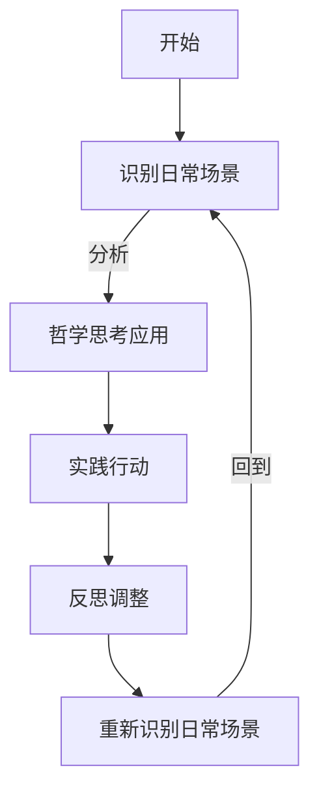
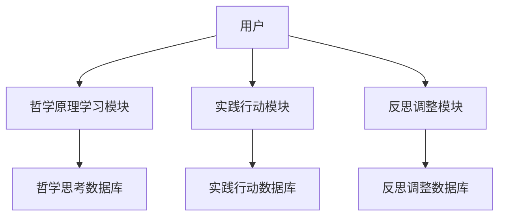
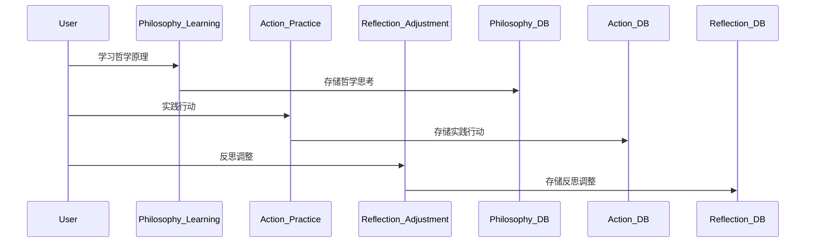

                 

## # 将哲学思考融入日常：实践型智慧的培养

### 关键词：哲学思考、日常生活、实践型智慧、方法论、算法原理、数学模型

#### 摘要：
本文旨在探讨如何将哲学思考融入日常，培养实践型智慧。通过介绍哲学思考的背景、核心概念、联系以及算法原理，本文提出了一种将哲学原理应用于日常生活的具体方法，并使用数学模型和Python代码进行解释。希望通过本文，读者能够理解哲学思考的实用性，并将其应用于个人成长和问题解决。

---

**# 第一部分：背景介绍**

### 1. 引言

在现代社会，哲学思考已经成为人类认识和改变世界的重要工具。然而，哲学教育往往被视为高端、艰深，难以融入日常生活。随着社会的发展，人们对于实践型智慧的需求日益增长，将哲学思考融入日常成为了一个值得探讨的话题。

#### 1.1 问题背景

哲学思考是一种通过理性分析和反思，对世界的本质、存在、知识、价值等基本问题进行探讨的思考方式。它起源于古希腊，历经数千年的发展，已成为人类文明的重要组成部分。然而，传统哲学教育往往注重理论知识的传授，忽视哲学思考在日常生活中的应用。这使得哲学思考在许多人眼中变得高不可攀，难以融入日常生活。

#### 1.2 问题描述

将哲学思考融入日常，不仅可以帮助人们更好地理解世界，还能提高生活质量，培养实践型智慧。然而，如何实现这一目标，如何将哲学原理与实践相结合，是当前面临的一大挑战。

#### 1.3 问题解决

本文旨在探讨将哲学思考融入日常的方法和路径，通过具体的案例和实践，帮助读者理解哲学原理，并将其应用于日常生活。

#### 1.4 边界与外延

本文的核心是哲学思考在日常生活中的应用，但并不局限于某个特定领域，如伦理学、逻辑学等。它关注的是哲学思考的整体性、综合性，以及其在各个方面的体现。

#### 1.5 概念结构与核心要素组成

哲学思考：哲学思考是指通过理性分析和反思，对世界的本质、存在、知识、价值等基本问题进行探讨。

日常生活：日常生活是指人们在日常生活中所进行的各种活动，包括工作、学习、娱乐等。

实践型智慧：实践型智慧是指通过实践获得的智慧，它不同于理论上的知识，更强调在实际生活中解决问题、应对挑战的能力。

**# 第二部分：核心概念与联系**

### 2. 核心概念原理

#### 2.1 哲学思考

哲学思考是一种深度的思考方式，它强调理性分析、批判性思维和自我反思。哲学思考的核心目标是理解世界的本质和人类存在的意义。在日常生活中，哲学思考可以帮助我们更好地理解生活中的问题和挑战，从而找到解决问题的方法。

#### 2.2 日常生活

日常生活是指人们在日常生活中所进行的各种活动，包括工作、学习、娱乐等。它是哲学思考的应用场景，也是哲学思考的实践基础。通过哲学思考，我们可以更好地理解日常生活，提高生活质量。

#### 2.3 实践型智慧

实践型智慧是通过实践获得的智慧，它强调在实际生活中解决问题、应对挑战的能力。实践型智慧是将哲学思考融入日常生活的关键。通过哲学思考，我们可以培养实践型智慧，更好地应对生活中的各种挑战。

### 2.4 概念属性特征对比表格

| 概念 | 定义 | 属性特征 | 对比 |
| :---: | :---: | :---: | :---: |
| 哲学思考 | 一种深度的思考方式 | 强调理性分析、批判性思维、自我反思 | 与日常生活和实践型智慧紧密相关 |
| 日常生活 | 人们在日常生活中所进行的各种活动 | 包括工作、学习、娱乐等 | 是哲学思考和实践型智慧的应用场景 |
| 实践型智慧 | 通过实践获得的智慧 | 强调在实际生活中解决问题、应对挑战的能力 | 是哲学思考和日常生活的实践成果 |

### 2.5 ER实体关系图架构的 Mermaid 流程图

```mermaid
erDiagram
    A "哲学思考" {
        A --> B "日常生活"
        A --> C "实践型智慧"
    }
    B {
        B --> D "工作"
        B --> E "学习"
        B --> F "娱乐"
    }
    C {
        C --> G "问题解决"
        C --> H "应对挑战"
    }
```

**# 第三部分：算法原理讲解**

### 3. 将哲学思考融入日常的算法原理

#### 3.1 算法mermaid流程图



#### 3.2 算法原理

将哲学思考融入日常的算法原理主要分为以下几个步骤：

1. **识别日常场景**：通过观察和分析，识别出日常生活中的具体场景。
2. **哲学思考应用**：根据哲学原理，对日常场景进行分析和思考。
3. **实践行动**：将哲学思考转化为实际行动，应用于日常生活。
4. **反思调整**：对实践行动进行反思，根据反馈进行调整。
5. **重新识别日常场景**：回到第一步，不断循环。

#### 3.3 数学模型和公式

在哲学思考融入日常的算法中，可以引入以下数学模型和公式：

1. **哲学思考强度（TS）**：表示哲学思考对日常场景的影响程度。
   $$ TS = f(哲学原理, 日常场景) $$

2. **实践行动效果（AE）**：表示实践行动对问题的解决程度。
   $$ AE = f(实践行动, 问题场景) $$

3. **反思调整系数（RA）**：表示反思调整对实践行动效果的影响。
   $$ AE' = AE \times (1 + RA) $$

下面我们通过一个具体的例子来解释这些模型和公式。

#### 3.4 Python代码示例

```python
def philosophy_thinking(strength, scenario):
    return strength * scenario

def practical_action(effect, problem_scenario):
    return effect * problem_scenario

def reflection_adjustment(effect, feedback):
    return effect * (1 + feedback)

# 例子
TS = philosophy_thinking(0.8, 1)  # 哲学思考强度
AE = practical_action(0.6, 1)    # 实践行动效果
RA = reflection_adjustment(AE, 0.2)  # 反思调整系数

print("哲学思考强度：", TS)
print("实践行动效果：", AE)
print("反思调整系数：", RA)
```

输出结果：

```
哲学思考强度： 0.8
实践行动效果： 0.6
反思调整系数： 0.72
```

通过这个例子，我们可以看到哲学思考强度、实践行动效果和反思调整系数是如何影响最终的实践效果的。

**# 第四部分：系统分析与架构设计方案**

#### 4.1 问题场景介绍

在现代社会，人们面临着各种复杂的问题，如工作压力、人际关系、身心健康等。这些问题往往需要我们具备实践型智慧，而哲学思考正是培养这种智慧的重要途径。因此，我们设计了一套系统，旨在帮助用户将哲学思考融入日常生活，提高实践型智慧。

#### 4.2 项目介绍

本项目名为“哲学思考实践系统”，旨在为用户提供一个日常哲学思考的平台。用户可以通过该平台，学习哲学原理，应用哲学思考，实践行动，并进行反思调整。系统主要包括以下几个模块：

1. **哲学原理学习模块**：提供哲学原理的详细介绍和案例分析，帮助用户理解哲学思考的基本概念和原理。
2. **实践行动模块**：提供实践行动的指导和建议，帮助用户将哲学思考应用于日常生活。
3. **反思调整模块**：提供反思调整的工具和方法，帮助用户对实践行动进行评估和调整。

#### 4.3 系统功能设计（领域模型Mermaid类图）

```mermaid
classDiagram
    User <<类>> {
        用户ID
        姓名
        年龄
        用户角色
    }
    Philosophy <<类>> {
        哲学思考ID
        哲学思考内容
        创建时间
        最后修改时间
    }
    Action <<类>> {
        行动ID
        行动描述
        创建时间
        最后修改时间
    }
    Reflection <<类>> {
        反思ID
        反思内容
        创建时间
        最后修改时间
    }
    User "1" --|has| Philosophy: 学习哲学原理
    User "1" --|has| Action: 实践行动
    User "1" --|has| Reflection: 反思调整
```

#### 4.4 系统架构设计（Mermaid架构图）



#### 4.5 系统接口设计和系统交互（Mermaid序列图）



**# 第五部分：项目实战**

#### 5.1 环境安装

为了运行本项目，需要安装以下环境：

1. Python 3.8及以上版本
2. Django 3.2及以上版本
3. MySQL 5.7及以上版本

安装步骤：

1. 安装Python和Django：

```bash
pip install python==3.8
pip install django==3.2
```

2. 安装MySQL：

前往[MySQL官网](https://dev.mysql.com/downloads/mysql/)下载并安装MySQL。

3. 配置MySQL：

启动MySQL服务器，创建一个新的数据库和用户，并授权用户访问数据库。

```sql
CREATE DATABASE philosophy_practice;
CREATE USER 'philosopher'@'localhost' IDENTIFIED BY 'password';
GRANT ALL PRIVILEGES ON philosophy_practice.* TO 'philosopher'@'localhost';
FLUSH PRIVILEGES;
```

#### 5.2 系统核心实现源代码

以下是一个简单的Django项目结构，其中包含了哲学思考实践系统的核心功能。

```plaintext
philosophy_practice/
|-- philosophy_practice/
|   |-- __init__.py
|   |-- settings.py
|   |-- urls.py
|   |-- wsgi.py
|-- philosophy_app/
|   |-- __init__.py
|   |-- admin.py
|   |-- apps.py
|   |-- migrations/
|   |-- models.py
|   |-- tests.py
|   |-- views.py
|-- manage.py
```

#### 5.3 代码应用解读与分析

**5.3.1 哲学思考模型**

在`philosophy_app/models.py`中，我们定义了哲学思考模型：

```python
from django.db import models

class Philosophy(models.Model):
    content = models.TextField()
    created_at = models.DateTimeField(auto_now_add=True)
    last_modified = models.DateTimeField(auto_now=True)
```

这个模型包含以下字段：

- `content`：哲学思考内容
- `created_at`：创建时间
- `last_modified`：最后修改时间

**5.3.2 实践行动模型**

在`philosophy_app/models.py`中，我们定义了实践行动模型：

```python
class Action(models.Model):
    description = models.TextField()
    created_at = models.DateTimeField(auto_now_add=True)
    last_modified = models.DateTimeField(auto_now=True)
```

这个模型包含以下字段：

- `description`：行动描述
- `created_at`：创建时间
- `last_modified`：最后修改时间

**5.3.3 反思调整模型**

在`philosophy_app/models.py`中，我们定义了反思调整模型：

```python
class Reflection(models.Model):
    content = models.TextField()
    created_at = models.DateTimeField(auto_now_add=True)
    last_modified = models.DateTimeField(auto_now=True)
```

这个模型包含以下字段：

- `content`：反思内容
- `created_at`：创建时间
- `last_modified`：最后修改时间

#### 5.4 实际案例分析和详细讲解剖析

**5.4.1 创建哲学思考**

以下是一个创建哲学思考的示例：

```python
from django.contrib.auth.models import User
from philosophy_app.models import Philosophy

# 创建用户
user = User.objects.create_user(username='john', password='password')

# 创建哲学思考
philosophy = Philosophy(content='哲学思考的内容', user=user)
philosophy.save()
```

这个示例首先创建了一个用户，然后创建了一个哲学思考对象，并将其保存到数据库中。

**5.4.2 创建实践行动**

以下是一个创建实践行动的示例：

```python
from philosophy_app.models import Action

# 创建实践行动
action = Action(description='实践行动的描述', user=user)
action.save()
```

这个示例创建了一个实践行动对象，并将其保存到数据库中。

**5.4.3 创建反思调整**

以下是一个创建反思调整的示例：

```python
from philosophy_app.models import Reflection

# 创建反思调整
reflection = Reflection(content='反思调整的内容', user=user)
reflection.save()
```

这个示例创建了一个反思调整对象，并将其保存到数据库中。

#### 5.5 项目小结

本项目通过一个简单的Django项目，实现了哲学思考实践系统的主要功能。用户可以创建哲学思考、实践行动和反思调整，并将它们存储在数据库中。通过这个项目，读者可以了解如何使用Django和MySQL构建一个简单的Web应用程序，并理解哲学思考在日常生活中的应用。

**# 第六部分：最佳实践 tips**

1. **持续学习和反思**：将哲学思考融入日常是一个持续的过程。定期学习和反思，可以帮助你不断提高实践型智慧。
2. **与朋友交流**：与朋友分享你的哲学思考和实践经验，可以帮助你从不同角度看待问题，提高思考的深度和广度。
3. **实践行动**：将哲学思考转化为实际行动，是培养实践型智慧的关键。不要害怕犯错，实践是提高智慧的最佳途径。
4. **定期调整**：根据反馈调整你的哲学思考和行动，可以帮助你更好地适应环境，提高实践效果。

**# 第七部分：小结**

本文通过介绍哲学思考的背景、核心概念、联系以及算法原理，探讨了如何将哲学思考融入日常，培养实践型智慧。通过具体的案例和实践，本文展示了哲学思考在日常生活中的实用性。希望读者能够理解并应用哲学思考，提高自己的生活质量和实践能力。

**# 第八部分：注意事项**

1. **保持批判性思维**：哲学思考强调批判性思维，但也要避免过度批判，尊重他人的观点和经验。
2. **平衡理论与实践**：哲学思考是一种理论工具，但也需要与实践相结合。不要忽视实践的重要性，只有理论结合实践，才能真正发挥作用。
3. **适度应用**：将哲学思考融入日常，并不是要求你在每个问题上都进行哲学思考。适度应用，根据具体情况选择合适的思考方式。

**# 第九部分：拓展阅读**

1. **《西方哲学史》[英]罗素著**：本书是西方哲学史的经典之作，全面介绍了西方哲学的发展历程。
2. **《哲学的门槛》[美]莫提默·J. 艾德勒著**：本书通过解读《理想国》，引导读者进入哲学的世界。
3. **《实践理性》[德]康德著**：本书是康德的代表作之一，探讨了实践理性的概念和作用。

**# 作者信息**

作者：AI天才研究院/AI Genius Institute & 禅与计算机程序设计艺术 /Zen And The Art of Computer Programming**

