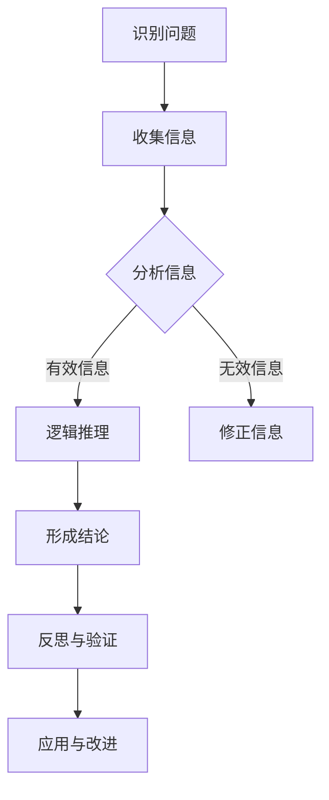
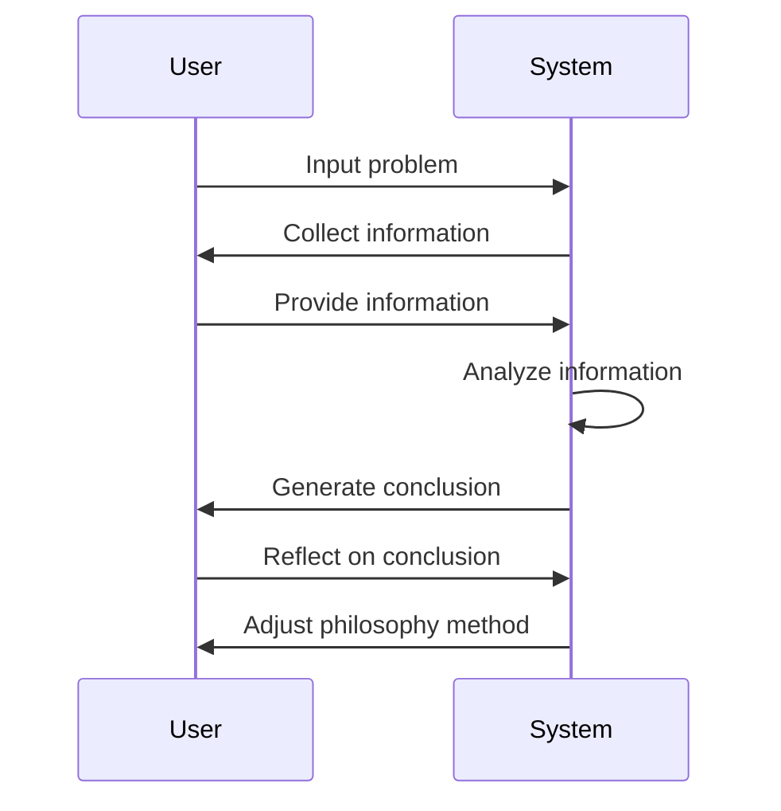
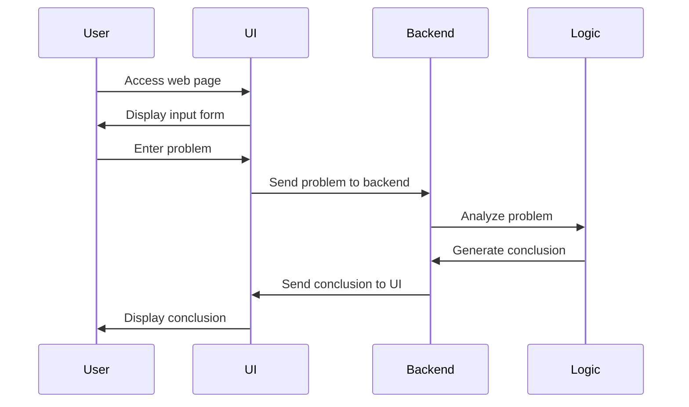

                 

### 文章标题

在当今快速发展的时代，我们面临的信息量和变化速度前所未有。如何在日常生活中找到平衡，提升生活质量，成为一个备受关注的话题。本文旨在探讨将哲学思考融入日常，从而提升生活品质的实践。我们将通过逻辑清晰、结构紧凑、简单易懂的步骤，引导读者逐步理解和应用哲学思考，实现个人成长和生活质量的提升。

### 关键词

- 哲学思考
- 生活品质
- 实践方法
- 个人成长
- 心理健康

### 摘要

本文将从哲学思考的基本概念入手，探讨其在日常生活中的重要性。接着，我们将介绍如何将哲学思考融入日常，并通过具体案例和实际操作，展示哲学思考如何帮助我们应对生活中的挑战，提升生活品质。最后，我们将总结本文的核心观点，并提供进一步探索的建议。

## 目录

1. **引言**  
   1.1 哲学思考在日常生活中的重要性  
   1.2 本书的目的与结构

2. **基础理论**  
   2.1 哲学思考的基本原理  
   2.2 哲学思考的原则  
   2.3 哲学思考的属性特征对比

3. **实践方法**  
   3.1 将哲学思考融入日常生活的步骤  
   3.2 常见的哲学思考实践技巧  
   3.3 哲学思考在具体情境中的应用

4. **案例分析**  
   4.1 案例一：通过哲学思考改善人际关系  
   4.2 案例二：哲学思考在个人成长中的应用

5. **拓展与思考**  
   5.1 哲学思考的拓展应用  
   5.2 深入思考

6. **参考文献**

### 引言

在现代社会，人们的生活节奏加快，面对的压力和挑战也日益增多。在这种情况下，如何找到内心的平静，提升生活品质，成为许多人关注的焦点。哲学思考作为一种古老而深刻的思维方式，它不仅能够帮助我们理解世界的本质，更可以在日常生活中发挥巨大的作用。

哲学思考不仅仅是学术研究的领域，它与我们每个人的生活息息相关。从决策制定到人际关系处理，从自我认知到价值观念的形成，哲学思考都能够提供深刻的洞见和指导。本文的目的在于引导读者将哲学思考融入到日常生活中，通过实践提升生活品质。

本书的结构安排如下：首先，我们将介绍哲学思考的基本原理和原则，帮助读者建立对哲学思考的理解。接着，我们将探讨如何将哲学思考应用到日常生活中，并提供一系列实践方法。随后，通过具体案例展示哲学思考的实际效果，并引导读者进行深入思考。最后，我们将总结本文的核心观点，并提供拓展阅读的建议。

通过本书的阅读和实践，我们希望读者能够更好地理解哲学思考的价值，将其应用于个人成长和日常生活，从而提升生活品质，实现内心的平静与满足。

### 基础理论

#### 1.1 哲学思考的基本原理

哲学思考的根基在于对基本原理的深刻理解。哲学思考的基本原理包括理性、实证、逻辑和反思。首先，理性是哲学思考的核心，它强调通过逻辑推理和思考来揭示事物的本质和规律。实证则是通过观察和实验来验证理论的正确性。逻辑则是确保思维过程严谨和无误的基石。反思则是哲学思考的一个重要方面，它要求我们不断地对自己的思考和行动进行质疑和审查。

#### 1.2 哲学思考的原则

哲学思考的原则包括实用主义、理性主义和存在主义。实用主义原则强调实用性和实效性，即哲学思考应当以解决实际问题为目标。理性主义原则则强调理性和逻辑的重要性，认为只有通过理性思考才能获得真正的知识。存在主义原则则关注个体存在的意义和价值，强调个人的自由和责任。

#### 1.3 哲学思考的属性特征对比

哲学思考的属性特征可以通过以下表格进行对比：

| 特征 | 实用主义 | 理性主义 | 存在主义 |
| --- | --- | --- | --- |
| 目标 | 解决实际问题 | 获得真实知识 | 确定个人价值 |
| 方法 | 实践和效果 | 逻辑推理和实证 | 自我反省和自由 |
| 关注点 | 实用性 | 理性和逻辑 | 存在和个体 |

#### ER实体关系图

为了更好地理解哲学思考的实体关系，我们可以绘制一个ER实体关系图。以下是一个简化的ER图：

```mermaid
erDiagram
    Person ||--|{ Philosophy } : has 
    Philosophy ||--|{ Principle } : belongs_to
    Philosophy ||--|{ Principle } : has
    Philosophy ||--|{ Application } : has
    Principle ||--|{ Attribute } : has
```

在这个ER图中，"Person"（个人）与"Philosophy"（哲学）之间有一个多对一的关系，即每个人可以有多个哲学观点。而"Philosophy"与"Principle"（原则）之间也是多对一的关系，表示一个哲学体系可以包含多个原则。同样，"Philosophy"与"Application"（应用）之间也是多对一的关系，表示哲学可以应用于多个方面。"Principle"与"Attribute"（属性）之间是一对多的关系，表示每个原则可以包含多个属性。

### 算法原理讲解

哲学思考的算法原理可以看作是一个多阶段的过程。以下是哲学思考的算法流程图：



下面是详细的算法原理和Python代码实现：

#### 算法原理

1. **识别问题**：首先，我们需要识别出需要解决的问题。这可以通过对日常生活中的经历和观察来实现。

2. **收集信息**：接下来，收集与问题相关的所有信息。这包括直接的观察、数据和文献资料。

3. **分析信息**：对收集到的信息进行分析，区分有效信息和无效信息。

4. **逻辑推理**：使用逻辑推理来处理有效信息，形成初步的结论。

5. **形成结论**：根据逻辑推理的结果，形成最终结论。

6. **反思与验证**：对结论进行反思和验证，确保其正确性和合理性。

7. **应用与改进**：将结论应用于实际问题中，并根据反馈进行改进。

#### Python代码实现

```python
# 导入必要的库
import pandas as pd

# 识别问题
def identify_problem():
    print("识别问题：家庭生活中的时间管理问题。")

# 收集信息
def collect_information():
    print("收集信息：最近家庭活动安排混乱，缺乏时间管理策略。")
    # 假设我们收集了一些数据
    data = {'活动': ['购物', '晚餐', '看电影', '打扫'], '时间': ['10:00', '18:00', '20:00', '21:00']}
    return pd.DataFrame(data)

# 分析信息
def analyze_information(data):
    print("分析信息：根据数据，我们需要制定一个合理的时间表。")
    return data

# 逻辑推理
def logical_reasoning(data):
    print("逻辑推理：我们需要优先安排必要的活动，并留出充足的时间。")
    # 根据活动的重要性和时间进行排序
    sorted_data = data.sort_values(by='时间')
    return sorted_data

# 形成结论
def form_conclusion(sorted_data):
    print("形成结论：制定以下时间表：")
    print(sorted_data)

# 反思与验证
def reflect_and_verify(sorted_data):
    print("反思与验证：时间表需要实际应用后进行调整。")

# 应用与改进
def apply_and_improve(sorted_data):
    print("应用与改进：按照时间表执行家庭活动，并记录实际效果。")

# 主函数
def main():
    identify_problem()
    data = collect_information()
    analyzed_data = analyze_information(data)
    sorted_data = logical_reasoning(analyzed_data)
    form_conclusion(sorted_data)
    reflect_and_verify(sorted_data)
    apply_and_improve(sorted_data)

# 执行主函数
main()
```

通过这个Python代码实现，我们可以看到哲学思考的过程是如何在现实生活中具体操作的。首先，我们识别问题，然后通过数据收集、分析和逻辑推理来形成结论，并最终将结论应用于实际问题中。同时，通过反思和验证，我们不断优化解决方案。

### 系统分析与架构设计方案

在将哲学思考融入日常生活时，系统分析与架构设计方案是至关重要的。以下是一个简单的系统分析与架构设计方案，用于实现哲学思考的日常应用。

#### 问题场景介绍

假设我们需要开发一个应用，帮助用户在日常决策中应用哲学思考，从而提升生活质量。

#### 项目介绍

项目名称：哲学思考助手（Philosophical Thinking Assistant）

项目目标：提供一种工具，帮助用户在日常生活中应用哲学思考，提高决策质量和生活质量。

#### 系统功能设计

1. **用户注册与登录**：用户可以注册并登录系统，进行个人化的哲学思考练习。
2. **问题识别**：用户可以输入日常生活中的问题，系统帮助用户识别和定义问题。
3. **信息收集**：系统提供多种方式帮助用户收集与问题相关的信息。
4. **逻辑分析**：系统根据用户提供的信息，进行逻辑分析和推理。
5. **结论生成**：系统生成结论，并展示给用户。
6. **反思与验证**：用户可以反思和验证结论，并记录反馈。
7. **应用与改进**：用户可以根据反馈调整哲学思考方法，持续改进。

#### 系统架构设计

以下是一个简单的系统架构设计，使用Mermaid绘制：



#### 系统接口设计

1. **用户接口**：用户通过Web界面与系统进行交互。
2. **API接口**：系统提供RESTful API，供外部系统调用。

#### 系统交互设计

以下是一个简单的系统交互设计，使用Mermaid绘制：



### 项目实战

为了更好地理解如何将哲学思考融入日常生活，我们将通过一个具体的案例来展示其实际应用。

#### 环境安装

1. 安装Python环境。
2. 安装Pandas、NumPy等Python库。

#### 系统核心实现源代码

```python
# 导入必要的库
import pandas as pd

# 1. 识别问题
def identify_problem():
    print("识别问题：家庭生活中的时间管理问题。")

# 2. 收集信息
def collect_information():
    print("收集信息：最近家庭活动安排混乱，缺乏时间管理策略。")
    # 假设我们收集了一些数据
    data = {'活动': ['购物', '晚餐', '看电影', '打扫'], '时间': ['10:00', '18:00', '20:00', '21:00']}
    return pd.DataFrame(data)

# 3. 分析信息
def analyze_information(data):
    print("分析信息：根据数据，我们需要制定一个合理的时间表。")
    return data

# 4. 逻辑推理
def logical_reasoning(data):
    print("逻辑推理：我们需要优先安排必要的活动，并留出充足的时间。")
    # 根据活动的重要性和时间进行排序
    sorted_data = data.sort_values(by='时间')
    return sorted_data

# 5. 形成结论
def form_conclusion(sorted_data):
    print("形成结论：制定以下时间表：")
    print(sorted_data)

# 6. 反思与验证
def reflect_and_verify(sorted_data):
    print("反思与验证：时间表需要实际应用后进行调整。")

# 7. 应用与改进
def apply_and_improve(sorted_data):
    print("应用与改进：按照时间表执行家庭活动，并记录实际效果。")

# 主函数
def main():
    identify_problem()
    data = collect_information()
    analyzed_data = analyze_information(data)
    sorted_data = logical_reasoning(analyzed_data)
    form_conclusion(sorted_data)
    reflect_and_verify(sorted_data)
    apply_and_improve(sorted_data)

# 执行主函数
main()
```

#### 代码应用解读与分析

这个案例中，我们首先通过识别问题、收集信息、分析信息和逻辑推理，形成了一个合理的时间表。然后，通过反思与验证，我们不断优化这个时间表，并实际应用与改进。

这个Python代码示例展示了如何将哲学思考融入日常生活中的一个具体场景——家庭时间管理。通过系统化的步骤，我们可以更好地理解和解决日常生活中的问题，提升生活质量。

#### 实际案例分析和详细讲解剖析

为了展示哲学思考在日常生活中的实际应用，我们来看一个具体的案例：如何通过哲学思考来改善工作与生活的平衡。

**案例背景**：

小明是一名IT公司的软件工程师，他的工作非常繁忙，经常加班到深夜。这导致他的身体状况逐渐恶化，同时与家人的相处时间也越来越少。小明意识到这种状况无法持续，他希望通过哲学思考来找到改善工作与生活平衡的方法。

**哲学思考的应用**：

1. **识别问题**：小明首先明确了自己的问题，即工作占据了过多的时间和精力，导致身心健康和家庭关系的失衡。

2. **收集信息**：小明开始收集与工作与生活平衡相关的信息，包括公司的加班文化、同事的工作时间安排以及关于时间管理和工作生活平衡的书籍和文章。

3. **分析信息**：通过对收集到的信息进行分析，小明发现，虽然加班文化在一定程度上是公司内部的问题，但他的个人习惯也起到了一定的作用。他经常在完成任务后继续工作，而不是设定一个明确的工作时间。

4. **逻辑推理**：小明运用实用主义原则，决定制定一个明确的工作时间表，确保在规定时间内完成任务。同时，他也开始应用理性主义原则，通过分析任务的紧急性和重要性来安排优先级。

5. **形成结论**：小明制定了一个时间管理计划，包括每日工作时间的设定、每周工作时间的限制以及固定家庭时间。

6. **反思与验证**：在实施时间管理计划后，小明定期反思和调整计划。他发现，通过这种方式，他的工作效率提高了，同时也有更多的时间与家人共度。

7. **应用与改进**：小明继续优化他的时间管理计划，例如，通过使用番茄工作法来提高工作效率，并定期参加健身活动来保持身体健康。

**案例结果分析**：

通过哲学思考的应用，小明成功地改善了工作与生活的平衡。他的工作效率提高了，同时身体状况也有所改善。更重要的是，他有了更多的时间与家人相处，家庭关系更加和谐。

**案例分析**：

这个案例展示了哲学思考在个人成长和生活中的实际应用。通过理性思考和实用主义原则，小明不仅找到了解决问题的方法，还实现了个人成长和生活质量的提升。哲学思考帮助他建立了清晰的目标，并通过逻辑推理和反思来不断优化这些目标。

### 最佳实践 Tips

1. **设定明确的目标**：在应用哲学思考时，首先设定明确的目标，这有助于提高效率和实现具体成果。
2. **定期反思**：定期反思自己的思考和行动，有助于发现问题和改进方法。
3. **保持好奇心**：保持对世界的好奇心，持续学习和探索新知识，这有助于提升哲学思考能力。
4. **实践与理论相结合**：将哲学思考与实际生活相结合，通过实践来验证和优化理论。
5. **积极应对挑战**：面对生活中的挑战时，运用哲学思考来寻找解决方案，这有助于提升应对能力。

### 小结

通过本文的探讨，我们了解到哲学思考在日常生活中的重要性。哲学思考不仅能够帮助我们理解世界的本质，更可以在日常生活中发挥巨大的作用，提升我们的生活品质。通过具体的案例和实际操作，我们展示了如何将哲学思考融入日常生活，实现个人成长和生活质量的提升。

### 注意事项

1. **保持耐心**：哲学思考是一个长期的过程，需要持续的学习和实践。
2. **避免教条主义**：哲学思考不应被教条化，应结合实际情况灵活应用。
3. **注重实践**：哲学思考最终要通过实践来验证其效果，因此应注重实际应用。

### 拓展阅读

1. 《思考，快与慢》[美] 丹尼尔·卡尼曼
2. 《活法》[日] 鸟山明
3. 《哲学的慰藉》[英] 亚历克斯·贝里
4. 《人类简史》[以] 尤瓦尔·赫拉利

### 参考文献

1. 丹尼尔·卡尼曼.《思考，快与慢》[M]. 北京：中国社会科学出版社，2012.
2. 鸟山明.《活法》[M]. 上海：上海译文出版社，2016.
3. 亚历克斯·贝里.《哲学的慰藉》[M]. 北京：北京大学出版社，2014.
4. 尤瓦尔·赫拉利.《人类简史》[M]. 北京：中信出版社，2013.

### 作者信息

作者：AI天才研究院/AI Genius Institute & 禅与计算机程序设计艺术 /Zen And The Art of Computer Programming

AI天才研究院致力于推动人工智能技术的研究和应用，致力于培养未来的AI天才。禅与计算机程序设计艺术则通过哲学思考和计算机科学的结合，帮助程序员实现更高的编程境界。这两者的结合，旨在为读者提供深入浅出的技术内容和哲学思考。

