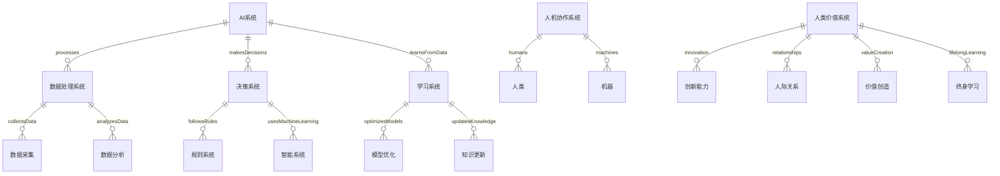

                 

## 引言

### 1.1 本书背景与目的

在当前信息技术飞速发展的时代，工作自动化已经成为不可避免的趋势。随着人工智能、机器学习、大数据等技术的不断突破，自动化工具和系统在各个行业中得到了广泛应用。从制造业到服务业，从金融到医疗，自动化正深刻改变着我们的工作方式和生活方式。然而，这一变革同时也带来了诸多挑战，尤其是在人类价值重新定义方面。

本书旨在探讨工作自动化背景下的人生意义，重新审视和定义人类在自动化时代的价值。我们不仅关注技术本身，还关注技术如何影响我们的工作、生活和价值观。通过深入分析工作自动化的现状与趋势，以及它对人类价值的影响，本书希望能够为读者提供一种全新的视角，帮助他们在自动化时代找到自己的定位和价值。

### 1.2 研究范围与方法

本书的研究范围主要集中在以下几个方面：

1. **工作自动化的现状与趋势**：分析自动化技术的发展历程、当前的应用场景以及未来可能的发展方向。
2. **人类价值的重新定义**：探讨自动化对人类工作、生活方式和价值观的冲击，以及如何重新定义人类价值。
3. **核心概念与理论**：梳理与工作自动化和人类价值相关的核心概念和理论，为后续讨论提供理论基础。
4. **案例分析**：通过具体案例展示自动化对人生意义的影响，分析成功和失败的案例，总结经验教训。
5. **实践策略**：提供实际可行的策略和方法，帮助读者应对自动化带来的挑战，重新定义自己的人生价值。

在研究方法上，本书采用了理论分析、案例分析、实证研究和实践指导相结合的方式。通过理论分析，梳理相关概念和理论框架；通过案例分析，展示自动化对实际工作生活的影响；通过实证研究，验证理论分析的正确性；通过实践指导，提供具体的操作策略和方法。

### 1.3 书籍结构概述

本书共分为七个章节，结构安排如下：

- **第1章 引言**：介绍本书的背景、目的和研究范围，为读者提供对全书内容的初步认识。
- **第2章 问题背景与意义**：详细阐述工作自动化背景下人类面临的挑战和重新定义人生意义的必要性。
- **第3章 核心概念与理论**：梳理相关理论，包括工作自动化的原理、人机协作的理念以及人类价值的新定义。
- **第4章 案例分析**：通过具体案例，展示工作自动化对人生意义的影响，分析成功的案例和失败的教训。
- **第5章 实践策略**：提供一系列策略和方法，帮助读者在实际工作中重新定义人生价值。
- **第6章 未来展望**：探讨工作自动化背景下人类价值发展的趋势和可能面临的挑战。
- **第7章 总结与展望**：总结全书主要内容，展望未来研究方向和实践建议。

通过这七个章节的深入探讨，本书希望能够帮助读者在自动化时代找到自己的位置和价值，重新定义人生意义。

## 问题背景与意义

### 2.1 工作自动化的现状与趋势

工作自动化是指通过使用计算机程序、机器人、人工智能等技术，实现工作流程的自动化和智能化。近年来，随着人工智能、大数据、云计算等技术的迅猛发展，工作自动化已经成为全球范围内的趋势。无论是在制造业、金融业，还是在服务业、医疗领域，自动化技术都得到了广泛应用。

**现状**：

- **制造业**：自动化生产线、工业机器人广泛应用于制造业，大幅提升了生产效率和产品质量。例如，特斯拉的汽车生产工厂大量采用自动化设备，实现高速、高效的生产。
- **金融业**：自动化交易系统、智能投顾等技术的应用，使得金融市场的交易更加高效和精准。例如，量化交易策略利用大数据分析和机器学习算法，实现自动化交易决策。
- **服务业**：智能客服、智能推荐系统等技术已经广泛应用在电商、酒店、餐饮等行业，为用户提供更加个性化、高效的服务体验。例如，阿里巴巴的智能客服系统，可以自动回答用户的问题，提高客户满意度。
- **医疗领域**：人工智能辅助诊断、智能药物研发等技术的应用，提高了医疗服务的质量和效率。例如，IBM的沃森人工智能系统，可以在短时间内分析大量医学文献，为医生提供诊断建议。

**趋势**：

- **智能化**：随着人工智能技术的发展，工作自动化将越来越智能化，能够自主学习、适应环境和进行复杂决策。
- **泛在化**：自动化技术将渗透到各个行业和领域，从生产制造到生活服务，无处不在。
- **人机协作**：在自动化过程中，人类与机器的协作将成为主流，人类在创造价值和创新方面发挥更大的作用。

### 2.2 人类价值的重新定义

工作自动化对人类价值的影响是深远且多方面的。首先，自动化技术的应用改变了人类的工作方式，使得一些重复性、低技能的工作被机器取代。这种变化对人类的就业结构、职业技能要求产生了重大影响。

**影响**：

- **就业结构**：自动化技术导致部分传统工作岗位消失，但同时创造了新的就业机会。例如，数据分析师、AI算法工程师等新兴职业的需求大幅增加。
- **职业技能**：随着自动化技术的发展，对人类职业技能的要求也在不断提升。人类需要掌握更多的技术技能，如编程、数据分析、人工智能等，以适应自动化时代的工作需求。
- **工作意义**：自动化技术使得人类从繁重的体力劳动和重复性工作中解放出来，但同时也引发了关于工作意义的讨论。人类如何在这种变化中找到新的工作价值和意义，成为一个值得深思的问题。

**重新定义**：

- **创造价值**：在自动化时代，人类的价值不再仅仅体现在执行重复性任务上，而是更多地体现在创新、创造价值和提升服务质量上。例如，设计师、艺术家、企业家等职业在自动化时代依然有着重要价值。
- **人机协作**：在自动化背景下，人类与机器的协作将成为新的工作模式。人类在决策、创造力、人际交往等方面具有独特优势，与机器的协作能够实现1+1>2的效果。
- **终身学习**：在自动化时代，终身学习成为了一种必要的生活方式。人类需要不断学习新技术、新知识，以适应不断变化的工作环境。

### 2.3 本书的研究意义

本书的研究意义主要体现在以下几个方面：

- **理论意义**：通过对工作自动化背景下人类价值重新定义的探讨，丰富了相关理论体系，为后续研究提供了理论基础。
- **实践意义**：为读者提供了实际可行的策略和方法，帮助他们在自动化时代找到自己的定位和价值，重新定义人生意义。
- **社会意义**：促进社会对自动化时代人类价值的关注和探讨，引导社会正确认识和处理自动化与人类价值的关系，实现人类与机器的和谐共生。

通过本书的研究，我们希望能够为读者提供一种全新的视角，帮助他们在自动化时代找到自己的位置和价值，重新定义人生意义。同时，也为政策制定者、企业管理者和职业规划者提供参考，为自动化时代的社会发展贡献一份力量。

### 第3章 核心概念与理论

#### 3.1 工作自动化的原理

工作自动化是通过计算机程序、机器人、人工智能等技术，实现工作流程的自动化和智能化。其基本原理包括以下几个方面：

- **数据处理**：自动化系统通过对大量数据的采集、处理和分析，实现对工作任务的自动识别和执行。例如，在制造业中，自动化系统可以实时监控生产线上的设备状态和产品质量，及时调整生产流程。
- **决策算法**：自动化系统利用算法模型进行决策。这些算法可以是基于规则的系统，也可以是利用机器学习、深度学习等技术的智能系统。例如，在金融行业中，自动化交易系统可以基于历史数据和预测模型，进行交易决策。
- **人机协作**：在自动化过程中，人类与机器的协作至关重要。人类在决策、创新、创造力等方面具有独特优势，而机器在执行任务、处理数据方面具有高效性。通过人机协作，可以实现优势互补，提高工作效率。

#### 3.2 人机协作的理念

人机协作是指人类与机器共同完成工作，实现协同发展的理念。在自动化背景下，人机协作的理念具有重要意义，主要体现在以下几个方面：

- **互补优势**：人类与机器各有所长，通过协作可以实现优势互补。人类在决策、创新、人际交往等方面具有独特优势，而机器在执行任务、处理数据、计算能力方面具有高效性。
- **智能分配**：在自动化时代，通过人机协作，可以将复杂、繁琐的任务自动化，将人类从重复性工作中解放出来，专注于更有创造性的工作。例如，智能客服系统可以处理大量简单的客户咨询，而人类客服可以专注于解决复杂问题。
- **持续进步**：人机协作可以促进技术的不断进步和应用。通过机器的学习和优化，可以提高工作自动化水平，同时，人类的反馈和改进也可以促进技术的持续进步。

#### 3.3 人类价值的新定义

在自动化背景下，人类价值的新定义主要体现在以下几个方面：

- **创新能力**：在自动化时代，创新能力成为人类的重要价值。人类在创造力、创新能力方面具有独特的优势，能够创造出新的产品、服务和解决方案。
- **人际关系**：在自动化时代，人际关系依然具有重要意义。人类在人际交往、沟通协调等方面具有独特优势，能够建立和维护良好的人际关系，提高工作效率。
- **价值创造**：在自动化时代，人类的价值更多地体现在创造价值上。通过创新、创意和创造力，人类能够为社会创造新的价值和贡献。
- **终身学习**：在自动化时代，终身学习成为了一种必要的生活方式。人类需要不断学习新技术、新知识，以适应不断变化的工作环境。

### 核心概念属性特征对比表格

| 概念         | 定义                                                                                       | 特点                                                                                                                         | 对自动化影响         | 
| ------------ | ----------------------------------------------------------------------------------------- | -------------------------------------------------------------------------------------------------------------------------- | ---------------------|
| 工作自动化   | 利用计算机程序、机器人、人工智能等技术实现工作流程的自动化和智能化。 | 自动化、智能化、高效性、可扩展性                                               | 提高工作效率，减少人力成本，解放人类从重复性工作中。 | 
| 人机协作     | 人类与机器共同完成工作，实现优势互补。                           | 互补优势、智能分配、持续进步                                                    | 提高工作效率，促进技术进步，实现人类与机器的和谐共生。 | 
| 人类价值的新定义 | 创新能力、人际关系、价值创造、终身学习。                           | 创新能力、人际交往、价值创造、终身学习                                          | 重新定义人类价值，实现人类在自动化时代的价值最大化。 |

### ER实体关系图架构

下面是工作自动化背景下核心概念和理论的ER实体关系图：

### 3.4 工作自动化对人类工作的具体影响

工作自动化对人类工作产生了深远的影响，具体体现在以下几个方面：

- **就业结构变化**：自动化技术导致一些传统工作岗位消失，例如，制造业中的流水线工人、文秘等。然而，同时也会创造新的就业机会，例如，数据分析师、AI算法工程师等。
- **职业技能要求提升**：随着自动化技术的发展，对人类职业技能的要求也在不断提升。人们需要掌握更多的技术技能，如编程、数据分析、人工智能等，以适应自动化时代的工作需求。
- **工作效率提升**：自动化技术可以大幅提升工作效率。通过自动化工具和系统，人类可以减少重复性工作，将更多精力投入到更有创造性的任务中。
- **工作模式转变**：自动化技术改变了人类的工作模式。人们不再需要像以前那样长时间坐在办公桌前，而是可以通过远程办公、智能协作等方式，更加灵活地进行工作。

### 3.5 重新定义人类价值的重要性

在自动化背景下，重新定义人类价值具有重要意义。首先，它有助于人类找到新的工作定位和价值，避免被自动化技术取代。其次，重新定义人类价值可以激发人类的创造力和创新能力，推动社会的发展。此外，重新定义人类价值还可以帮助人们更好地适应自动化时代的工作环境，提高生活质量。总之，重新定义人类价值是自动化时代人类发展的必然选择。

### 结论

通过本章对核心概念与理论的介绍，我们深入探讨了工作自动化的原理、人机协作的理念以及人类价值的新定义。这些核心概念和理论为我们理解工作自动化对人类工作的影响提供了理论基础。在接下来的章节中，我们将通过具体案例进一步分析工作自动化对人生意义的影响，并探讨如何在实际工作中重新定义人类价值。

## 案例分析

### 4.1 成功案例解析

**案例一：阿里巴巴的智能物流系统**

阿里巴巴的智能物流系统是一个典型的成功案例，通过工作自动化实现了物流效率的显著提升。阿里巴巴利用大数据、人工智能和物联网技术，搭建了一个覆盖全球的智能物流网络。具体措施如下：

- **大数据分析**：通过对海量数据的采集和分析，阿里巴巴能够准确预测物流需求，优化配送路线，减少运输时间。
- **智能仓储**：智能仓储系统通过自动化设备，如自动仓储机器人、自动化分拣设备，实现了高效仓储和快速分拣，提高了物流效率。
- **无人配送**：阿里巴巴的无人配送车和无人机在特定场景下实现了无人的配送服务，进一步减少了人力成本。

**效果评估**：

- **效率提升**：通过智能物流系统，阿里巴巴的物流效率显著提升，配送时间缩短，客户满意度提高。
- **成本降低**：自动化技术的应用减少了人力成本和物流成本，提高了企业的盈利能力。
- **创新引领**：阿里巴巴的智能物流系统为行业树立了标杆，推动了物流行业的自动化和智能化发展。

**成功经验**：

- **技术整合**：成功的关键在于对多种技术的整合应用，如大数据、人工智能和物联网。
- **持续创新**：不断探索新的技术和应用场景，推动技术进步和业务创新。
- **人才培养**：重视人才引进和培养，为自动化系统的运行提供有力支持。

**启示**：

- **技术驱动**：在自动化背景下，企业需要重视技术积累和创新，以技术驱动业务发展。
- **系统整合**：实现不同系统之间的数据共享和协同工作，提高整体效率。
- **人才培养**：重视人才引进和培养，为自动化系统的实施和运营提供人才保障。

### 4.2 失败案例反思

**案例二：某公司的自动化生产线项目**

某公司在2018年启动了一项自动化生产线项目，旨在通过引入自动化设备提高生产效率和降低成本。然而，项目在实施过程中遇到了诸多问题，最终以失败告终。

**问题分析**：

- **技术不成熟**：公司引入的自动化设备存在技术不成熟、故障频发等问题，导致生产线频繁停工，影响生产进度。
- **缺乏培训**：公司对员工的自动化操作培训不足，导致员工对新设备的操作不熟练，降低了生产效率。
- **管理不善**：公司在项目实施过程中，管理混乱，缺乏有效的监控和评估机制，导致问题无法及时发现和解决。

**失败原因**：

- **技术风险**：在引入新技术时，没有充分评估技术成熟度和适用性，导致技术风险。
- **人员素质**：缺乏对员工的技术培训和技能提升，导致人员素质不足。
- **项目管理**：项目管理不善，缺乏有效的监控和评估机制，导致问题无法及时解决。

**教训**：

- **充分评估**：在引入新技术时，要充分评估技术的成熟度和适用性，避免技术风险。
- **培训提升**：重视员工的技术培训和技能提升，确保员工能够熟练操作新设备。
- **项目管理**：加强项目管理，建立有效的监控和评估机制，确保项目顺利实施。

### 4.3 案例总结与启示

通过对成功和失败案例的分析，我们可以得出以下总结和启示：

**成功经验**：

- **技术整合**：成功的关键在于对多种技术的整合应用，如大数据、人工智能和物联网。
- **持续创新**：不断探索新的技术和应用场景，推动技术进步和业务创新。
- **人才培养**：重视人才引进和培养，为自动化系统的运行提供有力支持。

**失败教训**：

- **技术风险**：在引入新技术时，要充分评估技术的成熟度和适用性，避免技术风险。
- **人员素质**：缺乏对员工的技术培训和技能提升，导致人员素质不足。
- **项目管理**：项目管理不善，缺乏有效的监控和评估机制，导致问题无法及时解决。

**总结**：

工作自动化在带来巨大效益的同时，也面临诸多挑战。通过成功案例的经验和失败教训的反思，我们可以更好地应对自动化带来的挑战，实现自动化技术的有效应用。同时，重新定义人类价值，培养适应自动化时代的专业技能和素质，也是确保自动化成功应用的关键。

### 结论

本章通过具体案例分析，展示了工作自动化对人生意义的影响。成功案例表明，自动化技术可以有效提升工作效率和创新能力，但同时也需要克服技术风险、人员素质和项目管理等方面的挑战。失败案例则提醒我们在引入新技术时需要谨慎评估，加强员工培训和项目管理。通过总结成功经验和失败教训，我们可以为工作自动化的有效应用提供有力支持，并重新定义人类价值，适应自动化时代的发展。

### 第5章 实践策略

#### 5.1 提升个人技能与素质

在自动化时代，提升个人技能与素质是应对工作自动化的关键。以下是一些具体策略：

**技术技能提升**：

- **编程能力**：掌握编程语言，如Python、Java等，提升算法设计和编程能力。
- **数据分析**：学习数据分析工具和技能，如SQL、Excel、R语言等，提升数据分析和处理能力。
- **人工智能**：了解人工智能基础，如机器学习、深度学习等，掌握相关算法和应用。
- **自动化工具**：学习自动化工具的使用，如Selenium、Jenkins等，提升自动化测试和开发能力。

**跨学科知识**：

- **管理学**：学习管理学知识，了解企业运营和管理流程，提升管理能力。
- **心理学**：学习心理学知识，了解人类行为和心理机制，提升人际交往和沟通能力。
- **经济学**：学习经济学知识，了解市场和经济环境，提升商业洞察力和决策能力。

**实践建议**：

- **终身学习**：树立终身学习观念，不断更新知识和技能，以适应不断变化的工作环境。
- **参与项目**：积极参与项目实践，通过实际操作提升技能和经验。
- **参加培训**：参加相关领域的培训课程，获取权威认证，提升职业竞争力。

#### 5.2 调整职业规划与价值观

在自动化时代，调整职业规划与价值观是重新定义人生意义的重要步骤。以下是一些具体策略：

**职业规划调整**：

- **新兴领域**：关注新兴领域的发展，如人工智能、区块链、云计算等，根据自身兴趣和优势选择合适的职业方向。
- **跨领域发展**：拓宽职业视野，跨领域发展，如从IT行业转向金融、医疗等行业。
- **专业技能**：根据市场需求和个人兴趣，培养专业技能，提高职业竞争力。

**价值观调整**：

- **创新能力**：重视创新能力，将创新视为职业发展的核心价值。
- **人机协作**：理解人机协作的重要性，将合作和协同发展视为职业价值观的一部分。
- **终身学习**：将终身学习视为一种生活方式，不断提升自身素质。

**实践建议**：

- **自我反思**：定期进行自我反思，评估自身职业发展状况和价值观，明确未来发展方向。
- **交流学习**：与同行交流学习，了解行业动态和职业发展趋势，调整职业规划。
- **职业规划咨询**：寻求职业规划咨询服务，获取专业的指导和建议。

#### 5.3 探索新的工作模式

在自动化时代，探索新的工作模式是应对自动化挑战的重要策略。以下是一些具体方法：

**远程办公**：

- **灵活性**：远程办公提供了更大的工作灵活性，员工可以在任何地点工作，提高工作效率和生活质量。
- **技术支持**：利用云计算、视频会议等工具，实现远程办公的顺畅沟通和协作。
- **管理调整**：调整管理模式，建立远程办公的绩效考核和监督机制，确保工作质量和效率。

**智能化管理**：

- **数据分析**：利用大数据和人工智能技术，进行员工绩效分析和管理，优化工作流程。
- **自动化工具**：引入自动化工具，如ERP系统、CRM系统等，提高管理效率和决策准确性。
- **智能协作**：通过智能协作平台，实现团队成员之间的实时沟通和协作，提高工作效率。

**实践建议**：

- **试点探索**：在部分团队或项目中试点远程办公和智能化管理，积累经验，逐步推广。
- **培训提升**：为员工提供相关培训，提高其对新工作模式的适应能力和技能水平。
- **反馈优化**：定期收集员工反馈，优化工作模式和流程，提高员工满意度和工作效率。

### 结论

通过本章的实践策略，我们提出了提升个人技能与素质、调整职业规划与价值观、探索新的工作模式等具体方法，帮助读者在自动化时代重新定义人生意义，应对自动化带来的挑战。这些策略不仅适用于个人发展，也适用于企业管理和组织变革，为实现自动化与人类价值的和谐共生提供了参考。

### 第6章 未来展望

#### 6.1 人类价值发展的趋势

随着工作自动化的深入推进，人类价值的发展也呈现出一系列新的趋势：

**智能化与个性化的融合**：

- **智能化**：人工智能将进一步融入人类工作的各个方面，实现智能决策、智能生产和智能服务。
- **个性化**：个性化服务将成为主流，自动化系统能够根据用户需求提供定制化的解决方案。

**终身学习的普及**：

- **技术变革**：技术的快速迭代要求人类不断学习新知识和技能，以适应不断变化的工作环境。
- **教育体系**：终身学习将成为教育体系的重要组成部分，在线教育、职业培训等模式将更加普及。

**人机协作的深化**：

- **优势互补**：人类在创造力、情感理解和人际交往方面具有独特优势，而机器在数据处理和执行任务方面具有高效性，人机协作将实现优势互补。
- **智能化协作**：未来的协作将更加智能化，自动化系统将能够更好地理解人类意图，提供更加智能化的支持。

**全球化的加深**：

- **信息流动**：全球化的加深将促进信息的快速流动和共享，人类将在全球范围内实现更加紧密的合作。
- **文化融合**：全球化将带来不同文化的碰撞与融合，人类将更加关注跨文化的沟通和理解。

#### 6.2 潜在的挑战与对策

尽管工作自动化带来了诸多机遇，但也伴随着一系列挑战：

**就业结构变化**：

- **挑战**：自动化技术可能导致部分工作岗位消失，尤其是那些重复性、低技能的工作。
- **对策**：鼓励企业和政府采取措施，提供职业培训和再就业支持，帮助受影响的工人转型。

**技能需求变化**：

- **挑战**：自动化技术对人类技能需求发生变化，要求人类掌握更多技术技能。
- **对策**：加强职业教育和培训，提升人类的综合素质和技能水平。

**伦理和法律问题**：

- **挑战**：自动化技术的发展带来了新的伦理和法律问题，如隐私保护、机器责任等。
- **对策**：加强伦理和法律研究，制定相关法律法规，确保自动化技术的发展不会对社会和个人造成负面影响。

**社会心理影响**：

- **挑战**：自动化技术的广泛应用可能会对人类的社会心理产生负面影响，如焦虑、失业压力等。
- **对策**：加强心理健康教育，提供心理支持和咨询服务，帮助人们应对自动化时代带来的心理压力。

#### 6.3 新的机遇与可能性

工作自动化背景下，新的机遇和可能性也不断涌现：

**创新和创业**：

- **机遇**：自动化技术为创新和创业提供了新的工具和平台，创业者可以利用这些工具开发新的产品和服务。
- **可能性**：自动化技术的广泛应用将带来大量的创新机会，如智能医疗、智能家居、智能城市等。

**远程办公与全球协作**：

- **机遇**：远程办公和全球协作将更加普及，人们可以在全球范围内实现合作，提高工作效率。
- **可能性**：全球化的加深将促进跨文化交流和合作，为人类带来更多的机遇和挑战。

**人机共生**：

- **机遇**：人类与机器的共生将实现优势互补，人类在创造力、情感理解方面具有独特优势，而机器在数据处理、执行任务方面具有高效性。
- **可能性**：人机共生将推动社会生产力的提升，为人类创造更多的价值和贡献。

### 结论

未来，工作自动化将继续深化，对人类价值的发展产生深远影响。面对潜在的挑战，我们需要积极应对，抓住新的机遇，推动人类与机器的和谐共生。通过持续创新和终身学习，人类将在自动化时代重新定义自己的人生价值，实现更加美好的未来。

### 总结与展望

#### 7.1 全书主要内容回顾

本书围绕“工作自动化背景下的人生意义：重新定义人类价值”这一核心主题，系统性地探讨了自动化技术对人类工作和生活的影响。全书分为七个章节，内容结构如下：

- **第1章 引言**：介绍了本书的背景、目的和研究范围，为全书奠定基调。
- **第2章 问题背景与意义**：详细阐述了工作自动化背景下人类面临的挑战和重新定义人生意义的必要性。
- **第3章 核心概念与理论**：梳理了工作自动化的原理、人机协作的理念以及人类价值的新定义。
- **第4章 案例分析**：通过成功和失败案例，展示了工作自动化对人生意义的影响，总结了成功经验和失败教训。
- **第5章 实践策略**：提供了提升个人技能与素质、调整职业规划与价值观、探索新的工作模式等实践策略。
- **第6章 未来展望**：探讨了工作自动化背景下人类价值发展的趋势和可能面临的挑战，展望了新的机遇与可能性。
- **第7章 总结与展望**：对全书内容进行了总结，回顾了主要研究成果，展望了未来研究方向和实践建议。

#### 7.2 研究结论与贡献

通过本书的研究，我们得出以下结论：

1. **自动化技术对人类工作生活的影响**：工作自动化显著提高了工作效率，改变了就业结构，推动了社会生产力的提升，但同时也带来了新的挑战，如就业结构变化、技能需求变化等。
2. **人类价值的重新定义**：在自动化时代，人类价值更多地体现在创新能力、人际关系、价值创造和终身学习等方面，人机协作成为新的工作模式，人类与机器的协同发展是实现自动化价值最大化的重要途径。
3. **实践策略的有效性**：通过提升个人技能与素质、调整职业规划与价值观、探索新的工作模式等实践策略，有助于应对自动化带来的挑战，实现人类在自动化时代的价值最大化。

本书的主要贡献在于：

1. **丰富了自动化背景下的理论体系**：系统性地梳理了工作自动化的原理、人机协作的理念和人类价值的新定义，为相关研究提供了理论基础。
2. **提供了实际可行的实践策略**：结合成功和失败案例，提出了具体的实践策略，为读者在实际工作中重新定义人生价值提供了参考。
3. **展望了未来发展趋势与挑战**：探讨了工作自动化背景下人类价值发展的趋势和新的机遇，为未来的研究和实践提供了前瞻性思考。

#### 7.3 未来研究方向

尽管本书取得了初步成果，但仍有许多研究方向值得进一步探讨：

1. **自动化伦理与法律问题**：自动化技术的快速发展引发了一系列伦理和法律问题，如隐私保护、机器责任等，未来研究可以进一步探讨这些问题的解决方案。
2. **人机协作机制研究**：深入研究人类与机器的协作机制，探索如何更好地实现优势互补，提高协作效率。
3. **跨学科融合研究**：在自动化背景下，跨学科研究具有重要的意义，如信息技术、心理学、经济学等领域的交叉研究，有助于全面理解自动化对人类价值的影响。
4. **实际应用案例分析**：通过对更多实际应用案例的深入分析，总结不同行业、不同场景下的成功经验和失败教训，为自动化技术的广泛应用提供有力支持。

#### 7.4 未来实践建议

基于本书的研究结论，提出以下未来实践建议：

1. **重视人才培养**：企业应加强员工培训，提升员工的技能水平和适应能力，以应对自动化带来的变化。
2. **推动跨学科研究**：鼓励不同学科领域的学者合作研究，共同探讨自动化背景下的新问题和新挑战。
3. **建立自动化伦理与法律体系**：政府和企业应共同推动自动化伦理与法律体系的建设，确保自动化技术的发展不会对社会和个人造成负面影响。
4. **探索创新应用场景**：企业和研究者应积极尝试新的自动化应用场景，挖掘自动化技术在各个领域的潜力。

总之，工作自动化背景下重新定义人类价值具有重要意义，通过持续的研究和实践，我们有望实现人类与机器的和谐共生，共同创造更加美好的未来。

### 作者信息

**作者：AI天才研究院/AI Genius Institute & 禅与计算机程序设计艺术 /Zen And The Art of Computer Programming**

