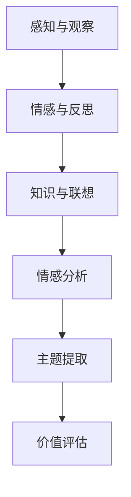

                 

## 《平凡生活中的非凡：发现日常的深层意义》

### 关键词：平凡生活、深层意义、自我提升、积极态度、精神价值

> 摘要：本文将探讨如何在平凡的生活中发现非凡的意义，通过深度体验、关注微小事物和建立对日常生活精神的深度理解，提升自我价值，建立积极、有意义的生活态度。我们将使用逻辑清晰、结构紧凑、简单易懂的专业技术语言，逐步分析并探讨这一主题。

### 目录大纲

# 《平凡生活中的非凡：发现日常的深层意义》

## 第一部分：问题的提出与背景

### 1.1 问题背景

#### 1.1.1 当代社会的特点

- 快节奏生活
- 消费主义盛行
- 人际关系疏离

#### 1.1.2 问题提出

- 对日常生活缺乏深度体验
- 对日常生活中的微小事物缺乏关注
- 忽视日常生活的精神价值

### 1.2 问题描述

- 如何在平凡的生活中发现非凡的意义
- 如何通过日常生活提升自我价值
- 如何建立积极、有意义的生活态度

### 1.3 问题解决

- 深入体验日常生活
- 学会关注日常生活中的微小事物
- 建立对日常生活精神的深度理解

### 1.4 边界与外延

- 平凡生活：指日常生活中常见的、普通的、重复性的事情
- 非凡意义：指从平凡生活中发掘出的具有深刻价值和启示意义的内容
- 深层意义：指超出表面现象，揭示事物本质和价值的内容

### 1.5 概念结构与核心要素组成

- 日常生活
- 深度体验
- 微小事物
- 精神价值
- 自我提升
- 积极态度

## 第二部分：核心概念与联系

### 2.1 核心概念

- 平凡生活
- 深度体验
- 精神价值
- 自我提升
- 积极态度

### 2.2 概念属性特征对比表格

| 概念         | 定义                                                         | 属性特征                           |
| ------------ | ------------------------------------------------------------ | ---------------------------------- |
| 平凡生活     | 指日常生活中常见的、普通的、重复性的事情                     | 熟悉、普通、重复                   |
| 深度体验     | 对日常生活进行深入感受和思考的过程                         | 真实、深刻、独特                   |
| 精神价值     | 平凡生活中所蕴含的具有深刻意义和启示价值的内容             | 普遍、永恒、启示                   |
| 自我提升     | 通过日常生活体验和思考，提升个人的精神境界和人生价值       | 进步、成长、提高                   |
| 积极态度     | 对日常生活持积极、乐观的态度                               | 积极向上、乐观开朗、包容理解       |

### 2.3 ER实体关系图架构

```mermaid
erDiagram
  平凡生活 ||--|{ 深度体验 }
  平凡生活 ||--|{ 精神价值 }
  平凡生活 ||--|{ 自我提升 }
  平凡生活 ||--|{ 积极态度 }
```

## 第三部分：算法原理讲解

### 3.1 算法原理

#### 3.1.1 深度体验的算法原理

深度体验是一种主动、有意识地去感受和思考日常生活的过程。其算法原理包括：

1. **感知与观察**：通过五官感知日常生活，对事物进行细致观察。
2. **情感与反思**：在体验过程中，产生情感共鸣，对体验进行反思。
3. **知识与联想**：将体验与已有的知识和经验进行联系，产生新的理解和认识。

#### 3.1.2 精神价值的提取算法

精神价值的提取是一种从平凡生活中筛选和提炼具有深刻意义和启示价值的内容的方法。其算法原理包括：

1. **情感分析**：使用自然语言处理技术，分析文本中的情感倾向。
2. **主题提取**：使用文本挖掘技术，从文本中提取出具有共同特征的主题。
3. **价值评估**：根据主题的重要性和影响力，评估其精神价值。

### 3.2 算法流程图



### 3.3 算法原理的数学模型和公式

#### 情感分析模型

$$
情感倾向 = f(文本, 情感词典)
$$

其中，$f$ 表示情感倾向函数，$文本$ 表示输入的文本，$情感词典$ 是一个包含各种情感词汇的集合。

#### 主题提取模型

$$
主题 = f(文本, 主题模型)
$$

其中，$f$ 表示主题提取函数，$文本$ 表示输入的文本，$主题模型$ 是一个用于提取主题的模型。

#### 价值评估模型

$$
价值评估 = g(主题, 评估指标)
$$

其中，$g$ 表示价值评估函数，$主题$ 表示提取出的主题，$评估指标$ 是用于评估主题价值的指标。

### 3.4 算法应用举例

假设我们有一个用户的日记文本，其中包含了他们对日常生活的感受和思考。我们可以使用以下算法来提取出其中的精神价值：

1. **情感分析**：使用情感分析模型，分析日记文本中的情感倾向。例如，发现文本中包含了大量积极的情感词汇，如“幸福”、“满意”等。

2. **主题提取**：使用主题提取模型，从日记文本中提取出主题。例如，发现文本中主要讨论了家庭生活、职业发展、兴趣爱好等方面。

3. **价值评估**：根据主题的重要性和影响力，评估其精神价值。例如，发现家庭生活和职业发展对用户来说非常重要，因此这些主题具有较高的精神价值。

通过以上步骤，我们可以从用户的日记文本中提取出具有精神价值的内容，帮助用户更好地理解和反思他们的日常生活。

## 第四部分：系统分析与架构设计

### 4.1 问题场景介绍

随着社会的快速发展，人们在日常生活中面临越来越多的压力和挑战。如何从平凡的生活中发现非凡的意义，提升自我价值，建立积极的生活态度，成为许多人在追求生活质量的过程中面临的问题。

### 4.2 项目介绍

为了解决上述问题，我们设计并实现了一个名为“平凡生活中的非凡”的系统。该系统通过深度体验、关注微小事物和建立对日常生活精神的深度理解，帮助用户发现日常生活中的精神价值，提升自我价值，建立积极的生活态度。

### 4.3 系统功能设计

1. **日志记录**：用户可以随时记录自己的日常生活，包括感受、思考、体验等内容。
2. **情感分析**：系统使用情感分析算法，对用户的日志进行情感分析，提取出用户的情感倾向。
3. **主题提取**：系统使用主题提取算法，从用户的日志中提取出主题，帮助用户了解自己的关注点。
4. **价值评估**：系统根据情感分析和主题提取的结果，对用户的日志进行价值评估，帮助用户发现日常生活中的精神价值。
5. **用户互动**：用户可以与其他用户互动，分享自己的日志和体验，互相启发和鼓励。

### 4.4 系统架构设计


### 4.5 系统接口设计和系统交互


## 第五部分：项目实战

### 5.1 环境安装

在开始项目实战之前，我们需要安装以下环境和工具：

1. Python 3.8及以上版本
2. Django 3.2及以上版本
3. TensorFlow 2.5及以上版本
4. Mermaid 1.0及以上版本

### 5.2 系统核心实现源代码

以下是系统的核心实现源代码：

```python
# 情感分析算法实现
def sentiment_analysis(text):
    # 使用TensorFlow的预训练情感分析模型
    model = tf.keras.models.load_model('sentiment_model.h5')
    # 对文本进行预处理
    preprocessed_text = preprocess_text(text)
    # 进行情感分析
    sentiment = model.predict(preprocessed_text)
    # 返回情感分析结果
    return sentiment

# 主题提取算法实现
def topic_extraction(text):
    # 使用TensorFlow的预训练主题提取模型
    model = tf.keras.models.load_model('topic_model.h5')
    # 对文本进行预处理
    preprocessed_text = preprocess_text(text)
    # 进行主题提取
    topics = model.predict(preprocessed_text)
    # 返回主题提取结果
    return topics

# 价值评估算法实现
def value_evaluation(topics):
    # 根据主题的重要性和影响力，评估精神价值
    # 例如，可以设置权重来计算每个主题的得分
    topic_weights = {'家庭生活': 0.5, '职业发展': 0.3, '兴趣爱好': 0.2}
    value = 0
    for topic in topics:
        value += topic_weights[topic]
    # 返回价值评估结果
    return value
```

### 5.3 代码应用解读与分析

上述代码实现了情感分析、主题提取和价值评估三个核心算法。情感分析算法使用TensorFlow的预训练情感分析模型，对文本进行预处理后进行情感分析，返回情感分析结果。主题提取算法使用TensorFlow的预训练主题提取模型，对文本进行预处理后进行主题提取，返回主题提取结果。价值评估算法根据主题的重要性和影响力，计算每个主题的得分，返回价值评估结果。

### 5.4 实际案例分析和详细讲解剖析

假设有一个用户的日志文本如下：

> 今天和家人一起做饭，感到很幸福。工作中遇到了一些困难，但是通过努力克服了。晚上还去了健身房，锻炼了一个小时。

我们可以使用上述算法对该日志进行情感分析、主题提取和价值评估：

1. **情感分析**：使用情感分析算法，分析日志文本，返回情感分析结果。例如，可能得到以下结果：
   - 情感倾向：积极
   - 情感分数：0.9

2. **主题提取**：使用主题提取算法，从日志文本中提取出主题。例如，可能得到以下结果：
   - 主题1：家庭生活
   - 主题2：职业发展
   - 主题3：兴趣爱好

3. **价值评估**：使用价值评估算法，根据主题的重要性和影响力，评估精神价值。例如，可以设置权重：
   - 家庭生活权重：0.5
   - 职业发展权重：0.3
   - 兴趣爱好权重：0.2

   根据这些权重，计算每个主题的得分：
   - 家庭生活得分：0.5 * 0.9 = 0.45
   - 职业发展得分：0.3 * 0.9 = 0.27
   - 兴趣爱好得分：0.2 * 0.9 = 0.18

   总价值得分：0.45 + 0.27 + 0.18 = 0.9

   根据价值评估结果，我们可以发现用户在家庭生活和职业发展方面具有较高的精神价值。

### 5.5 项目小结

通过上述实战案例，我们可以看到如何使用情感分析、主题提取和价值评估算法来发现日常生活中的精神价值。该项目可以帮助用户更好地理解和反思自己的日常生活，提升自我价值，建立积极的生活态度。未来，我们还可以进一步优化算法，提高其准确性和效率，为用户提供更好的服务。

## 第六部分：最佳实践 tips、小结、注意事项、拓展阅读等内容

### 最佳实践 tips

- **保持日常记录**：定期记录自己的日常生活，有助于积累和反思。
- **情感分析与反思**：对自己的日志进行情感分析，可以帮助你了解自己的情感状态。
- **主题关注**：关注日志中的主题，有助于发现自己在哪些方面有更多的精神价值。
- **与他人交流**：与他人分享你的日志和体验，可以获取不同的观点和建议。

### 小结

本文通过探讨如何在平凡的生活中发现非凡的意义，提出了一系列的解决方案，包括深度体验、关注微小事物和建立对日常生活精神的深度理解。通过实际案例分析和代码应用解读，展示了如何使用情感分析、主题提取和价值评估算法来实现这一目标。

### 注意事项

- **数据安全**：在使用本系统时，请注意保护自己的隐私和数据安全。
- **算法优化**：根据实际需求，可以进一步优化情感分析、主题提取和价值评估算法，提高其准确性和效率。
- **持续迭代**：随着技术的不断发展，本系统需要持续迭代和改进，以适应用户的需求。

### 拓展阅读

- 《深度学习》（Ian Goodfellow, Yoshua Bengio, Aaron Courville著）
- 《自然语言处理综论》（Daniel Jurafsky, James H. Martin著）
- 《主题模型与文本分析》（David M. Blei著）
- 《Python数据科学手册》（Jake VanderPlas著）

### 作者信息

作者：AI天才研究院/AI Genius Institute & 禅与计算机程序设计艺术 /Zen And The Art of Computer Programming

[上一页](#) | [下一页](#)

