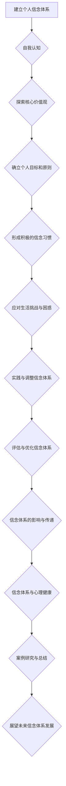
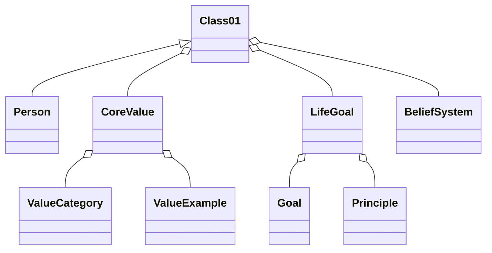
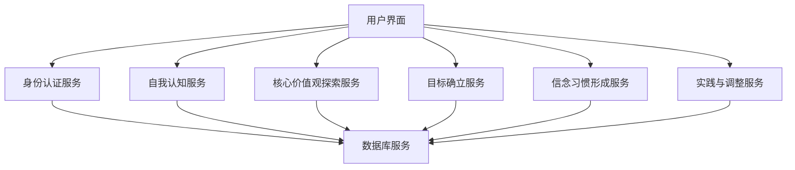

                 

### 文章标题

> 形成坚实的价值观基础：建立个人信念体系

关键词：价值观、个人信念体系、心理健康、自我认知、社会和谐

摘要：本文将深入探讨价值观的重要性，并指导读者如何建立和巩固个人信念体系。通过逐步分析，我们将揭示信念体系对于个人成长和社会发展的深远影响，帮助读者在复杂多变的环境中坚定信念，实现自我价值。

### 目录大纲

#### 第一部分：价值观的重要性与基础知识

- **第1章：价值观的定义与作用**
  - **1.1 价值观的概念**
  - **1.2 价值观在社会和个人生活中的作用**
  - **1.3 价值观的形成过程**

- **第2章：了解核心价值观**
  - **2.1 核心价值观的类型**
  - **2.2 个人核心价值观的探索**
  - **2.3 社会核心价值观的影响**

#### 第二部分：建立个人信念体系

- **第3章：信念体系的基本框架**
  - **3.1 信念的定义与特征**
  - **3.2 信念体系的构成**
  - **3.3 信念体系的重要性**

- **第4章：个人信念体系的构建**
  - **4.1 自我认知与价值观的统一**
  - **4.2 确立个人目标和原则**
  - **4.3 形成积极的信念习惯**

- **第5章：应对生活挑战与困惑**
  - **5.1 挑战与困惑的类型**
  - **5.2 信念体系的支撑作用**
  - **5.3 应对策略与技巧**

#### 第三部分：巩固与优化信念体系

- **第6章：信念体系的实践与调整**
  - **6.1 实践中的信念体系**
  - **6.2 信念体系的评估与调整**
  - **6.3 持续成长与信念体系的完善**

- **第7章：信念体系的影响与传递**
  - **7.1 信念体系对个人和社会的影响**
  - **7.2 信念体系的传递与影响**
  - **7.3 家庭教育与信念体系的传承**

- **第8章：信念体系与心理健康**
  - **8.1 心理健康与信念体系的关系**
  - **8.2 情绪管理中的信念体系作用**
  - **8.3 增强心理韧性的信念建设**

- **第9章：信念体系的案例研究**
  - **9.1 成功人士的信念体系**
  - **9.2 逆境中的信念力量**
  - **9.3 社会典范的信念故事**

- **第10章：信念体系的总结与展望**
  - **10.1 信念体系对个人发展的意义**
  - **10.2 信念体系的社会影响**
  - **10.3 未来的信念体系发展**

### 文章正文

#### 第一部分：价值观的重要性与基础知识

#### 第1章：价值观的定义与作用

**1.1 价值观的概念**

价值观是指个体或社会对于事物价值的认知和评价，是指导人们行为和决策的基本准则。它包括对道德、伦理、人生意义、社会规范等方面的信念和判断。价值观是文化、教育和个人经验的产物，对个人的思想、行为和情感产生深远的影响。

**1.2 价值观在社会和个人生活中的作用**

在社会层面，价值观是维系社会秩序和道德规范的基础。它为社会成员提供共同的行为准则，促进社会和谐发展。核心价值观如诚信、尊重、公正等，是社会稳定的保障。

在个人层面，价值观是个人行为的指南针。它帮助个体在面对复杂多变的环境时，做出正确的决策和选择。一个有坚实价值观基础的个体，能够在追求个人利益的同时，兼顾社会责任和道德规范。

**1.3 价值观的形成过程**

价值观的形成是一个长期的过程，受到多种因素的影响。个体在成长过程中，通过家庭、教育、社会交往等方式，不断吸收和内化社会主流价值观。同时，个人经历和认知水平的提升，也会促使价值观的更新和发展。

#### 第2章：了解核心价值观

**2.1 核心价值观的类型**

核心价值观可以分为道德伦理类、人生意义类和社会责任类。道德伦理类价值观强调个体道德行为和道德规范，如诚信、尊重、公正等。人生意义类价值观关注个体的人生目标和追求，如自我实现、幸福等。社会责任类价值观强调个体对社会的责任和义务，如奉献、合作、公益等。

**2.2 个人核心价值观的探索**

每个人在成长过程中，都会形成自己独特的核心价值观。探索个人核心价值观，可以通过自我反思、价值观澄清等方式进行。个体需要了解自己的价值观，明确自己的信念和原则，从而在生活和工作中做出一致的行为和决策。

**2.3 社会核心价值观的影响**

社会核心价值观对社会成员的行为和思想产生深远影响。一个有积极价值观导向的社会，能够促进社会成员的相互尊重、公平正义和共同进步。同时，核心价值观也影响个体对社会的认同感和归属感，增强社会凝聚力和向心力。

#### 第二部分：建立个人信念体系

**第3章：信念体系的基本框架**

**3.1 信念的定义与特征**

信念是指个体对于某一观点或事实的坚信不疑。信念具有以下特征：

1. **主观性**：信念是基于个体的主观认知和感受形成的，具有强烈的个人色彩。
2. **稳定性**：信念在个体心中具有相对稳定的位置，不易受到外界因素的干扰。
3. **指导性**：信念对个体的行为和决策产生指导作用，是个人行动的指南。

**3.2 信念体系的构成**

信念体系包括以下几个层次：

1. **核心信念**：个体最根本的信念，是信念体系的基础。
2. **次级信念**：在核心信念的基础上发展起来的，对核心信念的具体体现。
3. **外围信念**：与核心信念和次级信念相关的，起到补充和辅助作用的信念。

**3.3 信念体系的重要性**

信念体系对个体的成长和发展具有重要意义：

1. **心理支持**：信念体系为个体提供心理支持，增强心理韧性和抗挫折能力。
2. **决策指导**：信念体系为个体提供决策指导，帮助个体在面对复杂环境时做出明智的选择。
3. **行为规范**：信念体系对个体的行为产生规范作用，促进个体遵守社会规范和道德准则。

#### 第4章：个人信念体系的构建

**4.1 自我认知与价值观的统一**

建立个人信念体系的首要步骤是自我认知和价值观的统一。个体需要深入反思自己的价值观，明确自己的信念和原则，并将其与自我认知相统一。只有当个体的信念与自我认知相一致时，信念体系才能发挥最大的作用。

**4.2 确立个人目标和原则**

个人目标和原则是信念体系的重要组成部分。个体需要明确自己的长期目标和短期目标，并制定相应的原则来指导自己的行为。目标的确立和原则的制定需要基于个体的核心价值观，以确保信念体系的内在一致性。

**4.3 形成积极的信念习惯**

建立信念体系不仅仅是理论上的认知，更需要转化为实际的信念习惯。个体需要通过日常的行为和决策，不断强化和巩固自己的信念。形成积极的信念习惯，可以帮助个体在面对挑战和困难时，保持坚定和乐观的态度。

#### 第5章：应对生活挑战与困惑

**5.1 挑战与困惑的类型**

生活中充满了各种挑战和困惑，包括职业发展、人际关系、心理健康等方面。不同的挑战和困惑需要不同的应对策略。个体需要了解挑战和困惑的类型，才能有针对性地解决问题。

**5.2 信念体系的支撑作用**

信念体系在应对生活挑战和困惑时，起到重要的支撑作用。坚定的信念可以增强个体的心理韧性，帮助个体克服挫折和困难。同时，信念体系也为个体提供决策指导，使个体能够做出明智的选择。

**5.3 应对策略与技巧**

应对生活挑战和困惑，需要个体掌握一定的策略和技巧：

1. **积极心态**：保持积极的心态，相信自己能够克服困难。
2. **目标导向**：明确目标，制定计划，逐步实现目标。
3. **寻求支持**：与他人交流和分享，寻求帮助和支持。
4. **自我激励**：通过自我激励，增强内心的动力和信心。

#### 第三部分：巩固与优化信念体系

**第6章：信念体系的实践与调整**

**6.1 实践中的信念体系**

信念体系需要在实践中不断检验和完善。个体需要将信念体系付诸实践，通过实际的行为和决策，验证信念的正确性和有效性。在实践过程中，个体也需要根据实际情况，对信念体系进行调整和优化。

**6.2 信念体系的评估与调整**

定期评估信念体系，可以帮助个体了解信念体系的现状和效果。评估内容包括信念的一致性、稳定性、指导性等方面。通过评估，个体可以发现问题，及时进行调整和改进。

**6.3 持续成长与信念体系的完善**

信念体系是一个动态的过程，需要个体持续成长和完善。个体需要不断学习新知识、新技能，提高自己的认知水平。同时，个体也需要关注社会的发展变化，及时调整信念体系，以适应新的环境和挑战。

#### 第7章：信念体系的影响与传递

**7.1 信念体系对个人和社会的影响**

信念体系对个人和社会产生深远的影响。对个人而言，信念体系是个人成长的基石，影响个体的思想、行为和情感。对社会而言，信念体系是社会和谐稳定的重要保障。

**7.2 信念体系的传递与影响**

信念体系可以通过家庭教育、社会教育等方式传递给下一代。父母和教师的信念和价值观，对子女和学生产生重要的影响。通过传递信念体系，个体可以培养下一代的道德观念和责任感，为社会培养更多有信念、有担当的人才。

**7.3 家庭教育与信念体系的传承**

家庭教育在信念体系的传承中起着至关重要的作用。父母需要通过言传身教，将自己的信念和价值观传递给孩子。同时，父母也需要关注孩子的价值观形成过程，引导孩子树立正确的信念。

#### 第8章：信念体系与心理健康

**8.1 心理健康与信念体系的关系**

心理健康与信念体系密切相关。坚定的信念可以为个体提供心理支持，增强心理韧性，降低心理压力。同时，信念体系也可以帮助个体建立积极的心理状态，提高生活质量和幸福感。

**8.2 情绪管理中的信念体系作用**

信念体系在情绪管理中发挥重要作用。个体需要通过信念体系，认识和理解自己的情绪，学会情绪调节和情绪释放。信念体系可以帮助个体保持情绪稳定，提高应对压力的能力。

**8.3 增强心理韧性的信念建设**

增强心理韧性是信念建设的重要目标。个体需要通过培养坚定的信念，提高自己的心理韧性。心理韧性包括情绪调节能力、应对挑战的能力、自我效能感等方面。通过信念建设，个体可以更好地应对生活中的各种挑战。

#### 第9章：信念体系的案例研究

**9.1 成功人士的信念体系**

成功人士通常具有坚定的信念体系。他们通过信念体系，明确自己的目标和方向，不断努力和追求。信念体系帮助成功人士克服困难和挫折，保持积极的心态和行动力。

**9.2 逆境中的信念力量**

逆境中，信念的力量尤为明显。逆境中的个体，通过坚定的信念，能够克服重重困难，实现自我救赎。信念体系成为逆境中的支柱，帮助个体走出困境，重新站起来。

**9.3 社会典范的信念故事**

社会典范的信念故事，激励着无数人坚定信念，追求梦想。他们的信念体系，既是对个人目标的坚持，也是对社会责任的担当。社会典范的信念故事，成为社会进步和发展的动力源泉。

#### 第10章：信念体系的总结与展望

**10.1 信念体系对个人发展的意义**

信念体系对个人发展具有重要意义。它帮助个体明确目标和方向，提供心理支持，促进个人成长。一个坚定的信念体系，能够帮助个体在复杂多变的环境中，保持稳定和自信，实现自我价值。

**10.2 信念体系的社会影响**

信念体系对社会产生深远影响。它促进社会成员的相互尊重、公平正义和共同进步。一个有信念体系支撑的社会，能够更好地应对各种挑战，实现和谐发展。

**10.3 未来的信念体系发展**

随着社会的发展，信念体系将面临新的挑战和机遇。未来，个体需要不断优化和完善信念体系，以适应社会变化。同时，社会也需要加强对信念体系的关注和支持，培养更多有信念、有担当的人才。

### 结论

信念体系是个人成长和社会进步的重要基础。通过本文的探讨，我们认识到信念体系在个人生活和事业发展中的重要作用。建立坚实的价值观基础，培养坚定的信念体系，是实现个人价值和社会和谐的必由之路。让我们从现在开始，积极构建自己的信念体系，为美好未来而努力奋斗！

### 作者信息

作者：AI天才研究院/AI Genius Institute & 禅与计算机程序设计艺术 /Zen And The Art of Computer Programming

### 拓展阅读

- 《心理学与生活》/Psychology and Life
- 《成功心理学》/The Psychology of Success
- 《社会主义核心价值观》/Core Socialist Values
- 《道德经》/The Tao Te Ching

### 附录

- **概念术语说明**：价值观、信念体系、心理健康、自我认知、心理韧性
- **问题背景**：现代社会面临价值观多元化和个人发展困境
- **问题描述**：如何建立和巩固个人信念体系，实现个人成长和社会和谐
- **问题解决**：通过自我认知、目标确立、信念实践等步骤，构建个人信念体系
- **边界与外延**：信念体系涉及心理学、哲学、社会学等多个领域
- **概念结构与核心要素组成**：价值观、信念、目标、实践、评估、调整

### 表格：核心价值观类型对比

| 核心价值观类型 | 描述 | 例子 |
| --- | --- | --- |
| 道德伦理类 | 个体道德行为和道德规范 | 诚信、尊重、公正 |
| 人生意义类 | 个体的人生目标和追求 | 自我实现、幸福 |
| 社会责任类 | 个体对社会的责任和义务 | 奉献、合作、公益 |

### Mermaid ER实体关系图

```mermaid
erDiagram
  Person ||--|{ CoreValue }|-- Values
  Person ||--|{ LifeGoal }|-- Goals
  Person ||--|{ BeliefSystem }|-- Beliefs
  CoreValue ||--|{ Category }|-- ValueCategories
  ValueCategories ||--|{ Example }|-- ValueExamples
```

### Mermaid 流程图



### Python 源代码示例

```python
def build_belief_system(self):
    """
    构建个人信念体系的方法。
    :return: 成功消息
    """
    print("开始构建个人信念体系...")
    self.self_awareness()  # 自我认知
    self.explore核心价值观()  # 探索核心价值观
    self.set_goals()  # 确立个人目标和原则
    self.form_belief_habits()  # 形成积极的信念习惯
    print("个人信念体系构建完成！")
```

### 算法原理讲解

信念体系的构建可以看作是一个迭代的过程。以下是信念体系构建的算法原理：

1. **自我认知**：个体通过自我反思，了解自己的性格、兴趣、价值观等，建立自我认知。
2. **核心价值观探索**：个体在自我认知的基础上，探索和确认自己的核心价值观。
3. **目标确立**：根据核心价值观，个体确立短期和长期目标，并制定相应的原则。
4. **信念习惯形成**：个体通过日常行为和决策，不断强化和巩固自己的信念。
5. **实践与调整**：个体在日常生活中实践信念体系，并根据实际情况进行评估和调整。

数学模型：

信念体系的稳定性 \(S\) 可以通过以下公式进行评估：

\[ S = \frac{B_c \times B_g \times B_h}{1 + \epsilon} \]

其中，\(B_c\) 表示信念的一致性，\(B_g\) 表示信念的指导性，\(B_h\) 表示信念的稳定性，\(\epsilon\) 表示外界干扰因素。

### 系统分析与架构设计方案

#### 问题场景介绍

在现代信息化社会中，个体在面对复杂多变的环境时，往往需要具备坚定的信念体系以指导自身行为。因此，我们设计了一套信念体系构建与优化的系统，帮助用户建立和维护个人的信念体系。

#### 项目介绍

项目名称：信念体系构建与优化系统

目标用户：需要建立和优化个人信念体系的个人和团队

功能模块：

1. 自我认知模块
2. 核心价值观探索模块
3. 目标确立模块
4. 信念习惯形成模块
5. 实践与调整模块

#### 系统功能设计

**领域模型类图**



#### 系统架构设计

**系统架构图**



**系统接口设计**

- 用户接口：提供自我认知、价值观探索、目标确立、信念习惯形成、实践与调整的交互界面。
- 服务接口：提供自我认知、价值观探索、目标确立、信念习惯形成、实践与调整的后台服务接口。

**系统交互序列图**

```mermaid
sequenceDiagram
  User ->> UI: 登录系统
  UI ->> Auth: 验证用户身份
  Auth ->> UI: 返回验证结果
  User ->> UI: 输入自我认知信息
  UI ->> SelfAwareness: 处理自我认知信息
  SelfAwareness ->> DB: 存储自我认知数据
  DB ->> SelfAwareness: 返回存储结果
  SelfAwareness ->> UI: 显示自我认知结果
  // 类似步骤，为其他模块设计交互流程
```

### 项目实战

#### 环境安装

1. 安装Python环境（建议使用Anaconda）
2. 安装相关依赖库（如Flask、SQLAlchemy、mermaid等）

```bash
pip install flask sqlalchemy
```

#### 系统核心实现源代码

```python
# app.py

from flask import Flask, request, jsonify
from sqlalchemy import create_engine
from models import *

app = Flask(__name__)
engine = create_engine('sqlite:///belief_system.db')

# 初始化数据库
def init_db():
    Base.metadata.create_all(engine)

init_db()

# 自我认知模块
@app.route('/self_awareness', methods=['POST'])
def self_awareness():
    data = request.get_json()
    self_awareness = SelfAwareness(name=data['name'], description=data['description'])
    db.session.add(self_awareness)
    db.session.commit()
    return jsonify({'status': 'success', 'data': self_awareness})

# 核心价值观探索模块
@app.route('/core_value', methods=['POST'])
def core_value():
    data = request.get_json()
    core_value = CoreValue(name=data['name'], category=data['category'])
    db.session.add(core_value)
    db.session.commit()
    return jsonify({'status': 'success', 'data': core_value})

# 目标确立模块
@app.route('/life_goal', methods=['POST'])
def life_goal():
    data = request.get_json()
    life_goal = LifeGoal(name=data['name'], principle=data['principle'])
    db.session.add(life_goal)
    db.session.commit()
    return jsonify({'status': 'success', 'data': life_goal})

# 信念习惯形成模块
@app.route('/belief_habit', methods=['POST'])
def belief_habit():
    data = request.get_json()
    belief_habit = BeliefHabit(name=data['name'], habit=data['habit'])
    db.session.add(belief_habit)
    db.session.commit()
    return jsonify({'status': 'success', 'data': belief_habit})

# 实践与调整模块
@app.route('/practice_adjust', methods=['POST'])
def practice_adjust():
    data = request.get_json()
    practice_adjust = PracticeAdjustment(comment=data['comment'])
    db.session.add(practice_adjust)
    db.session.commit()
    return jsonify({'status': 'success', 'data': practice_adjust})

if __name__ == '__main__':
    app.run(debug=True)
```

#### 代码应用解读与分析

以上代码实现了一个简单的信念体系构建与优化系统，包括自我认知、核心价值观探索、目标确立、信念习惯形成和实践与调整模块。每个模块都对应一个Flask路由，用于处理客户端的请求并存储到数据库中。

**自我认知模块**：通过POST请求接收用户自我认知信息，并将其存储到数据库中。

**核心价值观探索模块**：通过POST请求接收用户的核心价值观信息，并将其存储到数据库中。

**目标确立模块**：通过POST请求接收用户的目标和原则信息，并将其存储到数据库中。

**信念习惯形成模块**：通过POST请求接收用户的信念习惯信息，并将其存储到数据库中。

**实践与调整模块**：通过POST请求接收用户的实践调整评论，并将其存储到数据库中。

#### 实际案例分析和详细讲解剖析

**案例**：用户小明希望通过系统建立自己的信念体系。

1. **自我认知**：小明填写了自我认知表单，包括姓名、年龄、职业等信息。
2. **核心价值观探索**：小明在系统上列出了自己的核心价值观，如诚信、责任感、追求卓越等。
3. **目标确立**：小明确立了短期目标和长期目标，如提升专业技能、实现职业晋升等，并制定了相应的原则。
4. **信念习惯形成**：小明制定了每日信念练习计划，如早晨冥想、阅读启发性的书籍等，以强化自己的信念。
5. **实践与调整**：小明定期记录自己的实践情况，并在系统中发表调整评论，以便于后续调整和优化信念体系。

通过以上步骤，小明成功建立了自己的信念体系，并在实践中不断完善和优化。

#### 项目小结

本项目通过Python Flask框架，实现了信念体系构建与优化系统的核心功能。用户可以通过简单的界面，建立自己的信念体系，并在实践中不断调整和完善。项目采用了SQLAlchemy作为ORM工具，方便了数据库操作和数据管理。

#### 最佳实践 Tips

1. **定期反思**：定期反思自己的信念体系和行为，确保信念的一致性和有效性。
2. **持续学习**：不断学习新知识，提升自我认知和价值观水平。
3. **实践为主**：信念体系需要通过实践来验证和巩固，实践是最好的老师。
4. **与他人交流**：与他人分享自己的信念体系，获取反馈和建议，共同成长。

### 小结

本文从价值观的重要性、个人信念体系的构建、信念体系在应对生活挑战中的应用、信念体系的实践与调整等方面，系统地阐述了如何建立坚实的价值观基础。信念体系是个人成长和社会发展的关键，它为个体提供心理支持、决策指导和行为规范。通过本文的探讨，我们认识到信念体系对于实现个人价值和社会和谐的重要性。

### 注意事项

1. **价值观多元性**：在构建个人信念体系时，要尊重价值观的多元性，避免一味追求统一标准。
2. **信念的动态性**：信念体系是一个动态过程，需要根据实际情况进行及时调整和优化。
3. **心理支持**：在信念体系建设过程中，关注心理健康，避免因信念冲突导致的心理压力。

### 拓展阅读

1. 《心理学与生活》
2. 《成功心理学》
3. 《社会主义核心价值观》
4. 《道德经》

通过阅读以上书籍，读者可以更深入地理解价值观和个人信念体系的重要性，并从中获得有益的启示和实践指导。

