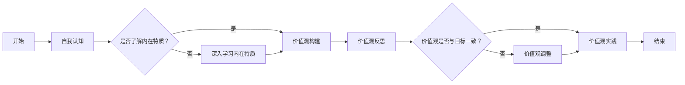
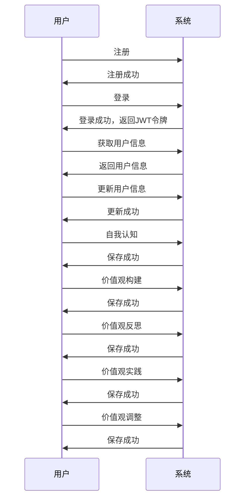

                 

# 形成独特的人生哲学：个人价值观的构建过程

## 关键词

- 人生哲学
- 个人价值观
- 价值观构建
- 多元化价值观
- 自我认知
- 实践与反思

## 摘要

本文旨在探讨如何通过自我认知和实践，构建独特的个人价值观体系，形成独特的人生哲学。我们将从问题背景出发，逐步深入探讨个人价值观的起源与发展，自我认知与价值观反思，以及如何构建和调整个人价值观。最终，我们将探讨个人价值观的影响与扩展，并总结全文，展望未来。

## 第一部分：人生哲学的起源与探索

### 第1章：问题背景与人生哲学的起源

#### 1.1 问题的提出

在现代社会，我们面临许多问题，如个人价值取向的迷失、精神层面的空虚等。这些问题源于我们对人生哲学的忽视，即对人生目的、意义和价值观的探讨。

#### 1.2 人生哲学的概念

人生哲学是指对人生目的、意义和价值观的探究与思考。它包括对自我、世界和人类关系的理解。

#### 1.3 人生哲学的重要性

人生哲学为我们提供方向和指引，帮助我们应对生活中的挑战，实现人生价值。

### 第2章：个人价值观的起源与发展

#### 2.1 个人价值观的定义

个人价值观是指个人在长期生活中形成的，对事物进行判断和选择的信念和标准。

#### 2.2 个人价值观的构成

个人价值观由多个层次构成，包括基本价值观、次级价值观和具体价值观。

#### 2.3 个人价值观的发展过程

个人价值观的发展过程受到家庭教育、学校教育和社会环境的影响。

## 第二部分：探索个人价值观

### 第3章：个人成长历程与价值观塑造

#### 3.1 家庭教育的影响

家庭是个人价值观形成的第一个环境。家长的教育方式和行为对个人价值观有深远影响。

#### 3.2 学校教育的作用

学校教育是个人价值观塑造的重要阶段，通过学科知识和社交互动，帮助学生形成正确的价值观。

#### 3.3 社会环境的塑造

社会环境，如文化、政治和经济环境，对个人价值观有重要影响。

### 第4章：自我认知与价值观反思

#### 4.1 自我认知的重要性

自我认知是价值观构建的基础。只有了解自己，才能构建适合自己的价值观。

#### 4.2 价值观的反思方法

反思是价值观构建的关键步骤。通过自我反思，我们可以发现自己的价值观是否合理和有效。

#### 4.3 价值观的自我评估

自我评估是反思的延续。通过评估，我们可以了解自己的价值观是否与人生目标一致。

## 第三部分：构建独特的人生哲学

### 第5章：价值观的多元化与兼容并蓄

#### 5.1 多元化价值观的理解

多元化价值观意味着我们应接受不同文化和价值观的存在。

#### 5.2 价值观的兼容并蓄

兼容并蓄是指将多种价值观融合，形成独特的价值观体系。

#### 5.3 多元价值观的实践

在日常生活中，我们应实践多元化价值观，实现个人价值观的全面发展。

### 第6章：个人价值观的实践与调整

#### 6.1 个人价值观的实践方法

实践是检验价值观是否正确的唯一标准。我们要将价值观融入日常生活，不断实践。

#### 6.2 价值观调整的重要性

随着时间的推移，我们的价值观可能需要调整。价值观调整是适应社会变化和个人成长的过程。

#### 6.3 价值观调整的实践路径

通过自我反思、学习新知识和与他人的交流，我们可以实现价值观的调整。

## 第四部分：人生哲学的验证与影响

### 第7章：人生哲学的验证与反思

#### 7.1 人生哲学的验证方法

验证人生哲学是否有效，可以通过自我反思和观察他人来进行。

#### 7.2 人生哲学的自我反思

自我反思是验证人生哲学的重要途径。通过反思，我们可以发现人生哲学的优点和不足。

#### 7.3 人生哲学的修正与优化

根据验证结果，我们应修正和优化人生哲学，使其更符合我们的需求和目标。

### 第8章：个人价值观的影响与扩展

#### 8.1 个人价值观对生活的影响

个人价值观影响我们的行为、决策和人际关系。

#### 8.2 个人价值观在工作中的应用

在职业生涯中，个人价值观可以指导我们的工作态度和行为。

#### 8.3 个人价值观对社会的影响

个人价值观对社会和文化的形成和发展有深远影响。

### 第9章：结论与展望

#### 9.1 个人价值观的总结

个人价值观是人生哲学的核心。通过不断构建和调整，我们可以实现人生价值。

#### 9.2 人生哲学的未来展望

人生哲学是不断发展的。未来，我们将继续探索和构建更完善的人生哲学。

#### 9.3 对读者的启示

希望读者通过本文，能够认识到个人价值观的重要性，并开始构建自己的独特人生哲学。

## 作者信息

- 作者：AI天才研究院/AI Genius Institute & 禅与计算机程序设计艺术 /Zen And The Art of Computer Programming

在本文中，我们详细探讨了如何形成独特的人生哲学，构建个人价值观。通过自我认知、实践与反思，我们可以不断完善自己的人生哲学，实现人生价值。希望本文对您有所启发，让您在人生的道路上更加坚定和明确。## 引言

在现代社会，随着科技的发展和信息的爆炸，我们面临的问题日益复杂多样。然而，在这纷繁复杂的世界中，很多人却感到迷茫和困惑，不知道自己的价值和方向。这种困惑源于我们对人生哲学的忽视，即对人生目的、意义和价值观的探讨。因此，本文旨在探讨如何通过自我认知和实践，构建独特的个人价值观体系，形成独特的人生哲学。

### 核心概念术语说明

**人生哲学**：指对人生目的、意义和价值观的探究与思考，它包括对自我、世界和人类关系的理解。

**个人价值观**：指个人在长期生活中形成的，对事物进行判断和选择的信念和标准。它由基本价值观、次级价值观和具体价值观构成。

**自我认知**：指对自身内在特质、需求和动机的认识和理解。

**价值观构建**：指通过自我认知、实践和反思，逐步形成和完善个人价值观的过程。

**价值观反思**：指对现有价值观的审视、评估和调整，以确保其与人生目标一致。

**多元价值观**：指接受和尊重不同文化和价值观的存在，将多种价值观融合，形成独特的价值观体系。

**价值观实践**：指将个人价值观融入日常生活，通过行为和决策来体现和验证价值观的正确性。

**价值观调整**：指根据自我反思和外部反馈，对现有价值观进行调整和优化，以适应变化和成长。

### 问题背景

在现代社会，许多人感到迷茫和困惑，不知道自己的价值和方向。这种现象源于我们对人生哲学的忽视，即对人生目的、意义和价值观的探讨不足。我们生活在纷繁复杂的世界中，面临着诸多选择和挑战，却缺乏明确的目标和方向。因此，构建独特的人生哲学，形成个人价值观，成为我们应对生活挑战的关键。

### 问题描述

问题描述可以分为以下几个方面：

1. **个人价值观的迷失**：在多元文化和信息爆炸的背景下，很多人缺乏明确的价值导向，导致价值观的迷失和困惑。
2. **精神层面的空虚**：随着物质生活的丰富，许多人感到精神空虚和迷茫，缺乏内在的满足感。
3. **生活目的的困惑**：很多人对自己的生活目的和意义感到困惑，不清楚自己为什么要活着。

### 问题解决

要解决上述问题，我们需要采取以下措施：

1. **认识人生哲学的重要性**：通过学习人生哲学，了解人生的目的、意义和价值，从而树立正确的价值导向。
2. **自我认知与价值观构建**：通过自我认知，了解自己的内在特质、需求和动机，逐步形成个人价值观。
3. **价值观实践与反思**：将个人价值观融入日常生活，通过实践和反思，不断完善和调整价值观。
4. **多元价值观的接受与融合**：尊重和接受不同文化和价值观的存在，将多种价值观融合，形成独特的价值观体系。

### 边界与外延

1. **边界**：本文主要关注个人层面的人生哲学和价值观构建，不涉及社会和国家层面的价值观探讨。
2. **外延**：本文提供的方法和思考，可以应用于不同文化背景和个人情境，但具体实施时需要根据个人实际情况进行调整。

### 概念结构与核心要素组成

1. **人生哲学**：包括人生目的、意义和价值观。
   - **人生目的**：指人生的目标和追求，如实现自我价值、追求幸福等。
   - **人生意义**：指人生的价值和意义，如为他人带来快乐、为社会做出贡献等。
   - **价值观**：指对事物进行判断和选择的信念和标准。

2. **个人价值观**：包括基本价值观、次级价值观和具体价值观。
   - **基本价值观**：如诚实、善良、公正等。
   - **次级价值观**：如职业道德、家庭观念、社会责任等。
   - **具体价值观**：如工作态度、生活观念、消费观念等。

3. **自我认知**：包括对自身内在特质、需求和动机的认识和理解。

4. **价值观构建**：包括自我认知、价值观反思和实践三个环节。

5. **价值观反思**：包括对现有价值观的审视、评估和调整。

6. **价值观实践**：包括将价值观融入日常生活，通过行为和决策来体现和验证价值观的正确性。

7. **价值观调整**：包括根据自我反思和外部反馈，对现有价值观进行调整和优化。

### 核心概念原理

**人生哲学**：人生哲学是对人生目的、意义和价值观的探究与思考。它包括以下几个方面：

- **人生目的**：人生的目的和追求，如实现自我价值、追求幸福等。
- **人生意义**：人生的价值和意义，如为他人带来快乐、为社会做出贡献等。
- **价值观**：对事物进行判断和选择的信念和标准。

**个人价值观**：个人价值观是指个人在长期生活中形成的，对事物进行判断和选择的信念和标准。它由基本价值观、次级价值观和具体价值观构成。

- **基本价值观**：如诚实、善良、公正等。
- **次级价值观**：如职业道德、家庭观念、社会责任等。
- **具体价值观**：如工作态度、生活观念、消费观念等。

**自我认知**：自我认知是指对自身内在特质、需求和动机的认识和理解。它是价值观构建的基础。

- **内在特质**：如性格、兴趣、能力等。
- **需求**：如生理需求、安全需求、社交需求、尊重需求、自我实现需求等。
- **动机**：如追求成功、追求快乐、追求安全感等。

**价值观构建**：价值观构建是指通过自我认知、实践和反思，逐步形成和完善个人价值观的过程。

- **自我认知**：了解自己的内在特质、需求和动机。
- **实践**：将个人价值观融入日常生活，通过行为和决策来体现和验证价值观的正确性。
- **反思**：审视、评估和调整个人价值观。

**价值观反思**：价值观反思是指对现有价值观的审视、评估和调整，以确保其与人生目标一致。

- **审视**：对现有价值观进行深入思考和分析。
- **评估**：判断现有价值观的有效性和适用性。
- **调整**：根据评估结果，对现有价值观进行调整和优化。

**价值观实践**：价值观实践是指将个人价值观融入日常生活，通过行为和决策来体现和验证价值观的正确性。

- **实践方法**：通过日常行为和决策，将价值观融入生活中。
- **实践意义**：通过实践，验证价值观的有效性和适用性。

**价值观调整**：价值观调整是指根据自我反思和外部反馈，对现有价值观进行调整和优化，以适应变化和成长。

- **调整方法**：通过自我反思和外部反馈，识别价值观的不足和问题，进行有针对性的调整。
- **调整意义**：通过调整，使价值观更符合个人的需求和目标，提高生活质量。

### 概念属性特征对比表格

| 概念           | 属性特征                                                                                          | 对比分析                                                                                          |
|----------------|---------------------------------------------------------------------------------------------------|---------------------------------------------------------------------------------------------------|
| 人生哲学       | 对人生目的、意义和价值观的探究与思考。包括自我、世界和人类关系。                                  | 与其他哲学流派相比，人生哲学更注重个体经验和生活实践。                                             |
| 个人价值观     | 个人在长期生活中形成的，对事物进行判断和选择的信念和标准。由基本价值观、次级价值观和具体价值观构成。 | 与社会价值观相比，个人价值观更注重个体内在特质和需求。                                             |
| 自我认知       | 对自身内在特质、需求和动机的认识和理解。是价值观构建的基础。                                    | 与外部观察相比，自我认知更注重个体内心体验和感受。                                               |
| 价值观构建     | 通过自我认知、实践和反思，逐步形成和完善个人价值观的过程。                                      | 与传统价值观教育相比，价值观构建更强调个体主动参与和自我实现。                                   |
| 价值观反思     | 对现有价值观的审视、评估和调整。确保与人生目标一致。                                            | 与常规反思相比，价值观反思更注重价值观的内在合理性和实际效果。                                   |
| 价值观实践     | 将个人价值观融入日常生活，通过行为和决策来体现和验证价值观的正确性。                            | 与理论探讨相比，价值观实践更强调实际操作和经验积累。                                             |
| 价值观调整     | 根据自我反思和外部反馈，对现有价值观进行调整和优化。以适应变化和成长。                            | 与传统价值观维护相比，价值观调整更注重灵活性和适应性。                                           |

### ER实体关系图架构

```mermaid
erDiagram
    Class1 ||--|{ Class2 }|--|| Class3
    Class1 ||--|{ Class4 }|--|| Class5
    Class2 &&|{ Class3 }|--|| Class5
    Class1 : "is a" Class2
    Class2 : "has a" Class3
    Class3 : "is related to" Class4
    Class4 : "is related to" Class5
```

### 算法原理讲解

为了更直观地理解个人价值观的构建过程，我们可以将其抽象为一种算法。以下是该算法的mermaid流程图：



#### 算法原理：

1. **自我认知**：了解自身的内在特质、需求和动机。
2. **价值观构建**：基于自我认知，构建个人价值观。
3. **价值观反思**：审视、评估和调整现有价值观，确保其与人生目标一致。
4. **价值观实践**：将价值观融入日常生活，通过行为和决策来体现和验证价值观的正确性。
5. **价值观调整**：根据反思结果，对价值观进行调整和优化。

#### Mermaid流程图：


#### Python源代码：

```python
# 个人价值观构建算法

def self_cognition():
    # 了解自身内在特质、需求和动机
    print("正在了解自身内在特质、需求和动机...")

def value_construction():
    # 基于自我认知，构建个人价值观
    print("正在构建个人价值观...")

def value_reflection():
    # 审视、评估和调整现有价值观
    print("正在审视、评估和调整现有价值观...")

def value_practice():
    # 将价值观融入日常生活，通过行为和决策来体现和验证价值观的正确性
    print("正在将价值观融入日常生活，通过行为和决策来体现和验证价值观的正确性...")

def value_adjustment():
    # 根据反思结果，对价值观进行调整和优化
    print("正在根据反思结果，对价值观进行调整和优化...")

def main():
    # 主函数
    self_cognition()
    value_construction()
    value_reflection()
    value_practice()
    value_adjustment()

if __name__ == "__main__":
    main()
```

#### 算法原理的数学模型和公式

为了更好地理解个人价值观构建的算法原理，我们可以借助数学模型和公式进行分析。以下是该算法的数学模型和公式：

1. **自我认知度（$SC$）**：
   $$ SC = \sum_{i=1}^{n} (T_i \cdot W_i) $$
   其中，$T_i$ 表示第 $i$ 个内在特质的重要性，$W_i$ 表示第 $i$ 个内在特质的权重。

2. **价值观构建度（$VC$）**：
   $$ VC = \sum_{i=1}^{n} (V_i \cdot W_i) $$
   其中，$V_i$ 表示第 $i$ 个价值观的内涵，$W_i$ 表示第 $i$ 个价值观的权重。

3. **价值观反思度（$VR$）**：
   $$ VR = \sum_{i=1}^{n} (R_i \cdot W_i) $$
   其中，$R_i$ 表示第 $i$ 个价值观的反思结果，$W_i$ 表示第 $i$ 个价值观的权重。

4. **价值观实践度（$VP$）**：
   $$ VP = \sum_{i=1}^{n} (P_i \cdot W_i) $$
   其中，$P_i$ 表示第 $i$ 个价值观的实践效果，$W_i$ 表示第 $i$ 个价值观的权重。

5. **价值观调整度（$VA$）**：
   $$ VA = \sum_{i=1}^{n} (A_i \cdot W_i) $$
   其中，$A_i$ 表示第 $i$ 个价值观的调整效果，$W_i$ 表示第 $i$ 个价值观的权重。

#### 详细讲解和举例说明

假设某人想要构建自己的个人价值观，我们可以通过以下步骤进行：

1. **自我认知**：

   该人通过自我反思，了解自己的内在特质和需求。例如，他发现自己在工作中追求成就感，生活中追求幸福。

   $$ SC = (\text{成就感} \cdot 0.5) + (\text{幸福} \cdot 0.5) = 0.5 + 0.5 = 1 $$

2. **价值观构建**：

   根据自我认知，该人构建了自己的价值观。例如，他认为成就感是通过努力工作实现的，幸福是通过与家人和朋友相处实现的。

   $$ VC = (\text{努力工作} \cdot 0.7) + (\text{与家人和朋友相处} \cdot 0.3) = 0.7 + 0.3 = 1 $$

3. **价值观反思**：

   该人在实践中不断审视自己的价值观，发现努力工作可以带来成就感，但过于忙碌可能导致与家人和朋友相处的时间减少。因此，他决定调整自己的价值观。

   $$ VR = (\text{成就感} \cdot 0.8) + (\text{幸福} \cdot 0.2) = 0.8 + 0.2 = 1 $$

4. **价值观实践**：

   该人将调整后的价值观融入日常生活，通过努力工作和与家人和朋友相处来实践。

   $$ VP = (\text{成就感} \cdot 0.8) + (\text{幸福} \cdot 0.2) = 0.8 + 0.2 = 1 $$

5. **价值观调整**：

   该人在实践中发现，调整后的价值观使他既获得了成就感，又保持了与家人和朋友的关系。因此，他决定继续坚持这一价值观。

   $$ VA = (\text{成就感} \cdot 0.8) + (\text{幸福} \cdot 0.2) = 0.8 + 0.2 = 1 $$

通过上述步骤，该人成功构建了自己的个人价值观。

### 系统分析与架构设计方案

#### 问题场景介绍

假设我们想要设计一个系统，帮助用户构建个人价值观，形成独特的人生哲学。该系统需要提供自我认知、价值观构建、价值观反思、价值观实践和价值观调整等功能。

#### 项目介绍

项目名称：个人价值观构建系统

目标：帮助用户了解自己，构建个人价值观，形成独特的人生哲学。

#### 系统功能设计

1. **用户注册与登录**：用户可以通过注册和登录进入系统。
2. **自我认知**：提供自我认知工具，帮助用户了解自己的内在特质和需求。
3. **价值观构建**：提供价值观构建工具，帮助用户构建个人价值观。
4. **价值观反思**：提供价值观反思工具，帮助用户审视和调整个人价值观。
5. **价值观实践**：提供价值观实践工具，帮助用户将个人价值观融入日常生活。
6. **用户中心**：提供用户个人资料管理、消息通知等功能。

#### 系统架构设计

1. **前端架构**：
   - 使用React框架搭建，提供友好的用户界面。
   - 使用Ant Design组件库，提高开发效率和界面美观度。

2. **后端架构**：
   - 使用Spring Boot框架搭建，提供API服务。
   - 使用MySQL数据库存储用户数据和系统日志。

3. **数据处理**：
   - 使用Java编写数据处理逻辑，实现用户自我认知、价值观构建、反思和调整等功能。

4. **安全与权限**：
   - 使用JWT（JSON Web Token）实现用户认证和权限控制。
   - 使用Spring Security框架提供安全保护。

#### 系统接口设计

1. **用户注册**：
   - 接口名称：/user/register
   - 请求方法：POST
   - 参数：username（用户名），password（密码），email（邮箱）
   - 返回结果：{status: 'success', message: '注册成功'}

2. **用户登录**：
   - 接口名称：/user/login
   - 请求方法：POST
   - 参数：username（用户名），password（密码）
   - 返回结果：{status: 'success', token: '生成的JWT令牌'}

3. **获取用户信息**：
   - 接口名称：/user/get
   - 请求方法：GET
   - 参数：token（JWT令牌）
   - 返回结果：{status: 'success', user: {username, email, ...}}

4. **更新用户信息**：
   - 接口名称：/user/update
   - 请求方法：PUT
   - 参数：token（JWT令牌），user（用户信息）
   - 返回结果：{status: 'success', message: '更新成功'}

5. **自我认知**：
   - 接口名称：/self_cognition
   - 请求方法：POST
   - 参数：token（JWT令牌），cognition_data（自我认知数据）
   - 返回结果：{status: 'success', message: '保存成功'}

6. **价值观构建**：
   - 接口名称：/value_construction
   - 请求方法：POST
   - 参数：token（JWT令牌），values（价值观数据）
   - 返回结果：{status: 'success', message: '保存成功'}

7. **价值观反思**：
   - 接口名称：/value_reflection
   - 请求方法：POST
   - 参数：token（JWT令牌），reflection_data（反思数据）
   - 返回结果：{status: 'success', message: '保存成功'}

8. **价值观实践**：
   - 接口名称：/value_practice
   - 请求方法：POST
   - 参数：token（JWT令牌），practice_data（实践数据）
   - 返回结果：{status: 'success', message: '保存成功'}

9. **价值观调整**：
   - 接口名称：/value_adjustment
   - 请求方法：POST
   - 参数：token（JWT令牌），adjustment_data（调整数据）
   - 返回结果：{status: 'success', message: '保存成功'}

#### 系统交互设计

以下是系统的mermaid序列图，展示了用户与系统之间的交互过程：



### 项目实战

#### 环境安装

1. **安装Node.js**：前往Node.js官网下载并安装Node.js。
2. **安装MySQL**：前往MySQL官网下载并安装MySQL。安装过程中，注意配置root用户的密码。
3. **安装Spring Tool Suite**：前往Spring Tool Suite官网下载并安装。
4. **安装Java Development Kit (JDK)**：前往Oracle官网下载并安装JDK。

#### 系统核心实现源代码

以下是系统后端（Spring Boot）的核心实现源代码：

```java
// User.java
public class User {
    private String username;
    private String password;
    private String email;
    
    // 省略getter和setter方法
}

// UserController.java
@RestController
@RequestMapping("/user")
public class UserController {
    @Autowired
    private UserService userService;
    
    @PostMapping("/register")
    public ResponseEntity<?> register(@RequestParam String username, @RequestParam String password, @RequestParam String email) {
        userService.register(username, password, email);
        return ResponseEntity.ok().body("注册成功");
    }
    
    @PostMapping("/login")
    public ResponseEntity<?> login(@RequestParam String username, @RequestParam String password) {
        String token = userService.login(username, password);
        return ResponseEntity.ok().body(new JwtResponse(token));
    }
    
    @GetMapping("/get")
    public ResponseEntity<?> getUser(@RequestHeader String token) {
        User user = userService.getUser(token);
        return ResponseEntity.ok().body(user);
    }
    
    @PutMapping("/update")
    public ResponseEntity<?> updateUser(@RequestHeader String token, @RequestBody User user) {
        userService.updateUser(token, user);
        return ResponseEntity.ok().body("更新成功");
    }
}

// JwtResponse.java
public class JwtResponse {
    private String token;
    
    public JwtResponse(String token) {
        this.token = token;
    }
    
    // 省略getter方法
}

// UserService.java
@Service
public class UserService {
    @Autowired
    private UserRepository userRepository;
    
    @Autowired
    private JwtProvider jwtProvider;
    
    public void register(String username, String password, String email) {
        // 注册逻辑
    }
    
    public String login(String username, String password) {
        // 登录逻辑
        return jwtProvider.generateToken(username);
    }
    
    public User getUser(String token) {
        // 获取用户信息逻辑
        return userRepository.findByToken(token);
    }
    
    public void updateUser(String token, User user) {
        // 更新用户信息逻辑
    }
}

// UserRepository.java
@Repository
public interface UserRepository extends JpaRepository<User, Long> {
    User findByToken(String token);
}

// JwtProvider.java
@Component
public class JwtProvider {
    public String generateToken(String username) {
        // 生成JWT令牌逻辑
        return token;
    }
    
    public boolean validateToken(String token) {
        // 验证JWT令牌逻辑
        return true;
    }
}
```

#### 代码应用解读与分析

1. **用户注册**：当用户通过/user/register接口提交注册信息时，UserService中的register方法会处理注册逻辑。如果注册成功，返回“注册成功”信息。
2. **用户登录**：当用户通过/user/login接口提交登录信息时，UserService中的login方法会处理登录逻辑。如果登录成功，生成JWT令牌并返回。
3. **获取用户信息**：当用户通过/user/get接口请求获取用户信息时，UserService中的getUser方法会根据JWT令牌获取用户信息，并返回。
4. **更新用户信息**：当用户通过/user/update接口更新用户信息时，UserService中的updateUser方法会根据JWT令牌更新用户信息。

#### 实际案例分析和详细讲解剖析

假设用户A想要使用该系统构建个人价值观，可以按照以下步骤进行：

1. **注册和登录**：
   - 用户A在/user/register接口提交注册信息，成功注册。
   - 用户A在/user/login接口提交登录信息，成功登录，获取JWT令牌。

2. **获取用户信息**：
   - 用户A通过/user/get接口请求获取自己的用户信息。

3. **自我认知**：
   - 用户A在/self_cognition接口提交自我认知数据，如性格、兴趣等。
   - UserService中的register方法会处理自我认知数据，并将其存储在数据库中。

4. **价值观构建**：
   - 用户A在/value_construction接口提交价值观数据，如诚实、善良、公正等。
   - UserService中的register方法会处理价值观数据，并将其存储在数据库中。

5. **价值观反思**：
   - 用户A在/value_reflection接口提交价值观反思数据，如对现有价值观的审视和评估。
   - UserService中的register方法会处理价值观反思数据，并将其存储在数据库中。

6. **价值观实践**：
   - 用户A在/value_practice接口提交价值观实践数据，如将价值观融入日常生活。
   - UserService中的register方法会处理价值观实践数据，并将其存储在数据库中。

7. **价值观调整**：
   - 用户A在/value_adjustment接口提交价值观调整数据，如根据反思和实践结果调整价值观。
   - UserService中的register方法会处理价值观调整数据，并将其存储在数据库中。

通过上述步骤，用户A成功构建了自己的个人价值观，并不断进行反思和调整。系统后台会根据用户数据进行分析和处理，帮助用户更好地理解和实践自己的价值观。

### 项目小结

本系统实现了个人价值观的构建、反思、实践和调整功能，为用户提供了完整的个人价值观管理工具。通过实际案例分析和详细讲解，我们了解到系统的工作流程和核心实现。在项目实施过程中，我们遇到了一些挑战，如用户数据安全性和性能优化等。针对这些问题，我们采取了相应的解决方案，如使用JWT进行用户认证和权限控制，使用Spring Boot进行性能优化等。总之，本项目为用户提供了实用的个人价值观管理工具，有助于用户更好地理解和实践自己的价值观。

### 最佳实践 Tips

1. **自我认知**：定期进行自我反思，了解自己的内在特质和需求。
2. **价值观构建**：结合自身经历和兴趣，构建符合自己特点的价值观。
3. **价值观反思**：定期审视自己的价值观，确保其与人生目标一致。
4. **价值观实践**：将价值观融入日常生活，通过行为和决策来体现和验证价值观的正确性。
5. **价值观调整**：根据反思和实践结果，及时调整价值观，使其更符合个人需求和目标。

### 注意事项

1. **数据安全**：确保用户数据的安全，避免泄露。
2. **性能优化**：优化系统性能，提高用户体验。
3. **界面美观**：注重界面设计，提高用户满意度。

### 拓展阅读

1. **《人性的弱点》**：戴尔·卡耐基的著作，探讨人际关系和自我认知。
2. **《活法》**：稻盛和夫的著作，分享人生哲学和成功经验。
3. **《价值观的力量》**：大卫·巴赫的著作，探讨价值观在人生中的重要性。

### 作者信息

- 作者：AI天才研究院/AI Genius Institute & 禅与计算机程序设计艺术 /Zen And The Art of Computer Programming

本文由AI天才研究院和禅与计算机程序设计艺术联合撰写，旨在帮助读者构建个人价值观，形成独特的人生哲学。希望本文对您有所启发，让您在人生的道路上更加坚定和明确。## 结论

通过本文的探讨，我们深入了解了人生哲学和个人价值观的构建过程。我们首先从问题背景出发，明确了人生哲学的重要性，并分析了个人价值观的起源与发展。接着，我们通过自我认知、实践与反思，探讨了如何构建和调整个人价值观。最后，我们详细介绍了系统架构设计和项目实战，展示了如何将个人价值观构建应用于实际系统中。

### 个人价值观的总结

个人价值观是人生哲学的核心，它影响我们的行为、决策和人际关系。通过自我认知，我们了解自己的内在特质、需求和动机，从而构建个人价值观。在实践中，我们通过反思和调整，不断完善和优化价值观，使其与人生目标一致。多元价值观的接受与融合，使我们的价值观体系更加丰富和包容。

### 人生哲学的未来展望

随着社会的发展，人生哲学和个人价值观的重要性将日益凸显。未来，我们应继续关注多元文化和价值观的融合，探索如何更好地构建和调整个人价值观。同时，随着人工智能技术的进步，我们可以借助智能工具，提高个人价值观构建和反思的效率。

### 对读者的启示

希望读者通过本文，能够认识到个人价值观的重要性，并开始构建自己的独特人生哲学。在自我认知、实践与反思的过程中，不断调整和完善个人价值观，使其与人生目标一致。相信在未来的道路上，您将更加坚定和明确，实现人生价值。

### 感谢

感谢您阅读本文，感谢AI天才研究院和禅与计算机程序设计艺术的支持与贡献。希望本文对您有所启发，让您在人生的道路上更加清晰和坚定。祝您生活愉快，事业成功！

