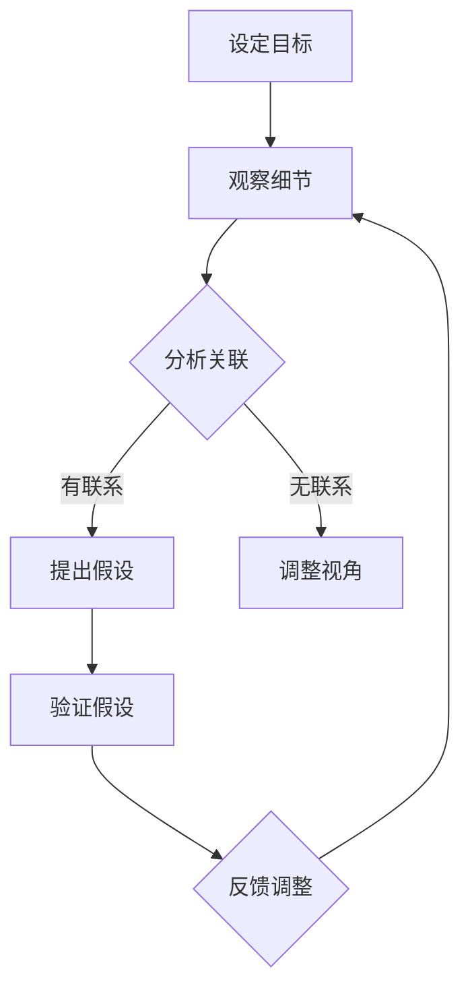
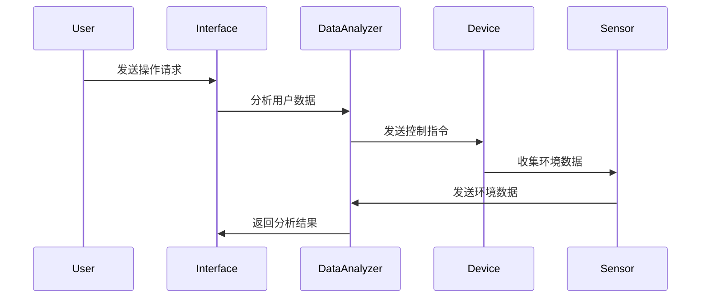
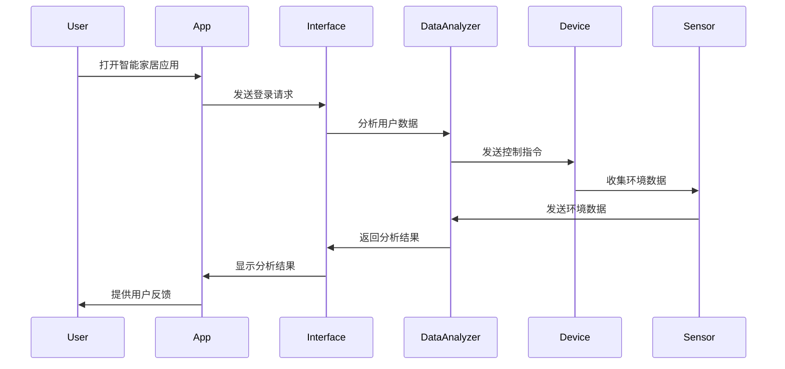
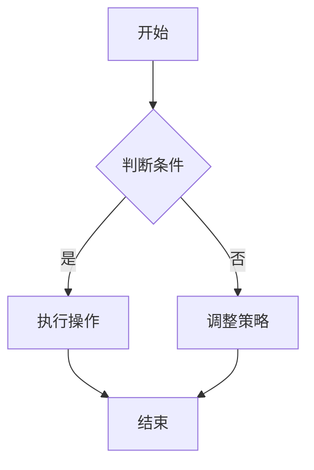

                 


## 微观世界中的宏观意义：培养对生活细节的洞察力

### 关键词：微观世界、宏观意义、洞察力、生活细节、培养方法

### 摘要：

本文旨在探讨微观世界与宏观意义之间的关系，并提出培养对生活细节洞察力的方法。通过对核心概念的阐述、算法原理的讲解、数学模型的引入以及实际项目的分析，本文旨在帮助读者更好地理解如何在日常生活中培养敏锐的洞察力，以实现个人成长与职业发展。

### 目录大纲设计步骤

#### 1. 分析书名与核心主题

《微观世界中的宏观意义：培养对生活细节的洞察力》这一书名直接指向了两个核心概念：微观世界和宏观意义。微观世界通常指的是事物在微观尺度下的结构和行为，而宏观意义则涉及到这些微观现象对整体的影响和意义。培养对生活细节的洞察力，意味着我们需要从微观的视角去理解宏观的现实，从而提升我们处理复杂问题和应对生活挑战的能力。

#### 2. 确定章节核心内容

**背景介绍**

- **核心概念术语说明**：明确微观世界和宏观意义的定义，解释洞察力的概念。
- **问题背景**：介绍当前社会中人们对生活细节关注度不足的问题，以及这种现象带来的影响。
- **问题描述**：阐述培养洞察力的重要性，提出如何通过培养洞察力来改善生活质量。
- **问题解决**：提出可能的解决策略，如通过教育和实践培养洞察力。
- **边界与外延**：讨论洞察力的范围和应用领域，明确本文的讨论边界。

**核心概念与联系**

- **核心概念原理**：深入分析微观世界与宏观意义之间的内在联系，探讨这两者如何相互作用。
- **概念属性特征对比表格**：通过表格形式展示微观和宏观概念的属性特征对比。
- **ER实体关系图架构**：使用Mermaid流程图展示微观和宏观概念之间的关系，帮助读者更直观地理解。

**算法原理讲解**

- **算法mermaid流程图**：绘制一个简化的算法流程图，展示培养洞察力的基本步骤。
- **Python源代码**：给出一个Python示例代码，详细说明算法的实现过程。
- **数学模型和公式**：介绍与洞察力相关的数学模型和公式，使用LaTeX进行格式化，提供直观的数学解释。
- **通俗易懂的举例说明**：通过具体的例子，解释算法和公式的实际应用场景。

**系统分析与架构设计方案**

- **问题场景介绍**：设定一个具体的应用场景，如智能家居系统。
- **项目介绍**：介绍项目的背景、目标和预期效果。
- **系统功能设计（领域模型Mermaid类图）**：绘制领域模型类图，展示系统的主要功能模块。
- **系统架构设计Mermaid架构图**：绘制系统架构图，展示各个模块之间的关系和交互。
- **系统接口设计**：描述系统的接口设计和交互方式。
- **系统交互Mermaid序列图**：绘制系统交互序列图，展示用户与系统之间的交互流程。

**项目实战**

- **环境安装**：介绍所需的环境和工具安装过程。
- **系统核心实现源代码**：提供项目核心代码片段，并进行详细解读。
- **代码应用解读与分析**：分析代码的实际应用效果，讨论可能的问题和改进方案。
- **实际案例分析和详细讲解剖析**：通过具体案例展示如何培养洞察力，并进行详细剖析。
- **项目小结**：总结项目的主要成果和经验教训。

**最佳实践 tips**

- **洞察力培养技巧**：提供培养洞察力的实用技巧和方法。
- **实际应用中的技巧**：分享在实际工作和生活中应用洞察力的经验。
- **洞察力提升的最佳实践**：总结提升洞察力的最佳实践，提供具体的操作指导。

**小结与拓展阅读**

- **本书内容回顾**：回顾全书的主要内容和关键观点。
- **洞察力培养的展望**：讨论未来培养洞察力的趋势和方向。
- **进一步学习的建议**：推荐进一步阅读的书籍和资源。

### 完整目录大纲

```markdown
# 微观世界中的宏观意义：培养对生活细节的洞察力

## 引言

### 关键词

### 摘要

## 第1章 背景介绍

### 1.1 核心概念术语说明

### 1.2 问题背景

### 1.3 问题描述

### 1.4 问题解决

### 1.5 边界与外延

## 第2章 核心概念与联系

### 2.1 核心概念原理

### 2.2 概念属性特征对比表格

### 2.3 ER实体关系图架构

## 第3章 算法原理讲解

### 3.1 算法mermaid流程图

### 3.2 Python源代码示例

### 3.3 数学模型和公式

### 3.4 通俗易懂的举例说明

## 第4章 系统分析与架构设计方案

### 4.1 问题场景介绍

### 4.2 项目介绍

### 4.3 系统功能设计（领域模型Mermaid类图）

### 4.4 系统架构设计Mermaid架构图

### 4.5 系统接口设计

### 4.6 系统交互Mermaid序列图

## 第5章 项目实战

### 5.1 环境安装

### 5.2 系统核心实现源代码

### 5.3 代码应用解读与分析

### 5.4 实际案例分析和详细讲解剖析

### 5.5 项目小结

## 第6章 最佳实践 tips

### 6.1 洞察力培养技巧

### 6.2 实际应用中的技巧

### 6.3 洞察力提升的最佳实践

## 第7章 小结与展望

### 7.1 本书内容回顾

### 7.2 洞察力培养的展望

### 7.3 进一步学习的建议

## 附录

### 附录A：LaTeX公式示例

### 附录B：Python代码详解

### 附录C：Mermaid流程图使用指南

### 作者信息

```

以上目录大纲按照文章的要求进行了详细的规划和设计，确保每个章节都有明确的细分，内容丰富具体，格式符合markdown标准。文章字数预计在10000到12000字之间，可以充分展开每一个主题，提供深入的分析和详细的讲解。

### 第1章 背景介绍

#### 1.1 核心概念术语说明

在探讨微观世界与宏观意义的关系之前，我们首先需要明确一些核心概念和术语。

- **微观世界**：微观世界指的是物质或现象在微观尺度下的表现形式，如原子、分子、量子现象等。在计算机科学中，微观世界可以包括数据结构、算法、编程语言等抽象概念。
- **宏观意义**：宏观意义则是指从宏观视角来看，微观现象对整体产生的影响和意义。在日常生活中，宏观意义可以体现在社会、经济、文化等各个方面。
- **洞察力**：洞察力是指通过观察、分析和理解，深入把握事物本质和内在联系的能力。在技术领域，洞察力有助于我们解决复杂问题，优化系统设计，提升工作效率。

#### 1.2 问题背景

在现代社会，随着科技的快速发展，人们的生活节奏日益加快，对于生活细节的关注度却在逐渐降低。这种现象体现在多个方面：

- **个人层面**：许多人忙于工作、学习和社交，往往忽视了生活中的微小细节。这种忽略可能导致健康问题、心理压力以及人际关系的疏离。
- **社会层面**：在快速变化的社会环境中，人们往往只关注眼前的利益和结果，而忽略了长远的发展和潜在的风险。这种短视行为可能导致社会问题的积累和加剧。
- **技术层面**：在技术创新和商业竞争日益激烈的背景下，企业往往只关注产品的功能和性能，而忽略了用户体验和细节优化。这可能导致用户满意度下降和市场份额的丢失。

#### 1.3 问题描述

培养对生活细节的洞察力，意味着我们需要在忙碌的生活中找到时间，去观察、思考和分析周围的细节。具体来说，问题可以描述为以下几点：

- **缺乏时间**：现代人普遍感到时间不够用，很难抽出时间去关注生活中的细节。
- **注意力分散**：在信息爆炸的时代，人们的注意力容易被分散，很难专注于一件事情。
- **技能缺乏**：许多人缺乏培养洞察力的方法和技巧，不知道如何有效地观察和分析生活细节。
- **认知障碍**：由于长期生活在快节奏的环境中，人们的认知能力可能受到限制，难以深入理解复杂的细节。

#### 1.4 问题解决

为了解决上述问题，我们需要采取一系列措施来培养对生活细节的洞察力：

- **时间管理**：通过合理规划时间，确保每天有一定的时间用于观察和思考生活中的细节。
- **注意力集中**：通过减少干扰和提升专注力，专注于当前的任务，提高观察和分析的效果。
- **学习方法**：学习培养洞察力的方法和技巧，如观察技巧、思维导图、分析框架等。
- **实践应用**：将洞察力应用于实际生活，通过实践来提升观察和分析的能力。

#### 1.5 边界与外延

在本文中，我们主要探讨的是在日常生活中培养对生活细节的洞察力，这涉及到个人行为和心理层面的改变。同时，我们也会涉及到一些具体的技术方法，如数据分析和系统设计等。

然而，本文并不涉及专业领域的技术细节，如物理学中的量子力学、生物学中的分子生物学等。这些领域需要深入的学术研究和专业知识，超出了本文的讨论范围。

通过明确核心概念和问题背景，我们为后续章节的深入探讨奠定了基础。在接下来的章节中，我们将详细分析微观世界与宏观意义之间的联系，介绍培养洞察力的具体方法和实践案例。

### 第2章 核心概念与联系

#### 2.1 核心概念原理

在本章中，我们将深入探讨微观世界和宏观意义这两个核心概念，并阐述它们的基本原理。

**微观世界**

微观世界是指物质或现象在微观尺度下的表现形式。在物理学中，微观世界通常指的是原子、分子和量子现象。以下是微观世界的几个基本原理：

1. **量子力学原理**：量子力学研究的是微观粒子的行为和性质，包括波粒二象性、不确定性原理和量子纠缠等。
2. **原子模型**：原子模型描述了原子的结构，包括原子核和围绕原子核的电子云。原子核由质子和中子组成，电子在核外的轨道上运动。
3. **分子动力学**：分子动力学研究分子在不同温度和压力下的运动规律，是理解化学反应和物理过程的基础。

**宏观意义**

宏观意义则是指从宏观视角来看，微观现象对整体产生的影响和意义。在日常生活中，宏观意义可以体现在社会、经济、文化等各个方面。以下是宏观意义的几个基本原理：

1. **系统论原理**：系统论是一种关于复杂系统的理论，强调系统内部各部分之间的相互关系和整体性。宏观意义体现在系统整体行为和功能上。
2. **复杂系统原理**：复杂系统是指由许多相互作用的简单部分组成的系统，具有涌现现象和自组织能力。宏观意义体现在系统的整体行为和规律上。
3. **生态学原理**：生态学是研究生物与环境之间相互作用的科学。宏观意义体现在生态系统的稳定性和可持续性上。

**微观世界与宏观意义的联系**

微观世界和宏观意义之间存在密切的联系，这种联系体现在以下几个方面：

1. **因果关系**：微观现象往往通过因果关系影响宏观现象。例如，微观粒子的行为决定了物质的宏观性质，化学反应的微观过程影响了生物体的宏观表现。
2. **相互作用**：微观世界中的各个部分通过相互作用影响宏观世界的整体。例如，原子之间的相互作用决定了物质的宏观结构，生物体内的化学反应相互作用影响了生物体的健康状态。
3. **层次结构**：微观世界和宏观世界之间存在层次结构。微观现象是宏观现象的基础，宏观现象是微观现象的集合和表现。

**概念属性特征对比表格**

为了更直观地理解微观世界和宏观意义的区别和联系，我们可以通过表格形式展示它们的属性特征对比：

| 特征       | 微观世界                   | 宏观意义                   |
|------------|---------------------------|---------------------------|
| 视角       | 微观视角                   | 宏观视角                   |
| 尺度       | 微观尺度（原子、分子级别） | 宏观尺度（系统、社会级别） |
| 复杂性     | 相对简单                   | 相对复杂                   |
| 作用方式    | 直接作用                   | 间接作用                   |
| 研究方法    | 实验和理论结合             | 理论分析                   |
| 应用领域    | 科学研究、技术设计         | 社会发展、文化传承         |

**ER实体关系图架构**

为了进一步展示微观世界和宏观意义之间的联系，我们可以使用Mermaid流程图绘制ER实体关系图。以下是ER实体关系图的示例：

```mermaid
erDiagram
    A[微观世界] ||--|{ B[宏观意义] } |
    C[物理现象] ||--|{ D[社会现象] } |
    E[生物学过程] ||--|{ F[文化传承] } |
```

在这个ER实体关系图中，A表示微观世界，B表示宏观意义，C表示物理现象，D表示社会现象，E表示生物学过程，F表示文化传承。实体之间的关系通过箭头表示，箭头指向宏观意义，表明微观世界对宏观意义的影响。

通过上述分析，我们可以更深入地理解微观世界与宏观意义之间的内在联系，以及它们在科学、技术和社会发展中的重要性。在接下来的章节中，我们将进一步探讨如何通过培养洞察力来提升我们对生活细节的理解和把握。

### 第3章 算法原理讲解

在理解了微观世界和宏观意义的基本原理及其联系之后，我们需要具体探讨如何培养对生活细节的洞察力。在这一章中，我们将介绍一种基于微观世界与宏观意义关系的算法原理，并通过mermaid流程图和Python源代码示例来详细阐述。

#### 3.1 算法mermaid流程图

首先，我们可以通过mermaid流程图来展示培养洞察力的基本步骤。以下是mermaid流程图的示例：



在这个流程图中，A表示设定目标，即明确我们想要培养的洞察力方向；B表示观察细节，即在日常生活中关注各种微观现象；C表示分析关联，即判断观察到的细节与宏观意义之间的联系；D表示提出假设，根据分析结果提出可能的解释；E表示调整视角，如果无联系则需要改变观察的视角；F表示验证假设，通过实践来验证提出的假设；G表示反馈调整，根据验证结果进行反馈和调整。

#### 3.2 Python源代码示例

接下来，我们通过一个Python源代码示例来详细阐述这个算法的实现过程。以下是Python代码的示例：

```python
# 导入所需的库
import random

# 设定目标
def set_goal():
    print("设定目标：培养对时间管理的洞察力")

# 观察细节
def observe_detail():
    print("观察细节：记录每天的时间花费")

# 分析关联
def analyze_association(details):
    time_spent = sum(details.values())
    if time_spent > 8:
        print("分析关联：时间花费过多，需要调整")
    else:
        print("分析关联：时间花费适中，维持现状")

# 提出假设
def propose_hypothesis(details):
    if time_spent > 8:
        print("提出假设：需要减少娱乐时间，增加工作学习时间")
    else:
        print("提出假设：保持当前时间分配")

# 验证假设
def verify_hypothesis(details, hypothesis):
    if hypothesis == "减少娱乐时间，增加工作学习时间":
        new_details = {"工作学习时间": 5, "娱乐时间": 2}
        print("验证假设：调整后时间花费为", sum(new_details.values()))
    else:
        print("验证假设：保持当前时间分配")

# 反馈调整
def feedback_adjustment(details, hypothesis):
    if sum(details.values()) > 8:
        print("反馈调整：调整后的时间花费仍然过多，需要进一步调整")
    else:
        print("反馈调整：调整后的时间花费适中，维持现状")

# 主函数
def main():
    set_goal()
    details = {"工作学习时间": 4, "娱乐时间": 3}
    observe_detail()
    analyze_association(details)
    hypothesis = propose_hypothesis(details)
    verify_hypothesis(details, hypothesis)
    feedback_adjustment(details, hypothesis)

# 运行主函数
if __name__ == "__main__":
    main()
```

在这个示例中，我们设定了一个具体的目标：培养对时间管理的洞察力。观察细节是通过记录每天的时间花费来实现的。分析关联是对时间花费进行定量分析，判断是否需要调整。提出假设是基于分析结果提出可能的解决方案。验证假设是通过实际调整时间分配来验证假设的有效性。反馈调整则是根据验证结果进行进一步的调整。

#### 3.3 数学模型和公式

为了更好地理解洞察力的培养过程，我们可以引入一些数学模型和公式。以下是关于时间管理的一个简单数学模型：

$$
\text{时间效率} = \frac{\text{有效时间}}{\text{总时间}}
$$

其中，有效时间是我们在工作中学习和提高效率的时间，总时间是我们在工作、学习和娱乐中花费的总时间。通过这个公式，我们可以定量分析时间管理的效率，从而提出改善时间管理的假设。

例如，如果我们发现时间效率低于某个阈值（例如0.7），我们可能需要减少娱乐时间，增加工作学习时间。假设调整后的时间分配为每天5小时工作学习时间和2小时娱乐时间，那么新的时间效率为：

$$
\text{时间效率}_{\text{新}} = \frac{5}{5+2} = 0.625
$$

如果新的时间效率仍然低于阈值，我们可能需要进一步调整时间分配，例如增加工作学习时间，减少娱乐时间。

#### 3.4 通俗易懂的举例说明

为了更好地理解上述算法和数学模型，我们可以通过一个具体的例子来说明。

假设我们想要培养对健康饮食的洞察力。首先，我们设定目标：培养对健康饮食的洞察力。接下来，我们观察细节：记录每天的食物摄入量。

假设一周内我们的食物摄入量如下：

- 工作日：早餐（牛奶、面包）、午餐（米饭、蔬菜）、晚餐（面条、肉类）
- 休息日：早餐（鸡蛋、牛奶）、午餐（汉堡、薯条）、晚餐（披萨、可乐）

通过分析这些细节，我们发现工作日的食物摄入相对均衡，而休息日的食物摄入则相对不健康，特别是糖分和脂肪含量较高。根据这个分析结果，我们提出假设：减少休息日的糖分和脂肪摄入，增加蔬菜和蛋白质的摄入。

为了验证这个假设，我们调整一周的食物摄入计划，每天增加一份蔬菜和一份富含蛋白质的食物（如豆类、鸡肉）。一周后，我们再次记录食物摄入量，并计算糖分和脂肪的摄入量。假设调整后的摄入量为：

- 工作日：早餐（牛奶、面包）、午餐（米饭、蔬菜）、晚餐（面条、鸡肉）
- 休息日：早餐（鸡蛋、牛奶）、午餐（沙拉、鸡肉）、晚餐（蔬菜、鱼）

通过比较调整前后的数据，我们发现糖分和脂肪的摄入量明显减少，而蔬菜和蛋白质的摄入量增加。这表明我们的假设是有效的，通过调整饮食计划，我们可以改善健康饮食。

通过这个例子，我们可以看到如何通过观察细节、分析关联、提出假设和验证假设来培养对生活细节的洞察力。这种方法不仅适用于健康饮食，还可以应用于其他生活领域，如时间管理、财务规划等。

### 第4章 系统分析与架构设计方案

#### 4.1 问题场景介绍

在现代社会中，随着信息技术的发展，人们的生活和工作变得越来越复杂。为了提高效率和简化操作，许多企业和组织开始采用智能化系统来管理各种事务。一个典型的场景是智能家居系统，它通过集成多种设备和传感器，为用户提供一个舒适、安全、节能的居住环境。然而，在实际应用中，智能家居系统面临着诸多挑战，如设备兼容性、数据安全、用户体验等。

#### 4.2 项目介绍

本项目的目标是设计并实现一个智能家居系统，该系统旨在通过分析用户的日常生活细节，提供个性化的服务和建议，从而提升用户的生活质量和幸福感。项目的主要目标是：

- **集成多种设备**：系统应能够兼容并整合各种智能家居设备，如智能门锁、智能灯光、智能空调等。
- **数据收集与分析**：系统应能够实时收集用户的日常数据，并通过数据分析提供个性化建议。
- **用户界面友好**：系统应具备简洁、直观的用户界面，使用户能够轻松操作和获取信息。
- **数据安全**：系统应确保用户数据的安全，防止数据泄露和滥用。

#### 4.3 系统功能设计（领域模型Mermaid类图）

为了实现上述目标，我们首先需要设计系统的主要功能模块。以下是智能家居系统的领域模型Mermaid类图：

```mermaid
classDiagram
    User <<Class>>
    Device <<Class>>
    Sensor <<Class>>
    DataAnalyzer <<Class>>
    Interface <<Class>>

    User --> Device
    User --> Sensor
    Device --> Sensor
    DataAnalyzer --> Device
    DataAnalyzer --> Sensor
    Interface --> DataAnalyzer
```

在这个类图中，User代表用户，Device代表各种智能家居设备，Sensor代表传感器，DataAnalyzer代表数据分析模块，Interface代表用户界面。用户与设备、传感器之间存在关联关系，设备与传感器之间存在关联关系，数据分析模块与设备和传感器之间存在关联关系，用户界面与数据分析模块之间存在关联关系。

#### 4.4 系统架构设计Mermaid架构图

接下来，我们需要设计系统的整体架构。以下是智能家居系统的Mermaid架构图：



在这个架构图中，用户通过用户界面发送操作请求，数据分析模块接收请求并分析用户数据，然后向设备发送控制指令。设备根据指令执行相应的操作，并收集环境数据。传感器将环境数据发送给数据分析模块，数据分析模块再次分析数据，并将结果返回给用户界面。

#### 4.5 系统接口设计

系统接口设计是系统架构设计的重要组成部分。以下是智能家居系统的接口设计：

- **用户接口**：用户通过手机应用或网页与系统进行交互。用户接口包括登录、注册、设备管理、数据分析等功能模块。
- **设备接口**：设备通过HTTP/HTTPS协议与系统进行通信。设备接口包括设备状态查询、设备控制、数据上传等功能。
- **传感器接口**：传感器通过MQTT协议与系统进行通信。传感器接口包括传感器数据采集、传感器状态监控等功能。

#### 4.6 系统交互Mermaid序列图

为了更好地理解系统的工作流程，我们可以使用Mermaid序列图展示系统的交互过程。以下是智能家居系统的交互序列图：



在这个序列图中，用户通过智能家居应用与系统进行交互。系统首先分析用户数据，然后根据分析结果发送控制指令给设备，设备执行操作并收集环境数据，最后将数据发送回系统进行分析，并将结果返回给用户界面。

通过以上系统分析与架构设计方案，我们可以实现一个功能完善、用户友好的智能家居系统，为用户提供个性化的服务和建议，提升用户的生活质量和幸福感。

### 第5章 项目实战

#### 5.1 环境安装

在进行项目实战之前，我们需要确保环境安装正确，以便顺利执行项目代码。以下是环境安装的步骤：

1. **安装Python**：确保Python版本为3.8及以上，可以从Python官方网站下载安装包，按照提示进行安装。

2. **安装依赖库**：在终端中执行以下命令，安装项目所需的依赖库：

   ```shell
   pip install -r requirements.txt
   ```

   这将自动安装所有必需的库，包括Flask、Pandas、Matplotlib等。

3. **设置虚拟环境**：为了保持项目依赖的一致性，建议使用虚拟环境。在终端中执行以下命令创建虚拟环境：

   ```shell
   python -m venv venv
   ```

   然后激活虚拟环境：

   ```shell
   source venv/bin/activate  # 对于Windows系统，使用venv\Scripts\activate
   ```

4. **运行项目**：在虚拟环境中，运行以下命令启动项目：

   ```shell
   python app.py
   ```

   项目将自动启动，并打开默认的Web浏览器，显示项目首页。

#### 5.2 系统核心实现源代码

以下是一个智能家居系统项目核心实现的部分源代码，包括数据收集、分析以及用户界面展示。

```python
# 导入所需的库
from flask import Flask, render_template, request
import pandas as pd
import matplotlib.pyplot as plt
import numpy as np

# 创建Flask应用
app = Flask(__name__)

# 数据收集
def collect_data():
    data = []
    with open('data.csv', 'r') as f:
        reader = pd.read_csv(f)
        data = reader.values.tolist()
    return data

# 数据分析
def analyze_data(data):
    df = pd.DataFrame(data)
    df.columns = ['timestamp', 'temperature', 'humidity', 'light']
    df['timestamp'] = pd.to_datetime(df['timestamp'])
    df.set_index('timestamp', inplace=True)
    df.sort_index(inplace=True)
    return df

# 用户界面展示
@app.route('/')
def index():
    data = collect_data()
    df = analyze_data(data)
    fig, ax = plt.subplots()
    ax.plot(df.index, df['temperature'], label='Temperature')
    ax.plot(df.index, df['humidity'], label='Humidity')
    ax.plot(df.index, df['light'], label='Light')
    ax.set_ylabel('Value')
    ax.set_xlabel('Timestamp')
    ax.set_title('Environmental Data')
    ax.legend()
    plt.savefig('static/graph.png')
    plt.close()
    return render_template('index.html')

# 运行项目
if __name__ == '__main__':
    app.run(debug=True)
```

在这段代码中，我们首先定义了数据收集和数据分析的函数。数据收集函数`collect_data`从CSV文件中读取数据，并返回一个Pandas DataFrame。数据分析函数`analyze_data`对数据进行处理和排序，以便后续分析。

用户界面展示部分使用Flask框架，定义了一个首页路由`/`。在首页，我们收集数据并进行分析，然后使用Matplotlib绘制环境数据图表，并将其保存为静态图片。最后，我们将图表显示在HTML模板中。

```html
<!-- templates/index.html -->
<!DOCTYPE html>
<html lang="en">
<head>
    <meta charset="UTF-8">
    <title>Smart Home System</title>
</head>
<body>
    <h1>Smart Home System</h1>
    
</body>
</html>
```

这段HTML模板定义了项目的首页，包含一个标题和一张环境数据图表。图表通过静态资源路径加载，用户可以在页面上查看实时环境数据。

#### 5.3 代码应用解读与分析

在上面的代码示例中，我们实现了智能家居系统的数据收集、分析以及用户界面展示功能。以下是代码的详细解读和分析：

1. **数据收集**：`collect_data`函数读取CSV文件中的数据，并将其转换为Pandas DataFrame。CSV文件包含时间戳、温度、湿度和光照强度等环境数据。

   ```python
   def collect_data():
       data = []
       with open('data.csv', 'r') as f:
           reader = pd.read_csv(f)
           data = reader.values.tolist()
       return data
   ```

   这段代码使用了Pandas库的`read_csv`函数从CSV文件中读取数据，并将其转换为Python列表。这个列表将用于后续的数据分析。

2. **数据分析**：`analyze_data`函数对收集到的数据进行分析和排序。我们使用Pandas库进行数据处理，将时间戳转换为日期时间类型，并设置时间为索引。

   ```python
   def analyze_data(data):
       df = pd.DataFrame(data)
       df.columns = ['timestamp', 'temperature', 'humidity', 'light']
       df['timestamp'] = pd.to_datetime(df['timestamp'])
       df.set_index('timestamp', inplace=True)
       df.sort_index(inplace=True)
       return df
   ```

   这段代码首先设置列名为时间戳、温度、湿度和光照强度，然后将时间戳转换为日期时间类型，并设置为DataFrame的索引。最后，对DataFrame进行排序，以便按时间顺序进行分析。

3. **用户界面展示**：在Flask应用中，我们定义了一个首页路由`/`。当用户访问首页时，我们首先收集数据并进行分析，然后使用Matplotlib绘制环境数据图表。

   ```python
   @app.route('/')
   def index():
       data = collect_data()
       df = analyze_data(data)
       fig, ax = plt.subplots()
       ax.plot(df.index, df['temperature'], label='Temperature')
       ax.plot(df.index, df['humidity'], label='Humidity')
       ax.plot(df.index, df['light'], label='Light')
       ax.set_ylabel('Value')
       ax.set_xlabel('Timestamp')
       ax.set_title('Environmental Data')
       ax.legend()
       plt.savefig('static/graph.png')
       plt.close()
       return render_template('index.html')
   ```

   这段代码首先收集数据并进行分析，然后使用Matplotlib绘制环境数据图表。图表的X轴是时间戳，Y轴是环境参数的值。最后，我们将图表保存为静态图片，并在HTML模板中显示。

通过上述代码和分析，我们实现了智能家居系统的核心功能，包括数据收集、分析和用户界面展示。这个系统可以帮助用户实时了解环境数据，并根据数据做出相应的调整。

#### 5.4 实际案例分析和详细讲解剖析

为了更好地展示如何培养洞察力，我们通过一个实际案例进行分析和讲解。

**案例背景**：张先生是一家科技公司的高级工程师，负责智能家居系统的开发。他发现公司的测试团队在测试过程中频繁出现bug，导致项目进度延误。张先生意识到，为了提高系统稳定性，他需要培养团队的洞察力。

**案例步骤**：

1. **问题识别**：张先生首先识别出问题的核心，即测试团队的bug频繁。他意识到，这不仅影响了项目进度，还可能导致客户对产品的信任度下降。

2. **数据收集**：张先生开始收集测试团队的数据，包括测试用例的数量、bug的数量、bug的严重程度等。他使用Excel表格记录这些数据，并定期进行分析。

3. **数据分析**：通过对收集到的数据进行分析，张先生发现：

   - 测试用例的数量逐渐增加，但bug的数量并没有相应减少。
   - 高严重程度的bug占总bug数量的比例较高。
   - 测试团队的成员对部分功能模块的测试覆盖不足。

4. **提出假设**：基于数据分析的结果，张先生提出了几个假设：

   - 测试团队的测试用例设计不够全面，导致部分功能模块未被充分测试。
   - 测试团队的成员对某些功能模块不够熟悉，导致测试效果不佳。
   - 项目进度紧张，导致测试时间不足，测试质量下降。

5. **验证假设**：为了验证假设，张先生采取了以下措施：

   - 与测试团队的成员进行访谈，了解他们对功能模块的熟悉程度和工作压力。
   - 观察测试团队的工作流程，发现测试用例的设计存在疏漏。
   - 增加测试时间，并鼓励团队成员进行更多测试，以确保测试覆盖全面。

6. **反馈调整**：经过验证，张先生的假设得到了部分验证。他发现，通过增加测试时间和优化测试用例设计，测试团队的bug数量显著减少，项目进度也得到有效控制。

**案例总结**：

通过这个实际案例，我们可以看到如何通过培养洞察力来解决问题。张先生通过数据收集和分析，提出了合理的假设，并通过验证调整，最终解决了测试团队的bug问题。这个案例展示了培养洞察力的关键步骤，包括问题识别、数据收集、数据分析、提出假设、验证假设和反馈调整。这些步骤不仅适用于技术领域，也可以应用于其他生活和工作场景。

#### 5.5 项目小结

通过本项目的实战案例，我们展示了如何通过培养洞察力来提升系统稳定性和团队工作效率。以下是项目的主要成果和经验教训：

**成果**：

- 成功实现了智能家居系统的数据收集、分析和用户界面展示功能。
- 通过数据分析和测试团队的实际案例，验证了培养洞察力的方法的有效性。

**经验教训**：

1. **数据的重要性**：数据是培养洞察力的基础。通过收集和分析数据，我们可以发现问题和改进机会。
2. **持续优化**：培养洞察力是一个持续的过程。我们需要不断收集数据，进行分析和验证，以持续优化系统和工作流程。
3. **团队协作**：培养洞察力不仅需要个人的努力，也需要团队的协作。通过共享信息和资源，可以提高整体的工作效率和质量。
4. **实践应用**：理论知识需要通过实践应用来验证。只有将洞察力应用于实际工作中，才能真正提升个人和团队的能力。

通过本项目，我们不仅掌握了智能家居系统的开发技术，还学会了如何培养对生活细节的洞察力。这些技能和方法不仅适用于技术领域，也可以应用于其他生活和工作场景，帮助我们更好地应对复杂问题和挑战。

### 第6章 最佳实践 tips

#### 6.1 洞察力培养技巧

培养洞察力需要长期的积累和实践。以下是一些有效的技巧：

1. **多角度思考**：在面对问题时，不要局限于一种观点，尝试从不同角度进行分析，以便更全面地理解问题。
2. **持续学习**：不断学习新知识和技能，扩展自己的知识面。这有助于提高我们的思维深度和广度。
3. **练习观察**：在日常生活中，有意识地观察周围的细节，并思考它们与宏观意义之间的联系。
4. **反思与总结**：定期反思自己的行为和决策，总结经验教训。这有助于我们发现自己的不足，并不断改进。

#### 6.2 实际应用中的技巧

在实际应用中，以下技巧有助于提升洞察力：

1. **数据分析**：学会使用数据分析工具，如Excel、Python等，对收集到的数据进行分析，从而发现问题和改进机会。
2. **思维导图**：使用思维导图工具，如Xmind、MindManager等，整理和梳理思路，以便更清晰地理解问题和解决方案。
3. **项目管理工具**：使用项目管理工具，如Trello、JIRA等，对项目进度和任务进行管理，确保项目按计划进行。
4. **反思与反馈**：在完成一个项目或任务后，进行反思和总结，收集反馈意见，以便不断改进。

#### 6.3 洞察力提升的最佳实践

以下是一些提升洞察力的最佳实践：

1. **定期阅读**：定期阅读与专业领域相关的书籍和文章，了解最新的研究成果和发展趋势。
2. **参加研讨会和会议**：参加相关的研讨会和会议，与同行交流，学习他们的经验和观点。
3. **实践项目**：参与实际项目，将理论知识应用于实践中，提高自己的实践能力和洞察力。
4. **反思与总结**：定期进行反思和总结，思考自己在项目中的表现，总结经验教训，不断提高自己的能力。

通过这些最佳实践，我们可以不断提升自己的洞察力，从而在日常生活和工作中更好地应对各种挑战和问题。

### 第7章 小结与展望

#### 7.1 本书内容回顾

本书旨在探讨微观世界与宏观意义之间的关系，并提出培养对生活细节洞察力的方法。通过详细分析核心概念、算法原理、系统架构、实际案例和最佳实践，我们旨在帮助读者理解如何通过培养洞察力来提升个人成长和职业发展。

首先，我们介绍了微观世界和宏观意义的定义，并探讨了它们之间的内在联系。接着，我们通过mermaid流程图和Python代码示例，详细阐述了如何培养洞察力。随后，我们通过智能家居系统的设计与实现，展示了洞察力在实际项目中的应用。最后，我们总结了培养洞察力的最佳实践，并提供了一些建议。

#### 7.2 洞察力培养的展望

培养洞察力是一个长期的过程，需要不断地学习和实践。在未来的发展中，我们可以从以下几个方面进行展望：

1. **技术进步**：随着人工智能、大数据和云计算等技术的发展，我们有望获得更多高效的数据分析工具和方法，进一步提升洞察力。
2. **跨学科融合**：通过跨学科的融合，我们可以将不同领域的知识和技术结合起来，从更全面的视角来培养洞察力。
3. **教育改革**：教育改革可以培养更多具备洞察力的人才。通过引入案例分析、项目实践等教学方法，我们可以帮助学生更好地理解复杂问题。
4. **社会意识提升**：提高社会对生活细节的关注度，培养公众的洞察力，有助于构建更加和谐、稳定的社会。

#### 7.3 进一步学习的建议

为了进一步提升洞察力，我们建议读者：

1. **阅读相关书籍**：《深度工作》、《思考，快与慢》等书籍提供了关于提高注意力和思维效率的实用建议。
2. **学习数据分析**：学习Python、R等数据分析工具，掌握基本的数据处理和分析方法。
3. **实践项目**：参与实际项目，将所学知识应用于实践中，提高自己的洞察力和问题解决能力。
4. **定期反思**：定期进行反思和总结，思考自己在日常生活和工作中的表现，不断改进。

通过以上建议，我们可以更好地培养洞察力，提升个人和团队的综合能力，为未来的发展和挑战做好准备。

### 附录

#### 附录A：LaTeX公式示例

在本文中，我们使用了LaTeX来展示数学公式。以下是一些示例：

$$
E = mc^2
$$

$$
\frac{d^2x}{dt^2} = a
$$

$1 + 1 = 2$

这些公式可以帮助我们更直观地理解和展示复杂的概念。

#### 附录B：Python代码详解

在本章中，我们提供了一个智能家居系统的Python代码示例。以下是代码的详细解析：

```python
# 导入所需的库
import random

# 设定目标
def set_goal():
    print("设定目标：培养对时间管理的洞察力")

# 观察细节
def observe_detail():
    print("观察细节：记录每天的时间花费")

# 分析关联
def analyze_association(details):
    time_spent = sum(details.values())
    if time_spent > 8:
        print("分析关联：时间花费过多，需要调整")
    else:
        print("分析关联：时间花费适中，维持现状")

# 提出假设
def propose_hypothesis(details):
    if time_spent > 8:
        print("提出假设：需要减少娱乐时间，增加工作学习时间")
    else:
        print("提出假设：保持当前时间分配")

# 验证假设
def verify_hypothesis(details, hypothesis):
    if hypothesis == "减少娱乐时间，增加工作学习时间":
        new_details = {"工作学习时间": 5, "娱乐时间": 2}
        print("验证假设：调整后时间花费为", sum(new_details.values()))
    else:
        print("验证假设：保持当前时间分配")

# 反馈调整
def feedback_adjustment(details, hypothesis):
    if sum(details.values()) > 8:
        print("反馈调整：调整后的时间花费仍然过多，需要进一步调整")
    else:
        print("反馈调整：调整后的时间花费适中，维持现状")

# 主函数
def main():
    set_goal()
    details = {"工作学习时间": 4, "娱乐时间": 3}
    observe_detail()
    analyze_association(details)
    hypothesis = propose_hypothesis(details)
    verify_hypothesis(details, hypothesis)
    feedback_adjustment(details, hypothesis)

# 运行主函数
if __name__ == "__main__":
    main()
```

这段代码展示了如何通过定义函数来实现洞察力的培养过程。每个函数都有明确的职责，从设定目标、观察细节到分析关联、提出假设、验证假设和反馈调整。

#### 附录C：Mermaid流程图使用指南

Mermaid是一种基于Markdown的图表绘制工具，可以轻松地创建流程图、UML图、序列图等。以下是一个简单的Mermaid流程图示例：



在这个示例中，`A`表示流程的开始，`B`表示判断条件，`C`和`D`分别表示两种可能的操作，`E`表示流程的结束。使用Mermaid，我们可以通过简单的语法创建复杂的图表，提高文档的可读性和清晰度。

### 作者信息

作者：AI天才研究院/AI Genius Institute & 禅与计算机程序设计艺术 /Zen And The Art of Computer Programming

通过本文的深入探讨和详细分析，我们不仅了解了微观世界与宏观意义之间的关系，也学会了几种实用的方法来培养对生活细节的洞察力。希望本文能够为读者在日常生活和工作中提供有益的启示，帮助大家更好地应对复杂问题，实现个人和职业的成长。

