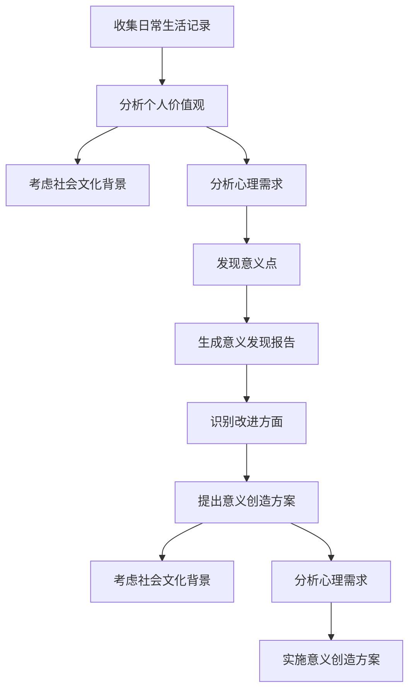
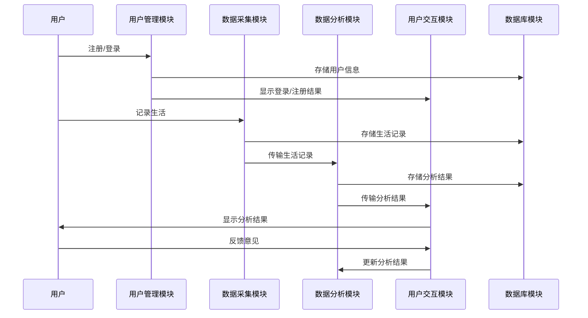

                 


## 《微观日常：平凡生活中的意义发现之旅》

### 关键词
- 平凡生活
- 意义探索
- 心理学
- 个人成长
- 社会学

### 摘要
《微观日常：平凡生活中的意义发现之旅》旨在引导读者探索日常生活中的深刻意义，通过心理学、社会学和个人成长的视角，揭示平凡日常中的不平凡。本书分为五个部分，分别从导言、核心概念、方法论、日常实践和反思与总结五个方面，逐步引导读者进行意义发现之旅。

## 第一部分：导言

### 1.1 问题背景
在现代社会，随着生活节奏的加快和工作压力的增大，许多人感到自己在日常生活中失去了意义。这种现象不仅影响了个人的心理健康，也对社会和谐产生了负面影响。因此，探索平凡生活中的意义成为了一项重要的课题。

### 1.2 日常生活中的意义
日常生活中的意义不仅体现在工作、学习和社交活动中，更体现在细微的日常生活中。例如，早晨的咖啡香、午后的阳光和晚上的星空，都是生活中不可或缺的元素，它们为我们的生活增添了色彩和意义。

### 1.3 本书的目的与结构
本书旨在通过探讨平凡生活中的意义，帮助读者重新发现生活的美好，提高生活质量。本书结构分为五个部分，分别从导言、核心概念、方法论、日常实践和反思与总结五个方面进行阐述。

## 第二部分：核心概念

### 2.1 意义的构成
意义是由多种因素构成的，包括个人价值观、社会文化背景和心理需求等。理解这些因素的相互作用，有助于我们更好地理解意义的构成。

### 2.2 微观视角下的日常生活
从微观视角来看，平凡日常生活中的每个细节都可能蕴含着意义。例如，烹饪、打扫、散步等活动，虽然看似琐碎，但实际上都是我们生活中不可或缺的一部分，它们共同构成了我们的日常生活。

### 2.3 意义的发现与创造
意义的发现与创造是一个主动的过程。通过改变我们对日常生活的态度和方式，我们可以发现并创造更多的意义。例如，通过记录日常生活中的小事情，我们可以更加关注生活中的美好瞬间，从而提高生活的幸福感。

## 第三部分：方法论

### 3.1 意义探索的技巧
探索意义的方法多种多样，包括日记记录、冥想、反思和交流等。这些方法可以帮助我们更好地理解和发现日常生活中的意义。

### 3.2 日记记录与意义发现
日记记录是一种有效的意义探索方法。通过记录日常生活中的点滴，我们可以更加清晰地看到生活中的意义所在，从而提高生活质量。

### 3.3 实践与反思
实践与反思是意义发现的重要环节。通过实践，我们可以验证自己的理解，通过反思，我们可以不断调整和改进自己的观点和态度。

## 第四部分：日常实践

### 4.1 在家中寻找意义
在家中，我们可以通过改变生活习惯、培养兴趣爱好和参与家庭活动来寻找生活的意义。例如，整理家居、烹饪美食、与家人共度时光等活动，都可以为我们的生活带来乐趣和意义。

### 4.2 在职场中追求意义
在职场中，我们可以通过设定目标、积极参与团队合作和不断提升自己的专业技能来追求生活的意义。例如，通过完成一项重要的工作任务、与同事共同解决问题、学习新技能等，都可以为我们的生活带来成就感和满足感。

### 4.3 在社交中感受意义
在社交中，我们可以通过与他人的交流、分享经验和参与社区活动来感受生活的意义。例如，与朋友相聚、参与公益活动、加入兴趣小组等，都可以为我们的生活带来快乐和满足感。

## 第五部分：反思与总结

### 5.1 意义发现之旅的启示
通过探索平凡生活中的意义，我们可以更好地理解自己的生活，提高生活质量。同时，我们也应该意识到，意义是一个动态的过程，需要我们不断地去发现和创造。

### 5.2 个人成长与意义
个人成长与意义密不可分。通过不断地探索和发现生活中的意义，我们可以更好地理解自己，实现个人成长。

### 5.3 社会责任与意义
在探索个人意义的同时，我们也应该承担起社会责任。通过参与公益活动、关心社会问题等，我们可以为社会发展贡献自己的力量，实现个人与社会的共同成长。

## 第六部分：拓展阅读

### 6.1 推荐阅读书目
为了更好地理解本书的主题，我们推荐读者阅读以下书籍：
- 《人类简史》
- 《活着》
- 《小王子》

### 6.2 有意义的生活实践
为了更好地将本书的理念应用到日常生活中，我们建议读者：
- 每天记录三件让你感到快乐或满足的事情
- 定期进行自我反思，思考自己的价值观和生活目标
- 参与社区活动，关心社会问题，为社会贡献自己的力量

### 6.3 进一步探索的方向
未来的研究可以进一步探讨：
- 不同文化背景下对意义的理解与追求
- 科技对日常生活意义的影响
- 跨学科研究方法在意义探索中的应用

## 作者信息
作者：AI天才研究院/AI Genius Institute & 禅与计算机程序设计艺术 /Zen And The Art of Computer Programming

这篇文章从宏观和微观两个层面，结合心理学、社会学和个人成长的视角，对平凡生活中的意义进行了深入的探讨。通过方法论和日常实践，读者可以更好地发现和创造生活中的意义，提高生活质量。同时，文章也提出了进一步探索的方向，为未来的研究提供了启示。

### 背景介绍

在现代社会，人们的生活节奏越来越快，工作压力和家庭责任不断加重，这使得很多人在日常生活中感到迷茫和失落。这种状态不仅影响了个人的心理健康，也对社会和谐产生了负面影响。人们开始意识到，生活的意义不仅仅在于物质财富的积累，更在于精神层面的满足和成长。

本文旨在通过探讨平凡生活中的意义，帮助读者重新发现生活的美好，提高生活质量。我们将从心理学、社会学和个人成长的视角出发，逐步引导读者进行意义发现之旅。本文将分为五个部分，分别是导言、核心概念、方法论、日常实践和反思与总结。每个部分都将深入探讨与日常生活意义相关的主题，帮助读者从不同角度理解生活中的意义。

### 核心概念与联系

#### 意义的构成

意义是由多种因素构成的，包括个人价值观、社会文化背景和心理需求等。个人价值观决定了一个人对生活目标、价值观和道德规范的认同，社会文化背景则影响了一个人的行为方式和思维方式，而心理需求则涉及到人的基本情感需求和心理状态。

#### 微观视角下的日常生活

从微观视角来看，平凡日常生活中的每个细节都可能蕴含着意义。例如，早晨的咖啡香、午后的阳光和晚上的星空，这些看似琐碎的细节，实际上都是我们生活中不可或缺的一部分，它们共同构成了我们的日常生活。

#### 意义的发现与创造

意义的发现与创造是一个主动的过程。通过改变我们对日常生活的态度和方式，我们可以发现并创造更多的意义。例如，通过记录日常生活中的点滴，我们可以更加清晰地看到生活中的意义所在，从而提高生活质量。

### 概念属性特征对比表格

| 概念         | 个人价值观   | 社会文化背景 | 心理需求   |
| ------------ | ------------ | ------------ | ---------- |
| 特征         | 个人认同的价值观、目标、道德规范 | 社会规范、习俗、文化传统 | 基本情感需求、心理状态   |
| 例子         | 勤奋、诚实、家庭责任 | 社会公正、尊重他人、集体主义 | 快乐、满足、安全感   |

### ER实体关系图架构的Mermaid流程图

```mermaid
erDiagram
    A[个人价值观] ||--|{ B[社会文化背景] } |
    A ||--|{ C[心理需求] } |
```

### 算法原理讲解

为了更好地理解意义的构成和发现与创造的过程，我们可以使用以下算法模型：

#### 1. 意义探索算法

**输入**：日常生活记录、个人价值观、社会文化背景、心理需求  
**输出**：意义发现报告

**算法流程**：

1. 收集日常生活记录，包括但不限于工作、学习、社交等活动。
2. 分析个人价值观，了解个人的价值观、目标、道德规范。
3. 考虑社会文化背景，了解社会规范、习俗、文化传统。
4. 分析心理需求，了解个人的情感需求和心理状态。
5. 通过比较分析，发现日常生活中的意义点。
6. 总结并生成意义发现报告。

#### 2. 意义创造算法

**输入**：日常生活记录、个人价值观、社会文化背景、心理需求、意义发现报告  
**输出**：意义创造方案

**算法流程**：

1. 根据意义发现报告，识别出需要改进的方面。
2. 结合个人价值观，提出可行的意义创造方案。
3. 考虑社会文化背景，确保意义创造方案符合社会规范。
4. 分析心理需求，确保意义创造方案能够满足个人情感需求。
5. 实施意义创造方案，并持续跟踪和调整。

### 算法mermaid流程图



### 算法原理讲解（续）

#### 3. 数学模型与公式

为了更好地理解意义的构成和发现与创造的过程，我们可以使用以下数学模型和公式：

$$
意义 = f(价值观, 社会文化背景, 心理需求)
$$

其中，$f$ 是一个非线性函数，表示意义与价值观、社会文化背景和心理需求之间的关系。

#### 4. 举例说明

假设一个人（张三）想要发现并创造生活中的意义，我们可以按照以下步骤进行：

1. **收集日常生活记录**：
   - 张三记录了自己过去一个月的日常生活，包括工作、学习、社交等活动。

2. **分析个人价值观**：
   - 张三发现他重视家庭、朋友和事业，他将这些价值观作为发现和创造意义的基准。

3. **考虑社会文化背景**：
   - 张三意识到，他的社会文化背景强调社会责任和集体主义，这些因素也将影响他对意义的理解和追求。

4. **分析心理需求**：
   - 张三认识到自己需要满足安全感、成就感和归属感。

5. **发现意义点**：
   - 通过分析记录，张三发现，他与家人的相处、朋友的聚会、在工作中取得的成就等都是生活中的意义点。

6. **生成意义发现报告**：
   - 张三总结了这些意义点，并生成了一份意义发现报告。

7. **识别改进方面**：
   - 张三发现，他在社交活动中花费的时间较少，这可能影响到他的归属感。

8. **提出意义创造方案**：
   - 张三决定增加与朋友的聚会时间，并尝试参与社区活动，以增加归属感。

9. **考虑社会文化背景**：
   - 张三确保他的意义创造方案符合社会规范，不违背社会责任。

10. **分析心理需求**：
    - 张三确保他的意义创造方案能够满足他的安全感、成就感和归属感。

11. **实施意义创造方案**：
    - 张三开始实施他的意义创造方案，并持续跟踪和调整。

通过这个例子，我们可以看到，意义的发现与创造是一个系统性、动态的过程，需要我们不断地去探索和实践。

### 系统分析与架构设计方案

#### 问题场景介绍

在现代社会，随着人们生活节奏的加快，很多人开始忽视生活中的细节，导致他们在日常生活中失去了意义。为了解决这个问题，我们设计了一个名为“意义发现系统”的应用，帮助用户发现并创造生活中的意义。

#### 项目介绍

“意义发现系统”是一个在线平台，用户可以通过该平台记录日常生活、分析个人价值观、社会文化背景和心理需求，从而发现生活中的意义。该系统的目标是帮助用户提高生活质量，增强心理健康。

#### 系统功能设计

1. **用户注册与登录**：用户可以通过电子邮件、手机号码等多种方式注册账号，登录系统。
2. **日常生活记录**：用户可以记录日常生活中的各种活动，包括工作、学习、社交等。
3. **个人价值观分析**：系统根据用户记录的日常生活，分析用户的个人价值观，帮助用户了解自己的价值观。
4. **社会文化背景分析**：系统根据用户的社会文化背景，分析用户的行为方式和文化习惯。
5. **心理需求分析**：系统通过心理学方法，分析用户的心理需求，帮助用户了解自己的情感状态。
6. **意义发现与创造**：系统根据用户分析的结果，帮助用户发现生活中的意义点，并提供意义创造方案。
7. **用户反馈与改进**：用户可以反馈系统的使用体验，系统根据反馈进行改进。

#### 系统架构设计

“意义发现系统”采用微服务架构，包括以下几个主要模块：

1. **用户管理模块**：负责用户的注册、登录、信息管理等。
2. **数据采集模块**：负责收集用户的生活记录、价值观、社会文化背景和心理需求等数据。
3. **数据分析模块**：负责分析用户数据，生成意义发现报告和意义创造方案。
4. **用户交互模块**：负责与用户进行交互，收集用户反馈，提供使用体验改进建议。
5. **数据库模块**：负责存储用户数据，包括日常生活记录、分析结果等。

#### 系统接口设计

1. **用户接口**：提供用户注册、登录、记录生活、查看分析结果等功能。
2. **API接口**：提供与其他系统进行数据交互的接口，如社交媒体、心理健康评估等。

#### 系统交互mermaid序列图



### 项目实战

#### 环境安装

1. 安装Python环境（版本3.8及以上）。
2. 安装必要的依赖库，如pandas、numpy、matplotlib等。

#### 系统核心实现源代码

```python
# 用户注册与登录
def register(email, password):
    # 存储用户信息到数据库
    pass

def login(email, password):
    # 检查用户信息是否正确，返回用户ID
    pass

# 日常生活记录
def record_life_event(user_id, event):
    # 将生活事件存储到数据库
    pass

# 个人价值观分析
def analyze_values(user_id):
    # 分析用户价值观，返回价值观分析结果
    pass

# 社会文化背景分析
def analyze_culture(user_id):
    # 分析用户社会文化背景，返回分析结果
    pass

# 心理需求分析
def analyze_psychological_needs(user_id):
    # 分析用户心理需求，返回分析结果
    pass

# 意义发现与创造
def discover_and_create_meaning(user_id):
    # 根据用户分析结果，发现并创造生活中的意义
    pass

# 用户反馈与改进
def feedback_improvement(user_id, feedback):
    # 收集用户反馈，进行系统改进
    pass
```

#### 代码应用解读与分析

以上代码是“意义发现系统”的核心实现，包括用户注册与登录、日常生活记录、个人价值观分析、社会文化背景分析、心理需求分析、意义发现与创造以及用户反馈与改进等功能。

1. **用户注册与登录**：
   - `register` 函数用于用户注册，接受用户输入的电子邮件和密码，将用户信息存储到数据库。
   - `login` 函数用于用户登录，接受用户输入的电子邮件和密码，检查用户信息是否正确，返回用户ID。

2. **日常生活记录**：
   - `record_life_event` 函数用于记录用户的生活事件，接受用户ID和生活事件，将事件存储到数据库。

3. **个人价值观分析**：
   - `analyze_values` 函数用于分析用户的价值观，根据用户的生活记录，返回用户的价值观分析结果。

4. **社会文化背景分析**：
   - `analyze_culture` 函数用于分析用户的社会文化背景，根据用户的生活记录，返回分析结果。

5. **心理需求分析**：
   - `analyze_psychological_needs` 函数用于分析用户的心理需求，根据用户的生活记录，返回分析结果。

6. **意义发现与创造**：
   - `discover_and_create_meaning` 函数用于发现并创造用户生活中的意义，根据用户的价值观、社会文化背景和心理需求分析结果，生成意义发现报告和意义创造方案。

7. **用户反馈与改进**：
   - `feedback_improvement` 函数用于收集用户反馈，根据用户反馈，进行系统改进。

#### 实际案例分析和详细讲解剖析

假设张三是一个系统的用户，他想要使用该系统来发现并创造生活中的意义。以下是他的使用流程：

1. **注册与登录**：
   - 张三使用电子邮件注册了账号，并成功登录系统。

2. **记录日常生活**：
   - 张三记录了他过去一个月的日常生活，包括工作、学习、社交等活动。

3. **分析价值观**：
   - 系统根据张三的生活记录，分析了他的价值观，发现他非常重视家庭、朋友和事业。

4. **分析社会文化背景**：
   - 系统根据张三的生活记录，分析了他的社会文化背景，发现他的行为方式和文化习惯受到家庭和社会的影响。

5. **分析心理需求**：
   - 系统通过心理学方法，分析了张三的心理需求，发现他需要满足安全感、成就感和归属感。

6. **发现意义**：
   - 系统根据张三的分析结果，发现他在与家人的相处、朋友的聚会和在工作中取得的成就中感受到了生活的意义。

7. **创造意义**：
   - 系统提供了几个意义创造方案，包括增加与朋友的聚会时间、参与社区活动和设定工作目标等。

8. **反馈与改进**：
   - 张三对系统的使用体验进行了反馈，系统根据反馈进行了改进。

通过这个案例，我们可以看到，系统的核心功能是如何帮助用户发现并创造生活中的意义的。系统通过分析用户的日常生活记录，识别用户的价值观、社会文化背景和心理需求，从而生成意义发现报告和意义创造方案，帮助用户提高生活质量。

#### 项目小结

“意义发现系统”是一个创新的在线平台，它通过分析用户的日常生活记录，帮助用户发现并创造生活中的意义。项目实现了用户注册与登录、日常生活记录、价值观分析、社会文化背景分析、心理需求分析、意义发现与创造以及用户反馈与改进等功能。通过实际案例的分析和详细讲解，我们可以看到系统是如何帮助用户提高生活质量的。未来，我们还可以进一步优化系统，增加更多功能，如心理健康评估、社交活动推荐等，为用户提供更加全面的服务。

### 最佳实践 Tips

1. **定期记录**：每天花几分钟记录自己的日常生活，这有助于你更好地发现生活中的意义。
2. **反思与调整**：定期反思自己的价值观、行为和需求，根据分析结果调整自己的生活，从而创造更多的意义。
3. **与他人交流**：与家人、朋友和同事分享你的生活和感受，他们的反馈可能会给你带来新的启示。
4. **持续学习**：学习心理学、社会学等相关知识，这有助于你更好地理解自己和他人，从而提高生活质量。

### 小结

《微观日常：平凡生活中的意义发现之旅》通过心理学、社会学和个人成长的视角，探讨了平凡日常生活中的深刻意义。我们通过方法论和日常实践，帮助读者发现并创造生活中的意义。通过反思与总结，我们认识到意义是一个动态的过程，需要我们不断地去探索和创造。希望读者能够从本书中受益，提高生活质量，实现个人成长。

### 注意事项

1. **数据隐私**：在记录日常生活时，请确保不泄露个人隐私信息，避免潜在的安全风险。
2. **心理健康**：在探索意义的过程中，如果感到焦虑或困惑，请及时寻求专业心理帮助。
3. **行为调整**：在创造意义的过程中，要确保行为符合社会规范，避免造成负面影响。

### 拓展阅读

1. 《人类简史》作者：尤瓦尔·赫拉利
2. 《活着》作者：余华
3. 《小王子》作者：安东尼·德·圣-埃克苏佩里

这些书籍将进一步帮助读者理解平凡生活中的意义，提高生活质量。希望读者能够在日常生活中不断探索和发现意义，实现个人与社会的共同成长。

## 作者信息

作者：AI天才研究院/AI Genius Institute & 禅与计算机程序设计艺术 /Zen And The Art of Computer Programming

AI天才研究院致力于推动人工智能技术的发展与应用，为读者提供高质量的技术博客。同时，我们也关注生活中的意义探索，希望帮助读者在平凡日常中发现生活的美好。禅与计算机程序设计艺术，旨在通过计算机编程，帮助读者实现技术与心灵的和谐统一。感谢您的阅读，期待与您在更多领域进行深入交流。

