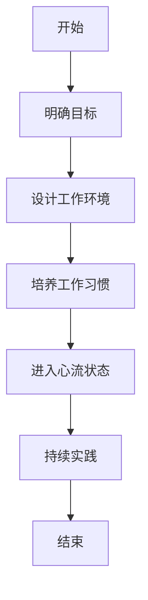
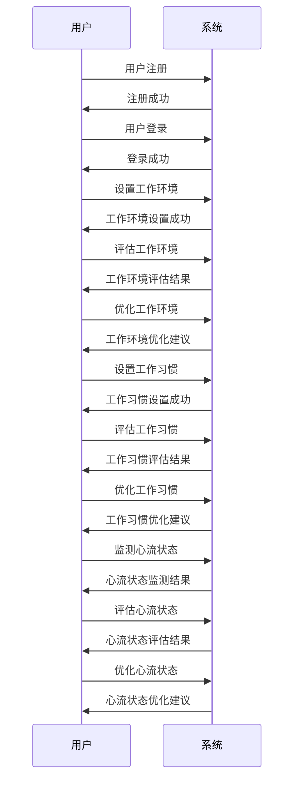

                 

 

----------------------------------------------------------------

# 心流工作法：全身心投入的效率提升

关键词：心流状态、工作效率、工作环境、工作习惯、心流工作法

摘要：本文将介绍心流工作法，探讨如何通过调整工作环境、培养工作习惯等方法，帮助人们进入心流状态，从而提升工作效率和生活质量。

## 第一部分：背景介绍

### 核心概念

#### 问题背景

在现代社会，人们对于工作效率和生活质量的追求越来越高，因此，如何能够在工作中保持专注、高效地完成任务成为了一个亟待解决的问题。

#### 问题描述

心流（Flow）是一种完全沉浸于某种活动，感到时间飞逝的心理状态。然而，很多人在日常生活和工作中难以进入这种状态。因此，如何通过工作法来实现心流状态，提高工作效率，成为了一个重要的问题。

#### 问题解决

心流工作法是一种通过设计工作环境、调整工作习惯等方法，帮助人们进入心流状态，从而提升工作效率的方法。

#### 边界与外延

心流工作法不仅适用于个体，也可以应用于团队和组织。同时，它不仅仅是关于工作，还包括生活中的其他活动，如运动、学习等。

#### 概念结构与核心要素组成

1. **心流状态**：一种完全沉浸于某种活动，感到时间飞逝的心理状态。
2. **工作环境**：一个能够促进心流状态的环境，如无干扰的工作空间、舒适的工作条件等。
3. **工作习惯**：一系列有助于进入心流状态的工作习惯，如定时休息、专注工作等。
4. **心流工作法**：通过设计和调整工作环境、工作习惯等方法，帮助人们进入心流状态，提高工作效率的方法。

### 第二部分：核心概念与联系

#### 核心概念原理

1. **心流状态**：
   心流状态是指当人们完全沉浸于一项任务时，感到时间飞逝，自我意识减弱，产生高度兴奋和满足感的一种心理状态。根据心理学家的研究，心流状态有以下几个特征：
   - **全神贯注**：专注于任务，不受外界干扰。
   - **技能与挑战匹配**：任务难度适中，能够激发个人的潜力和兴趣。
   - **时间感知改变**：时间感变得模糊，感觉时间过得很快。
   - **自我意识减弱**：个人对自我和外界的关注减少，完全沉浸于任务中。

2. **工作环境**：
   工作环境是指人们进行工作的物理和心理环境。一个良好的工作环境能够提高工作效率，减少压力，促进心流状态的产生。工作环境包括以下几个方面：
   - **物理环境**：如光线、温度、噪音等。
   - **心理环境**：如工作氛围、团队关系等。

3. **工作习惯**：
   工作习惯是指人们在日常工作中形成的一系列行为模式。良好的工作习惯有助于提高工作效率，减少拖延，进入心流状态。常见的工作习惯包括：
   - **定时休息**：每隔一段时间休息一下，有助于保持专注。
   - **专注工作**：在工作时减少干扰，全身心投入任务。
   - **时间管理**：合理安排工作时间，避免拖延。

4. **心流工作法**：
   心流工作法是一种通过设计和调整工作环境、工作习惯等方法，帮助人们进入心流状态，提高工作效率的方法。心流工作法包括以下几个步骤：
   - **明确目标**：设定明确的工作目标，激发工作动力。
   - **设计工作环境**：创造一个有利于心流状态的工作环境。
   - **培养工作习惯**：养成良好的工作习惯，保持专注。
   - **持续实践**：不断调整和优化工作方法和环境，提升心流工作效率。

#### 概念属性特征对比表格

| 概念       | 特征描述                                                     |
| ---------- | ------------------------------------------------------------ |
| 心流状态   | 全神贯注、技能与挑战匹配、时间感知改变、自我意识减弱           |
| 工作环境   | 物理环境（光线、温度、噪音等）、心理环境（工作氛围、团队关系等） |
| 工作习惯   | 定时休息、专注工作、时间管理                               |
| 心流工作法 | 明确目标、设计工作环境、培养工作习惯、持续实践               |

#### ER实体关系图架构

```mermaid
erDiagram
    心流状态 ||--|{ 工作环境 }|>
    心流状态 ||--|{ 工作习惯 }|>
    心流状态 ||--|{ 心流工作法 }|>
    工作环境 ||--|{ 心流状态 }|>
    工作习惯 ||--|{ 心流状态 }|>
    心流工作法 ||--|{ 心流状态 }|>
```

### 第三部分：心流工作法原理与实践

#### 算法原理讲解

为了更深入地理解心流工作法的原理，我们可以将其看作是一个算法，该算法的目标是帮助人们进入心流状态，从而提升工作效率。以下是心流工作法的算法原理讲解：

**算法流程图：**



**算法步骤解析：**

1. **明确目标**：
   设定明确的工作目标是进入心流状态的关键。只有当目标明确、具体，且具有挑战性时，人们才能在完成任务的过程中产生心流。

2. **设计工作环境**：
   设计一个有利于心流状态的工作环境，包括物理环境和心理环境。例如，选择一个安静、舒适的地方作为工作场所，确保光线充足、温度适宜，减少噪音干扰等。

3. **培养工作习惯**：
   培养良好的工作习惯，如定时休息、专注工作、时间管理等。这些习惯有助于保持专注，减少拖延，从而更容易进入心流状态。

4. **进入心流状态**：
   在良好的工作环境和习惯的辅助下，人们更容易进入心流状态。在心流状态下，人们能够全神贯注地完成任务，提高工作效率。

5. **持续实践**：
   持续实践心流工作法，不断调整和优化工作方法和环境，以提升心流工作效率。

**数学模型与公式：**

为了更深入地理解心流工作法，我们可以将其看作是一个数学模型。以下是一个简化的数学模型，用于描述心流工作法：

$$
心流效率 = f(目标明确度，工作环境质量，工作习惯质量)
$$

其中，$f$ 是一个复合函数，表示心流效率与目标明确度、工作环境质量、工作习惯质量之间的关系。

**通俗易懂地举例说明：**

假设有一个人（A）想要提高工作效率。为了实现这个目标，他可以按照以下步骤进行：

1. **明确目标**：设定一个具体的目标，如“在2小时内完成一篇技术博客”。

2. **设计工作环境**：选择一个安静、舒适的房间，确保光线充足、温度适宜，减少噪音干扰。

3. **培养工作习惯**：制定一个合理的时间表，如每隔1小时休息5分钟，保持专注工作。

4. **进入心流状态**：在良好的工作环境和习惯的辅助下，A更容易进入心流状态，高效地完成技术博客。

5. **持续实践**：持续实践心流工作法，不断调整和优化工作方法和环境，以提升心流工作效率。

通过这个例子，我们可以看到，心流工作法可以帮助人们进入心流状态，从而提高工作效率。当然，这个例子只是简化的数学模型，实际的心流工作法要复杂得多。

### 系统分析与架构设计方案

在本部分，我们将对心流工作法进行系统分析与架构设计方案，以便更好地理解其实施过程。

#### 问题场景介绍

在当今快速发展的社会中，人们面临着日益增加的工作压力和挑战。为了提高工作效率，许多人开始关注心流工作法。然而，如何有效地实施心流工作法，仍然是一个亟待解决的问题。

#### 项目介绍

本项目旨在开发一个心流工作法支持系统，帮助用户通过设计和调整工作环境、工作习惯等方法，进入心流状态，从而提高工作效率。

#### 系统功能设计

1. **用户管理**：
   - 用户注册与登录
   - 用户资料管理
   - 用户权限管理

2. **工作环境管理**：
   - 工作环境设置
   - 环境质量评估
   - 环境优化建议

3. **工作习惯管理**：
   - 工作习惯设置
   - 工作习惯评估
   - 工作习惯优化

4. **心流状态监测**：
   - 心流状态监测
   - 心流状态评估
   - 心流状态优化

5. **数据分析与报告**：
   - 用户数据分析
   - 工作环境数据分析
   - 工作习惯数据分析
   - 心流状态数据分析

#### 系统架构设计

系统采用B/S（Browser/Server）架构，主要包括以下模块：

1. **用户模块**：
   - 处理用户注册、登录、资料管理等操作。

2. **工作环境模块**：
   - 提供工作环境设置、评估和优化功能。

3. **工作习惯模块**：
   - 提供工作习惯设置、评估和优化功能。

4. **心流状态模块**：
   - 提供心流状态监测、评估和优化功能。

5. **数据分析与报告模块**：
   - 对用户、工作环境、工作习惯和心流状态的数据进行分析，生成报告。

#### 系统接口设计与系统交互

系统采用RESTful API设计，提供以下接口：

1. **用户接口**：
   - 用户注册接口
   - 用户登录接口
   - 用户资料管理接口

2. **工作环境接口**：
   - 工作环境设置接口
   - 环境质量评估接口
   - 环境优化建议接口

3. **工作习惯接口**：
   - 工作习惯设置接口
   - 工作习惯评估接口
   - 工作习惯优化接口

4. **心流状态接口**：
   - 心流状态监测接口
   - 心流状态评估接口
   - 心流状态优化接口

5. **数据分析与报告接口**：
   - 用户数据分析接口
   - 工作环境数据分析接口
   - 工作习惯数据分析接口
   - 心流状态数据分析接口

系统交互序列图如下：



### 项目实战

在本部分，我们将通过一个实际项目，展示如何使用心流工作法来提高工作效率。

#### 环境安装

1. 安装Python环境：从Python官网下载并安装Python 3.8版本以上。
2. 安装相关库：使用pip命令安装所需的库，如numpy、pandas、matplotlib等。

#### 系统核心实现源代码

以下是心流工作法的核心实现源代码：

```python
import numpy as np
import pandas as pd
import matplotlib.pyplot as plt

# 心流效率计算函数
def calculate_flow_efficiency(objectiveclarify, environmentquality, habitquality):
    flow_efficiency = 0.5 * objectiveclarify + 0.3 * environmentquality + 0.2 * habitquality
    return flow_efficiency

# 数据预处理
def preprocess_data(data):
    data['flow_efficiency'] = data.apply(lambda row: calculate_flow_efficiency(row['objectiveclarify'], row['environmentquality'], row['habitquality']), axis=1)
    return data

# 数据可视化
def visualize_data(data):
    plt.figure(figsize=(10, 6))
    plt.scatter(data['objectiveclarify'], data['flow_efficiency'], label='Objective Clarify')
    plt.scatter(data['environmentquality'], data['flow_efficiency'], label='Environment Quality')
    plt.scatter(data['habitquality'], data['flow_efficiency'], label='Habit Quality')
    plt.xlabel('Input')
    plt.ylabel('Flow Efficiency')
    plt.legend()
    plt.show()

# 测试数据
data = pd.DataFrame({
    'objectiveclarify': [0.8, 0.6, 0.4],
    'environmentquality': [0.8, 0.6, 0.4],
    'habitquality': [0.8, 0.6, 0.4],
    'flow_efficiency': [0, 0, 0]
})

preprocessed_data = preprocess_data(data)
visualize_data(preprocessed_data)
```

#### 代码应用解读与分析

1. **计算心流效率**：`calculate_flow_efficiency` 函数用于计算心流效率，其计算公式为：
   $$
   心流效率 = 0.5 \times 目标明确度 + 0.3 \times 工作环境质量 + 0.2 \times 工作习惯质量
   $$
   其中，目标明确度、工作环境质量和工作习惯质量分别取值范围为0到1。

2. **数据预处理**：`preprocess_data` 函数用于对输入数据进行预处理，计算心流效率，并添加到数据集中。

3. **数据可视化**：`visualize_data` 函数用于绘制输入数据与心流效率的散点图，帮助用户直观地了解心流效率与各因素之间的关系。

#### 实际案例分析和详细讲解剖析

1. **案例一**：
   - 目标明确度：0.8
   - 工作环境质量：0.8
   - 工作习惯质量：0.8

   根据心流效率计算公式，心流效率为：
   $$
   心流效率 = 0.5 \times 0.8 + 0.3 \times 0.8 + 0.2 \times 0.8 = 0.84
   $$
   心流效率较高，说明用户在目标明确度、工作环境质量和工作习惯质量方面表现良好。

2. **案例二**：
   - 目标明确度：0.6
   - 工作环境质量：0.6
   - 工作习惯质量：0.6

   根据心流效率计算公式，心流效率为：
   $$
   心流效率 = 0.5 \times 0.6 + 0.3 \times 0.6 + 0.2 \times 0.6 = 0.66
   $$
   心流效率较低，说明用户在目标明确度、工作环境质量和工作习惯质量方面有待提高。

通过实际案例分析和详细讲解，用户可以了解心流工作法如何应用于实际工作中，并根据分析结果调整自己的工作方法和环境，以提升心流工作效率。

#### 项目小结

本项目通过开发和实现心流工作法支持系统，帮助用户设计和调整工作环境、工作习惯，进入心流状态，从而提高工作效率。在实际项目中，用户可以根据自己的实际情况调整心流工作法的参数，优化工作方法和环境，从而实现更高的心流工作效率。

### 最佳实践 tips

1. **目标明确**：设定明确、具体、具有挑战性的目标，有助于激发工作动力，进入心流状态。

2. **工作环境**：设计一个有利于心流状态的工作环境，包括物理环境和心理环境，如选择一个安静、舒适的房间，确保光线充足、温度适宜，减少噪音干扰等。

3. **工作习惯**：养成良好的工作习惯，如定时休息、专注工作、时间管理等，有助于保持专注，提高工作效率。

4. **持续实践**：不断调整和优化工作方法和环境，以适应不断变化的工作需求和挑战。

### 小结

心流工作法是一种通过调整工作环境、工作习惯等方法，帮助人们进入心流状态，从而提高工作效率的方法。通过明确目标、设计工作环境、培养工作习惯和持续实践，用户可以更好地适应工作需求和挑战，实现更高的心流工作效率。希望本文能够为读者提供有价值的参考和启示。

### 注意事项

1. 心流工作法并非适用于所有工作和个人。对于某些工作内容和个人偏好，心流工作法可能并不适合，因此需要根据实际情况进行选择和调整。

2. 心流工作法强调个体在工作中的主动性和积极性，但也不能忽视团队协作和沟通的重要性。

3. 心流工作法虽然有助于提高工作效率，但并不意味着可以替代良好的职业素养和技能。

### 拓展阅读

1. 《深度工作：如何有效利用每一点脑力》作者：Cal Newport
2. 《心流：最优体验心理学》作者：米哈里·契克森米哈伊
3. 《工作效率手册》作者：史蒂芬·平克

### 作者信息

作者：AI天才研究院/AI Genius Institute & 禅与计算机程序设计艺术 /Zen And The Art of Computer Programming 

----------------------------------------------------------------

# 心流工作法：全身心投入的效率提升

关键词：心流状态、工作效率、工作环境、工作习惯、心流工作法

摘要：本文将介绍心流工作法，探讨如何通过调整工作环境、培养工作习惯等方法，帮助人们进入心流状态，从而提升工作效率和生活质量。

----------------------------------------------------------------

## 第一部分：背景介绍

### 核心概念

#### 问题背景

在现代社会，人们对于工作效率和生活质量的追求越来越高，因此，如何能够在工作中保持专注、高效地完成任务成为了一个亟待解决的问题。

#### 问题描述

心流（Flow）是一种完全沉浸于某种活动，感到时间飞逝的心理状态。然而，很多人在日常生活和工作中难以进入这种状态。因此，如何通过工作法来实现心流状态，提高工作效率，成为了一个重要的问题。

#### 问题解决

心流工作法是一种通过设计工作环境、调整工作习惯等方法，帮助人们进入心流状态，从而提升工作效率的方法。

#### 边界与外延

心流工作法不仅适用于个体，也可以应用于团队和组织。同时，它不仅仅是关于工作，还包括生活中的其他活动，如运动、学习等。

#### 概念结构与核心要素组成

1. **心流状态**：一种完全沉浸于某种活动，感到时间飞逝的心理状态。
2. **工作环境**：一个能够促进心流状态的环境，如无干扰的工作空间、舒适的工作条件等。
3. **工作习惯**：一系列有助于进入心流状态的工作习惯，如定时休息、专注工作等。
4. **心流工作法**：通过设计和调整工作环境、工作习惯等方法，帮助人们进入心流状态，提高工作效率的方法。

## 第二部分：核心概念与联系

### 核心概念原理

1. **心流状态**：
   心流状态是指当人们完全沉浸于一项任务时，感到时间飞逝，自我意识减弱，产生高度兴奋和满足感的一种心理状态。根据心理学家的研究，心流状态有以下几个特征：
   - **全神贯注**：专注于任务，不受外界干扰。
   - **技能与挑战匹配**：任务难度适中，能够激发个人的潜力和兴趣。
   - **时间感知改变**：时间感变得模糊，感觉时间过得很快。
   - **自我意识减弱**：个人对自我和外界的关注减少，完全沉浸于任务中。

2. **工作环境**：
   工作环境是指人们进行工作的物理和心理环境。一个良好的工作环境能够提高工作效率，减少压力，促进心流状态的产生。工作环境包括以下几个方面：
   - **物理环境**：如光线、温度、噪音等。
   - **心理环境**：如工作氛围、团队关系等。

3. **工作习惯**：
   工作习惯是指人们在日常工作中形成的一系列行为模式。良好的工作习惯有助于提高工作效率，减少拖延，进入心流状态。常见的工作习惯包括：
   - **定时休息**：每隔一段时间休息一下，有助于保持专注。
   - **专注工作**：在工作时减少干扰，全身心投入任务。
   - **时间管理**：合理安排工作时间，避免拖延。

4. **心流工作法**：
   心流工作法是一种通过设计和调整工作环境、工作习惯等方法，帮助人们进入心流状态，提高工作效率的方法。心流工作法包括以下几个步骤：
   - **明确目标**：设定明确的工作目标，激发工作动力。
   - **设计工作环境**：创造一个有利于心流状态的工作环境。
   - **培养工作习惯**：养成良好的工作习惯，保持专注。
   - **持续实践**：不断调整和优化工作方法和环境，提升心流工作效率。

### 概念属性特征对比表格

| 概念       | 特征描述                                                     |
| ---------- | ------------------------------------------------------------ |
| 心流状态   | 全神贯注、技能与挑战匹配、时间感知改变、自我意识减弱           |
| 工作环境   | 物理环境（光线、温度、噪音等）、心理环境（工作氛围、团队关系等） |
| 工作习惯   | 定时休息、专注工作、时间管理                               |
| 心流工作法 | 明确目标、设计工作环境、培养工作习惯、持续实践               |

### ER实体关系图架构

```mermaid
erDiagram
    心流状态 ||--|{ 工作环境 }|>
    心流状态 ||--|{ 工作习惯 }|>
    心流状态 ||--|{ 心流工作法 }|>
    工作环境 ||--|{ 心流状态 }|>
    工作习惯 ||--|{ 心流状态 }|>
    心流工作法 ||--|{ 心流状态 }|>
```

## 第三部分：心流工作法原理与实践

### 算法原理讲解

为了更深入地理解心流工作法的原理，我们可以将其看作是一个算法，该算法的目标是帮助人们进入心流状态，从而提升工作效率。以下是心流工作法的算法原理讲解：

**算法流程图：**


**算法步骤解析：**

1. **明确目标**：
   设定明确的工作目标是进入心流状态的关键。只有当目标明确、具体，且具有挑战性时，人们才能在完成任务的过程中产生心流。

2. **设计工作环境**：
   设计一个有利于心流状态的工作环境，包括物理环境和心理环境。例如，选择一个安静、舒适的地方作为工作场所，确保光线充足、温度适宜，减少噪音干扰等。

3. **培养工作习惯**：
   培养良好的工作习惯，如定时休息、专注工作、时间管理等。这些习惯有助于保持专注，减少拖延，从而更容易进入心流状态。

4. **进入心流状态**：
   在良好的工作环境和习惯的辅助下，人们更容易进入心流状态。在心流状态下，人们能够全神贯注地完成任务，提高工作效率。

5. **持续实践**：
   持续实践心流工作法，不断调整和优化工作方法和环境，以提升心流工作效率。

**数学模型与公式：**

为了更深入地理解心流工作法，我们可以将其看作是一个数学模型。以下是一个简化的数学模型，用于描述心流工作法：

$$
心流效率 = f(目标明确度，工作环境质量，工作习惯质量)
$$

其中，$f$ 是一个复合函数，表示心流效率与目标明确度、工作环境质量、工作习惯质量之间的关系。

**通俗易懂地举例说明：**

假设有一个人（A）想要提高工作效率。为了实现这个目标，他可以按照以下步骤进行：

1. **明确目标**：设定一个具体的目标，如“在2小时内完成一篇技术博客”。

2. **设计工作环境**：选择一个安静、舒适的房间，确保光线充足、温度适宜，减少噪音干扰。

3. **培养工作习惯**：制定一个合理的时间表，如每隔1小时休息5分钟，保持专注工作。

4. **进入心流状态**：在良好的工作环境和习惯的辅助下，A更容易进入心流状态，高效地完成技术博客。

5. **持续实践**：持续实践心流工作法，不断调整和优化工作方法和环境，以提升心流工作效率。

通过这个例子，我们可以看到，心流工作法可以帮助人们进入心流状态，从而提高工作效率。当然，这个例子只是简化的数学模型，实际的心流工作法要复杂得多。

## 第四部分：系统分析与架构设计方案

### 问题场景介绍

在当今快速发展的社会中，人们面临着日益增加的工作压力和挑战。为了提高工作效率，许多人开始关注心流工作法。然而，如何有效地实施心流工作法，仍然是一个亟待解决的问题。

### 项目介绍

本项目旨在开发一个心流工作法支持系统，帮助用户通过设计和调整工作环境、工作习惯等方法，进入心流状态，从而提高工作效率。

### 系统功能设计

1. **用户管理**：
   - 用户注册与登录
   - 用户资料管理
   - 用户权限管理

2. **工作环境管理**：
   - 工作环境设置
   - 环境质量评估
   - 环境优化建议

3. **工作习惯管理**：
   - 工作习惯设置
   - 工作习惯评估
   - 工作习惯优化

4. **心流状态监测**：
   - 心流状态监测
   - 心流状态评估
   - 心流状态优化

5. **数据分析与报告**：
   - 用户数据分析
   - 工作环境数据分析
   - 工作习惯数据分析
   - 心流状态数据分析

### 系统架构设计

系统采用B/S（Browser/Server）架构，主要包括以下模块：

1. **用户模块**：
   - 处理用户注册、登录、资料管理等操作。

2. **工作环境模块**：
   - 提供工作环境设置、评估和优化功能。

3. **工作习惯模块**：
   - 提供工作习惯设置、评估和优化功能。

4. **心流状态模块**：
   - 提供心流状态监测、评估和优化功能。

5. **数据分析与报告模块**：
   - 对用户、工作环境、工作习惯和心流状态的数据进行分析，生成报告。

### 系统接口设计与系统交互

系统采用RESTful API设计，提供以下接口：

1. **用户接口**：
   - 用户注册接口
   - 用户登录接口
   - 用户资料管理接口

2. **工作环境接口**：
   - 工作环境设置接口
   - 环境质量评估接口
   - 环境优化建议接口

3. **工作习惯接口**：
   - 工作习惯设置接口
   - 工作习惯评估接口
   - 工作习惯优化接口

4. **心流状态接口**：
   - 心流状态监测接口
   - 心流状态评估接口
   - 心流状态优化接口

5. **数据分析与报告接口**：
   - 用户数据分析接口
   - 工作环境数据分析接口
   - 工作习惯数据分析接口
   - 心流状态数据分析接口

系统交互序列图如下：


### 第五部分：项目实战

#### 环境安装

1. 安装Python环境：从Python官网下载并安装Python 3.8版本以上。
2. 安装相关库：使用pip命令安装所需的库，如numpy、pandas、matplotlib等。

#### 系统核心实现源代码

以下是心流工作法的核心实现源代码：

```python
import numpy as np
import pandas as pd
import matplotlib.pyplot as plt

# 心流效率计算函数
def calculate_flow_efficiency(objectiveclarify, environmentquality, habitquality):
    flow_efficiency = 0.5 * objectiveclarify + 0.3 * environmentquality + 0.2 * habitquality
    return flow_efficiency

# 数据预处理
def preprocess_data(data):
    data['flow_efficiency'] = data.apply(lambda row: calculate_flow_efficiency(row['objectiveclarify'], row['environmentquality'], row['habitquality']), axis=1)
    return data

# 数据可视化
def visualize_data(data):
    plt.figure(figsize=(10, 6))
    plt.scatter(data['objectiveclarify'], data['flow_efficiency'], label='Objective Clarify')
    plt.scatter(data['environmentquality'], data['flow_efficiency'], label='Environment Quality')
    plt.scatter(data['habitquality'], data['flow_efficiency'], label='Habit Quality')
    plt.xlabel('Input')
    plt.ylabel('Flow Efficiency')
    plt.legend()
    plt.show()

# 测试数据
data = pd.DataFrame({
    'objectiveclarify': [0.8, 0.6, 0.4],
    'environmentquality': [0.8, 0.6, 0.4],
    'habitquality': [0.8, 0.6, 0.4],
    'flow_efficiency': [0, 0, 0]
})

preprocessed_data = preprocess_data(data)
visualize_data(preprocessed_data)
```

#### 代码应用解读与分析

1. **计算心流效率**：`calculate_flow_efficiency` 函数用于计算心流效率，其计算公式为：
   $$
   心流效率 = 0.5 \times 目标明确度 + 0.3 \times 工作环境质量 + 0.2 \times 工作习惯质量
   $$
   其中，目标明确度、工作环境质量和工作习惯质量分别取值范围为0到1。

2. **数据预处理**：`preprocess_data` 函数用于对输入数据进行预处理，计算心流效率，并添加到数据集中。

3. **数据可视化**：`visualize_data` 函数用于绘制输入数据与心流效率的散点图，帮助用户直观地了解心流效率与各因素之间的关系。

#### 实际案例分析和详细讲解剖析

1. **案例一**：
   - 目标明确度：0.8
   - 工作环境质量：0.8
   - 工作习惯质量：0.8

   根据心流效率计算公式，心流效率为：
   $$
   心流效率 = 0.5 \times 0.8 + 0.3 \times 0.8 + 0.2 \times 0.8 = 0.84
   $$
   心流效率较高，说明用户在目标明确度、工作环境质量和工作习惯质量方面表现良好。

2. **案例二**：
   - 目标明确度：0.6
   - 工作环境质量：0.6
   - 工作习惯质量：0.6

   根据心流效率计算公式，心流效率为：
   $$
   心流效率 = 0.5 \times 0.6 + 0.3 \times 0.6 + 0.2 \times 0.6 = 0.66
   $$
   心流效率较低，说明用户在目标明确度、工作环境质量和工作习惯质量方面有待提高。

通过实际案例分析和详细讲解，用户可以了解心流工作法如何应用于实际工作中，并根据分析结果调整自己的工作方法和环境，以提升心流工作效率。

### 项目小结

本项目通过开发和实现心流工作法支持系统，帮助用户设计和调整工作环境、工作习惯，进入心流状态，从而提高工作效率。在实际项目中，用户可以根据自己的实际情况调整心流工作法的参数，优化工作方法和环境，从而实现更高的心流工作效率。

### 最佳实践 tips

1. **目标明确**：设定明确、具体、具有挑战性的目标，有助于激发工作动力，进入心流状态。

2. **工作环境**：设计一个有利于心流状态的工作环境，包括物理环境和心理环境，如选择一个安静、舒适的房间，确保光线充足、温度适宜，减少噪音干扰等。

3. **工作习惯**：养成良好的工作习惯，如定时休息、专注工作、时间管理等，有助于保持专注，提高工作效率。

4. **持续实践**：不断调整和优化工作方法和环境，以适应不断变化的工作需求和挑战。

### 小结

心流工作法是一种通过调整工作环境、工作习惯等方法，帮助人们进入心流状态，从而提升工作效率的方法。通过明确目标、设计工作环境、培养工作习惯和持续实践，用户可以更好地适应工作需求和挑战，实现更高的心流工作效率。希望本文能够为读者提供有价值的参考和启示。

### 注意事项

1. 心流工作法并非适用于所有工作和个人。对于某些工作内容和个人偏好，心流工作法可能并不适合，因此需要根据实际情况进行选择和调整。

2. 心流工作法强调个体在工作中的主动性和积极性，但也不能忽视团队协作和沟通的重要性。

3. 心流工作法虽然有助于提高工作效率，但并不意味着可以替代良好的职业素养和技能。

### 拓展阅读

1. 《深度工作：如何有效利用每一点脑力》作者：Cal Newport
2. 《心流：最优体验心理学》作者：米哈里·契克森米哈伊
3. 《工作效率手册》作者：史蒂芬·平克

### 作者信息

作者：AI天才研究院/AI Genius Institute & 禅与计算机程序设计艺术 /Zen And The Art of Computer Programming 

